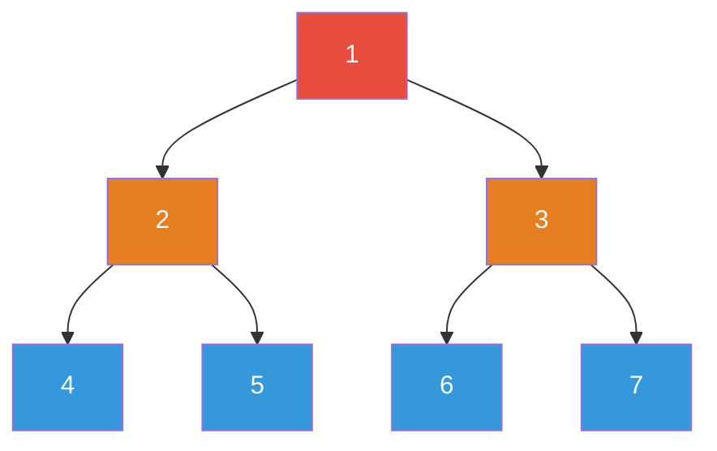
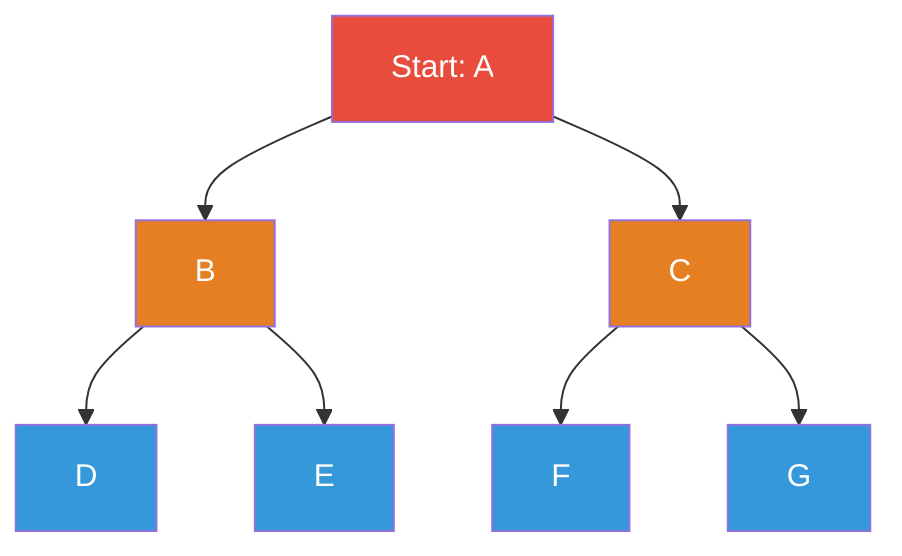

## Tree Terminology

A tree is a connected, acyclic, undirected graph. In computer science, trees are usually rooted and
directed (parent to child).

| Term        | Definition                                                         |
| ----------- | ------------------------------------------------------------------ |
| **Root**    | The topmost node, with no parent                                   |
| **Leaf**    | A node with no children                                            |
| **Depth**   | Distance from the root to a node (root has depth 0)                |
| **Height**  | Distance from a node to its deepest descendant (leaf has height 0) |
| **Level**   | All nodes at the same depth                                        |
| **Subtree** | A node and all its descendants                                     |
| **Degree**  | Number of children of a node                                       |
| **Path**    | Sequence of nodes from one node to another                         |

## Binary Trees

A binary tree is a tree where each node has at most two children: left and right.

### Classifications

| Type         | Property                                                                  | Nodes in tree of height $h$ |
| ------------ | ------------------------------------------------------------------------- | --------------------------- |
| **Full**     | Every node has 0 or 2 children                                            | $2h + 1$ (odd)              |
| **Complete** | All levels filled except possibly the last, which is filled left to right | $2^h$ to $2^{h+1} - 1$      |
| **Perfect**  | All internal nodes have 2 children, all leaves at same depth              | $2^{h+1} - 1$               |
| **Balanced** | Height is $O(\log n)$                                                     | Varies                      |

### Node Definition

```python
class TreeNode:
    def __init__(self, val=0, left=None, right=None):
        self.val = val
        self.left = left
        self.right = right
```

### Traversal



**Inorder (Left, Root, Right):** `4, 2, 5, 1, 6, 3, 7`

```python
def inorder(root):
    """Left -> Root -> Right. Yields sorted order for BST."""
    if root is None:
        return
    inorder(root.left)
    print(root.val, end=' ')
    inorder(root.right)
```

**Preorder (Root, Left, Right):** `1, 2, 4, 5, 3, 6, 7`

```python
def preorder(root):
    """Root -> Left -> Right. Used for tree serialisation."""
    if root is None:
        return
    print(root.val, end=' ')
    preorder(root.left)
    preorder(root.right)
```

**Postorder (Left, Right, Root):** `4, 5, 2, 6, 7, 3, 1`

```python
def postorder(root):
    """Left -> Right -> Root. Used for tree deletion, expression evaluation."""
    if root is None:
        return
    postorder(root.left)
    postorder(root.right)
    print(root.val, end=' ')
```

**Level-order (BFS):** `1, 2, 3, 4, 5, 6, 7`

```python
from collections import deque

def level_order(root):
    """BFS traversal by level."""
    if root is None:
        return []
    result = []
    queue = deque([root])
    while queue:
        level_size = len(queue)
        level = []
        for _ in range(level_size):
            node = queue.popleft()
            level.append(node.val)
            if node.left:
                queue.append(node.left)
            if node.right:
                queue.append(node.right)
        result.append(level)
    return result
```

### Iterative Traversals

```python
def inorder_iterative(root):
    """Iterative inorder using explicit stack. O(n) time, O(h) space."""
    result = []
    stack = []
    current = root
    while current or stack:
        while current:
            stack.append(current)
            current = current.left
        current = stack.pop()
        result.append(current.val)
        current = current.right
    return result

def preorder_iterative(root):
    """Iterative preorder. O(n) time, O(h) space."""
    if not root:
        return []
    result = []
    stack = [root]
    while stack:
        node = stack.pop()
        result.append(node.val)
        # Push right first so left is processed first
        if node.right:
            stack.append(node.right)
        if node.left:
            stack.append(node.left)
    return result
```

### Tree Properties

```python
def max_depth(root):
    """Maximum depth of a binary tree. O(n) time, O(h) space."""
    if root is None:
        return 0
    return 1 + max(max_depth(root.left), max_depth(root.right))

def is_balanced(root):
    """
    Check if a binary tree is height-balanced.
    A tree is balanced if the heights of the two subtrees of every node differ by at most 1.
    Time: O(n), Space: O(h)
    """
    def check(node):
        if node is None:
            return 0, True
        left_height, left_balanced = check(node.left)
        right_height, right_balanced = check(node.right)
        height = 1 + max(left_height, right_height)
        balanced = (left_balanced and right_balanced and
                    abs(left_height - right_height) <= 1)
        return height, balanced

    _, balanced = check(root)
    return balanced

def is_same_tree(p, q):
    """Check if two binary trees are identical. O(n) time."""
    if p is None and q is None:
        return True
    if p is None or q is None:
        return False
    return (p.val == q.val and
            is_same_tree(p.left, q.left) and
            is_same_tree(p.right, q.right))
```

## Binary Search Trees (BST)

A BST is a binary tree where for every node: all values in the left subtree are less than the node's
value, and all values in the right subtree are greater.

### Operations

```python
def bst_search(root, val):
    """Search for a value in a BST. O(h) time where h = height."""
    current = root
    while current:
        if val == current.val:
            return current
        elif val < current.val:
            current = current.left
        else:
            current = current.right
    return None

def bst_insert(root, val):
    """Insert a value into a BST. O(h) time."""
    if root is None:
        return TreeNode(val)
    if val < root.val:
        root.left = bst_insert(root.left, val)
    elif val > root.val:
        root.right = bst_insert(root.right, val)
    return root

def bst_delete(root, val):
    """
    Delete a value from a BST.
    O(h) time. Three cases:
    1. Leaf: just remove
    2. One child: replace with child
    3. Two children: replace with in-order successor, delete successor
    """
    if root is None:
        return None
    if val < root.val:
        root.left = bst_delete(root.left, val)
    elif val > root.val:
        root.right = bst_delete(root.right, val)
    else:
        # Found the node to delete
        if root.left is None:
            return root.right
        if root.right is None:
            return root.left
        # Two children: find in-order successor (smallest in right subtree)
        successor = root.right
        while successor.left:
            successor = successor.left
        root.val = successor.val
        root.right = bst_delete(root.right, successor.val)
    return root
```

### BST Complexity

| Operation          | Average (balanced) | Worst (degenerate) |
| ------------------ | ------------------ | ------------------ |
| Search             | $O(\log n)$        | $O(n)$             |
| Insert             | $O(\log n)$        | $O(n)$             |
| Delete             | $O(\log n)$        | $O(n)$             |
| Min/Max            | $O(\log n)$        | $O(n)$             |
| In-order traversal | $O(n)$             | $O(n)$             |

### Validate BST

```python
def is_valid_bst(root):
    """
    Check if a binary tree is a valid BST.
    Time: O(n), Space: O(h)
    """
    def validate(node, min_val, max_val):
        if node is None:
            return True
        if node.val <= min_val or node.val >= max_val:
            return False
        return (validate(node.left, min_val, node.val) and
                validate(node.right, node.val, max_val))

    return validate(root, float('-inf'), float('inf'))
```

:::warning

A common mistake is checking only that `node.left.val \lt node.val \lt node.right.val`. This is
insufficient — the BST property requires that **all** values in the left subtree are less than
`node.val`, not just the immediate left child. A node with value 5, left child with value 1, and
left-left grandchild with value 6 fails the BST property but passes the naive check.

:::

## AVL Trees

An AVL tree is a self-balancing BST where the heights of the two child subtrees of any node differ
by at most 1. Named after Adelson-Velsky and Landis (1962).

### Balance Factor

The balance factor of a node is:
$\text{bf}(node) = \text{height}(\text{left}) - \text{height}(\text{right})$.

Valid balance factors: $\{-1, 0, 1\}$. If the balance factor is outside this range, rotations are
needed to restore balance.

### Rotations

```python
def rotate_right(y):
    """
    Right rotation at node y.
         y              x
        / \            / \
       x   C   -->    A   y
      / \                / \
     A   B              B   C
    """
    x = y.left
    B = x.right
    x.right = y
    y.left = B
    # Update heights (if tracking)
    return x

def rotate_left(x):
    """
    Left rotation at node x.
       x                y
      / \              / \
     A   y    -->     x   C
        / \          / \
       B   C        A   B
    """
    y = x.right
    B = y.left
    y.left = x
    x.right = B
    return y
```

| Imbalance Case | Condition                     | Fix                                             |
| -------------- | ----------------------------- | ----------------------------------------------- |
| Left-Left      | bf(node) = 2, bf(left) = 1    | Right rotate at node                            |
| Right-Right    | bf(node) = -2, bf(right) = -1 | Left rotate at node                             |
| Left-Right     | bf(node) = 2, bf(left) = -1   | Left rotate at left, then right rotate at node  |
| Right-Left     | bf(node) = -2, bf(right) = 1  | Right rotate at right, then left rotate at node |

### Complexity

| Operation               | Time        |
| ----------------------- | ----------- |
| Search                  | $O(\log n)$ |
| Insert                  | $O(\log n)$ |
| Delete                  | $O(\log n)$ |
| Rotations per operation | At most 2   |

AVL trees guarantee $O(\log n)$ height, which is at most $1.44 \log_2(n+2) - 0.328$. In practice,
AVL trees are taller and require more rotations than red-black trees, but provide faster lookups
because the tree is more strictly balanced.

## Red-Black Trees

A red-black tree is a self-balancing BST with the following properties:

1. Every node is either red or black
2. The root is black
3. Every leaf (NIL) is black
4. If a node is red, both its children are black (no two consecutive reds)
5. Every path from a node to its descendant NIL nodes contains the same number of black nodes

Red-black trees guarantee $O(\log n)$ height — specifically, the height is at most $2 \log_2(n+1)$.
This is less strict than AVL trees, meaning red-black trees are typically shorter but may have
slower individual lookups.

Red-black trees are used in the Linux kernel (for `CFS` scheduler, `mm` memory management), Java's
`TreeMap`/`TreeSet`, C++ `std::map`/`std::set`, and many other standard library implementations.

:::info

**AVL vs Red-Black:** Use AVL when lookups dominate (databases, dictionaries). Use red-black when
insertions and deletions are frequent (schedulers, event queues). In practice, the difference is
small for most workloads.

:::

## B-Trees

B-trees are balanced search trees designed for systems that read and write large blocks of data
(disk pages, cache lines). Unlike binary trees, each node in a B-tree can have multiple children.

A B-tree of order $m$ (minimum degree) satisfies:

1. Every node has at most $2m - 1$ keys and $2m$ children
2. Every non-root node has at least $m - 1$ keys and $m$ children
3. The root has at least 1 key
4. All leaves appear at the same depth

### Why B-Trees Matter for Databases

A database index stored as a binary tree with 10 million rows has height $\approx 24$. Each node
access is a disk seek (~10ms), so a lookup costs ~240ms. A B-tree with order $m = 100$ (fitting in a
4KB disk page) has height $\approx 3$, so a lookup costs ~30ms. This 8x improvement is why every
major database uses B-tree variants (B+ trees) for indexing.

| Structure          | Height for $n = 10^7$ | Disk seeks |
| ------------------ | --------------------- | ---------- |
| Binary tree        | ~24                   | ~24        |
| AVL tree           | ~24                   | ~24        |
| B-tree (order 100) | ~3                    | ~3         |
| B-tree (order 400) | ~2                    | ~2         |

## Heaps

A heap is a complete binary tree with the heap property: in a max-heap, every node is greater than
or equal to its children; in a min-heap, every node is less than or equal to its children.

```python
def heap_sort(arr):
    """
    In-place heapsort. O(n log n) time, O(1) space.
    """
    n = len(arr)

    # Build max-heap: O(n)
    for i in range(n // 2 - 1, -1, -1):
        _sift_down(arr, n, i)

    # Extract elements one by one: O(n log n)
    for i in range(n - 1, 0, -1):
        arr[0], arr[i] = arr[i], arr[0]  # move max to end
        _sift_down(arr, i, 0)

    return arr  # sorted in ascending order

def _sift_down(arr, n, i):
    """Maintain max-heap property starting from index i."""
    largest = i
    left = 2 * i + 1
    right = 2 * i + 2
    if left < n and arr[left] > arr[largest]:
        largest = left
    if right < n and arr[right] > arr[largest]:
        largest = right
    if largest != i:
        arr[i], arr[largest] = arr[largest], arr[i]
        _sift_down(arr, n, largest)
```

### Applications of Heaps

| Application          | Heap Type             | Key Idea                      |
| -------------------- | --------------------- | ----------------------------- |
| Priority queue       | Min-heap or max-heap  | Extract min/max efficiently   |
| Heapsort             | Max-heap (ascending)  | Repeatedly extract max        |
| Median maintenance   | Two heaps (min + max) | Balance heaps for median      |
| K largest elements   | Min-heap of size $k$  | Keep smallest of the top $k$  |
| Dijkstra's algorithm | Min-heap              | Always process closest vertex |
| Huffman coding       | Min-heap              | Build optimal prefix code     |

## Tries (Prefix Trees)

A trie is a tree where each node represents a character in a prefix. Words are stored as paths from
the root. The root represents the empty string.

```python
class TrieNode:
    def __init__(self):
        self.children = {}
        self.is_end = False

class Trie:
    """
    Trie (prefix tree) for string operations.
    insert: O(k), search: O(k), starts_with: O(k)
    where k = length of the string
    Space: O(total characters in all inserted strings)
    """
    def __init__(self):
        self.root = TrieNode()

    def insert(self, word):
        node = self.root
        for c in word:
            if c not in node.children:
                node.children[c] = TrieNode()
            node = node.children[c]
        node.is_end = True

    def search(self, word):
        node = self.root
        for c in word:
            if c not in node.children:
                return False
            node = node.children[c]
        return node.is_end

    def starts_with(self, prefix):
        node = self.root
        for c in prefix:
            if c not in node.children:
                return False
            node = node.children[c]
        return True

    def delete(self, word):
        """Delete a word from the trie. O(k)."""
        def _delete(node, word, depth):
            if depth == len(word):
                if not node.is_end:
                    return False  # word not in trie
                node.is_end = False
                return len(node.children) == 0
            c = word[depth]
            if c not in node.children:
                return False
            should_delete = _delete(node.children[c], word, depth + 1)
            if should_delete:
                del node.children[c]
                return len(node.children) == 0 and not node.is_end
            return False

        _delete(self.root, word, 0)
```

### Trie vs Hash Set for Strings

| Operation             | Trie                    | Hash Set               |
| --------------------- | ----------------------- | ---------------------- |
| Insert                | $O(k)$                  | $O(k)$                 |
| Exact search          | $O(k)$                  | $O(k)$ average         |
| Prefix search         | $O(k)$                  | $O(n \cdot k)$         |
| Space                 | $O(\text{total chars})$ | $O(n \cdot k)$         |
| Min string prefix     | $O(k)$                  | Not supported          |
| Longest common prefix | $O(k)$                  | Not directly supported |

Tries are the right choice when you need prefix-based operations: autocomplete, spell checking, IP
routing (longest prefix match), and word games.

## Graph Representations

A graph $G = (V, E)$ consists of vertices $V$ and edges $E$.

### Adjacency List

Each vertex stores a list (or set) of its neighbours.

```python
class Graph:
    """
    Graph using adjacency list.
    Space: O(V + E)
    """
    def __init__(self):
        self.adj = {}  # vertex -> list of (neighbour, weight)

    def add_vertex(self, v):
        if v not in self.adj:
            self.adj[v] = []

    def add_edge(self, u, v, weight=1, directed=False):
        self.add_vertex(u)
        self.add_vertex(v)
        self.adj[u].append((v, weight))
        if not directed:
            self.adj[v].append((u, weight))

    def neighbours(self, v):
        return self.adj.get(v, [])
```

### Adjacency Matrix

A $V \times V$ matrix where `matrix[u][v]` represents the edge weight (or 0/True/False for
unweighted/unweighted).

```python
class GraphMatrix:
    """
    Graph using adjacency matrix.
    Space: O(V^2)
    """
    def __init__(self, n):
        self.n = n
        self.matrix = [[0] * n for _ in range(n)]

    def add_edge(self, u, v, weight=1, directed=False):
        self.matrix[u][v] = weight
        if not directed:
            self.matrix[v][u] = weight
```

| Representation   | Space      | Check edge $u$-$v$    | Iterate neighbours    | Sparse graph |
| ---------------- | ---------- | --------------------- | --------------------- | ------------ |
| Adjacency list   | $O(V + E)$ | $O(\text{degree}(u))$ | $O(\text{degree}(u))$ | Efficient    |
| Adjacency matrix | $O(V^2)$   | $O(1)$                | $O(V)$                | Wasteful     |

:::info

Use adjacency lists for sparse graphs (most real-world graphs — social networks, web graphs, road
networks). Use adjacency matrices for dense graphs (fully connected or nearly so) or when you need
$O(1)$ edge existence checks.

:::

## Graph Traversal

### BFS (Breadth-First Search)

Explore neighbours before going deeper. Uses a queue. Finds shortest path in unweighted graphs.

```python
from collections import deque

def bfs(graph, start):
    """
    BFS from start vertex.
    Time: O(V + E), Space: O(V)
    """
    visited = {start}
    queue = deque([start])
    result = []

    while queue:
        vertex = queue.popleft()
        result.append(vertex)
        for neighbour, _ in graph.neighbours(vertex):
            if neighbour not in visited:
                visited.add(neighbour)
                queue.append(neighbour)

    return result

def bfs_shortest_path(graph, start, end):
    """
    Shortest path in unweighted graph using BFS.
    Time: O(V + E), Space: O(V)
    """
    if start == end:
        return [start]
    visited = {start}
    queue = deque([(start, [start])])

    while queue:
        vertex, path = queue.popleft()
        for neighbour, _ in graph.neighbours(vertex):
            if neighbour == end:
                return path + [neighbour]
            if neighbour not in visited:
                visited.add(neighbour)
                queue.append((neighbour, path + [neighbour]))

    return None  # no path exists
```



BFS order: `A, B, C, D, E, F, G`

### DFS (Depth-First Search)

Explore as deep as possible before backtracking. Uses a stack (or recursion).

```python
def dfs_recursive(graph, start, visited=None):
    """
    DFS from start vertex (recursive).
    Time: O(V + E), Space: O(V)
    """
    if visited is None:
        visited = set()
    visited.add(start)
    result = [start]
    for neighbour, _ in graph.neighbours(start):
        if neighbour not in visited:
            result.extend(dfs_recursive(graph, neighbour, visited))
    return result

def dfs_iterative(graph, start):
    """
    DFS from start vertex (iterative with explicit stack).
    Time: O(V + E), Space: O(V)
    """
    visited = set()
    stack = [start]
    result = []

    while stack:
        vertex = stack.pop()
        if vertex in visited:
            continue
        visited.add(vertex)
        result.append(vertex)
        # Push neighbours in reverse order to match recursive order
        for neighbour, _ in reversed(graph.neighbours(vertex)):
            if neighbour not in visited:
                stack.append(neighbour)

    return result
```

### BFS vs DFS

| Property               | BFS                       | DFS                  |
| ---------------------- | ------------------------- | -------------------- |
| Data structure         | Queue                     | Stack / recursion    |
| Space                  | $O(V)$ (queue)            | $O(V)$ (stack)       |
| Shortest path          | Yes (unweighted)          | No                   |
| Memory for deep graphs | Uses more (wide frontier) | Uses less (one path) |
| Topological sort       | With Kahn's algorithm     | With post-order      |
| Cycle detection        | Yes                       | Yes                  |
| Connected components   | Yes                       | Yes                  |

## Topological Sort

A topological ordering of a DAG is a linear ordering of vertices such that for every directed edge
$u \to v$, $u$ comes before $v$ in the ordering.

```python
def topological_sort_kahn(graph):
    """
    Kahn's algorithm for topological sort using BFS.
    Time: O(V + E), Space: O(V)
    Returns None if the graph has a cycle.
    """
    in_degree = {v: 0 for v in graph.adj}
    for v in graph.adj:
        for neighbour, _ in graph.neighbours(v):
            in_degree[neighbour] += 1

    queue = deque([v for v in graph.adj if in_degree[v] == 0])
    result = []

    while queue:
        vertex = queue.popleft()
        result.append(vertex)
        for neighbour, _ in graph.neighbours(vertex):
            in_degree[neighbour] -= 1
            if in_degree[neighbour] == 0:
                queue.append(neighbour)

    if len(result) != len(graph.adj):
        return None  # cycle detected
    return result

def topological_sort_dfs(graph):
    """
    DFS-based topological sort.
    Time: O(V + E), Space: O(V)
    """
    WHITE, GRAY, BLACK = 0, 1, 2
    color = {v: WHITE for v in graph.adj}
    result = []

    def dfs(v):
        color[v] = GRAY
        for neighbour, _ in graph.neighbours(v):
            if color[neighbour] == GRAY:
                return False  # back edge = cycle
            if color[neighbour] == WHITE:
                if not dfs(neighbour):
                    return False
        color[v] = BLACK
        result.append(v)
        return True

    for v in graph.adj:
        if color[v] == WHITE:
            if not dfs(v):
                return None

    return result[::-1]  # reverse for correct order
```

## Graph Properties

### Connected Components

```python
def count_components(graph):
    """
    Count connected components in an undirected graph.
    Time: O(V + E), Space: O(V)
    """
    visited = set()
    count = 0
    for vertex in graph.adj:
        if vertex not in visited:
            count += 1
            dfs_recursive(graph, vertex, visited)
    return count
```

### Bipartite Check

A graph is bipartite if its vertices can be divided into two sets such that no edge connects
vertices within the same set. Equivalently, the graph is 2-colourable.

```python
def is_bipartite(graph):
    """
    Check if a graph is bipartite using BFS colouring.
    Time: O(V + E), Space: O(V)
    """
    colour = {}  # vertex -> 0 or 1
    for start in graph.adj:
        if start in colour:
            continue
        colour[start] = 0
        queue = deque([start])
        while queue:
            vertex = queue.popleft()
            for neighbour, _ in graph.neighbours(vertex):
                if neighbour not in colour:
                    colour[neighbour] = 1 - colour[vertex]
                    queue.append(neighbour)
                elif colour[neighbour] == colour[vertex]:
                    return False
    return True
```

### Cycle Detection

```python
def has_cycle_undirected(graph):
    """Detect cycle in undirected graph using DFS. O(V + E)."""
    visited = set()

    def dfs(v, parent):
        visited.add(v)
        for neighbour, _ in graph.neighbours(v):
            if neighbour not in visited:
                if dfs(neighbour, v):
                    return True
            elif neighbour != parent:
                return True
        return False

    for v in graph.adj:
        if v not in visited:
            if dfs(v, None):
                return True
    return False

def has_cycle_directed(graph):
    """Detect cycle in directed graph using DFS with three colours. O(V + E)."""
    WHITE, GRAY, BLACK = 0, 1, 2
    colour = {v: WHITE for v in graph.adj}

    def dfs(v):
        colour[v] = GRAY
        for neighbour, _ in graph.neighbours(v):
            if colour[neighbour] == GRAY:
                return True  # back edge
            if colour[neighbour] == WHITE:
                if dfs(neighbour):
                    return True
        colour[v] = BLACK
        return False

    return any(dfs(v) for v in graph.adj if colour[v] == WHITE)
```

## Common Pitfalls

### 1. Modifying Tree Structure During Traversal

If you insert or delete nodes while iterating over a tree (e.g., deleting all nodes matching a
condition), the traversal may skip nodes or follow stale pointers. Either collect nodes to modify
and apply changes after traversal, or use a recursive approach that handles modification safely.

### 2. BST Property Violations

When implementing BST operations manually, forgetting to check the BST invariant after deletion can
leave the tree in an invalid state. The in-order successor replacement must be applied correctly:
replace the node's value with the successor's value, then delete the successor from the right
subtree.

### 3. Integer Overflow in Recursive Tree Depth

For deeply unbalanced trees (or worst-case linked lists masquerading as trees), recursive depth can
exceed the stack limit. For trees with $n$ nodes, the worst-case recursion depth is $n$. Use
iterative traversal or explicitly check tree balance before recursion.

### 4. Confusing Graph Traversal Visited Sets

In BFS/DFS, the visited set must be marked when a vertex is **enqueued** (BFS) or **pushed** (DFS),
not when it is **dequeued/popped**. Marking on dequeue causes duplicate vertices in the queue,
leading to exponential blowup for dense graphs.

### 5. Assuming All Graphs Are Connected

Many graph algorithms assume the graph is connected. For disconnected graphs, you must wrap the
algorithm in a loop over all vertices, starting a new BFS/DFS from each unvisited vertex. This
applies to cycle detection, bipartite checking, and component counting.

### 6. Trie Memory Overhead

A naive trie implementation using dictionaries can use 5-10x more memory than a hash set for the
same data, because each node stores a dictionary object with its own overhead. For
memory-constrained environments, use arrays (indexed by character) or radix trees ( Patricia tries)
which compress chains of single-child nodes.

### 7. Not Handling Disconnected Graphs in Topological Sort

A DAG can have multiple disconnected components. Both Kahn's algorithm and DFS-based topological
sort must process all vertices, not just those reachable from a single start vertex. Kahn's
algorithm naturally handles this (all vertices with in-degree 0 are enqueued initially). DFS-based
sort must loop over all vertices.
