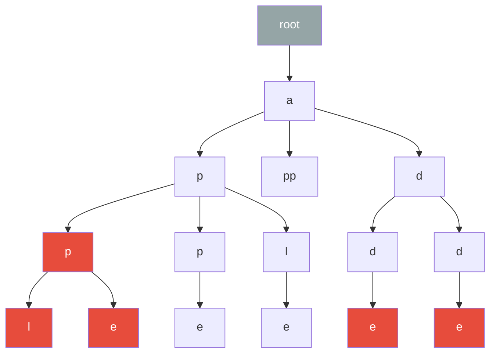

## Trie (Prefix Tree)

A trie is a tree data structure where each node represents a character of a string. The path from
the root to any node spells out a prefix, and nodes marked as "end of word" represent complete
strings in the set.

### Node Definition

```python
class TrieNode:
    __slots__ = ('children', 'is_end', 'word')
    def __init__(self):
        self.children = {}
        self.is_end = False
        self.word = None
```

### Operations

```python
class Trie:
    """
    Trie (prefix tree) for string storage and retrieval.
    Insert: O(m) where m = length of word
    Search: O(m)
    StartsWith: O(m)
    Space: O(ALPHABET_SIZE * total_characters)
    """
    def __init__(self):
        self.root = TrieNode()

    def insert(self, word):
        node = self.root
        for ch in word:
            if ch not in node.children:
                node.children[ch] = TrieNode()
            node = node.children[ch]
        node.is_end = True
        node.word = word

    def search(self, word):
        node = self.root
        for ch in word:
            if ch not in node.children:
                return False
            node = node.children[ch]
        return node.is_end

    def starts_with(self, prefix):
        node = self.root
        for ch in prefix:
            if ch not in node.children:
                return False
            node = node.children[ch]
        return True

    def delete(self, word):
        def _delete(node, word, depth):
            if not node:
                return False
            if depth == len(word):
                if not node.is_end:
                    return False
                node.is_end = False
                return len(node.children) == 0
            ch = word[depth]
            if ch not in node.children:
                return False
            should_delete = _delete(node.children[ch], word, depth + 1)
            if should_delete:
                del node.children[ch]
                return len(node.children) == 0 and not node.is_end
            return False

        _delete(self.root, word, 0)

    def words_with_prefix(self, prefix):
        """Collect all words with given prefix. Time: O(m + k * L) where k = results."""
        node = self.root
        for ch in prefix:
            if ch not in node.children:
                return []
            node = node.children[ch]
        results = []
        def _collect(n):
            if n.is_end:
                results.append(n.word)
            for ch, child in n.children.items():
                _collect(child)
        _collect(node)
        return results
```



### Complexity Analysis

| Operation     | Time        | Space                   |
| ------------- | ----------- | ----------------------- |
| Insert        | $O(m)$      | $O(1)$ additional nodes |
| Search        | $O(m)$      | $O(1)$                  |
| Delete        | $O(m)$      | $O(1)$ freed nodes      |
| StartsWith    | $O(m)$      | $O(1)$                  |
| Prefix search | $O(m + kL)$ | $O(kL)$ for results     |

where $m$ is the word length, $k$ is the number of results, and $L$ is the average result length.

:::info

A trie with $n$ keys of total length $L$ has at most $L + 1$ nodes. In the worst case (no shared
prefixes), this is $\sum |word_i| + 1$. The space can be reduced using a radix tree (compressed
trie) which merges chains of single-child nodes.

:::

## Compressed Trie (Radix Tree / Patricia Trie)

A compressed trie merges chains of nodes with only one child into single edges labelled with
substrings. This reduces the number of nodes and eliminates unnecessary internal nodes.

```python
class RadixNode:
    def __init__(self, label=""):
        self.label = label
        self.children = {}
        self.is_end = False
        self.word = None

class RadixTrie:
    """
    Compressed trie (radix tree / Patricia trie).
    Insert: O(m^2) worst case, O(m) amortised
    Search: O(m)
    Space: O(n) nodes where n = number of words (in the worst case)
    """
    def __init__(self):
        self.root = RadixNode()

    def insert(self, word):
        node = self.root
        i = 0
        while i < len(word):
            ch = word[i]
            if ch not in node.children:
                node.children[ch] = RadixNode(word[i:])
                node.children[ch].is_end = True
                node.children[ch].word = word
                return
            child = node.children[ch]
            label = child.label
            j = 0
            while j < len(label) and i + j < len(word) and label[j] == word[i + j]:
                j += 1
            if j == len(label):
                node = child
                i += j
            elif j == 0:
                node = child
            else:
                prefix = label[:j]
                suffix = label[j:]
                split = RadixNode(suffix)
                split.children = child.children
                split.is_end = child.is_end
                split.word = child.word
                child.label = prefix
                child.children = {}
                child.is_end = False
                child.word = None
                if i + j < len(word):
                    remaining = word[i + j:]
                    child.children[remaining[0]] = RadixNode(remaining)
                    child.children[remaining[0]].is_end = True
                    child.children[remaining[0]].word = word
                else:
                    child.is_end = True
                    child.word = word
                return
        node.is_end = True
        node.word = word

    def search(self, word):
        node = self.root
        i = 0
        while i < len(word):
            ch = word[i]
            if ch not in node.children:
                return False
            child = node.children[ch]
            label = child.label
            if word[i:i + len(label)] != label:
                return False
            i += len(label)
            node = child
        return node.is_end
```

## Suffix Trie

A suffix trie of a string $S$ of length $n$ contains all suffixes of $S$. It has $O(n^2)$ nodes (in
the worst case), which is too large for practical use.

### Construction

```python
class SuffixTrie:
    """
    Suffix trie — contains all suffixes of a string.
    Construction: O(n^2) time and space
    Pattern search: O(m) where m = pattern length
    """
    def __init__(self, text):
        self.root = TrieNode()
        for i in range(len(text)):
            node = self.root
            for j in range(i, len(text)):
                ch = text[j]
                if ch not in node.children:
                    node.children[ch] = TrieNode()
                node = node.children[ch]

    def search(self, pattern):
        """Check if pattern is a substring. O(m)."""
        node = self.root
        for ch in pattern:
            if ch not in node.children:
                return False
            node = node.children[ch]
        return True
```

## Suffix Tree

A suffix tree is a compressed suffix trie. It has at most $2n - 1$ nodes for a string of length $n$
(including $n$ leaves, one per suffix).

### Properties

| Property                   | Value                             |
| -------------------------- | --------------------------------- |
| Number of nodes            | $O(n)$                            |
| Construction               | $O(n)$ (Ukkonen's algorithm)      |
| Space                      | $O(n)$                            |
| Substring search           | $O(m)$ where $m$ = pattern length |
| Longest repeated substring | Find deepest internal node        |
| Longest common substring   | Generalised suffix tree           |

### Ukkonen's Algorithm (Conceptual)

Ukkonen's algorithm builds the suffix tree in $O(n)$ time by processing the string left to right,
one character at a time. It maintains an implicit suffix tree during construction and uses suffix
links to efficiently extend all suffixes.

The key ideas:

1. **Implicit suffix tree**: during construction, suffixes may end in the middle of an edge
2. **Suffix links**: each internal node has a link to the node representing its longest proper
   suffix
3. **Rule 1 / Rule 2 extension**: when adding character $S[i]$, extend all suffixes. Rule 1 applies
   when the extension is trivial (character already exists on the current edge); Rule 2 applies when
   a new leaf must be created

```python
class SuffixTreeNode:
    def __init__(self):
        self.children = {}
        self.suffix_link = None
        self.start = -1
        self.end = -1
        self.suffix_index = -1

class SuffixTree:
    """
    Suffix tree using Ukkonen's algorithm.
    Construction: O(n)
    Space: O(n)
    Substring search: O(m)
    """
    def __init__(self, text):
        self.text = text
        self.n = len(text)
        self.root = SuffixTreeNode()
        self.root.suffix_link = self.root
        self.active_node = self.root
        self.active_edge = -1
        self.active_length = 0
        self.remaining = 0
        self.leaf_end = -1
        self._build()

    def _build(self):
        for i in range(self.n):
            self._extend(i)

    def _extend(self, pos):
        self.leaf_end = pos
        self.remaining += 1
        last_new_node = None
        while self.remaining > 0:
            if self.active_length == 0:
                self.active_edge = pos
            if self.text[self.active_edge] not in self.active_node.children:
                leaf = SuffixTreeNode()
                leaf.start = pos
                leaf.end = self.n - 1
                leaf.suffix_index = pos - self.remaining + 1
                self.active_node.children[self.text[self.active_edge]] = leaf
                if last_new_node:
                    last_new_node.suffix_link = self.active_node
                    last_new_node = None
            else:
                next_node = self.active_node.children[self.text[self.active_edge]]
                edge_len = self._edge_length(next_node)
                if self.active_length >= edge_len:
                    self.active_edge += edge_len
                    self.active_length -= edge_len
                    self.active_node = next_node
                    continue
                if self.text[next_node.start + self.active_length] == self.text[pos]:
                    if last_new_node:
                        last_new_node.suffix_link = self.active_node
                    self.active_length += 1
                    break
                split = SuffixTreeNode()
                split.start = next_node.start
                split.end = next_node.start + self.active_length - 1
                self.active_node.children[self.text[self.active_edge]] = split
                leaf = SuffixTreeNode()
                leaf.start = pos
                leaf.end = self.n - 1
                leaf.suffix_index = pos - self.remaining + 1
                split.children[self.text[pos]] = leaf
                next_node.start += self.active_length
                split.children[self.text[next_node.start]] = next_node
                if last_new_node:
                    last_new_node.suffix_link = split
                last_new_node = split
            self.remaining -= 1
            if self.active_node == self.root and self.active_length > 0:
                self.active_length -= 1
                self.active_edge = pos - self.remaining + 1
            elif self.active_node != self.root:
                self.active_node = self.active_node.suffix_link

    def _edge_length(self, node):
        return node.end - node.start + 1

    def search(self, pattern):
        """Check if pattern exists as a substring. O(m)."""
        node = self.root
        i = 0
        while i < len(pattern):
            if pattern[i] not in node.children:
                return False
            child = node.children[pattern[i]]
            j = child.start
            while j <= min(child.end, child.start + len(pattern) - i - 1):
                if self.text[j] != pattern[i]:
                    return False
                i += 1
                j += 1
            if i < len(pattern):
                node = child
        return True
```

## Suffix Array

A suffix array `SA` of a string $S$ of length $n$ is a permutation of $\{0, 1, \ldots, n-1\}$ such
that $S[SA[0]:] \lt S[SA[1]:] \lt \cdots \lt S[SA[n-1]:]$.

### Construction

```python
def build_suffix_array(s):
    """
    Build suffix array using the prefix doubling algorithm.
    Time: O(n log^2 n)
    Space: O(n)
    """
    n = len(s)
    k = 1
    rank = [ord(c) for c in s]
    tmp = [0] * n
    sa = list(range(n))

    while k < n:
        def sort_key(i):
            return (rank[i], rank[i + k] if i + k < n else -1)
        sa.sort(key=sort_key)
        tmp[sa[0]] = 0
        for i in range(1, n):
            tmp[sa[i]] = tmp[sa[i - 1]]
            if sort_key(sa[i]) != sort_key(sa[i - 1]):
                tmp[sa[i]] += 1
        rank = tmp[:]
        if rank[sa[n - 1]] == n - 1:
            break
        k *= 2

    return sa
```

### LCP Array

The Longest Common Prefix (LCP) array stores the length of the longest common prefix between
consecutive suffixes in the suffix array. `LCP[i] = lcp(S[SA[i]:], S[SA[i-1]:])`.

```python
def build_lcp_array(s, sa):
    """
    Build LCP array using Kasai's algorithm.
    Time: O(n)
    Space: O(n)
    """
    n = len(s)
    rank = [0] * n
    for i in range(n):
        rank[sa[i]] = i
    lcp = [0] * n
    h = 0
    for i in range(n):
        if rank[i] > 0:
            j = sa[rank[i] - 1]
            while i + h < n and j + h < n and s[i + h] == s[j + h]:
                h += 1
            lcp[rank[i]] = h
            if h > 0:
                h -= 1
    return lcp
```

### Pattern Matching with Suffix Array

```python
def suffix_array_search(s, sa, pattern):
    """
    Binary search for pattern in suffix array.
    Time: O(m log n) where m = pattern length
    Returns: (first_occurrence, last_occurrence) or (-1, -1)
    """
    n = len(s)
    m = len(pattern)

    def compare(idx):
        j = 0
        while j < m and idx + j < n:
            if pattern[j] < s[idx + j]:
                return -1
            if pattern[j] > s[idx + j]:
                return 1
            j += 1
        return 0 if j == m else -1

    lo, hi = 0, n - 1
    while lo <= hi:
        mid = (lo + hi) // 2
        cmp = compare(sa[mid])
        if cmp == 0:
            left = mid
            right = mid
            while left > 0 and compare(sa[left - 1]) == 0:
                left -= 1
            while right < n - 1 and compare(sa[right + 1]) == 0:
                right += 1
            return (left, right)
        elif cmp < 0:
            hi = mid - 1
        else:
            lo = mid + 1
    return (-1, -1)
```

:::tip

For most practical purposes, suffix arrays are preferred over suffix trees because they use less
memory (an array of integers vs a tree of objects) and are easier to implement. The LCP array
enables efficient computation of longest common substrings and other string problems.

:::

## Aho-Corasick Algorithm

Aho-Corasick finds all occurrences of a set of patterns in a text simultaneously. It builds an
automaton from a trie augmented with failure links.

### Failure Function

The failure link of a node points to the longest proper suffix of the current path that is also a
prefix of some pattern. This is analogous to the KMP failure function but for multiple patterns.

```python
from collections import deque

class AhoCorasickNode:
    def __init__(self):
        self.children = {}
        self.fail = None
        self.output = []
        self.pattern_indices = []

class AhoCorasick:
    """
    Multi-pattern string matching using Aho-Corasick.
    Build: O(total_pattern_length)
    Search: O(text_length + total_matches)
    Space: O(total_pattern_length * ALPHABET_SIZE)
    """
    def __init__(self):
        self.root = AhoCorasickNode()

    def add_pattern(self, pattern, pattern_idx):
        node = self.root
        for ch in pattern:
            if ch not in node.children:
                node.children[ch] = AhoCorasickNode()
            node = node.children[ch]
        node.pattern_indices.append(pattern_idx)

    def build(self):
        """Build failure links using BFS. O(total_pattern_length)."""
        queue = deque()
        for ch, child in self.root.children.items():
            child.fail = self.root
            queue.append(child)
        self.root.fail = self.root

        while queue:
            curr = queue.popleft()
            for ch, child in curr.children.items():
                fail = curr.fail
                while fail and ch not in fail.children:
                    fail = fail.fail
                child.fail = fail.children[ch] if fail and ch in fail.children else self.root
                child.output = child.pattern_indices + child.fail.output
                queue.append(child)

    def search(self, text):
        """
        Find all pattern occurrences in text.
        Time: O(text_length + total_matches)
        Returns list of (end_index, pattern_indices)
        """
        results = []
        node = self.root
        for i, ch in enumerate(text):
            while node and ch not in node.children:
                node = node.fail
            if ch in node.children:
                node = node.children[ch]
            else:
                node = self.root
            if node.output:
                results.append((i, list(node.output)))
        return results
```

## Knuth-Morris-Pratt (KMP)

KMP is a single-pattern matching algorithm that achieves $O(n + m)$ time by preprocessing the
pattern to compute a failure function.

### Failure Function

The failure function `pi[i]` is the length of the longest proper prefix of `pattern[0:i+1]` that is
also a suffix of `pattern[0:i+1]`.

```python
def kmp_failure(pattern):
    """
    Compute KMP failure (prefix) function.
    Time: O(m) where m = len(pattern)
    """
    m = len(pattern)
    pi = [0] * m
    j = 0
    for i in range(1, m):
        while j > 0 and pattern[i] != pattern[j]:
            j = pi[j - 1]
        if pattern[i] == pattern[j]:
            j += 1
        pi[i] = j
    return pi
```

### Pattern Matching

```python
def kmp_search(text, pattern):
    """
    KMP string matching.
    Time: O(n + m) where n = len(text), m = len(pattern)
    Space: O(m) for the failure function
    Returns list of starting indices of matches.
    """
    if not pattern:
        return list(range(len(text) + 1))
    n, m = len(text), len(pattern)
    pi = kmp_failure(pattern)
    j = 0
    matches = []
    for i in range(n):
        while j > 0 and text[i] != pattern[j]:
            j = pi[j - 1]
        if text[i] == pattern[j]:
            j += 1
        if j == m:
            matches.append(i - m + 1)
            j = pi[j - 1]
    return matches
```

### Correctness Proof Sketch

The key invariant: after processing `text[i]`, the variable `j` equals the length of the longest
prefix of `pattern` that is a suffix of `text[0:i+1]`. When `j == m`, we have found a complete match
ending at position `i`. The failure function ensures that we never backtrack in the text — each
character of the text is examined at most once, giving $O(n)$ time for the search phase plus $O(m)$
for preprocessing.

## Rabin-Karp Algorithm

Rabin-Karp uses hashing to find pattern matches. It computes a rolling hash of the text and compares
it with the hash of the pattern.

### Rolling Hash

$$h(s[i..j]) = \left(\sum_{k=i}^{j} s[k] \cdot p^{j-k}\right) \bmod q$$

When sliding the window by one position:

$$h(s[i+1..j+1]) = (h(s[i..j]) - s[i] \cdot p^{m-1}) \cdot p + s[j+1] \bmod q$$

```python
def rabin_karp_search(text, pattern, base=256, mod=10**9 + 7):
    """
    Rabin-Karp string matching.
    Time: O(n + m) average, O(nm) worst case
    Space: O(1)
    """
    n, m = len(text), len(pattern)
    if m > n:
        return []
    if m == 0:
        return list(range(n + 1))

    base_pow_m = pow(base, m - 1, mod)
    pattern_hash = 0
    window_hash = 0

    for i in range(m):
        pattern_hash = (pattern_hash * base + ord(pattern[i])) % mod
        window_hash = (window_hash * base + ord(text[i])) % mod

    matches = []
    for i in range(n - m + 1):
        if window_hash == pattern_hash:
            if text[i:i + m] == pattern:
                matches.append(i)
        if i < n - m:
            window_hash = (window_hash - ord(text[i]) * base_pow_m) % mod
            window_hash = (window_hash * base + ord(text[i + m])) % mod
            window_hash %= mod

    return matches
```

### Double Hashing for Collision Reduction

```python
def rabin_karp_double_hash(text, pattern):
    """
    Rabin-Karp with double hashing to reduce false positives.
    Time: O(n + m) average
    """
    n, m = len(text), len(pattern)
    if m > n:
        return []

    MOD1 = 10**9 + 7
    MOD2 = 10**9 + 9
    BASE = 256

    def compute_hashes(s, mod):
        h = 0
        for c in s:
            h = (h * BASE + ord(c)) % mod
        return h

    p1, p2 = compute_hashes(pattern, MOD1), compute_hashes(pattern, MOD2)
    t1, t2 = compute_hashes(text[:m], MOD1), compute_hashes(text[:m], MOD2)

    base_pow_m1 = pow(BASE, m - 1, MOD1)
    base_pow_m2 = pow(BASE, m - 1, MOD2)

    matches = []
    for i in range(n - m + 1):
        if t1 == p1 and t2 == p2:
            if text[i:i + m] == pattern:
                matches.append(i)
        if i < n - m:
            t1 = (t1 - ord(text[i]) * base_pow_m1) % MOD1
            t1 = (t1 * BASE + ord(text[i + m])) % MOD1
            t2 = (t2 - ord(text[i]) * base_pow_m2) % MOD2
            t2 = (t2 * BASE + ord(text[i + m])) % MOD2

    return matches
```

## Boyer-Moore Algorithm

Boyer-Moore is often the fastest string matching algorithm in practice because it skips sections of
the text that cannot possibly match.

### Bad Character Rule

When a mismatch occurs at position $j$ of the pattern with character $c$ in the text, shift the
pattern so that the rightmost occurrence of $c$ in `pattern[0:j]` (if any) aligns with the text
character.

### Good Suffix Rule

When a mismatch occurs after a partial match of length $k$, shift the pattern so that the next
occurrence of the suffix (or a prefix of it) aligns with the matched portion of the text.

```python
def boyer_moore_search(text, pattern):
    """
    Boyer-Moore string matching with bad character rule.
    Time: O(nm) worst case, O(n/m) best case (sublinear!)
    Space: O(ALPHABET_SIZE + m)
    """
    n, m = len(text), len(pattern)
    if m == 0:
        return list(range(n + 1))
    if m > n:
        return []

    bad_char = {}
    for i in range(m):
        bad_char[pattern[i]] = i

    matches = []
    i = 0
    while i <= n - m:
        j = m - 1
        while j >= 0 and pattern[j] == text[i + j]:
            j -= 1
        if j < 0:
            matches.append(i)
            i += 1
        else:
            shift = bad_char.get(text[i + j], -1)
            i += max(1, j - shift)

    return matches
```

:::warning

Boyer-Moore's worst case is $O(nm)$, which is worse than KMP. In practice, Boyer-Moore is sublinear
on average (it examines fewer than $n$ characters of the text). For guaranteed $O(n)$ worst case,
use the Boyer-Moore-Horspool variant or KMP.

:::

## String Hashing

### Polynomial Rolling Hash

$$h(s) = \left(\sum_{i=0}^{n-1} s[i] \cdot p^i\right) \bmod m$$

The hash of a substring can be computed from prefix hashes:

$$h(s[l..r]) = (h(r+1) - h(l) \cdot p^{r-l+1}) \bmod m$$

```python
class StringHasher:
    """
    Polynomial rolling hash for substring hashing.
    Precompute: O(n)
    Query substring hash: O(1)
    Space: O(n)
    """
    def __init__(self, s, base=131, mod=2**64):
        self.n = len(s)
        self.base = base
        self.mod = mod
        self.prefix = [0] * (self.n + 1)
        self.power = [1] * (self.n + 1)
        for i in range(self.n):
            self.prefix[i + 1] = (self.prefix[i] * base + ord(s[i])) % mod
            self.power[i + 1] = (self.power[i] * base) % mod

    def hash(self, l, r):
        """Hash of s[l:r] (0-indexed, exclusive r). O(1)."""
        return (self.prefix[r] - self.prefix[l] * self.power[r - l]) % self.mod

    def hash_full(self, s):
        h = 0
        for c in s:
            h = (h * self.base + ord(c)) % self.mod
        return h
```

## Longest Common Substring

```python
def longest_common_substring(s1, s2):
    """
    Find longest common substring using suffix array.
    Time: O(n log n) where n = len(s1) + len(s2)
    """
    combined = s1 + '#' + s2 + '$'
    sa = build_suffix_array(combined)
    lcp = build_lcp_array(combined, sa)

    max_len = 0
    pos = -1
    for i in range(1, len(sa)):
        s1_pos = sa[i]
        s1_prev = sa[i - 1]
        in_diff = (s1_pos < len(s1)) != (s1_prev < len(s1))
        if in_diff and lcp[i] > max_len:
            max_len = lcp[i]
            pos = min(s1_pos, s1_prev)

    return combined[pos:pos + max_len] if max_len > 0 else ""
```

## Longest Palindromic Substring (Manacher's Algorithm)

Manacher's algorithm finds the longest palindromic substring in $O(n)$ time.

```python
def manacher(s):
    """
    Find longest palindromic substring.
    Time: O(n)
    Space: O(n)
    Returns (longest_palindrome, start_index, length)
    """
    if not s:
        return ("", 0, 0)

    t = '#' + '#'.join(s) + '#'
    n = len(t)
    p = [0] * n
    center = 0
    right = 0

    for i in range(n):
        mirror = 2 * center - i
        if i < right:
            p[i] = min(right - i, p[mirror])

        a = i + p[i] + 1
        b = i - p[i] - 1
        while a < n and b >= 0 and t[a] == t[b]:
            p[i] += 1
            a += 1
            b -= 1

        if i + p[i] > right:
            center = i
            right = i + p[i]

    max_len = max(p)
    center_idx = p.index(max_len)
    start = (center_idx - max_len) // 2
    return (s[start:start + max_len], start, max_len)
```

## Algorithm Comparison

| Algorithm    | Preprocessing | Search Time                  | Worst Case    | Sublinear? | Multi-pattern? |
| ------------ | ------------- | ---------------------------- | ------------- | ---------- | -------------- |
| Naive        | $O(1)$        | $O(nm)$                      | $O(nm)$       | No         | No             |
| KMP          | $O(m)$        | $O(n)$                       | $O(n)$        | No         | No             |
| Rabin-Karp   | $O(m)$        | $O(n+m)$ avg                 | $O(nm)$       | No         | Yes (simple)   |
| Boyer-Moore  | $O(m+\sigma)$ | $O(nm)$ worst, sublinear avg | $O(nm)$       | Yes        | No             |
| Aho-Corasick | $O(km)$       | $O(n + z)$                   | $O(n + z)$    | No         | Yes            |
| Suffix Array | $O(n \log n)$ | $O(m \log n)$                | $O(m \log n)$ | No         | Yes            |

where $n$ = text length, $m$ = pattern length, $k$ = number of patterns, $z$ = number of matches,
$\sigma$ = alphabet size.

## Applications

- **Autocomplete**: trie with frequency ranking, prefix search in $O(m)$
- **Spell check**: trie for dictionary lookup, edit distance for suggestions
- **DNA sequencing**: suffix arrays/tries for genome alignment
- **IP routing**: longest prefix match using a trie
- **Intrusion detection**: Aho-Corasick for multi-pattern matching on network traffic
- **Code search**: suffix arrays for fast substring search in large codebases
- **Compression**: Lempel-Ziv uses suffix structures for repeated substring detection

## Common Pitfalls

### 1. Trie Memory Explosion

A basic trie for English words with 26 children per node uses about $26 \times 8 = 208$ bytes per
node (pointer size). For 1 million words averaging 10 characters, this is about 10 million nodes
consuming ~2 GB. Use a radix tree (compressed trie) or a sorted array of words with binary search
for memory-constrained applications.

### 2. Off-by-One in Suffix Array Ranks

When building a suffix array, remember that `rank[i]` gives the position of suffix starting at `i`
in the sorted order. The LCP array is indexed by the suffix array: `LCP[j]` gives the LCP between
suffixes at `SA[j]` and `SA[j-1]`, not between suffixes starting at `j` and `j-1`.

### 3. Rabin-Karp Hash Collisions

A single hash function has collision probability $1/m$ per comparison. For large texts, this can
lead to many false positives, each requiring an $O(m)$ string comparison. Use double hashing (two
independent moduli) to reduce the collision probability to approximately $1/(m_1 \cdot m_2)$, or use
a 64-bit hash (which effectively eliminates collisions in practice).

### 4. KMP Failure Function Edge Cases

The failure function for the pattern `"aaaa"` is `[0, 1, 2, 3]`, which means KMP never "skips ahead"
for this pattern — it degrades to $O(nm)$ in terms of character comparisons. This is correct but
slow. For patterns with many repeated characters, the Z-algorithm may be more intuitive.

### 5. Manacher's Transform Indexing

Manacher's algorithm works on a transformed string where each character is separated by `#`. The
mapping from the transformed index `i` to the original index is `(i - 1) // 2`. Forgetting this
mapping produces incorrect results.

### 6. Unicode in Tries

If your trie keys are Unicode strings, the children dictionary can become very large (over 1 million
possible code points). Consider normalising the input (NFKC/NFKD), lowercasing, or using an array
only for the ASCII subset with a dictionary fallback for other characters.

### 7. Aho-Corasick Output Duplication

If multiple patterns share suffixes, the output list at a node includes outputs from its failure
link. When counting matches, ensure you count each pattern index separately and do not double-count
patterns that appear in both the node's direct output and its failure chain output.

### 8. Suffix Tree Construction Bugs

Ukkonen's algorithm is notoriously difficult to implement correctly. Common bugs include: incorrect
suffix link updates, edge cases for the first few characters, and handling the "active point"
transitions when `active_length` exceeds an edge length. Consider using a suffix array + LCP array
instead unless you specifically need the suffix tree structure.
