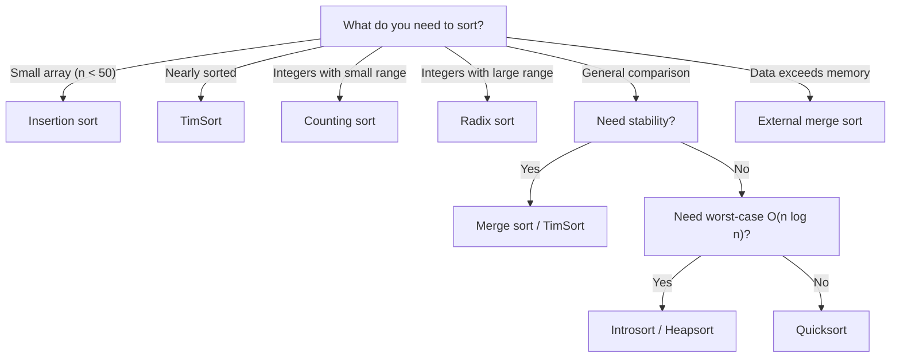

## Sorting Fundamentals

### Properties

| Property     | Definition                                              | Why It Matters                                               |
| ------------ | ------------------------------------------------------- | ------------------------------------------------------------ |
| **Stable**   | Equal elements retain their relative order              | Preserves secondary sort keys, needed for multi-key sorting  |
| **In-place** | Uses $O(1)$ extra memory (or $O(\log n)$ for recursion) | Critical when memory is constrained                          |
| **Adaptive** | Runs faster on partially sorted input                   | Common in practice — incremental updates, nearly-sorted logs |
| **Online**   | Can sort elements as they arrive                        | Streaming scenarios where the full input is not available    |

### Comparison Model

A comparison-based sort can only determine the relative order of elements by comparing pairs. The
information-theoretic lower bound applies: sorting $n$ elements requires $\Omega(n \log n)$
comparisons because there are $n!$ possible orderings and each comparison provides at most 1 bit of
information.

Non-comparison sorts bypass this bound by exploiting structure in the input (integer keys, bounded
ranges, known distributions).

## Comparison-Based Sorting

### Bubble Sort

Repeatedly swap adjacent elements that are out of order. After $i$ passes, the last $i$ elements are
in their final position.

```python
def bubble_sort(arr):
    """
    Bubble sort — adjacent swap.
    Time: O(n^2) worst/average, O(n) best (already sorted with early termination)
    Space: O(1)
    Stable: Yes
    """
    n = len(arr)
    for i in range(n):
        swapped = False
        for j in range(0, n - i - 1):
            if arr[j] > arr[j + 1]:
                arr[j], arr[j + 1] = arr[j + 1], arr[j]
                swapped = True
        if not swapped:
            break
    return arr
```

Bubble sort is primarily of educational value. Its only practical advantage is that it can detect
whether the input is already sorted in a single pass ($O(n)$), but insertion sort does this better.

### Selection Sort

Find the minimum element in the unsorted portion and swap it into place.

```python
def selection_sort(arr):
    """
    Selection sort — find minimum, swap.
    Time: O(n^2) all cases
    Space: O(1)
    Stable: No (swapping can change relative order of equal elements)
    """
    n = len(arr)
    for i in range(n):
        min_idx = i
        for j in range(i + 1, n):
            if arr[j] < arr[min_idx]:
                min_idx = j
        arr[i], arr[min_idx] = arr[min_idx], arr[i]
    return arr
```

Selection sort makes exactly $n(n-1)/2$ comparisons regardless of input — it is never adaptive. Its
only advantage is that it does at most $n$ swaps, which matters when writes are expensive (e.g.,
flash memory with limited write cycles).

### Insertion Sort

Build the sorted array one element at a time by inserting each element into its correct position.

```python
def insertion_sort(arr):
    """
    Insertion sort — insert each element into sorted prefix.
    Time: O(n^2) worst/average, O(n) best (already sorted)
    Space: O(1)
    Stable: Yes
    """
    for i in range(1, len(arr)):
        key = arr[i]
        j = i - 1
        while j >= 0 and arr[j] > key:
            arr[j + 1] = arr[j]
            j -= 1
        arr[j + 1] = key
    return arr
```

:::info

Insertion sort is the fastest comparison sort for small arrays ($n \lt 50$) and nearly-sorted data.
This is why it is used as the base case in merge sort and quicksort implementations, and why TimSort
(the default in Python, Java, and Rust) uses insertion sort for small runs.

:::

### Merge Sort

Divide the array in half, recursively sort each half, then merge the two sorted halves.

```python
def merge_sort(arr):
    """
    Merge sort — divide and conquer.
    Time: O(n log n) all cases
    Space: O(n) — auxiliary array for merging
    Stable: Yes
    """
    if len(arr) <= 1:
        return arr

    mid = len(arr) // 2
    left = merge_sort(arr[:mid])
    right = merge_sort(arr[mid:])

    return _merge(left, right)

def _merge(left, right):
    """Merge two sorted arrays. O(n) time, O(n) space."""
    result = []
    i = j = 0
    while i < len(left) and j < len(right):
        if left[i] <= right[j]:  # <= for stability
            result.append(left[i])
            i += 1
        else:
            result.append(right[j])
            j += 1
    result.extend(left[i:])
    result.extend(right[j:])
    return result
```

**Stability:** Merge sort is stable because when elements are equal, the element from the left half
is chosen first (`left[i] <= right[j]` uses `<=`, not `\lt{}`). This preserves the original relative
order.

### Quicksort

Pick a pivot, partition the array into elements less than the pivot and greater than the pivot, then
recursively sort the partitions.

```python
def quicksort(arr, low=0, high=None):
    """
    Quicksort with Hoare partition scheme.
    Time: O(n log n) average, O(n^2) worst
    Space: O(log n) — recursion stack (average)
    Stable: No
    """
    if high is None:
        high = len(arr) - 1
    if low < high:
        pivot_idx = _partition_hoare(arr, low, high)
        quicksort(arr, low, pivot_idx)
        quicksort(arr, pivot_idx + 1, high)
    return arr

def _partition_hoare(arr, low, high):
    """
    Hoare partition scheme.
    Returns an index j such that arr[low..j] <= pivot <= arr[j+1..high].
    """
    pivot = arr[(low + high) // 2]  # middle element as pivot
    i = low - 1
    j = high + 1
    while True:
        i += 1
        while arr[i] < pivot:
            i += 1
        j -= 1
        while arr[j] > pivot:
            j -= 1
        if i >= j:
            return j
        arr[i], arr[j] = arr[j], arr[i]

def _partition_lomuto(arr, low, high):
    """
    Lomuto partition scheme.
    Simpler but degrades more on duplicates.
    """
    pivot = arr[high]
    i = low
    for j in range(low, high):
        if arr[j] < pivot:
            arr[i], arr[j] = arr[j], arr[i]
            i += 1
    arr[i], arr[high] = arr[high], arr[i]
    return i
```

**Pivot selection strategies:**

| Strategy           | Average                  | Worst Case                           | Notes                                  |
| ------------------ | ------------------------ | ------------------------------------ | -------------------------------------- |
| First/last element | $O(n \log n)$            | $O(n^2)$ on sorted input             | Trivially exploitable                  |
| Middle element     | $O(n \log n)$            | $O(n^2)$ on specific patterns        | Better than first/last                 |
| Random element     | $O(n \log n)$ expected   | $O(n^2)$ with negligible probability | Requires RNG                           |
| Median of three    | $O(n \log n)$            | $O(n \log n)$ typical                | Samples first, middle, last            |
| Median of medians  | $O(n \log n)$ guaranteed | $O(n \log n)$ guaranteed             | High constant, rarely used in practice |

### Heapsort

Build a max-heap from the array, then repeatedly extract the maximum and place it at the end.

```python
def heapsort(arr):
    """
    Heapsort — build max-heap, extract max repeatedly.
    Time: O(n log n) worst/average/best
    Space: O(1) — true in-place
    Stable: No
    """
    n = len(arr)

    # Build max-heap: O(n)
    for i in range(n // 2 - 1, -1, -1):
        _sift_down(arr, n, i)

    # Extract elements: O(n log n)
    for i in range(n - 1, 0, -1):
        arr[0], arr[i] = arr[i], arr[0]
        _sift_down(arr, i, 0)

    return arr

def _sift_down(arr, n, i):
    largest = i
    left = 2 * i + 1
    right = 2 * i + 2
    if left < n and arr[left] > arr[largest]:
        largest = left
    if right < n and arr[right] > arr[largest]:
        largest = right
    if largest != i:
        arr[i], arr[largest] = arr[largest], arr[i]
        _sift_down(arr, n, largest)
```

### Introsort

Introsort (introspective sort) is a hybrid: start with quicksort, switch to heapsort if the
recursion depth exceeds $2 \log n$ (indicating the pivot selection is degrading). This guarantees
$O(n \log n)$ worst case while maintaining quicksort's average-case speed.

```python
def introsort(arr):
    """
    Introsort: quicksort with heapsort fallback.
    Time: O(n log n) worst case
    Space: O(log n)
    Stable: No
    """
    import math
    max_depth = 2 * int(math.log2(len(arr))) if arr else 0
    _introsort_helper(arr, 0, len(arr) - 1, max_depth)
    return arr

def _introsort_helper(arr, low, high, max_depth):
    if low < high:
        if max_depth == 0:
            # Fall back to heapsort
            arr[low:high + 1] = heapsort(arr[low:high + 1])
        else:
            pivot_idx = _partition_hoare(arr, low, high)
            _introsort_helper(arr, low, pivot_idx, max_depth - 1)
            _introsort_helper(arr, pivot_idx + 1, high, max_depth - 1)
```

Introsort is the basis of C++ `std::sort`. It provides the practical speed of quicksort with the
worst-case guarantee of heapsort.

## Non-Comparison-Based Sorting

Non-comparison sorts exploit properties of the input to achieve $O(n)$ or $O(nk)$ time, bypassing
the $\Omega(n \log n)$ comparison sort lower bound.

### Counting Sort

Count the occurrences of each value, then reconstruct the sorted array.

```python
def counting_sort(arr):
    """
    Counting sort for non-negative integers.
    Time: O(n + k) where k = max value
    Space: O(n + k)
    Stable: Yes
    """
    if not arr:
        return arr
    k = max(arr)
    counts = [0] * (k + 1)
    for x in arr:
        counts[x] += 1

    # Prefix sums for stable sort
    for i in range(1, k + 1):
        counts[i] += counts[i - 1]

    output = [0] * len(arr)
    # Iterate in reverse for stability
    for x in reversed(arr):
        counts[x] -= 1
        output[counts[x]] = x

    return output
```

**When to use:** Small integer ranges ($k = O(n)$). If $k \gg n$, counting sort uses more memory
than the input and may be slower than comparison sort.

### Radix Sort

Sort by individual digits (or bits), starting from the least significant digit (LSD) or most
significant digit (MSD).

```python
def radix_sort_lsd(arr):
    """
    LSD radix sort for non-negative integers.
    Time: O(d * (n + b)) where d = number of digits, b = base
    Space: O(n + b)
    Stable: Yes
    """
    if not arr:
        return arr
    max_val = max(arr)
    exp = 1  # 1, 10, 100, ...

    while max_val // exp > 0:
        _counting_sort_by_digit(arr, exp)
        exp *= 10

    return arr

def _counting_sort_by_digit(arr, exp):
    """Counting sort on a specific digit (base 10)."""
    n = len(arr)
    output = [0] * n
    counts = [0] * 10

    for x in arr:
        digit = (x // exp) % 10
        counts[digit] += 1

    for i in range(1, 10):
        counts[i] += counts[i - 1]

    for x in reversed(arr):
        digit = (x // exp) % 10
        counts[digit] -= 1
        output[counts[digit]] = x

    for i in range(n):
        arr[i] = output[i]
```

**Base choice:** Higher bases (e.g., 256 or 65536) reduce the number of passes but increase the
counting array size. The optimal base depends on cache characteristics and the data distribution.
For 32-bit integers with base 256, radix sort needs 4 passes.

### Bucket Sort

Distribute elements into buckets based on their value, sort each bucket individually, then
concatenate.

```python
def bucket_sort(arr, num_buckets=10):
    """
    Bucket sort for values uniformly distributed in [0, 1).
    Time: O(n) average (when uniformly distributed), O(n^2) worst
    Space: O(n + k)
    Stable: Yes (if bucket sort is stable)
    """
    if not arr:
        return arr

    buckets = [[] for _ in range(num_buckets)]
    for x in arr:
        bucket_idx = int(x * num_buckets)
        bucket_idx = min(bucket_idx, num_buckets - 1)  # handle x == 1.0
        buckets[bucket_idx].append(x)

    for bucket in buckets:
        insertion_sort(bucket)

    result = []
    for bucket in buckets:
        result.extend(bucket)
    return result
```

**When bucket sort works well:** When the input is uniformly distributed, each bucket has $O(n/k)$
elements and sorting each bucket takes $O((n/k)^2)$, giving total $O(n + k \cdot (n/k)^2) = O(n)$
when $k = \Theta(n)$.

**When it degrades:** When all elements fall into a single bucket, it degrades to the bucket's
internal sort — typically $O(n^2)$ with insertion sort.

## External Sorting

When the data exceeds available memory, external sorting uses a merge-based approach:

1. **Split phase:** Read chunks that fit in memory, sort each chunk, write to disk
2. **Merge phase:** Merge sorted runs using a $k$-way merge (typically $k$ = number of buffer pages)

```python
def external_sort_conceptual(data, chunk_size, num_buffers):
    """
    Conceptual external sort for data too large for memory.
    Phase 1: Sort chunks of size chunk_size
    Phase 2: K-way merge sorted chunks using num_buffers buffers

    Time: O(n log(n/chunk_size)) I/O operations
    Space: O(chunk_size + num_buffers) memory
    """
    # Phase 1: Sort chunks
    sorted_chunks = []
    for i in range(0, len(data), chunk_size):
        chunk = data[i:i + chunk_size]
        chunk.sort()
        sorted_chunks.append(chunk)

    # Phase 2: K-way merge
    import heapq
    heap = []
    chunk_indices = [0] * len(sorted_chunks)

    # Initialise heap with first element of each chunk
    for i, chunk in enumerate(sorted_chunks):
        if chunk:
            heapq.heappush(heap, (chunk[0], i))

    result = []
    while heap:
        val, chunk_idx = heapq.heappop(heap)
        result.append(val)
        chunk_indices[chunk_idx] += 1
        if chunk_indices[chunk_idx] < len(sorted_chunks[chunk_idx]):
            next_val = sorted_chunks[chunk_idx][chunk_indices[chunk_idx]]
            heapq.heappush(heap, (next_val, chunk_idx))

    return result
```

External sorting is the foundation of database `ORDER BY` operations, `GROUP BY`, and join
algorithms when the working set exceeds memory.

## TimSort

TimSort is a hybrid stable sorting algorithm derived from merge sort and insertion sort, designed by
Tim Peters for Python in 2002. It is the default sort in Python, Java (for objects), and Rust.

### How TimSort Works

1. **Find runs:** Scan the array for contiguous subsequences that are already sorted (ascending or
   strictly descending, which is reversed in-place)
2. **Extend short runs:** If a run is shorter than `minrun` (typically 32-64), extend it using
   binary insertion sort to length `minrun`
3. **Merge runs:** Maintain a stack of run lengths. Merge runs when the top of the stack violates
   two invariants:
   - $|\text{run}_i| \gt |\text{run}_{i+1}| + |\text{run}_{i+2}|$
   - $|\text{run}_{i+1}| \gt |\text{run}_{i+2}|$

### Why TimSort Is Fast in Practice

- **Adaptive:** Exploits existing order. On already-sorted data, it runs in $O(n)$ — just one pass
  to identify the single run.
- **Cache-friendly:** Merge operations work on contiguous memory regions.
- **Stable:** Preserves the relative order of equal elements.
- **Optimised merges:** Uses galloping mode (exponential search) when one run is much larger than
  the other, reducing the number of comparisons from $O(n)$ to $O(n \log m)$ where $m$ is the
  smaller run length.

| Input Pattern  | TimSort Time      | Quicksort Time       | Merge Sort Time |
| -------------- | ----------------- | -------------------- | --------------- |
| Already sorted | $O(n)$            | $O(n^2)$ (bad pivot) | $O(n \log n)$   |
| Reverse sorted | $O(n)$            | $O(n^2)$ (bad pivot) | $O(n \log n)$   |
| Random         | $O(n \log n)$     | $O(n \log n)$        | $O(n \log n)$   |
| Mostly sorted  | $O(n + k \log k)$ | $O(n \log n)$        | $O(n \log n)$   |

## Sorting Complexity Summary

| Algorithm      | Best          | Average       | Worst         | Space       | Stable | Adaptive  |
| -------------- | ------------- | ------------- | ------------- | ----------- | ------ | --------- |
| Bubble sort    | $O(n)$        | $O(n^2)$      | $O(n^2)$      | $O(1)$      | Yes    | Yes       |
| Selection sort | $O(n^2)$      | $O(n^2)$      | $O(n^2)$      | $O(1)$      | No     | No        |
| Insertion sort | $O(n)$        | $O(n^2)$      | $O(n^2)$      | $O(1)$      | Yes    | Yes       |
| Merge sort     | $O(n \log n)$ | $O(n \log n)$ | $O(n \log n)$ | $O(n)$      | Yes    | No        |
| Quicksort      | $O(n \log n)$ | $O(n \log n)$ | $O(n^2)$      | $O(\log n)$ | No     | No        |
| Heapsort       | $O(n \log n)$ | $O(n \log n)$ | $O(n \log n)$ | $O(1)$      | No     | No        |
| Introsort      | $O(n \log n)$ | $O(n \log n)$ | $O(n \log n)$ | $O(\log n)$ | No     | No        |
| Counting sort  | $O(n+k)$      | $O(n+k)$      | $O(n+k)$      | $O(n+k)$    | Yes    | No        |
| Radix sort     | $O(d(n+b))$   | $O(d(n+b))$   | $O(d(n+b))$   | $O(n+b)$    | Yes    | No        |
| Bucket sort    | $O(n+k)$      | $O(n)$        | $O(n^2)$      | $O(n+k)$    | Yes    | Partially |
| TimSort        | $O(n)$        | $O(n \log n)$ | $O(n \log n)$ | $O(n)$      | Yes    | Yes       |

## When to Use Which Sort



### Partial Sorting

When you only need the top $k$ elements (or the median), full sorting is wasteful.

```python
import heapq

def top_k(arr, k):
    """
    Find the k largest elements. O(n log k) time, O(k) space.
    Better than sorting when k << n.
    """
    return heapq.nlargest(k, arr)

def quickselect(arr, k):
    """
    Find the k-th smallest element (0-indexed).
    Average: O(n), Worst: O(n^2)
    Space: O(1)
    """
    from random import randint

    def partition(low, high):
        pivot_idx = randint(low, high)
        arr[pivot_idx], arr[high] = arr[high], arr[pivot_idx]
        pivot = arr[high]
        i = low
        for j in range(low, high):
            if arr[j] < pivot:
                arr[i], arr[j] = arr[j], arr[i]
                i += 1
        arr[i], arr[high] = arr[high], arr[i]
        return i

    low, high = 0, len(arr) - 1
    while low <= high:
        pivot_idx = partition(low, high)
        if pivot_idx == k:
            return arr[k]
        elif pivot_idx < k:
            low = pivot_idx + 1
        else:
            high = pivot_idx - 1
    return arr[k]
```

## Common Pitfalls

### 1. Using Quicksort Without Randomisation

A deterministic quicksort that picks the first element as pivot degrades to $O(n^2)$ on
already-sorted or reverse-sorted input. This is exploitable: an attacker who can control the sort
input can cause a denial of service by triggering worst-case behaviour. Always use randomised pivot
selection or introsort.

### 2. Assuming All Sorts Are Stable

Merge sort and TimSort are stable; quicksort and heapsort are not. If you sort by one key and then
by another, the second sort will destroy the ordering from the first unless the sort is stable. When
stability matters, verify the sort implementation or use a compound comparison key.

### 3. Radix Sort on Floating-Point Numbers

Radix sort works on integers but requires care with floating-point numbers. IEEE 754 floats can be
sorted as integers by flipping the sign bit for negative numbers (because the integer representation
preserves the ordering for positive floats, and reversing it for negative floats corrects the sign).

### 4. Counting Sort Memory Blowup

Counting sort uses $O(k)$ space where $k$ is the range of values. If you have 1,000 integers ranging
from 0 to $10^9$, counting sort allocates a $10^9$-element array. Always check that $k = O(n)$
before using counting sort, or use radix sort instead.

### 5. Ignoring the Base Case in Recursive Sorts

Merge sort and quicksort recurse until the subarray has 1 element. For small subarrays (e.g., 10-50
elements), the overhead of recursion exceeds the benefit of divide-and-conquer. Switch to insertion
sort for small subarrays — this is what every production sort implementation does.

### 6. Merge Sort Array Copies

Naive merge sort creates new arrays for every merge, leading to $O(n \log n)$ total allocations. Use
a single auxiliary array and alternate between the original and auxiliary arrays to reduce
allocations to $O(n)$. This is a significant performance improvement in practice.

### 7. Stability in Multi-Key Sorting

When sorting records by multiple fields (e.g., sort by last name, then by first name), you must sort
by the least significant key first using a stable sort, then by more significant keys. Sorting by
the most significant key first and then by less significant keys will destroy the primary ordering.
Alternatively, use a compound comparison key.

## Parallel Sorting

### Parallel Merge Sort

Merge sort parallelises naturally because the two recursive sorts are independent. The parallel
speedup is limited by the merge step, which requires $O(n)$ work sequentially.

```python
def parallel_merge_sort(arr, depth=0, max_depth=3):
    """
    Conceptual parallel merge sort using fork/join.
    Speedup: O(log n) parallel depth, O(n log n / p) with p processors
    Limited by Amdahl's law: merge step is sequential
    """
    if len(arr) <= 1:
        return arr
    if depth >= max_depth:
        return merge_sort(arr)  # fall back to sequential

    mid = len(arr) // 2
    # In practice, use threading/multiprocessing here
    left = parallel_merge_sort(arr[:mid], depth + 1, max_depth)
    right = parallel_merge_sort(arr[mid:], depth + 1, max_depth)
    return _merge(left, right)
```

### Parallel Quicksort

Quicksort can also be parallelised by processing partitions independently. The challenge is load
balancing — if the pivot splits unevenly, one processor gets much more work.

### Sample Sort

Sample sort is a parallel generalisation of quicksort:

1. Each processor samples $k$ elements from its local data
2. Samples are gathered, sorted, and $p-1$ splitters are chosen (where $p$ = number of processors)
3. Each processor partitions its data using the splitters
4. Data is redistributed to the appropriate processor
5. Each processor sorts its partition locally

### Comparison of Parallel Sorts

| Algorithm           | Parallel Time              | Work Efficiency | Notes                              |
| ------------------- | -------------------------- | --------------- | ---------------------------------- |
| Parallel merge sort | $O(\log n)$ depth          | Yes             | Merge is sequential bottleneck     |
| Parallel quicksort  | $O(\log n)$ expected depth | Yes             | Load imbalance on bad pivots       |
| Sample sort         | $O(n/p + \log p)$ expected | Mostly          | Communication overhead             |
| Bitonic sort        | $O(\log^2 n)$              | No              | Good for GPU, poor work efficiency |

## Sorting in Practice

### Standard Library Sorts

| Language                | Algorithm                   | Stable   | Notes                              |
| ----------------------- | --------------------------- | -------- | ---------------------------------- |
| Python                  | TimSort                     | Yes      | Hybrid merge + insertion, adaptive |
| Java (objects)          | TimSort                     | Yes      | Since Java 7                       |
| Java (primitives)       | Dual-pivot quicksort        | No       | Since Java 7                       |
| C++ `std::sort`         | Introsort                   | No       | Quicksort + heapsort fallback      |
| C++ `stable_sort`       | Merge sort                  | Yes      | $O(n \log n)$, uses extra memory   |
| Rust `sort`             | Modified merge sort         | No       | Also called "timsort"              |
| Rust `sort_unstable`    | Pattern-defeating quicksort | No       | PDQSort                            |
| Go `sort`               | Pattern-defeating quicksort | No       | Since Go 1.19                      |
| JavaScript `Array.sort` | TimSort (V8)                | Yes (V8) | Implementation varies by engine    |

### PDQSort (Pattern-Defeating Quicksort)

PDQSort is a modern improvement over introsort used in Rust and Go:

1. **Pattern detection:** Checks for already-sorted and reverse-sorted patterns, switching to
   insertion sort or reverse-insertion sort
2. **Block partition:** Uses a branchless partitioning scheme that is faster on modern CPUs
3. **Heap sort fallback:** Switches to heapsort if the recursion depth exceeds
   $2\lfloor\log_2 n\rfloor$
4. **Tukey's ninther pivot:** Uses a median-of-three of medians-of-three for better pivot selection

### Dual-Pivot Quicksort

Java's primitive sort (Vladimir Yaroslavskiy, 2009) uses two pivots instead of one, partitioning the
array into three segments: elements less than pivot1, elements between pivot1 and pivot2, and
elements greater than pivot2. This reduces the average number of comparisons compared to
single-pivot quicksort.

## Stable Sorting of Complex Objects

When sorting objects with multiple comparable fields, use a Schwartzian transform (decorate-sort-
undecorate) or key function to avoid repeated computation:

```python
def sort_by_multiple(records, keys):
    """
    Sort records by multiple keys, each with a direction.
    keys: list of (field_name, ascending) tuples
    """
    return sorted(
        records,
        key=lambda r: [
            getattr(r, field) if asc else -getattr(r, field)
            for field, asc in keys
        ]
    )

# Example: sort employees by department (asc), then salary (desc)
# sorted(employees, key=lambda e: (e.department, -e.salary))
```

## Sorting Stability Proof

Why does merge sort preserve stability? Consider two equal elements $a$ and $b$ where $a$ appears
before $b$ in the input. During the merge step, when we compare $a$ and $b$:

1. If $a$ and $b$ are in different halves, $a$ (from the left half) is chosen first because the
   merge uses `<=` (not `\lt{}`)
2. If $a$ and $b$ are in the same half, stability is preserved by the recursive invariant

This inductive argument proves that merge sort is stable. Quicksort is unstable because the
partition operation does not preserve the relative order of equal elements — an element swapped from
the left side of the pivot may pass over an equal element on the right side.

## Sorting Network Lower Bounds

A sorting network is a fixed sequence of compare-and-swap operations that sorts any input. The depth
of a sorting network is the minimum number of parallel steps needed. Known bounds:

| Network             | Depth         | Comparators     | Notes                              |
| ------------------- | ------------- | --------------- | ---------------------------------- |
| Bubble sort network | $O(n^2)$      | $O(n^2)$        | Trivial                            |
| Bitonic sort        | $O(\log^2 n)$ | $O(n \log^2 n)$ | Good for hardware                  |
| Odd-even mergesort  | $O(\log^2 n)$ | $O(n \log^2 n)$ | Practical                          |
| AKS network         | $O(\log n)$   | $O(n \log n)$   | Theoretical, impractical constants |

Sorting networks are used in GPU sorting (where the compare-and-swap operations can be executed in
parallel by many threads) and in hardware sorters (e.g., in network switches for packet
prioritisation).

## Sorting Stability in Detail

### Why Stability Matters: A Concrete Example

Consider sorting a list of employee records first by department, then by salary:

```
Initial data:
(Alice,   Engineering, 120000)
(Bob,     Marketing,    95000)
(Carol,   Engineering, 110000)
(Dave,    Marketing,   100000)
(Eve,     Engineering, 130000)
```

Step 1: Sort by department (stable sort):

```
(Alice,   Engineering, 120000)
(Carol,   Engineering, 110000)
(Eve,     Engineering, 130000)
(Bob,     Marketing,    95000)
(Dave,    Marketing,   100000)
```

Step 2: Sort by salary (stable sort):

```
(Bob,     Marketing,    95000)
(Dave,    Marketing,   100000)
(Carol,   Engineering, 110000)
(Alice,   Engineering, 120000)
(Eve,     Engineering, 130000)
```

Within each department, employees are now sorted by salary. If the second sort were unstable, the
department ordering could be destroyed — a Marketing employee might end up between Engineering
employees.

### Making an Unstable Sort Stable

You can make any sort stable by using the original index as a tiebreaker:

```python
def stable_quicksort(arr):
    """
    Make quicksort stable by augmenting with original indices.
    Time: O(n log n), Space: O(n) for indices
    """
    indexed = list(enumerate(arr))
    quicksort(indexed, key=lambda x: x[1])
    return [item[1] for item in indexed]
```

This uses $O(n)$ extra space and adds a comparison, but guarantees stability.

## Radix Sort: Advanced Topics

### MSD vs LSD Radix Sort

| Property                  | LSD (Least Significant Digit)   | MSD (Most Significant Digit) |
| ------------------------- | ------------------------------- | ---------------------------- |
| Pass order                | Least to most significant       | Most to least significant    |
| Stability requirement     | Stable per-digit sort needed    | Not required (uses buckets)  |
| Bucket handling           | No buckets to recurse into      | Recursive buckets            |
| Character strings         | Cannot skip trailing characters | Can skip common prefixes     |
| Cache behaviour           | Excellent (sequential passes)   | Poor (random bucket access)  |
| Implementation complexity | Simple                          | More complex                 |

### Radix Sort for Strings

```python
def radix_sort_strings(strings):
    """
    LSD radix sort for fixed-length strings.
    Time: O(k * n) where k = string length
    Space: O(n + alphabet_size)
    """
    if not strings:
        return strings
    k = len(strings[0])
    n = len(strings)

    for pos in range(k - 1, -1, -1):
        # Counting sort on character at position pos
        count = [0] * 256  # ASCII
        for s in strings:
            count[ord(s[pos])] += 1

        for i in range(1, 256):
            count[i] += count[i - 1]

        output = [''] * n
        for s in reversed(strings):
            idx = ord(s[pos])
            count[idx] -= 1
            output[count[idx]] = s

        strings = output

    return strings
```

### Radix Sort for Variable-Length Strings

For variable-length strings, pad shorter strings with a value less than any valid character (e.g.,
null byte) and sort using LSD radix sort from the last character to the first. This correctly
handles the case where a shorter string is a prefix of a longer string.

## Counting Sort: Generalisation to Ranges

### Counting Sort for Objects with Integer Keys

```python
def counting_sort_objects(arr, key_func):
    """
    Counting sort for objects with integer keys.
    Time: O(n + k) where k = key range
    Space: O(n + k)
    """
    if not arr:
        return arr
    keys = [key_func(x) for x in arr]
    min_key, max_key = min(keys), max(keys)
    k = max_key - min_key + 1

    count = [0] * (k + 1)
    for key in keys:
        count[key - min_key] += 1

    for i in range(1, len(count)):
        count[i] += count[i - 1]

    output = [None] * len(arr)
    for x in reversed(arr):
        key = key_func(x)
        count[key - min_key] -= 1
        output[count[key - min_key]] = x

    return output
```

## Sorting Lower Bound Proof (Detailed)

### Decision Tree Model

A comparison-based sorting algorithm can be modelled as a binary decision tree:

- Each internal node represents a comparison between two elements
- Each leaf represents a permutation of the input
- The depth of a leaf is the number of comparisons made for that input
- The worst-case number of comparisons is the height of the tree

### Proof

1. There are $n!$ possible permutations of $n$ elements, so the decision tree has at least $n!$
   leaves
2. A binary tree of height $h$ has at most $2^h$ leaves
3. Therefore: $2^h \ge n!$, so $h \ge \log_2(n!)$
4. By Stirling's approximation:
   $\log_2(n!) = n \log_2 n - n \log_2 e + O(\log n) = \Omega(n \log n)$
5. Therefore, any comparison-based sort requires $\Omega(n \log n)$ comparisons in the worst case

### Tightness

Merge sort, heapsort, and quicksort (average case) all achieve $O(n \log n)$, so the lower bound is
tight — you cannot do asymptotically better with comparisons alone.

### Information-Theoretic Argument

Sorting $n$ elements requires distinguishing among $n!$ permutations. Each comparison provides at
most 1 bit of information (the answer is yes or no). The information content of the answer is
$\log_2(n!) = \Theta(n \log n)$ bits, so at least $\Theta(n \log n)$ comparisons are needed.

This argument also shows that the number of comparisons cannot be reduced below
$\log_2(n!) \approx n \log_2 n - 1.443n$ even in the average case (for uniform random input).
