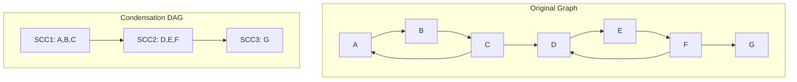

## Strongly Connected Components

A strongly connected component (SCC) of a directed graph is a maximal set of vertices such that
there is a path from every vertex to every other vertex within the set.

### Kosaraju's Algorithm

Kosaraju's algorithm finds all SCCs in $O(V + E)$ time using two DFS passes.

```python
def kosaraju(n, adj):
    """
    Find strongly connected components using Kosaraju's algorithm.
    Time: O(V + E)
    Space: O(V + E)
    Returns: list of SCCs (each SCC is a list of vertices)
    """
    visited = [False] * n
    order = []

    def dfs1(v):
        visited[v] = True
        for u in adj[v]:
            if not visited[u]:
                dfs1(u)
        order.append(v)

    for v in range(n):
        if not visited[v]:
            dfs1(v)

    radj = [[] for _ in range(n)]
    for v in range(n):
        for u in adj[v]:
            radj[u].append(v)

    visited = [False] * n
    sccs = []

    def dfs2(v, component):
        visited[v] = True
        component.append(v)
        for u in radj[v]:
            if not visited[u]:
                dfs2(u, component)

    for v in reversed(order):
        if not visited[v]:
            component = []
            dfs2(v, component)
            sccs.append(component)

    return sccs
```

### Tarjan's Algorithm

Tarjan's algorithm finds SCCs in a single DFS pass using a stack and low-link values.

```python
def tarjan_scc(n, adj):
    """
    Find SCCs using Tarjan's algorithm.
    Time: O(V + E)
    Space: O(V)
    """
    index_counter = [0]
    stack = []
    on_stack = [False] * n
    index = [-1] * n
    low = [0] * n
    sccs = []

    def strongconnect(v):
        index[v] = index_counter[0]
        low[v] = index_counter[0]
        index_counter[0] += 1
        stack.append(v)
        on_stack[v] = True

        for w in adj[v]:
            if index[w] == -1:
                strongconnect(w)
                low[v] = min(low[v], low[w])
            elif on_stack[w]:
                low[v] = min(low[v], index[w])

        if low[v] == index[v]:
            scc = []
            while True:
                w = stack.pop()
                on_stack[w] = False
                scc.append(w)
                if w == v:
                    break
            sccs.append(scc)

    for v in range(n):
        if index[v] == -1:
            strongconnect(v)

    return sccs
```

### DAG Condensation

The condensation of a directed graph is the DAG formed by contracting each SCC to a single vertex.
The condensation DAG is useful for solving problems on the original graph.

```python
def build_condensation(n, adj, sccs):
    """
    Build condensation DAG from SCCs.
    Time: O(V + E)
    Space: O(V + E)
    """
    scc_id = [0] * n
    for i, scc in enumerate(sccs):
        for v in scc:
            scc_id[v] = i

    num_sccs = len(sccs)
    cond_adj = [set() for _ in range(num_sccs)]
    for v in range(n):
        for u in adj[v]:
            if scc_id[v] != scc_id[u]:
                cond_adj[scc_id[v]].add(scc_id[u])

    return [list(s) for s in cond_adj], scc_id
```



## Bridges and Articulation Points

### Bridges (Cut Edges)

A bridge is an edge whose removal increases the number of connected components.

```python
def find_bridges(n, adj):
    """
    Find all bridges in an undirected graph.
    Time: O(V + E)
    Space: O(V)
    Returns: list of (u, v) bridges
    """
    visited = [False] * n
    tin = [0] * n
    low = [0] * n
    timer = [0]
    bridges = []

    def dfs(v, parent):
        visited[v] = True
        tin[v] = low[v] = timer[0]
        timer[0] += 1
        for u in adj[v]:
            if u == parent:
                continue
            if visited[u]:
                low[v] = min(low[v], tin[u])
            else:
                dfs(u, v)
                low[v] = min(low[v], low[u])
                if low[u] > tin[v]:
                    bridges.append((v, u))

    for v in range(n):
        if not visited[v]:
            dfs(v, -1)

    return bridges
```

### Articulation Points (Cut Vertices)

An articulation point is a vertex whose removal increases the number of connected components.

```python
def find_articulation_points(n, adj):
    """
    Find all articulation points in an undirected graph.
    Time: O(V + E)
    Space: O(V)
    """
    visited = [False] * n
    tin = [0] * n
    low = [0] * n
    timer = [0]
    is_articulation = [False] * n

    def dfs(v, parent):
        visited[v] = True
        tin[v] = low[v] = timer[0]
        timer[0] += 1
        children = 0
        for u in adj[v]:
            if u == parent:
                continue
            if visited[u]:
                low[v] = min(low[v], tin[u])
            else:
                dfs(u, v)
                low[v] = min(low[v], low[u])
                if low[u] >= tin[v] and parent != -1:
                    is_articulation[v] = True
                children += 1
        if parent == -1 and children > 1:
            is_articulation[v] = True

    for v in range(n):
        if not visited[v]:
            dfs(v, -1)

    return [v for v in range(n) if is_articulation[v]]
```

:::info

The condition for a bridge is `low[u] > tin[v]` (strict inequality), while for an articulation point
it is `low[u] >= tin[v]` (non-strict). The difference matters: a back edge to the parent vertex
satisfies `low[u] == tin[v]` but does not make the edge a bridge.

:::

### Biconnected Components

A biconnected component is a maximal set of edges such that any two edges lie on a common simple
cycle. Biconnected components are separated by articulation points.

## 2-SAT

The 2-SAT problem asks whether a boolean formula in conjunctive normal form with exactly 2 literals
per clause is satisfiable. It reduces to finding SCCs in an implication graph.

### Reduction to Implication Graph

Each clause $(x \lor y)$ is equivalent to $(\lnot x \to y) \land (\lnot y \to x)$. Build an
implication graph where each variable $x$ has two vertices ($x$ and $\lnot x$), and add directed
edges for each implication.

### Algorithm

1. Build the implication graph
2. Find SCCs using Tarjan's or Kosaraju's algorithm
3. For every variable $x$, $x$ and $\lnot x$ must be in different SCCs
4. If any variable has both $x$ and $\lnot x$ in the same SCC, the formula is unsatisfiable
5. Otherwise, assign truth values: if `scc_id[x] > scc_id[not_x]`, set $x$ to true

```python
def solve_2sat(n_vars, clauses):
    """
    Solve 2-SAT using SCC-based algorithm.
    Time: O(V + E) where V = 2*n_vars, E = 2*len(clauses)
    Space: O(V + E)
    Returns: (satisfiable, assignment)
    """
    n = 2 * n_vars
    adj = [[] for _ in range(n)]

    def var(v):
        return 2 * v if v >= 0 else 2 * (-v - 1) + 1

    def neg(v):
        return v ^ 1

    for a, b in clauses:
        adj[neg(var(a))].append(var(b))
        adj[neg(var(b))].append(var(a))

    sccs = tarjan_scc(n, adj)
    scc_id = [0] * n
    for i, scc in enumerate(sccs):
        for v in scc:
            scc_id[v] = i

    assignment = [None] * n_vars
    for v in range(n_vars):
        if scc_id[2 * v] == scc_id[2 * v + 1]:
            return False, None
        assignment[v] = scc_id[2 * v] > scc_id[2 * v + 1]

    return True, assignment
```

## Network Flow

### Ford-Fulkerson Method

The Ford-Fulkerson method computes the maximum flow in a flow network. It repeatedly finds
augmenting paths in the residual graph and pushes flow along them.

```python
def ford_fulkerson(n, adj, capacity, source, sink):
    """
    Maximum flow using Ford-Fulkerson with DFS.
    Time: O(E * max_flow) — can be exponential
    Space: O(V + E)
    """
    flow = 0
    parent = [-1] * n

    def bfs():
        visited = [False] * n
        queue = [source]
        visited[source] = True
        parent[source] = -1
        while queue:
            u = queue.pop(0)
            for v in adj[u]:
                if not visited[v] and capacity[u][v] > 0:
                    visited[v] = True
                    parent[v] = u
                    if v == sink:
                        return True
                    queue.append(v)
        return False

    while bfs():
        path_flow = float('inf')
        v = sink
        while v != source:
            u = parent[v]
            path_flow = min(path_flow, capacity[u][v])
            v = u

        v = sink
        while v != source:
            u = parent[v]
            capacity[u][v] -= path_flow
            capacity[v][u] += path_flow
            v = u

        flow += path_flow

    return flow
```

### Edmonds-Karp Algorithm

Edmonds-Karp is Ford-Fulkerson with BFS for finding augmenting paths, guaranteeing $O(VE^2)$ time.

```python
def edmonds_karp(n, adj, capacity, source, sink):
    """
    Maximum flow using Edmonds-Karp (BFS-based Ford-Fulkerson).
    Time: O(V * E^2)
    Space: O(V + E)
    """
    flow = 0
    parent = [-1] * n

    def bfs():
        visited = [False] * n
        from collections import deque
        q = deque([source])
        visited[source] = True
        while q:
            u = q.popleft()
            for v in adj[u]:
                if not visited[v] and capacity[u][v] > 0:
                    visited[v] = True
                    parent[v] = u
                    if v == sink:
                        return True
                    q.append(v)
        return False

    while bfs():
        path_flow = float('inf')
        v = sink
        while v != source:
            u = parent[v]
            path_flow = min(path_flow, capacity[u][v])
            v = u
        v = sink
        while v != source:
            u = parent[v]
            capacity[u][v] -= path_flow
            capacity[v][u] += path_flow
            v = u
        flow += path_flow

    return flow
```

### Dinic's Algorithm

Dinic's algorithm achieves $O(V^2 E)$ time by using BFS to build a level graph and then finding
blocking flows with DFS.

```python
from collections import deque

class Dinic:
    """
    Dinic's maximum flow algorithm.
    Time: O(V^2 * E)
    Space: O(V + E)
    """
    def __init__(self, n):
        self.n = n
        self.adj = [[] for _ in range(n)]

    def add_edge(self, u, v, cap):
        self.adj[u].append([v, cap, len(self.adj[v])])
        self.adj[v].append([u, 0, len(self.adj[u]) - 1])

    def bfs(self, s, t, level):
        for i in range(self.n):
            level[i] = -1
        level[s] = 0
        q = deque([s])
        while q:
            u = q.popleft()
            for edge in self.adj[u]:
                v, cap, _ = edge
                if cap > 0 and level[v] == -1:
                    level[v] = level[u] + 1
                    q.append(v)
        return level[t] != -1

    def dfs(self, u, t, f, level, iter_arr):
        if u == t:
            return f
        for i in range(iter_arr[u], len(self.adj[u])):
            iter_arr[u] = i
            v, cap, rev = self.adj[u][i]
            if cap > 0 and level[u] + 1 == level[v]:
                pushed = self.dfs(v, t, min(f, cap), level, iter_arr)
                if pushed > 0:
                    self.adj[u][i][1] -= pushed
                    self.adj[v][rev][1] += pushed
                    return pushed
        return 0

    def max_flow(self, s, t):
        flow = 0
        level = [0] * self.n
        while self.bfs(s, t, level):
            iter_arr = [0] * self.n
            while True:
                pushed = self.dfs(s, t, float('inf'), level, iter_arr)
                if pushed == 0:
                    break
                flow += pushed
        return flow
```

### Max-Flow Algorithms Comparison

| Algorithm        | Time Complexity  | Best For                             |
| ---------------- | ---------------- | ------------------------------------ |
| Ford-Fulkerson   | $O(E \cdot f^*)$ | Small flow values                    |
| Edmonds-Karp     | $O(VE^2)$        | General purpose, simple to implement |
| Dinic's          | $O(V^2 E)$       | General purpose, fast in practice    |
| Capacity scaling | $O(E^2 \log U)$  | Large capacities                     |
| Push-relabel     | $O(V^3)$         | Dense graphs                         |

where $f^*$ is the max flow value and $U$ is the maximum edge capacity.

### Min-Cost Max-Flow

```python
def min_cost_max_flow(n, adj, cost, capacity, source, sink):
    """
    Min-cost max-flow using successive shortest paths.
    Time: O(F * (V + E) log V) where F = max flow
    Space: O(V + E)
    """
    import heapq
    total_flow = 0
    total_cost = 0
    parent = [0] * n
    parent_edge = [0] * n

    while True:
        dist = [float('inf')] * n
        dist[source] = 0
        pq = [(0, source)]
        in_queue = [False] * n

        while pq:
            d, u = heapq.heappop(pq)
            if d > dist[u]:
                continue
            for v in adj[u]:
                if capacity[u][v] > 0 and dist[v] > dist[u] + cost[u][v]:
                    dist[v] = dist[u] + cost[u][v]
                    parent[v] = u
                    parent_edge[v] = v
                    heapq.heappush(pq, (dist[v], v))

        if dist[sink] == float('inf'):
            break

        path_flow = float('inf')
        v = sink
        while v != source:
            u = parent[v]
            path_flow = min(path_flow, capacity[u][v])
            v = u

        v = sink
        while v != source:
            u = parent[v]
            capacity[u][v] -= path_flow
            capacity[v][u] += path_flow
            total_cost += path_flow * cost[u][v]
            v = u

        total_flow += path_flow

    return total_flow, total_cost
```

## Bipartite Matching

### Maximum Bipartite Matching from Max-Flow

```python
def bipartite_matching(n_left, n_right, edges):
    """
    Maximum bipartite matching using max-flow (Dinic's).
    Time: O(E * sqrt(V)) for bipartite graphs
    Space: O(V + E)
    """
    dinic = Dinic(n_left + n_right + 2)
    source = n_left + n_right
    sink = source + 1

    for u in range(n_left):
        dinic.add_edge(source, u, 1)
    for v in range(n_left, n_left + n_right):
        dinic.add_edge(v, sink, 1)
    for u, v in edges:
        dinic.add_edge(u, n_left + v, 1)

    return dinic.max_flow(source, sink)
```

### Hopcroft-Karp Algorithm

```python
from collections import deque

def hopcroft_karp(n_left, n_right, edges):
    """
    Maximum bipartite matching using Hopcroft-Karp.
    Time: O(E * sqrt(V))
    Space: O(V + E)
    """
    adj = [[] for _ in range(n_left)]
    for u, v in edges:
        adj[u].append(v)

    pair_u = [-1] * n_left
    pair_v = [-1] * n_right
    dist = [0] * n_left

    def bfs():
        q = deque()
        for u in range(n_left):
            if pair_u[u] == -1:
                dist[u] = 0
                q.append(u)
            else:
                dist[u] = float('inf')
        found = False
        while q:
            u = q.popleft()
            for v in adj[u]:
                if pair_v[v] == -1:
                    found = True
                elif dist[pair_v[v]] == float('inf'):
                    dist[pair_v[v]] = dist[u] + 1
                    q.append(pair_v[v])
        return found

    def dfs(u):
        for v in adj[u]:
            if pair_v[v] == -1 or (dist[pair_v[v]] == dist[u] + 1 and dfs(pair_v[v])):
                pair_u[u] = v
                pair_v[v] = u
                return True
        dist[u] = float('inf')
        return False

    matching = 0
    while bfs():
        for u in range(n_left):
            if pair_u[u] == -1:
                if dfs(u):
                    matching += 1

    return matching, pair_u, pair_v
```

### Konig's Theorem

**Theorem**: In a bipartite graph, the size of the maximum matching equals the size of the minimum
vertex cover. Furthermore, the minimum vertex cover can be constructed from the maximum matching:

1. Find a maximum matching
2. Find all unmatched vertices on the left side
3. BFS/DFS from unmatched left vertices, following alternating paths
4. The minimum vertex cover is: (left vertices NOT reached) + (right vertices reached)

```python
def konig_min_vertex_cover(n_left, n_right, edges, pair_u, pair_v):
    """
    Minimum vertex cover using Konig's theorem.
    Time: O(V + E)
    """
    adj = [[] for _ in range(n_left)]
    for u, v in edges:
        adj[u].append(v)

    reached_left = [False] * n_left
    reached_right = [False] * n_right
    queue = deque()

    for u in range(n_left):
        if pair_u[u] == -1:
            reached_left[u] = True
            queue.append(('L', u))

    while queue:
        side, node = queue.popleft()
        if side == 'L':
            for v in adj[node]:
                if not reached_right[v]:
                    reached_right[v] = True
                    if pair_v[v] != -1:
                        queue.append(('R', v))
        else:
            u = pair_v[node]
            if not reached_left[u]:
                reached_left[u] = True
                queue.append(('L', u))

    cover = []
    for u in range(n_left):
        if not reached_left[u]:
            cover.append(('L', u))
    for v in range(n_right):
        if reached_right[v]:
            cover.append(('R', v))

    return cover
```

## Eulerian Paths and Circuits

An **Eulerian circuit** visits every edge exactly once and returns to the starting vertex. An
**Eulerian path** visits every edge exactly once but may not return.

### Conditions

| Property    | Eulerian Circuit | Eulerian Path           |
| ----------- | ---------------- | ----------------------- |
| Connected   | Yes              | Yes (ignoring isolated) |
| Even degree | All vertices     | All except exactly 2    |
| Odd degree  | None             | Exactly 2               |

### Hierholzer's Algorithm

```python
def hierholzer(n, adj):
    """
    Find Eulerian circuit using Hierholzer's algorithm.
    Time: O(V + E)
    Space: O(E) for the path
    Requires: all vertices have even degree, graph is connected.
    """
    edge_count = [len(adj[i]) for i in range(n)]
    curr_path = [0]
    circuit = []

    while curr_path:
        u = curr_path[-1]
        if edge_count[u] > 0:
            v = adj[u].pop()
            edge_count[u] -= 1
            curr_path.append(v)
        else:
            circuit.append(curr_path.pop())

    return circuit[::-1]
```

## Topological Sort

### Kahn's Algorithm (BFS-based)

```python
def kahn_topological_sort(n, adj):
    """
    Topological sort using Kahn's algorithm (BFS).
    Time: O(V + E)
    Space: O(V)
    Returns: topological order, or None if cycle exists
    """
    from collections import deque
    in_degree = [0] * n
    for u in range(n):
        for v in adj[u]:
            in_degree[v] += 1

    queue = deque(i for i in range(n) if in_degree[i] == 0)
    order = []

    while queue:
        u = queue.popleft()
        order.append(u)
        for v in adj[u]:
            in_degree[v] -= 1
            if in_degree[v] == 0:
                queue.append(v)

    return order if len(order) == n else None
```

### DFS-based Topological Sort

```python
def dfs_topological_sort(n, adj):
    """
    Topological sort using DFS.
    Time: O(V + E)
    Space: O(V)
    """
    visited = [False] * n
    on_stack = [False] * n
    order = []

    def dfs(u):
        visited[u] = True
        on_stack[u] = True
        for v in adj[u]:
            if on_stack[v]:
                return False
            if not visited[v]:
                if not dfs(v):
                    return False
        on_stack[u] = False
        order.append(u)
        return True

    for u in range(n):
        if not visited[u]:
            if not dfs(u):
                return None

    return order[::-1]
```

## Global Minimum Cut

### Stoer-Wagner Algorithm

```python
def stoer_wagner(n, adj):
    """
    Global minimum cut using Stoer-Wagner.
    Time: O(V^3)
    Space: O(V^2)
    Returns: minimum cut value
    """
    import copy
    weights = [row[:] for row in adj]
    vertices = list(range(n))
    min_cut = float('inf')

    while len(vertices) > 1:
        weights_sub = [[weights[i][j] for j in vertices] for i in vertices]
        m = len(vertices)
        in_a = [False] * m
        added = [0] * m
        last = -1
        prev = -1

        for _ in range(m):
            sel = -1
            for i in range(m):
                if not in_a[i] and (sel == -1 or added[i] > added[sel]):
                    sel = i
            if sel == m - 1:
                min_cut = min(min_cut, added[sel])
                for i in range(m):
                    if i != sel and i != prev:
                        weights[vertices[prev]][vertices[i]] += weights[vertices[sel]][vertices[i]]
                        weights[vertices[i]][vertices[prev]] += weights[vertices[i]][vertices[sel]]
                vertices.pop(sel)
                break
            in_a[sel] = True
            prev = last
            last = sel
            for i in range(m):
                if not in_a[i]:
                    added[i] += weights_sub[sel][i]

    return min_cut
```

## Common Pitfalls

### 1. Confusing `tin` and `low` in Bridge Finding

The condition for a bridge is `low[u] > tin[v]` (strictly greater). If you use `>=`, you will
incorrectly classify back edges as bridges. The key distinction: `low[u] == tin[v]` means there is a
back edge from the subtree of `u` to `v` (or an ancestor of `v`), which means the edge `(v, u)` is
NOT a bridge.

### 2. 2-SAT Variable Indexing

In 2-SAT, variable $x$ is typically represented as vertex $2x$ and $\lnot x$ as vertex $2x+1$ (or
vice versa). Getting the indexing wrong produces incorrect results. Always verify:
`neg(neg(x)) == x`, i.e., `(x ^ 1) ^ 1 == x`.

### 3. Ford-Fulkerson with DFS Can Be Exponential

If augmenting paths are chosen poorly (e.g., using DFS), Ford-Fulkerson can take $O(E \cdot f^*)$
time where $f^*$ is the max flow value. For irrational capacities, it may not even terminate. Always
use BFS (Edmonds-Karp) or Dinic's algorithm unless you are certain the capacities are small
integers.

### 4. Dinic's Level Graph Must Be Rebuilt

In Dinic's algorithm, the level graph is built fresh each time BFS fails to find an augmenting path.
Do not reuse the old level graph — it no longer represents valid augmenting paths in the residual
graph.

### 5. Self-Loops in Eulerian Path Problems

Self-loops contribute 2 to the degree of their vertex (one for each direction of traversal). A
vertex with one self-loop and no other edges has degree 2 (even), not 1. Forgetting this leads to
incorrect Eulerian path/circuit detection.

### 6. Bipartite Graph Assumption

Konig's theorem (min vertex cover = max matching) applies ONLY to bipartite graphs. For general
graphs, the minimum vertex cover can be much larger than the maximum matching. Always verify the
graph is bipartite before applying Konig's theorem.

### 7. Tarjan's vs Kosaraju's SCC Ordering

In Tarjan's algorithm, SCCs are produced in reverse topological order of the condensation DAG. In
Kosaraju's algorithm, the second DFS pass produces SCCs in topological order. When the problem
requires processing SCCs in topological order, choose the algorithm accordingly or reverse Tarjan's
output.

### 8. Flow Network Construction

When reducing a problem to max-flow, ensure the flow network is correctly constructed: (1) all edges
have non-negative capacity, (2) the source has only outgoing edges, (3) the sink has only incoming
edges, (4) the graph is directed (or convert undirected edges to two directed edges), and (5)
capacities are integers if using Ford-Fulkerson with DFS.
