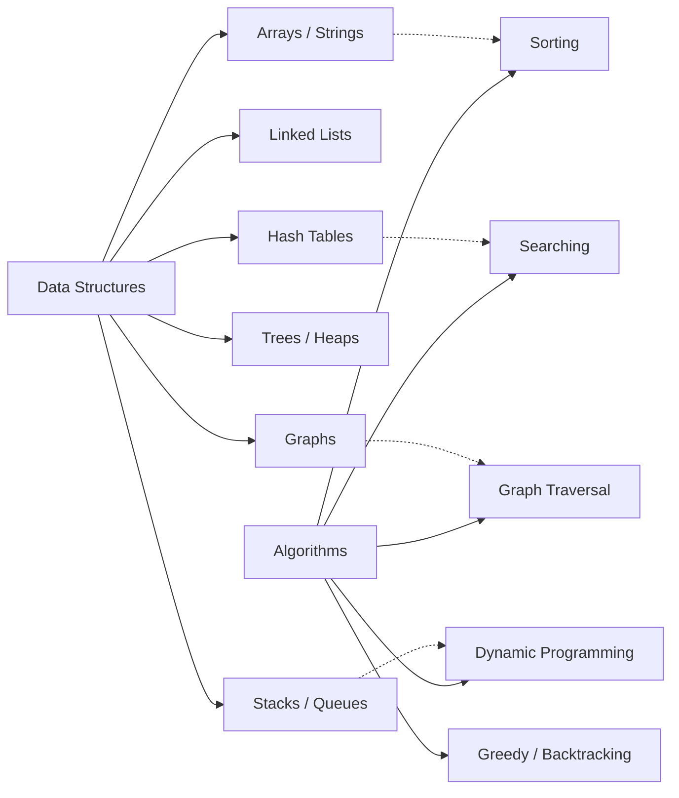

## What Algorithms Are

An algorithm is a finite sequence of well-defined instructions that takes an input and produces an
output. This definition is deceptively simple. In practice, the gap between "an algorithm that
produces the correct answer" and "an algorithm that produces the correct answer fast enough to
matter" is where most of the engineering happens.

Every system you build, maintain, or debug is a composition of algorithms: the B-tree index your
database uses to serve a query, the congestion control algorithm in TCP that decides how fast your
service can send data, the load balancing algorithm that distributes requests across your fleet, the
garbage collector that reclaims memory in your runtime. Understanding these algorithms at a deep
level is what separates engineers who can diagnose a latency regression from engineers who can only
reboot the service.

## Data Structures and Algorithms

Data structures and algorithms are inseparable. A data structure is a particular way of organising
data in memory; an algorithm is a sequence of operations on that data. Choosing the wrong data
structure makes the best algorithm slow, and choosing the right data structure can make a naive
algorithm fast enough.

The relationship is not one-to-one. A hash table can implement a set or a map. A balanced BST can do
the same. Which one you choose depends on whether you need ordered iteration, worst-case guarantees,
or amortised constant-time operations. These trade-offs are the substance of systems engineering.

## Mathematical Prerequisites

This subject assumes familiarity with:

- **Logarithms** — $O(\log n)$ is the most important complexity class you will encounter. You need
  to be comfortable with the algebraic identities: $\log(ab) = \log a + \log b$,
  $\log(a^b) =
  b \log a$, and the change of base formula.
- **Summations** — Many algorithm analyses reduce to evaluating sums. Know the closed forms for
  $\sum_{i=1}^{n} i = n(n+1)/2$, $\sum_{i=1}^{n} i^2 = n(n+1)(2n+1)/6$, and the geometric series
  $\sum_{i=0}^{k} r^i = (r^{k+1} - 1)/(r - 1)$.
- **Recurrence relations** — Divide-and-conquer algorithms produce recurrences like $T(n) = 2T(n/2)
  - O(n)$. The Master Theorem provides closed-form solutions for a broad class of these.
- **Proof techniques** — Induction, contradiction, and construction are used throughout to prove
  correctness and bounds.

## What This Subject Covers

| Chapter                      | Focus                                                                    | Key Algorithms                    |
| ---------------------------- | ------------------------------------------------------------------------ | --------------------------------- |
| Complexity Analysis          | Asymptotic notation, Master Theorem, amortised analysis, NP-completeness | —                                 |
| Arrays and Strings           | Two pointers, sliding window, prefix sums, hashing, string matching      | Rabin-Karp, KMP                   |
| Linked Lists, Stacks, Queues | Linear structures, monotonic structures, union-find                      | Floyd's cycle detection           |
| Trees and Graphs             | BSTs, balanced trees, heaps, tries, graph traversal, topological sort    | BFS, DFS                          |
| Sorting                      | Comparison and non-comparison sorting, stability, adaptive behaviour     | Merge sort, quicksort, radix sort |
| Dynamic Programming          | Memoisation, tabulation, state space reduction, common DP patterns       | Knapsack, LCS, edit distance      |
| Graph Algorithms             | Shortest paths, MSTs, network flow, strong connectivity                  | Dijkstra, Kruskal, Ford-Fulkerson |

## How to Use These Notes

These notes are written for systems engineers who need to understand algorithms at the level
required to make informed design decisions — not just pass an interview. Each chapter includes
complexity analysis, practical implementation considerations, and a "Common Pitfalls" section drawn
from real production failures.

Read the chapters in order if you are building foundational knowledge. Use them as reference
material if you are looking up a specific algorithm or trying to understand why a particular data
structure is the wrong choice for your workload.

:::tip

The only way to internalise algorithms is to implement them. Reading about quicksort is not the same
as writing quicksort, debugging the off-by-one errors, and measuring its performance on pathological
inputs. Use the pseudocode here as a starting point, but write the code yourself.

:::
