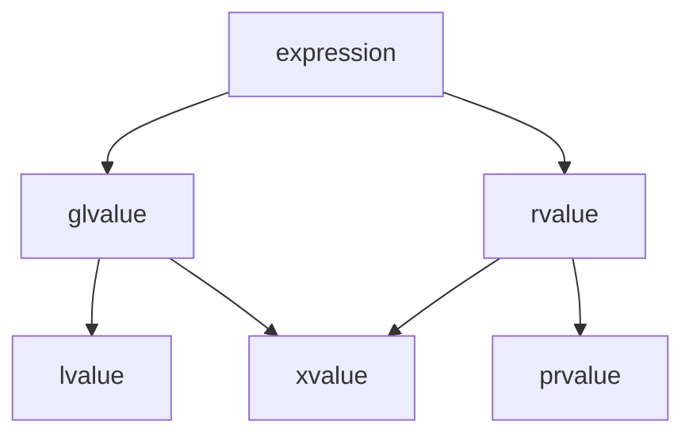

import Tabs from '@theme/Tabs';
import TabItem from '@theme/TabItem';

# Value Categories and Move Semantics

Every C++ expression has a **value category** — a property that determines which operations are legal on it and how it interacts with overloaded functions. Value categories are the type system machinery that enables **move semantics**, allowing resources to be transferred between scopes without copying. This module covers the value category taxonomy, reference collapsing, forwarding references, temporary materialization, move constructors, and return value optimization.

## 1. Value Taxonomy

### 1.1 The Three-Valued System (C++17)

Since C++17, every expression belongs to exactly one of three **primary value categories** [N4950 §7.2.1]:

- **lvalue:** an expression that designates a function or an object. It has an identity (address) and, conceptually, a location in memory.
- **prvalue ("pure" rvalue):** an expression that initializes an object or computes a value. It has no identity — it is a transient value.
- **xvalue ("expiring" value):** an expression that designates an object whose resources can be reused (typically because it is nearing the end of its lifetime). It has identity but can be moved from.

Two **compound categories** are defined as unions of the primaries [N4950 §7.2.1]:

- **glvalue ("generalized" lvalue):** lvalue ∪ xvalue — expressions with identity.
- **rvalue:** prvalue ∪ xvalue — expressions that can be moved from.

### 1.2 Value Category Diagram



In set notation:

$$
\text{expression} = \underbrace{\text{glvalue}}_{\text{lvalue} \cup \text{xvalue}} \;\cup\; \underbrace{\text{rvalue}}_{\text{prvalue} \cup \text{xvalue}}
$$

The xvalue category occupies the intersection — it is both a glvalue (it has identity) and an rvalue (it can be moved from).

### 1.3 Historical Evolution

| Standard | Model         | Categories                               | Key Change                                              |
| :------- | :------------ | :--------------------------------------- | :------------------------------------------------------ |
| C++98/03 | Two-valued    | lvalue, rvalue                           | Simpler model; no move semantics                        |
| C++11/14 | Five-valued   | lvalue, xvalue, prvalue, glvalue, rvalue | Move semantics, rvalue references introduced            |
| C++17    | Three primary | lvalue, xvalue, prvalue                  | Guaranteed copy elision; prvalues are no longer objects |

C++98 distinguished only lvalues (things you can take the address of) and rvalues (everything else). C++11 introduced move semantics, requiring the xvalue category to represent "things that have identity but are about to expire." C++17 refined the model by making prvalues non-objects until they are materialized, which enabled guaranteed copy elision [N4950 §8.4.4].

:::info Relevance
The value category of an expression determines which overloaded function is called (via reference binding rules), whether a move constructor or copy constructor is invoked, and whether temporary lifetime extension applies. Understanding value categories is essential to understanding why move semantics work.
:::

## 2. How to Identify Each Category

### 2.1 lvalue

An expression is an lvalue if it [N4950 §7.2.1]:

- Has a name or can be addressed with `&`.
- Persists beyond a single full-expression.
- Appears on the left side of an assignment (historically; this is a useful heuristic, not the definition).

```cpp
#include <type_traits>
#include <cassert>

int main() {
    int x = 42;
    int& ref = x;

    // x is an lvalue
    static_assert(std::is_lvalue_reference_v<decltype((x))>);
    assert(&x != nullptr);  // Can take address

    // ref is an lvalue (references are always lvalues when used)
    static_assert(std::is_lvalue_reference_v<decltype((ref))>);

    // String literal "hello" is an lvalue
    static_assert(std::is_lvalue_reference_v<decltype(("hello"))>);
}
```

### 2.2 prvalue

An expression is a prvalue if it [N4950 §7.2.1]:

- Is a literal (except string literals, which are lvalues).
- Is the return value of a function that returns by value (not by reference).
- Is a temporary object, such as the result of a cast to a non-reference type.
- Has no identity — you cannot take its address.

```cpp
#include <type_traits>

int return_by_value() { return 42; }

int main() {
    // Integer literal 42 is a prvalue
    static_assert(std::is_rvalue_reference_v<decltype(static_cast<int&&>(42))>);
    static_assert(!std::is_lvalue_reference_v<decltype((42))>);

    // Return value of a by-value function is a prvalue
    static_assert(!std::is_lvalue_reference_v<decltype((return_by_value()))>);

    // Arithmetic result is a prvalue
    int a = 1, b = 2;
    static_assert(!std::is_lvalue_reference_v<decltype((a + b))>);

    // bool literal false is a prvalue
    static_assert(!std::is_lvalue_reference_v<decltype((false))>);
}
```

### 2.3 xvalue

An expression is an xvalue if it [N4950 §7.2.1]:

- Is the result of `std::move(x)` or `std::forward<T>(x)`.
- Is a member of an object that has been cast to an rvalue reference (e.g., `std::move(obj).member`).
- Designates an object nearing the end of its lifetime whose resources can be reused.

```cpp
#include <type_traits>
#include <utility>

struct S {
    int member;
};

int main() {
    int x = 42;

    // std::move(x) produces an xvalue
    static_assert(std::is_rvalue_reference_v<decltype((std::move(x)))>);

    // Member of an xvalue is an xvalue
    S s{10};
    static_assert(std::is_rvalue_reference_v<decltype((std::move(s).member))>);

    // Cast to rvalue reference produces an xvalue
    static_assert(std::is_rvalue_reference_v<decltype((static_cast<int&&>(x)))>);
}
```

### 2.4 Summary Table

| Category | Has Identity? | Can Move From? | Typical Examples                                                                 |
| :------- | :------------ | :------------- | :------------------------------------------------------------------------------- |
| lvalue   | Yes           | No             | named variables, `*ptr`, string literals, `arr[i]`                               |
| xvalue   | Yes           | Yes            | `std::move(x)`, `std::forward<T>(x)`, `return std::move(local);` (member access) |
| prvalue  | No            | Yes            | `42`, `3.14`, `f()` (by-value return), `int{7}`, `a + b`                         |

:::info Relevance
The parenthesized expression `decltype((e))` yields the **declared type of `e`** with reference qualifiers preserved, which is how the `static_assert` tests above work. Without the extra parentheses, `decltype(e)` strips references. This distinction is critical when writing type traits or SFINAE constraints.
:::

## 3. Reference Collapsing Rules

### 3.1 The Rules

Reference collapsing occurs when a reference to a reference is formed during **template argument deduction** or **typedef/alias template substitution** [N4950 §13.3.2.3]. The language defines four rules:

| Form     | Collapses To |
| :------- | :----------: |
| `T& &`   |     `T&`     |
| `T& &&`  |     `T&`     |
| `T&& &`  |     `T&`     |
| `T&& &&` |    `T&&`     |

The rule is simple: **if any component is an lvalue reference (`&`), the result is an lvalue reference.** Only when both components are rvalue references (`&&`) does the result remain an rvalue reference.

### 3.2 Where Collapsing Occurs

Reference collapsing does **not** occur in direct type declarations — you cannot declare `int& & x;` in C++. It occurs only in:

1. **Template instantiation** where a template parameter is deduced to be a reference type.
2. **typedef / alias template** substitution where the substituted type is a reference.
3. **`decltype`** of an expression that is a reference.

### 3.3 Code Example

```cpp
#include <type_traits>
#include <utility>

template<typename T>
using LRef = T&;

template<typename T>
using RRef = T&&;

void collapsing_demo() {
    // Alias template substitution
    using A = LRef<int&>;   // int& & -> int&
    using B = LRef<int&&>;  // int&& & -> int&
    using C = RRef<int&>;   // int& && -> int&
    using D = RRef<int&&>;  // int&& && -> int&&

    static_assert(std::is_same_v<A, int&>);
    static_assert(std::is_same_v<B, int&>);
    static_assert(std::is_same_v<C, int&>);
    static_assert(std::is_same_v<D, int&&>);

    // Template argument deduction
    int x = 42;
    int& ref = x;

    // When T is deduced as int& (from passing an lvalue):
    // T&& becomes int& &&, which collapses to int&
    static_assert(std::is_same_v<decltype(std::forward<int&>(ref)), int&>);

    // When T is deduced as int (from passing an rvalue):
    // T&& becomes int&&, no collapsing needed
    static_assert(std::is_same_v<decltype(std::forward<int>(42)), int&&>);
}
```

:::info Relevance
Reference collapsing is the mechanism that enables **forwarding references** (Section 4). Without collapsing, a `T&&` parameter could not bind to lvalues — the deduction would always produce `T&&`, which cannot accept lvalues. Collapsing allows `T&&` to become `T&` when an lvalue is passed, making perfect forwarding possible.
:::

## 4. Forwarding References (T&&)

### 4.1 Distinguishing Forwarding References from Rvalue References

The syntax `T&&` has two distinct meanings depending on context:

1. **Rvalue reference:** `void f(int&& x)` — `T` is a concrete type, not deduced. This function accepts **only rvalues**.
2. **Forwarding reference (universal reference):** `template<typename T> void f(T&& x)` — `T` is a deduced template parameter. This function accepts **both lvalues and rvalues**.

The critical distinction is whether `T` is being **deduced** [N4950 §13.3.2.3]. If `T` appears in a `template<typename T>` parameter list and is used as `T&&`, it is a forwarding reference. Otherwise, it is a plain rvalue reference.

```cpp
#include <type_traits>
#include <utility>

// Forwarding reference: T is deduced
template<typename T>
void forwarding_ref(T&& x) {
    // T can be int& (if lvalue passed) or int (if rvalue passed)
}

// Plain rvalue reference: T is NOT deduced (it is explicitly int)
void rvalue_ref(int&& x) {
    // Accepts only rvalues
}

int main() {
    int x = 42;
    const int cx = 10;

    forwarding_ref(x);       // OK: T deduced as int&, T&& collapses to int&
    forwarding_ref(cx);      // OK: T deduced as const int&, collapses to const int&
    forwarding_ref(42);      // OK: T deduced as int, T&& is int&&
    forwarding_ref(std::move(x));  // OK: T deduced as int, T&& is int&&

    // rvalue_ref(x);        // ERROR: x is an lvalue, cannot bind to int&&
    rvalue_ref(42);          // OK: 42 is a prvalue
    rvalue_ref(std::move(x)); // OK: std::move(x) is an xvalue
}
```

### 4.2 Additional Cases That Are NOT Forwarding References

```cpp
#include <utility>

// NOT a forwarding reference: auto&& in a non-deduced context
struct S {
    template<typename T>
    void f(T&&);   // Forwarding reference
};

// NOT a forwarding reference: T is constrained (not pure deduction)
template<typename T>
    requires std::is_integral_v<T>
void constrained(T&& x);  // Plain rvalue reference

// NOT a forwarding reference: T is explicitly specified
template<typename T>
void not_forwarding() {
    // Inside a function body, T&& is always a plain rvalue reference
    // because T is already known from the outer template parameter.
}
```

:::warning
If you add a constraint like `requires` that depends on `T`, the parameter `T&&` is **not** a forwarding reference — it becomes a plain rvalue reference. The forwarding reference deduction requires that `T` be a freshly deduced, unconstrained type parameter.
:::

### 4.3 `std::forward<T>(x)` — Perfect Forwarding

`std::forward<T>(x)` casts `x` to `T&&`. Combined with reference collapsing, this preserves the original value category of the argument:

- If the caller passed an **lvalue**, `T` was deduced as `U&`, so `T&&` collapses to `U&` — `std::forward` returns an lvalue reference.
- If the caller passed an **rvalue**, `T` was deduced as `U`, so `T&&` is `U&&` — `std::forward` returns an rvalue reference.

```cpp
#include <utility>
#include <iostream>
#include <string>

void process(const std::string& lvalue_arg) {
    std::cout << "lvalue: " << lvalue_arg << "\n";
}

void process(std::string&& rvalue_arg) {
    std::cout << "rvalue (moved): " << rvalue_arg << "\n";
}

template<typename T>
void forwarder(T&& arg) {
    process(std::forward<T>(arg));
}

int main() {
    std::string s = "hello";

    forwarder(s);             // lvalue: calls process(const string&)
    forwarder(std::string("world"));  // rvalue: calls process(string&&)
    forwarder(std::move(s));  // rvalue: calls process(string&&)
}
```

### 4.4 Perfect Forwarding Factory Function

```cpp
#include <utility>
#include <memory>
#include <string>
#include <iostream>

struct Widget {
    std::string name;
    int id;

    Widget(std::string n, int i) : name(std::move(n)), id(i) {
        std::cout << "Widget(" << name << ", " << id << ") constructed\n";
    }
};

template<typename T, typename... Args>
std::unique_ptr<T> make_unique_custom(Args&&... args) {
    return std::unique_ptr<T>(new T(std::forward<Args>(args)...));
}

int main() {
    std::string label = "sensor-7";

    // label is an lvalue — forwarded as an lvalue reference to Widget's constructor,
    // which copies it into name.
    auto p1 = make_unique_custom<Widget>(label, 1);

    // std::string("actuator") is a prvalue — forwarded as an rvalue reference,
    // so Widget's constructor moves it into name.
    auto p2 = make_unique_custom<Widget>(std::string("actuator"), 2);

    // 42 is a prvalue — forwarded as int&& (no difference from int for scalars).
    auto p3 = make_unique_custom<Widget>("valve", 3);
}
```

### 4.5 Forwarding Wrapper That Preserves Value Category

```cpp
#include <utility>
#include <iostream>
#include <string>

struct Logger {
    void log(const std::string& msg) & {
        std::cout << "[instance] " << msg << "\n";
    }
};

template<typename T, typename F>
void with_logging(T&& target, F&& func) {
    std::cout << "=== entering scope ===\n";
    std::forward<F>(func)(std::forward<T>(target));
    std::cout << "=== exiting scope ===\n";
}

int main() {
    Logger logger;

    auto callback = [](Logger& l) {
        l.log("callback executed");
    };

    // lvalue Logger, lvalue lambda — both forwarded as lvalue references
    with_logging(logger, callback);

    // rvalue Logger (moved), rvalue lambda — both forwarded as rvalue references
    with_logging(Logger{}, [](Logger& l) {
        l.log("temporary callback executed");
    });
}
```

:::info Relevance
Perfect forwarding is the mechanism behind `std::make_unique`, `std::make_shared`, `std::vector::emplace_back`, and virtually every factory or emplacement function in the standard library. Without forwarding references and `std::forward`, these functions would be forced to copy their arguments or require separate overloads for every combination of lvalue/rvalue parameters — a combinatorial explosion.
:::

## 5. Temporary Materialization

### 5.1 From prvalue to xvalue

In C++17 and later, a prvalue is not an object — it is a recipe for constructing an object. The prvalue is **materialized** (converted to an xvalue) only when it needs an identity: binding to a reference, accessing a member, or being used in a context that requires an address [N4950 §7.3.5].

This is called **temporary materialization conversion**. The materialized temporary has the same type as the prvalue and its lifetime is determined by the context in which it appears [N4950 §11.4.7].

```cpp
#include <type_traits>
#include <utility>

struct Point {
    int x, y;
};

void materialization_demo() {
    // Point{1, 2} is a prvalue — no object exists yet
    // Binding to const Point& materializes it into a temporary
    const Point& ref = Point{1, 2};
    // ref now refers to a materialized temporary with lifetime extended to match ref

    // std::move(ref) is an xvalue — it already has identity
    Point stolen = std::move(ref);
}
```

### 5.2 Guaranteed Copy Elision (C++17)

Since C++17, when a prvalue initializes an object of the same type, no temporary is created and no copy/move constructor is invoked. The prvalue initializes the destination object directly [N4950 §8.4.4]. This is called **guaranteed copy elision** or **mandatory copy elision**.

```cpp
#include <iostream>

struct Tracer {
    Tracer() { std::cout << "default ctor\n"; }
    Tracer(const Tracer&) { std::cout << "copy ctor\n"; }
    Tracer(Tracer&&) { std::cout << "move ctor\n"; }
    ~Tracer() { std::cout << "dtor\n"; }
};

Tracer make_tracer() {
    return Tracer{};  // prvalue — guaranteed elision
}

int main() {
    std::cout << "--- direct init from prvalue ---\n";
    Tracer t = Tracer{};  // No copy, no move — only default ctor + dtor

    std::cout << "--- return from function ---\n";
    Tracer t2 = make_tracer();  // No copy, no move — only default ctor + dtor
}
```

Output:

```
--- direct init from prvalue ---
default ctor
dtor
--- return from function ---
default ctor
dtor
```

Notice that neither the copy constructor nor the move constructor is called. The prvalue `Tracer{}` is not materialized into a temporary — it directly initializes `t` and `t2`.

### 5.3 NRVO and RVO

Two related but distinct optimizations exist:

- **RVO (Return Value Optimization):** The unnamed prvalue returned from a function is used to directly initialize the destination. This is **guaranteed** in C++17 [N4950 §8.4.4].
- **NRVO (Named Return Value Optimization):** A named local variable returned from a function is constructed directly in the caller's storage. This is **not guaranteed** but is performed by all major compilers under `-O2`.

```cpp
#include <iostream>

struct Tracer {
    Tracer() { std::cout << "  default ctor\n"; }
    Tracer(const Tracer&) { std::cout << "  copy ctor\n"; }
    Tracer(Tracer&&) noexcept { std::cout << "  move ctor\n"; }
    ~Tracer() { std::cout << "  dtor\n"; }
};

// NRVO candidate: named local variable
Tracer nrvo_example() {
    Tracer local;  // Named variable
    return local;  // NRVO may elide the copy/move
}

// RVO (guaranteed): prvalue return
Tracer rvo_example() {
    return Tracer{};  // Guaranteed: no copy, no move
}

int main() {
    std::cout << "NRVO:\n";
    Tracer a = nrvo_example();

    std::cout << "RVO (guaranteed):\n";
    Tracer b = rvo_example();
}
```

With NRVO enabled (`-O2`), output:

```
NRVO:
  default ctor
  dtor
RVO (guaranteed):
  default ctor
  dtor
```

With NRVO disabled (`-fno-elide-constructors`), output:

```
NRVO:
  default ctor
  move ctor
  dtor
  dtor
RVO (guaranteed):
  default ctor
  dtor
```

Note: even with NRVO disabled, the RVO case still produces no copy/move because C++17 guarantees it.

:::warning
NRVO can be inhibited by multiple return paths returning different named variables, by returning a function parameter, or by certain compiler flags. Always write code that is correct even if NRVO fails — which means ensuring your move constructor is correct (or your copy constructor, as a fallback).
:::

## 6. Move Constructors and Move Assignment

### 6.1 Move Constructor: `T(T&& other)`

The move constructor transfers ownership of resources from `other` to the newly constructed object. After the move, `other` is left in a **valid but unspecified state** — it must be destructible and assignable, but its value is not guaranteed [N4950 §11.4.5.3].

```cpp
#include <cstddef>
#include <utility>
#include <iostream>
#include <algorithm>

class Buffer {
    int* data_;
    std::size_t size_;

public:
    explicit Buffer(std::size_t n)
        : data_(new int[n]()), size_(n) {
        std::cout << "  Buffer(" << n << ") allocated\n";
    }

    // Move constructor: steals resources from other
    Buffer(Buffer&& other) noexcept
        : data_(other.data_), size_(other.size_) {
        other.data_ = nullptr;
        other.size_ = 0;
        std::cout << "  move ctor: stole " << size_ << " elements\n";
    }

    // Copy constructor
    Buffer(const Buffer& other)
        : data_(new int[other.size_]), size_(other.size_) {
        std::copy(other.data_, other.data_ + size_, data_);
        std::cout << "  copy ctor: copied " << size_ << " elements\n";
    }

    ~Buffer() {
        std::cout << "  ~Buffer(" << size_ << ")\n";
        delete[] data_;
    }

    Buffer& operator=(const Buffer&) = delete;
    Buffer& operator=(Buffer&&) = delete;

    std::size_t size() const noexcept { return size_; }
};

int main() {
    Buffer a(100);
    Buffer b(std::move(a));  // Move ctor: a's data stolen, a.data_ = nullptr
    // a is now valid but unspecified: a.size() == 0, a.data_ == nullptr
}
```

### 6.2 Move Assignment Operator

The move assignment operator transfers resources from the source and releases the target's existing resources:

```cpp
#include <cstddef>
#include <utility>
#include <iostream>

class Buffer {
    int* data_;
    std::size_t size_;

public:
    explicit Buffer(std::size_t n)
        : data_(new int[n]()), size_(n) {}

    Buffer(Buffer&& other) noexcept
        : data_(other.data_), size_(other.size_) {
        other.data_ = nullptr;
        other.size_ = 0;
    }

    Buffer(const Buffer& other)
        : data_(new int[other.size_]), size_(other.size_) {
        std::copy(other.data_, other.data_ + size_, data_);
    }

    // Move assignment operator
    Buffer& operator=(Buffer&& other) noexcept {
        if (this != &other) {
            delete[] data_;           // Release current resources
            data_ = other.data_;     // Steal from source
            size_ = other.size_;
            other.data_ = nullptr;   // Leave source in valid state
            other.size_ = 0;
        }
        return *this;
    }

    Buffer& operator=(const Buffer&) = delete;

    ~Buffer() { delete[] data_; }

    std::size_t size() const noexcept { return size_; }
};

int main() {
    Buffer a(100);
    Buffer b(200);

    b = std::move(a);  // b's old data (200 ints) freed, a's data stolen
    // a: valid but unspecified (size_ == 0, data_ == nullptr)
    // b: now owns a's original buffer (100 ints)
}
```

### 6.3 `noexcept` on Move Operations

Marking move constructors and move assignment operators `noexcept` is **critical** for performance. Standard library containers (e.g., `std::vector`, `std::unordered_map`) use `noexcept` move operations to provide the **strong exception guarantee** during reallocation. If the move constructor is not `noexcept`, containers fall back to copying — negating the benefit of move semantics [N4950 §16.4.5.2.6].

```cpp
#include <vector>
#include <iostream>

struct NoexceptMovable {
    int* data;
    explicit NoexceptMovable(std::size_t n) : data(new int[n]()) {}
    NoexceptMovable(NoexceptMovable&& other) noexcept
        : data(other.data) { other.data = nullptr; }
    ~NoexceptMovable() { delete[] data; }
};

struct ThrowingMovable {
    int* data;
    explicit ThrowingMovable(std::size_t n) : data(new int[n]()) {}
    ThrowingMovable(ThrowingMovable&& other)  // NOT noexcept
        : data(other.data) { other.data = nullptr; }
    ~ThrowingMovable() { delete[] data; }
};

void container_demo() {
    std::vector<NoexceptMovable> v1;
    v1.reserve(10);
    for (int i = 0; i < 10; ++i) v1.emplace_back(100);
    // When v1 reallocates (e.g., after push_back exceeds capacity),
    // elements are MOVED because NoexceptMovable's move ctor is noexcept.

    std::vector<ThrowingMovable> v2;
    v2.reserve(10);
    for (int i = 0; i < 10; ++i) v2.emplace_back(100);
    // When v2 reallocates, elements are COPIED (if copy ctor exists)
    // because ThrowingMovable's move ctor might throw.
}
```

:::warning
Always mark move constructors and move assignment operators `noexcept` unless they genuinely can throw (which is rare — moving should only perform pointer swaps and assignments). The `std::is_nothrow_move_constructible_v<T>` type trait is used by standard containers to select between move and copy during reallocation. If your move is not `noexcept`, your types will be silently copied in containers, which can be a severe performance regression.
:::

:::info Relevance
The Rule of Five states: if a class defines (or deletes) any of the following, it should probably define all five: destructor, copy constructor, copy assignment operator, move constructor, and move assignment operator. This is because manual resource management in one operation typically implies manual management is needed in all of them [N4950 §11.4.5.3].
:::

## 7. The Swap Idiom

### 7.1 `std::swap` and Move Semantics

`std::swap` is the canonical example of move semantics in action. Prior to C++11, `std::swap` used three copies. Since C++11, it uses three moves — which for resource-owning types means three pointer swaps instead of three deep copies [N4950 §16.4.3.3].

```cpp
#include <utility>

template<typename T>
constexpr void swap(T& a, T& b) noexcept(
    std::is_nothrow_move_constructible_v<T> &&
    std::is_nothrow_move_assignable_v<T>)
{
    T tmp = std::move(a);  // move ctor
    a = std::move(b);      // move assignment
    b = std::move(tmp);    // move assignment
}
```

For a `Buffer` class with a move constructor and move assignment operator, `std::swap` performs three pointer swaps and three size assignments — **O(1)** regardless of buffer size. Without move semantics, it would perform three deep copies — **O(n)**.

### 7.2 Custom Swap for a Resource-Owning Class

Providing a custom `swap` as a member function and a non-member `swap` overload enables ADL (Argument-Dependent Lookup) and allows generic code to find the most efficient swap for your type:

```cpp
#include <cstddef>
#include <utility>
#include <iostream>
#include <algorithm>

class Buffer {
    int* data_;
    std::size_t size_;

public:
    explicit Buffer(std::size_t n)
        : data_(new int[n]()), size_(n) {}

    Buffer(Buffer&& other) noexcept
        : data_(other.data_), size_(other.size_) {
        other.data_ = nullptr;
        other.size_ = 0;
    }

    Buffer& operator=(Buffer&& other) noexcept {
        if (this != &other) {
            delete[] data_;
            data_ = other.data_;
            size_ = other.size_;
            other.data_ = nullptr;
            other.size_ = 0;
        }
        return *this;
    }

    ~Buffer() { delete[] data_; }

    // Member swap
    void swap(Buffer& other) noexcept {
        using std::swap;
        swap(data_, other.data_);
        swap(size_, other.size_);
    }

    std::size_t size() const noexcept { return size_; }
};

// Non-member swap: enables ADL lookup
void swap(Buffer& a, Buffer& b) noexcept {
    a.swap(b);
}

int main() {
    Buffer a(1000);
    Buffer b(2000);

    std::cout << "Before swap: a.size=" << a.size() << ", b.size=" << b.size() << "\n";

    using std::swap;
    swap(a, b);  // Calls custom swap via ADL

    std::cout << "After swap:  a.size=" << a.size() << ", b.size=" << b.size() << "\n";
}
```

Output:

```
Before swap: a.size=1000, b.size=2000
After swap:  a.size=2000, b.size=1000
```

:::tip
When writing a custom `swap`, always include `using std::swap;` before calling `swap` on individual members. This ensures that if a member type has a custom `swap`, it is found via ADL, while falling back to `std::swap` for types that do not.
:::

### 7.3 Swap as a Building Block

`swap` is used extensively as a building block for other operations:

- **Move assignment:** `a = std::move(b)` can be implemented as `swap(a, b)` followed by `b`'s destruction at scope end (the copy-and-swap idiom).
- **Exception-safe assignment:** The copy-and-swap idiom provides the strong exception guarantee by constructing a copy first, then swapping.
- **Sorting algorithms:** `std::sort` uses `swap` internally. Efficient `swap` makes sorting of large objects cheap.

```cpp
#include <utility>

class Buffer {
    int* data_;
    std::size_t size_;

public:
    explicit Buffer(std::size_t n = 0)
        : data_(n ? new int[n]() : nullptr), size_(n) {}

    // Copy constructor
    Buffer(const Buffer& other)
        : data_(other.size_ ? new int[other.size_] : nullptr), size_(other.size_) {
        std::copy(other.data_, other.data_ + size_, data_);
    }

    // Copy assignment via copy-and-swap idiom (strong exception guarantee)
    Buffer& operator=(Buffer other) noexcept {
        // 'other' is passed by value: it is either copy-constructed (if lvalue)
        // or move-constructed (if rvalue). Then we just swap.
        swap(other);
        return *this;
    }

    Buffer(Buffer&& other) noexcept
        : data_(other.data_), size_(other.size_) {
        other.data_ = nullptr;
        other.size_ = 0;
    }

    ~Buffer() { delete[] data_; }

    void swap(Buffer& other) noexcept {
        using std::swap;
        swap(data_, other.data_);
        swap(size_, other.size_);
    }
};
```

:::info Relevance
The copy-and-swap idiom unifies copy assignment and move assignment into a single function by taking the parameter by value. When an lvalue is passed, it is copy-constructed; when an rvalue is passed, it is move-constructed. The swap is then `noexcept`, so the assignment itself provides the strong exception guarantee. This is a widely used pattern but note that it always creates a temporary, which may be slightly less efficient than separate copy/move assignment operators for simple types.
:::

## 8. Return Value Optimization (RVO) and NRVO

### 8.1 Guaranteed Copy Elision (C++17 RVO)

C++17 mandates that a prvalue returned from a function initializes the destination object directly. No temporary is created, and no copy or move constructor is invoked [N4950 §8.4.4]. This applies specifically to **prvalue returns** — returns of unnamed temporaries.

```cpp
#include <iostream>

struct Widget {
    int id;
    Widget(int i) : id(i) { std::cout << "  Widget(" << id << ") ctor\n"; }
    Widget(const Widget& o) : id(o.id) { std::cout << "  Widget(" << id << ") copy ctor\n"; }
    Widget(Widget&& o) noexcept : id(o.id) { std::cout << "  Widget(" << id << ") move ctor\n"; }
    ~Widget() { std::cout << "  ~Widget(" << id << ")\n"; }
};

Widget factory(int id) {
    return Widget{id};  // prvalue — guaranteed elision
}

int main() {
    std::cout << "Guaranteed elision:\n";
    Widget w = factory(42);
    // Output: Widget(42) ctor, ~Widget(42)
    // No copy, no move.
}
```

### 8.2 When NRVO Applies

NRVO (Named Return Value Optimization) is a compiler optimization, not a language guarantee. It applies when a function returns a **named local variable** by value, and the compiler constructs that variable directly in the caller's storage.

```cpp
#include <iostream>

struct Widget {
    int id;
    Widget(int i) : id(i) { std::cout << "  Widget(" << id << ") ctor\n"; }
    Widget(const Widget& o) : id(o.id) { std::cout << "  Widget(" << id << ") copy ctor\n"; }
    Widget(Widget&& o) noexcept : id(o.id) { std::cout << "  Widget(" << id << ") move ctor\n"; }
    ~Widget() { std::cout << "  ~Widget(" << id << ")\n"; }
};

Widget nrvo_factory(int id) {
    Widget local(id);  // Named local variable
    // ... possibly complex logic ...
    return local;  // NRVO may elide the copy/move
}

int main() {
    std::cout << "NRVO (typically elided at -O2):\n";
    Widget w = nrvo_factory(99);
}
```

With `-O2`, output:

```
NRVO (typically elided at -O2):
  Widget(99) ctor
  ~Widget(99)
```

With `-fno-elide-constructors`, output:

```
NRVO (typically elided at -O2):
  Widget(99) ctor
  Widget(99) move ctor
  ~Widget(99)
  ~Widget(0)
```

### 8.3 When NRVO Fails: Fallback to Move

When NRVO cannot be applied (multiple return paths, conditional returns, debug builds without optimization), the compiler falls back to treating the return as a move (if a move constructor exists), or a copy (if only a copy constructor exists):

```cpp
#include <iostream>

struct Widget {
    int id;
    Widget(int i) : id(i) { std::cout << "  Widget(" << id << ") ctor\n"; }
    Widget(const Widget& o) : id(o.id) { std::cout << "  Widget(" << id << ") copy ctor\n"; }
    Widget(Widget&& o) noexcept : id(o.id) {
        o.id = 0;
        std::cout << "  Widget(" << id << ") move ctor\n";
    }
    ~Widget() { std::cout << "  ~Widget(" << id << ")\n"; }
};

Widget conditional_factory(bool flag) {
    Widget a(1);
    Widget b(2);

    if (flag) {
        return a;  // NRVO cannot apply: two different named variables
    }
    return b;      // are returned on different paths
}

int main() {
    std::cout << "NRVO fails — falls back to move:\n";
    Widget w = conditional_factory(true);
}
```

Output (even at `-O2` on most compilers):

```
NRVO fails — falls back to move:
  Widget(1) ctor
  Widget(2) ctor
  Widget(1) move ctor
  ~Widget(0)
  ~Widget(2)
  ~Widget(1)
```

### 8.4 The Fallback Chain

When returning a local variable from a function, the compiler tries each strategy in order:

1. **Guaranteed elision (C++17 RVO):** If the return expression is a prvalue of the same type as the function return type, no copy/move occurs. This is mandatory.
2. **NRVO:** If the return expression names a local variable, the compiler may construct it in the caller's storage. This is optional but widely implemented.
3. **Implicit move:** If NRVO does not apply, the compiler treats the return as if `std::move(local)` were written. The move constructor is called [N4950 §11.9.6].
4. **Copy:** If no move constructor exists (or it is deleted), the copy constructor is called. If neither exists, compilation fails.

:::warning
Do not write `return std::move(local);` in a function that returns by value. This prevents NRVO from applying (because `std::move(local)` is an xvalue, not a named local variable) and forces a move. Let the compiler apply NRVO or implicit move automatically. The only correct use of `std::move` in a return statement is when returning a member variable or a function parameter.
:::

### 8.5 Anti-Pattern: `return std::move(local)`

```cpp
#include <iostream>
#include <utility>

struct Widget {
    int id;
    Widget(int i) : id(i) { std::cout << "  Widget(" << id << ") ctor\n"; }
    Widget(const Widget& o) : id(o.id) { std::cout << "  Widget(" << id << ") copy ctor\n"; }
    Widget(Widget&& o) noexcept : id(o.id) {
        o.id = 0;
        std::cout << "  Widget(" << id << ") move ctor\n";
    }
    ~Widget() { std::cout << "  ~Widget(" << id << ")\n"; }
};

// BAD: std::move prevents NRVO
Widget bad_factory() {
    Widget local(42);
    return std::move(local);  // Forces move; NRVO inhibited
}

// GOOD: NRVO applies (or implicit move as fallback)
Widget good_factory() {
    Widget local(42);
    return local;  // NRVO or implicit move
}

int main() {
    std::cout << "Bad (std::move prevents NRVO):\n";
    Widget w1 = bad_factory();

    std::cout << "Good (NRVO or implicit move):\n";
    Widget w2 = good_factory();
}
```

Typical output:

```
Bad (std::move prevents NRVO):
  Widget(42) ctor
  Widget(42) move ctor
  ~Widget(0)
  ~Widget(42)
Good (NRVO or implicit move):
  Widget(42) ctor
  ~Widget(42)
```

:::info Relevance
The interaction between value categories, move semantics, and copy elision is one of the most performance-critical aspects of C++. In a well-written C++ program, objects are constructed in place (RVO), moved between scopes (move constructors), and swapped (swap idiom). Copies are the exception, not the rule. Understanding the fallback chain (RVO → NRVO → implicit move → copy) is essential for writing code that is both correct and efficient.
:::
