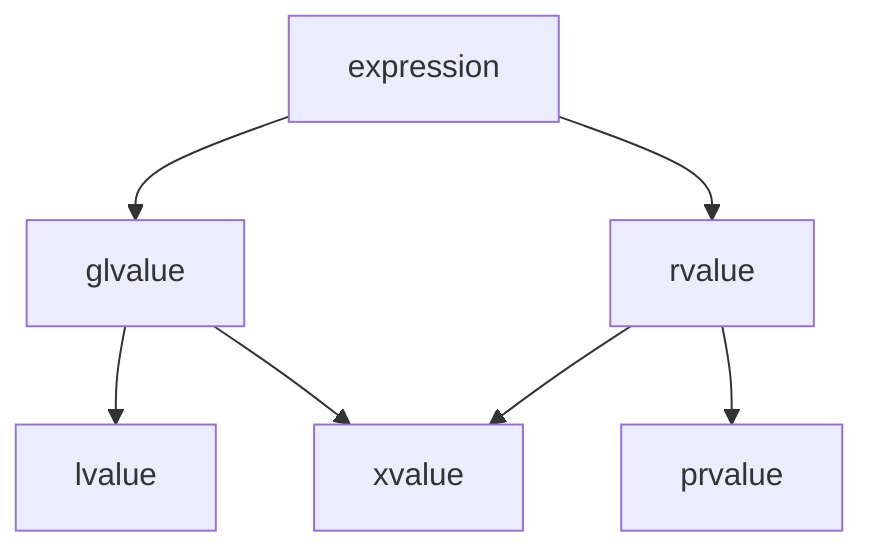

# Value Taxonomy

Every C++ expression has a **value category** — a property that determines which operations are
legal on it and how it interacts with overloaded functions. C++17 defines three primary categories
(lvalue, xvalue, prvalue) and two composite categories (glvalue, rvalue). Understanding these
categories is essential to understanding move semantics, reference binding, and overload resolution.

## 1.1 The Three-Valued System (C++17)

Since C++17, every expression belongs to exactly one of three **primary value categories** [N4950
§7.2.1]:

- **lvalue:** an expression that designates a function or an object. It has an identity (address)
  and, conceptually, a location in memory.
- **prvalue ("pure" rvalue):** an expression that initializes an object or computes a value. It has
  no identity — it is a transient value.
- **xvalue ("expiring" value):** an expression that designates an object whose resources can be
  reused (typically because it is nearing the end of its lifetime). It has identity but can be moved
  from.

Two **compound categories** are defined as unions of the primaries [N4950 §7.2.1]:

- **glvalue ("generalized" lvalue):** lvalue ∪ xvalue — expressions with identity.
- **rvalue:** prvalue ∪ xvalue — expressions that can be moved from.

## 1.2 Value Category Diagram



In set notation:

$$
\text{expression} = \underbrace{\text{glvalue}}_{\text{lvalue} \cup \text{xvalue}} \;\cup\; \underbrace{\text{rvalue}}_{\text{prvalue} \cup \text{xvalue}}
$$

The xvalue category occupies the intersection — it is both a glvalue (it has identity) and an rvalue
(it can be moved from).

## 1.3 Historical Evolution

| Standard | Model         | Categories                               | Key Change                                              |
| :------- | :------------ | :--------------------------------------- | :------------------------------------------------------ |
| C++98/03 | Two-valued    | lvalue, rvalue                           | Simpler model; no move semantics                        |
| C++11/14 | Five-valued   | lvalue, xvalue, prvalue, glvalue, rvalue | Move semantics, rvalue references introduced            |
| C++17    | Three primary | lvalue, xvalue, prvalue                  | Guaranteed copy elision; prvalues are no longer objects |

C++98 distinguished only lvalues (things you can take the address of) and rvalues (everything else).
C++11 introduced move semantics, requiring the xvalue category to represent "things that have
identity but are about to expire." C++17 refined the model by making prvalues non-objects until they
are materialized, which enabled guaranteed copy elision [N4950 §8.4.4].

:::info
Relevance The value category of an expression determines which overloaded function is called
(via reference binding rules), whether a move constructor or copy constructor is invoked, and
whether temporary lifetime extension applies. Understanding value categories is essential to
understanding why move semantics work.
:::

## 2.1 lvalue

An expression is an lvalue if it [N4950 §7.2.1]:

- Has a name or can be addressed with `&`.
- Persists beyond a single full-expression.
- Appears on the left side of an assignment (historically; this is a useful heuristic, not the
  definition).

```cpp
#include <type_traits>
#include <cassert>

int main() {
    int x = 42;
    int& ref = x;

    // x is an lvalue
    static_assert(std::is_lvalue_reference_v<decltype((x))>);
    assert(&x != nullptr);  // Can take address

    // ref is an lvalue (references are always lvalues when used)
    static_assert(std::is_lvalue_reference_v<decltype((ref))>);

    // String literal "hello" is an lvalue
    static_assert(std::is_lvalue_reference_v<decltype(("hello"))>);
}
```

## 2.2 prvalue

An expression is a prvalue if it [N4950 §7.2.1]:

- Is a literal (except string literals, which are lvalues).
- Is the return value of a function that returns by value (not by reference).
- Is a temporary object, such as the result of a cast to a non-reference type.
- Has no identity — you cannot take its address.

```cpp
#include <type_traits>

int return_by_value() { return 42; }

int main() {
    // Integer literal 42 is a prvalue
    static_assert(std::is_rvalue_reference_v<decltype(static_cast<int&&>(42))>);
    static_assert(!std::is_lvalue_reference_v<decltype((42))>);

    // Return value of a by-value function is a prvalue
    static_assert(!std::is_lvalue_reference_v<decltype((return_by_value()))>);

    // Arithmetic result is a prvalue
    int a = 1, b = 2;
    static_assert(!std::is_lvalue_reference_v<decltype((a + b))>);

    // bool literal false is a prvalue
    static_assert(!std::is_lvalue_reference_v<decltype((false))>);
}
```

## 2.3 xvalue

An expression is an xvalue if it [N4950 §7.2.1]:

- Is the result of `std::move(x)` or `std::forward<T>(x)`.
- Is a member of an object that has been cast to an rvalue reference (e.g.,
  `std::move(obj).member`).
- Designates an object nearing the end of its lifetime whose resources can be reused.

```cpp
#include <type_traits>
#include <utility>

struct S {
    int member;
};

int main() {
    int x = 42;

    // std::move(x) produces an xvalue
    static_assert(std::is_rvalue_reference_v<decltype((std::move(x)))>);

    // Member of an xvalue is an xvalue
    S s{10};
    static_assert(std::is_rvalue_reference_v<decltype((std::move(s).member))>);

    // Cast to rvalue reference produces an xvalue
    static_assert(std::is_rvalue_reference_v<decltype((static_cast<int&&>(x)))>);
}
```

## 2.4 Summary Table

| Category | Has Identity? | Can Move From? | Typical Examples                                                                 |
| :------- | :------------ | :------------- | :------------------------------------------------------------------------------- |
| lvalue   | Yes           | No             | named variables, `*ptr`, string literals, `arr[i]`                               |
| xvalue   | Yes           | Yes            | `std::move(x)`, `std::forward<T>(x)`, `return std::move(local);` (member access) |
| prvalue  | No            | Yes            | `42`, `3.14`, `f()` (by-value return), `int{7}`, `a + b`                         |

:::info
Relevance The parenthesized expression `decltype((e))` yields the **declared type of `e`**
with reference qualifiers preserved, which is how the `static_assert` tests above work. Without the
extra parentheses, `decltype(e)` strips references. This distinction is critical when writing type
traits or SFINAE constraints.
:::

## See Also

- [Reference Collapsing and Forwarding References](2_reference_collapsing.md)
- [Temporary Materialization](3_temporary_materialization.md)

## 3.1 Expression Classification Rules

Every C++ expression has **exactly one** primary value category [N4950 §7.2.1]. The classification
rules are exhaustive and mutually exclusive. No expression belongs to two primary categories
simultaneously.

### Classification Decision Tree

1. Does the expression designate an object or function with identity (an address)?
   - **Yes** → It is a **glvalue**. Continue to step 2.
   - **No** → It is a **prvalue** (the expression is a pure value or initializer).

2. Is the glvalue move-eligible (can its resources be reused)?
   - **Yes** → It is an **xvalue** (expiring value).
   - **No** → It is an **lvalue**.

The compound categories are unions:

$$
\text{glvalue} = \text{lvalue} \cup \text{xvalue}
$$

$$
\text{rvalue} = \text{prvalue} \cup \text{xvalue}
$$

$$
\text{expression} = \text{lvalue} \cup \text{xvalue} \cup \text{prvalue}
$$

### Formal Definitions [N4950 §7.2.1]

| Primary Category | Formal Definition                                                                                                                                                                     |
| :--------------- | :------------------------------------------------------------------------------------------------------------------------------------------------------------------------------------ |
| **lvalue**       | An expression that designates a function or an object [N4950 §7.2.1]. Example: a variable name, dereferenced pointer, array subscript, string literal.                                |
| **xvalue**       | An expression that designates an object whose resources can be reused (typically near end of lifetime) [N4950 §7.2.1]. Example: result of `std::move(x)`, member of rvalue reference. |
| **prvalue**      | An expression that initializes an object or computes a value, has no identity [N4950 §7.2.1]. Example: literal, arithmetic result, by-value function return.                          |

## 3.2 `decltype` Behavior for Each Category

The `decltype` specifier behaves differently depending on the value category of its argument. This
is critical for understanding template metaprogramming and SFINAE constraints.

| Expression `e`             | `decltype(e)` | `decltype((e))`               | Explanation                           |
| :------------------------- | :------------ | :---------------------------- | :------------------------------------ |
| `int x = 42;` — `x`        | `int`         | `int&` (lvalue reference)     | `decltype(e)` gives declared type     |
| `const int cx = 1;` — `cx` | `const int`   | `const int&`                  | `decltype(e)` preserves cv-qualifiers |
| `int& r = x;` — `r`        | `int`         | `int&`                        | Named references are lvalues          |
| `std::move(x)`             | `int&&`       | `int&&` (xvalue reference)    | rvalue reference                      |
| `42`                       | `int`         | `int` (prvalue, no reference) | Prvalues have no reference qualifier  |
| `f()` (returns `int`)      | `int`         | `int` (prvalue)               | Function return is prvalue            |

The key rule: `decltype((e))` (with extra parentheses) yields the type of the **expression**, which
includes reference qualifiers. `decltype(e)` (without extra parentheses) yields the **declared type
of the identifier**, stripping references.

```cpp
#include <type_traits>
#include <cassert>

int global = 42;

int& return_ref() { return global; }
int return_val() { return 42; }
int&& return_rref() { return static_cast<int&&>(global); }

int main() {
    int x = 10;
    const int cx = 20;

    // decltype without parens: declared type
    static_assert(std::is_same_v<decltype(x), int>);
    static_assert(std::is_same_v<decltype(cx), const int>);

    // decltype with parens: expression type (includes reference)
    static_assert(std::is_same_v<decltype((x)), int&>);
    static_assert(std::is_same_v<decltype((cx)), const int&>);

    // Function return values
    static_assert(std::is_same_v<decltype(return_val()), int>);
    static_assert(std::is_same_v<decltype((return_val())), int>);

    // lvalue reference return
    static_assert(std::is_same_v<decltype(return_ref()), int&>);
    static_assert(std::is_same_v<decltype((return_ref())), int&>);

    // rvalue reference return
    static_assert(std::is_same_v<decltype(return_rref()), int&&>);
    static_assert(std::is_same_v<decltype((return_rref())), int&&>);

    // std::move produces xvalue
    static_assert(std::is_same_v<decltype((std::move(x))), int&&>);

    assert(true);
}
```

## 3.3 Reference Collapsing and Value Categories

Reference collapsing occurs during template argument deduction and `typedef`/`using` alias
formation. When a reference to a reference is formed, the references **collapse** according to these
rules [N4950 §11.3.2]:

| Template Argument `T` | Reference Type `T&` | Reference Type `T&&` |
| :-------------------- | :------------------ | :------------------- |
| `int`                 | `int&`              | `int&&`              |
| `int&`                | `int&`              | `int&`               |
| `int&&`               | `int&`              | `int&&`              |

The rules are:

$$
T\&\& \rightarrow T\&, \quad T\&\& \rightarrow T\&\&, \quad \text{everything else} \rightarrow T\&
$$

More concisely: **only `T&& &&` collapses to `T&&`; all other combinations collapse to `T&`.**

Reference collapsing is the mechanism that enables **perfect forwarding** through `std::forward`.
When a forwarding reference `T&&` receives an lvalue, `T` is deduced as `U&`, and `T&&` becomes
`U& &&`, which collapses to `U&`. When it receives an rvalue, `T` is deduced as `U`, and `T&&` is
`U&&`.

```cpp
#include <type_traits>
#include <utility>

template<typename T>
struct identity { using type = T; };

template<typename T>
using identity_t = typename identity<T>::type;

int main() {
    // Reference collapsing with typedef/using
    using LRef = int&;
    using RRef = int&&;

    // LRef& collapses to int&
    static_assert(std::is_same_v<identity_t<LRef&>, int&>);
    // LRef&& collapses to int&
    static_assert(std::is_same_v<identity_t<LRef&&>, int&>);
    // RRef& collapses to int&
    static_assert(std::is_same_v<identity_t<RRef&>, int&>);
    // RRef&& collapses to int&&
    static_assert(std::is_same_v<identity_t<RRef&&>, int&&>);
}
```

## 3.4 Move Semantics as a Consequence of the Taxonomy

Move semantics are not a separate language feature bolted onto C++ — they are a **direct consequence
of the value category taxonomy**. The mechanism works as follows:

1. Overload resolution prefers rvalue reference bindings for rvalue arguments.
2. `std::move` converts an lvalue to an xvalue (an rvalue).
3. `std::forward` preserves the original value category of a forwarded argument.
4. Move constructors and move assignment operators take `T&&` parameters, which bind to rvalues.

```cpp
#include <iostream>
#include <utility>
#include <string>
#include <vector>

class Buffer {
    std::vector<int> data_;
public:
    Buffer() { std::cout << "  default ctor\n"; }
    Buffer(const Buffer& other) : data_(other.data_) {
        std::cout << "  copy ctor\n";
    }
    Buffer(Buffer&& other) noexcept : data_(std::move(other.data_)) {
        std::cout << "  move ctor\n";
    }
    Buffer& operator=(const Buffer& other) {
        data_ = other.data_;
        std::cout << "  copy assign\n";
        return *this;
    }
    Buffer& operator=(Buffer&& other) noexcept {
        data_ = std::move(other.data_);
        std::cout << "  move assign\n";
        return *this;
    }
};

Buffer make_buffer() {
    Buffer b;
    return b;  // b is an lvalue, but return by value treats it as prvalue (C++17)
               // NRVO may apply; if not, move ctor is used
}

template<typename T>
Buffer wrap_buffer(T&& arg) {
    Buffer b;
    // std::forward preserves the value category of arg:
    // If arg is an lvalue: b = arg calls copy assign
    // If arg is an rvalue: b = std::forward<T>(arg) calls move assign
    b = std::forward<T>(arg);
    return b;
}

int main() {
    std::cout << "Direct init from lvalue:\n";
    Buffer a;
    Buffer b = a;  // copy ctor — a is an lvalue

    std::cout << "Direct init from xvalue:\n";
    Buffer c = std::move(a);  // move ctor — std::move(a) is an xvalue (rvalue)

    std::cout << "Return from function (NRVO):\n";
    Buffer d = make_buffer();  // NRVO or move ctor

    std::cout << "Forward lvalue:\n";
    Buffer e;
    wrap_buffer(e);  // arg is lvalue → copy assign

    std::cout << "Forward rvalue:\n";
    wrap_buffer(Buffer{});  // arg is rvalue → move assign
}
```

## 3.5 `std::move` and `std::forward` as Category Converters

Both `std::move` and `std::forward` are casts that change the value category of an expression. They
do not move anything — they simply enable move semantics by converting the expression to an rvalue.

### `std::move`: lvalue → xvalue

```cpp
// Simplified implementation of std::move
template<typename T>
constexpr typename std::remove_reference_t<T>&& move(T&& t) noexcept {
    return static_cast<typename std::remove_reference_t<T>&&>(t);
}
```

`std::move` unconditionally casts its argument to an rvalue reference. The argument can be an lvalue
or an rvalue — in either case, the result is an xvalue.

### `std::forward`: preserves original category

```cpp
// Simplified implementation of std::forward
template<typename T>
constexpr T&& forward(typename std::remove_reference_t<T>& t) noexcept {
    return static_cast<T&&>(t);
}

template<typename T>
constexpr T&& forward(typename std::remove_reference_t<T>&& t) noexcept {
    static_assert(!std::is_lvalue_reference_v<T>,
                  "std::forward must not be used to move an rvalue");
    return static_cast<T&&>(t);
}
```

When `T` is deduced as `U&` (lvalue was passed), `T&&` is `U&` after collapsing → `forward` returns
`U&` (lvalue preserved). When `T` is deduced as `U` (rvalue was passed), `T&&` is `U&&` → `forward`
returns `U&&` (rvalue preserved).

```cpp
#include <type_traits>
#include <utility>

int main() {
    int x = 42;

    // std::move: always produces xvalue (rvalue reference)
    static_assert(std::is_same_v<decltype(std::move(x)), int&&>);
    static_assert(std::is_same_v<decltype(std::move(std::move(x))), int&&>);

    // std::forward: preserves category
    auto& lref = x;
    static_assert(std::is_same_v<decltype(std::forward<int&>(lref)), int&>);

    int&& rref = std::move(x);
    static_assert(std::is_same_v<decltype(std::forward<int>(rref)), int&&>);
}
```

## Common Pitfalls

- **Using `std::move` on a `const` object.** `std::move(const T&)` returns `const T&&`, which binds
  to copy constructors (not move constructors). The object cannot actually be moved from.
- **Using `std::move` on a return value.** `return std::move(local);` prevents NRVO and forces a
  move. Just write `return local;` — the compiler applies NRVO or implicit move automatically.
- **Using `std::forward` outside of forwarding references.** `std::forward<T>(x)` is only meaningful
  when `T` is a template parameter deduced from a forwarding reference (`T&&`). Otherwise, it
  behaves identically to `std::move` (when `T` is a non-reference type) or does nothing (when `T` is
  an lvalue reference).
- **Confusing xvalue with prvalue.** Both are rvalues, but only xvalues have identity (an address).
  Prvalues do not exist as objects until materialized (C++17+).

:::

:::
