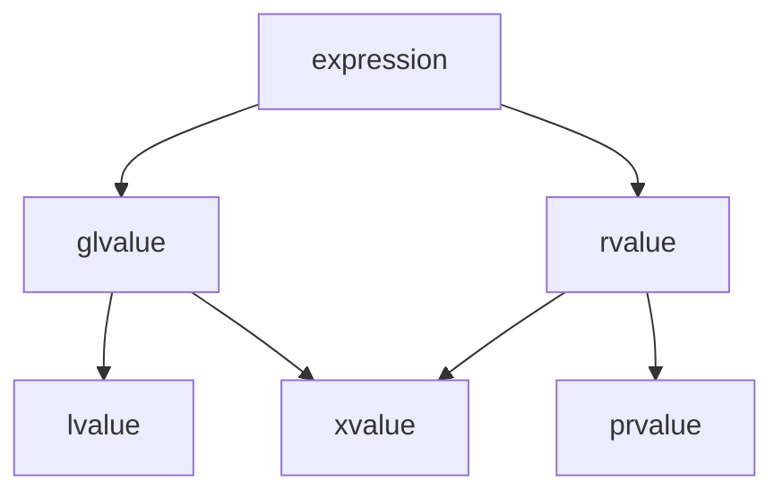

# Value Taxonomy

Every C++ expression has a **value category** — a property that determines which operations are
legal on it and how it interacts with overloaded functions. C++17 defines three primary categories
(lvalue, xvalue, prvalue) and two composite categories (glvalue, rvalue). Understanding these
categories is essential to understanding move semantics, reference binding, and overload resolution.

## 1.1 The Three-Valued System (C++17)

Since C++17, every expression belongs to exactly one of three **primary value categories** [N4950
§7.2.1]:

- **lvalue:** an expression that designates a function or an object. It has an identity (address)
  and, conceptually, a location in memory.
- **prvalue ("pure" rvalue):** an expression that initializes an object or computes a value. It has
  no identity — it is a transient value.
- **xvalue ("expiring" value):** an expression that designates an object whose resources can be
  reused (typically because it is nearing the end of its lifetime). It has identity but can be moved
  from.

Two **compound categories** are defined as unions of the primaries [N4950 §7.2.1]:

- **glvalue ("generalized" lvalue):** lvalue ∪ xvalue — expressions with identity.
- **rvalue:** prvalue ∪ xvalue — expressions that can be moved from.

## 1.2 Value Category Diagram



In set notation:

$$
\text{expression} = \underbrace{\text{glvalue}}_{\text{lvalue} \cup \text{xvalue}} \;\cup\; \underbrace{\text{rvalue}}_{\text{prvalue} \cup \text{xvalue}}
$$

The xvalue category occupies the intersection — it is both a glvalue (it has identity) and an rvalue
(it can be moved from).

## 1.3 Historical Evolution

| Standard | Model         | Categories                               | Key Change                                              |
| :------- | :------------ | :--------------------------------------- | :------------------------------------------------------ |
| C++98/03 | Two-valued    | lvalue, rvalue                           | Simpler model; no move semantics                        |
| C++11/14 | Five-valued   | lvalue, xvalue, prvalue, glvalue, rvalue | Move semantics, rvalue references introduced            |
| C++17    | Three primary | lvalue, xvalue, prvalue                  | Guaranteed copy elision; prvalues are no longer objects |

C++98 distinguished only lvalues (things you can take the address of) and rvalues (everything else).
C++11 introduced move semantics, requiring the xvalue category to represent "things that have
identity but are about to expire." C++17 refined the model by making prvalues non-objects until they
are materialized, which enabled guaranteed copy elision [N4950 §8.4.4].

:::info Relevance The value category of an expression determines which overloaded function is called
(via reference binding rules), whether a move constructor or copy constructor is invoked, and
whether temporary lifetime extension applies. Understanding value categories is essential to
understanding why move semantics work. :::

## 2.1 lvalue

An expression is an lvalue if it [N4950 §7.2.1]:

- Has a name or can be addressed with `&`.
- Persists beyond a single full-expression.
- Appears on the left side of an assignment (historically; this is a useful heuristic, not the
  definition).

```cpp
#include <type_traits>
#include <cassert>

int main() {
    int x = 42;
    int& ref = x;

    // x is an lvalue
    static_assert(std::is_lvalue_reference_v<decltype((x))>);
    assert(&x != nullptr);  // Can take address

    // ref is an lvalue (references are always lvalues when used)
    static_assert(std::is_lvalue_reference_v<decltype((ref))>);

    // String literal "hello" is an lvalue
    static_assert(std::is_lvalue_reference_v<decltype(("hello"))>);
}
```

## 2.2 prvalue

An expression is a prvalue if it [N4950 §7.2.1]:

- Is a literal (except string literals, which are lvalues).
- Is the return value of a function that returns by value (not by reference).
- Is a temporary object, such as the result of a cast to a non-reference type.
- Has no identity — you cannot take its address.

```cpp
#include <type_traits>

int return_by_value() { return 42; }

int main() {
    // Integer literal 42 is a prvalue
    static_assert(std::is_rvalue_reference_v<decltype(static_cast<int&&>(42))>);
    static_assert(!std::is_lvalue_reference_v<decltype((42))>);

    // Return value of a by-value function is a prvalue
    static_assert(!std::is_lvalue_reference_v<decltype((return_by_value()))>);

    // Arithmetic result is a prvalue
    int a = 1, b = 2;
    static_assert(!std::is_lvalue_reference_v<decltype((a + b))>);

    // bool literal false is a prvalue
    static_assert(!std::is_lvalue_reference_v<decltype((false))>);
}
```

## 2.3 xvalue

An expression is an xvalue if it [N4950 §7.2.1]:

- Is the result of `std::move(x)` or `std::forward<T>(x)`.
- Is a member of an object that has been cast to an rvalue reference (e.g.,
  `std::move(obj).member`).
- Designates an object nearing the end of its lifetime whose resources can be reused.

```cpp
#include <type_traits>
#include <utility>

struct S {
    int member;
};

int main() {
    int x = 42;

    // std::move(x) produces an xvalue
    static_assert(std::is_rvalue_reference_v<decltype((std::move(x)))>);

    // Member of an xvalue is an xvalue
    S s{10};
    static_assert(std::is_rvalue_reference_v<decltype((std::move(s).member))>);

    // Cast to rvalue reference produces an xvalue
    static_assert(std::is_rvalue_reference_v<decltype((static_cast<int&&>(x)))>);
}
```

## 2.4 Summary Table

| Category | Has Identity? | Can Move From? | Typical Examples                                                                 |
| :------- | :------------ | :------------- | :------------------------------------------------------------------------------- |
| lvalue   | Yes           | No             | named variables, `*ptr`, string literals, `arr[i]`                               |
| xvalue   | Yes           | Yes            | `std::move(x)`, `std::forward<T>(x)`, `return std::move(local);` (member access) |
| prvalue  | No            | Yes            | `42`, `3.14`, `f()` (by-value return), `int{7}`, `a + b`                         |

:::info Relevance The parenthesized expression `decltype((e))` yields the **declared type of `e`**
with reference qualifiers preserved, which is how the `static_assert` tests above work. Without the
extra parentheses, `decltype(e)` strips references. This distinction is critical when writing type
traits or SFINAE constraints. :::

## See Also

- [Reference Collapsing and Forwarding References](2_reference_collapsing.md)
- [Temporary Materialization](3_temporary_materialization.md)
