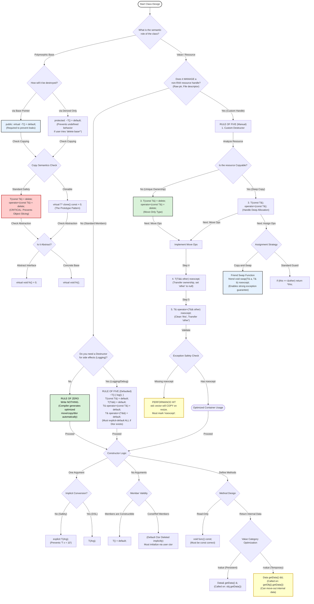

```mermaid
graph TD
    Start(["Start Class Design"]) --> Semantics{"What is the semantic<br/>role of the class?"}

    %% ==========================================================
    %% BRANCH 1: POLYMORPHIC BASE CLASSES (Interfaces/Hierarchies)
    %% ==========================================================
    Semantics -- "Polymorphic Base" --> PolyDest{"How will it be destroyed?"}

    PolyDest -- "via Base Pointer" --> PubVirt["public: virtual ~T() = default;<br/>(Required to prevent leaks)"]
    PolyDest -- "via Derived Only" --> ProtNonVirt["protected: ~T() = default;<br/>(Prevents undefined behavior<br/>if user tries 'delete base*')"]

    PubVirt --> |Check Copying| Slicing{"Copy Semantics Check"}
    ProtNonVirt --> |Check Copying| Slicing

    %% Slicing Prevention
    Slicing -- "Standard Safety" --> DelCopy["T(const T&) = delete;<br/>operator=(const T&) = delete;<br/>(CRITICAL: Prevents Object Slicing)"]
    Slicing -- "Clonable" --> VirtClone["virtual T* clone() const = 0;<br/>(The Prototype Pattern)"]

    DelCopy --> |Check Abstraction| Pure{"Is it Abstract?"}
    VirtClone --> |Check Abstraction| Pure

    Pure -- "Abstract Interface" --> PureFunc["virtual void fn() = 0;"]
    Pure -- "Concrete Base" --> VirtFunc["virtual void fn();"]

    %% ==========================================================
    %% BRANCH 2: VALUE TYPES & RESOURCE OWNERS (Rule of 0/5)
    %% ==========================================================
    Semantics -- "Value / Resource" --> ResCheck{"Does it MANAGE a<br/>non-RAII resource handle?<br/>(Raw ptr, File descriptor)"}

    %% --- THE RULE OF ZERO ---
    ResCheck -- "No (Standard Members)" --> AuxDtor{"Do you need a Destructor<br/>for side effects (Logging)?"}

    AuxDtor -- "No" --> Rule0["RULE OF ZERO<br/>Write NOTHING.<br/>(Compiler generates optimized<br/>move/copy/dtor automatically)"]

    AuxDtor -- "Yes (Logging/Debug)" --> Rule5Def["RULE OF FIVE (Defaulted)<br/>~T() { log(); }<br/>T(const T&) = default;<br/>T(T&&) = default;<br/>T& operator=(const T&) = default;<br/>T& operator=(T&&) = default;<br/>(Must explicit-default ALL if Dtor exists)"]

    %% --- THE RULE OF FIVE ---
    ResCheck -- "Yes (Custom Handle)" --> Rule5["RULE OF FIVE (Manual)<br/>1. Custom Destructor"]

    Rule5 --> |Analyze Resource| CopyLogic{"Is the resource Copyable?"}

    %% Copy Operations
    CopyLogic -- "No (Unique Ownership)" --> DelCopyOp["3. T(const T&) = delete;<br/>operator=(const T&) = delete;<br/>(Move-Only Type)"]
    CopyLogic -- "Yes (Deep Copy)" --> DeepCopy["3. T(const T&);<br/>operator=(const T&);<br/>(Handle Deep Allocation)"]

    %% Move Operations (Critical Performance)
    DelCopyOp --> |Next: Move Ops| MoveLogic
    DeepCopy --> |Next: Move Ops| MoveLogic

    MoveLogic["Implement Move Ops"] --> |Step 4| MoveCtor["4. T(T&& other) noexcept;<br/>(Transfer ownership, set 'other' to null)"]
    MoveCtor --> |Step 5| MoveAssign["5. T& operator=(T&& other) noexcept;<br/>(Clean 'this', Transfer 'other')"]

    MoveAssign --> |Validate| NoExceptChk{"Exception Safety Check"}
    NoExceptChk -- "Missing noexcept" --> Slow["PERFORMANCE HIT<br/>std::vector will COPY on resize.<br/>Must mark 'noexcept'."]
    NoExceptChk -- "Has noexcept" --> Fast([Optimized Container Usage])

    %% Assignment Idioms
    DeepCopy --> |Next: Assign Ops| AssignIdiom{"Assignment Strategy"}
    AssignIdiom -- "Copy-and-Swap" --> Swap["Friend Swap Function<br/>friend void swap(T& a, T& b) noexcept;<br/>(Enables strong exception guarantee)"]
    AssignIdiom -- "Standard Guard" --> SelfAssgn["if (this == &other) return *this;"]

    %% ==========================================================
    %% BRANCH 3: CONSTRUCTOR & MEMBER DESIGN
    %% ==========================================================
    Rule0 --> |Proceed| Ctors
    Rule5Def --> |Proceed| Ctors
    Fast --> |Proceed| Ctors

    Ctors{"Constructor Logic"}

    Ctors -- "One Argument" --> Conv{"Implicit Conversion?"}
    Conv -- "No (Safety)" --> Explicit["explicit T(Arg);<br/>(Prevents 'T x = 10')"]
    Conv -- "Yes (DSL)" --> Implicit["T(Arg);"]

    Ctors -- "No Arguments" --> DefCtor{"Member Validity"}
    DefCtor -- "Members are Constructible" --> Default["T() = default;"]
    DefCtor -- "Const/Ref Members" --> NoDef["(Default Ctor Deleted implicitly)<br/>Must initialize via user ctor"]

    %% ==========================================================
    %% BRANCH 4: ACCESSORS & REF-QUALIFIERS
    %% ==========================================================
    Ctors --> |Define Methods| Methods{"Method Design"}

    Methods -- "Read-Only" --> ConstMeth["void func() const;<br/>(Must be const correct)"]

    Methods -- "Return Internal Data" --> RefQual{"Value Category Optimization"}
    RefQual -- "lvalue (Persistent)" --> LRef["Data& getData() &;<br/>(Called on: obj.getData())"]
    RefQual -- "rvalue (Temporary)" --> RRef["Data getData() &&;<br/>(Called on: getObj().getData())<br/>(Can move-out internal data)"]

    %% Styling
    style Start fill:#fff,stroke:#333,stroke-width:2px
    style DelCopy fill:#ffcccc,stroke:#b30000,stroke-width:2px
    style DelCopyOp fill:#d9f2d9,stroke:#333,stroke-width:2px
    style Slow fill:#ffffcc,stroke:#cc9900,stroke-width:2px
    style Swap fill:#e6f2ff,stroke:#333,stroke-width:2px
    style Rule0 fill:#d9f2d9,stroke:#333,stroke-width:2px,color:#000
    style PubVirt fill:#e6f2ff,stroke:#333,stroke-width:2px
    style RRef fill:#ffffcc,stroke:#cc9900,stroke-width:2px
```
