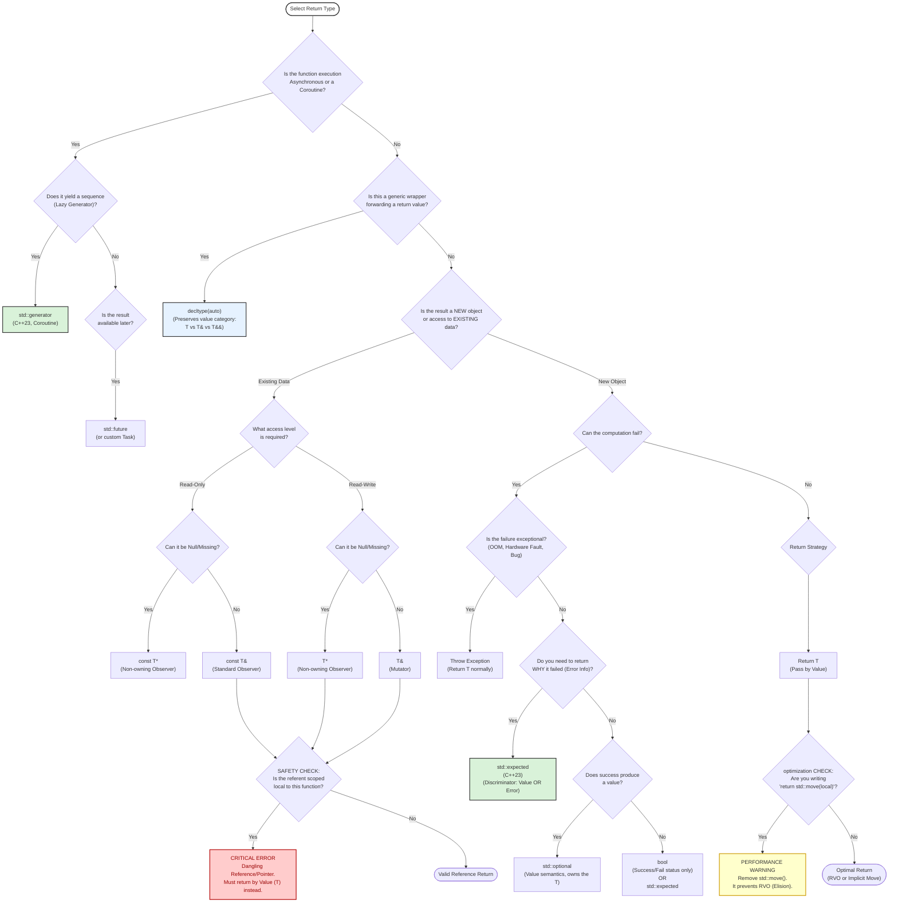

```mermaid
graph TD
    Start(["Select Return Type"]) --> Async{"Is the function execution<br/>Asynchronous or a Coroutine?"}

    %% --- BRANCH 1: ASYNC & COROUTINES ---
    Async -- Yes --> Yields{"Does it yield a sequence<br/>(Lazy Generator)?"}
    Yields -- Yes --> Gen["std::generator<T><br/>(C++23, Coroutine)"]
    Yields -- No --> AsyncRes{"Is the result<br/>available later?"}
    AsyncRes -- Yes --> Future["std::future<T><br/>(or custom Task<T>)"]

    Async -- No --> Wrapper{"Is this a generic wrapper<br/>forwarding a return value?"}

    %% --- BRANCH 2: PERFECT FORWARDING ---
    Wrapper -- Yes --> DeclType["decltype(auto)<br/>(Preserves value category:<br/>T vs T& vs T&&)"]

    Wrapper -- No --> Category{"Is the result a NEW object<br/>or access to EXISTING data?"}

    %% --- BRANCH 3: EXISTING DATA (ACCESSORS) ---
    Category -- Existing Data --> Mutability{"What access level<br/>is required?"}

    Mutability -- Read-Only --> NullableRead{"Can it be Null/Missing?"}
    NullableRead -- Yes --> RawPtrConst["const T*<br/>(Non-owning Observer)"]
    NullableRead -- No --> ConstRef["const T&<br/>(Standard Observer)"]

    Mutability -- Read-Write --> NullableWrite{"Can it be Null/Missing?"}
    NullableWrite -- Yes --> RawPtr["T*<br/>(Non-owning Observer)"]
    NullableWrite -- No --> MutRef["T&<br/>(Mutator)"]

    %% Lifetime Safety Check for References
    MutRef --> LifeCheck{"SAFETY CHECK:<br/>Is the referent scoped<br/>local to this function?"}
    ConstRef --> LifeCheck
    RawPtr --> LifeCheck
    LifeCheck -- Yes --> Dangling["CRITICAL ERROR<br/>Dangling Reference/Pointer.<br/>Must return by Value (T) instead."]
    LifeCheck -- No --> ValidRef(["Valid Reference Return"])

    %% --- BRANCH 4: NEW OBJECTS (COMPUTATION) ---
    Category -- New Object --> Fail{"Can the computation fail?"}

    %% Failure Handling
    Fail -- Yes --> Fatal{"Is the failure exceptional?<br/>(OOM, Hardware Fault, Bug)"}
    Fatal -- Yes --> Exception["Throw Exception<br/>(Return T normally)"]

    Fatal -- No --> ErrInfo{"Do you need to return<br/>WHY it failed (Error Info)?"}

    %% C++23 Expected vs Optional
    ErrInfo -- Yes --> Expected["std::expected<T, E><br/>(C++23)<br/>(Discriminator: Value OR Error)"]
    ErrInfo -- No --> HasPayload{"Does success produce<br/>a value?"}

    HasPayload -- Yes --> Optional["std::optional<T><br/>(Value semantics, owns the T)"]
    HasPayload -- No --> Status["bool<br/>(Success/Fail status only)<br/>OR<br/>std::expected<void, E>"]

    %% Success Handling (RVO Logic)
    Fail -- No --> RVO{"Return Strategy"}
    RVO --> ByVal["Return T<br/>(Pass by Value)"]
    ByVal --> MoveCheck{"optimization CHECK:<br/>Are you writing<br/>'return std::move(local)'?"}
    MoveCheck -- Yes --> BadMove["PERFORMANCE WARNING<br/>Remove std::move().<br/>It prevents RVO (Elision)."]
    MoveCheck -- No --> GoodMove(["Optimal Return<br/>(RVO or Implicit Move)"])

    %% Styling
    style Start fill:#fff,stroke:#333,stroke-width:2px
    style Dangling fill:#ffcccc,stroke:#b30000,stroke-width:2px,color:#900
    style BadMove fill:#ffffcc,stroke:#cc9900,stroke-width:2px
    style DeclType fill:#e6f2ff,stroke:#333,stroke-width:2px
    style Expected fill:#d9f2d9,stroke:#333,stroke-width:2px
    style Gen fill:#d9f2d9,stroke:#333,stroke-width:2px
```
