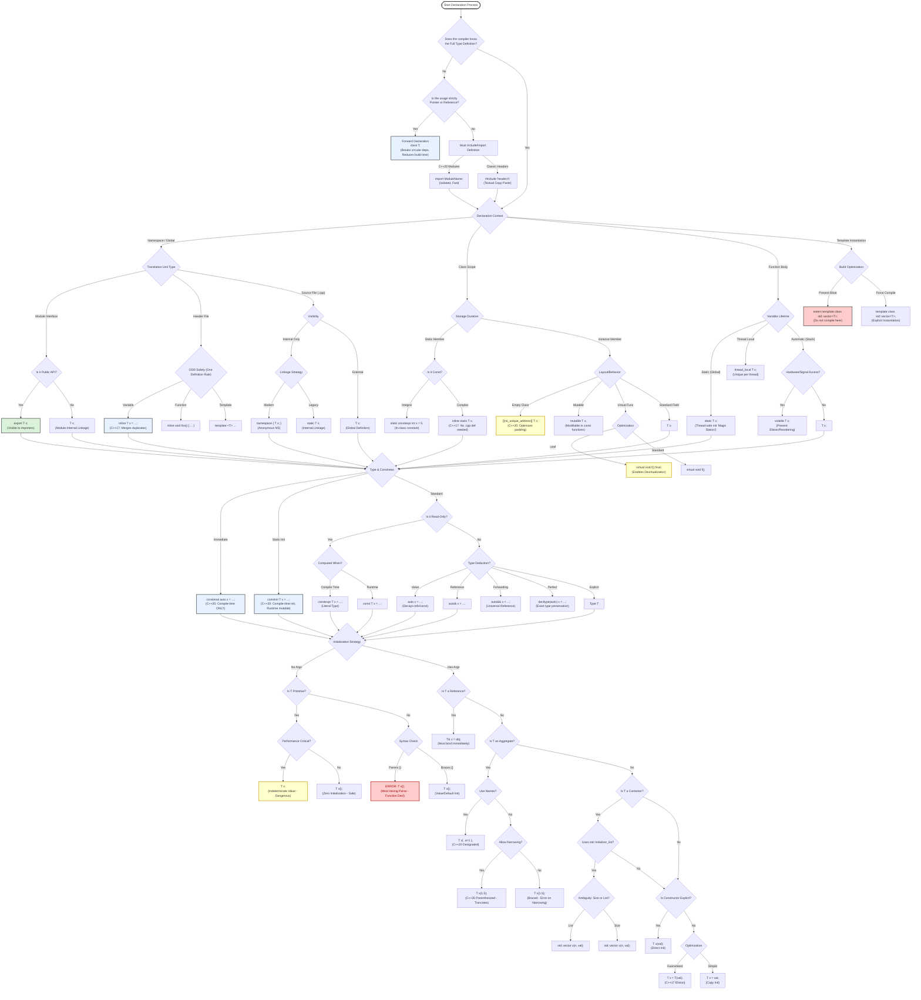

```mermaid
graph TD
    Start(["Start Declaration Process"]) --> Deps{"Does the compiler know<br/>the Full Type Definition?"}

    %% ==========================================================
    %% PHASE 1: DEPENDENCY & FORWARD DECLARATION
    %% ==========================================================
    Deps -- No --> PointerChk{"Is the usage strictly<br/>Pointer or Reference?"}
    PointerChk -- Yes --> FwdDecl["Forward Declaration<br/>class T;<br/>(Breaks circular deps, Reduces build time)"]
    PointerChk -- No --> IncludeReq["Must Include/Import Definition"]

    IncludeReq -- "C++20 Modules" --> ImportStmt["import ModuleName;<br/>(Isolated, Fast)"]
    IncludeReq -- "Classic Headers" --> IncludeStmt["#include 'header.h'<br/>(Textual Copy-Paste)"]

    %% ==========================================================
    %% PHASE 2: CONTEXT & SCOPE (Where are we?)
    %% ==========================================================
    Deps -- Yes --> Context{"Declaration Context"}
    ImportStmt --> Context
    IncludeStmt --> Context

    %% --- PATH A: NAMESPACE / GLOBAL (Linkage & ODR) ---
    Context -- "Namespace / Global" --> TU{"Translation Unit Type"}

    TU -- "Module Interface" --> ExportChk{"Is it Public API?"}
    ExportChk -- Yes --> ModExp["export T x;<br/>(Visible to importers)"]
    ExportChk -- No --> ModPriv["T x;<br/>(Module-Internal Linkage)"]

    TU -- "Header File" --> ODR{"ODR Safety (One Definition Rule)"}
    ODR -- "Variable" --> InlineVar["inline T x = ...;<br/>(C++17: Merges duplicates)"]
    ODR -- "Function" --> InlineFunc["inline void foo() { ... }"]
    ODR -- "Template" --> TemplDecl["template &lt;T&gt; ..."]

    TU -- "Source File (.cpp)" --> Vis{"Visibility"}
    Vis -- "Internal Only" --> InternalLink{"Linkage Strategy"}
    InternalLink -- "Modern" --> AnonNS["namespace { T x; }<br/>(Anonymous NS)"]
    InternalLink -- "Legacy" --> StatGlob["static T x;<br/>(Internal Linkage)"]
    Vis -- "External" --> ExtDef["T x;<br/>(Global Definition)"]

    %% --- PATH B: CLASS MEMBER (Layout & Meta) ---
    Context -- "Class Scope" --> Storage{"Storage Duration"}

    Storage -- "Static Member" --> StatConst{"Is it Const?"}
    StatConst -- "Integral" --> ConstExprMem["static constexpr int x = 5;<br/>(In-class constant)"]
    StatConst -- "Complex" --> InlineStat["inline static T x;<br/>(C++17: No .cpp def needed)"]

    Storage -- "Instance Member" --> Layout{"Layout/Behavior"}
    Layout -- "Empty Class" --> NoUnique["[[no_unique_address]] T x;<br/>(C++20: Optimizes padding)"]
    Layout -- "Mutable" --> MutMem["mutable T x;<br/>(Modifiable in const functions)"]
    Layout -- "Virtual Func" --> VirtOpt{"Optimization"}
    VirtOpt -- "Leaf" --> Final["virtual void f() final;<br/>(Enables Devirtualization)"]
    VirtOpt -- "Standard" --> VirtFunc["virtual void f();"]
    Layout -- "Standard Field" --> Field["T x;"]

    %% --- PATH C: FUNCTION & LOCAL (Optimization & Lifetime) ---
    Context -- "Function Body" --> Lifetime{"Variable Lifetime"}

    Lifetime -- "Static (Global)" --> MagicStat["static T x;<br/>(Thread-safe init 'Magic Statics')"]
    Lifetime -- "Thread Local" --> TLS["thread_local T x;<br/>(Unique per thread)"]
    Lifetime -- "Automatic (Stack)" --> Volatile{"Hardware/Signal Access?"}
    Volatile -- Yes --> VolVar["volatile T x;<br/>(Prevent Elision/Reordering)"]
    Volatile -- No --> StackVar["T x;"]

    %% --- PATH D: TEMPLATE INSTANTIATION ---
    Context -- "Template Instantiation" --> InstOpt{"Build Optimization"}
    InstOpt -- "Prevent Bloat" --> ExtTempl["extern template class std::vector&lt;T&gt;;<br/>(Do not compile here)"]
    InstOpt -- "Force Compile" --> ExpTempl["template class std::vector&lt;T&gt;;<br/>(Explicit Instantiation)"]

    %% ==========================================================
    %% PHASE 3: TYPE SYSTEM & CONSTNESS
    %% ==========================================================

    %% Convergence to Type Logic
    ModExp --> TypeSel
    ModPriv --> TypeSel
    InlineVar --> TypeSel
    AnonNS --> TypeSel
    ExtDef --> TypeSel
    InlineStat --> TypeSel
    Field --> TypeSel
    StackVar --> TypeSel
    MagicStat --> TypeSel

    TypeSel{"Type & Constness"}

    TypeSel -- "Immediate" --> ConstEval["consteval auto x = ...;<br/>(C++20: Compile-time ONLY)"]
    TypeSel -- "Static-Init" --> ConstInit["constinit T x = ...;<br/>(C++20: Compile-time init, Runtime mutable)"]

    TypeSel -- "Standard" --> Immutability{"Is it Read-Only?"}
    Immutability -- Yes --> CalcTime{"Computed When?"}
    CalcTime -- "Compile Time" --> ConstExpr["constexpr T x = ...;<br/>(Literal Type)"]
    CalcTime -- "Runtime" --> Const["const T x = ...;"]

    Immutability -- No --> Deduce{"Type Deduction?"}
    Deduce -- "Value" --> AutoVal["auto x = ...;<br/>(Decays refs/const)"]
    Deduce -- "Reference" --> AutoRef["auto& x = ...;"]
    Deduce -- "Forwarding" --> AutoFwd["auto&& x = ...;<br/>(Universal Reference)"]
    Deduce -- "Perfect" --> DeclType["decltype(auto) x = ...;<br/>(Exact type preservation)"]
    Deduce -- "Explicit" --> ExplicitT["Type T"]

    %% ==========================================================
    %% PHASE 4: INITIALIZATION SYNTAX
    %% ==========================================================

    Const --> InitLogic
    ConstExpr --> InitLogic
    ConstEval --> InitLogic
    ConstInit --> InitLogic
    AutoVal --> InitLogic
    AutoRef --> InitLogic
    ExplicitT --> InitLogic

    InitLogic{"Initialization Strategy"}

    %% --- CASE 1: NO ARGUMENTS ---
    InitLogic -- "No Args" --> PrimChk{"Is T Primitive?"}
    PrimChk -- Yes --> Perf{"Performance Critical?"}
    Perf -- Yes --> Uninit["T x;<br/>(Indeterminate Value - Dangerous)"]
    Perf -- No --> Zero["T x{};<br/>(Zero Initialization - Safe)"]

    PrimChk -- No --> Vexing{"Syntax Check"}
    Vexing -- "Parens ()" --> ParseErr["ERROR: T x();<br/>(Most Vexing Parse - Function Decl)"]
    Vexing -- "Braces {}" --> ValInit["T x{};<br/>(Value/Default Init)"]

    %% --- CASE 2: WITH ARGUMENTS ---
    InitLogic -- "Has Args" --> RefBind{"Is T a Reference?"}
    RefBind -- Yes --> BindRef["T& x = obj;<br/>(Must bind immediately)"]

    RefBind -- No --> AggChk{"Is T an Aggregate?"}

    %% Aggregate Path
    AggChk -- Yes --> Desig{"Use Names?"}
    Desig -- Yes --> DesigInit["T x{ .a=1 };<br/>(C++20 Designated)"]
    Desig -- No --> Narrow{"Allow Narrowing?"}
    Narrow -- Yes --> AggParen["T x(1.5);<br/>(C++20 Parenthesized - Truncates)"]
    Narrow -- No --> AggBrace["T x{1.5};<br/>(Braced - Error on Narrowing)"]

    %% Class/Container Path
    AggChk -- No --> ContChk{"Is T a Container?"}
    ContChk -- Yes --> ListCtor{"Uses std::initializer_list?"}
    ListCtor -- Yes --> Ambig{"Ambiguity: Size or List?"}
    Ambig -- "List" --> BracedList["std::vector v{n, val};"]
    Ambig -- "Size" --> ParenSize["std::vector v(n, val);"]

    %% General Constructor Path
    ListCtor -- No --> ExplChk{"Is Constructor Explicit?"}
    ContChk -- No --> ExplChk

    ExplChk -- Yes --> Direct["T x(val);<br/>(Direct Init)"]
    ExplChk -- No --> Elision{"Optimization"}
    Elision -- "Guaranteed" --> CopyInit["T x = T(val);<br/>(C++17 Elision)"]
    Elision -- "Simple" --> Assign["T x = val;<br/>(Copy Init)"]

    %% Styling
    style Start fill:#fff,stroke:#333,stroke-width:2px
    style FwdDecl fill:#e6f2ff,stroke:#333,stroke-width:2px
    style ModExp fill:#d9f2d9,stroke:#333,stroke-width:2px
    style InlineVar fill:#e6f2ff,stroke:#333,stroke-width:2px
    style NoUnique fill:#ffffcc,stroke:#cc9900,stroke-width:2px
    style Final fill:#ffffcc,stroke:#cc9900,stroke-width:2px
    style ExtTempl fill:#ffcccc,stroke:#333,stroke-width:2px
    style ConstEval fill:#e6f2ff,stroke:#333,stroke-width:2px
    style ConstInit fill:#e6f2ff,stroke:#333,stroke-width:2px
    style ParseErr fill:#ffcccc,stroke:#b30000,stroke-width:2px,color:#900
    style Uninit fill:#ffffcc,stroke:#cc9900,stroke-width:2px
```
