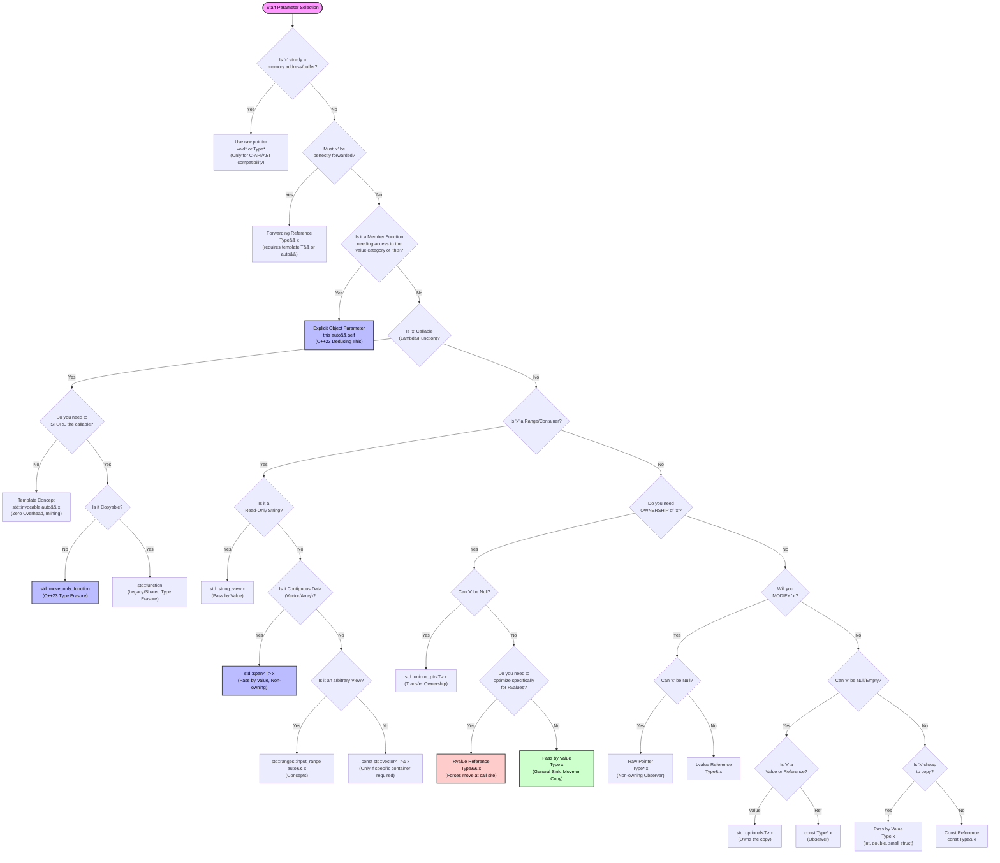

```mermaid
graph TD
Start([Start Parameter Selection]) --> RawMem{"Is 'x' strictly a<br/>memory address/buffer?"}

    %% 1. Raw Memory / Interop
    RawMem -- Yes --> RawPtr["Use raw pointer<br/>void* or Type*<br/>(Only for C-API/ABI compatibility)"]
    RawMem -- No --> Forward{"Must 'x' be<br/>perfectly forwarded?"}

    %% 2. Forwarding (Templates)
    Forward -- Yes --> FwdRef["Forwarding Reference<br/>Type&& x<br/>(requires template T&& or auto&&)"]
    Forward -- No --> Member{"Is it a Member Function<br/>needing access to the<br/>value category of 'this'?"}

    %% 3. Deducing This (C++23)
    Member -- Yes --> Deduce["Explicit Object Parameter<br/>this auto&& self<br/>(C++23 Deducing This)"]
    Member -- No --> Invocable{"Is 'x' Callable<br/>(Lambda/Function)?"}

    %% 4. Invocables
    Invocable -- Yes --> StoreInv{"Do you need to<br/>STORE the callable?"}
    StoreInv -- No --> InvConcept["Template Concept<br/>std::invocable auto&& x<br/>(Zero Overhead, Inlining)"]
    StoreInv -- Yes --> MoveOnly{"Is it Copyable?"}
    MoveOnly -- No --> MoveFunc["std::move_only_function<br/>(C++23 Type Erasure)"]
    MoveOnly -- Yes --> StdFunc["std::function<br/>(Legacy/Shared Type Erasure)"]

    Invocable -- No --> Range{"Is 'x' a Range/Container?"}

    %% 5. Ranges
    Range -- Yes --> String{"Is it a<br/>Read-Only String?"}
    String -- Yes --> StrView["std::string_view x<br/>(Pass by Value)"]
    String -- No --> Contig{"Is it Contiguous Data<br/>(Vector/Array)?"}

    Contig -- Yes --> Span["std::span&lt;T&gt; x<br/>(Pass by Value, Non-owning)"]
    Contig -- No --> ArbRange{"Is it an arbitrary View?"}
    ArbRange -- Yes --> RangeView["std::ranges::input_range auto&& x<br/>(Concepts)"]
    ArbRange -- No --> Container["const std::vector&lt;T&gt;& x<br/>(Only if specific container required)"]

    Range -- No --> Ownership{"Do you need<br/>OWNERSHIP of 'x'?"}

    %% 6. Ownership (The Sink Logic)
    Ownership -- Yes --> IsNull{"Can 'x' be Null?"}

    %% Nullable Ownership
    IsNull -- Yes --> SmartPtr["std::unique_ptr&lt;T&gt; x<br/>(Transfer Ownership)"]
    IsNull -- No --> MoveOpt{"Do you need to<br/>optimize specifically<br/>for Rvalues?"}

    %% Sinks
    MoveOpt -- Yes --> RValRef["Rvalue Reference<br/>Type&& x<br/>(Forces move at call site)"]
    MoveOpt -- No --> Sink["Pass by Value<br/>Type x<br/>(General Sink: Move or Copy)"]

    Ownership -- No --> Modify{"Will you<br/>MODIFY 'x'?"}

    %% 7. Reference / Observation
    Modify -- Yes --> CanBeNullMod{"Can 'x' be Null?"}
    CanBeNullMod -- Yes --> ObsPtr["Raw Pointer<br/>Type* x<br/>(Non-owning Observer)"]
    CanBeNullMod -- No --> LRef["Lvalue Reference<br/>Type& x"]

    Modify -- No --> Optional{"Can 'x' be Null/Empty?"}

    %% 8. Read-Only Access
    Optional -- Yes --> OptVal{"Is 'x' a<br/>Value or Reference?"}
    OptVal -- Value --> StdOpt["std::optional&lt;T&gt; x<br/>(Owns the copy)"]
    OptVal -- Ref --> ConstPtr["const Type* x<br/>(Observer)"]

    Optional -- No --> Cheap{"Is 'x' cheap<br/>to copy?"}
    Cheap -- Yes --> ByVal["Pass by Value<br/>Type x<br/>(int, double, small struct)"]
    Cheap -- No --> ConstRef["Const Reference<br/>const Type& x"]

    %% Styling
    style Start fill:#f9f,stroke:#333,stroke-width:2px,color:black
    style Deduce fill:#bbf,stroke:#333,stroke-width:2px,color:black
    style MoveFunc fill:#bbf,stroke:#333,stroke-width:2px,color:black
    style Span fill:#bbf,stroke:#333,stroke-width:2px,color:black
    style RValRef fill:#ffcccc,stroke:#333,stroke-width:2px,color:black
    style Sink fill:#ccffcc,stroke:#333,stroke-width:2px,color:black
```
