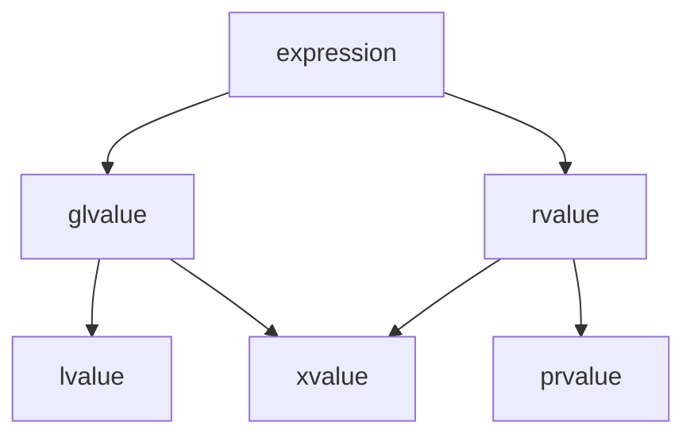

# Value Taxonomy

Every C++ expression has a **value category** — a property that determines which operations are
legal on it and how it interacts with overloaded functions. C++17 defines three primary categories
(lvalue, xvalue, prvalue) and two composite categories (glvalue, rvalue). Understanding these
categories is essential to understanding move semantics, reference binding, and overload resolution.

## 1.1 The Three-Valued System (C++17)

Since C++17, every expression belongs to exactly one of three **primary value categories** [N4950
S7.2.1]:

- **lvalue:** an expression that designates a function or an object. It has an identity (address)
  and, conceptually, a location in memory.
- **prvalue ("pure" rvalue):** an expression that initializes an object or computes a value. It has
  no identity — it is a transient value.
- **xvalue ("expiring" value):** an expression that designates an object whose resources can be
  reused (typically because it is nearing the end of its lifetime). It has identity but can be moved
  from.

Two **compound categories** are defined as unions of the primaries [N4950 S7.2.1]:

- **glvalue ("generalized" lvalue):** lvalue $\cup$ xvalue — expressions with identity.
- **rvalue:** prvalue $\cup$ xvalue — expressions that can be moved from.

## 1.2 Value Category Diagram



In set notation:

$$
\text{expression} = \underbrace{\text{glvalue}}_{\text{lvalue} \cup \text{xvalue}} \;\cup\; \underbrace{\text{rvalue}}_{\text{prvalue} \cup \text{xvalue}}
$$

The xvalue category occupies the intersection — it is both a glvalue (it has identity) and an rvalue
(it can be moved from).

## 1.3 Historical Evolution

| Standard | Model         | Categories                               | Key Change                                              |
| :------- | :------------ | :--------------------------------------- | :------------------------------------------------------ |
| C++98/03 | Two-valued    | lvalue, rvalue                           | Simpler model; no move semantics                        |
| C++11/14 | Five-valued   | lvalue, xvalue, prvalue, glvalue, rvalue | Move semantics, rvalue references introduced            |
| C++17    | Three primary | lvalue, xvalue, prvalue                  | Guaranteed copy elision; prvalues are no longer objects |

C++98 distinguished only lvalues (things you can take the address of) and rvalues (everything else).
C++11 introduced move semantics, requiring the xvalue category to represent "things that have
identity but are about to expire." C++17 refined the model by making prvalues non-objects until they
are materialized, which enabled guaranteed copy elision [N4950 S8.4.4].

:::info
Relevance The value category of an expression determines which overloaded function is called
(via reference binding rules), whether a move constructor or copy constructor is invoked, and
whether temporary lifetime extension applies. Understanding value categories is essential to
understanding why move semantics work.
:::

## 2.1 lvalue

An expression is an lvalue if it [N4950 S7.2.1]:

- Has a name or can be addressed with `&`.
- Persists beyond a single full-expression.
- Appears on the left side of an assignment (historically; this is a useful heuristic, not the
  definition).

```cpp
#include <type_traits>
#include <cassert>

int main() {
    int x = 42;
    int& ref = x;

    // x is an lvalue
    static_assert(std::is_lvalue_reference_v<decltype((x))>);
    assert(&x != nullptr);  // Can take address

    // ref is an lvalue (references are always lvalues when used)
    static_assert(std::is_lvalue_reference_v<decltype((ref))>);

    // String literal "hello" is an lvalue
    static_assert(std::is_lvalue_reference_v<decltype(("hello"))>);
}
```

## 2.2 prvalue

An expression is a prvalue if it [N4950 S7.2.1]:

- Is a literal (except string literals, which are lvalues).
- Is the return value of a function that returns by value (not by reference).
- Is a temporary object, such as the result of a cast to a non-reference type.
- Has no identity — you cannot take its address.

```cpp
#include <type_traits>

int return_by_value() { return 42; }

int main() {
    // Integer literal 42 is a prvalue
    static_assert(std::is_rvalue_reference_v<decltype(static_cast<int&&>(42))>);
    static_assert(!std::is_lvalue_reference_v<decltype((42))>);

    // Return value of a by-value function is a prvalue
    static_assert(!std::is_lvalue_reference_v<decltype((return_by_value()))>);

    // Arithmetic result is a prvalue
    int a = 1, b = 2;
    static_assert(!std::is_lvalue_reference_v<decltype((a + b))>);

    // bool literal false is a prvalue
    static_assert(!std::is_lvalue_reference_v<decltype((false))>);
}
```

## 2.3 xvalue

An expression is an xvalue if it [N4950 S7.2.1]:

- Is the result of `std::move(x)` or `std::forward<T>(x)`.
- Is a member of an object that has been cast to an rvalue reference (e.g.,
  `std::move(obj).member`).
- Designates an object nearing the end of its lifetime whose resources can be reused.

```cpp
#include <type_traits>
#include <utility>

struct S {
    int member;
};

int main() {
    int x = 42;

    // std::move(x) produces an xvalue
    static_assert(std::is_rvalue_reference_v<decltype((std::move(x)))>);

    // Member of an xvalue is an xvalue
    S s{10};
    static_assert(std::is_rvalue_reference_v<decltype((std::move(s).member))>);

    // Cast to rvalue reference produces an xvalue
    static_assert(std::is_rvalue_reference_v<decltype((static_cast<int&&>(x)))>);
}
```

## 2.4 Summary Table

| Category | Has Identity? | Can Move From? | Typical Examples                                                                 |
| :------- | :------------ | :------------- | :------------------------------------------------------------------------------- |
| lvalue   | Yes           | No             | named variables, `*ptr`, string literals, `arr[i]`                               |
| xvalue   | Yes           | Yes            | `std::move(x)`, `std::forward<T>(x)`, `return std::move(local);` (member access) |
| prvalue  | No            | Yes            | `42`, `3.14`, `f()` (by-value return), `int{7}`, `a + b`                         |

:::info
Relevance The parenthesized expression `decltype((e))` yields the **declared type of `e`**
with reference qualifiers preserved, which is how the `static_assert` tests above work. Without the
extra parentheses, `decltype(e)` strips references. This distinction is critical when writing type
traits or SFINAE constraints.
:::

## See Also

- [Reference Collapsing and Forwarding References](2_reference_collapsing.md)
- [Temporary Materialization](3_temporary_materialization.md)

## 3.1 Expression Classification Rules

Every C++ expression has **exactly one** primary value category [N4950 S7.2.1]. The classification
rules are exhaustive and mutually exclusive. No expression belongs to two primary categories
simultaneously.

### Classification Decision Tree

1. Does the expression designate an object or function with identity (an address)?
   - **Yes** $\to$ It is a **glvalue**. Continue to step 2.
   - **No** $\to$ It is a **prvalue** (the expression is a pure value or initializer).

2. Is the glvalue move-eligible (can its resources be reused)?
   - **Yes** $\to$ It is an **xvalue** (expiring value).
   - **No** $\to$ It is an **lvalue**.

The compound categories are unions:

$$
\text{glvalue} = \text{lvalue} \cup \text{xvalue}
$$

$$
\text{rvalue} = \text{prvalue} \cup \text{xvalue}
$$

$$
\text{expression} = \text{lvalue} \cup \text{xvalue} \cup \text{prvalue}
$$

### Formal Definitions [N4950 S7.2.1]

| Primary Category | Formal Definition                                                                                                                                                                     |
| :--------------- | :------------------------------------------------------------------------------------------------------------------------------------------------------------------------------------ |
| **lvalue**       | An expression that designates a function or an object [N4950 S7.2.1]. Example: a variable name, dereferenced pointer, array subscript, string literal.                                |
| **xvalue**       | An expression that designates an object whose resources can be reused (typically near end of lifetime) [N4950 S7.2.1]. Example: result of `std::move(x)`, member of rvalue reference. |
| **prvalue**      | An expression that initializes an object or computes a value, has no identity [N4950 S7.2.1]. Example: literal, arithmetic result, by-value function return.                          |

### Value Category Matrix

The following matrix shows how common expression forms are classified. Each entry maps an expression
form to its primary value category, the `decltype` of the expression, and the references it can bind
to:

| Expression            | Category | `decltype((e))`              | Binds to `T&`? | Binds to `T&&`? | Binds to `const T&`? |
| :-------------------- | :------- | :--------------------------- | :------------- | :-------------- | :------------------- |
| `x` (named `int`)     | lvalue   | `int&`                       | Yes            | No              | Yes                  |
| `std::move(x)`        | xvalue   | `int&&`                      | No             | Yes             | Yes                  |
| `42`                  | prvalue  | `int`                        | No             | Yes             | Yes                  |
| `x + y`               | prvalue  | `int`                        | No             | Yes             | Yes                  |
| `f()` (returns `int`) | prvalue  | `int`                        | No             | Yes             | Yes                  |
| `"hello"`             | lvalue   | `const char(&)[6]`           | No             | No              | Yes                  |
| `*ptr`                | lvalue   | `int&` (if `ptr` is `int*`)  | Yes            | No              | Yes                  |
| `arr[i]`              | lvalue   | `int&`                       | Yes            | No              | Yes                  |
| `std::move(s).member` | xvalue   | `int&&` (if member is `int`) | No             | Yes             | Yes                  |

**Key observations:**

- Non-const lvalues are the only expressions that bind to non-const lvalue references (`T&`).
- All rvalues (xvalues and prvalues) bind to rvalue references (`T&&`).
- All expressions bind to `const T&`, which is why const lvalue references are the most permissive
  binding target.

## 3.2 `decltype` Behavior for Each Category

The `decltype` specifier behaves differently depending on the value category of its argument. This
is critical for understanding template metaprogramming and SFINAE constraints.

| Expression `e`             | `decltype(e)` | `decltype((e))`               | Explanation                           |
| :------------------------- | :------------ | :---------------------------- | :------------------------------------ |
| `int x = 42;` — `x`        | `int`         | `int&` (lvalue reference)     | `decltype(e)` gives declared type     |
| `const int cx = 1;` — `cx` | `const int`   | `const int&`                  | `decltype(e)` preserves cv-qualifiers |
| `int& r = x;` — `r`        | `int`         | `int&`                        | Named references are lvalues          |
| `std::move(x)`             | `int&&`       | `int&&` (xvalue reference)    | rvalue reference                      |
| `42`                       | `int`         | `int` (prvalue, no reference) | Prvalues have no reference qualifier  |
| `f()` (returns `int`)      | `int`         | `int` (prvalue)               | Function return is prvalue            |

The key rule: `decltype((e))` (with extra parentheses) yields the type of the **expression**, which
includes reference qualifiers. `decltype(e)` (without extra parentheses) yields the **declared type
of the identifier**, stripping references.

```cpp
#include <type_traits>
#include <cassert>

int global = 42;

int& return_ref() { return global; }
int return_val() { return 42; }
int&& return_rref() { return static_cast<int&&>(global); }

int main() {
    int x = 10;
    const int cx = 20;

    // decltype without parens: declared type
    static_assert(std::is_same_v<decltype(x), int>);
    static_assert(std::is_same_v<decltype(cx), const int>);

    // decltype with parens: expression type (includes reference)
    static_assert(std::is_same_v<decltype((x)), int&>);
    static_assert(std::is_same_v<decltype((cx)), const int&>);

    // Function return values
    static_assert(std::is_same_v<decltype(return_val()), int>);
    static_assert(std::is_same_v<decltype((return_val())), int>);

    // lvalue reference return
    static_assert(std::is_same_v<decltype(return_ref()), int&>);
    static_assert(std::is_same_v<decltype((return_ref())), int&>);

    // rvalue reference return
    static_assert(std::is_same_v<decltype(return_rref()), int&&>);
    static_assert(std::is_same_v<decltype((return_rref())), int&&>);

    // std::move produces xvalue
    static_assert(std::is_same_v<decltype((std::move(x))), int&&>);

    assert(true);
}
```

## 3.3 Reference Collapsing and Value Categories

Reference collapsing occurs during template argument deduction and `typedef`/`using` alias
formation. When a reference to a reference is formed, the references **collapse** according to these
rules [N4950 S11.3.2]:

| Template Argument `T` | Reference Type `T&` | Reference Type `T&&` |
| :-------------------- | :------------------ | :------------------- |
| `int`                 | `int&`              | `int&&`              |
| `int&`                | `int&`              | `int&`               |
| `int&&`               | `int&`              | `int&&`              |

The rules are:

$$
T\&\& \to T\&, \quad T\&\& \to T\&\&, \quad \text{everything else} \to T\&
$$

More concisely: **only `T&& &&` collapses to `T&&`; all other combinations collapse to `T&`.**

Reference collapsing is the mechanism that enables **perfect forwarding** through `std::forward`.
When a forwarding reference `T&&` receives an lvalue, `T` is deduced as `U&`, and `T&&` becomes
`U& &&`, which collapses to `U&`. When it receives an rvalue, `T` is deduced as `U`, and `T&&` is
`U&&`.

```cpp
#include <type_traits>
#include <utility>

template<typename T>
struct identity { using type = T; };

template<typename T>
using identity_t = typename identity<T>::type;

int main() {
    // Reference collapsing with typedef/using
    using LRef = int&;
    using RRef = int&&;

    // LRef& collapses to int&
    static_assert(std::is_same_v<identity_t<LRef&>, int&>);
    // LRef&& collapses to int&
    static_assert(std::is_same_v<identity_t<LRef&&>, int&>);
    // RRef& collapses to int&
    static_assert(std::is_same_v<identity_t<RRef&>, int&>);
    // RRef&& collapses to int&&
    static_assert(std::is_same_v<identity_t<RRef&&>, int&&>);
}
```

## 3.4 Move Semantics as a Consequence of the Taxonomy

Move semantics are not a separate language feature bolted onto C++ — they are a **direct consequence
of the value category taxonomy**. The mechanism works as follows:

1. Overload resolution prefers rvalue reference bindings for rvalue arguments.
2. `std::move` converts an lvalue to an xvalue (an rvalue).
3. `std::forward` preserves the original value category of a forwarded argument.
4. Move constructors and move assignment operators take `T&&` parameters, which bind to rvalues.

```cpp
#include <iostream>
#include <utility>
#include <string>
#include <vector>

class Buffer {
    std::vector<int> data_;
public:
    Buffer() { std::cout << "  default ctor\n"; }
    Buffer(const Buffer& other) : data_(other.data_) {
        std::cout << "  copy ctor\n";
    }
    Buffer(Buffer&& other) noexcept : data_(std::move(other.data_)) {
        std::cout << "  move ctor\n";
    }
    Buffer& operator=(const Buffer& other) {
        data_ = other.data_;
        std::cout << "  copy assign\n";
        return *this;
    }
    Buffer& operator=(Buffer&& other) noexcept {
        data_ = std::move(other.data_);
        std::cout << "  move assign\n";
        return *this;
    }
};

Buffer make_buffer() {
    Buffer b;
    return b;  // b is an lvalue, but return by value treats it as prvalue (C++17)
               // NRVO may apply; if not, move ctor is used
}

template<typename T>
Buffer wrap_buffer(T&& arg) {
    Buffer b;
    // std::forward preserves the value category of arg:
    // If arg is an lvalue: b = arg calls copy assign
    // If arg is an rvalue: b = std::forward<T>(arg) calls move assign
    b = std::forward<T>(arg);
    return b;
}

int main() {
    std::cout << "Direct init from lvalue:\n";
    Buffer a;
    Buffer b = a;  // copy ctor — a is an lvalue

    std::cout << "Direct init from xvalue:\n";
    Buffer c = std::move(a);  // move ctor — std::move(a) is an xvalue (rvalue)

    std::cout << "Return from function (NRVO):\n";
    Buffer d = make_buffer();  // NRVO or move ctor

    std::cout << "Forward lvalue:\n";
    Buffer e;
    wrap_buffer(e);  // arg is lvalue → copy assign

    std::cout << "Forward rvalue:\n";
    wrap_buffer(Buffer{});  // arg is rvalue → move assign
}
```

## 3.5 `std::move` and `std::forward` as Category Converters

Both `std::move` and `std::forward` are casts that change the value category of an expression. They
do not move anything — they simply enable move semantics by converting the expression to an rvalue.

### `std::move`: lvalue $\to$ xvalue

```cpp
// Simplified implementation of std::move
template<typename T>
constexpr typename std::remove_reference_t<T>&& move(T&& t) noexcept {
    return static_cast<typename std::remove_reference_t<T>&&>(t);
}
```

`std::move` unconditionally casts its argument to an rvalue reference. The argument can be an lvalue
or an rvalue — in either case, the result is an xvalue.

### `std::forward`: preserves original category

```cpp
// Simplified implementation of std::forward
template<typename T>
constexpr T&& forward(typename std::remove_reference_t<T>& t) noexcept {
    return static_cast<T&&>(t);
}

template<typename T>
constexpr T&& forward(typename std::remove_reference_t<T>&& t) noexcept {
    static_assert(!std::is_lvalue_reference_v<T>,
                  "std::forward must not be used to move an rvalue");
    return static_cast<T&&>(t);
}
```

When `T` is deduced as `U&` (lvalue was passed), `T&&` is `U&` after collapsing $\to$ `forward`
returns `U&` (lvalue preserved). When `T` is deduced as `U` (rvalue was passed), `T&&` is `U&&`
$\to$ `forward` returns `U&&` (rvalue preserved).

```cpp
#include <type_traits>
#include <utility>

int main() {
    int x = 42;

    // std::move: always produces xvalue (rvalue reference)
    static_assert(std::is_same_v<decltype(std::move(x)), int&&>);
    static_assert(std::is_same_v<decltype(std::move(std::move(x))), int&&>);

    // std::forward: preserves category
    auto& lref = x;
    static_assert(std::is_same_v<decltype(std::forward<int&>(lref)), int&>);

    int&& rref = std::move(x);
    static_assert(std::is_same_v<decltype(std::forward<int>(rref)), int&&>);
}
```

## 3.6 Forwarding References vs Rvalue References

Forwarding references and rvalue references have the same syntax (`T&&`) but fundamentally different
semantics. The distinction is one of the most subtle and commonly misunderstood aspects of C++.

### Rvalue References

An rvalue reference is declared with a **concrete type**:

```cpp
void sink(std::string&& s);  // rvalue reference: binds only to rvalues
```

The type `std::string&&` is concrete — template argument deduction does not apply. This overload
binds only to rvalues (xvalues and prvalues) of type `std::string`.

### Forwarding References

A forwarding reference is declared with a **deduced template parameter**:

```cpp
template<typename T>
void relay(T&& t);  // forwarding reference: T is deduced
```

When `T` is a deduced template parameter, `T&&` is a **forwarding reference** (also called a
"universal reference" in pre-standard terminology). The deduction rules are special [N4950
S13.3.3.1.3]:

| Argument Type      | `T` Deduced As | `T&&` After Collapsing |
| :----------------- | :------------- | :--------------------- |
| `int` lvalue       | `int&`         | `int&`                 |
| `const int` lvalue | `const int&`   | `const int&`           |
| `int` rvalue       | `int`          | `int&&`                |
| `const int` rvalue | `const int`    | `const int&&`          |

### When Is `T&&` a Forwarding Reference?

`T&&` is a forwarding reference **if and only if** all of the following hold [N4950 S13.3.3.1.3]:

1. The type of the parameter is of the form `T&&` where `T` is a template parameter.
2. `T` is deduced from the function argument (not explicitly specified).
3. There is no cv-qualification on `T` (i.e., not `const T&&`).

**Cases where `T&&` is NOT a forwarding reference:**

```cpp
#include <utility>

template<typename T>
struct Container {
    // NOT a forwarding reference: T is not being deduced here
    // (T is already known from the class template)
    void push_back(T&& value);

    // NOT a forwarding reference: const-qualified
    void emplace(const T&& value);
};

// NOT a forwarding reference: auto&& with auto deduced as a concrete type
auto&& x = 42;  // auto deduced as int, so x is int&& (rvalue reference)
                // But in a range-for, auto&& IS a forwarding reference

void sink(int&& x);  // NOT a forwarding reference: int is concrete
```

### Complete Example

```cpp
#include <utility>
#include <iostream>
#include <string>

// Forwarding reference: T is deduced
template<typename T>
void relay(T&& arg) {
    process(std::forward<T>(arg));
}

void process(std::string& s) {
    std::cout << "lvalue: " << s << "\n";
}

void process(std::string&& s) {
    std::cout << "rvalue: " << s << "\n";
}

void process(const std::string& s) {
    std::cout << "const lvalue: " << s << "\n";
}

int main() {
    std::string mutable_str = "hello";
    const std::string const_str = "world";

    relay(mutable_str);           // T = string&,  forwards as lvalue
    relay(const_str);             // T = const string&, forwards as const lvalue
    relay(std::string("temp"));   // T = string, forwards as rvalue
}
```

## 3.7 Proof: `std::move` Is Just a Static Cast

**Claim:** `std::move` performs no move operation. It is a `static_cast` to an rvalue reference.

**Argument:**

The standard defines `std::move` as [N4950 S22.4.7.6]:

```cpp
template<class T>
constexpr typename remove_reference_t<T>&& move(T&& t) noexcept;
```

Expanding the definition step by step for a call `std::move(x)` where `x` is an lvalue of type
`int`:

1. **Template argument deduction:** `T` is deduced as `int&` (because `x` is an lvalue and the
   parameter is `T&&`, which is a forwarding reference in this context).
2. **Remove reference:** `remove_reference_t&lt;int&amp;&gt;` = `int`.
3. **Return type:** `int&&`.
4. **Parameter type:** `T&&` = `int& &&` which collapses to `int&`.
5. **Body:** `return static_cast&lt;int&&&gt;(t);` — casts the lvalue reference `t` to an rvalue
   reference.

The resulting expression `static_cast&lt;int&&&gt;(x)` is an xvalue. No move constructor is called.
No resources are transferred. The cast simply changes the value category from lvalue to xvalue,
which allows overload resolution to select rvalue-reference overloads (move constructors, move
assignment operators).

**Why this matters:** After `std::move(x)`, the value of `x` is still valid but unspecified. The
actual "move" happens in the move constructor or move assignment operator that receives the xvalue.
`std::move` is therefore a misnomer — it should be called `std::rvalue_cast` or `std::as_rvalue`.
The name is historical.

**Verification:**

```cpp
#include <utility>
#include <type_traits>
#include <iostream>

struct Tracer {
    std::string name;
    Tracer(std::string n) : name(std::move(n)) {
        std::cout << "  Tracer(" << name << ") constructed\n";
    }
    Tracer(Tracer&& other) noexcept : name(std::move(other.name)) {
        std::cout << "  Tracer(" << name << ") moved from " << other.name << "\n";
    }
    Tracer(const Tracer& other) : name(other.name) {
        std::cout << "  Tracer(" << name << ") copied from " << other.name << "\n";
    }
};

int main() {
    Tracer a("original");

    // std::move itself does NOT call any constructor
    // It only produces an xvalue expression
    decltype(auto) ref = std::move(a);

    // Verify: the result type is an rvalue reference
    static_assert(std::is_same_v<decltype(ref), Tracer&&>);

    // 'a' is still valid here — std::move didn't move anything
    std::cout << "a.name after std::move: " << a.name << "\n";

    // The actual move happens when the xvalue binds to a move constructor
    Tracer b = std::move(a);  // NOW the move constructor runs
    std::cout << "a.name after move ctor: " << a.name << "\n";
}
```

Output:

```
  Tracer(original) constructed
a.name after std::move: original
  Tracer() moved from original
a.name after move ctor:
```

## 3.8 `decltype(auto)` and Perfect Forwarding

`decltype(auto)` is a C++14 feature that uses the `decltype` rules to deduce the return type of a
function. Combined with `auto&&` parameters and `std::forward`, it enables perfect forwarding of
return types.

### `decltype(auto)` Rules

`decltype(auto)` preserves the exact type of the return expression, including references and
cv-qualifiers:

```cpp
#include <utility>
#include <type_traits>

int global = 42;

decltype(auto) return_lvalue() {
    return (global);  // decltype((global)) = int& → return type is int&
}

decltype(auto) return_prvalue() {
    return 42;  // decltype(42) = int → return type is int
}

decltype(auto) return_xvalue() {
    return std::move(global);  // decltype(std::move(global)) = int&& → return type is int&&
}

int main() {
    static_assert(std::is_same_v<decltype(return_lvalue()), int&>);
    static_assert(std::is_same_v<decltype(return_prvalue()), int>);
    static_assert(std::is_same_v<decltype(return_xvalue()), int&&>);
}
```

### Perfect Forwarding with `decltype(auto)`

The canonical perfect forwarding wrapper uses `decltype(auto)` for the return type:

```cpp
#include <utility>
#include <iostream>
#include <string>

template<typename F, typename... Args>
decltype(auto) perfect_forward(F&& f, Args&&... args) {
    return f(std::forward<Args>(args)...);
}

void process(std::string& s) {
    std::cout << "lvalue ref: " << s << "\n";
}

void process(std::string&& s) {
    std::cout << "rvalue ref: " << s << "\n";
}

std::string& return_ref(std::string& s) { return s; }

int main() {
    std::string str = "hello";

    // Forwarding lvalue: preserves lvalue reference
    process(perfect_forward(return_ref, str));

    // Forwarding rvalue: preserves rvalue reference
    process(perfect_forward([](std::string&& s) -> std::string&& {
        return std::move(s);
    }, std::string("world")));
}
```

:::warning
Using `decltype(auto)` with `return (local_variable);` returns a dangling reference. The
parentheses around `local_variable` make it an lvalue expression, so `decltype((local_variable))` is
`T&`. But the local variable is destroyed at the end of the function, leaving a dangling reference.
Always use `return local_variable;` (without parentheses) when you intend to return by value.
:::

## 3.9 Implicit Value Category Conversions

Value categories are not entirely static — certain language constructs implicitly convert between
categories. Understanding these conversions is essential for predicting overload resolution
outcomes.

### Materialization Conversion (prvalue $\to$ xvalue)

In C++17 and later, a prvalue is **materialized** into a temporary object when it needs an identity
(address, lifetime, or to bind to a reference). After materialization, the expression becomes an
xvalue [N4950 S7.3.5]. See [Temporary Materialization](3_temporary_materialization.md) for details.

### Lvalue-to-Rvalue Conversion

When an lvalue is used in a context that requires a prvalue (e.g., arithmetic, comparison), an
**lvalue-to-rvalue conversion** occurs [N4950 S7.3.2]. This reads the value from the lvalue's
storage and produces a prvalue:

```cpp
int x = 10;
int y = x + 1;  // x is an lvalue, but '+' requires prvalues
                // lvalue-to-rvalue conversion reads x's value (10) and produces prvalue
                // the addition operates on two prvalues: 10 and 1
```

The lvalue-to-rvalue conversion does **not** change the value category of `x` itself — `x` remains
an lvalue. The conversion produces a **new** prvalue expression from the value stored in `x`.

### Array-to-Pointer Conversion

Named arrays undergo array-to-pointer decay in most contexts, producing a prvalue pointer to the
first element [N4950 S7.3.3]:

```cpp
int arr[3] = {1, 2, 3};
int* p = arr;      // arr decays to prvalue int* pointing to arr[0]
int (&ref)[3] = arr;  // No decay: ref is an lvalue reference to the array
```

### Function-to-Pointer Conversion

Function names decay to function pointers in most contexts, producing a prvalue [N4950 S7.3.4]:

```cpp
void f();
void (*pf)() = f;  // f decays to prvalue void(*)()
```

### Temporary Materialization (C++17)

In C++17, a prvalue is not an object — it is a recipe for constructing one. When a prvalue needs to
be treated as an object (to bind to a reference, take its address, or access a member), it is
**materialized** into a temporary [N4950 S7.3.5]. This is the mechanism behind guaranteed copy
elision:

```cpp
struct S { int x; };

S make_s() { return S{42}; }  // prvalue S{42} returned

S obj = make_s();  // C++17: prvalue is directly materialized into obj (zero copies)
                   // C++14: prvalue creates temporary, then move/copy into obj
```

## Common Pitfalls

- **Using `std::move` on a `const` object.** `std::move(const T&)` returns `const T&&`, which binds
  to copy constructors (not move constructors). The object cannot actually be moved from.

- **Using `std::move` on a return value.** `return std::move(local);` prevents NRVO and forces a
  move. Just write `return local;` — the compiler applies NRVO or implicit move automatically.

- **Using `std::forward` outside of forwarding references.** `std::forward<T>(x)` is only meaningful
  when `T` is a template parameter deduced from a forwarding reference (`T&&`). Otherwise, it
  behaves identically to `std::move` (when `T` is a non-reference type) or does nothing (when `T` is
  an lvalue reference).

- **Confusing xvalue with prvalue.** Both are rvalues, but only xvalues have identity (an address).
  Prvalues do not exist as objects until materialized (C++17+).

- **Assuming `auto&&` is always a forwarding reference.** In a range-for loop, `auto&&` is a
  forwarding reference. But in a simple declaration like `auto&& x = expr;`, `auto` may be deduced
  as a concrete type, making `auto&&` a plain rvalue reference. For example, `auto&& x = 42;`
  deduces `auto` as `int`, so `x` has type `int&&`.

- **Using `decltype(auto)` with parenthesized return.** `decltype(auto) f() { return (x); }` returns
  a reference to `x`, not a copy. If `x` is a local variable, this is a dangling reference. Always
  use `return x;` (no parentheses) for by-value returns.

- **Overloading on rvalue references for forwarding.** If you write both `void f(T&&)` and
  `void f(const T&)`, the rvalue reference overload is preferred for non-const rvalues. But this is
  not forwarding — it only accepts rvalues. Use a template with a forwarding reference if you need
  to accept both lvalues and rvalues with a single overload.

## See Also

- [Reference Collapsing and Forwarding References](2_reference_collapsing.md)
- [Temporary Materialization](3_temporary_materialization.md)
- [Move Constructors and RVO](4_move_constructors_rvo.md)
- [Return Value Optimization](5_return_value_optimization.md)
