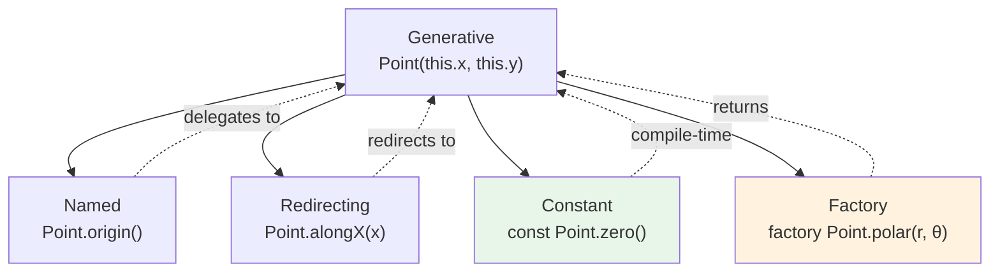
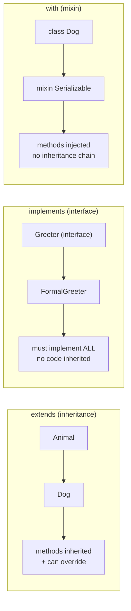

## Class Fundamentals

Dart is an **object-oriented language with single inheritance**. Every class (except `Null`) implicitly extends `Object`. Unlike Java, Dart has no interfaces as a separate construct — classes themselves serve as interfaces.

### Class Declaration

```dart
class User {
  // Fields (instance variables)
  final String name;
  int _age;        // Private (by convention, prefix with _)
  String email;

  // Constructor
  User({
    required this.name,
    required int age,
    required this.email,
  }) : _age = age;

  // Named constructor
  User.guest()
      : name = 'Guest',
        _age = 0,
        email = '';

  // Factory constructor (returns an instance, does not always create new)
  factory User.fromJson(Map<String, dynamic> json) {
    return User(
      name: json['name'] as String,
      age: json['age'] as int,
      email: json['email'] as String,
    );
  }

  // Getter
  int get age => _age;

  // Setter
  set age(int value) {
    if (value < 0) throw ArgumentError('Age cannot be negative');
    _age = value;
  }

  // Method
  String greet() => 'Hello, I\'m $name';
}
```

### Constructor Variants

Dart provides several constructor patterns:

```dart
class Point {
  final double x;
  final double y;

  // Generative constructor (default)
  Point(this.x, this.y);

  // Named constructor
  Point.origin() : x = 0, y = 0;

  // Redirecting constructor
  Point.alongX(double x) : this(x, 0);

  // Constant constructor (compile-time constant)
  const Point.zero() : x = 0, y = 0;

  // Factory constructor
  factory Point.polar(double r, double theta) {
    return Point(r * cos(theta), r * sin(theta));
  }
}
```



### Constructor Initialization List

The initializer list runs **before the constructor body** and can be used to:

1. Initialize `final` fields.
2. Assert preconditions.
3. Call the superclass constructor.

```dart
class Rectangle {
  final double width;
  final double height;
  final double area;

  // area is computed from width and height before the body runs
  Rectangle(double width, double height)
      : this.width = width,
        this.height = height,
        area = width * height,
        assert(width > 0, 'Width must be positive'),
        assert(height > 0, 'Height must be positive');
}
```

:::tip

Prefer initializer lists over constructor bodies for field initialization. Initializer lists are more efficient — they initialize fields directly, while the constructor body runs after all fields have been initialized (to their default values first).

:::

## Inheritance

Dart supports **single inheritance** with the `extends` keyword. Multiple inheritance of implementation is not supported, but a class can implement multiple interfaces.

```dart
class Animal {
  final String name;
  Animal(this.name);

  void speak() => print('$name makes a sound');
}

class Dog extends Animal {
  final String breed;
  Dog(String name, this.breed) : super(name);

  @override
  void speak() => print('$name ($breed) barks');

  // Call superclass method
  void speakAndThen() {
    super.speak();  // Animal's speak
    print('...then wags tail');
  }
}
```

### Abstract Classes

Abstract classes define interfaces that **cannot be instantiated** directly. They may or may not contain implementation:

```dart
abstract class Shape {
  // Abstract method (no implementation — subclasses must override)
  double area();

  // Concrete method (subclasses inherit)
  void describe() => print('Area: ${area()}');
}

class Circle extends Shape {
  final double radius;
  Circle(this.radius);

  @override
  double area() => pi * radius * radius;
}

class Square extends Shape {
  final double side;
  Square(this.side);

  @override
  double area() => side * side;
}
```

### Interfaces

In Dart, **every class implicitly defines an interface**. Any class can `implement` another class's interface without inheriting its implementation:

```dart
// A class defines both an implementation and an interface
class Greeter {
  String greet(String name) => 'Hello, $name';
}

// 'implement' requires implementing ALL members (no inheritance)
class FormalGreeter implements Greeter {
  @override
  String greet(String name) => 'Good day, $name';
}

// A class can implement multiple interfaces
class LoudGreeter implements Greeter, Comparable<LoudGreeter> {
  @override
  String greet(String name) => 'HELLO, ${name.toUpperCase()}!';

  @override
  int compareTo(LoudGreeter other) => 0;
}
```



## Mixins

Mixins provide a way to **inject reusable code** into classes without using inheritance. A mixin is declared with the `mixin` keyword and applied with `with`:

```dart
mixin Serializable {
  // Can have fields, methods, but no constructor
  Map<String, dynamic> toJson();

  // Can call 'super' if the class using the mixin has the method
  void logSerialization() {
    print('Serialized: ${toJson()}');
  }
}

mixin Validatable {
  bool validate();
}

// A class can use multiple mixins
class User with Serializable, Validatable {
  final String name;
  final int age;

  User(this.name, this.age);

  @override
  Map<String, dynamic> toJson() => {'name': name, 'age': age};

  @override
  bool validate() => name.isNotEmpty && age >= 0;
}

// Mixins can have type constraints (must extend/implement a type)
mixin Persistable on Serializable {
  void save(String path) {
    final json = toJson();
    // Write to file...
    logSerialization();  // Can call methods from Serializable
  }
}
```

### Mixin vs Inheritance vs Interface

| Feature                 | `extends`         | `implements`            | `with` (mixin)            |
| ----------------------- | ----------------- | ----------------------- | ------------------------- |
| Inherit implementation  | Yes               | No                      | Yes                       |
| Require method override | Optional          | All methods             | Optional                  |
| Multiple                | No (single)       | Yes                     | Yes                       |
| Can have constructors   | Yes               | No (if mixin)           | No                        |
| Use case                | Is-a relationship | Has-capability contract | Code reuse across classes |

:::tip

Use mixins for cross-cutting concerns (logging, serialization, validation) that don't fit in a single inheritance chain. Use `implements` for polymorphism (defining a contract). Use `extends` for true is-a relationships.

:::

## Operator Overloading

Dart allows overloading operators by defining methods with the operator name:

```dart
class Vector2 {
  final double x, y;
  const Vector2(this.x, this.y);

  Vector2 operator +(Vector2 other) => Vector2(x + other.x, y + other.y);
  Vector2 operator -(Vector2 other) => Vector2(x - other.x, y - other.y);
  Vector2 operator *(double scalar) => Vector2(x * scalar, y * scalar);
  double operator dot(Vector2 other) => x * other.x + y * other.y;
  bool operator ==(Object other) =>
      other is Vector2 && x == other.x && y == other.y;
  int get hashCode => Object.hash(x, y);

  @override
  String toString() => 'Vector2($x, $y)';
}

var a = Vector2(1, 2);
var b = Vector2(3, 4);
print(a + b);      // Vector2(4.0, 6.0)
print(a * 2.0);    // Vector2(2.0, 4.0)
print(a == b);     // false
print(a.dot(b));   // 11.0
```

:::warning

When overriding `==`, you **must** also override `hashCode`. Two objects that are equal must have the same hash code. Use `Object.hash()` or `Object.hashAll()` for combining multiple values.

:::

## Extension Methods

Extensions add methods to existing types **without modifying the original class**:

```dart
extension StringX on String {
  bool get isBlank => trim().isEmpty;
  String get capitalized =>
      isEmpty ? '' : '${this[0].toUpperCase()}${substring(1)}';
}

print('  hello  '.isBlank);       // false
print('hello'.capitalized);      // Hello
print('hello world'.capitalized); // Hello world
```

Extensions can also have generic type parameters:

```dart
extension ListX<T> on List<T> {
  T? firstWhereOrNull(bool Function(T) test) {
    for (final item in this) {
      if (test(item)) return item;
    }
    return null;
  }
}
```

:::info

Extensions are resolved **statically** at compile time. They are not true methods — they are syntactic sugar for static function calls. This means they cannot be used polymorphically (a `dynamic` variable won't have access to extension methods).

:::
