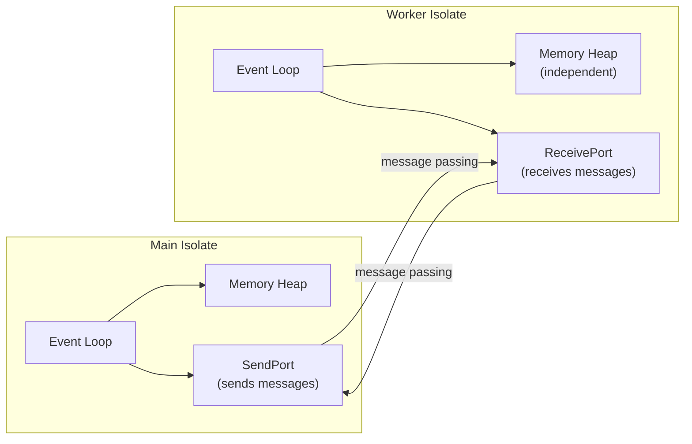

## Why Async Matters in Dart

Dart runs on a **single-threaded event loop** with an isolated memory model. Unlike languages with threads (Java, C++, Rust), Dart uses **event-driven concurrency** — the single thread processes events from a queue, interleaving async operations without blocking.

This design is fundamental to Flutter's architecture: the UI must remain responsive (60 fps) while performing I/O (network requests, file reads, database queries). If any operation blocks the thread, the entire UI freezes.

```mermaid
flowchart TD
    A["Event Loop"] --> B{"Is the queue empty?"}
    B -->|No| C["Dequeue next event"]
    C --> D["Execute event handler"]
    D --> E{"Handler complete?"}
    E -->|Yes| B
    E -->|No\n(async result pending)| F["Register callback\nin microtask queue"]
    F --> G["Yield to event loop"]
    G --> B
    B -->|Yes| H["Idle\n(wait for next I/O event)"]
    H --> B
```

## Futures

A `Future<T>` represents a value that will be available at some point in the future — either a value of type `T` or an error. It is Dart's equivalent of JavaScript's `Promise` or Rust's `Future`.

### Creating Futures

```dart
// From a computation (runs on the event loop when awaited)
Future<int> computeSquare(int n) async {
  return n * n;
}

// From a callback-based API
Future<http.Response> fetchUser() {
  return http.get(Uri.parse('https://api.example.com/user'));
}

// With Future.value (immediately resolved)
Future<String> cachedGreeting() {
  return Future.value('Hello');
}

// With Future.delayed (resolved after a delay)
Future<void> delayedGreeting() async {
  await Future.delayed(Duration(seconds: 1));
  print('Hello after 1 second');
}

// With Future.error (immediately rejected)
Future<void> fail() {
  return Future.error(Exception('Something went wrong'));
}
```

### async/await

The `async`/`await` syntax is syntactic sugar for working with Futures. `async` marks a function as asynchronous, and `await` suspends execution until the Future completes:

```dart
// Without async/await (callback style)
Future<void> loadData() {
  return http.get(Uri.parse('https://api.example.com/data')).then((response) {
    var data = jsonDecode(response.body);
    print('Got ${data['items'].length} items');
  }).catchError((error) {
    print('Error: $error');
  });
}

// With async/await (linear style — easier to read and reason about)
Future<void> loadData() async {
  try {
    final response = await http.get(Uri.parse('https://api.example.com/data'));
    final data = jsonDecode(response.body);
    print('Got ${data['items'].length} items');
  } catch (error) {
    print('Error: $error');
  }
}
```

### Error Handling

```dart
Future<int> fetchAge() async {
  final response = await http.get(Uri.parse('https://api.example.com/user'));
  if (response.statusCode != 200) {
    throw Exception('Failed to fetch user');
  }
  return jsonDecode(response.body)['age'] as int;
}

// Try-catch (preferred)
Future<void> example() async {
  try {
    final age = await fetchAge();
    print('Age: $age');
  } on FormatException catch (e) {
    print('Invalid JSON: $e');
  } on http.ClientException catch (e) {
    print('Network error: $e');
  } catch (e) {
    print('Unexpected error: $e');
  } finally {
    print('Cleanup');
  }
}

// catchError on the Future chain
Future<void> example() async {
  final age = await fetchAge().catchError((e) {
    print('Fallback: $e');
    return 0;
  });
}
```

### Sequential vs Parallel Execution

```dart
// Sequential: each await blocks until the Future completes
Future<void> sequential() async {
  final user = await fetchUser();       // 1 second
  final orders = await fetchOrders(user.id); // 1 second
  final profile = await fetchProfile(user.id); // 1 second
  // Total: 3 seconds
}

// Parallel: all Futures start immediately, await all results
Future<void> parallel() async {
  final results = await Future.wait([
    fetchUser(),
    fetchOrders('user-1'),
    fetchProfile('user-1'),
  ]);
  // Total: 1 second (all run concurrently)
  final user = results[0];
  final orders = results[1];
  final profile = results[2];
}

// Parallel with named results
Future<void> parallelNamed() async {
  final userFuture = fetchUser();
  final ordersFuture = fetchOrders('user-1');
  final profileFuture = fetchProfile('user-1');

  // Each await blocks only until its own Future completes
  final user = await userFuture;
  final orders = await ordersFuture;
  final profile = await profileFuture;
}
```

:::tip

Use `Future.wait` for independent async operations that can run concurrently. Use sequential `await` for dependent operations where the result of one is needed by the next.

:::

## Streams

A `Stream<T>` is a sequence of asynchronous events. While a `Future<T>` delivers a single value, a `Stream<T>` delivers zero or more values over time. It is Dart's equivalent of Rust's `Stream` or JavaScript's `Observable`.

### Stream Types

| Type                    | Description                                                    | Use Case                                   |
| ----------------------- | -------------------------------------------------------------- | ------------------------------------------ |
| **Single subscription** | One listener only; events are buffered if no listener exists   | File I/O, HTTP response body               |
| **Broadcast**           | Multiple listeners; events are discarded if no listener exists | UI events, sensor data, WebSocket messages |

```dart
// Creating a single-subscription stream
Stream<int> countStream(int max) async* {
  for (var i = 1; i <= max; i++) {
    await Future.delayed(Duration(seconds: 1));
    yield i;
  }
}

// Creating a broadcast stream
final controller = StreamController<String>.broadcast();
controller.stream.listen((event) => print('Listener 1: $event'));
controller.stream.listen((event) => print('Listener 2: $event'));
controller.add('Hello'); // Both listeners receive it
```

### Stream Operations

```dart
// Transforming streams
final numbers = countStream(10);
final doubled = numbers.map((n) => n * 2);
final evens = numbers.where((n) => n % 2 == 0);
final sum = await numbers.reduce((a, b) => a + b);

// async* — generator function for streams
Stream<int> fibonacci() async* {
  int a = 0, b = 1;
  while (true) {
    yield a;
    final temp = a + b;
    a = b;
    b = temp;
  }
}

// Take first N elements (limits an infinite stream)
await fibonacci().take(10).toList(); // [0, 1, 1, 2, 3, 5, 8, 13, 21, 34]

// Transform with async* (like Rust's .flat_map)
Stream<String> fetchNames(List<int> ids) async* {
  for (final id in ids) {
    final user = await fetchUserById(id);
    yield user.name;
  }
}
```

### StreamController

For creating streams from events:

```dart
class EventBus {
  final _controller = StreamController<Event>.broadcast();

  Stream<Event> get events => _controller.stream;

  void emit(Event event) => _controller.add(event);

  void dispose() => _controller.close();
}
```

## Isolates

Dart's answer to threads. Each isolate has its own **memory heap and event loop** — there is no shared state between isolates. Communication is via **message passing** (ports), similar to Erlang processes or Rust's `mpsc` channels.



### Basic Isolate Usage

```dart
import 'dart:isolate';

// The entry point for the new isolate — must be a top-level function
void _isolateEntry(SendPort sendPort) {
  final receivePort = ReceivePort();
  sendPort.send(receivePort.sendPort);

  receivePort.listen((message) {
    if (message == 'shutdown') {
      receivePort.close();
      return;
    }
    // Process message
    final result = _expensiveComputation(message as int);
    sendPort.send(result);
  });
}

int _expensiveComputation(int n) {
  // CPU-intensive work that would block the UI
  return List.generate(n, (i) => i * i).reduce((a, b) => a + b);
}

// Spawning and communicating
Future<int> runInIsolate(int input) async {
  final receivePort = ReceivePort();
  await Isolate.spawn(_isolateEntry, receivePort.sendPort);

  final sendPort = await receivePort.first as SendPort;
  final responsePort = ReceivePort();
  sendPort.send(input);
  sendPort.send(responsePort.sendPort);

  final result = await responsePort.first as int;
  return result;
}
```

### Isolate.run (Dart 2.19+)

For simple use cases, `Isolate.run` simplifies the API:

```dart
Future<int> heavyComputation(int n) async {
  return await Isolate.run(() {
    return List.generate(n, (i) => i * i).reduce((a, b) => a + b);
  });
}
```

### compute() Convenience

Flutter provides `compute()` for running functions in isolates:

```dart
// Flutter-only
final result = await compute(expensiveFunction, inputData);
```

:::warning

Isolates are **not threads**. They do not share memory. Data must be serialized (copied) when sent between isolates. For large data transfers, use `Isolate.exit()` (Dart 2.19+) to transfer ownership instead of copying.

:::

## Event Loop Priority

Dart's event loop processes events in this order:

| Priority    | Queue           | Description                                              |
| ----------- | --------------- | -------------------------------------------------------- |
| 1 (highest) | Microtask queue | `scheduleMicrotask`, `Future.then`, `await` continuation |
| 2           | Event queue     | I/O callbacks, timers, gestures, isolates                |

```dart
// Execution order demonstration
void main() {
  print('1: synchronous');

  Future.microtask(() => print('2: microtask'));

  Future(() => print('4: event'));

  Future.microtask(() => print('3: microtask'));

  print('1.5: synchronous');

  // Output:
  // 1: synchronous
  // 1.5: synchronous
  // 2: microtask
  // 3: microtask
  // 4: event
}
```

:::info

Microtasks run before the event loop processes the next event. All microtasks complete before any event from the event queue is processed. This is why `Future.then` callbacks (which schedule microtasks) run before `Future.delayed` callbacks (which schedule events).

:::

## Common Pitfalls

### 1. Unawaited Futures

```dart
// Bad: fire-and-forget — errors are silently swallowed
Future<void> processData() async {
  fetchUser(); // ⚠️ Not awaited — errors are unhandled
}

// Good: await the future
Future<void> processData() async {
  await fetchUser();
}

// Or explicitly ignore errors if that's intentional
Future<void> processData() async {
  fetchUser().ignore(); // From package:async
}
```

### 2. Blocking the Event Loop

```dart
// Bad: synchronous I/O blocks the thread
final file = File('large.txt').readAsStringSync(); // Blocks!

// Good: async I/O
final file = await File('large.txt').readAsString(); // Doesn't block

// Bad: CPU-intensive computation on the main isolate
final result = heavyComputation(1000000); // Blocks UI!

// Good: use Isolate for CPU work
final result = await Isolate.run(() => heavyComputation(1000000));
```

### 3. async Functions in Constructors

Dart constructors cannot be `async`. Use a static factory method instead:

```dart
class Database {
  final Connection _conn;

  // Private constructor
  Database._(this._conn);

  // Async factory
  static Future<Database> connect(String uri) async {
    final conn = await Connection.open(uri);
    return Database._(conn);
  }
}
```
