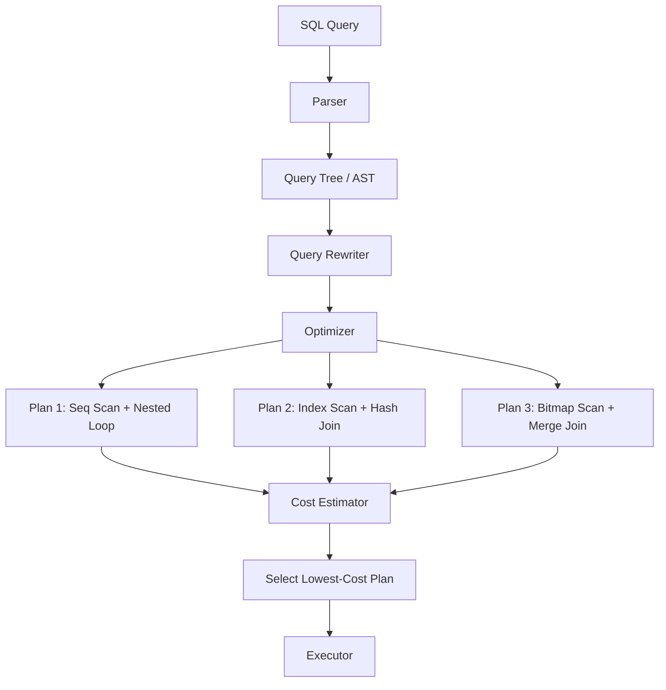

## Query Optimizer Architecture

### Rule-Based vs Cost-Based Optimization

**Rule-Based Optimizer (RBO):** Uses a fixed set of heuristics to transform queries. Access paths
are chosen based on rules like "use an index if available" and "avoid full table scans." RBO does
not consider data distribution, row counts, or I/O costs. Oracle deprecated RBO in Oracle 10g.

**Cost-Based Optimizer (CBO):** Estimates the cost of alternative execution plans using statistics
about the data (row counts, column distributions, index sizes) and system parameters (CPU speed,
disk I/O cost). PostgreSQL, MySQL, and modern Oracle use CBO exclusively.



The PostgreSQL optimizer uses a **dynamic programming** approach: it explores join orderings and
access paths, estimating costs based on:

- `seq_page_cost`: cost of a sequential disk page fetch (default 1.0)
- `random_page_cost`: cost of a random disk page fetch (default 4.0)
- `cpu_tuple_cost`: cost of processing each tuple (default 0.01)
- `cpu_index_tuple_cost`: cost of processing each index entry (default 0.005)
- `cpu_operator_cost`: cost of processing each operator (default 0.0025)

## Statistics

### Column Statistics

PostgreSQL collects per-column statistics during `ANALYZE`:

```sql
SELECT attname, null_frac, n_distinct, avg_width, correlation,
       most_common_vals, most_common_freqs,
       histogram_bounds
FROM pg_stats
WHERE tablename = 'orders'
ORDER BY attname;
```

| Statistic           | Meaning                                                                             |
| ------------------- | ----------------------------------------------------------------------------------- |
| `null_frac`         | Fraction of rows with NULL in this column                                           |
| `n_distinct`        | Positive: approximate distinct values. Negative: fraction of rows that are distinct |
| `avg_width`         | Average byte width of column values                                                 |
| `correlation`       | Physical vs logical order correlation (-1.0 to 1.0)                                 |
| `most_common_vals`  | Most frequent values (MCV list)                                                     |
| `most_common_freqs` | Frequencies of MCV values                                                           |
| `histogram_bounds`  | Boundaries for histogram of non-MCV values                                          |

### Histograms

PostgreSQL stores an **equi-depth histogram** with `default_statistics_target` buckets (default
100). Each bucket contains approximately the same number of rows. The histogram is used to estimate
selectivity for conditions on non-MCV values.

```sql
-- Increase statistics target for a column with skewed distribution
ALTER TABLE orders ALTER COLUMN status SET STATISTICS 500;
ANALYZE orders;

-- Global default
SET default_statistics_target = 200;
```

### Correlation

The `correlation` statistic measures how closely the physical row order on disk matches the logical
order of the column value. A correlation of 1.0 means the data is perfectly sorted by this column on
disk. This matters for index scans:

```sql
-- High correlation (e.g., 0.99): index scan is efficient
-- Low correlation (e.g., 0.01): index scan requires many random I/Os
SELECT attname, correlation FROM pg_stats WHERE tablename = 'orders';
```

### Extended Statistics (PostgreSQL 10+)

When multiple columns are used in a WHERE clause, independent column statistics can lead to poor
estimates. Extended statistics capture cross-column correlations:

```sql
-- Create extended statistics for column pairs
CREATE STATISTICS s_orders_region_date (ndistinct, dependencies, mcv)
    ON region, order_date FROM orders;

-- Dependencies: functional dependency (region determines country)
CREATE STATISTICS s_orders_region_country (dependencies)
    ON region, country FROM orders;

-- After creating extended statistics, run ANALYZE
ANALYZE orders;

-- Verify extended statistics are used
SELECT * FROM pg_stats_ext WHERE tablename = 'orders';
```

| Statistic Type | Captures                              | Use Case                               |
| -------------- | ------------------------------------- | -------------------------------------- |
| `ndistinct`    | Distinct count of column combinations | GROUP BY multiple columns              |
| `dependencies` | Functional dependencies               | WHERE a = 1 AND b = 2 (b depends on a) |
| `mcv`          | Most common value combinations        | Multi-column filter selectivity        |

## Join Strategies

### Nested Loop Join

For each row in the outer (driving) table, scan the inner table for matching rows.

```text
Cost: O(N * M) where N = outer rows, M = inner rows per outer row
Best when: outer is small, inner has a useful index, or one side is very small
```

```sql
-- EXPLAIN shows:
-- -> Nested Loop (cost=0.43..12.50 rows=10)
--    -> Seq Scan on small_table (cost=0.00..1.50 rows=10)
--    -> Index Scan using idx_large_id on large_table (cost=0.43..1.00 rows=1)
```

### Hash Join

Build an in-memory hash table from the inner (build) side, then probe with the outer side.

```text
Cost: O(N + M) where N = outer rows, M = inner rows
Best when: both sides are large, no useful index, equijoin
Memory: requires work_mem for the hash table
```

```sql
-- EXPLAIN shows:
-- -> Hash Join (cost=450.00..850.00 rows=10000)
--    Hash Cond: (a.customer_id = b.customer_id)
--    -> Seq Scan on orders a (cost=0.00..300.00 rows=10000)
--    -> Hash (cost=200.00..200.00 rows=5000)
--       -> Seq Scan on customers b (cost=0.00..200.00 rows=5000)
```

If the hash table exceeds `work_mem`, PostgreSQL spills to disk, creating multiple batches. This
degrades performance significantly. Monitor with:

```sql
-- Check if hash joins spilled to disk
EXPLAIN (ANALYZE, BUFFERS)
SELECT * FROM orders o JOIN customers c ON o.customer_id = c.customer_id;
-- Look for "Batches" > 1 in Hash Join node output
```

### Merge Join

Both inputs must be sorted on the join key. Walk through both sorted streams simultaneously.

```text
Cost: O(N log N + M log M) for sorting, O(N + M) for merge
Best when: both sides already sorted (index order), or when a presorted merge is cheaper than hashing
```

```sql
-- EXPLAIN shows:
-- -> Merge Join (cost=1000.00..2000.00 rows=20000)
--    Merge Cond: (a.id = b.id)
--    -> Index Scan using idx_a_id on table_a (cost=0.42..800.00 rows=20000)
--    -> Sort (cost=500.00..510.00 rows=10000)
--       -> Seq Scan on table_b (cost=0.00..200.00 rows=10000)
```

### Join Strategy Selection Guide

| Condition                                          | Preferred Strategy      |
| -------------------------------------------------- | ----------------------- |
| One table is very small (&lt; 1000 rows)           | Nested Loop             |
| Inner table has a selective index on join key      | Nested Loop             |
| Both tables large, equijoin, sufficient work_mem   | Hash Join               |
| Both sides sorted on join key                      | Merge Join              |
| Non-equijoin (e.g., range condition)               | Nested Loop             |
| Inner table large, no index, insufficient work_mem | Merge Join (after sort) |

## Subquery Optimization

### Correlated vs Uncorrelated Subqueries

```sql
-- Correlated subquery: executed once per outer row (slow)
SELECT * FROM orders o
WHERE EXISTS (
    SELECT 1 FROM customers c
    WHERE c.customer_id = o.customer_id AND c.tier = 'premium'
);

-- Uncorrelated subquery: executed once (fast)
SELECT * FROM orders o
WHERE o.customer_id IN (
    SELECT customer_id FROM customers WHERE tier = 'premium'
);
```

PostgreSQL may rewrite correlated subqueries as joins (subquery flattening or "pull-up"), but this
depends on the specific query shape. Use `EXPLAIN` to verify.

### Semi-Join

A semi-join returns rows from the outer table where a match exists in the inner table, but does not
duplicate outer rows. `EXISTS` and `IN` are typically converted to semi-joins:

```sql
-- Both are converted to Hash Semi Join by the optimizer
SELECT * FROM orders WHERE customer_id IN (SELECT id FROM premium_customers);
SELECT * FROM orders WHERE EXISTS (SELECT 1 FROM premium_customers WHERE id = customer_id);
```

### Materialized Subqueries

CTEs in PostgreSQL 12+ may be inlined or materialized. When materialized, the subquery is executed
once and stored:

```sql
-- The CTE may be materialized if referenced multiple times
WITH active_users AS (
    SELECT user_id, COUNT(*) AS login_count
    FROM login_events
    WHERE last_login >= CURRENT_DATE - INTERVAL '30 days'
    GROUP BY user_id
)
SELECT
    (SELECT COUNT(*) FROM active_users) AS total_active,
    (SELECT COUNT(*) FROM active_users WHERE login_count > 10) AS power_users,
    (SELECT AVG(login_count) FROM active_users) AS avg_logins;
```

## Parallel Query

PostgreSQL 9.6+ supports parallel execution for sequential scans, joins, and aggregates.

### Configuration Parameters

```sql
-- Maximum number of parallel workers per query
SET max_parallel_workers_per_gather = 4;

-- Maximum number of parallel workers across all queries
SET max_parallel_workers = 8;

-- Minimum table size (in 8KB pages) to consider parallel scan
SET min_parallel_table_scan_size = '8MB';

-- Minimum index size to consider parallel index scan
SET min_parallel_index_scan_size = '512kB';
```

### Parallel Seq Scan

```sql
EXPLAIN (ANALYZE)
SELECT COUNT(*) FROM large_table;

-- -> Gather (cost=0.00..12345.67 rows=1 width=8)
--    Workers Planned: 4
--    Workers Launched: 4
--    -> Parallel Seq Scan on large_table (cost=0.00..10000.00 rows=2500000)
```

### Parallel Join

```sql
-- Hash Join can be parallelized (each worker builds a partial hash table)
-- Nested Loop Join can be parallelized (each worker handles a subset of outer rows)
-- Merge Join can be parallelized in PostgreSQL 13+ (requires sorted inputs)
EXPLAIN (ANALYZE)
SELECT * FROM large_a JOIN large_b ON a.id = b.id;
```

### When Parallel Query Helps (and When It Does Not)

| Scenario                       | Parallel Helps? | Reason                                     |
| ------------------------------ | --------------- | ------------------------------------------ |
| Full table scan on large table | Yes             | Work distributed across workers            |
| Aggregates on large tables     | Yes             | Partial aggregates combined at coordinator |
| Index scan with few rows       | No              | Coordination overhead exceeds scan cost    |
| Foreign data wrapper queries   | No              | FDW does not support parallel execution    |
| Queries returning few rows     | No              | Gather overhead exceeds benefit            |

:::warning

Parallel query workers each consume `work_mem` independently. A parallel hash join with 4 workers
uses 4x `work_mem` for hash tables. Set `work_mem` conservatively on parallel-capable systems, or
you risk OOM.

:::

## Covering Indexes

A covering index contains all columns needed by the query, enabling an **index-only scan** that
reads the index without touching the heap (table data):

```sql
-- Query:
SELECT customer_id, order_date, total
FROM orders
WHERE customer_id = 42
ORDER BY order_date DESC;

-- Covering index (all columns in SELECT and WHERE are in the index):
CREATE INDEX idx_orders_customer_covering
    ON orders (customer_id, order_date DESC)
    INCLUDE (total);

-- EXPLAIN shows:
-- -> Index Only Scan using idx_orders_customer_covering
```

The `INCLUDE` clause adds columns to the index leaf pages without affecting the index sort order.
This is more space-efficient than adding the column to the sort key.

```sql
-- Also useful for GROUP BY covering:
CREATE INDEX idx_orders_region_date_covering
    ON orders (region, order_date)
    INCLUDE (total);

-- Query can be satisfied entirely from the index:
SELECT region, order_date, SUM(total)
FROM orders
GROUP BY region, order_date;
```

:::info

Index-only scans still access the heap if any column in the index has NULL values, because
PostgreSQL's visibility information is stored in the heap. To maximize index-only scan efficiency,
keep indexed columns NOT NULL where possible, or run `VACUUM` regularly to keep visibility map
accurate.

:::

## Partial Indexes and Conditional Indexes

A partial index only indexes rows that match a `WHERE` clause:

```sql
-- Index only unshipped orders (smaller, faster)
CREATE INDEX idx_orders_pending
    ON orders (customer_id, created_at)
    WHERE status = 'pending';

-- Index only active users
CREATE INDEX idx_users_active_email
    ON users (email)
    WHERE is_active = TRUE;

-- Index for common filter combination
CREATE INDEX idx_orders_high_value
    ON orders (customer_id)
    WHERE total > 10000;
```

Partial indexes are dramatically smaller than full indexes when the condition filters out most rows.
The planner automatically considers partial indexes when the query contains a compatible WHERE
clause.

```sql
-- This query will use the partial index:
SELECT * FROM orders
WHERE status = 'pending' AND customer_id = 42
ORDER BY created_at;

-- This query will NOT use the partial index (status filter missing):
SELECT * FROM orders
WHERE customer_id = 42
ORDER BY created_at;
```

## Expression Indexes

Index the result of an expression:

```sql
-- Case-insensitive email lookup
CREATE INDEX idx_users_lower_email ON users (LOWER(email));
SELECT * FROM users WHERE LOWER(email) = 'alice@example.com';

-- JSONB field extraction
CREATE INDEX idx_events_type ON events ((payload ->> 'event_type'));
SELECT * FROM events WHERE payload ->> 'event_type' = 'purchase';

-- Common computation
CREATE INDEX idx_orders_monthly ON orders (DATE_TRUNC('month', order_date));
SELECT * FROM orders WHERE DATE_TRUNC('month', order_date) = '2024-01-01';
```

:::warning

The expression in the query must exactly match the expression in the index.
`WHERE lower(email) = 'alice@example.com'` uses the index, but
`WHERE email ILIKE 'alice@example.com'` does not. Use functional indexes consistently.

:::

## BRIN Indexes for Append-Only Data

Block Range Indexes (BRIN) store summary information (min/max values) for ranges of physical pages.
They are extremely small but less selective than B-tree indexes.

```sql
-- BRIN index on time-series data (sorted by timestamp)
CREATE INDEX idx_measurements_time_brin
    ON measurements USING BRIN (recorded_at)
    WITH (pages_per_range = 32);

-- BRIN index on append-only log table
CREATE INDEX idx_logs_created_brin
    ON application_logs USING BRIN (created_at)
    WITH (pages_per_range = 128);
```

| Index Type | Size (relative) | Best For                            | Worst For                 |
| ---------- | --------------- | ----------------------------------- | ------------------------- |
| B-tree     | Large           | General purpose, equality + range   | Large tables, few queries |
| BRIN       | Tiny (&lt; 1%)  | Append-only, naturally sorted data  | Random insert order       |
| Hash       | Medium          | Equality only                       | Range queries, ordering   |
| GIN        | Large           | Array, full-text, JSONB containment | Exact match, small keys   |
| GiST       | Medium          | Geometric, range, full-text (trgm)  | Simple equality           |

## GIN and GiST Indexes

### GIN (Generalized Inverted Index)

GIN is optimized for queries that test whether a value is contained within a composite value
(arrays, JSONB, full-text):

```sql
-- JSONB containment
CREATE INDEX idx_products_tags_gin ON products USING GIN (tags);
SELECT * FROM products WHERE tags @> ARRAY['electronics'];

-- JSONB key/value queries
CREATE INDEX idx_events_payload_gin ON events USING GIN (payload);
SELECT * FROM events WHERE payload @> '{"status": "active", "priority": "high"}';

-- Full-text search
CREATE INDEX idx_docs_search_gin ON documents USING GIN (search_vector);
SELECT * FROM documents WHERE search_vector @@ to_tsquery('english', 'database');
```

GIN supports `fastupdate` (batched index updates) for write-heavy workloads:

```sql
CREATE INDEX idx_events_payload_gin ON events USING GIN (payload)
    WITH (fastupdate = ON, gin_pending_list_limit = '4MB');
```

### GiST (Generalized Search Tree)

GiST is a balanced tree structure for geometric data, range queries, and full-text ranking:

```sql
-- Geometric queries (PostGIS)
CREATE INDEX idx_locations_point ON locations USING GiST (geom);
SELECT * FROM locations WHERE ST_DWithin(geom, ST_MakePoint(-73.9, 40.7), 1000);

-- Range types
CREATE INDEX idx_reservations_dates ON reservations USING GiST (daterange);
SELECT * FROM reservations
WHERE daterange(start_date, end_date) && daterange('2024-01-01', '2024-02-01');

-- Trigram similarity
CREATE INDEX idx_users_name_trgm ON users USING GiST (name gin_trgm_ops);
SELECT * FROM users WHERE name % 'John';
```

## Connection Pooling

### PgBouncer

PgBouncer is a lightweight connection pooler that sits between applications and PostgreSQL:

```ini
; pgbouncer.ini
[databases]
mydb = host=127.0.0.1 port=5432 dbname=mydb

[pgbouncer]
pool_mode = transaction
max_client_conn = 1000
default_pool_size = 20
reserve_pool_size = 5
reserve_pool_timeout = 3
server_idle_timeout = 600
```

### Pool Modes

| Mode          | Behavior                                           | Best For                               |
| ------------- | -------------------------------------------------- | -------------------------------------- |
| `session`     | Connection assigned to client for entire session   | Applications using SET/ advisory locks |
| `transaction` | Connection returned to pool after each transaction | Most web applications (default choice) |
| `statement`   | Connection returned to pool after each statement   | Very high concurrency, stateless       |

:::warning

In `transaction` mode, session-level `SET` commands are lost between transactions. Use `SET LOCAL`
for transaction-scoped settings, or use `search_path` in `pgbouncer.ini` with
`extra_float_digits = 3`.

:::

### Connection overhead

Each PostgreSQL connection consumes approximately 10MB of RAM for process overhead (shared memory
contexts, work buffers, catalogs). 1000 idle connections consume roughly 10GB with no active
queries. PgBouncer reduces this to 20 actual PostgreSQL connections serving 1000 clients.

## Prepared Statements

```sql
-- Prepare a statement (parsed and planned)
PREPARE get_orders_by_customer AS
SELECT * FROM orders WHERE customer_id = $1 ORDER BY created_at DESC LIMIT 50;

-- Execute with a parameter
EXECUTE get_orders_by_customer(42);

-- Deallocate
DEALLOCATE get_orders_by_customer;
```

### Plan Caching

PostgreSQL uses a **generic plan** for prepared statements after 5 executions. The generic plan does
not use the specific parameter values for planning, which can lead to suboptimal plans when data
distribution is skewed.

```sql
-- Force a custom plan (uses parameter values for planning, but re-plans each time)
SET plan_cache_mode = force_custom_plan;

-- Force generic plan (cached, but may be suboptimal for skewed data)
SET plan_cache_mode = force_generic_plan;

-- Default: auto (switches to generic after 5 executions)
SET plan_cache_mode = auto;
```

:::info

With PgBouncer in transaction mode, server-side prepared statements do not persist across
transactions. Use the ` prepared_statements` option or driver-side prepared statement emulation.

:::

## Auto-Vacuum Tuning

```sql
-- View current autovacuum settings
SELECT name, setting, unit FROM pg_settings WHERE name LIKE 'autovacuum%';

-- Per-table autovacuum tuning
ALTER TABLE orders SET (
    autovacuum_vacuum_scale_factor = 0.05,     -- vacuum after 5% of rows change (default 20%)
    autovacuum_analyze_scale_factor = 0.02,    -- analyze after 2% of rows change (default 10%)
    autovacuum_vacuum_cost_delay = 10,         -- sleep 10ms between cost batches (default 2ms)
    autovacuum_vacuum_cost_limit = 500         -- cost limit per vacuum run (default 200)
);

-- For append-only tables (no updates/deletes):
ALTER TABLE measurements SET (
    autovacuum_vacuum_scale_factor = 0.0,      -- disable vacuum-based trigger
    autovacuum_analyze_scale_factor = 0.01     -- analyze after 1% of rows inserted
);

-- For high-write tables:
ALTER TABLE events SET (
    autovacuum_vacuum_scale_factor = 0.01,
    autovacuum_analyze_scale_factor = 0.005,
    autovacuum_vacuum_cost_delay = 5,
    autovacuum_max_workers = 3
);
```

### Monitoring Autovacuum

```sql
-- Tables most needing vacuum (by dead tuple count)
SELECT relname, n_live_tup, n_dead_tup,
       ROUND(n_dead_tup::NUMERIC / NULLIF(n_live_tup, 0) * 100, 2) AS dead_pct,
       last_autovacuum, last_autoanalyze
FROM pg_stat_user_tables
ORDER BY n_dead_tup DESC
LIMIT 20;

-- Currently running autovacuum workers
SELECT pid, relname, phase,
       EXTRACT(EPOCH FROM (now() - query_start)) AS elapsed_seconds
FROM pg_stat_progress_vacuum v
JOIN pg_stat_activity a ON a.pid = v.pid;
```

## pg_stat_statements

```sql
-- Enable (add to shared_preload_libraries and restart)
-- shared_preload_libraries = 'pg_stat_statements'
-- pg_stat_statements.track = all

-- Top 10 queries by total execution time
SELECT query, calls, total_exec_time / 1000 AS total_ms,
       mean_exec_time / 1000 AS avg_ms,
       rows, shared_blks_hit, shared_blks_read
FROM pg_stat_statements
ORDER BY total_exec_time DESC
LIMIT 10;

-- Top 10 queries by average execution time
SELECT query, calls, mean_exec_time / 1000 AS avg_ms
FROM pg_stat_statements
ORDER BY mean_exec_time DESC
LIMIT 10;

-- Top 10 queries by rows (potential N+1)
SELECT query, calls, rows,
       rows::FLOAT / NULLIF(calls, 0) AS avg_rows
FROM pg_stat_statements
ORDER BY rows DESC
LIMIT 10;

-- Reset statistics
SELECT pg_stat_statements_reset();
```

## Common Anti-Patterns

### N+1 Queries

```sql
-- Anti-pattern: N+1 queries (one query per order to get customer)
SELECT * FROM orders;  -- 1 query
-- For each order: SELECT * FROM customers WHERE id = ?  -- N queries

-- Fix: single JOIN query
SELECT o.*, c.name, c.email
FROM orders o
JOIN customers c ON o.customer_id = c.customer_id;
```

Detect N+1 in pg_stat_statements:

```sql
-- Queries with high calls but low avg rows (likely N+1)
SELECT query, calls, rows, rows::FLOAT / calls AS avg_rows
FROM pg_stat_statements
WHERE calls > 100 AND rows::FLOAT / calls &lt; 5
ORDER BY calls DESC;
```

### SELECT \*

`SELECT *` retrieves all columns, which prevents index-only scans and wastes I/O bandwidth and
memory. Always specify the columns you need.

### Unnecessary JOINs

```sql
-- Anti-pattern: joining tables you don't need
SELECT o.order_id, o.total
FROM orders o
JOIN customers c ON o.customer_id = c.customer_id  -- not used
JOIN products p ON o.product_id = p.product_id     -- not used
WHERE o.status = 'pending';

-- Fix: only join what you need
SELECT o.order_id, o.total
FROM orders o
WHERE o.status = 'pending';
```

### OFFSET Pagination on Large Datasets

```sql
-- Anti-pattern: OFFSET 1000000 is slow
SELECT * FROM orders ORDER BY created_at DESC LIMIT 20 OFFSET 1000000;

-- Fix: keyset (cursor) pagination
SELECT * FROM orders
WHERE created_at &lt; '2024-01-15T10:30:00Z'  -- last value from previous page
ORDER BY created_at DESC
LIMIT 20;
```

### Functions on Indexed Columns

```sql
-- Anti-pattern: function wrapping indexed column prevents index use
SELECT * FROM orders WHERE DATE(created_at) = '2024-01-15';

-- Fix: use range condition on the raw column
SELECT * FROM orders
WHERE created_at >= '2024-01-15' AND created_at &lt; '2024-01-16';

-- Or use an expression index
CREATE INDEX idx_orders_created_date ON orders ((DATE(created_at)));
```

## Common Pitfalls

### Stale Statistics

After bulk loads, deletes, or updates, statistics may be severely out of date. The planner may
choose a seq scan when an index scan would be 100x faster. Always run `ANALYZE` after significant
data changes:

```sql
ANALYZE VERBOSE orders;
-- Or set autovacuum to trigger more aggressively
ALTER TABLE orders SET (autovacuum_analyze_scale_factor = 0.01);
```

### work_mem Too Low for Hash Joins

The default `work_mem` is 4MB. A hash join on a table with 10 million rows likely requires much
more. If the hash table spills to disk, performance degrades by 10-100x:

```sql
-- Per-session
SET work_mem = '256MB';

-- Per-role (for reporting users)
ALTER ROLE reporting_app SET work_mem = '256MB';

-- Check for spills in EXPLAIN ANALYZE output
EXPLAIN (ANALYZE, BUFFERS) SELECT ...;
```

### Not Using CONCURRENTLY for Index Creation

`CREATE INDEX` acquires an `ACCESS EXCLUSIVE` lock, blocking all reads and writes. On a production
table, this means downtime:

```sql
-- WRONG: blocks all access
CREATE INDEX idx_orders_date ON orders(order_date);

-- RIGHT: allows reads and writes during creation
CREATE INDEX CONCURRENTLY idx_orders_date ON orders(order_date);
```

`CREATE INDEX CONCURRENTLY` takes longer but does not block concurrent operations. It is the only
safe way to create indexes on live production tables.

### Ignoring VACUUM on High-Write Tables

Without aggressive autovacuum, dead tuples accumulate, causing:

- Table bloat (disk space waste)
- Index bloat (slower index scans)
- Longer query plans (planner estimates are based on live tuple count)
- Potential transaction ID wraparound (data loss)

### Over-Indexing

Every index slows down writes (INSERT, UPDATE, DELETE) by 10-30% per index. Indexes consume disk
space and memory. Create indexes based on actual query patterns, not hypothetical future needs.
Remove unused indexes:

```sql
-- Find unused indexes
SELECT schemaname, relname, indexrelname, idx_scan
FROM pg_stat_user_indexes
WHERE idx_scan = 0
  AND indexrelname NOT LIKE '%_pkey'
ORDER BY pg_relation_size(indexrelid) DESC;
```

## Histogram and Multivariate Statistics Deep-Dive

### Understanding Histogram Boundaries

PostgreSQL stores a `most_common_vals` list (MCV) for the most frequent values, and
`histogram_bounds` for the rest of the value distribution. The selectivity estimator uses these to
estimate how many rows a WHERE clause will match.

```sql
-- Examine MCV and histogram for a column
SELECT attname, n_distinct,
       array_length(most_common_vals, 1) AS mcv_count,
       array_length(histogram_bounds, 1) AS histogram_bucket_count
FROM pg_stats
WHERE tablename = 'orders' AND attname = 'status';

-- Example output:
-- attname | n_distinct | mcv_count | histogram_bucket_count
-- status  | 8          | 5         | 20
-- This means: 5 most common values captured, remaining distribution in 20 buckets
```

When a query filters on a value that is NOT in the MCV list, the planner uses the histogram to
estimate selectivity. If the histogram has too few buckets (low `statistics_target`), the estimate
can be wildly wrong.

```sql
-- Increase statistics for skewed distributions
ALTER TABLE orders ALTER COLUMN customer_id SET STATISTICS 500;
ANALYZE orders;

-- Check the impact on estimates
EXPLAIN (ANALYZE) SELECT * FROM orders WHERE customer_id = 12345;
-- Compare "rows" (estimated) vs actual rows returned
```

### Correlation and Index Scan Efficiency

The `correlation` statistic measures how closely the physical order of rows on disk matches the
logical order of column values. A correlation of 1.0 means data is perfectly sorted.

```sql
-- Check correlation for frequently queried columns
SELECT attname, correlation
FROM pg_stats
WHERE tablename = 'orders'
ORDER BY correlation;

-- Low correlation (e.g., &lt; 0.1): random I/O pattern for index scans
-- High correlation (e.g., > 0.9): sequential I/O pattern, much faster

-- Fix low correlation with CLUSTER (rewrites table in index order)
CLUSTER orders USING idx_orders_customer_date;

-- CLUSTER acquires ACCESS EXCLUSIVE lock. For production:
-- 1. CLUSTER on a replica
-- 2. Promote the replica
-- Or use pg_repack for online reorganization
```

:::info

`CLUSTER` rewrites the entire table in the order of the specified index. It improves index scan
performance for that index but degrades it for other indexes. Use `CLUSTER` on the index that
corresponds to the most common access pattern.

:::

## GiST vs GIN for Full-Text Search

### pg_trgm with GIN

```sql
-- GIN trigram index: stores all trigrams, good for substring search
CREATE INDEX idx_docs_body_gin ON documents USING GIN (body gin_trgm_ops);

-- Fast for: LIKE '%pattern%', similarity search
-- Index size: large (stores every trigram)
-- Write cost: high (many index entries updated per row change)
```

### pg_trgm with GiST

```sql
-- GiST trigram index: stores trigram signatures, compact
CREATE INDEX idx_docs_body_gist ON documents USING GiST (body gist_trgm_ops);

-- Fast for: exact LIKE, equality, proximity
-- Index size: small (signature-based)
-- Write cost: low (compact index entries)
-- Less selective for short patterns
```

| Feature        | GIN trigram        | GiST trigram      |
| -------------- | ------------------ | ----------------- |
| Substring LIKE | Fast               | Moderate          |
| Similarity     | Fast               | Fast              |
| Index size     | Large (3-5x data)  | Small (0.1x data) |
| Write speed    | Slow               | Fast              |
| Read speed     | Fast (exact match) | Moderate          |
| Best for       | Read-heavy         | Write-heavy       |

## Partition Pruning Details

### Constraint-Based Pruning

PostgreSQL prunes partitions at plan time using the query's WHERE clause against the partition
bounds:

```sql
-- Partition pruning in action
EXPLAIN (ANALYZE)
SELECT * FROM orders
WHERE created_at >= '2024-01-01' AND created_at &lt; '2024-04-01';

-- Output should show:
-- -> Seq Scan on orders_2024_q1
-- Only orders_2024_q1 is scanned; other partitions are pruned

-- Pruning does NOT work with:
-- 1. Non-immutable functions: WHERE created_at >= NOW()  (NOW() is stable, not immutable)
-- 2. Parameters from prepared statements (in some cases)
-- 3. Expressions the planner cannot evaluate at plan time
```

### Partition-Wise Joins

PostgreSQL 11+ supports partition-wise joins, where the optimizer joins matching partitions directly
instead of joining entire partitioned tables:

```sql
-- Enable partition-wise joins
SET enable_partitionwise_join = on;
SET enable_partitionwise_aggregate = on;

-- Verify partition-wise join in EXPLAIN output
EXPLAIN (ANALYZE)
SELECT o.*, c.name
FROM orders o
JOIN customers c ON o.customer_id = c.id
WHERE o.created_at >= '2024-01-01';

-- Look for: "Append" node containing "Join" nodes per partition pair
```

:::warning

Partition-wise joins require both sides to be partitioned on the same key with the same partition
bounds. If the partitioning schemes do not align, the optimizer falls back to joining the entire
tables.

:::

## Statistics Target Tuning Guide

| Column Pattern                          | Recommended statistics_target | Reason                                        |
| --------------------------------------- | ----------------------------- | --------------------------------------------- |
| Boolean (low cardinality)               | 100 (default)                 | Few distinct values, MCV covers all           |
| Status enum (5-20 values)               | 200                           | MCV needs to capture all values               |
| Foreign key (many distinct values)      | 100-200                       | Histogram is more important                   |
| Skewed distribution (power law)         | 500-1000                      | More histogram buckets for accuracy           |
| Column used in JOINs                    | 200-500                       | Join cardinality estimates matter             |
| Column used in WHERE with range queries | 200-500                       | Histogram boundaries affect range selectivity |
| Unique or near-unique                   | 100 (default)                 | n_distinct is sufficient                      |

```sql
-- Set statistics target per column
ALTER TABLE orders ALTER COLUMN status SET STATISTICS 500;
ALTER TABLE orders ALTER COLUMN customer_id SET STATISTICS 300;
ALTER TABLE orders ALTER COLUMN created_at SET STATISTICS 200;

-- Analyze after changing targets
ANALYZE VERBOSE orders;

-- Verify new statistics
SELECT attname, null_frac, n_distinct, array_length(most_common_vals, 1) AS mcv_count,
       array_length(histogram_bounds, 1) AS buckets
FROM pg_stats WHERE tablename = 'orders';
```
