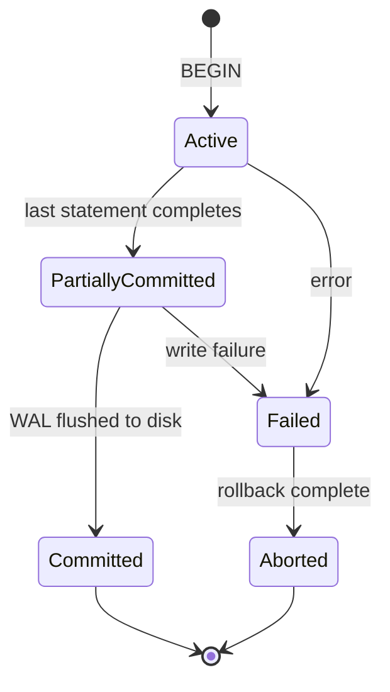
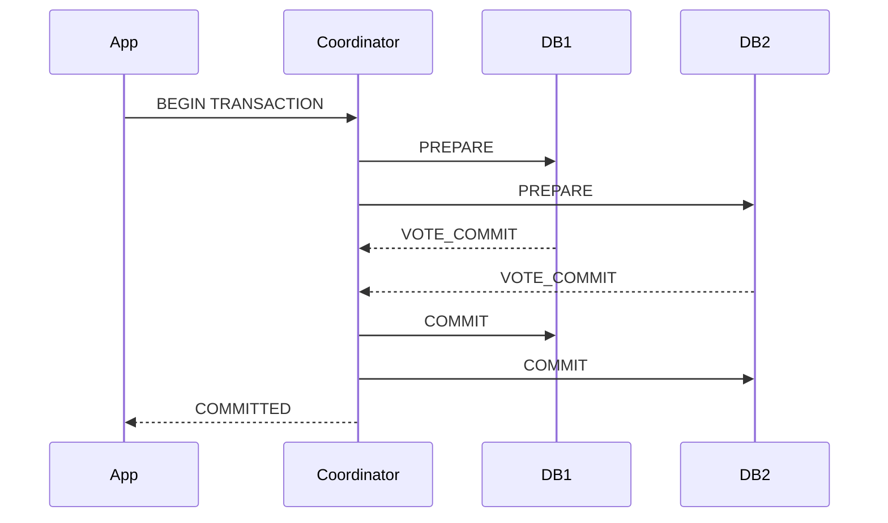

## ACID Properties

ACID is the set of guarantees that a relational database transaction provides. Understanding what
each property actually guarantees -- and what it does not -- is critical for building correct
concurrent systems.

### Atomicity

A transaction is an all-or-nothing unit of work. Either all operations in the transaction commit, or
none of them do. If the transaction fails at any point (constraint violation, system crash, network
failure), the database rolls back to the state before the transaction began.

Implementation: the database writes changes to a **write-ahead log (WAL)** before applying them to
the data files. On recovery, the WAL is replayed (committed transactions) or undone (uncommitted
transactions).

```sql
BEGIN;

UPDATE accounts SET balance = balance - 500 WHERE account_id = 1;
UPDATE accounts SET balance = balance + 500 WHERE account_id = 2;

-- If either UPDATE fails (e.g., insufficient funds), both are rolled back
COMMIT;
```

### Consistency

A transaction transforms the database from one valid state to another. All defined constraints (NOT
NULL, UNIQUE, CHECK, FOREIGN KEY) must hold at transaction commit. This property is partially the
responsibility of the database (enforcing constraints) and partially the responsibility of the
application (writing correct transaction logic).

:::info

Consistency in ACID is **not** the same as consistency in the CAP theorem. ACID consistency means
"the database satisfies all defined constraints." CAP consistency means "every read returns the most
recent write." They are different guarantees.

:::

### Isolation

Concurrent transactions should not interfere with each other. The isolation level determines the
degree to which this is enforced. Higher isolation levels provide stronger guarantees but reduce
concurrency and performance.

### Durability

Once a transaction commits, its effects are permanent, even in the event of a system crash, power
failure, or hardware fault. The database must guarantee that committed data can be recovered.

Implementation: committed WAL records are flushed to disk (fsync) before the COMMIT returns success
to the client. The actual data pages may be flushed to disk later (write-back caching), but the WAL
is the authoritative source for recovery.

```sql
-- fsync is the bottleneck for commit latency
-- PostgreSQL: synchronous_commit = on (default) means COMMIT waits for WAL fsync
-- Setting synchronous_commit = off trades durability for latency (~10x faster commits)
-- but may lose the last 100ms of transactions on a crash
```

## Transaction States

A transaction moves through a well-defined state machine:



| State               | Description                                                    |
| ------------------- | -------------------------------------------------------------- |
| Active              | Transaction is executing statements                            |
| Partially Committed | All statements executed; waiting for WAL flush                 |
| Committed           | WAL flushed; changes are permanent                             |
| Failed              | An error occurred; changes must be undone                      |
| Aborted             | Rollback completed; database restored to pre-transaction state |

## Isolation Levels

SQL defines four isolation levels, each preventing a different set of concurrency anomalies. The SQL
standard defines three anomalies: dirty reads, non-repeatable reads, and phantom reads.

### Anomaly Definitions

**Dirty Read:** Transaction T1 reads a value written by T2 that has not yet committed. If T2 rolls
back, T1 has read data that never existed.

**Non-Repeatable Read:** Transaction T1 reads a row, then T2 updates or deletes that row and
commits. When T1 re-reads the row, it sees different data.

**Phantom Read:** Transaction T1 reads a set of rows matching a condition, then T2 inserts a new row
matching that condition and commits. When T1 re-executes the query, it sees a new (phantom) row.

### Isolation Level Comparison

| Isolation Level  | Dirty Read | Non-Repeatable Read | Phantom Read | Lock-Based Implementation                     |
| ---------------- | ---------- | ------------------- | ------------ | --------------------------------------------- |
| READ UNCOMMITTED | Possible   | Possible            | Possible     | None                                          |
| READ COMMITTED   | Prevented  | Possible            | Possible     | Row-level shared locks (duration of read)     |
| REPEATABLE READ  | Prevented  | Prevented           | Possible\*   | Row-level locks held until end of transaction |
| SERIALIZABLE     | Prevented  | Prevented           | Prevented    | Range locks or snapshot isolation             |

\*PostgreSQL's REPEATABLE READ actually prevents phantom reads through its snapshot-based
implementation, exceeding the SQL standard's requirement.

### READ UNCOMMITTED

```sql
SET TRANSACTION ISOLATION LEVEL READ UNCOMMITTED;
```

- No locking for reads
- Can read uncommitted (dirty) data
- Fastest but most dangerous
- Rarely used in practice
- PostgreSQL treats this as READ COMMITTED (it always prevents dirty reads)

Use case: approximate aggregate queries where exact precision is not required (e.g., "roughly how
many orders today?").

### READ COMMITTED

```sql
SET TRANSACTION ISOLATION LEVEL READ COMMITTED;
```

- Default in PostgreSQL, Oracle, and SQL Server
- Each statement within a transaction sees a fresh snapshot of committed data
- Prevents dirty reads
- Does NOT prevent non-repeatable reads or phantom reads

```text
T1: BEGIN ISOLATION LEVEL READ COMMITTED;
T1: SELECT balance FROM accounts WHERE id = 1;  -- returns 1000
T2: BEGIN;
T2: UPDATE accounts SET balance = 900 WHERE id = 1;
T2: COMMIT;
T1: SELECT balance FROM accounts WHERE id = 1;  -- returns 900 (non-repeatable read)
T1: COMMIT;
```

### REPEATABLE READ

```sql
SET TRANSACTION ISOLATION LEVEL REPEATABLE READ;
```

- Default in MySQL (InnoDB)
- The transaction sees a snapshot as of its first read
- Prevents dirty reads and non-repeatable reads
- PostgreSQL prevents phantom reads too; MySQL does not

```text
T1: BEGIN ISOLATION LEVEL REPEATABLE READ;
T1: SELECT balance FROM accounts WHERE id = 1;  -- returns 1000
T2: BEGIN;
T2: UPDATE accounts SET balance = 900 WHERE id = 1;
T2: COMMIT;
T1: SELECT balance FROM accounts WHERE id = 1;  -- returns 1000 (repeatable read guaranteed)
T1: UPDATE accounts SET balance = balance - 100 WHERE id = 1;
-- ERROR: could not serialize access due to concurrent update
-- PostgreSQL detects the conflict and aborts T1
```

:::warning

In PostgreSQL, a REPEATABLE READ transaction that modifies data that was concurrently modified by
another committed transaction will fail with a serialization error. Your application must catch this
error and retry the transaction. This is by design -- it is the price of snapshot isolation.

:::

### SERIALIZABLE

```sql
SET TRANSACTION ISOLATION LEVEL SERIALIZABLE;
```

- Strongest isolation level
- Guarantees that concurrent transactions produce the same effect as if they were executed serially
  (one after another)
- Prevents dirty reads, non-repeatable reads, phantom reads, and write skew
- Highest performance cost; may require retries

**Write skew** is the primary anomaly that SERIALIZABLE prevents but REPEATABLE READ does not:

```text
T1: BEGIN ISOLATION LEVEL REPEATABLE READ;
T2: BEGIN ISOLATION LEVEL REPEATABLE READ;
T1: SELECT COUNT(*) FROM doctors WHERE on_call = TRUE;  -- returns 3
T2: SELECT COUNT(*) FROM doctors WHERE on_call = TRUE;  -- returns 3
T1: UPDATE doctors SET on_call = FALSE WHERE id = 1;    -- T1 goes off call (sees 2 remaining)
T2: UPDATE doctors SET on_call = FALSE WHERE id = 2;    -- T2 goes off call (sees 2 remaining)
T1: COMMIT;  -- succeeds
T2: COMMIT;  -- succeeds
-- Now only 1 doctor is on call, but both transactions believed there were enough (business rule: at least 2)

With SERIALIZABLE:
T2: COMMIT;  -- ERROR: could not serialize access due to concurrent update
```

### Choosing an Isolation Level

| Scenario                                                 | Recommended Level |
| -------------------------------------------------------- | ----------------- |
| Standard OLTP (most applications)                        | READ COMMITTED    |
| Financial transfers, inventory management                | REPEATABLE READ   |
| Booking systems, scheduling, any business rule integrity | SERIALIZABLE      |
| Approximate analytics, reporting                         | READ UNCOMMITTED  |

## Locking

Locks are the mechanism by which the database enforces isolation. Different lock types provide
different guarantees at different costs.

### Lock Types

**Shared Lock (S-lock, read lock):**

- Acquired when reading data
- Multiple transactions can hold S-locks on the same data simultaneously
- Prevents exclusive locks (other transactions cannot write)

**Exclusive Lock (X-lock, write lock):**

- Acquired when modifying data
- Only one transaction can hold an X-lock on a given data item
- Incompatible with both shared and exclusive locks

**Intention Locks:**

- Intention Shared (IS): indicates that a transaction intends to acquire S-locks on some rows in a
  table
- Intention Exclusive (IX): indicates that a transaction intends to acquire X-locks on some rows in
  a table
- Used for hierarchical locking (table-level intention locks, row-level actual locks)

| Lock Request             | IS           | IX           | S            | X            |
| ------------------------ | ------------ | ------------ | ------------ | ------------ |
| IS (Intention Shared)    | Compatible   | Compatible   | Compatible   | Incompatible |
| IX (Intention Exclusive) | Compatible   | Compatible   | Incompatible | Incompatible |
| S (Shared)               | Compatible   | Incompatible | Compatible   | Incompatible |
| X (Exclusive)            | Incompatible | Incompatible | Incompatible | Incompatible |

### Lock Granularity

The database can lock at different granularities:

- **Row-level locks**: most granular, highest concurrency, most lock management overhead
- **Page-level locks**: lock an entire page (8KB in PostgreSQL), balance between concurrency and
  overhead
- **Table-level locks**: lock the entire table, simplest but most restrictive

### Explicit Locking in SQL

```sql
-- Lock a row for update (prevents other transactions from modifying it):
SELECT * FROM accounts WHERE account_id = 1 FOR UPDATE;

-- Lock rows for update, skip locked rows (non-blocking queue pattern):
SELECT * FROM tasks WHERE status = 'pending'
ORDER BY created_at LIMIT 1
FOR UPDATE SKIP LOCKED;

-- Lock a table:
LOCK TABLE accounts IN EXCLUSIVE MODE;

-- Advisory locks (application-defined, not tied to table rows):
SELECT pg_advisory_lock(12345);      -- blocks until lock is available
SELECT pg_advisory_try_lock(12345);  -- returns TRUE if acquired, FALSE if not
SELECT pg_advisory_unlock(12345);    -- releases the lock
```

:::tip

`FOR UPDATE SKIP LOCKED` is the foundation of many job queue and task scheduling systems. Multiple
workers can safely `SELECT ... FOR UPDATE SKIP LOCKED` from the same table without deadlocking. Each
worker gets a different row, and rows that are already being processed are skipped.

:::

## Multi-Version Concurrency Control (MVCC)

MVCC is the concurrency control mechanism used by PostgreSQL, MySQL (InnoDB), Oracle, and SQLite.
Instead of locking data for readers, MVCC gives each transaction a snapshot of the database as of a
specific point in time. Readers do not block writers, and writers do not block readers.

### How MVCC Works (PostgreSQL)

1. Each row version (tuple) has two hidden system columns:
   - `xmin`: the transaction ID (xid) of the transaction that inserted this version
   - `xmax`: the transaction ID of the transaction that deleted or updated this version (0 if not
     deleted)

2. Each transaction has a snapshot that defines which transactions are visible:
   - Transactions with xid &lt; snapshot's `xmin` are committed and visible
   - Transactions with xid >= snapshot's `xmax` are not yet started and invisible
   - Between `xmin` and `xmax`: visible if committed, invisible if aborted

3. When a transaction reads a row:
   - If `xmin` is committed and `xmax` is 0 or aborted, the row is visible
   - If `xmax` is committed, the row has been deleted/updated; not visible
   - Otherwise, the row was created/deleted by an in-progress transaction; not visible

```text
accounts table (physical storage):

| id | balance | xmin | xmax |
|----|---------|------|------|
| 1  | 1000    | 100  | 0    |   -- original row, inserted by tx 100
| 1  | 900     | 101  | 0    |   -- updated row, inserted by tx 101

Transaction 102 (READ COMMITTED, snapshot at tx 102):
  Sees: id=1, balance=900 (xmin=101 is committed, xmax=0)

Transaction 99 (REPEATABLE READ, snapshot at tx 99):
  Sees: id=1, balance=1000 (xmin=100 is committed, xmax=0)
  Does NOT see the row with xmin=101 (101 >= snapshot's xmin)
```

### MVCC Trade-offs

**Advantages:**

- Readers never block writers, writers never block readers
- No read locks needed (reduces lock contention dramatically)
- Consistent snapshots for long-running queries (e.g., backups, reports)

**Disadvantages:**

- Write amplification: UPDATE creates a new row version, consuming more storage
- Dead tuple accumulation: requires VACUUM to reclaim space
- Transaction ID wraparound: PostgreSQL uses 32-bit xids (approximately 4 billion); wraparound
  causes data loss if not managed (autovacuum prevents this)
- Longer rollback time: rolling back a transaction that modified millions of rows requires marking
  all those tuples as dead

### Snapshot Isolation vs Serializability

Snapshot isolation (SI) is the isolation model provided by MVCC. It prevents dirty reads,
non-repeatable reads, and phantom reads. However, it does **not** prevent write skew (see the
SERIALIZABLE section above). True serializability requires additional mechanisms:

- **SSI (Serializable Snapshot Isolation):** PostgreSQL's default SERIALIZABLE implementation. It
  tracks read and write dependencies between transactions and aborts transactions that could produce
  non-serializable results. This is optimistic concurrency control.
- **Two-Phase Locking (2PL):** Pessimistic approach; acquires all locks before any release. Provides
  true serializability but at the cost of reduced concurrency.

## Two-Phase Locking (2PL)

Two-Phase Locking is the classic pessimistic concurrency control protocol that guarantees
serializability.

### Phases

1. **Growing phase:** the transaction acquires locks but does not release any
2. **Shrinking phase:** the transaction releases locks but does not acquire any

Once a transaction releases its first lock, it enters the shrinking phase and cannot acquire any
more locks. This protocol prevents cascading aborts and guarantees serializability.

### Variants

- **Strict 2PL:** all exclusive locks are held until commit or rollback (most common in practice)
- **Rigorous 2PL:** all locks (shared and exclusive) are held until commit or rollback

### Deadlocks

When two or more transactions hold locks that the other needs, and each is waiting for the other, a
deadlock occurs:

```text
T1: BEGIN;
T1: UPDATE accounts SET balance = balance - 500 WHERE id = 1;  -- locks row 1
T2: BEGIN;
T2: UPDATE accounts SET balance = balance - 300 WHERE id = 2;  -- locks row 2
T1: UPDATE accounts SET balance = balance + 300 WHERE id = 2;  -- waits for T2's lock on row 2
T2: UPDATE accounts SET balance = balance + 500 WHERE id = 1;  -- waits for T1's lock on row 1
-- DEADLOCK: T1 waits for T2, T2 waits for T1
```

### Deadlock Detection and Prevention

**Detection:** the database maintains a wait-for graph and periodically checks for cycles. When a
cycle is detected, the database aborts one of the transactions (the "victim") and releases its
locks.

**Prevention strategies:**

1. **Consistent ordering:** always access tables and rows in the same order across all transactions
2. **Short transactions:** hold locks for as little time as possible
3. `SELECT ... FOR UPDATE` in a predictable order

```sql
-- Prevent deadlocks by always accessing accounts in ascending ID order:
UPDATE accounts SET balance = balance - 500 WHERE id = LEAST(1, 2);
UPDATE accounts SET balance = balance + 500 WHERE id = GREATEST(1, 2);
```

### Handling Deadlocks in Application Code

```sql
-- PostgreSQL raises error 40P01 on deadlock:
-- ERROR: deadlock detected
-- DETAIL: Process 12345 waits for ShareLock on transaction 789; blocked by process 67890.

-- Application must retry:
-- retry_counter = 0
-- while retry_counter < 3:
--     try:
--         execute_transaction()
--         break
--     except DeadlockDetected:
--         retry_counter += 1
--         sleep(exponential_backoff(retry_counter))
-- raise MaxRetriesExceeded
```

## Savepoints

Savepoints allow you to set markers within a transaction and roll back to a specific savepoint
without aborting the entire transaction.

```sql
BEGIN;

INSERT INTO audit_log (action) VALUES ('start batch');

SAVEPOINT before_employee_insert;

INSERT INTO employees (first_name, last_name, email) VALUES ('Ada', 'Lovelace', 'ada@example.com');

-- If something goes wrong with subsequent operations:
SAVEPOINT before_department_update;

UPDATE departments SET budget = budget * 1.1 WHERE dept_id = 3;

-- Oops, wrong department:
ROLLBACK TO before_department_update;

UPDATE departments SET budget = budget * 1.1 WHERE dept_id = 5;

COMMIT;
-- The employee insert is committed, the wrong department update is rolled back
```

:::warning

Savepoints consume resources (transaction ID advancement, WAL records). Do not use savepoints in
tight loops (e.g., one savepoint per row in a batch). Instead, batch your operations and use a
single savepoint for the entire batch.

:::

## Distributed Transactions

When a transaction spans multiple databases or services, coordination becomes significantly more
complex.

### Two-Phase Commit (2PC)

2PC ensures atomicity across multiple participants by using a coordinator:



**Phase 1 (Prepare/Vote):** The coordinator asks all participants to prepare. Each participant
writes the prepare record to its WAL and replies with VOTE_COMMIT or VOTE_ABORT.

**Phase 2 (Commit/Abort):** If all participants voted COMMIT, the coordinator sends COMMIT to all.
If any voted ABORT, the coordinator sends ABORT to all.

**Failure modes:**

- If a participant fails after voting COMMIT but before receiving the final decision, it is
  **blocked**: it cannot commit (it does not know the decision) and cannot abort (it promised to
  commit). It must wait for the coordinator to recover and re-send the decision.
- If the coordinator fails after phase 1, participants are blocked until the coordinator recovers.
  This is the **blocking problem** of 2PC.

### Three-Phase Commit (3PC)

3PC adds a "Pre-Commit" phase to solve the blocking problem:

1. **CanCommit:** coordinator asks if participants can commit
2. **PreCommit:** coordinator tells participants to prepare to commit
3. **DoCommit:** coordinator sends the final decision

If the coordinator fails in the PreCommit phase, participants can safely commit (because all
participants must have voted yes to reach PreCommit). If the coordinator fails in CanCommit,
participants abort.

In practice, 3PC is rarely used because it requires synchronous network communication and perfect
failure detectors, which are unrealistic assumptions.

### Alternatives to Distributed Transactions

2PC and 3PC are heavyweight and slow (adding network round-trips to every transaction). Modern
systems prefer:

1. **Saga pattern:** break a distributed transaction into a sequence of local transactions, each
   with a compensating action for rollback
2. **Eventual consistency:** accept that the system may be temporarily inconsistent, and use
   background reconciliation
3. **Outbox pattern:** write business data and outgoing events to the same local transaction; a
   background process publishes the events

:::tip

Avoid 2PC unless you absolutely need atomic cross-database writes. The performance cost (additional
network round-trips, coordinator overhead, blocking on failure) and operational complexity (recovery
procedures, heuristic outcomes) make it a last resort. Prefer sagas for most distributed workflows.

:::

## Optimistic vs Pessimistic Concurrency Control

### Pessimistic Concurrency Control

Assumes conflicts are likely and prevents them by acquiring locks before accessing data.

- Uses locks (`SELECT ... FOR UPDATE`)
- Transactions wait for conflicting locks to be released
- High contention reduces throughput
- Best for: write-heavy workloads, low contention, or when retries are expensive

```sql
BEGIN;
SELECT * FROM inventory WHERE product_id = 42 FOR UPDATE;
-- If another transaction holds a lock on this row, we block here
UPDATE inventory SET quantity = quantity - 1 WHERE product_id = 42;
COMMIT;
```

### Optimistic Concurrency Control

Assumes conflicts are rare and detects them after the fact.

- No locks during reads
- On write, check that the data has not changed since it was read
- If a conflict is detected, abort and retry
- Best for: read-heavy workloads, low contention, or when conflicts are truly rare

```sql
-- Version column approach:
BEGIN;
SELECT quantity, version FROM inventory WHERE product_id = 42;
-- Application stores: quantity=100, version=5
UPDATE inventory SET quantity = 99, version = 6
WHERE product_id = 42 AND version = 5;
-- If 1 row affected: success. If 0 rows affected: conflict, retry.
COMMIT;
```

### Comparison

| Aspect                       | Pessimistic                | Optimistic                           |
| ---------------------------- | -------------------------- | ------------------------------------ |
| Conflict handling            | Prevented by locks         | Detected on write, resolved by retry |
| Throughput (low contention)  | Lower (lock overhead)      | Higher (no lock overhead)            |
| Throughput (high contention) | Higher (serialised access) | Lower (many retries)                 |
| Latency                      | May wait for locks         | Immediate reads                      |
| Complexity                   | Simpler logic              | Must implement retry logic           |
| Deadlocks                    | Possible                   | Not possible                         |
| Best for                     | Write-heavy, hot rows      | Read-heavy, cold rows                |

## Common Pitfalls

### Long-Running Transactions

A transaction that stays open for minutes or hours holds snapshots that prevent VACUUM from
reclaiming dead tuples. In PostgreSQL, this causes table and index bloat. Monitor long-running
transactions:

```sql
SELECT pid, now() - xact_start AS duration, query, state
FROM pg_stat_activity
WHERE state IN ('idle in transaction', 'active')
  AND now() - xact_start > INTERVAL '5 minutes'
ORDER BY duration DESC;
```

### Not Retrying Serialization Failures

Under REPEATABLE READ and SERIALIZABLE isolation, the database may abort your transaction with a
serialization error. If your application does not catch and retry these errors, users will see
spurious failures. Implement retry logic with exponential backoff.

### Ignoring Connection State Between Transactions

Connection poolers in transaction mode (PgBouncer) reset the session state between transactions. If
you `SET` a variable (e.g., `SET search_path TO tenant_123`), it will not persist to the next
transaction. Use `SET LOCAL` for transaction-scoped settings, or use session pooling.

### Mixing Isolation Levels Without Understanding the Implications

Changing the isolation level for a single query without understanding the anomaly it introduces is
dangerous. For example, reading aggregate counts at READ UNCOMMITTED for a dashboard may show
uncommitted transactions that will be rolled back, leading to incorrect metrics.

### Forgetting That LOCK TABLE Blocks All Other Operations

`LOCK TABLE accounts IN ACCESS EXCLUSIVE MODE` blocks all reads and writes on the table from all
other transactions. Use the most restrictive lock that suffices: `ACCESS SHARE` (default for
SELECT), `ROW EXCLUSIVE` (default for UPDATE/DELETE/INSERT), or `SHARE UPDATE EXCLUSIVE` (for
VACUUM-like operations).

### Not Setting Statement Timeouts

A runaway query can hold locks indefinitely, blocking other transactions. Set statement timeouts as
a safety net:

```sql
-- Per-session:
SET statement_timeout = '30s';

-- Per-role:
ALTER ROLE web_app SET statement_timeout = '30s';

-- Per-database:
ALTER DATABASE mydb SET statement_timeout = '30s';
```

## Transaction Patterns

### The Account Transfer Pattern

The classic example of why transactions are necessary: transferring money between two accounts
requires atomicity -- either both debits and credits happen, or neither does.

```sql
BEGIN;

-- Check sufficient funds (consistent read within this transaction)
SELECT balance FROM accounts WHERE account_id = 1 FOR UPDATE;

-- If balance is insufficient, the application rolls back here

-- Debit source
UPDATE accounts SET balance = balance - 500 WHERE account_id = 1;

-- Credit destination
UPDATE accounts SET balance = balance + 500 WHERE account_id = 2;

-- Record the transfer
INSERT INTO transfers (from_account, to_account, amount, transfer_at)
VALUES (1, 2, 500, NOW());

COMMIT;
```

The `FOR UPDATE` lock on the source account prevents concurrent transfers from overdrafting. The
entire operation is atomic: if any step fails, the database rolls back all changes.

### The Inventory Reservation Pattern

Prevent overselling by locking inventory within a transaction:

```sql
BEGIN;

-- Lock the inventory row for this product
SELECT quantity FROM inventory
WHERE product_id = 42
FOR UPDATE;

-- Check availability (application logic)
-- If quantity &lt; requested, ROLLBACK

-- Reserve the items
UPDATE inventory SET quantity = quantity - 3
WHERE product_id = 42;

-- Create the order
INSERT INTO orders (product_id, quantity, status) VALUES (42, 3, 'reserved');

COMMIT;
```

For high-throughput inventory systems, this pessimistic approach may become a bottleneck. Consider
optimistic concurrency control instead:

```sql
BEGIN;

UPDATE inventory
SET quantity = quantity - 3
WHERE product_id = 42 AND quantity >= 3;

-- Check rows_affected: if 0, the reservation failed (insufficient stock)
-- If 1, proceed with the order

COMMIT;
```

### The Outbox Pattern

When you need to update the database and publish a message/event atomically (e.g., "create order"
and "publish OrderCreated event"), the outbox pattern solves this without distributed transactions:

```sql
BEGIN;

-- 1. Perform the business operation
INSERT INTO orders (customer_id, total, status) VALUES (42, 99.99, 'created');
-- Let order_id = NEW.id

-- 2. Write the outgoing event to the outbox table (same transaction)
INSERT INTO outbox (event_type, aggregate_id, payload, created_at)
VALUES ('OrderCreated', order_id, '{"orderId": 123, "total": 99.99}', NOW());

COMMIT;

-- 3. A background process (poller or CDC) reads from the outbox and publishes to the message broker
-- 4. After successful publish, the process marks the outbox entry as published
```

This guarantees that the event is published if and only if the database transaction commits. The
background process must be idempotent (handle duplicate publishes gracefully).

## PostgreSQL Transaction Internals

### Transaction IDs (xid)

PostgreSQL assigns a 32-bit transaction ID (xid) to every transaction. The xid space is
approximately 4 billion transactions. When the xid counter wraps around, old data becomes invisible.
This is called **xid wraparound** and it causes data loss if not prevented.

```sql
-- Check xid consumption:
SELECT datname, age(datfrozenxid) AS xid_age,
       pg_size_pretty(pg_database_size(datname)) AS db_size
FROM pg_database
ORDER BY age(datfrozenxid) DESC;

-- If xid_age approaches 2 billion (2,000,000,000), autovacuum is not keeping up.
-- Emergency action: run VACUUM FREEZE on the database:
VACUUM FREEZE;
```

Autovacuum normally prevents wraparound by running `VACUUM` on tables before they approach the
wraparound threshold. If autovacuum is disabled or misconfigured, manual intervention is required.

### Transaction Visibility

PostgreSQL's visibility rules determine which row versions a transaction can see:

```text
For a row with (xmin, xmax):
  1. Is xmin committed? If no, the row was inserted by a transaction that rolled back. Invisible.
  2. Is xmax zero? If yes, the row has not been deleted. Visible (subject to snapshot).
  3. Is xmax committed? If yes, the row was deleted by a committed transaction. Invisible.
  4. Is xmax from an in-progress transaction? The row is visible to transactions in the same
     snapshot but not to later transactions.

Snapshot rules:
  - A transaction sees all rows committed by transactions with xid &lt; snapshot_xmin
  - A transaction does NOT see rows committed by transactions with xid >= snapshot_xmax
  - Between xmin and xmax: visible if committed, invisible if aborted, subject to snapshot
```

### Subtransactions and Transaction ID Consumption

Every `SAVEPOINT` creates a subtransaction, which consumes an xid. A transaction with 1000
savepoints consumes 1001 xids. For long-running batch jobs, this accelerates xid wraparound.

```sql
-- Bad: one savepoint per row (1000 rows = 1001 xids):
BEGIN;
DO $$
BEGIN
    FOR i IN 1..1000 LOOP
        SAVEPOINT sp;
        -- process row i
        -- RELEASE SAVEPOINT sp;  -- releases the subtransaction but the xid is still consumed
    END LOOP;
END $$;
COMMIT;

-- Better: batch savepoints (savepoint every 100 rows):
BEGIN;
DO $$
BEGIN
    FOR i IN 1..1000 LOOP
        IF i % 100 = 1 THEN
            SAVEPOINT sp;
        END IF;
        -- process row i
        IF i % 100 = 0 THEN
            RELEASE SAVEPOINT sp;
        END IF;
    END LOOP;
END $$;
COMMIT;
```

### Row-Level Security and Transactions

Row-Level Security (RLS) policies are evaluated within the transaction's security context. If you
change the current user within a transaction, RLS policies are re-evaluated:

```sql
-- Enable RLS on a table:
ALTER TABLE documents ENABLE ROW LEVEL SECURITY;

CREATE POLICY tenant_isolation ON documents
    USING (tenant_id = current_setting('app.current_tenant')::INTEGER);

-- Within a transaction, switch tenant context:
BEGIN;
SET LOCAL app.current_tenant = '42';
SELECT * FROM documents;  -- Only sees tenant 42's documents
COMMIT;
```

:::warning

RLS policies bypass `SELECT *` in a subtle way: the policy is applied after the query plan is
generated, so the planner does not know the effective row count. This can lead to suboptimal plans.
Use `SET LOCAL` within a transaction to scope the security context correctly.

:::

## Isolation Level Implementation Details

### PostgreSQL vs MySQL (InnoDB)

| Aspect              | PostgreSQL                                   | MySQL (InnoDB)                                      |
| ------------------- | -------------------------------------------- | --------------------------------------------------- |
| Default level       | READ COMMITTED                               | REPEATABLE READ                                     |
| MVCC implementation | Append-only (old tuples remain until VACUUM) | In-place update with undo logs                      |
| Phantom prevention  | REPEATABLE READ prevents phantoms            | REPEATABLE READ does NOT prevent phantoms           |
| Lock escalation     | No lock escalation (always row-level)        | May escalate to table-level for certain operations  |
| Deadlock detection  | Automatic (wait-for graph cycle detection)   | Automatic (timeout-based: innodb_lock_wait_timeout) |
| SERIALIZABLE        | SSI (Serializable Snapshot Isolation)        | Two-Phase Locking                                   |

### Oracle vs PostgreSQL

Oracle's MVCC implementation stores the undo data in separate undo segments (not in the table
itself). This means Oracle does not need VACUUM and tables do not bloat from UPDATEs. However,
Oracle's undo segments have a finite retention period (controlled by `UNDO_RETENTION`), and
long-running queries fail with `ORA-01555: snapshot too old` if the undo data needed for their
snapshot has been overwritten.

PostgreSQL's approach of keeping old tuples in the table (until VACUUM) means that long-running
queries never fail due to snapshot expiry, but the trade-off is table bloat and the need for VACUUM.
