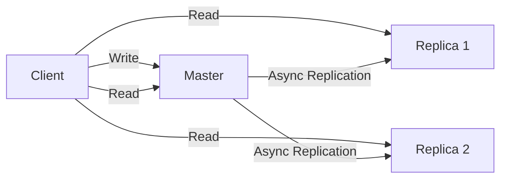
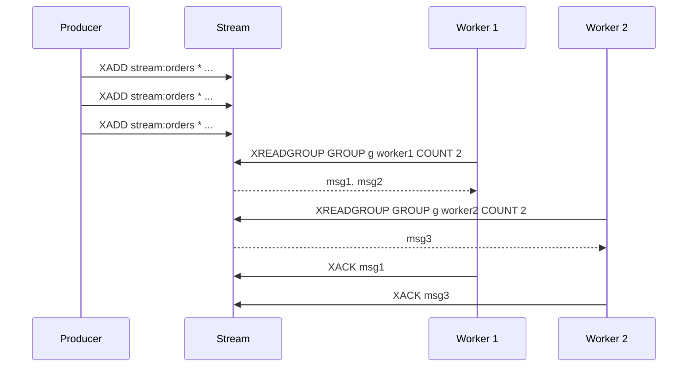

## Architecture Overview

Redis is a single-threaded, event-driven, in-memory data structure store. It uses I/O multiplexing
(`epoll`/`kqueue`/`kqueue`) to handle thousands of concurrent connections on a single thread.

### Single-Threaded Event Loop

```text
Main Thread Event Loop:
  1. Accept new connections (accept())
  2. Read commands from client sockets (read())
  3. Parse and execute commands
  4. Write responses to client sockets (write())
  5. Handle background tasks (fsync, AOF rewrite, etc.)
```

Despite being single-threaded for command execution, Redis uses **background I/O threads** (Redis
6+) for:

- File descriptor read/write
- Lazy freeing of large keys (`UNLINK` instead of `DEL`)

```conf
# redis.conf
io-threads 4
io-threads-do-reads yes
```

### Memory Model

Redis stores all data in RAM. The maximum memory is controlled by `maxmemory`:

```conf
maxmemory 4gb
maxmemory-policy allkeys-lru
```

## Data Structures

### Strings

Strings are the most fundamental Redis type. They can hold text, binary data (up to 512MB), and
integers (which support atomic increment/decrement):

```bash
SET user:1001:name "Alice"
GET user:1001:name
# "Alice"

SET counter 100
INCR counter
# 101
INCRBY counter 10
# 111
DECR counter
# 110

SETEX session:abc123 3600 "user_data"
# Expires in 3600 seconds

MGET user:1001:name user:1002:name user:1003:name
# Bulk retrieval of multiple keys
```

### Lists

Lists are linked lists (implemented as quicklists -- a doubly-linked list of ziplists). They support
pushing/popping from both ends:

```bash
LPUSH queue:tasks "task1" "task2" "task3"
RPOP queue:tasks
# "task1"

# Blocking pop (waits until an element is available)
BLPOP queue:tasks 30
# Blocks for up to 30 seconds

# Range operations
LRANGE queue:tasks 0 -1
# All elements
LTRIM queue:tasks 0 99
# Keep only first 100 elements
```

### Sets

Unordered collections of unique strings:

```bash
SADD tags:post:42 "redis" "database" "cache" "performance"
SMEMBERS tags:post:42
# "redis" "database" "cache" "performance"

SISMEMBER tags:post:42 "redis"
# 1 (true)

# Set operations
SINTER tags:post:42 tags:post:43
# Common tags between two posts
SUNION tags:post:42 tags:post:43
# All tags across both posts
SDIFF tags:post:42 tags:post:43
# Tags in post 42 but not in post 43

SCARD tags:post:42
# 4 (cardinality)
```

### Sorted Sets (ZSET)

Ordered collections where each member has an associated score:

```bash
ZADD leaderboard 1500 "player1" 2000 "player2" 1800 "player3"
ZREVRANGE leaderboard 0 -1 WITHSCORES
# 1) "player2" 2) 2000
# 3) "player3" 4) 1800
# 5) "player1" 6) 1500

ZREVRANK leaderboard "player1"
# 2 (0-indexed rank from highest)

ZADD leaderboard 2100 "player1"
# Update score (O(log N))

# Range queries
ZRANGEBYSCORE leaderboard 1500 1900 WITHSCORES
# Players with scores between 1500 and 1900

# Leaderboard with pagination
ZREVRANGE leaderboard 0 9 WITHSCORES
# Top 10 players
```

### Hashes

Field-value pairs within a single key:

```bash
HSET user:1001 name "Alice" email "alice@example.com" age 30
HGET user:1001 name
# "Alice"
HGETALL user:1001
# "name" "Alice" "email" "alice@example.com" "age" "30"
HMGET user:1001 name email
# "Alice" "alice@example.com"
HINCRBY user:1001 age 1
# 31
```

### Bitmaps

Bit-level operations on strings:

```bash
SETBIT user:1001:logins 0 1    # Day 0: logged in
SETBIT user:1001:logins 1 1    # Day 1: logged in
SETBIT user:1001:logins 2 0    # Day 2: did not log in
GETBIT user:1001:logins 0
# 1

# Count set bits (cardinality)
BITCOUNT user:1001:logins
# 2

# Bitwise operations
BITOP AND result:week user:1001:logins user:1002:logins
```

### HyperLogLog

Probabilistic cardinality estimation with 0.81% standard error, using only 12KB:

```bash
PFADD pageviews:2024-01-15 "user1" "user2" "user3" "user1"
PFCOUNT pageviews:2024-01-15
# 3 (deduplicated)

PFMERGE pageviews:2024-01-15-to-20 pageviews:2024-01-15 pageviews:2024-01-16
```

### Geospatial

```bash
GEOADD locations 13.361389 38.115556 "Palermo" 15.087269 37.502669 "Catania"
GEORADIUS locations 15 37 100 km COUNT 3
# Points within 100km of (15, 37)
GEODIST locations "Palermo" "Catania" km
# 166.2742
```

## Key Management

### TTL and Expiration

```bash
SETEX key 3600 "value"     # Set with 1-hour TTL
EXPIRE existing_key 1800    # Set TTL on existing key
TTL key                     # Remaining seconds (-1 = no expiry, -2 = key not found)
PTTL key                    # Remaining milliseconds
PERSIST key                 # Remove TTL

# Pattern: session with sliding expiry
# On each access: EXPIRE session:abc123 1800
```

### Eviction Policies

When `maxmemory` is reached, Redis uses the configured policy to evict keys:

| Policy            | Behavior                                    | Best For                            |
| ----------------- | ------------------------------------------- | ----------------------------------- |
| `noeviction`      | Return errors on write commands             | Data must not be lost               |
| `allkeys-lru`     | Evict least recently used keys (any key)    | General-purpose caching             |
| `allkeys-lfu`     | Evict least frequently used keys (Redis 4+) | Better than LRU for hot data        |
| `volatile-lru`    | Evict LRU among keys with TTL set           | Cache with important permanent keys |
| `volatile-lfu`    | Evict LFU among keys with TTL set           | Cache with important permanent keys |
| `allkeys-random`  | Evict random keys                           | Uniform access patterns             |
| `volatile-random` | Evict random keys with TTL set              | Uniform access with permanent data  |
| `volatile-ttl`    | Evict keys with shortest TTL                | Time-based cache                    |

## Persistence

### RDB Snapshots

RDB creates point-in-time snapshots of the dataset as binary dump files:

```conf
# redis.conf
save 900 1        # Save after 900 seconds if at least 1 key changed
save 300 10       # Save after 300 seconds if at least 10 keys changed
save 60 10000     # Save after 60 seconds if at least 10000 keys changed

dbfilename dump.rdb
dir /var/lib/redis
rdbcompression yes
rdbchecksum yes
```

RDB snapshots use a fork-based approach: the main process forks a child that writes the dump to
disk. The parent process continues serving requests using copy-on-write semantics. This means RDB
snapshots are non-blocking for reads but may cause latency spikes during fork if the dataset is
large.

### AOF (Append Only File)

AOF logs every write command to a file, providing better durability than RDB:

```conf
# redis.conf
appendonly yes
appendfilename "appendonly.aof"
appendfsync everysec    # fsync once per second (default, good balance)
# appendfsync always    # fsync every write (safest, slowest)
# appendfsync no        # Let OS decide when to fsync (fastest, least safe)
```

### AOF Rewrite

AOF files grow over time because every write is appended. Redis periodically rewrites the AOF to
create a minimal file that produces the same dataset state:

```conf
auto-aof-rewrite-percentage 100    # Trigger rewrite when AOF is 2x the last rewrite size
auto-aof-rewrite-min-size 64mb     # Minimum size to trigger rewrite
bgrewriteaof                        # Manual trigger
```

### Mixed Persistence (Redis 4+)

```conf
aof-use-rdb-preamble yes
```

The AOF file starts with an RDB snapshot (fast loading) followed by AOF incremental changes
(fine-grained durability). This combines the advantages of both approaches.

| Feature        | RDB                  | AOF                        | Mixed                |
| -------------- | -------------------- | -------------------------- | -------------------- |
| Durability     | Point-in-time only   | Every write (configurable) | Good                 |
| File size      | Compact              | Grows over time            | Compact + small tail |
| Recovery speed | Fast (binary load)   | Slow (replay commands)     | Fast                 |
| Write overhead | Fork during snapshot | Every write logged         | Moderate             |
| Best for       | Backup, replication  | Maximum durability         | General purpose      |

## Replication

### Master-Replica

```bash
# On the replica:
REPLICAOF master.host 6379
# Or in redis.conf:
# replicaof master.host 6379
# masterauth your_password
```



Replication is asynchronous by default. The replica acknowledges writes to the master, but the
master does not wait for replicas to confirm. This means data can be lost if the master fails before
propagating writes to replicas.

### Partial Resynchronization (PSYNC)

Redis uses a replication backlog (configurable size) on the master. If a replica disconnects and
reconnects within the backlog window, it can resume from where it left off (partial
resynchronization). If the disconnect was too long, a full resynchronization is required.

```conf
# Master configuration
repl-backlog-size 10mb
repl-backlog-ttl 3600    # Keep backlog for 1 hour after last replica disconnect
```

### Read-Only Replicas

Replicas accept reads by default but reject writes. Configure read behavior:

```conf
# On the replica
replica-read-only yes     # Reject writes (default)
replica-serve-stale-data yes  # Serve stale data when disconnected from master
```

## Redis Sentinel

Sentinel provides automatic failover for master-replica setups:

```conf
# sentinel.conf (run on 3+ independent nodes for quorum)
sentinel monitor mymaster 10.0.0.1 6379 2
sentinel down-after-milliseconds mymaster 5000
sentinel failover-timeout mymaster 60000
sentinel parallel-syncs mymaster 1
sentinel auth-pass mymaster your_password
```

| Parameter                 | Meaning                                             |
| ------------------------- | --------------------------------------------------- |
| `monitor`                 | Master name, IP, port, quorum (votes needed)        |
| `down-after-milliseconds` | Mark master as down after this many ms              |
| `failover-timeout`        | Wait this long between failovers                    |
| `parallel-syncs`          | How many replicas to resync at once during failover |

Sentinel also acts as a configuration provider: clients connect to Sentinel to discover the current
master address.

## Redis Cluster

Redis Cluster provides horizontal partitioning (sharding) across multiple nodes:

### Hash Slots

Redis Cluster uses 16,384 hash slots. Each key is assigned a slot via `CRC16(key) % 16384`. Each
shard (master node) owns a contiguous range of slots.

```bash
# Create a cluster (requires at least 6 nodes: 3 masters + 3 replicas)
redis-cli --cluster create \
  10.0.0.1:7000 10.0.0.2:7000 10.0.0.3:7000 \
  10.0.0.4:7000 10.0.0.5:7000 10.0.0.6:7000 \
  --cluster-replicas 1
```

### Hash Tags

Keys with the same hash tag `{tag}` are placed on the same slot:

```bash
SET user:1001:profile "data"
SET user:1001:settings "data"
# These go to different slots (CRC16 of entire key)

SET {user:1001}:profile "data"
SET {user:1001}:settings "data"
# These go to the SAME slot (CRC16 of "user:1001")
```

Hash tags enable multi-key operations on the same slot:

```bash
MGET {user:1001}:profile {user:1001}:settings  # Works (same slot)
MGET user:1001:profile user:1001:settings      # ERROR: keys in different slots
```

### Gossip Protocol

Cluster nodes communicate via a gossip protocol on port `port + 10000`. Each node periodically pings
a few random nodes and exchanges cluster state information (node status, slot mapping, config
epoch). This allows the cluster to detect failures and trigger failover without a centralized
coordinator.

### Resharding

```bash
# Move 100 slots from node 1 to node 4
redis-cli --cluster reshard 10.0.0.1:7000 \
  --cluster-from 10.0.0.1:7000 \
  --cluster-to 10.0.0.4:7000 \
  --cluster-slots 100 \
  --cluster-yes
```

## Pub/Sub

```bash
# Publisher
PUBLISH channel:orders '{"order_id": 42, "status": "created"}'

# Subscriber
SUBSCRIBE channel:orders
# Messages are delivered to all current subscribers
# Messages are NOT persisted: if no subscriber is listening, the message is lost

# Pattern subscription
PSUBSCRIBE channel:orders:*
# Matches channel:orders:created, channel:orders:shipped, etc.
```

### Limitations

- Messages are fire-and-forget: no persistence, no delivery guarantees
- If a subscriber disconnects, it misses messages during the disconnect
- No message backlog for new subscribers
- For reliable messaging, use Redis Streams instead

## Streams (Redis 5+)

Streams provide a persistent, append-only log with consumer groups:

```bash
# Add entries to a stream
XADD stream:orders * order_id 42 customer_id 1001 total 299.99
# Returns: "1697123456789-0" (timestamp-sequence ID)

# Read entries
XRANGE stream:orders - +
XREVRANGE stream:orders + - COUNT 10

# Consumer groups
XGROUP CREATE stream:orders order_processor 0 MKSTREAM

# Consumer reads from group
XREADGROUP GROUP order_processor worker1 COUNT 1 BLOCK 5000 STREAMS stream:orders >
# ">" means: deliver new messages (unread)

# Acknowledge processing
XACK stream:orders order_processor 1697123456789-0

# View pending entries (delivered but not acknowledged)
XPENDING stream:orders order_processor
```



### Consumer Group Features

- **Load balancing**: messages distributed across consumers in the group
- **Message acknowledgment**: consumers must XACK after processing
- **Pending entries list (PEL)**: tracks delivered but unacknowledged messages
- **Claim**: reassign messages from a dead consumer to a live one

```bash
# Claim messages from a dead consumer (idle for 60s)
XCLAIM stream:orders order_processor worker2 60000 1697123456789-0
```

## Transactions

```bash
MULTI
SET key1 "value1"
SET key2 "value2"
INCR counter
EXEC
# All commands execute atomically

# Discard
MULTI
SET key1 "value1"
DISCARD
# No commands executed

# Watch (optimistic locking)
WATCH account:1
GET account:1
# "1000"
# ... application logic ...
MULTI
SET account:1 "900"
EXEC
# If account:1 was modified by another client between WATCH and EXEC,
# EXEC returns nil (transaction aborted)
```

### Transaction Limitations

- All commands are queued and executed sequentially after `EXEC`
- No conditional logic inside a transaction
- `WATCH` provides optimistic locking but requires retry on conflict
- Transactions are not rolled back on errors within `EXEC` (partial execution)

## Lua Scripting

Lua scripts execute atomically on the server:

```bash
EVAL '
local current = redis.call("GET", KEYS[1])
if current and tonumber(current) >= tonumber(ARGV[1]) then
    redis.call("DECRBY", KEYS[1], ARGV[1])
    return 1
else
    return 0
end
' 1 account:balance 100
```

```bash
# Load script once, execute multiple times (more efficient)
SCRIPT LOAD 'return redis.call("GET", KEYS[1])'
# Returns: "sha1hash"
EVALSHA sha1hash 1 mykey
```

### Lua Script Rules

- Scripts are atomic (no other commands run during script execution)
- Scripts should be fast: long-running scripts block the entire Redis instance
- All keys accessed by a script must be passed via `KEYS` array (not hardcoded)
- In Redis Cluster, all keys must be on the same hash slot

## Pipelines

Pipelines batch multiple commands into a single round-trip:

```python
import redis

r = redis.Redis(host='localhost', port=6379)

pipe = r.pipeline()
for i in range(10000):
    pipe.set(f"key:{i}", f"value:{i}")
pipe.execute()
# 1 round-trip instead of 10000
```

Performance comparison:

| Method     | 10,000 commands | Latency (approx) |
| ---------- | --------------- | ---------------- |
| Individual | 10,000 RTTs     | ~10s (1ms/RTT)   |
| Pipeline   | 1 RTT           | ~50ms            |
| Lua script | 1 RTT           | ~30ms            |

## Memory Optimization

### Encoding Types

Redis automatically selects memory-efficient encodings based on value characteristics:

| Type       | Encoding  | When Used                               | Memory per element |
| ---------- | --------- | --------------------------------------- | ------------------ |
| Hash       | ziplist   | &lt;= 512 fields, each &lt;= 64 bytes   | ~2 bytes           |
| Hash       | hashtable | Exceeds ziplist thresholds              | ~60 bytes          |
| List       | quicklist | Always (ziplist nodes in linked list)   | ~8 bytes           |
| Set        | intset    | All integers, count &lt;= 512           | ~4 bytes           |
| Set        | hashtable | Non-integers or count &gt; 512          | ~60 bytes          |
| Sorted Set | ziplist   | &lt;= 128 elements, each &lt;= 64 bytes | ~8 bytes           |
| Sorted Set | skiplist  | Exceeds ziplist thresholds              | ~60 bytes          |

### Hash Tags for Related Data

```bash
# Instead of separate keys:
SET user:1001:name "Alice"
SET user:1001:email "alice@example.com"

# Use a hash (more memory-efficient):
HSET user:1001 name "Alice" email "alice@example.com"
```

### Object Encoding Debugging

```bash
MEMORY USAGE key              # Bytes used by key
DEBUG OBJECT key              # Shows encoding type
OBJECT ENCODING key           # Returns: ziplist, hashtable, intset, etc.
```

## Common Patterns

### Caching

```bash
# Cache-aside pattern
GET cache:user:1001
# If nil: fetch from DB, then SET cache:user:1001 "data" EX 300
```

### Rate Limiting (Token Bucket via Lua)

```lua
-- KEYS[1] = rate_limit:user:1001
-- ARGV[1] = limit (e.g., 10)
-- ARGV[2] = window (e.g., 60 seconds)

local key = KEYS[1]
local limit = tonumber(ARGV[1])
local window = tonumber(ARGV[2])

local current = redis.call("INCR", key)
if current == 1 then
    redis.call("EXPIRE", key, window)
end

if current > limit then
    return 0  -- rejected
else
    return current  -- remaining
end
```

### Leaderboard

```bash
ZADD leaderboard 1500 "player1"
ZINCRBY leaderboard 50 "player1"
ZREVRANGE leaderboard 0 9 WITHSCORES
ZREVRANK leaderboard "player1"
```

### Session Store

```bash
SETEX session:abc123 1800 '{"user_id": 1001, "role": "admin"}'
GET session:abc123
# On logout: DEL session:abc123
# On access: EXPIRE session:abc123 1800 (sliding expiry)
```

### Job Queue

```bash
# Producer
LPUSH queue:jobs '{"type": "email", "to": "user@example.com"}'

# Consumer (blocking)
BRPOP queue:jobs 30

# Failed jobs
LPUSH queue:jobs:failed job_payload
```

## Common Pitfalls

### Using KEYS in Production

`KEYS pattern*` scans the entire keyspace and blocks Redis during the scan. On a large dataset, this
can cause seconds of latency:

```bash
# WRONG: blocks for seconds on large datasets
KEYS user:*

# RIGHT: incremental scan
SCAN 0 MATCH user:* COUNT 100
# Returns cursor and batch of keys
# Continue with SCAN <cursor> MATCH user:* COUNT 100
```

### Not Setting maxmemory

Without `maxmemory`, Redis consumes all available RAM and triggers the OS OOM killer, which
terminates the Redis process (and loses all non-persisted data). Always set `maxmemory` and an
appropriate eviction policy.

### Large Keys

Keys larger than 10KB can cause latency spikes because Redis processes them atomically on a single
thread. A 100MB string takes ~100ms to serialize, blocking all other commands during that time.

```bash
# Find large keys
redis-cli --bigkeys
# Or use MEMORY USAGE
redis-cli MEMORY USAGE mykey
```

### Pub/Sub Message Loss

Pub/sub does not persist messages. If a subscriber disconnects, it misses messages. If no subscriber
is listening when a message is published, the message is lost entirely. Use Streams for reliable
messaging.

### Blocking Commands Without Timeouts

`BLPOP`, `BRPOP`, `XREADGROUP BLOCK`, and `BRPOPLPUSH` without timeouts block the connection
indefinitely. Always specify a timeout:

```bash
BLPOP queue:tasks 30   # Timeout after 30 seconds
```

## Redis Configuration Deep-Dive

### Critical Configuration Parameters

```conf
# redis.conf - key parameters for production

# Network
bind 127.0.0.1 192.168.1.100   # Bind to specific interfaces
port 6379
protected-mode yes               # Reject connections from unbound interfaces
tcp-backlog 511                  # Connection queue (increase for high-conn environments)
timeout 0                        # Close idle clients after N seconds (0 = never)

# Memory
maxmemory 4gb
maxmemory-policy allkeys-lru
maxmemory-samples 5              # LRU sample size (higher = more accurate but slower)

# Persistence
save 900 1
save 300 10
save 60 10000
appendonly yes
appendfsync everysec

# Security
requirepass your_strong_password  # Authentication
rename-command FLUSHDB ""         # Disable dangerous commands
rename-command FLUSHALL ""
rename-command DEBUG ""

# Logging
loglevel notice
logfile /var/log/redis/redis.log

# Slow queries (log queries exceeding threshold)
slowlog-log-slower-than 10000    # 10ms in microseconds
slowlog-max-len 128               # Keep last 128 slow queries
```

### Slow Query Log

```bash
# View slow queries
redis-cli SLOWLOG GET 10

# Slow log length
redis-cli SLOWLOG LEN

# Reset slow log
redis-cli SLOWLOG RESET

# Configure threshold
redis-cli CONFIG SET slowlog-log-slower-than 5000  # 5ms
```

## Redis Sentinel Deep-Dive

### Sentinel Architecture

```text
         ┌─────────────┐
         │  Sentinel 1  │
         └──────┬──────┘
                │ gossip
         ┌──────┴──────┐
         │  Sentinel 2  │
         └──────┬──────┘
                │ gossip
┌───────┐       │       ┌───────┐
│ Master│◄──────┴──────►│ Rep1  │
└───┬───┘               └───────┘
    │ async replication
┌───┴───┐
│ Rep2  │
└───────┘
```

### Sentinel Commands

```bash
# Check master status
redis-cli -p 26379 SENTINEL master mymaster

# Check replicas
redis-cli -p 26379 SENTINEL replicas mymaster

# Check sentinel peers
redis-cli -p 26379 SENTINEL sentinels mymaster

# Get current master address (for client connection)
redis-cli -p 26379 SENTINEL get-master-addr-by-name mymaster

# Force failover (for testing)
redis-cli -p 26379 SENTINEL failover mymaster
```

### Sentinel Configuration Best Practices

```conf
# Minimum 3 Sentinel instances for quorum (prevents split-brain)
# Deploy on separate machines from the Redis servers
# Set quorum to (number_of_sentinels / 2) + 1

sentinel monitor mymaster 10.0.0.1 6379 2
sentinel down-after-milliseconds mymaster 5000
sentinel failover-timeout mymaster 60000
sentinel parallel-syncs mymaster 1
```

## Redis Cluster Operations

### Cluster Management

```bash
# Create a cluster with 3 masters and 3 replicas
redis-cli --cluster create \
  10.0.0.1:7000 10.0.0.2:7000 10.0.0.3:7000 \
  10.0.0.4:7000 10.0.0.5:7000 10.0.0.6:7000 \
  --cluster-replicas 1

# Check cluster status
redis-cli -c -p 7000 CLUSTER INFO

# List cluster nodes
redis-cli -c -p 7000 CLUSTER NODES

# Check slot distribution
redis-cli -c -p 7000 CLUSTER COUNTKEYSINSLOT 0
redis-cli -c -p 7000 CLUSTER GETKEYSINSLOT 0 10
```

### Cluster Limitations

| Limitation              | Value          | Workaround                            |
| ----------------------- | -------------- | ------------------------------------- |
| Maximum keys            | 2^34           | Use sharding across clusters          |
| Minimum master nodes    | 3              | Required for quorum                   |
| Multi-key operations    | Same slot only | Use hash tags `{key}`                 |
| Database count          | 1 (database 0) | Use key prefixes for namespaces       |
| SELECT in Lua scripts   | Not supported  | Use `redis.call()` for reads          |
| Pipelining across slots | Not supported  | Pipeline to the correct node directly |

### Handling MOVED and ASK Redirects

When a client sends a command to the wrong node, the node responds with a `MOVED` or `ASK` redirect:

```text
# MOVED: the slot has permanently moved to another node (resend to new node)
# ASK: the slot is temporarily on another node (during resharding)
```

Most Redis client libraries handle redirects automatically when `cluster-enabled: true` is
configured.

## Redis Security

### Authentication and ACLs

```bash
# Legacy: requirepass (single password for all users)
requirepass mypassword

# Modern: ACLs (Redis 6+)
# Create a user with specific permissions
ACL SETUSER app_user on +@read +@connection -@dangerous ~app:* &my_password

# Create a read-only user
ACL SETUSER readonly on +@read ~* &readonly_pass

# List users
ACL LIST

# Show user details
ACL WHOAMI
ACL GETUSER app_user

# ACL categories:
# +@read     - all read commands
# +@write    - all write commands
# +@admin    - administrative commands
# +@dangerous - dangerous commands (FLUSH, DEBUG, etc.)
# +@connection - client management commands
# ~pattern   - allowed key patterns
# &password  - user password
```

### Network Security

```conf
# Bind to specific interfaces
bind 127.0.0.1

# Disable protected-mode if binding to non-loopback (requires auth)
protected-mode yes

# TLS encryption (Redis 6+)
tls-port 6379
port 0
tls-cert-file /etc/redis/server.crt
tls-key-file /etc/redis/server.key
tls-ca-cert-file /etc/redis/ca.crt
tls-auth-clients optional   # or 'yes' for mTLS
```

## Redis Performance Benchmarking

```bash
# Built-in benchmark
redis-benchmark -h localhost -p 6379 -c 50 -n 100000

# Test specific commands
redis-benchmark -t set,get,lpush,lpop -n 100000 -c 50

# Test pipeline mode
redis-benchmark -t set -n 100000 -c 50 -P 16

# Test with larger values
redis-benchmark -t set -n 10000 -c 50 -d 1024  # 1KB values
```

### Performance Expectations

| Command        | Single-Thread Throughput (approx) | Notes                           |
| -------------- | --------------------------------- | ------------------------------- |
| SET            | 80,000-120,000 ops/sec            | Varies by value size            |
| GET            | 100,000-150,000 ops/sec           |                                 |
| LPUSH/LPOP     | 80,000-120,000 ops/sec            |                                 |
| SADD/SISMEMBER | 80,000-120,000 ops/sec            |                                 |
| ZADD/ZRANGE    | 60,000-100,000 ops/sec            | Depends on sorted set size      |
| MGET (10 keys) | 40,000-60,000 ops/sec             | Amortized per key               |
| Pipeline (16)  | 500,000-800,000 ops/sec           | 16x improvement from pipelining |

## Redis Memory Analysis

```bash
# Memory usage summary
redis-cli INFO memory

# Memory usage of a specific key
redis-cli MEMORY USAGE mykey

# Largest keys in the database
redis-cli --bigkeys

# Memory profiler (Redis 4+)
redis-cli MEMORY DOCTOR
redis-cli MEMORY PURGE  # Clean up expired keys immediately
redis-cli MEMORY STATS  # Per-allocator stats
```
