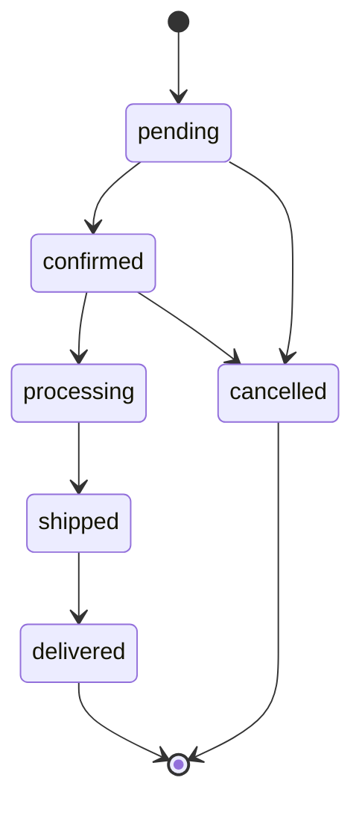

## Normalization Review

### When to Stop Normalizing

Normalization eliminates redundancy and update anomalies, but there is a point of diminishing
returns. The decision of when to stop depends on your read/write ratio, performance requirements,
and complexity tolerance.

| Normal Form | Eliminates                             | Practical Impact                           |
| ----------- | -------------------------------------- | ------------------------------------------ |
| 1NF         | Repeating groups, non-atomic values    | Foundation; every table should be in 1NF   |
| 2NF         | Partial dependencies on composite keys | Eliminates redundant data in composite PKs |
| 3NF         | Transitive dependencies (A → B → C)    | Most OLTP schemas stop here                |
| BCNF        | All candidate keys fully determined    | Slight refinement over 3NF                 |
| 4NF         | Multi-valued dependencies              | Rarely needed in practice                  |
| 5NF         | Join dependencies                      | Theoretical; almost never practical        |

### 3NF vs Denormalization

```sql
-- 3NF: normalized (three tables)
CREATE TABLE customers (
    customer_id SERIAL PRIMARY KEY,
    name TEXT NOT NULL,
    email TEXT NOT NULL UNIQUE
);

CREATE TABLE orders (
    order_id SERIAL PRIMARY KEY,
    customer_id INTEGER NOT NULL REFERENCES customers(customer_id),
    total NUMERIC(10,2) NOT NULL,
    status TEXT NOT NULL
);

CREATE TABLE order_items (
    item_id SERIAL PRIMARY KEY,
    order_id INTEGER NOT NULL REFERENCES orders(order_id),
    product_id INTEGER NOT NULL,
    quantity INTEGER NOT NULL,
    unit_price NUMERIC(10,2) NOT NULL
);

-- Denormalized for read-heavy dashboards (materialized view or cache table):
CREATE TABLE order_summary (
    order_id INTEGER PRIMARY KEY,
    customer_name TEXT NOT NULL,
    customer_email TEXT NOT NULL,
    total NUMERIC(10,2) NOT NULL,
    status TEXT NOT NULL,
    item_count INTEGER NOT NULL,
    created_at TIMESTAMPTZ NOT NULL
);
```

### When to Denormalize

| Scenario                                     | Recommendation                  |
| -------------------------------------------- | ------------------------------- |
| OLTP with frequent writes                    | Normalize (3NF)                 |
| Read-heavy reporting dashboards              | Denormalize (materialized view) |
| High-frequency reads with infrequent updates | Cached/precomputed column       |
| Data warehousing / OLAP                      | Star/snowflake schema           |
| Real-time aggregation requirements           | Precomputed aggregates          |

## Denormalization Patterns

### Cached Columns

Store computed values directly in the table to avoid expensive joins or calculations:

```sql
CREATE TABLE orders (
    order_id SERIAL PRIMARY KEY,
    customer_id INTEGER NOT NULL REFERENCES customers(customer_id),
    subtotal NUMERIC(10,2) NOT NULL,
    tax NUMERIC(10,2) NOT NULL,
    total NUMERIC(10,2) GENERATED ALWAYS AS (subtotal + tax) STORED,
    item_count INTEGER NOT NULL DEFAULT 0
);

-- Update item_count on every order_items change (trigger or application logic)
CREATE OR REPLACE FUNCTION update_order_item_count()
RETURNS TRIGGER AS $$
BEGIN
    IF TG_OP = 'INSERT' THEN
        UPDATE orders SET item_count = item_count + NEW.quantity WHERE order_id = NEW.order_id;
    ELSIF TG_OP = 'DELETE' THEN
        UPDATE orders SET item_count = item_count - OLD.quantity WHERE order_id = OLD.order_id;
    END IF;
    RETURN NULL;
END;
$$ LANGUAGE plpgsql;

CREATE TRIGGER trg_order_items_count
AFTER INSERT OR DELETE ON order_items
FOR EACH ROW EXECUTE FUNCTION update_order_item_count();
```

### Precomputed Aggregates

```sql
CREATE TABLE customer_stats (
    customer_id INTEGER PRIMARY KEY REFERENCES customers(customer_id),
    total_orders INTEGER NOT NULL DEFAULT 0,
    total_spent NUMERIC(12,2) NOT NULL DEFAULT 0,
    avg_order_value NUMERIC(10,2),
    last_order_at TIMESTAMPTZ,
    updated_at TIMESTAMPTZ NOT NULL DEFAULT NOW()
);

-- Refresh periodically or on order events
INSERT INTO customer_stats (customer_id, total_orders, total_spent, avg_order_value, last_order_at)
SELECT
    customer_id,
    COUNT(*),
    SUM(total),
    AVG(total),
    MAX(created_at)
FROM orders
GROUP BY customer_id
ON CONFLICT (customer_id) DO UPDATE SET
    total_orders = EXCLUDED.total_orders,
    total_spent = EXCLUDED.total_spent,
    avg_order_value = EXCLUDED.avg_order_value,
    last_order_at = EXCLUDED.last_order_at,
    updated_at = NOW();
```

## Temporal Data Modeling

### Valid-Time (Business Time)

Records when a fact was true in the real world:

```sql
CREATE TABLE employee_salary_history (
    history_id SERIAL PRIMARY KEY,
    employee_id INTEGER NOT NULL REFERENCES employees(employee_id),
    salary NUMERIC(10,2) NOT NULL,
    valid_from DATE NOT NULL,
    valid_to DATE NOT NULL,
    CONSTRAINT no_overlaps EXCLUDE USING gist (
        employee_id WITH =,
        daterange(valid_from, valid_to, '[]') WITH &&
    ),
    CONSTRAINT valid_range CHECK (valid_from &lt; valid_to)
);
```

### Transaction-Time (System Time)

Records when a fact was recorded in the database (append-only, never modified):

```sql
CREATE TABLE employee_salary_tx (
    sys_start TIMESTAMPTZ NOT NULL DEFAULT NOW(),
    sys_end TIMESTAMPTZ NOT NULL DEFAULT '9999-12-31',
    employee_id INTEGER NOT NULL,
    salary NUMERIC(10,2) NOT NULL,
    PRIMARY KEY (employee_id, sys_start)
);

-- Current record: sys_end = '9999-12-31'
-- Historical record: sys_end = actual end timestamp
```

### Slowly Changing Dimensions (SCD Types)

**SCD Type 1 (Overwrite):** Directly update the value. No history retained.

```sql
-- No special structure needed
UPDATE products SET category = 'Electronics' WHERE product_id = 42;
```

**SCD Type 2 (Add Row):** Insert a new row with version tracking:

```sql
CREATE TABLE products_scd2 (
    product_sk SERIAL PRIMARY KEY,
    product_id INTEGER NOT NULL,
    name TEXT NOT NULL,
    category TEXT NOT NULL,
    valid_from DATE NOT NULL,
    valid_to DATE NOT NULL,
    is_current BOOLEAN NOT NULL DEFAULT TRUE
);

-- On change: close current row, insert new row
UPDATE products_scd2 SET valid_to = CURRENT_DATE, is_current = FALSE
WHERE product_id = 42 AND is_current = TRUE;

INSERT INTO products_scd2 (product_id, name, category, valid_from, valid_to, is_current)
VALUES (42, 'Widget Pro', 'Electronics', CURRENT_DATE, '9999-12-31', TRUE);
```

**SCD Type 3 (Add Column):** Track previous value in a separate column:

```sql
CREATE TABLE products_scd3 (
    product_id INTEGER PRIMARY KEY,
    name TEXT NOT NULL,
    current_category TEXT NOT NULL,
    previous_category TEXT
);

-- On change: move current to previous
UPDATE products_scd3
SET previous_category = current_category,
    current_category = 'Electronics'
WHERE product_id = 42;
```

| SCD Type | History Retained | Storage | Complexity | Use Case                           |
| -------- | ---------------- | ------- | ---------- | ---------------------------------- |
| Type 1   | None             | Minimal | Low        | Corrections, insignificant changes |
| Type 2   | Full             | High    | High       | Audit trails, analytics            |
| Type 3   | One previous     | Low     | Medium     | Limited history needed             |

## Hierarchical Data

### Adjacency List

Each row stores a reference to its parent:

```sql
CREATE TABLE categories (
    category_id SERIAL PRIMARY KEY,
    name TEXT NOT NULL,
    parent_id INTEGER REFERENCES categories(category_id)
);

-- Query: find all ancestors of a category
WITH RECURSIVE ancestors AS (
    SELECT category_id, name, parent_id, 1 AS depth
    FROM categories WHERE category_id = 42
    UNION ALL
    SELECT c.category_id, c.name, c.parent_id, a.depth + 1
    FROM categories c JOIN ancestors a ON c.category_id = a.parent_id
)
SELECT * FROM ancestors;
```

### Nested Sets

Each node stores left and right bounds. The entire tree is encoded in a single table with no
recursion needed for many queries:

```sql
CREATE TABLE categories_ns (
    category_id SERIAL PRIMARY KEY,
    name TEXT NOT NULL,
    lft INTEGER NOT NULL,
    rgt INTEGER NOT NULL
);

-- Get all descendants (no recursion needed):
SELECT * FROM categories_ns WHERE lft BETWEEN 5 AND 12 ORDER BY lft;

-- Get all ancestors:
SELECT * FROM categories_ns WHERE lft &lt; 5 AND rgt > 12 ORDER BY lft;

-- Count descendants:
(rgt - lft - 1) / 2
```

### Path Enumeration

Store the full path from root to each node:

```sql
CREATE TABLE categories_path (
    category_id SERIAL PRIMARY KEY,
    name TEXT NOT NULL,
    path TEXT NOT NULL  -- e.g., '/1/5/42/'
);

-- All descendants of category 5:
SELECT * FROM categories_path WHERE path LIKE '/1/5/%';

-- All ancestors of category 42:
-- Extract path segments: /1/5/42/ → ancestors are 1 and 5
SELECT * FROM categories_path
WHERE category_id = ANY(
    SELECT unnest(string_to_array('/1/5/42/', '/')::INTEGER[])
)
AND category_id IS NOT NULL;
```

### Closure Table

Store all ancestor-descendant pairs explicitly:

```sql
CREATE TABLE tree_nodes (
    node_id SERIAL PRIMARY KEY,
    name TEXT NOT NULL
);

CREATE TABLE tree_closure (
    ancestor_id INTEGER NOT NULL REFERENCES tree_nodes(node_id),
    descendant_id INTEGER NOT NULL REFERENCES tree_nodes(node_id),
    depth INTEGER NOT NULL DEFAULT 0,
    PRIMARY KEY (ancestor_id, descendant_id)
);

-- Insert a new node as child of node 5:
-- 1. Insert the node
INSERT INTO tree_nodes (name) VALUES ('New Node') RETURNING node_id;
-- 2. Insert self-reference and all ancestor paths
INSERT INTO tree_closure (ancestor_id, descendant_id, depth)
SELECT ancestor_id, NEW.node_id, depth + 1
FROM tree_closure WHERE descendant_id = 5
UNION ALL
VALUES (NEW.node_id, NEW.node_id, 0);
```

### Comparison

| Pattern          | Insert | Update (move subtree) | Read ancestors | Read descendants | Storage     |
| ---------------- | ------ | --------------------- | -------------- | ---------------- | ----------- |
| Adjacency List   | O(1)   | O(1)                  | O(depth) CTE   | O(depth) CTE     | Minimal     |
| Nested Sets      | O(n)   | O(n)                  | O(1)           | O(1)             | Minimal     |
| Path Enumeration | O(1)   | O(n)                  | O(1)           | O(1) LIKE        | Path column |
| Closure Table    | O(n)   | O(n\*depth)           | O(depth)       | O(depth)         | O(n^2)      |

## Polymorphic Associations

### Shared Table (Single Table Inheritance)

All types share one table with a type discriminator:

```sql
CREATE TABLE payments (
    id SERIAL PRIMARY KEY,
    type TEXT NOT NULL CHECK (type IN ('credit_card', 'paypal', 'bank_transfer')),
    amount NUMERIC(10,2) NOT NULL,
    -- Credit card fields
    card_last_four CHAR(4),
    -- PayPal fields
    paypal_email TEXT,
    -- Bank transfer fields
    bank_account TEXT,
    created_at TIMESTAMPTZ NOT NULL DEFAULT NOW()
);

-- Query specific type
SELECT * FROM payments WHERE type = 'credit_card' AND card_last_four IS NOT NULL;
```

### Class Table Inheritance (One Table per Type)

```sql
CREATE TABLE payments (
    id SERIAL PRIMARY KEY,
    type TEXT NOT NULL,
    amount NUMERIC(10,2) NOT NULL,
    created_at TIMESTAMPTZ NOT NULL DEFAULT NOW()
);

CREATE TABLE credit_card_payments (
    payment_id INTEGER PRIMARY KEY REFERENCES payments(id),
    card_last_four CHAR(4) NOT NULL,
    expiry_month INTEGER NOT NULL,
    expiry_year INTEGER NOT NULL
);

CREATE TABLE paypal_payments (
    payment_id INTEGER PRIMARY KEY REFERENCES payments(id),
    paypal_email TEXT NOT NULL
);

-- Query with JOIN
SELECT p.*, c.card_last_four
FROM payments p
JOIN credit_card_payments c ON p.id = c.payment_id
WHERE p.type = 'credit_card';
```

### JSON Columns

Store type-specific attributes as JSON:

```sql
CREATE TABLE payments (
    id SERIAL PRIMARY KEY,
    type TEXT NOT NULL,
    amount NUMERIC(10,2) NOT NULL,
    metadata JSONB NOT NULL DEFAULT '{}',
    created_at TIMESTAMPTZ NOT NULL DEFAULT NOW()
);

INSERT INTO payments (type, amount, metadata)
VALUES ('credit_card', 100.00, '{"card_last_four": "1234", "expiry": "12/25"}');

INSERT INTO payments (type, amount, metadata)
VALUES ('paypal', 50.00, '{"paypal_email": "user@example.com"}');

-- Query JSONB fields
SELECT * FROM payments WHERE metadata ->> 'card_last_four' = '1234';
CREATE INDEX idx_payments_metadata ON payments USING GIN (metadata);
```

| Approach     | Pros                           | Cons                              |
| ------------ | ------------------------------ | --------------------------------- |
| Shared table | Simple queries, no JOINs       | Many NULL columns, weak typing    |
| Class table  | Strong typing, no wasted space | JOINs required, complex queries   |
| JSON columns | Flexible, schemaless fields    | No foreign keys, no type checking |

## Many-to-Many Relationships

### Join Table with Attributes

```sql
CREATE TABLE order_items (
    order_id INTEGER NOT NULL REFERENCES orders(order_id),
    product_id INTEGER NOT NULL REFERENCES products(product_id),
    quantity INTEGER NOT NULL CHECK (quantity > 0),
    unit_price NUMERIC(10,2) NOT NULL,
    discount NUMERIC(5,2) NOT NULL DEFAULT 0,
    line_total NUMERIC(10,2) GENERATED ALWAYS AS (quantity * unit_price * (1 - discount / 100)) STORED,
    PRIMARY KEY (order_id, product_id)
);
```

### Many-to-Many with Metadata

```sql
-- User follows user (social graph)
CREATE TABLE follows (
    follower_id INTEGER NOT NULL REFERENCES users(user_id),
    followee_id INTEGER NOT NULL REFERENCES users(user_id),
    created_at TIMESTAMPTZ NOT NULL DEFAULT NOW(),
    PRIMARY KEY (follower_id, followee_id),
    CHECK (follower_id != followee_id)
);

CREATE INDEX idx_follows_followee ON follows (followee_id);
```

## Soft Delete vs Hard Delete

```sql
-- Soft delete: mark as deleted but keep the row
CREATE TABLE users (
    user_id SERIAL PRIMARY KEY,
    email TEXT NOT NULL UNIQUE,
    name TEXT NOT NULL,
    deleted_at TIMESTAMPTZ,  -- NULL = active, non-NULL = deleted
    CONSTRAINT valid_email CHECK (
        deleted_at IS NULL OR email LIKE '%_deleted_%'
    )
);

-- All queries must filter out soft-deleted rows
SELECT * FROM users WHERE deleted_at IS NULL;

-- Hard delete: permanently remove the row
DELETE FROM users WHERE user_id = 42;
```

| Aspect      | Soft Delete                      | Hard Delete                |
| ----------- | -------------------------------- | -------------------------- |
| Recovery    | Reversible (set deleted_at=NULL) | Not reversible             |
| Storage     | Rows accumulate                  | Space freed                |
| Query perf  | All queries need WHERE clause    | No filter overhead         |
| Uniqueness  | Must handle deleted emails       | Natural uniqueness         |
| Referential | FK constraints still apply       | CASCADE removes dependents |

:::warning

Soft delete creates a subtle issue with UNIQUE constraints. If you soft-delete a user with email
`alice@example.com`, you cannot create a new user with the same email unless you modify the unique
constraint. Solutions: use a partial unique index, append a suffix on deletion, or add `deleted_at`
to the unique constraint.

:::

## Audit Trails

### Append-Only Event Log

```sql
CREATE TABLE audit_log (
    log_id BIGSERIAL PRIMARY KEY,
    table_name TEXT NOT NULL,
    record_id INTEGER NOT NULL,
    action TEXT NOT NULL CHECK (action IN ('INSERT', 'UPDATE', 'DELETE')),
    old_values JSONB,
    new_values JSONB,
    changed_by TEXT NOT NULL,
    changed_at TIMESTAMPTZ NOT NULL DEFAULT NOW()
);

-- Trigger-based audit
CREATE OR REPLACE FUNCTION audit_trigger_func()
RETURNS TRIGGER AS $$
BEGIN
    IF TG_OP = 'INSERT' THEN
        INSERT INTO audit_log (table_name, record_id, action, new_values, changed_by)
        VALUES (TG_TABLE_NAME, NEW.id, 'INSERT', row_to_json(NEW), current_user);
    ELSIF TG_OP = 'UPDATE' THEN
        INSERT INTO audit_log (table_name, record_id, action, old_values, new_values, changed_by)
        VALUES (TG_TABLE_NAME, NEW.id, 'UPDATE', row_to_json(OLD), row_to_json(NEW), current_user);
    ELSIF TG_OP = 'DELETE' THEN
        INSERT INTO audit_log (table_name, record_id, action, old_values, changed_by)
        VALUES (TG_TABLE_NAME, OLD.id, 'DELETE', row_to_json(OLD), current_user);
    END IF;
    RETURN NULL;
END;
$$ LANGUAGE plpgsql;

CREATE TRIGGER audit_customers
AFTER INSERT OR UPDATE OR DELETE ON customers
FOR EACH ROW EXECUTE FUNCTION audit_trigger_func();
```

### Event Sourcing

Instead of storing current state, store every event that led to the current state:

```sql
CREATE TABLE events (
    event_id BIGSERIAL PRIMARY KEY,
    aggregate_type TEXT NOT NULL,
    aggregate_id INTEGER NOT NULL,
    event_type TEXT NOT NULL,
    payload JSONB NOT NULL,
    sequence_number INTEGER NOT NULL,
    created_at TIMESTAMPTZ NOT NULL DEFAULT NOW(),
    UNIQUE (aggregate_id, sequence_number)
);

-- Reconstruct state from events
CREATE MATERIALIZED VIEW order_state AS
SELECT
    aggregate_id AS order_id,
    payload->>'status' AS status,
    (payload->>'total')::NUMERIC AS total,
    MAX(created_at) AS last_updated
FROM events
WHERE aggregate_type = 'order'
GROUP BY aggregate_id, payload->>'status', payload->>'total';
```

## Tagging / Folksonomy

### Join Table with GIN Index

```sql
CREATE TABLE tags (
    tag_id SERIAL PRIMARY KEY,
    name TEXT NOT NULL UNIQUE
);

CREATE TABLE entity_tags (
    entity_id INTEGER NOT NULL,
    tag_id INTEGER NOT NULL REFERENCES tags(tag_id),
    PRIMARY KEY (entity_id, tag_id)
);

-- Find all entities tagged "redis" OR "database"
SELECT e.* FROM entities e
JOIN entity_tags et ON e.id = et.entity_id
JOIN tags t ON et.tag_id = t.tag_id
WHERE t.name IN ('redis', 'database');

-- Array column alternative (simpler, faster for reads):
CREATE TABLE entities (
    id SERIAL PRIMARY KEY,
    name TEXT NOT NULL,
    tags TEXT[] NOT NULL DEFAULT '{}'
);

CREATE INDEX idx_entities_tags ON entities USING GIN (tags);

-- Query with array operators
SELECT * FROM entities WHERE tags @> ARRAY['redis', 'database'];
SELECT * FROM entities WHERE 'redis' = ANY(tags);
```

## Configuration / Settings Storage

### EAV Anti-Pattern

```sql
-- EAV: flexible but terrible for querying
CREATE TABLE settings_eav (
    entity_id INTEGER NOT NULL,
    key TEXT NOT NULL,
    value TEXT,
    PRIMARY KEY (entity_id, key)
);

-- To get all settings for entity 1 as columns, you need pivoting:
SELECT entity_id,
    MAX(CASE WHEN key = 'timeout' THEN value END) AS timeout,
    MAX(CASE WHEN key = 'retries' THEN value END) AS retries
FROM settings_eav
WHERE entity_id = 1
GROUP BY entity_id;
```

### JSONB Column (Preferred)

```sql
CREATE TABLE app_settings (
    id SERIAL PRIMARY KEY,
    name TEXT NOT NULL UNIQUE,
    config JSONB NOT NULL DEFAULT '{}',
    updated_at TIMESTAMPTZ NOT NULL DEFAULT NOW()
);

INSERT INTO app_settings (name, config)
VALUES ('email_service', '{"smtp_host": "smtp.example.com", "port": 587, "tls": true}');

-- Query specific fields
SELECT config->>'smtp_host' AS host FROM app_settings WHERE name = 'email_service';

-- Update specific fields
UPDATE app_settings
SET config = jsonb_set(config, '{port}', '465', false)
WHERE name = 'email_service';

-- JSONB validation with check constraints
ALTER TABLE app_settings ADD CONSTRAINT valid_config CHECK (
    config ? 'smtp_host' AND
    (config->>'port')::INTEGER BETWEEN 1 AND 65535
);
```

| Approach | Query Performance   | Type Safety | Schema Flexibility | Storage     |
| -------- | ------------------- | ----------- | ------------------ | ----------- |
| EAV      | Terrible (pivoting) | None        | High               | Inefficient |
| JSONB    | Good (GIN index)    | Limited     | High               | Efficient   |
| Columns  | Best                | Full        | Low (ALTER TABLE)  | Efficient   |

## Status Machines

### State Pattern with Check Constraints

```sql
CREATE TABLE orders (
    order_id SERIAL PRIMARY KEY,
    status TEXT NOT NULL DEFAULT 'pending',
    CONSTRAINT valid_status CHECK (status IN (
        'pending', 'confirmed', 'processing', 'shipped', 'delivered', 'cancelled'
    ))
);

-- Track allowed transitions with a separate table
CREATE TABLE order_transitions (
    from_status TEXT NOT NULL,
    to_status TEXT NOT NULL,
    PRIMARY KEY (from_status, to_status)
);

INSERT INTO order_transitions VALUES
    ('pending', 'confirmed'),
    ('pending', 'cancelled'),
    ('confirmed', 'processing'),
    ('confirmed', 'cancelled'),
    ('processing', 'shipped'),
    ('shipped', 'delivered');

-- Validate transition in application code or trigger
CREATE OR REPLACE FUNCTION validate_order_transition()
RETURNS TRIGGER AS $$
BEGIN
    IF NOT EXISTS (
        SELECT 1 FROM order_transitions
        WHERE from_status = OLD.status AND to_status = NEW.status
    ) THEN
        RAISE EXCEPTION 'Invalid transition from % to %', OLD.status, NEW.status;
    END IF;
    RETURN NEW;
END;
$$ LANGUAGE plpgsql;

CREATE TRIGGER trg_order_status
BEFORE UPDATE ON orders
FOR EACH ROW
WHEN (OLD.status IS DISTINCT FROM NEW.status)
EXECUTE FUNCTION validate_order_transition();
```



## Common Pitfalls

### Over-Normalization

Normalizing to 4NF or 5NF often creates so many tables that simple queries require dozens of JOINs.
The cognitive overhead and query complexity usually outweigh the theoretical benefit. Stop at 3NF
unless you have a specific reason to go further.

### Using JSONB for Everything

JSONB is flexible, but it sacrifices type safety, referential integrity, and query optimization. Use
JSONB for truly schemaless data (settings, metadata, payloads). Use typed columns for structured
data that has defined semantics.

### Ignoring the Closure Table Maintenance

If you use a closure table, forgetting to update it when moving a subtree leaves the
ancestor-descendant relationships inconsistent. Always wrap the node move operation (delete old
paths, insert new paths) in a transaction.

### Soft Delete with Unique Constraints

Soft-deleting a row does not remove it from unique constraint enforcement. If you soft-delete user
`alice@example.com`, you cannot create a new user with that email. Use a partial unique index:

```sql
CREATE UNIQUE INDEX idx_users_email_active ON users (email)
WHERE deleted_at IS NULL;
```

### EAV for Structured Data

EAV is appropriate for truly dynamic, user-defined attributes (e.g., custom fields in a CRM). Using
EAV for data with a known schema (e.g., product attributes that are the same for all products)
creates unnecessary complexity. Use proper columns or JSONB instead.
