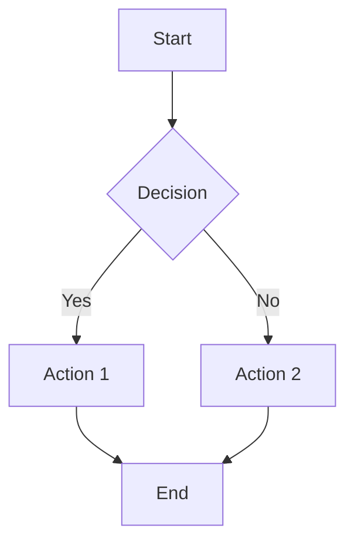

## Standard Markdown

### Headings

Use `#` through `######`. Do not skip levels (e.g., jumping from `##` to `####`). The first heading
in a page body should be `##` because Docusaurus uses the frontmatter `title` as the `h1`.

```md
## Level 2

### Level 3

#### Level 4
```

### Emphasis

```md
_italic_ or _italic_ **bold** or **bold** **_bold italic_** ~~strikethrough~~
```

### Links and Images

```md
[link text](https://example.com) [reference link][ref]

[ref]: https://example.com


```

For images stored in the same docs directory, use relative paths. Docusaurus resolves them at build
time and copies them to the static output.

### Blockquotes

```md
> This is a blockquote.
>
> It can span multiple paragraphs.
```

Nesting is supported:

```md
> Level 1
>
> > Level 2
```

### Lists

Unordered:

```md
- Item
- Item
  - Nested item
  - Another nested item
```

Ordered:

```md
1. First
2. Second
3. Third
   1. Nested
```

### Horizontal Rule

```md
---
```

Three or more hyphens, asterisks, or underscores on a line by themselves.

## Extended Markdown Features (GFM)

### Tables

```md
| Header 1   | Header 2 | Header 3    |
| ---------- | -------- | ----------- |
| Cell 1     | Cell 2   | Cell 3      |
| Left align | Center   | Right align |
| Left align | Center   | Right align |
```

Column alignment with colons:

```md
| Left | Center | Right |
| :--- | :----: | ----: |
| L    |   C    |     R |
```

Tables that need complex cell content (code blocks, lists) will not render correctly in standard
markdown. For those cases, use the custom `.grid-table` CSS class with div-based structure, or use
an MDX component.

### Task Lists

```md
- [x] Completed task
- [ ] Incomplete task
- [ ] Another incomplete task
```

These render as checkboxes. Useful for tracking progress in notes.

### Footnotes

```md
Here is a statement that needs a citation[^1].

[^1]: This is the footnote content. It appears at the bottom of the page.
```

Footnotes support multiple references to the same note and can contain inline formatting, links, and
even code.

### Definition Lists

Some markdown processors support definition lists, but they are not part of standard GFM. In
Docusaurus, use a description list via HTML or a custom component if needed.

### Strikethrough

```md
~~This text is struck through.~~
```

Renders as ~~This text is struck through.~~

## Code Blocks

### Inline Code

`` `backticks` `` for inline code. For template syntax or generics, escape angle brackets outside
code blocks: use `std::vector&lt;int&gt;` in prose.

### Fenced Code Blocks

Specify the language after the opening fence for syntax highlighting:

````md
```python
def hello():
    print("Hello, world")
```

```cpp
#include <iostream>

int main() {
    std::cout << "Hello, world\n";
}
```
````

Supported languages include `python`, `cpp`, `java`, `dart`, `javascript`, `typescript`, `bash`,
`json`, `yaml`, `sql`, and many more.

### Line Highlighting

Docusaurus supports commenting specific lines to highlight them:

````md
```python
def greet(name): # highlight-next-line
    print(f"Hello, {name}")
    return True # highlight-line
```
````

### Custom Title

````md
```python title="my_script.py"
print("hello")
```
````

### Diff Mode

````md
```diff
- old line
+ new line
  unchanged line
```
````

## Docusaurus-Specific MDX Features

### Admonitions

Admonitions are the preferred way to call out important information:

```md
:::note This is a note. :::

:::tip This is a tip. :::

:::info This is informational. :::

:::caution This is a caution. :::

:::danger This is dangerous. :::

:::warning This is a warning. :::
```

Admonitions support optional titles:

```md
:::tip Custom Title Content here. :::
```

They can also be collapsible (Docusaurus 3):

```md
:::note[Click to expand] Hidden content that is revealed on click. :::
```

### Tabs

Tabs require an MDX import:

````mdx
import Tabs from '@theme/Tabs';
import TabItem from '@theme/TabItem';

&lt;Tabs&gt; &lt;TabItem value="python" label="Python"&gt;

```python
print("Python code")
```

&lt;/TabItem&gt; &lt;TabItem value="java" label="Java"&gt;

```java
System.out.println("Java code");
```

&lt;/TabItem&gt; &lt;/Tabs&gt;
````

Tabs support synchronization by `groupId`. Tabs with the same `groupId` across the page will switch
in unison:

```mdx
&lt;Tabs groupId="language"&gt; &lt;TabItem value="python" label="Python"&gt; ... &lt;/TabItem&gt;
&lt;TabItem value="java" label="Java"&gt; ... &lt;/TabItem&gt; &lt;/Tabs&gt;
```

### Math with KaTeX

This site imports KaTeX CSS in `src/css/custom.css`. Use it for mathematical notation.

Inline math:

```md
The quadratic formula is $x = \frac{-b \pm \sqrt{b^2 - 4ac}}{2a}$.
```

Block math:

```md
$$
\int_{-\infty}^{\infty} e^{-x^2} \, dx = \sqrt{\pi}
$$
```

KaTeX supports a wide range of LaTeX commands. Refer to the
[KaTeX supported functions](https://katex.org/docs/supported.html) list for what is available.

### Mermaid Diagrams

Docusaurus supports Mermaid diagrams natively in code blocks:

````md

````

Supported diagram types include `graph`, `sequenceDiagram`, `classDiagram`, `stateDiagram`,
`erDiagram`, `gantt`, `pie`, and `flowchart`.

This site adds a hover zoom effect on Mermaid SVGs via `src/css/custom.css`:

```css
.mermaid svg:hover {
  transform: scale(1.2);
  transform-origin: center;
}
```

### Details / Summary

```mdx
&lt;details&gt; &lt;summary&gt;Click to expand&lt;/summary&gt;

Hidden content here.

&lt;/details&gt;
```

:::warning Do not nest `<details>` inside another `<details>`. This causes rendering issues in
Docusaurus. :::

### MDX Import Statements

Since Docusaurus processes `.md` files as MDX, you can import React components:

```mdx
import CodeBlock from '@theme/CodeBlock';
import Tabs from '@theme/Tabs';
import TabItem from '@theme/TabItem';
import BrowserOnly from '@docusaurus/BrowserOnly';

;
```

Common `@theme` imports:

| Component          | Purpose                               |
| ------------------ | ------------------------------------- |
| `CodeBlock`        | Render a code block from a file path  |
| `Tabs` / `TabItem` | Tabbed content switching              |
| `Details`          | Collapsible sections with React state |
| `Admonition`       | Programmatic admonition rendering     |
| `Head`             | Inject elements into `<head>`         |

Custom components from `@site/src/components/` are also importable:

```mdx
import MyComponent from '@site/src/components/MyComponent';

&lt;MyComponent prop="value" /&gt;
```

## Frontmatter Options

Every page should have frontmatter. Here is the full set of commonly used fields:

```yaml
---
id: my-page # URL path segment (overrides filename)
title: My Page Title # Display title and h1
description: Page summary # Meta description for SEO and search
slug: /custom/url/path # Full URL override
sidebar_position: 1 # Ordering within sidebar (lower = higher)
sidebar_label: Short Name # Override display name in sidebar
date: 2025-05-15T22:45:51Z
tags:
  - tag1
  - tag2
categories:
  - category1
image: /img/thumbnail.png # Social sharing image
hide_table_of_contents: false
toc_max_heading_level: 4 # Max heading level for ToC
draft: true # Hide from production build
---
```

### Slug Behavior

- Without `slug`: derived from file path, e.g., `docs/docs_general-notes/intro.md` becomes
  `/docs/general-notes/intro`.
- With `slug: custom-slug`: becomes `/docs/custom-slug`.
- With `slug: /absolute/path`: becomes `/absolute/path` (bypasses the docs prefix).

### Tags and Categories

Tags and categories populate the blog-like tag pages and aid search. They are flat strings — no
hierarchy. Use lowercase, hyphen-separated values for consistency:

```yaml
tags:
  - c-plus-plus
  - concurrency
  - modern-cpp
```

## Escaping Rules for MDX

Since MDX treats angle brackets as JSX, bare `<` and `>` in prose cause build errors.

### In Prose

Write `std::vector&lt;int&gt;` instead of `std::vector<int>`.

### In Tables

Same rule applies inside table cells:

```md
| Type                   | Description           |
| ---------------------- | --------------------- |
| `std::vector&lt;T&gt;` | Dynamic array         |
| `std::map&lt;K, V&gt;` | Associative container |
```

### In Code Blocks

No escaping needed inside fenced code blocks — the content is treated as raw text.

### Raw HTML Restrictions

Do not use `<p>` tags or other raw HTML block elements. MDX does not allow them. Use markdown or
Docusaurus components instead. Self-closing elements like `<br />` and `` are generally fine.
