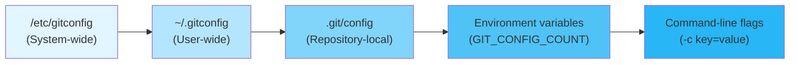
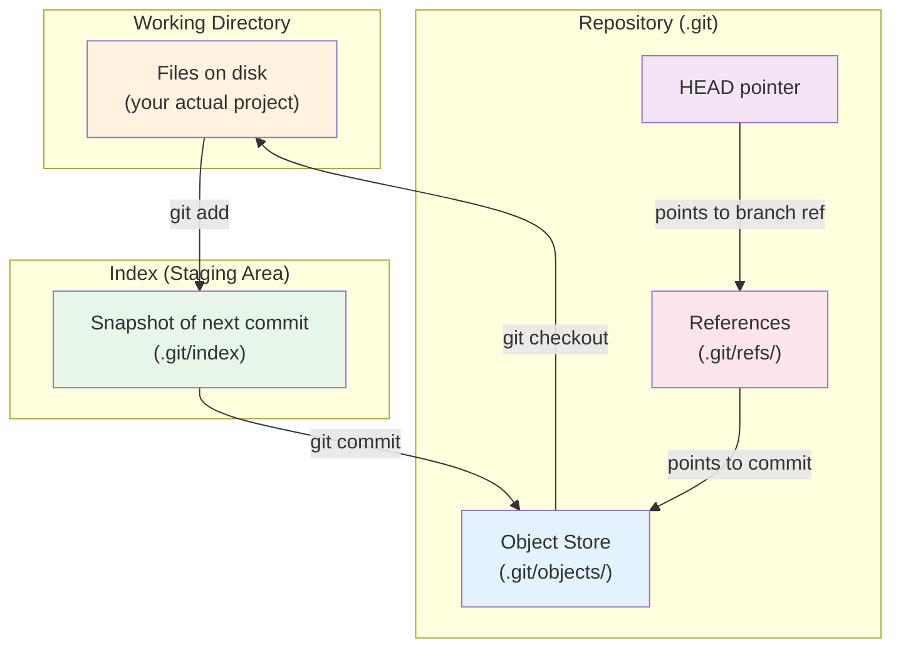

## What is Git

Git is a **distributed version control system** (DVCS) designed to track changes in source code
during software development. Unlike centralized VCS (CVCS) such as Subversion or Perforce — where a
single server holds the authoritative repository — Git treats every clone as a **fully-fledged
repository** with complete history. There is no intrinsic distinction between a "server" and a
"client"; the difference is purely social (who pushes where).

Git was created by Linus Torvalds in 2005 to manage the Linux kernel source tree after the
proprietary license for BitKeeper was revoked. The design constraints of the Linux kernel project
(millions of lines of code, thousands of contributors, high concurrency of merges) fundamentally
shaped Git's architecture.

:::info

This guide assumes Git $\geq 2.40$. Check your version with `git --version`. Many features described
here (e.g., `git switch`, `git restore`, sparse checkout) are unavailable in older versions.

:::

## Design Philosophy

Git's design is the product of several deliberate trade-offs, each motivated by the Linux kernel
workflow:

### 1. Distributed by Default

Every repository clone contains the **complete object database** — every commit, every tree, every
blob. This means:

- **Offline operation**: `git log`, `git diff`, `git blame`, `git show` all work without network
  access. You can commit, branch, and merge entirely offline.
- **Speed**: Local operations read from the filesystem, not the network. `git log` on a cold
  repository scans the local object store.
- **Resilience**: No single point of failure. If the remote server burns down, any clone can
  recreate it entirely with `git push --mirror`.

The cost is **disk space** — a full clone of the Linux kernel is $\sim$5 GB. Mitigations exist
(shallow clones, sparse checkout, partial clone), but the default is to replicate everything.

### 2. Snapshots, Not Diffs

Most VCS (CVS, Subversion, Perforce) store a series of **deltas**: file $v_2$ is expressed as "file
$v_1$ with these lines changed." Git instead stores **full snapshots** of the entire project tree at
each commit. If a file has not changed between two commits, Git does not store it again — it stores
a pointer to the identical blob object.

This design choice has deep implications:

- **Content-addressable storage**: Every object is identified by the SHA-1 hash (or SHA-256, as of
  Git 2.29) of its content. Two identical files at different paths or in different commits produce
  the same blob object. This deduplication is automatic and transparent.
- **Fast branching**: Creating a branch is a $O(1)$ operation — it writes a 41-byte reference file.
  There is no copying of file data.
- **Merge correctness**: Three-way merge compares full tree snapshots, not a chain of deltas, which
  makes it robust against complex history topologies.

The cost is that Git's object store can appear larger than a delta-based store for repositories with
very large files that change frequently. This is why Git added the packfile format (see
[Internals: Packing and Garbage Collection](./06-internals/02-packing-and-garbage-collection.md)) to
compress objects using delta compression between similar objects.

### 3. Strong Integrity Guarantees

Every Git object (blob, tree, commit, tag) is identified by a cryptographic hash of its **content
plus header**. This means:

- **Tamper detection**: If a single byte in any object is modified, its hash changes, and all
  objects referencing it become invalid. `git fsck` can detect this.
- **Deterministic builds**: Given the same source tree and the same commit hash, you are guaranteed
  the same content. This is foundational for reproducible builds and supply-chain security.
- **No ambiguity**: A commit hash uniquely identifies a snapshot of the entire project. Two
  developers referring to `a3f2b1c` are guaranteed to be referring to the same state.

### 4. Nearly Every Operation is Local

With the exception of `git fetch`, `git pull`, `git push`, `git clone`, and `git ls-remote`, every
Git operation works on local data. This was a hard requirement for the Linux kernel workflow, where
contributors on dial-up connections needed to work efficiently.

## How Git Compares to Other VCS

| Feature              | Git                                | Mercurial (Hg)                | Subversion (SVN)          | Perforce (P4)             |
| -------------------- | ---------------------------------- | ----------------------------- | ------------------------- | ------------------------- |
| Architecture         | Distributed                        | Distributed                   | Centralized               | Centralized               |
| Storage model        | Content-addressable snapshots      | Content-addressable snapshots | Delta-based               | Delta-based (server-side) |
| Branching model      | Pointer-based ($O(1)$)             | Bookmark-based ($O(1)$)       | Directory copy ($O(n)$)   | Streams (server-side)     |
| Offline commits      | Full                               | Full                          | No                        | Limited (shelving)        |
| Performance at scale | Excellent (Linux kernel, Chromium) | Good (Facebook used it)       | Degrades with large trees | Excellent with Helix Core |
| Learning curve       | Steep                              | Moderate                      | Shallow                   | Steep                     |
| Binary file handling | Poor (use Git LFS)                 | Poor (use Largefiles)         | Good                      | Good                      |

:::tip

If you are working with large binary assets (images, videos, compiled binaries), consider
[Git LFS](https://git-lfs.github.com/) or [Git Annex](https://git-annex.branchable.com/). Vanilla
Git is optimized for text files.

:::

## Installation and Initial Configuration

### Installation

| Platform              | Method                                                          |
| --------------------- | --------------------------------------------------------------- |
| Linux (Debian/Ubuntu) | `sudo apt install git`                                          |
| Linux (Fedora)        | `sudo dnf install git`                                          |
| macOS                 | `brew install git` (preferred over Xcode's bundled Git)         |
| Windows               | [git-scm.com](https://git-scm.com/) or `winget install Git.Git` |

### Essential Configuration

```bash
# Identity — required for commits
git config --global user.name "Your Name"
git config --global user.email "you@example.com"

# Default branch name (Git 2.28+)
git config --global init.defaultBranch main

# Editor for commit messages and interactive rebase
git config --global core.editor "vim"

# Default pull strategy: rebase instead of merge (see [Remotes](../04-remotes-and-workflows/01-remote-operations.md))
git config --global pull.rebase true

# Credential helper — avoids typing passwords repeatedly
git config --global credential.helper cache --timeout=3600  # 1 hour cache
```

### Configuration Hierarchy

Git reads configuration from three levels, with later sources overriding earlier ones:



Use `git config --list --show-origin` to see all effective values and their sources.

## Core Concepts Overview



These three areas — **working directory**, **index**, and **repository** — form the foundation of
every Git operation. Understanding the transitions between them is essential. See
[The Three Trees](./02-fundamentals/01-the-three-trees.md) for a deep dive.

## Guide Structure

This guide is organized into the following sections:

| Section                                                                     | Content                                                   |
| --------------------------------------------------------------------------- | --------------------------------------------------------- |
| [Fundamentals](./02-fundamentals/01-the-three-trees.md)                     | Three-tree architecture, Git objects, references          |
| [Branching and Merging](./03-branching-and-merging/01-branching.md)         | Branches, merge strategies, rebasing, conflict resolution |
| [Remotes and Workflows](./04-remotes-and-workflows/01-remote-operations.md) | Remote operations, branching strategies, pull requests    |
| [Advanced Topics](./05-advanced-topics/01-reflog.md)                        | Reflog, stash, bisect, submodules, worktrees              |
| [Internals](./06-internals/01-git-directory-structure.md)                   | `.git` directory layout, pack files, hashing algorithm    |
| [Others](./Others/gitea-on-truenas.md)                                      | Self-hosting, commit history removal                      |
