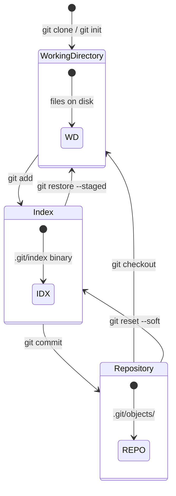
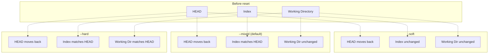
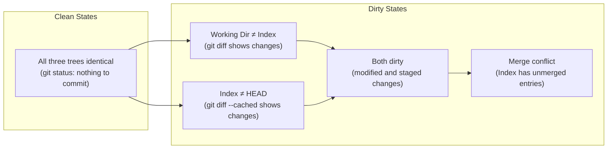

## Overview

Git manipulates three distinct data structures, conventionally called **trees** (though "tree" is overloaded in Git terminology — see [Git Objects](./02-git-objects.md)). These are:

1. **The Working Directory** (also called the **working tree**) — the actual files on disk.
2. **The Index** (also called the **staging area** or **cache**) — a binary file at `.git/index` that encodes a snapshot of what the _next_ commit will contain.
3. **The Repository** (the `.git/` directory) — the committed history, stored as a directed acyclic graph of objects.

Almost every Git command is a transformation between these three trees. Understanding this model makes Git's behavior predictable, even for commands that appear confusing (like `git checkout`, which can mean different things depending on context).



## The Working Directory

The working directory is the directory on your filesystem where you edit files. It is a **checkout** of a particular commit's tree — Git extracts the files referenced by a tree object and writes them to disk.

### Key Properties

- **Mutable**: You can edit files freely. Git does not track changes until you explicitly stage them.
- **Possibly dirty**: The working directory can differ from both the index and the HEAD commit. The difference between the working directory and the index is what `git diff` shows by default.
- **Not versioned**: Deleting a file from the working directory does not delete it from Git history. It merely stages the deletion (if `git add` is run).

### Untracked vs Tracked Files

Git classifies files in the working directory into two categories:

| State         | Definition                                                                         | Shown by                                      |
| ------------- | ---------------------------------------------------------------------------------- | --------------------------------------------- |
| **Tracked**   | File is in the index (either as a new addition or inherited from the last commit). | `git diff` (modified), `git status` (deleted) |
| **Untracked** | File is not in the index and not in `.gitignore`.                                  | `git status` (untracked files)                |

Files listed in `.gitignore` are **ignored** — they are not tracked and `git status` will not mention them.

:::warning

`.gitignore` only affects **untracked** files. If a file is already tracked (committed), adding it to `.gitignore` will have no effect. You must first untrack it with `git rm --cached <file>`.

:::

## The Index

The index is perhaps the most misunderstood part of Git. It is **not** a diff or a list of changes — it is a **complete snapshot** of the next commit's tree. When you run `git add file.txt`, Git does not record "file.txt was modified"; it computes the SHA-1 hash of the file's current content, creates (or reuses) a blob object in `.git/objects/`, and updates the index to point to that blob.

### Internal Structure

The index is stored as a binary file at `.git/index`. Its structure (version 4, as of Git 2.x) contains:

| Section    | Purpose                                                     |
| ---------- | ----------------------------------------------------------- |
| Header     | Signature (`DIRC`), version (2, 3, or 4), number of entries |
| Entries    | Sorted list of `(pathname, stat info, SHA-1, stage)` tuples |
| Extensions | Optional: tree cache, untracked cache, conflict markers     |
| Checksum   | SHA-1 of all preceding content                              |

Each entry contains:

- **Pathname**: Relative to the repository root (e.g., `src/main.c`).
- **Stat information**: File mode (regular file, symlink, executable), size, mtime. Used by Git to skip `stat()` calls during `git status` (the "racy git" problem).
- **SHA-1**: The hash of the blob object this entry points to.
- **Stage**: Used during merge conflicts (stage 1 = base, stage 2 = ours, stage 3 = theirs).

### Why a Separate Staging Area?

The staging area is a deliberate design decision that enables several workflows:

1. **Atomic commits**: You can stage specific hunks of a file (`git add -p`), creating commits that contain logically related changes rather than "everything I changed today."
2. **Review before commit**: `git diff --cached` shows exactly what will be committed, allowing you to verify the snapshot before recording it permanently.
3. **Merge machinery**: The three-way merge algorithm operates on three trees — the base commit, "ours," and "theirs." The index holds the merge result before it is committed.

:::tip

If you find the staging area cumbersome, you can bypass it entirely with `git commit -a` (stages all tracked modified files) or `git commit --amend --no-edit` (adds all staged changes to the previous commit). Some developers prefer `git add -A && git commit` as a single workflow step.

:::

## The Repository

The repository is the `.git/` directory (or a bare repository, which _is_ the `.git/` directory). It contains:

- **The object store** (`.git/objects/`): All blobs, trees, commits, and tags, identified by their SHA-1 hashes.
- **References** (`.git/refs/`): Named pointers to commits — branches, tags, HEAD.
- **Configuration** (`.git/config`): Repository-local settings.
- **Various metadata**: `description`, `info/exclude`, `hooks/`, etc.

The repository is the **authoritative source of truth** for the project's history. The working directory and index are derived from it; they are caches that can be reconstructed at any time.

## State Transitions

Every common Git command can be understood as a transformation between the three trees. This table is the most important reference in this guide:

| Command                       | From → To                                     | Effect                                                                        |
| ----------------------------- | --------------------------------------------- | ----------------------------------------------------------------------------- |
| `git init`                    | — → Repository + Working Directory            | Creates empty repository and working directory                                |
| `git clone`                   | Remote → Repository → Working Directory       | Copies remote repository and checks out default branch                        |
| `git add <file>`              | Working Directory → Index                     | Computes blob hash, updates index entry                                       |
| `git add -p <file>`           | Working Directory → Index (partial)           | Stages selected hunks only                                                    |
| `git rm <file>`               | Working Directory + Index → —                 | Removes from index and working directory                                      |
| `git rm --cached <file>`      | Index → —                                     | Removes from index only (file remains on disk)                                |
| `git commit`                  | Index → Repository                            | Creates commit object pointing to current index tree                          |
| `git status`                  | Reads all three                               | Shows differences between the trees                                           |
| `git diff`                    | Working Directory vs Index                    | Shows unstaged changes                                                        |
| `git diff --cached`           | Index vs HEAD commit                          | Shows staged changes                                                          |
| `git diff HEAD`               | Working Directory vs HEAD                     | Shows all changes (staged + unstaged)                                         |
| `git checkout <branch>`       | Repository → Working Directory + Index        | Updates both to match target commit                                           |
| `git restore <file>`          | Index → Working Directory                     | Discards working directory changes                                            |
| `git restore --staged <file>` | HEAD → Index                                  | Unstages file (reverts index to HEAD version)                                 |
| `git reset HEAD <file>`       | HEAD → Index                                  | Same as `git restore --staged`                                                |
| `git reset --soft HEAD~1`     | HEAD → Repository (move)                      | Moves branch pointer back; index and working directory unchanged              |
| `git reset --mixed HEAD~1`    | HEAD → Repository + Index                     | Moves branch pointer back and resets index                                    |
| `git reset --hard HEAD~1`     | HEAD → Repository + Index + Working Directory | **Destructive**: moves branch back, resets index and discards working changes |
| `git stash`                   | Working Directory + Index → Stash stack       | Temporarily saves changes; resets to HEAD                                     |
| `git stash pop`               | Stash stack → Working Directory + Index       | Restores most recent stash                                                    |
| `git merge <branch>`          | Repository + Working Directory + Index        | Three-way merge into current branch                                           |

### Visualizing `git reset` Variants



:::warning

`git reset --hard` is **destructive** — it discards all uncommitted changes. Before using it, verify with `git status` and `git stash` if you want to preserve your work.

:::

## The "Dirty" State Space

The relationship between the three trees defines the repository's state:



Understanding these states is critical for using Git safely:

- **Clean**: `git status` reports "nothing to commit, working tree clean." Safe to switch branches, pull, or rebase.
- **D1 only**: You have edited files but not staged them. `git checkout` or `git restore` will discard changes. `git stash` will save them.
- **D2 only**: You have staged files but the working directory matches the index. Safe to commit. Switching branches will carry staged changes.
- **D3**: Both staged and unstaged changes exist. Be careful with `git checkout` — it only affects the working directory, not the index.
- **D4**: A merge conflict. The index has entries in multiple stages. You must resolve conflicts (editing files) and `git add` them to mark resolution before committing.

## The Porcelain vs Plumbing Distinction

Git commands are divided into two categories:

| Category      | Purpose                   | Examples                                                                   |
| ------------- | ------------------------- | -------------------------------------------------------------------------- |
| **Porcelain** | User-facing, high-level   | `git add`, `git commit`, `git checkout`, `git merge`                       |
| **Plumbing**  | Low-level building blocks | `git hash-object`, `git update-index`, `git write-tree`, `git commit-tree` |

The three-tree model is implemented entirely by plumbing commands. `git add file.txt` is equivalent to:

```bash
# Compute SHA-1 hash of the file and store it as a blob object
BLOB=$(git hash-object -w file.txt)

# Update the index entry for file.txt to point to this blob
git update-index --add --cacheinfo 100644,$BLOB,file.txt
```

And `git commit -m "message"` is roughly:

```bash
# Write the current index as a tree object
TREE=$(git write-tree)

# Create a commit object with the tree, parent, and message
COMMIT=$(git commit-tree $TREE -p HEAD -m "message")

# Update the current branch to point to the new commit
git update-ref refs/heads/main $COMMIT
```

:::info

Understanding plumbing commands is not necessary for daily use, but it demystifies Git's behavior and enables scripting. When a porcelain command does something unexpected, breaking it down into plumbing steps reveals exactly what happened.

:::
