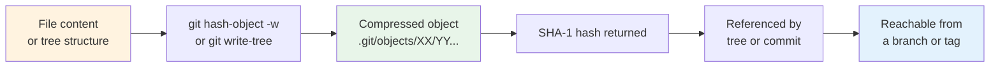
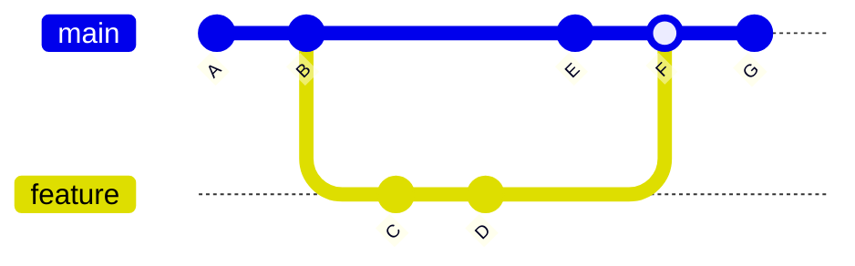

## The Content-Addressable Filesystem

At its core, Git is a **content-addressable filesystem**. It stores data as objects, each identified by the SHA-1 hash of its content. This is not a version control feature — it is the fundamental storage mechanism. Version control is built on top of it.

There are four types of Git objects:

| Type       | Purpose           | Contains                                                               |
| ---------- | ----------------- | ---------------------------------------------------------------------- |
| **blob**   | File content      | Raw file bytes (no filename, no metadata)                              |
| **tree**   | Directory listing | List of `(mode, name, SHA-1)` entries (blobs or subtrees)              |
| **commit** | Snapshot metadata | Tree SHA-1, parent commit(s), author, committer, message, timestamp    |
| **tag**    | Annotated tag     | Tag name, tagger, message, target commit SHA-1, optional GPG signature |

Every object is stored as a compressed file under `.git/objects/`, named by its SHA-1 hash. For example, an object with hash `a3f2b1c...` is stored at `.git/objects/a3/f2b1c...`.

## Object Lifecycle



## Blobs

A blob is the simplest Git object. It stores the **raw content** of a file — nothing more. It does not store the filename, permissions, or any metadata. Two files with identical content at different paths produce the same blob object.

### Creating a Blob

```bash
# Create a blob from a file's content and print its hash
$ echo "Hello, World" | git hash-object -w --stdin
ce013625030ba8dba906f756967f9e9ca394464a

# Verify the object exists
$ git cat-file -t ce013625030ba8dba906f756967f9e9ca394464a
blob

# Print the blob's content
$ git cat-file -p ce013625030ba8dba906f756967f9e9ca394464a
Hello, World
```

### Blob Identity

The hash is computed over the concatenation of the object header and the content:

```
blob <content-length>\0<content>
```

For `"Hello, World\n"` (13 bytes):

```
blob 13\0Hello, World
```

The SHA-1 of this byte sequence is `ce013625030ba8dba906f756967f9e9ca394464a`.

:::info

The trailing newline matters. `echo "Hello, World"` produces `Hello, World\n` (13 bytes), while `echo -n "Hello, World"` produces `Hello, World` (12 bytes). These produce different blob hashes. This is a common source of confusion when scripting Git operations.

:::

### Deduplication

Because blob identity is based purely on content, Git automatically deduplicates identical files across commits and directories:

```bash
# Two files with identical content
$ echo "same content" > a.txt
$ echo "same content" > b.txt

$ git hash-object a.txt
$ git hash-object b.txt
# Both produce the same hash: 7f1bfd55bd05ed5e4e1e8e6f91f639f9700c4c4b

# Only one blob object is stored in .git/objects/
```

This is why Git is efficient at storing projects with many similar files (e.g., renamed files, copied configurations) — identical content is stored exactly once.

## Trees

A tree object represents a **directory listing**. Each entry in a tree is a triple:

| Field     | Description                                                                                                                |
| --------- | -------------------------------------------------------------------------------------------------------------------------- |
| **mode**  | File type and permissions (e.g., `100644` = regular file, `100755` = executable, `040000` = directory, `120000` = symlink) |
| **name**  | Filename or directory name                                                                                                 |
| **SHA-1** | Hash of the blob (for files) or subtree (for directories)                                                                  |

### Tree Structure

Consider this directory:

```
project/
├── README.md
└── src/
    ├── main.c
    └── utils.c
```

Git stores this as two tree objects:

```
Root tree:
  100644 blob <hash-readme>  README.md
  040000 tree <hash-src>     src

src/ subtree:
  100644 blob <hash-main>    main.c
  100644 blob <hash-utils>   utils.c
```

### Inspecting Trees

```bash
# Show the tree object for the current commit
$ git cat-file -p HEAD^{tree}
100644 blob a3f2b1c...    README.md
040000 tree b7e9d4f...    src

# Show the src/ subtree
$ git cat-file -p HEAD:src
100644 blob c1d2e3f...    main.c
100644 blob d4e5f6a...    utils.c
```

### Tree Hashing

Like blobs, trees are hashed with a header:

```
tree <content-length>\0<entries>
```

Each entry is encoded as `<mode> <name>\0<20-byte-sha1>` (binary SHA-1, not hex). The entries are **sorted** lexicographically by name, which is critical for canonical hashing — the same directory must always produce the same tree hash.

:::warning

Git sorts tree entries in a specific order: directories sort as if they have a trailing `/`. This means `src` sorts as `src/`, which places it before `src-file` but after `src0`. This detail matters if you are manually constructing tree objects.

:::

## Commits

A commit object is a **snapshot of the project at a point in time**, plus metadata. It contains:

| Field         | Description                                                                                                          |
| ------------- | -------------------------------------------------------------------------------------------------------------------- |
| **tree**      | SHA-1 of the root tree object (the directory listing)                                                                |
| **parent(s)** | SHA-1 of the parent commit(s). Zero parents = initial commit. Multiple parents = merge commit                        |
| **author**    | Name, email, timestamp of the person who wrote the changes                                                           |
| **committer** | Name, email, timestamp of the person who created the commit (may differ from author during `git rebase` or `git am`) |
| **message**   | Commit message (includes optional trailers like `Co-authored-by:`)                                                   |

### Commit Structure

```bash
$ git cat-file -p HEAD
tree a3f2b1c0d1e2f3a4b5c6d7e8f9a0b1c2d3e4f5a6
parent b7e9d4f5a6b7c8d9e0f1a2b3c4d5e6f7a8b9c0d1
author Wyatt <wyatt@example.com> 1717300000 +0800
committer Wyatt <wyatt@example.com> 1717300000 +0800

Add authentication module

Implemented JWT-based authentication with refresh token rotation.
Closes #42.
```

### The Commit DAG

Commits form a **directed acyclic graph** (DAG). Each commit points to its parent(s), creating a chain of history. A merge commit has two or more parents, creating a diamond-shaped topology.



In this graph:

- `A` is the **root commit** (no parent).
- `B` and `E` are **linear commits** (one parent each).
- `F` is a **merge commit** (parents: `E` and `D`).
- `main` points to `G`, `feature` points to `D`.

### Author vs Committer

The distinction between author and committer is important in workflows where commits are rewritten:

| Scenario                 | Author             | Committer          |
| ------------------------ | ------------------ | ------------------ |
| Normal commit            | Original developer | Original developer |
| `git rebase`             | Original developer | Person who rebased |
| `git am` (apply mailbox) | Patch sender       | Person who applied |
| `git commit --amend`     | Original developer | Person who amended |

This separation preserves attribution while allowing history to be rewritten. `git log` shows both fields.

### Reachability and the Object Graph

An object is **reachable** if there exists a path from at least one reference (branch, tag, HEAD, stash, reflog entry) to that object. Unreachable objects are candidates for garbage collection (see [Packing and Garbage Collection](../06-internals/02-packing-and-garbage-collection.md)).

```bash
# Show all objects reachable from HEAD
$ git rev-list --objects HEAD

# Show unreachable objects
$ git fsck --unreachable
```

## Tags

Git supports two types of tags:

### Lightweight Tags

A lightweight tag is simply a **reference** pointing to a commit. It is stored as a file in `.git/refs/tags/` containing the commit SHA-1. No additional metadata is stored.

```bash
$ git tag v1.0
# Creates .git/refs/tags/v1.0 containing a commit SHA-1
```

### Annotated Tags

An annotated tag is a **full Git object** (type `tag`) that contains:

- The tag name
- The tagger (name, email, timestamp)
- A message
- The SHA-1 of the target commit (or other object)
- An optional GPG signature

```bash
$ git tag -a v1.0 -m "Release version 1.0"

# Inspect the tag object
$ git cat-file -p v1.0
object a3f2b1c0d1e2f3a4b5c6d7e8f9a0b1c2d3e4f5a6
type commit
tag v1.0
tagger Wyatt <wyatt@example.com> 1717300000 +0800

Release version 1.0
```

### When to Use Which

| Use lightweight    | Use annotated                         |
| ------------------ | ------------------------------------- |
| Private bookmarks  | Public releases                       |
| Temporary pointers | Signed releases (GPG)                 |
| Personal workflow  | Semantic versioning milestones        |
|                    | When you need metadata (date, tagger) |

:::tip

Always use annotated tags for public releases. Lightweight tags do not carry the tagger information or message, which makes them unsuitable for audit trails. Use `git tag -a` or configure `tag.forceSignAnnotated` for GPG signing.

:::

## Object Storage Format

### Loose Objects

Newly created objects are stored as individual **loose objects** — compressed (zlib deflate) files under `.git/objects/`. The filename is the first 2 characters of the SHA-1 hash, and the file contains the remaining 38 characters as a suffix:

```
.git/objects/
├── a3/
│   └── f2b1c0d1e2f3a4b5c6d7e8f9a0b1c2d3e4f5a6  (zlib-compressed)
├── b7/
│   └── e9d4f5a6b7c8d9e0f1a2b3c4d5e6f7a8b9c0d1
└── ...
```

### Packfiles

When the number of loose objects exceeds a threshold (configurable via `gc.auto`, default 6700), Git packs them into a **packfile** (`.git/objects/pack/pack-<hash>.pack`) with delta compression. See [Packing and Garbage Collection](../06-internals/02-packing-and-garbage-collection.md) for details.

## Practical Implications

### Content-Addressable Caching

The content-addressable nature of Git objects enables powerful workflows:

```bash
# Check if a file's content has been seen before
$ git hash-object file.txt
# If this hash matches an existing blob, the content is already in the object store

# Find all commits that contain a specific file content
$ git log --all --find-object=<blob-hash>
```

### Integrity Verification

```bash
# Verify the integrity of the entire object database
$ git fsck --full

# This checks:
# 1. Every referenced object exists
# 2. Every object's hash matches its content
# 3. The commit graph is acyclic
# 4. Tree entries point to valid objects
```

### Hash Length Disambiguation

Git allows using a **prefix** of the SHA-1 hash as long as it is unambiguous within the repository:

```bash
# Full hash: a3f2b1c0d1e2f3a4b5c6d7e8f9a0b1c2d3e4f5a6
# Can be abbreviated to the shortest unambiguous prefix
$ git log a3f2b1c  # Works if no other object starts with a3f2b1c
```

The minimum safe prefix length depends on the number of objects in the repository. For a project with $N$ objects, you need approximately $\lceil \log_{16} N \rceil$ hex characters. Git will warn you if a prefix is ambiguous:

```
warning: ambiguous argument 'a3f2': unknown revision or path not in the working tree.
Use '--' to separate paths from revisions, like this:
'git <command> [<revision>...] -- [<file>...]'
```
