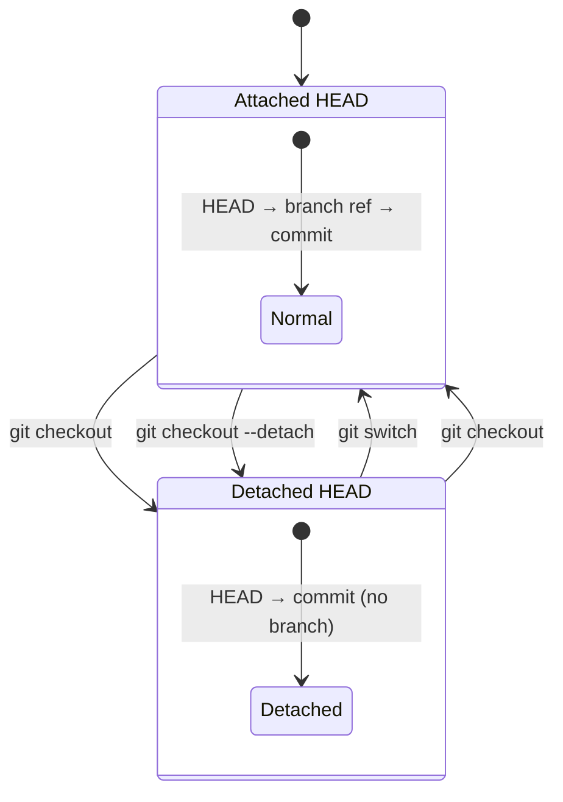
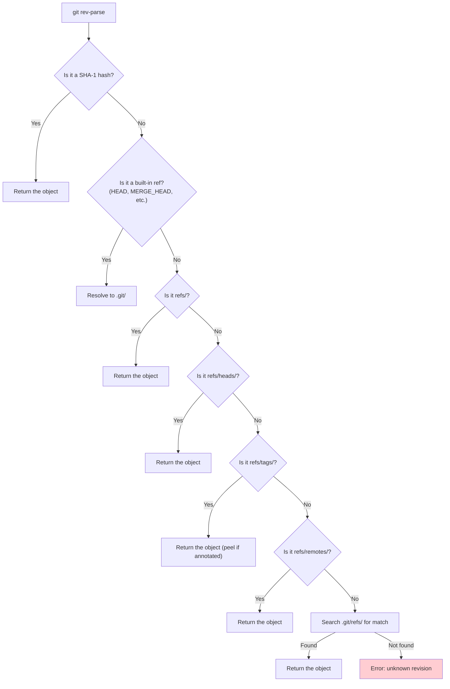

## What Are References

A reference (or "ref") is a named pointer to a Git object — almost always a commit. References are
what make Git's object graph navigable. Without them, commits would exist as isolated objects with
no way to find them (except by hash).

References are stored as plain text files under `.git/refs/`, each containing a 40-character SHA-1
hash:

```
.git/refs/
├── heads/
│   ├── main        # contains: a3f2b1c0d1e2f3a4b5c6d7e8f9a0b1c2d3e4f5a6
│   ├── feature     # contains: b7e9d4f5a6b7c8d9e0f1a2b3c4d5e6f7a8b9c0d1
│   └── hotfix      # contains: c1d2e3f4a5b6c7d8e9f0a1b2c3d4e5f6a7b8c9d0
├── tags/
│   ├── v1.0        # contains: a3f2b1c0d1e2f3a4b5c6d7e8f9a0b1c2d3e4f5a6
│   └── v2.0        # contains: e5f6a7b8c9d0e1f2a3b4c5d6e7f8a9b0c1d2e3f4
└── remotes/
    └── origin/
        ├── main
        └── feature
```

## Reference Types

### Branches

A **branch** is a reference that moves forward as you make commits. It is stored at
`.git/refs/heads/<branch-name>`.

```bash
# Create a branch
$ git branch feature-login
# Equivalent to: echo $(git rev-parse HEAD) > .git/refs/heads/feature-login

# Switch to a branch
$ git switch feature-login
# Equivalent to: echo feature-login > .git/HEAD

# List all branches
$ git branch -a
```

**Design decision**: Branches in Git are extremely lightweight — they are a single file containing
41 bytes. This is why Git encourages branching freely, unlike CVS or SVN where branching involves
copying the entire directory tree. The cost of creating a branch is $O(1)$; the cost of merging
depends on the divergence between branches.

### HEAD

`HEAD` is a special reference that indicates **which branch you are currently on** (or which commit,
in detached HEAD mode). It is stored at `.git/HEAD`:

```
# Attached HEAD (normal state)
ref: refs/heads/main

# Detached HEAD
a3f2b1c0d1e2f3a4b5c6d7e8f9a0b1c2d3e4f5a6
```



### Detached HEAD

When `HEAD` points directly to a commit (rather than a branch reference), you are in **detached
HEAD** state. This means commits you create will not belong to any branch and will eventually be
garbage-collected unless you create a branch pointing to them.

```mermaid
gitGraph
    commit id: "A"
    commit id: "B"
    commit id: "C"
    branch feature
    checkout feature
    commit id: "D"
    checkout main
    checkout C
    commit id: "E"
    commit id: "F"
```

In the graph above, after checking out commit `C` (detached HEAD), commits `E` and `F` are orphaned
— no branch points to them. To preserve them:

```bash
# While in detached HEAD at commit F
$ git branch recover-feature  # Creates a branch pointing to F
```

:::warning

Detached HEAD is not an error state. It is useful for:

- Examining historical commits without creating a branch
- Building a release from a specific tag
- Running `git bisect` (which checks out arbitrary commits)

However, **new work done in detached HEAD is at risk of being lost** if you switch away without
saving the commit hash.

:::

### Tags

Tags are references stored at `.git/refs/tags/<tag-name>`. Unlike branches, tags **do not move**
when new commits are created — they are static pointers. See [Git Objects](./02-git-objects.md) for
the distinction between lightweight and annotated tags.

### Remote References

Remote-tracking references are stored at `.git/refs/remotes/<remote>/<branch>` and represent the
state of branches on a remote repository as of the last `git fetch`. They are updated automatically
by `git fetch` and `git pull`, but **never** by local commits.

```bash
# Show remote-tracking branches
$ git branch -r
  origin/main
  origin/feature

# The difference between origin/main and main is what git push would send
$ git log HEAD..origin/main
# Commits on origin/main that are not on your local main
```

### Special References

| Ref                | Location                | Purpose                                             |
| ------------------ | ----------------------- | --------------------------------------------------- |
| `HEAD`             | `.git/HEAD`             | Current branch/commit                               |
| `MERGE_HEAD`       | `.git/MERGE_HEAD`       | Parent(s) being merged in (during a merge conflict) |
| `CHERRY_PICK_HEAD` | `.git/CHERRY_PICK_HEAD` | Commit being cherry-picked                          |
| `REVERT_HEAD`      | `.git/REVERT_HEAD`      | Commit being reverted                               |
| `FETCH_HEAD`       | `.git/FETCH_HEAD`       | Last fetched refs (from `git fetch`)                |
| `ORIG_HEAD`        | `.git/ORIG_HEAD`        | Previous value of HEAD before a rebase/reset        |
| `REBASE_HEAD`      | `.git/REBASE_HEAD`      | Current commit during interactive rebase            |

These are transient references that exist only during specific operations and are cleaned up
afterward.

## Packed References

When a repository has many branches or tags, Git may **pack** references into a single file
`.git/packed-refs` for performance:

```
# pack-refs with: peeled fully-peeled sorted
a3f2b1c0d1e2f3a4b5c6d7e8f9a0b1c2d3e4f5a6 refs/heads/main
b7e9d4f5a6b7c8d9e0f1a2b3c4d5e6f7a8b9c0d1 refs/heads/feature
e5f6a7b8c9d0e1f2a3b4c5d6e7f8a9b0c1d2e3f4 refs/tags/v2.0
^c1d2e3f4a5b6c7d8e9f0a1b2c3d4e5f6a7b8c9d0
```

The `^` prefix on the tag line indicates the peeled (dereferenced) commit — the commit the annotated
tag points to.

Git checks the loose ref file first, then `packed-refs`. If a ref exists in both places, the loose
ref takes precedence. This allows Git to update a single ref without rewriting the entire
packed-refs file.

```bash
# Manually pack all refs
$ git pack-refs --all
```

## The Refspec

When you `git fetch` or `git push`, Git uses a **refspec** to map remote references to local
references. The general form is:

```
<+?><src>:<dst>
```

| Component | Meaning                                                       |
| --------- | ------------------------------------------------------------- |
| `src`     | The source ref (on the remote for fetch, local for push)      |
| `dst`     | The destination ref (local for fetch, on the remote for push) |
| `+`       | Force update even if not fast-forward                         |
| `:` alone | Delete the ref (push only)                                    |

```bash
# Default fetch refspec for origin
+refs/heads/*:refs/remotes/origin/*

# Fetch a specific branch
$ git fetch origin main:refs/remotes/origin/main

# Push to a remote branch with a different name
$ git push origin feature:feature-login

# Delete a remote branch
$ git push origin :feature-login

# Force push (overwrites remote history)
$ git push origin +main:main
```

:::warning

Force pushing (`git push --force`) rewrites the remote branch's history. If other developers have
based work on the old commits, they will encounter conflicts. Only force push to branches that you
exclusively own (feature branches, personal forks). Never force push `main` in a shared repository.

:::

## The Reflog

The **reflog** (reference log) is a chronological record of every change to `HEAD` and branch
references. It is stored at `.git/logs/HEAD` and `.git/logs/refs/heads/<branch>`.

Every time a branch pointer moves — due to commit, checkout, rebase, reset, merge, or any other
operation — Git records:

```
a3f2b1c0 HEAD@{0}: checkout: moving from feature to main
b7e9d4f5 HEAD@{1}: commit: Add login validation
c1d2e3f4 HEAD@{2}: checkout: moving from main to feature
a3f2b1c0 HEAD@{3}: commit: Initial commit
```

### Reflog as a Safety Net

The reflog is your primary recovery mechanism. Even after `git reset --hard`, `git rebase`, or
`git commit --amend`, the old commits are still in the object store and reachable via the reflog:

```bash
# View the reflog for HEAD
$ git reflog

# View the reflog for a specific branch
$ git reflog show main

# Restore a lost commit
$ git reset --hard HEAD@{3}  # Go back to the state 3 operations ago
```

### Reflog Expiry

Reflog entries expire after 90 days by default (configurable via `gc.reflogExpire`). Expired entries
are pruned by `git gc`. Objects referenced only by expired reflog entries become unreachable and may
be garbage-collected.

```bash
# Change reflog expiry
$ git config gc.reflogExpire 30.days

# Show reflog with dates
$ git reflog --date=iso
```

See [Reflog](../05-advanced-topics/01-reflog.md) for a deeper treatment.

## Symbolic References

A **symbolic reference** (or "symref") is a reference that points to another reference, rather than
to an object. `HEAD` is the canonical example — it points to a branch ref, which in turn points to a
commit.

```bash
# Check if a ref is symbolic
$ git symbolic-ref HEAD
refs/heads/main

# Read the target of a symbolic ref
$ git symbolic-ref HEAD
refs/heads/main
```

When you run `git switch main`, Git updates the symbolic ref `HEAD` to point to `refs/heads/main`.
When you run `git commit`, Git:

1. Creates the commit object
2. Reads `HEAD` to find the current branch (`refs/heads/main`)
3. Updates `refs/heads/main` to point to the new commit

This indirection is what makes branches work — moving a branch pointer is just writing 41 bytes to a
file.

## Reference Resolution Order

When you pass a name to Git (e.g., `main`, `origin/main`, `HEAD~3`), it resolves it through a
defined search order:



This is why you can type `git checkout main` instead of `git checkout refs/heads/main` — Git
searches multiple ref namespaces.
