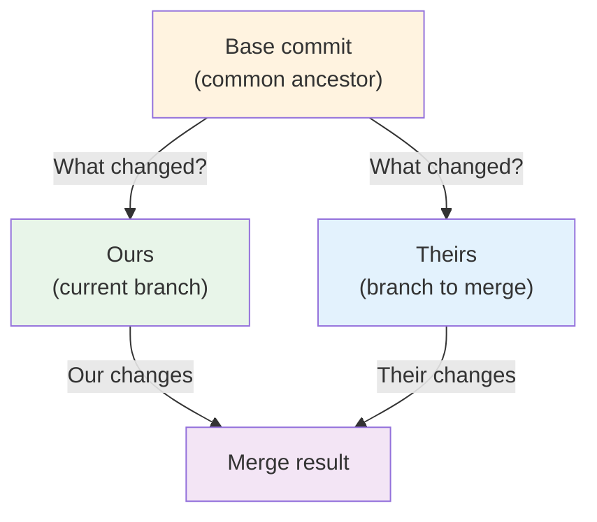
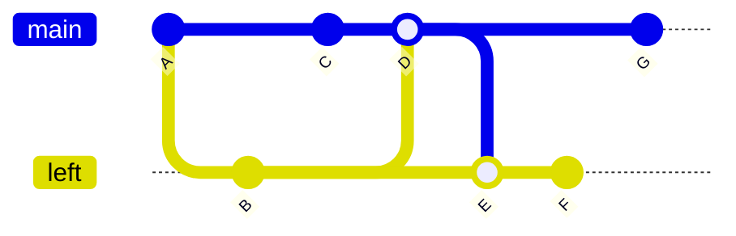
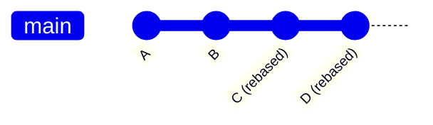

## The Merge Operation

Merging is the process of combining the changes from one branch into another. Git's merge algorithm is one of its most sophisticated features — it can automatically resolve many cases where both branches have modified different files or different parts of the same file.

### What `git merge` Actually Does

A merge takes two (or more) commit pointers — usually branch tips — and produces a new **merge commit** that has both as parents:

```bash
$ git switch main
$ git merge feature-auth
```

```mermaid
gitGraph
    commit id: "C (base)"
    checkout main
    commit id: "D (ours)"
    checkout feature-auth
    commit id: "E (theirs)"
    checkout main
    merge feature-auth id: "F (merge commit)"
```

The merge commit `F` has two parents: `D` (main's previous position) and `E` (feature-auth's tip). Its tree is the result of combining the changes from both branches.

### The Three-Way Merge Algorithm

Git uses the **three-way merge** algorithm, which requires three snapshots:

1. **Base** (common ancestor): The most recent commit that is an ancestor of both branches.
2. **Ours**: The tip of the branch you are merging into (the current branch).
3. **Theirs**: The tip of the branch you are merging from.



The algorithm works **file by file, hunk by hunk**:

| Base | Ours | Theirs | Result       | Explanation                                           |
| ---- | ---- | ------ | ------------ | ----------------------------------------------------- |
| `x`  | `x`  | `x`    | `x`          | No change — keep as-is                                |
| `x`  | `y`  | `x`    | `y`          | Only we changed — take ours                           |
| `x`  | `x`  | `y`    | `y`          | Only they changed — take theirs                       |
| `x`  | `y`  | `z`    | **Conflict** | Both changed differently — manual resolution required |

The critical case is the last row: when both branches modify the same region of the same file. This is a **merge conflict**.

### Finding the Common Ancestor

Git finds the base commit by computing the **lowest common ancestor** (LCA) of the two branch tips in the commit DAG. This is not trivial when the history contains multiple merge bases (criss-cross merges):



In criss-cross situations like this, there are **two** possible merge bases (`B` and `C`). Git's default recursive strategy recursively merges these bases first to create a virtual base, then performs the three-way merge against it.

## Fast-Forward Merges

When the current branch has no new commits since the branch point (i.e., the current branch is an ancestor of the branch being merged), Git can perform a **fast-forward** merge. This simply moves the branch pointer forward — no merge commit is created.

```mermaid
gitGraph
    commit id: "A"
    commit id: "B"
    checkout feature
    commit id: "C"
    commit id: "D"
    checkout main
    merge feature id: "D (fast-forward)"
```

```bash
$ git switch main
$ git merge feature-auth
Updating a3f2b1c..b7e9d4f
Fast-forward
 src/auth.c | 42 +++++++++++++++
 1 file changed, 42 insertions(+)
```

### Disabling Fast-Forward

Sometimes you want a merge commit even when a fast-forward is possible — to preserve a record of the merge event:

```bash
$ git merge --no-ff feature-auth
```


This is common in release workflows where the merge commit serves as a "release marker" that can be easily identified in the history.

:::tip

Use `--no-ff` when merging feature branches into `main` to preserve the branch topology. This makes it easy to see when a feature was merged, revert the entire feature with one command (`git revert -m 1 <merge-commit>`), and understand the project history.

:::

## Merge Strategies

Git supports several merge strategies, selectable with `-s`:

| Strategy                       | Description                                                              | When to Use                                          |
| ------------------------------ | ------------------------------------------------------------------------ | ---------------------------------------------------- |
| `recursive` (default)          | Three-way merge with recursive base resolution                           | General purpose, handles criss-cross merges          |
| `ort` (new default, Git 2.33+) | Modern rewrite of recursive with better conflict markers and performance | General purpose (replacing recursive)                |
| `resolve`                      | Simple three-way merge with one base                                     | Simple histories without criss-cross merges          |
| `octopus`                      | Merge more than two branches at once                                     | Very rare; most merge tools handle only two          |
| `ours`                         | Discard all changes from the other branch, keep ours                     | Rare; usually `git merge -s ours` is an anti-pattern |
| `subtree`                      | Adjust subtree merge paths                                               | When managing subtree merges                         |

### The `ort` Strategy (Git 2.33+)

The `ort` ("Ostensibly Recursive's Twin") strategy is a from-scratch rewrite of the `recursive` strategy. It produces identical merge results but with significant improvements:

- **Performance**: $2\times$–$10\times$ faster on large repositories (Chromium, Android).
- **Conflict markers**: Clearer conflict markers with section headers (`<<<<<<< HEAD`, `=======`, `>>>>>>> branch`).
- **Rename detection**: More accurate rename detection.
- **Memory usage**: Lower peak memory consumption.

```bash
# Explicitly use ort (it's the default in Git 2.34+)
$ git merge -s ort feature-auth
```

## Merge Conflicts

### What a Conflict Looks Like

When both branches modify the same region of a file, Git cannot automatically resolve the conflict. It marks the conflicted regions in the file:

```
<<<<<<< HEAD
function authenticate(user) {
    return verify_password(user.password, user.stored_hash);
}
=======
function authenticate(user) {
    const token = jwt.sign(user);
    return { token, expiresIn: 3600 };
}
>>>>>>> feature-auth
```

The markers are:

| Marker                 | Meaning                                          |
| ---------------------- | ------------------------------------------------ |
| `<<<<<<< HEAD`         | Start of the conflict. Our version begins here.  |
| `=======`              | Separator between our version and their version. |
| `>>>>>>> feature-auth` | End of the conflict. Their version ends here.    |

### Resolving Conflicts

1. **Open the conflicted file** and edit it to contain the correct resolution.
2. **Stage the resolved file** with `git add`.
3. **Complete the merge** with `git commit` (or `git merge --continue` for ongoing merges).

```bash
# See which files are conflicted
$ git status
both modified:   src/auth.c

# Edit the file to resolve the conflict, then:
$ git add src/auth.c
$ git commit
# Or: git merge --continue
```

### Conflict Resolution Strategies

There are several ways to resolve a conflict, depending on the situation:

```bash
# Accept our version entirely
$ git checkout --ours src/auth.c
$ git add src/auth.c

# Accept their version entirely
$ git checkout --theirs src/auth.c
$ git add src/auth.c

# Use a merge tool (GUI)
$ git mergetool
```

### Abort a Merge

If you cannot resolve a conflict, you can abort the merge entirely:

```bash
$ git merge --abort
# Restores HEAD and the index to their pre-merge state
```

### Conflict Scenarios and Solutions

| Scenario                                                   | Recommended Resolution                                            |
| ---------------------------------------------------------- | ----------------------------------------------------------------- |
| One side added a feature, other side refactored            | Manually integrate the feature into the refactored code           |
| Both sides fixed the same bug differently                  | Choose the better fix, verify with tests                          |
| One side deleted a file, other side modified it            | Discuss with the team: delete or keep with modifications          |
| Rename conflicts (file renamed differently on each branch) | Manually resolve: pick one name, apply changes from both sides    |
| Large-scale conflicts (hundreds of files)                  | Consider rebasing instead, or `git merge --abort` and re-evaluate |

:::tip

Configure a visual merge tool for easier conflict resolution:

```bash
$ git config --global merge.tool vscode
$ git config --global mergetool.vscode.cmd 'code --wait $MERGED'
```

Popular options: `meld` (Linux), `vscode` (cross-platform), `kdiff3` (cross-platform), `opendiff` (macOS).

:::

## Merge vs Rebase

The fundamental trade-off between merge and rebase is **history topology**:

```mermaid
gitGraph
    commit id: "A"
    commit id: "B"
    checkout feature
    commit id: "C"
    commit id: "D"
    checkout main
    merge feature id: "E (merge commit)"
```

**Merge**: Preserves the exact history. The DAG shows that `C` and `D` were developed in parallel. Non-linear history.



**Rebase**: Rewrites history to create a linear sequence. The original commits `C` and `D` are replaced by new commits `C'` and `D'` with different hashes.

See [Rebasing](./03-rebasing.md) for the complete treatment.

## Best Practices

### 1. Merge Frequently

The longer you wait between merges, the more likely conflicts become, and the harder they are to resolve. A good practice is to merge `main` into your feature branch daily:

```bash
$ git switch feature-auth
$ git merge main
```

Or use rebase (see [Rebasing](./03-rebasing.md)):

```bash
$ git rebase main
```

### 2. Keep Feature Branches Short-Lived

Long-lived branches accumulate conflicts. A feature branch should ideally exist for no more than a few days. If a feature is large, break it into smaller, independently mergeable pieces.

### 3. Use `--no-ff` for Feature Merges

```bash
$ git merge --no-ff feature-auth
```

This creates a merge commit even when a fast-forward is possible, preserving the branch topology and making the feature's scope visible in the history.

### 4. Test Before Merging

Run your test suite before and after merging:

```bash
$ git merge --no-commit feature-auth  # Stage the merge without committing
$ npm test                            # Run tests
$ git commit                          # Commit only if tests pass
```

### 5. Write Meaningful Merge Messages

```bash
$ git merge --no-ff feature-auth -m "Merge feature/auth: JWT authentication

Implements JWT-based authentication with refresh token rotation.
Includes:
- Login/logout endpoints
- Token validation middleware
- Password hashing with bcrypt

Closes #42."
```
