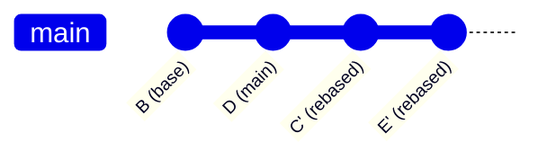
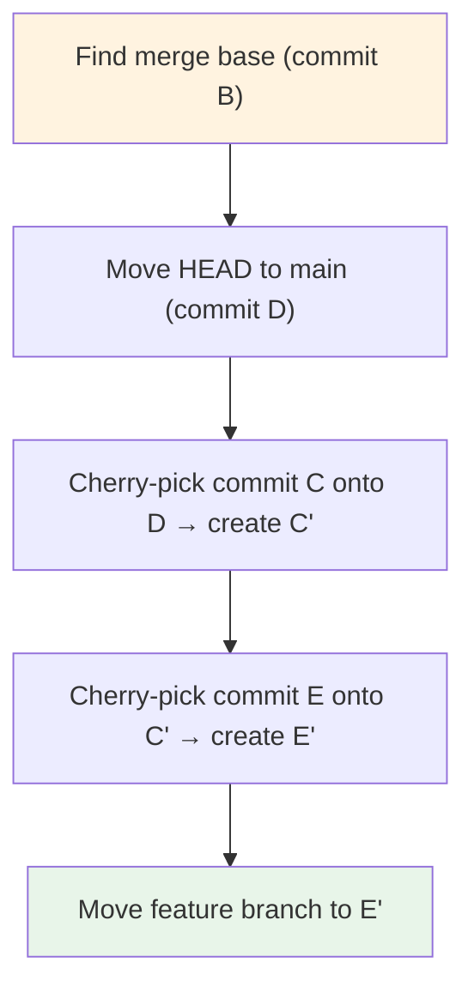
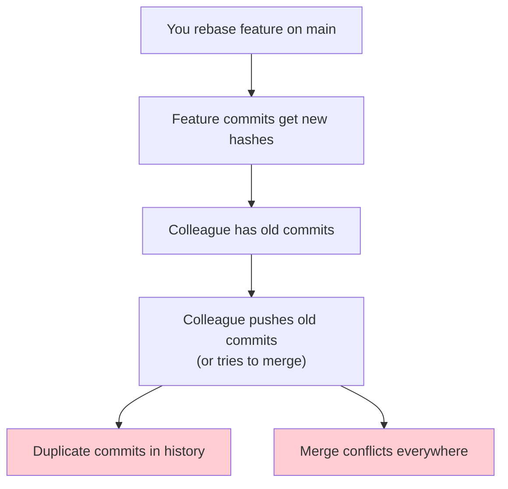

## What is Rebasing

Rebasing is the process of **replaying** a series of commits onto a new base commit. Unlike merging, which creates a new commit with two parents, rebasing rewrites history by creating new commit objects with the same changes but different parent pointers (and therefore different SHA-1 hashes).

### Merge vs Rebase: Visual Comparison

**Before** (both branches diverge from commit `B`):

```mermaid
gitGraph
    commit id: "B (base)"
    checkout main
    commit id: "D (main)"
    checkout feature
    commit id: "C"
    commit id: "E"
```

**After `git merge feature`** (non-linear history):

```mermaid
gitGraph
    commit id: "B (base)"
    checkout main
    commit id: "D (main)"
    checkout feature
    commit id: "C"
    commit id: "E"
    checkout main
    merge feature id: "F (merge)"
```

**After `git rebase main`** (linear history):



Note that `C'` and `E'` are **new commits** with different hashes than `C` and `E`. The original commits still exist in the object store (reachable via the reflog) but are no longer on any branch.

## How Rebase Works Internally

The `git rebase` operation performs the following steps:

1. **Find the merge base**: Identify the common ancestor between the current branch and the target branch.
2. **Save the current state**: Record the current HEAD and branch reference.
3. **Move HEAD** to the target branch (e.g., `main`).
4. **Replay each commit**: For each commit in the original branch (from oldest to newest), apply its diff onto the new base, creating a new commit object.
5. **Move the branch pointer** to the tip of the new commit chain.



Each "replayed" commit is effectively a cherry-pick: Git computes the diff introduced by the original commit and applies it to the new base. This means:

- If a commit's changes cleanly apply to the new base, the rebase succeeds.
- If there are conflicts, Git pauses and asks you to resolve them before continuing.

## Basic Rebase

```bash
# Rebase the current branch onto main
$ git switch feature-auth
$ git rebase main

# Rebase a specific branch onto main (without switching)
$ git rebase main feature-auth
```

### Abort a Rebase

If conflicts become unresolvable:

```bash
$ git rebase --abort
# Restores the branch to its original state before the rebase
```

### Continue a Rebase

After resolving a conflict:

```bash
$ git add <resolved-file>
$ git rebase --continue
```

### Skip a Commit

If a commit's changes are no longer relevant (e.g., a fix that was already applied upstream):

```bash
$ git rebase --skip
```

## Interactive Rebase

Interactive rebase (`git rebase -i`) is one of Git's most powerful features. It allows you to **rewrite** the commits on your branch: reorder, edit, squash, split, or drop commits.

```bash
# Rebase the last 5 commits interactively
$ git rebase -i HEAD~5

# Rebase all commits since diverging from main
$ git rebase -i main
```

### The Todo List

Interactive rebase opens an editor with a todo list:

```
pick a3f2b1c Add user model
pick b7e9d4f Add authentication middleware
pick c1d2e3f Add login endpoint
pick d4e5f6a Fix auth token expiry
pick e5f6a7b Update tests

# Rebase a3f2b1c..e5f6a7b onto a3f2b1c (5 commands)
#
# Commands:
# p, pick <commit> = use commit
# r, reword <commit> = use commit, but edit the commit message
# e, edit <commit> = use commit, but stop for amending
# s, squash <commit> = use commit, but meld into previous commit
# f, fixup <commit> = like "squash", but discard this commit's log message
# x, exec <command> = run command (the rest of the line) using shell
# b, break = stop here (continue rebase later with 'git rebase --continue')
# d, drop <commit> = remove commit
# l, label <label> = label current HEAD with a name
# t, reset <label> = reset HEAD to a label
# m, merge [-C <commit> | -c <commit>] <label> [# <oneline>]
```

### Rebase Actions

#### `pick` — Use Commit As-Is

The default action. The commit is replayed onto the new base without modification.

#### `reword` — Change the Commit Message

Stops at the commit and opens an editor with the current message for editing. The commit's content (diff) is unchanged.

#### `edit` — Pause for Amending

Stops at the commit, allowing you to:

- Modify files (`git add` / `git restore`)
- Amend the commit (`git commit --amend`)
- Split the commit into multiple commits
- Continue the rebase (`git rebase --continue`)

```bash
# Example workflow:
# 1. Rebase opens with "edit c1d2e3f Add login endpoint"
# 2. Git stops at this commit
$ git log --oneline -3  # Verify you're at the right point
# 3. Make changes
$ echo "new code" >> src/login.c
$ git add src/login.c
$ git commit --amend  # Amend the commit
# 4. Continue
$ git rebase --continue
```

#### `squash` — Combine with Previous Commit

Melds the commit into the previous commit, combining their diffs and prompting for a new combined message:

```
# This is a combination of 2 commits.
# This is the 1st commit message:
Add authentication middleware

# This is the commit message #2:
Add login endpoint

# TODO: Edit the combined message
```

:::tip

Use `squash` when you have a series of "WIP" commits that should be combined into a single logical commit before merging. This keeps the history clean and meaningful.

:::

#### `fixup` — Squash Without Editing

Like `squash`, but discards the commit message of the squashed commit. The combined commit retains only the message of the previous commit. This is faster when you have many small commits to fold in:

```
pick a3f2b1c Add user model
fixup b7e9d4f oops forgot migration
fixup c1d2e3f fix typo in model
pick d4e5f6a Add authentication middleware
```

After this rebase, the history will show:

```
a3f2b1c Add user model         (includes the migration fix and typo fix)
d4e5f6a' Add authentication middleware
```

#### `drop` — Remove a Commit

Removes the commit entirely. Its changes are discarded.

#### `exec` — Run a Shell Command

Runs an arbitrary shell command at that point in the rebase. Useful for automated formatting or test validation:

```
pick a3f2b1c Add user model
exec cargo fmt
pick b7e9d4f Add authentication middleware
exec cargo test
```

### Autosquash: A Powerful Workflow

The `--autosquash` flag automatically moves `fixup!` and `squash!` commits to their correct positions in the todo list:

```bash
# Commit a fix with a fixup! prefix
$ git commit --fixup=a3f2b1c

# Later, interactive rebase with autosquash
$ git rebase -i --autosquash HEAD~5
```

Git automatically arranges:

```
pick a3f2b1c Add user model
fixup f7g8h9i fixup! Add user model
pick b7e9d4f Add authentication middleware
```

This is the recommended workflow for "commit early, fixup later":

```bash
# Configure to always autosquash
$ git config --global rebase.autoSquash true

# During development, commit freely (even messy commits)
$ git commit -m "WIP: add login"
$ git commit -m "fix typo"
$ git commit -m "add tests"

# Before merging, rebase interactively to clean up
$ git rebase -i main
```

## Rebase vs Merge: The Debate

This is one of the most contentious debates in the Git community. Here is a balanced analysis:

### Arguments for Rebase

| Argument             | Explanation                                                      |
| -------------------- | ---------------------------------------------------------------- |
| **Clean history**    | Linear history is easier to read with `git log` and `git bisect` |
| **No merge commits** | Eliminates noisy "Merge branch X into Y" commits                 |
| **Easier bisect**    | `git bisect` works more reliably on linear history               |
| **Smaller diff**     | Pull requests contain only feature changes, not merge noise      |

### Arguments for Merge

| Argument              | Explanation                                                          |
| --------------------- | -------------------------------------------------------------------- |
| **Preserves truth**   | The history reflects what actually happened, not a sanitized version |
| **Safe**              | Merge never rewrites history; rebase does                            |
| **Preserves context** | Merge commits show when and why features were integrated             |
| **Easier to revert**  | `git revert -m 1 <merge>` undoes an entire feature in one operation  |

### The Golden Rule of Rebasing

> **Never rebase commits that have been pushed to a public branch.**

Rebasing rewrites commit hashes. If other developers have based work on the original commits, they will encounter diverged histories, duplicated commits, and confusing conflicts.



### Recommended Approach

For most teams, a hybrid approach works best:

- **Feature branches**: Rebase onto `main` frequently to stay up-to-date. Before merging, do a final rebase.
- **Merging into `main`**: Use `git merge --no-ff` to create a merge commit (preserves branch topology).
- **Shared branches** (`develop`, `staging`): Never rebase. Always merge.
- **Personal branches**: Rebase freely — no one else is affected.

```bash
# Typical workflow for a feature branch
$ git switch -c feature-auth main
# ... make commits ...
$ git fetch origin
$ git rebase origin/main              # Stay up-to-date
# ... more commits ...
$ git rebase origin/main              # Final rebase before PR
$ git push origin feature-auth        # Push to remote
# Create pull request (merge --no-ff into main)
```

## Common Rebase Pitfalls

### 1. Rebase Conflicts in Long Chains

When rebasing a long chain of commits, conflicts can compound — resolving a conflict in an early commit may cause conflicts in later commits that previously applied cleanly.

**Mitigation**: Rebase frequently (small, incremental rebases) rather than rebasing large chains.

### 2. Accidentally Squashing Important Commits

```bash
# In the interactive rebase todo list:
pick a3f2b1c Important feature
squash b7e9d4f Bug fix that MUST be separate
```

**Mitigation**: Review the todo list carefully before proceeding. Use `git rebase --edit-todo` to modify the list during a paused rebase.

### 3. Losing Commits During Rebase

If you `git rebase --abort` after a conflict, your original commits are preserved. If you `git rebase --continue` with a conflict still unresolved, Git will skip that commit's changes.

**Mitigation**: Always check `git status` after resolving conflicts. Ensure all files are staged before `--continue`.

### 4. The "Empty Commit" Problem

If a commit's changes are already present in the target branch (e.g., you cherry-picked a commit earlier), rebasing will create an empty commit. Git usually drops these automatically, but you can control this behavior:

```bash
# Keep empty commits
$ git rebase --keep-empty main

# Drop empty commits (default)
$ git rebase main
```
