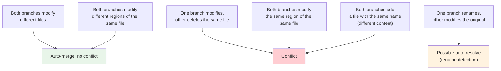

## Understanding Conflicts

A merge conflict occurs when Git's three-way merge algorithm cannot automatically reconcile changes from two branches. This happens when **both branches modify the same region of the same file** in different ways.

### When Conflicts Occur



### Conflict Markers

When a conflict occurs, Git writes **conflict markers** into the file:

```c
<<<<<<< HEAD
int authenticate(User *user) {
    return verify_password(user->password, user->stored_hash);
}
=======
int authenticate(User *user) {
    Token *token = jwt_sign(user, SECRET_KEY);
    return token->value;
}
>>>>>>> feature-auth
```

| Marker                 | Meaning                                          |
| ---------------------- | ------------------------------------------------ |
| `<<<<<<< HEAD`         | Start of conflict region. Our version begins.    |
| `=======`              | Separator between our version and their version. |
| `>>>>>>> feature-auth` | End of conflict region. Their version ends.      |

The text after `>>>>>>>` identifies the branch being merged.

### Multi-Base Conflicts

When both sides of a conflict have been merged from a common branch, Git may produce **multi-base conflict markers** (with the `ort` merge strategy):

```
<<<<<<< HEAD
our version
||||||| merged common ancestors
base version
=======
their version
>>>>>>> feature-auth
```

The middle section (between `|||||||` and `=======`) shows the common ancestor's version, which can be helpful for understanding what changed on both sides.

## Resolution Strategies

### Strategy 1: Manual Resolution

The most common approach — edit the file to produce the correct result:

```c
// After manual resolution:
int authenticate(User *user) {
    // Verify password first (from HEAD)
    if (!verify_password(user->password, user->stored_hash))
        return NULL;

    // Generate JWT token (from feature-auth)
    Token *token = jwt_sign(user, SECRET_KEY);
    return token->value;
}
```

Then stage and commit:

```bash
$ git add src/auth.c
$ git commit  # (or git merge --continue / git rebase --continue)
```

:::tip

Use `git diff` to review your resolution before staging:

```bash
$ git diff src/auth.c
# Shows the conflict markers and your edits
```

:::

### Strategy 2: Accept One Side Entirely

```bash
# Accept our version (discard their changes)
$ git checkout --ours src/auth.c
$ git add src/auth.c

# Accept their version (discard our changes)
$ git checkout --theirs src/auth.c
$ git add src/auth.c
```

This is useful when:

- The other side made a more comprehensive change that supersedes ours.
- Our change was a mistake that should be discarded.
- The conflict is in a generated file where one version is clearly correct.

### Strategy 3: Combine Both Changes

Use `git merge-file` to perform a three-way merge on individual files:

```bash
# Create temporary files
$ git show HEAD:src/auth.c > /tmp/ours.c
$ git show feature-auth:src/auth.c > /tmp/theirs.c
$ git show MERGE_HEAD:src/auth.c > /tmp/base.c  # or the merge base

# Three-way merge with a custom base
$ git merge-file /tmp/ours.c /tmp/base.c /tmp/theirs.c
```

### Strategy 4: Visual Merge Tools

```bash
# Configure a merge tool
$ git config --global merge.tool meld      # Linux
$ git config --global merge.tool vscode    # Cross-platform
$ git config --global merge.tool kdiff3    # Cross-platform

# Launch the merge tool
$ git mergetool
```

Most visual merge tools present a three-pane view:

```
┌─────────────┬─────────────┬─────────────┐
│   Base      │   Ours      │   Theirs    │
│             │             │             │
│  (ancestor) │  (HEAD)     │  (branch)   │
│             │             │             │
│             ├─────────────┤             │
│             │   Result    │             │
│             │  (output)   │             │
└─────────────┴─────────────┴─────────────┘
```

### Strategy 5: Custom Merge Drivers

For file types where Git's line-by-line merge is inappropriate (e.g., JSON, XML, lockfiles), you can define custom merge drivers in `.gitattributes`:

```bash
# .gitattributes
package-lock.json merge=ours
*.json merge=json
```

```bash
# .git/config
[merge "ours"]
    name = Keep ours
    driver = true  # Always succeed, keeping our version

[merge "json"]
    name = JSON merge
    driver = jq -s '.[0] * .[1]' %O %A %B
```

This is particularly useful for:

- **Lockfiles** (`package-lock.json`, `yarn.lock`): Always keep one version to avoid corruption.
- **Generated files**: Use the generating tool to produce the correct output.

## Handling Specific Conflict Types

### Modify/Delete Conflicts

When one branch modifies a file and the other deletes it:

```
CONFLICT (modify/delete): src/legacy.c deleted in feature-auth and modified in HEAD.
Version HEAD of src/legacy.c left in tree.
```

Resolution options:

```bash
# Keep the modified file
$ git add src/legacy.c

# Accept the deletion
$ git rm src/legacy.c
```

### Rename Conflicts

Git detects renames using a heuristic (file similarity threshold, default 50%). When one branch renames a file and the other modifies it, Git may or may not auto-resolve:

```bash
# Increase rename detection threshold
$ git merge -X find-renames=80 feature-auth
```

### Binary File Conflicts

Git cannot show conflict markers for binary files (images, PDFs, compiled objects). It marks the entire file as conflicted:

```bash
# Choose one version
$ git checkout --ours image.png
$ git add image.png

# Or use a specialized tool (e.g., ImageMagick for images)
$ git config merge.img.driver "compare %O %A %B %A"
```

### Add/Add Conflicts

When both branches create a new file with the same path but different content:

```
CONFLICT (add/add): Merge conflict in src/utils.c
```

Resolution: Edit the file to combine both versions, or choose one.

## Conflict Prevention

### 1. Reduce Overlap

The best way to avoid conflicts is to minimize the chance of two developers modifying the same file simultaneously:

- **Small, focused branches**: Each branch should modify a small number of files.
- **Clear ownership**: Assign files or modules to specific developers.
- **Frequent integration**: Merge or rebase onto `main` daily.

### 2. Communicate

- Use pull requests to signal intent before merging.
- Announce large-scale changes in team channels.
- Coordinate refactoring efforts.

### 3. Use `git rerere`

**Repeatedly Reuse Recorded Resolution** (`rerere`) remembers how you resolved a conflict and automatically applies the same resolution if the same conflict recurs:

```bash
# Enable rerere
$ git config --global rerere.enabled true
$ git config --global rerere.autoupdate true
```

This is particularly useful for:

- Long-lived release branches that receive frequent merges from `main`.
- Repeated rebase operations where the same conflicts recur.
- Cherry-picking the same commit to multiple branches.

## Abort and Recovery

### Abort a Merge

```bash
$ git merge --abort
# Restores HEAD and index to pre-merge state
# Works during merge conflicts
```

### Abort a Rebase

```bash
$ git rebase --abort
# Restores the branch to its pre-rebase state
# Works during rebase conflicts
```

### Recover from a Bad Resolution

If you committed a merge with an incorrect resolution:

```bash
# Undo the merge commit (keeps changes as unstaged)
$ git reset HEAD~1

# Re-do the merge
$ git merge feature-auth
```

Or, if the merge has already been pushed:

```bash
# Revert the merge (creates a new commit that undoes it)
$ git revert -m 1 <merge-commit-hash>
```
