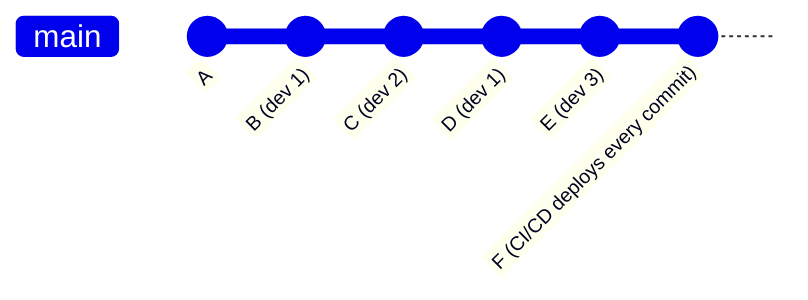
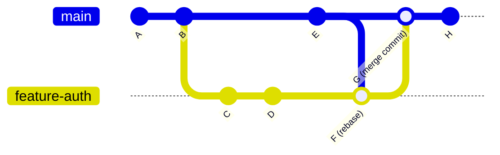
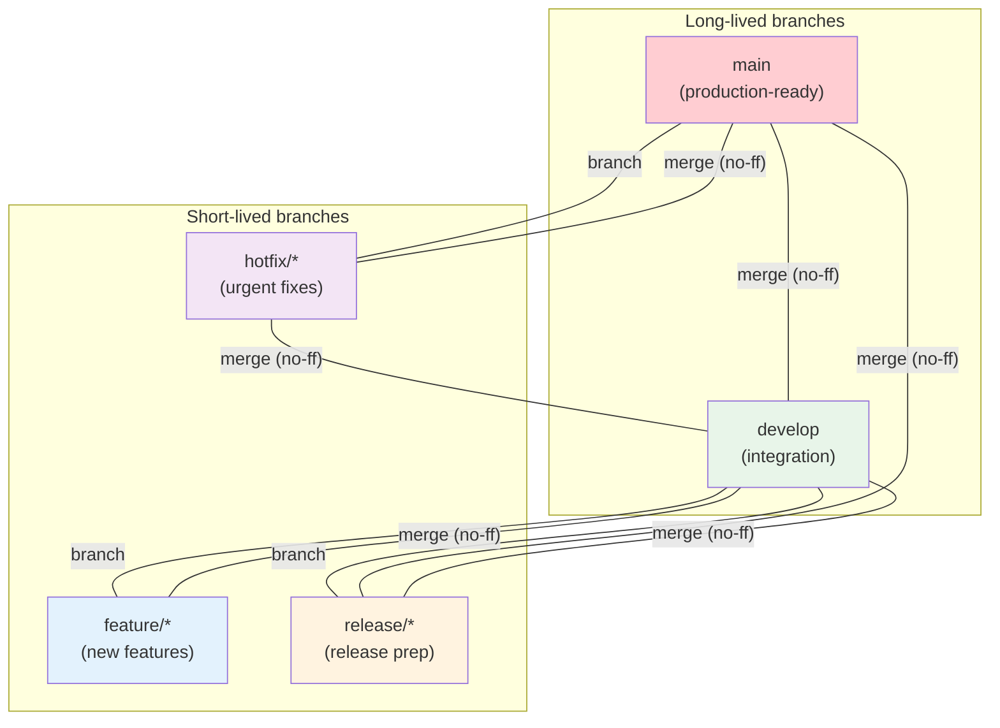
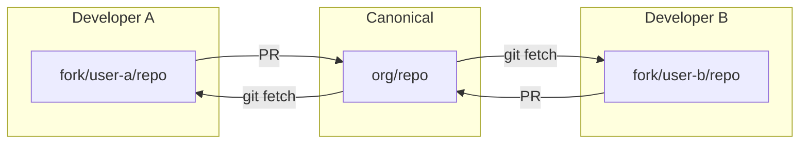

## Choosing a Branching Strategy

A branching strategy defines **when to create branches, how long they live, how they integrate, and who can modify which branches**. There is no universal "best" strategy — the right choice depends on team size, release cadence, deployment model, and risk tolerance.

This guide covers the most widely-used strategies, their trade-offs, and when to use each.

## Trunk-Based Development

### Concept

All developers commit to a single shared branch (typically `main`). Feature branches are extremely short-lived (hours, not days). Integration is continuous — every commit is potentially deployable.



### Rules

1. **No long-lived branches** — feature branches exist for at most a few hours.
2. **Continuous integration** — every commit triggers automated tests.
3. **Feature flags** — incomplete features are hidden behind configuration toggles.
4. **Small batches** — commits should be small and independently reviewable.
5. **Pre-merge validation** — automated tests must pass before merging.

### Advantages

| Advantage               | Explanation                                                     |
| ----------------------- | --------------------------------------------------------------- |
| **No merge hell**       | No large, complex merges — changes are integrated incrementally |
| **Fast feedback**       | CI runs on every commit, catching issues immediately            |
| **Easy rollback**       | `git revert <hash>` undoes a single commit                      |
| **Simplified workflow** | No branch management overhead                                   |

### Disadvantages

| Disadvantage                    | Mitigation                                  |
| ------------------------------- | ------------------------------------------- |
| Requires robust CI/CD           | Invest in automated testing before adopting |
| Feature flags add complexity    | Use a feature flag management system        |
| Large teams may have contention | Use short-lived feature branches (< 1 day)  |
| Requires disciplined commits    | Commit frequently, keep commits atomic      |

### When to Use

- Teams with strong CI/CD pipelines
- Continuous deployment environments
- Small to medium teams (up to $\sim$15 developers)
- SaaS products with frequent releases

:::info

Google, Meta, and many other large tech companies use trunk-based development internally. It scales well with proper tooling (Bazel for builds, automated canary deployments).

:::

## GitHub Flow

### Concept

A simplified version of trunk-based development with one long-lived branch (`main`) and short-lived feature branches. Every change requires a pull request.



### Workflow

1. Create a branch from `main`: `git switch -c feature-auth`
2. Make commits and push: `git push -u origin feature-auth`
3. Open a pull request
4. Discuss, review, and iterate
5. Merge into `main` (with `--no-ff`)
6. Deploy `main`

### Rules

1. `main` is always deployable.
2. All changes go through pull requests.
3. PRs should be small (ideally < 400 lines changed).
4. Tests must pass before merging.
5. Deploy `main` after every merge (or on a schedule).

### When to Use

- Open-source projects
- Teams without formal release cycles
- Projects with continuous deployment
- Any team using GitHub

## Git Flow

### Concept

A structured branching model with two long-lived branches (`main` and `develop`) and several short-lived branch types. Originally published by Vincent Driessen in 2010.



### Branch Types

| Branch      | Purpose                 | Lifetime  | Created From | Merges Into        |
| ----------- | ----------------------- | --------- | ------------ | ------------------ |
| `main`      | Production releases     | Permanent | —            | —                  |
| `develop`   | Integration branch      | Permanent | `main`       | —                  |
| `feature/*` | Feature development     | Short     | `develop`    | `develop`          |
| `release/*` | Release preparation     | Short     | `develop`    | `main` + `develop` |
| `hotfix/*`  | Urgent production fixes | Short     | `main`       | `main` + `develop` |

### Workflow

```bash
# Start a feature
$ git switch -c feature/login develop
# ... work ...
$ git switch develop
$ git merge --no-ff feature/login
$ git branch -d feature/login

# Start a release
$ git switch -c release/1.0 develop
# ... bump versions, fix bugs, update docs ...
$ git switch main
$ git merge --no-ff release/1.0
$ git tag -a v1.0
$ git switch develop
$ git merge --no-ff release/1.0
$ git branch -d release/1.0

# Start a hotfix
$ git switch -c hotfix/fix-crash main
# ... fix the bug ...
$ git switch main
$ git merge --no-ff hotfix/fix-crash
$ git tag -a v1.0.1
$ git switch develop
$ git merge --no-ff hotfix/fix-crash
$ git branch -d hotfix/fix-crash
```

### Advantages

| Advantage                | Explanation                                                |
| ------------------------ | ---------------------------------------------------------- |
| **Clear separation**     | Features, releases, and hotfixes have distinct branches    |
| **Parallel development** | Multiple features can be developed simultaneously          |
| **Release isolation**    | Release branches allow bug fixes without blocking features |
| **Well-documented**      | Widely understood, many tools support it natively          |

### Disadvantages

| Disadvantage            | Explanation                                                                    |
| ----------------------- | ------------------------------------------------------------------------------ |
| **Complex**             | 5 branch types, strict merge rules — high cognitive overhead                   |
| **Merge-heavy**         | Every feature requires a merge commit into `develop`, then another into `main` |
| **Slow feedback**       | Features can live in isolation for weeks, accumulating conflicts               |
| **Not ideal for CI/CD** | The `develop` branch creates an unnecessary integration step                   |

### When to Use

- Projects with scheduled releases (e.g., monthly, quarterly)
- Teams that need to support multiple production versions simultaneously
- Projects where releases require significant preparation (version bumps, changelogs, release notes)
- Regulated environments where release audit trails are required

:::warning

Git Flow is often overused. For most modern software projects, GitHub Flow or trunk-based development is simpler and more effective. Only adopt Git Flow if you genuinely need release branches and hotfix workflows.

:::

## Forking Workflow

### Concept

Each developer has their own fork (personal copy) of the canonical repository. Changes flow from fork → pull request → canonical repository.



### When to Use

- Open-source projects (contributors don't have write access)
- External contractors
- Organizations where write access is restricted

## Comparison Matrix

| Criterion               | Trunk-Based   | GitHub Flow          | Git Flow                    |
| ----------------------- | ------------- | -------------------- | --------------------------- |
| **Complexity**          | Low           | Low                  | High                        |
| **Branch count**        | 1 + ephemeral | 1 + short-lived      | 2 + multiple types          |
| **Merge frequency**     | Continuous    | Per PR               | Per feature/release         |
| **CI/CD requirement**   | Mandatory     | Strongly recommended | Recommended                 |
| **Release model**       | Continuous    | On-demand            | Scheduled                   |
| **Hotfix handling**     | `git revert`  | Branch from `main`   | Dedicated `hotfix/*` branch |
| **History cleanliness** | Linear        | Mostly linear        | Complex merge graph         |
| **Team size**           | Small–medium  | Any                  | Any                         |
| **Learning curve**      | Low           | Low                  | Moderate                    |

## Commit Message Conventions

Regardless of branching strategy, consistent commit messages are essential. The most widely-used convention is **Conventional Commits**:

```
<type>(<scope>): <description>

[optional body]

[optional footer(s)]
```

| Type       | Purpose                                    |
| ---------- | ------------------------------------------ |
| `feat`     | New feature                                |
| `fix`      | Bug fix                                    |
| `docs`     | Documentation changes                      |
| `style`    | Formatting, whitespace (no code change)    |
| `refactor` | Code restructuring without behavior change |
| `perf`     | Performance improvement                    |
| `test`     | Adding or updating tests                   |
| `chore`    | Build process, dependencies, tooling       |
| `ci`       | CI/CD configuration changes                |

Examples:

```
feat(auth): add JWT token refresh

Implement automatic token refresh when the access token expires.
Uses a refresh token stored in an HTTP-only cookie.

Closes #42.

fix(parser): handle empty input without crashing

The parser would segfault on empty input because it dereferenced
a null pointer after strtok returned NULL. Added a null check.

BREAKING CHANGE: The parser now returns an error instead of silently
accepting empty input. Update callers to handle ParseError.
```

:::tip

Configure `commitlint` with `@commitlint/config-conventional` to enforce commit message conventions in CI:

```bash
npm install --save-dev @commitlint/cli @commitlint/config-conventional
echo "export default { extends: ['@commitlint/config-conventional'] };" > commitlint.config.js
```

:::
