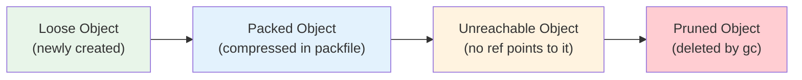
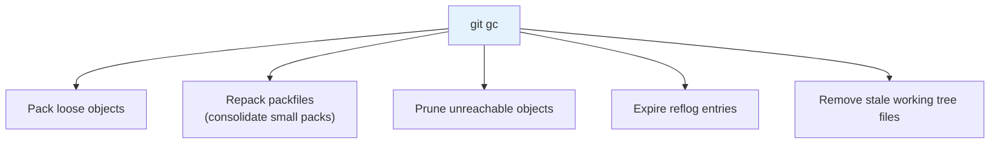

## The Object Lifecycle

Git objects go through three phases:



### 1. Loose Objects

When you run `git add` or `git commit`, Git creates objects as individual zlib-compressed files under `.git/objects/`. These are called **loose objects**.

**Performance characteristics**:

- Creation: $O(1)$ — just write a file.
- Lookup: $O(\log n)$ — filesystem directory lookup (first 2 hex chars) + file read.
- Storage: Each object is compressed independently. No delta compression between objects.
- Overhead: Each file consumes a filesystem inode and a disk block (minimum 4 KB, even for small objects).

For small repositories (few hundred objects), loose objects are fine. For large repositories (millions of objects), the overhead becomes significant.

### 2. Packed Objects

When the number of loose objects exceeds `gc.auto` (default: 6700), Git automatically packs them into a **packfile**. You can also trigger packing manually:

```bash
# Pack all loose objects
$ git gc

# Pack aggressively (slower but better compression)
$ git gc --aggressive
```

#### Packfile Format

A packfile (`.git/objects/pack/pack-<hash>.pack`) contains:

| Section | Description                                                 |
| ------- | ----------------------------------------------------------- |
| Header  | Magic bytes (`PACK`), version (2), number of objects        |
| Objects | Compressed objects (delta-compressed against other objects) |
| Trailer | SHA-1 checksum of all preceding content                     |

#### Delta Compression

Packfiles use **delta compression** to store similar objects efficiently. Instead of storing each object in full, Git stores one base object and then stores subsequent objects as deltas (differences from the base):

```
Base object: commit A (full content, 200 bytes)
Delta 1: commit B → "change author email" (20 bytes)
Delta 2: commit C → "change commit message" (15 bytes)
```

For the Linux kernel repository, delta compression reduces the packfile size by approximately $10\times$ compared to loose objects.

#### Delta Chain Depth

Delta objects can themselves be delta-compressed against other delta objects, forming a **delta chain**:

```
commit A (base)
  └── commit B (delta of A)
        └── commit C (delta of B)
              └── commit D (delta of C)
```

Deep delta chains (depth > 50) degrade performance because Git must decompress the entire chain to access the final object. `git gc` limits delta depth to `pack.depth` (default: 50).

#### The Index File

Each packfile has a corresponding `.idx` (index) file that enables $O(1)$ lookup of objects by SHA-1 hash. The index is a sorted binary table:

| Offset | SHA-1      | CRC32     |
| ------ | ---------- | --------- |
| 0      | a3f2b1c... | 0x8a7f... |
| 234    | b7e9d4f... | 0x3c2d... |
| 567    | c1d2e3f... | 0x9e1b... |

### 3. Unreachable and Pruned Objects

An object is **unreachable** if no reference (branch, tag, HEAD, reflog, stash) points to it — directly or transitively (through a tree or commit chain).

```bash
# Find unreachable objects
$ git fsck --unreachable

# Prune unreachable objects older than 2 weeks (default)
$ git gc

# Prune ALL unreachable objects immediately
$ git gc --prune=now
```

:::warning

`git gc --prune=now` is **permanent**. After pruning, unreachable objects cannot be recovered. Always verify with `git fsck --unreachable` first, and ensure you don't need the objects (e.g., they're not needed for a reflog-based recovery).

:::

## Garbage Collection

`git gc` performs several maintenance tasks:



### gc Configuration

| Setting               | Default       | Meaning                                       |
| --------------------- | ------------- | --------------------------------------------- |
| `gc.auto`             | 6700          | Number of loose objects that triggers auto-gc |
| `gc.autoPackLimit`    | 50            | Number of packfiles that triggers auto-repack |
| `gc.pruneExpire`      | `2.weeks.ago` | Age threshold for pruning unreachable objects |
| `gc.reflogExpire`     | `90.days.ago` | Age threshold for expiring reflog entries     |
| `gc.aggressiveWindow` | 250           | Window size for aggressive delta compression  |
| `gc.pack.depth`       | 50            | Maximum delta chain depth                     |

### When GC Runs Automatically

Git runs auto-gc in certain operations (`git commit`, `git merge`, `git rebase`) when the loose object count exceeds `gc.auto`. You can disable auto-gc:

```bash
$ git config gc.auto 0
```

### Aggressive GC

`git gc --aggressive` uses more CPU and memory to achieve better compression:

- Larger delta window (250 objects instead of 10).
- Deeper delta chains (up to 250 instead of 50).
- Recompresses all objects (not just loose ones).

Use `--aggressive` for repositories that are archived or infrequently updated. For active repositories, the overhead is usually not worth the marginal compression improvement.

## Maintenance

### `git maintenance`

Git 2.31+ includes a built-in maintenance system:

```bash
# Register for background maintenance (cron/systemd)
$ git maintenance start

# Run maintenance now
$ git maintenance run

# Run specific tasks
$ git maintenance run --task=loose-objects
$ git maintenance run --task=pack-refs
$ git maintenance run --task=gc
```

### Recommended Maintenance Schedule

| Task            | Frequency                 | Command                   |
| --------------- | ------------------------- | ------------------------- |
| Loose objects   | Daily (auto)              | `git gc` (auto-triggered) |
| Reflog expiry   | 90 days                   | `git reflog expire --all` |
| Full GC         | Monthly                   | `git gc --aggressive`     |
| Integrity check | After suspicious behavior | `git fsck --full`         |

## Performance Implications

### Large Repositories

For repositories with millions of objects (Linux kernel, Chromium, Android), packfile management is critical:

- **Pack too large**: Slower clone times, higher memory usage.
- **Too many packs**: Slower object lookup (Git checks each pack's index).
- **Fragmentation**: Frequent commits to many files create many small packs.

### Optimization Strategies

```bash
# Repack with a single large packfile
$ git repack -a -d

# Use bitmap index for faster clone/fetch
$ git repack -a -d --write-bitmap-index

# Prune old packs after repacking
$ git prune-packed
```

The **bitmap index** is a Bloom-filter-like structure that enables $O(1)$ reachability queries, significantly speeding up `git clone`, `git fetch`, and `git gc` on large repositories.
