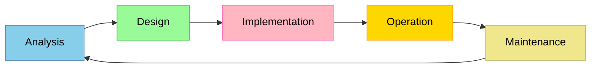

## Planning and System Installation

### Computer System

A computer system is a broad term given to a system including the hardware, software, users, and the
immediate environment.

### System Life Cycle

System life cycle is the stages carried out when developing a new system.



### Organizational Issue Planning Aims to Eliminate

Planning a system is an attempt to anticipate potential organizational issues:

- Problems arise in guiding organization and business strategies
- Insufficient stakeholder and end-user communication
- Problems with ownership of the system
- The lack of attention in required training

### Feasibility Report

Feasibility reports are the results of a feasibility study where the evaluation and analysis of a
project and its potential is carried out based on:

- Technical feasibility
  - Determining whether current technology sufficient to implement the system
  - **Example**: A school wishes to deploy a fingerprint-based attendance system. The technical
    feasibility study checks whether the school's existing network infrastructure can support
    biometric scanners and whether compatible SDKs exist for the chosen platform.
- Economic feasibility
  - Determining the cost effectiveness and whether funding is sufficient
  - **Example**: A hospital considers a new patient records system costing $500,000. The economic
    feasibility study calculates that the system will save $200,000 per year in reduced paperwork
    and fewer errors, yielding a payback period of 2.5 years, which is within the hospital's
    acceptable threshold.
- Legal feasibility
  - Analyzing potential conflicts between the proposed system and the legal system
  - **Example**: An e-commerce company planning to store customer data must evaluate whether the
    proposed database architecture complies with GDPR or other applicable data protection
    legislation, including requirements for data minimisation and the right to erasure.
- Operational feasibility
  - Determining whether the maintenance stage of the system is feasible
  - **Example**: A small accounting firm is considering an enterprise resource planning (ERP)
    system. The operational feasibility study reveals the firm has no in-house IT staff and would
    need to hire a system administrator, making long-term maintenance impractical without
    outsourcing.
- Schedule feasibility
  - Estimating the time required to create the system
  - **Example**: A university needs a new online exam registration portal ready before the next
    academic year in 8 months. The schedule feasibility study breaks the project into milestones and
    determines whether each can be completed in time.

### Requirements Elicitation

Requirements elicitation is the process of gathering system requirements from stakeholders. Common
techniques include:

| Technique       | Description                                                              | Advantages                                          | Disadvantages                                         |
| --------------- | ------------------------------------------------------------------------ | --------------------------------------------------- | ----------------------------------------------------- |
| Interviews      | One-on-one structured or semi-structured conversations with stakeholders | In-depth responses; follow-up questions possible    | Time-consuming; may be influenced by interviewer bias |
| Questionnaires  | Written sets of questions distributed to a large audience                | Reaches many stakeholders quickly; easy to quantify | Low response rate; limited depth of answers           |
| Observation     | Watching users perform their current tasks in their normal environment   | Reveals actual workflow issues users may not report | Users may change behaviour when observed              |
| Document review | Analysing existing documentation, reports, forms, and procedures         | Non-intrusive; provides objective baseline          | Documents may be outdated or incomplete               |

### Stakeholder Analysis Matrix

A stakeholder analysis matrix helps prioritise stakeholder engagement during planning:

| Stakeholder       | Interest level | Influence level | Engagement strategy                |
| ----------------- | -------------- | --------------- | ---------------------------------- |
| Senior management | High           | High            | Manage closely; regular briefings  |
| End users         | High           | Medium          | Keep informed; involve in testing  |
| IT department     | Medium         | High            | Consult early; involve in design   |
| External vendors  | Low            | Medium          | Monitor; contractual communication |
| Regulators        | Low            | High            | Satisfy through compliance checks  |

### Gantt Chart Concepts

A Gantt chart is a horizontal bar chart used in schedule feasibility to visualise project tasks,
their durations, and dependencies.

```
Task                  Week 1  Week 2  Week 3  Week 4  Week 5  Week 6  Week 7  Week 8
Requirements gathering |=====|
System design          |=======|
Development                    |===========================|
Testing                                                  |=====|
Training                                                          |=====|
Deployment                                                        |=====|
```

- Each bar represents a task's duration
- Dependencies are shown where one task must finish before the next begins
- Critical path: the longest sequence of dependent tasks that determines the minimum project
  duration

## Change Management

Change management is the process of changing the state of the organization, involving shifting
employee positions, replacing hardware equipment, etc.

### Incompatibility

System may include critical points built with legacy systems, where the new system is unable to
replace by change, examples being:

- Lack of ability to translate legacy format to new format.
- User needs, where a lack of user training or the new system does not completely replace the
  functionality of the old system.

### Resistance to Change

Employees often resist new systems. Understanding the reasons allows management to plan mitigation
strategies:

| Reason for resistance | Description                                              | Mitigation strategy                                                                                     |
| --------------------- | -------------------------------------------------------- | ------------------------------------------------------------------------------------------------------- |
| Fear of redundancy    | Employees worry the new system will eliminate their jobs | Communicate that the system augments rather than replaces roles; retrain staff for new responsibilities |
| Loss of competence    | Staff feel their existing skills will become irrelevant  | Provide comprehensive training programmes before deployment                                             |
| Disruption of routine | The new system changes familiar workflows                | Use phased changeover to allow gradual adaptation                                                       |
| Lack of involvement   | Staff feel the change was imposed without consultation   | Involve employees early in requirements elicitation and pilot testing                                   |
| Past failures         | Previous system changes failed, reducing trust           | Acknowledge past issues, explain what will be different, and provide evidence of thorough planning      |

### Lewin's Change Management Model

Lewin's model describes change in three stages:

1. **Unfreeze**: Prepare the organisation for change. Communicate the reasons for change, create a
   sense of urgency, and reduce resistance. For example, presenting data showing that the current
   manual inventory system causes a 15% error rate that costs the company $300,000 annually.
2. **Change (Transition)**: Implement the new system. This involves training, support, and gradual
   adoption. For example, rolling out the new inventory system department by department over three
   months with on-site support staff.
3. **Refreeze**: Stabilise the organisation around the new system. Update procedures, embed new
   workflows into standard operations, and remove access to the old system.

### Training Needs Analysis

Before deploying a new system, a training needs analysis (TNA) identifies the gap between current
skills and required skills:

| Step                        | Action                                               | Example                                                                                                  |
| --------------------------- | ---------------------------------------------------- | -------------------------------------------------------------------------------------------------------- |
| 1. Identify required skills | Determine what the new system demands of users       | The new ERP system requires users to navigate a multi-module dashboard and generate reports              |
| 2. Assess current skills    | Evaluate existing competency levels                  | A survey reveals 60% of staff rate their spreadsheet skills as basic; 10% have used an ERP system before |
| 3. Identify the gap         | Compare required skills against current skills       | Most staff need training on dashboard navigation, report generation, and data entry workflows            |
| 4. Design training          | Plan training methods, duration, and materials       | Three-day instructor-led workshop, followed by online refresher modules and a help desk                  |
| 5. Evaluate training        | Measure whether the training achieved its objectives | Post-training assessment shows 85% of staff can independently perform core tasks                         |

### Impact Assessment Framework

An impact assessment evaluates how the new system will affect the organisation across multiple
dimensions:

| Dimension   | Questions to ask                                  | Example findings                                                                   |
| ----------- | ------------------------------------------------- | ---------------------------------------------------------------------------------- |
| Operational | How will daily workflows change?                  | Order processing time will decrease from 45 minutes to 12 minutes per order        |
| Financial   | What are the costs and expected savings?          | Initial cost of $150,000; annual savings of $60,000 from reduced manual processing |
| Technical   | What infrastructure changes are needed?           | Server upgrade required; new network switches for increased bandwidth              |
| Human       | How will staff roles and responsibilities change? | Three data entry clerks will be retrained as system analysts                       |
| Legal       | Are there compliance implications?                | New data retention policies must align with GDPR Article 5                         |

### Worked Example: Planning a System Migration for a School Library

**Scenario**: A school library currently uses a standalone desktop application (LibrarySoft v3)
running on Windows 7 to manage book loans. The school has decided to migrate to a cloud-based
library management system (CloudLib).

**Step 1 -- Stakeholder analysis**:

- Librarian (primary user): needs full catalogue management and loan tracking
- Students (secondary users): need search and reservation capabilities
- IT department: needs to manage the migration and ongoing access
- School administration: needs cost justification and data security assurance

**Step 2 -- Feasibility assessment**:

- Technical: CloudLib is browser-based; existing school computers support modern browsers. Internet
  bandwidth must be verified.
- Economic: CloudLib costs $2,000 per year. Savings from eliminating the Windows 7 maintenance
  contract ($1,500/year) and reduced librarian overtime ($3,000/year) justify the investment.
- Operational: The librarian has used only LibrarySoft for 10 years and will require training.
- Schedule: Migration planned over the 6-week summer break.

**Step 3 -- Data migration plan**:

1. Export all bibliographic records from LibrarySoft in MARC21 format
2. Transform MARC21 records to CloudLib's JSON import format using a custom Python script
3. Validate that all 12,500 records were successfully imported with correct metadata
4. Perform a parallel run for the first 2 weeks of term

**Step 4 -- Change management**:

- Unfreeze: Present the librarian with a report showing that CloudLib will allow students to search
  the catalogue from home, reducing in-person queries by an estimated 40%.
- Change: Enrol the librarian in a 2-day CloudLib training course. Assign an IT staff member as
  on-site support for the first month.
- Refreeze: Decommission the LibrarySoft workstation after the parallel run confirms data integrity.

**Step 5 -- Risk register**:

| Risk                        | Likelihood | Impact | Mitigation                                                                        |
| --------------------------- | ---------- | ------ | --------------------------------------------------------------------------------- |
| Data loss during migration  | Low        | High   | Full backup of LibrarySoft database before migration; validation of record counts |
| Librarian unable to adapt   | Medium     | Medium | Extended training period; option to revert during parallel run                    |
| Internet outage during term | Low        | High   | Maintain a cached local copy of the catalogue for offline browsing                |

## Business Merger

Business merger is the process of combining business entities, where all subsystems are required to
be compatible.

### System Integration

System integration is the process of combining subsystems, where there are four strategies:

| Strategy                     | Description                                                                 | Advantages                                                        | Disadvantages                                                                              |
| ---------------------------- | --------------------------------------------------------------------------- | ----------------------------------------------------------------- | ------------------------------------------------------------------------------------------ |
| Operate in redundancy        | Run both systems simultaneously; each system handles its original user base | Lowest short-term risk; no data migration required immediately    | High ongoing cost; data inconsistency between systems; duplicated effort                   |
| Replace both with new system | Build an entirely new system that replaces both legacy systems              | Opportunity to modernise; eliminates legacy technical debt        | Highest cost and risk; longest timeline; requires full requirements gathering from scratch |
| Best-of-breed selection      | Select the strongest subsystems from each company and combine them          | Leverages existing strengths; may produce the best overall system | Complex integration between heterogeneous subsystems; compatibility issues                 |
| Single system adoption       | Choose one company's system and terminate the other                         | Simplest integration; lower cost than replacement                 | Users of the discontinued system must adapt; some functionality may be lost                |

**Real-world examples**:

- **Operate in redundancy**: After a bank merger, both banks' mobile banking apps continue to
  operate independently for 12 months while a unified platform is developed.
- **Replace both with new system**: Two airlines merge and commission a completely new reservation
  system rather than adapting either existing system.
- **Best-of-breed selection**: A merged pharmaceutical company adopts Company A's inventory
  management system (rated superior) and Company B's HR payroll system (rated superior), connecting
  them via middleware.
- **Single system adoption**: An acquired startup's customer data is migrated entirely into the
  acquiring company's CRM, and the startup's CRM is decommissioned.

### Data Migration Challenges

Data migration during a merger presents several challenges:

- **Schema mapping**: The two companies may use different database schemas. For example, Company A
  stores addresses as a single text field, while Company B stores them as separate street, city, and
  postal code fields. A mapping table must define how each field in the source schema corresponds to
  a field in the target schema.
- **Data cleansing**: Legacy data often contains duplicates, outdated records, and inconsistencies.
  For example, the same customer might appear in both databases with slightly different spellings of
  their name. Deduplication rules and data standardisation must be applied before migration.
- **Data integrity**: Referential integrity must be maintained. For example, every order record must
  reference a valid customer record. If customer records are merged or deleted, all dependent
  records must be updated accordingly.

### ETL Pipeline

The ETL (Extract-Transform-Load) pipeline is the standard approach for data migration:

1. **Extract**: Pull data from source systems. This may involve reading from databases, flat files,
   APIs, or a combination. Extraction must preserve data types and handle character encoding (e.g.,
   UTF-8 vs. ASCII).
2. **Transform**: Apply business rules to convert data into the target format. This includes:
   - Format conversion (e.g., date from `DD/MM/YYYY` to `YYYY-MM-DD`)
   - Data type casting (e.g., string `"42"` to integer `42`)
   - Lookups and enrichment (e.g., mapping legacy department codes to new codes)
   - Filtering out records that do not meet quality thresholds
3. **Load**: Insert the transformed data into the target system. Loading may be done in batches to
   manage performance and allow rollback if errors are detected.
4. **Validate**: After loading, run validation queries to confirm record counts match, referential
   integrity is maintained, and no data was truncated or corrupted.

### System Deployment Models

#### On-premises Software

On-premises software are software operate locally on an organization's own infrastructure.

#### SaaS

Software-as-a-Service (SaaS) are software provided by cloud service, where data and the software is
operating in a remote datacenter.

### Installation Process

The installation process is the deployment of a new system on a premise.

#### Changeover Method

When replacing the system currently used, strategies employed should consider the cost overhead and
risk, common strategies include:

- Parallel changeover
  - Operating both systems in redundancy for the duration of replacement.
  - Advantages:
    - Functionality of both systems can be compared live
    - If the new system fails, the system can be reverted to the legacy system
  - Disadvantages:
    - Large cost overhead
    - Extra workload
- Direct changeover
  - The old system is decommissioned and the new system takes over immediately on a specified date.
  - Advantages: lowest cost; no duplicated effort
  - Disadvantages: highest risk; no fallback if the new system fails
- Pilot testing
  - The new system is deployed to a single department or location as a trial before
    organisation-wide rollout.
  - Advantages: limits the impact of any failures; provides real user feedback
  - Disadvantages: pilot users may have a different experience from the broader organisation
- Phased
  - The new system is introduced module by module or department by department over a planned
    schedule.
  - Advantages: manageable risk at each stage; allows learning from earlier phases
  - Disadvantages: requires careful planning of dependencies between phases; temporary interfaces
    may be needed between old and new modules

## Testing

### Types of Testing

- **Functional testing**
  - Testing conducted to validate the functionality of target commands.
  - **Example**: Testing that the "checkout" button on an e-commerce site correctly deducts the item
    from inventory, charges the correct amount, and sends a confirmation email.
- **Data testing**
  - Testing conducted to validate the output of target commands by sets of normal, abnormal and
    boundary data.
  - Normal data refers to a input sequence set within the expected domain
  - Abnormal data refers to a input sequence set outside of the expected domain
  - Boundary data refers to a input sequence set at the boundary of the normal data set
- **Alpha testing**
  - Testing carried out by the development team within the company and deployed on premises.
  - Simulates a real operating environment but is conducted by developers, not end-users.
- **Beta testing**
  - Testing carried out by assigned end-users outside of the company and deployed on user premises.
  - Users report bugs and usability issues they encounter in their real environment.
- **Dry-run testing**
  - Testing carried out by examining the source code and determining the functionality by predicting
    the output.
- **Unit testing**
  - Testing on individual subsystems modularly.
  - **Example**: Testing a single function `calculateTax(price, rate)` in isolation to verify it
    returns the correct tax amount for various inputs.
- **User acceptance testing (UAT)**
  - Testing for user satisfaction based on its usability and accessibility.
  - Conducted by the client or end-users to determine whether the system meets their business
    requirements before final sign-off.
- **Debugging**
  - Testing during development to discover malfunctions.

### Comparison: Alpha vs Beta vs UAT

| Criterion     | Alpha testing                      | Beta testing                    | User acceptance testing               |
| ------------- | ---------------------------------- | ------------------------------- | ------------------------------------- |
| Who tests     | Development team                   | Selected end-users              | Client or business stakeholders       |
| Where         | Developer environment (in-house)   | User environment (external)     | User environment (external)           |
| Goal          | Identify bugs before wider release | Test in real-world conditions   | Confirm business requirements are met |
| System state  | Not yet feature-complete           | Feature-complete                | Feature-complete and stable           |
| Bug reporting | Internal bug tracker               | Feedback forms or issue tracker | Formal sign-off process               |

### Test Case Design Techniques

#### Equivalence Partitioning

Equivalence partitioning divides input data into partitions (classes) where the system is expected
to behave the same for all values within a partition. One representative value from each partition
is tested.

**Example**: A registration form requires the user's age to be between 18 and 65.

| Partition       | Range           | Test value |
| --------------- | --------------- | ---------- |
| Valid           | 18 to 65        | 30         |
| Invalid (below) | less than 18    | 15         |
| Invalid (above) | greater than 65 | 70         |

Only three test cases are needed to cover all equivalence classes.

#### Boundary Value Analysis

Boundary value analysis tests values at the edges of equivalence partitions, because errors
frequently occur at boundaries.

Using the same age example (valid range 18 to 65):

| Boundary               | Test value | Expected result |
| ---------------------- | ---------- | --------------- |
| Just below lower bound | 17         | Rejected        |
| Lower bound            | 18         | Accepted        |
| Just above lower bound | 19         | Accepted        |
| Just below upper bound | 64         | Accepted        |
| Upper bound            | 65         | Accepted        |
| Just above upper bound | 66         | Rejected        |

### Stubs and Drivers

When testing individual modules that depend on other modules not yet developed, stubs and drivers
are used as substitutes:

| Component | Definition                                      | When used         | Example                                                                                                                                                                         |
| --------- | ----------------------------------------------- | ----------------- | ------------------------------------------------------------------------------------------------------------------------------------------------------------------------------- |
| Stub      | A dummy module that simulates a called module   | Bottom-up testing | A stub that returns a fixed value when the `getCustomerName()` function is called, allowing the calling module to be tested without the real database module                    |
| Driver    | A dummy module that calls a module being tested | Top-down testing  | A driver that passes a series of test inputs to the `calculateDiscount()` function and displays the results, allowing the function to be tested without the full user interface |

### Traceability Matrix

A traceability matrix maps requirements to test cases to ensure complete test coverage:

| Requirement ID | Requirement description             | Test case ID | Test case description           | Status |
| -------------- | ----------------------------------- | ------------ | ------------------------------- | ------ |
| R01            | User can search by title            | TC01         | Search with valid title keyword | Pass   |
| R02            | Maximum 5 loans per member          | TC02         | Attempt 6th loan                | Pass   |
| R03            | Overdue books flagged after 14 days | TC03         | Check book status at day 15     | Pass   |
| R04            | Daily overdue report generated      | TC04         | Verify report contents          | Fail   |

If any test case fails or a requirement has no corresponding test case, the matrix highlights the
gap.

### Data Validation

Validation is the process of evaluating whether input sequence fit within the expected domain.

### Data Verification

Verification is the process of evaluating the consistency of the input sequence and the source data.

### Worked Example: Designing Test Cases for a Login System

**System specification**: A login system accepts a username (6 to 20 alphanumeric characters) and a
password (8 to 128 characters, must include at least one uppercase letter and one digit). After 3
failed attempts, the account is locked for 15 minutes.

**Test cases using equivalence partitioning and boundary value analysis**:

| Test ID | Test description                    | Input                                                   | Expected result                         | Technique   |
| ------- | ----------------------------------- | ------------------------------------------------------- | --------------------------------------- | ----------- |
| TC01    | Valid login                         | Username: "student01", Password: "Pass1234"             | Login successful                        | Normal data |
| TC02    | Username too short                  | Username: "abc", Password: "Pass1234"                   | Error: username must be 6-20 characters | Boundary    |
| TC03    | Username exactly 6 characters       | Username: "abc123", Password: "Pass1234"                | Login successful                        | Boundary    |
| TC04    | Username exactly 20 characters      | Username: "abcdefghijklmnopqrst", Password: "Pass1234"  | Login successful                        | Boundary    |
| TC05    | Username 21 characters              | Username: "abcdefghijklmnopqrstu", Password: "Pass1234" | Error: username must be 6-20 characters | Boundary    |
| TC06    | Password without uppercase          | Username: "student01", Password: "pass1234"             | Error: password must include uppercase  | Abnormal    |
| TC07    | Password without digit              | Username: "student01", Password: "Password"             | Error: password must include digit      | Abnormal    |
| TC08    | Password exactly 8 characters       | Username: "student01", Password: "Passw0r"              | Login successful                        | Boundary    |
| TC09    | Third failed attempt locks account  | Username: "student01", 3 incorrect passwords            | Account locked for 15 minutes           | Boundary    |
| TC10    | Second failed attempt does not lock | Username: "student01", 2 incorrect passwords            | Error message; account not locked       | Boundary    |

## User Documentation

User documentations are manuals design to explain the functionality of the system to the end-user.

### Methods of Providing User Documentation

The term user documentation does not restrict the form of access, where online and written documents
are allowed, some methods of providing the user documentation include:

- User Manuel
- Embedded Assistance Subsystem
- Real time assistance
- Email Support
- Web support
- FAQ
- Remote desktop connection

## User Training

In order to equip the workforce with a new system, user training is required to ensure the system is
used for its full capacity, some methods include:

- Self-study
- Formal classes
- Remote training

## Data Loss

Data loss is the error condition for which the information stored is destroyed. The cause of data
loss can include:

- Accidental deletion
- Administrative errors
- Poor storage system
- Hardware damage
- Computer virus
- Data corruption
- Natural disasters
- Power failure

### Data Loss Prevention

- Regular Backup (mirroring) with a remote datacenter or with SaaS
- Firewall installation
- Storing on printed copies
- Usage of antivirus software
- Failover system
  - A autonomous system on standby for switching to a parallel computer system upon a system failure

### The 3-2-1 Backup Rule

The 3-2-1 rule is a widely recommended backup strategy:

- **3** copies of data: the original data plus two backups
- **2** different storage media: e.g., local hard drive and cloud storage
- **1** off-site copy: at least one backup stored in a geographically separate location

**Example**: A company stores its primary database on a server in the London office (copy 1, media
1). An incremental backup runs nightly to a NAS device in the same office (copy 2, media 2). A full
backup is uploaded weekly to a cloud provider with data centres in Frankfurt (copy 3, media 3,
off-site).

### RAID Levels

RAID (Redundant Array of Independent Disks) provides data redundancy and performance improvements:

| RAID level | Description                                              | Minimum disks | Redundancy             | Use case                                                            |
| ---------- | -------------------------------------------------------- | ------------- | ---------------------- | ------------------------------------------------------------------- |
| RAID 0     | Data is striped across disks for performance             | 2             | None                   | Temporary data, gaming systems where speed matters more than safety |
| RAID 1     | Data is mirrored identically on each disk                | 2             | Full (1 disk can fail) | Critical databases where uptime is essential                        |
| RAID 5     | Data is striped with distributed parity across all disks | 3             | Single disk tolerance  | File servers balancing performance, capacity, and redundancy        |

### Disaster Recovery Plan

A disaster recovery plan (DRP) documents the procedures for restoring IT systems after a
catastrophic event. Key components include:

1. **Recovery objectives**:
   - RPO (Recovery Point Objective): the maximum acceptable amount of data loss, measured in time.
     An RPO of 1 hour means the organisation can tolerate losing at most 1 hour of data.
   - RTO (Recovery Time Objective): the maximum acceptable downtime before systems must be restored.
     An RTO of 4 hours means the system must be back online within 4 hours.
2. **Roles and responsibilities**: specify who is responsible for executing each step of the
   recovery.
3. **Inventory of critical systems**: prioritise which systems must be restored first based on
   business impact.
4. **Communication plan**: how to notify staff, customers, and regulators during and after the
   disaster.
5. **Testing schedule**: regular drills to verify the plan works, typically at least annually.

### Hot, Warm, and Cold Standby

| Standby type | Description                                                                                 | Recovery time                     | Cost    | Use case                                      |
| ------------ | ------------------------------------------------------------------------------------------- | --------------------------------- | ------- | --------------------------------------------- |
| Hot standby  | A fully operational duplicate system running in real-time synchronisation with the primary  | Near-instant (seconds to minutes) | Highest | Core banking systems, emergency services      |
| Warm standby | A system with hardware provisioned and data periodically synchronised, but not running live | Minutes to hours                  | Medium  | E-commerce platforms, corporate email         |
| Cold standby | An empty or minimally configured system that must be set up from scratch or from backups    | Hours to days                     | Lowest  | Archival systems, non-critical internal tools |

## Software Deployment

The versioning system of a system is usually divided by:

- Patches
  - Bug fixes
- Updates
  - Expansion by increasing functionalities
- Upgrades
  - Large changes that normally lead to breaking changes (incompatibility between the new version
    and previous version)
- Releases
  - Version released to end-users after testing stages.

### Semantic Versioning

Semantic versioning (SemVer) uses a three-part version number in the format **major.minor.patch**:

| Component | Incremented when                                              | Example                                                                       |
| --------- | ------------------------------------------------------------- | ----------------------------------------------------------------------------- |
| Major     | Breaking changes that are incompatible with previous versions | `2.0.0` when the API requires all clients to be updated                       |
| Minor     | New features added in a backward-compatible way               | `1.5.0` when a new search filter is added without changing existing endpoints |
| Patch     | Bug fixes that do not change functionality                    | `1.5.1` when a calculation error in the search filter is corrected            |

**Pre-release and build metadata**: Versions may include labels such as `1.0.0-alpha.1`,
`1.0.0-beta.2`, or `1.0.0-rc.1` to indicate pre-release versions.

### Continuous Delivery vs Continuous Deployment

| Aspect             | Continuous delivery                                                                               | Continuous deployment                                                                 |
| ------------------ | ------------------------------------------------------------------------------------------------- | ------------------------------------------------------------------------------------- |
| Definition         | Code changes are automatically prepared for release but require manual approval before going live | Every code change that passes automated tests is automatically released to production |
| Human intervention | Yes -- a person approves the deployment                                                           | No -- fully automated pipeline                                                        |
| Risk               | Lower than continuous deployment; humans can catch issues automation misses                       | Higher; requires extremely thorough automated testing                                 |
| Speed              | Slower; depends on approval process                                                               | Fastest; changes reach users as soon as they are ready                                |

### Rollback Strategies

When a deployment causes problems, rollback strategies allow the system to revert to a previous
stable state:

- **Blue-green deployment**: Two identical production environments are maintained. The new version
  is deployed to the inactive environment (e.g., "green") while the current version runs on "blue".
  Traffic is switched to green. If issues arise, traffic is switched back to blue.
- **Canary release**: The new version is rolled out to a small percentage of users (e.g., 5%). If
  monitoring shows no issues, the rollout is gradually increased. If issues are detected, the
  rollout is stopped and traffic is reverted to the previous version.
- **Database migration rollback**: Each database schema change must have a corresponding "down"
  migration that reverses the change. For example, if a migration adds a `phone_number` column, the
  down migration removes it.

### Feature Flags

Feature flags (also called feature toggles) allow developers to enable or disable features without
deploying new code:

- **Use cases**:
  - Deploying code to production but keeping a new feature hidden until it is ready to launch
  - Performing A/B testing by showing a feature to 50% of users
  - Quickly disabling a misbehaving feature without a full rollback
- **Implementation**: A boolean variable (stored in a configuration file or database) controls
  whether a code path is executed. For example,
  `if (featureFlags.newDashboard) { renderNewDashboard(); } else { renderOldDashboard(); }`

## Problem Set

### Question 1

A hospital is planning to replace its paper-based patient records system with an electronic health
record (EHR) system.

(a) Describe two feasibility types the hospital should assess before proceeding, providing a
specific example for each. [4 marks]

(b) Explain why the hospital should conduct a training needs analysis before deploying the new
system. [3 marks]

<details>

(a)

**Technical feasibility**: The hospital must assess whether its existing network infrastructure can
support the EHR system. For example, the system may require encrypted connections between wards and
a central server, and the hospital must verify that its current network switches and cabling support
the required bandwidth and security protocols.

**Operational feasibility**: The hospital must determine whether the new system can be maintained by
its IT staff. For example, the EHR system may require a dedicated database administrator and 24/7
support, which the hospital's current IT team of two staff members may not be able to provide
without additional hiring.

(b)

A training needs analysis identifies the gap between staff's current skills and the skills required
by the new EHR system. Without this analysis, the hospital risks deploying a system that doctors and
nurses cannot use effectively, which could lead to incorrect data entry, workflow disruptions, or
even patient safety incidents. The analysis ensures that training is targeted, efficient, and
appropriately resourced, covering only the skills that staff actually lack.

</details>

### Question 2

A school is migrating from a locally installed student management system to a cloud-based system
over the summer break. The IT coordinator has proposed a direct changeover on the first day of term.

(a) Evaluate this changeover strategy. [4 marks]

(b) Describe an alternative changeover strategy that would reduce risk, and explain why it is more
appropriate in this context. [4 marks]

<details>

(a)

A direct changeover is the riskiest strategy because the old system is decommissioned immediately
and the new system must work flawlessly from day one. If the cloud-based system experiences
downtime, has a data migration error, or if staff encounter usability issues, there is no fallback.
In a school context, this could mean that attendance cannot be recorded, grades cannot be entered,
and parent communications are disrupted, directly affecting educational operations. The only
advantage is that it avoids the cost and complexity of running two systems simultaneously.

(b)

A **phased changeover** would be more appropriate. The school could migrate one module at a time,
for example: student enrolment in week 1, attendance tracking in week 2, grade management in week 3,
and report generation in week 4. This limits the impact of any failure to a single module.
Alternatively, a **pilot changeover** could be used, where the system is first deployed to a single
year group or department. This allows real issues to be identified and resolved before the entire
school is affected.

</details>

### Question 3

Two companies, AlphaTech and BetaCorp, are merging. AlphaTech uses an Oracle database for customer
records, while BetaCorp uses a PostgreSQL database. Both databases contain overlapping customer
records.

(a) Explain why schema mapping is necessary during the data migration process. [3 marks]

(b) Describe the purpose of data cleansing in this scenario, giving a specific example. [3 marks]

(c) Outline the ETL process that should be followed. [4 marks]

<details>

(a)

Schema mapping is necessary because AlphaTech and BetaCorp use different database schemas to store
customer data. For example, AlphaTech may store a customer's full name in a single `FULL_NAME`
column, while BetaCorp stores it as `FIRST_NAME` and `LAST_NAME` in separate columns. Schema mapping
defines how each field in the source (AlphaTech and BetaCorp databases) corresponds to a field in
the target (merged database), ensuring that no data is lost or misinterpreted during migration.

(b)

Data cleansing ensures the quality of the merged dataset. A specific example is **deduplication**:
the same customer may exist in both databases with slight variations, such as "Jonathan Smith" in
AlphaTech and "Jon Smith" in BetaCorp with the same email address. Data cleansing would identify
these as the same person and merge them into a single record, preventing duplicate mailings and
confusion in customer service.

(c)

1. **Extract**: Pull all customer records from both the Oracle database (AlphaTech) and the
   PostgreSQL database (BetaCorp) using SQL queries or export tools.
2. **Transform**: Apply schema mapping to convert both datasets to the unified target schema. Apply
   data cleansing rules including deduplication, standardising date formats (e.g., converting all
   dates to ISO 8601), and validating email addresses.
3. **Load**: Insert the transformed, deduplicated records into the new merged database in batches,
   with each batch verified before the next begins.
4. **Validate**: Run queries to confirm that the total record count in the merged database is
   correct, that no records were truncated, and that referential integrity is maintained (e.g.,
   every order references a valid customer).

</details>

### Question 4

An online store requires users to enter their age during registration. The valid age range is 18 to
120 inclusive.

(a) Using boundary value analysis, state four test values the developer should use and the expected
result for each. [4 marks]

(b) Explain the difference between validation and verification in the context of this registration
form. [4 marks]

<details>

(a)

| Test value | Expected result | Reason                        |
| ---------- | --------------- | ----------------------------- |
| 17         | Rejected        | Just below the lower boundary |
| 18         | Accepted        | At the lower boundary         |
| 120        | Accepted        | At the upper boundary         |
| 121        | Rejected        | Just above the upper boundary |

(b)

**Validation** checks whether the input data conforms to the specified rules. In this context,
validation ensures the age entered is between 18 and 120, is a whole number, and is in a valid
format. Validation is performed by the system (e.g., the form rejects an age of "abc" or "15").

**Verification** checks whether the data entered matches the true source data. In this context,
verification ensures that the age the user entered is actually their real age. For example, a user
might enter "25" when they are actually 17. The system cannot verify this automatically; it may
require supporting documentation (e.g., a government ID) to be manually checked against the entered
value.

</details>

### Question 5

A software company uses semantic versioning for its product. The current version is 2.3.1.

(a) The development team fixes a bug that caused reports to display incorrect totals. What should
the new version number be? Justify your answer. [2 marks]

(b) The team then adds a new feature allowing users to export reports as PDF files. What should the
version number be now? Justify your answer. [2 marks]

(c) The team then restructures the entire database schema, making it incompatible with version 2.x.
What should the version number be? Justify your answer. [2 marks]

(d) Describe two rollback strategies the company could use if a deployment causes a critical
failure. [4 marks]

<details>

(a)

**2.3.2** -- the patch number is incremented because this is a bug fix that does not add
functionality or change compatibility.

(b)

**2.4.0** -- the minor version is incremented because a new backward-compatible feature (PDF export)
has been added without breaking existing functionality.

(c)

**3.0.0** -- the major version is incremented because the database schema change is a breaking
change that is incompatible with version 2.x. Clients using version 2.x will not be able to use the
new version without migration.

(d)

**Blue-green deployment**: The company maintains two identical production environments. The new
version is deployed to the inactive environment and thoroughly tested before traffic is switched. If
the critical failure is detected after the switch, traffic is immediately routed back to the
original environment, providing near-instant recovery.

**Feature flags**: If the failure is caused by a specific feature, the feature flag controlling that
feature can be set to `false` without requiring a full rollback or redeployment. This disables the
problematic feature while keeping the rest of the system operational.

</details>

### Question 6

A logistics company stores all shipment data on a single server in its main office. The IT manager
has been asked to improve data loss prevention.

(a) Explain the 3-2-1 backup rule and describe how it could be applied in this logistics company. [5
marks]

(b) The company wants to minimise downtime after a server failure. Compare hot standby and warm
standby as solutions. [4 marks]

(c) Define the terms RPO and RTO, and suggest appropriate values for a logistics company whose
shipments must be tracked within 30 minutes of any update. [4 marks]

<details>

(a)

The 3-2-1 rule requires: 3 copies of data (original plus two backups), stored on 2 different types
of storage media, with 1 copy kept off-site.

Application: The logistics company keeps the original shipment database on the main server (copy 1,
on local SSD). A nightly backup is written to a NAS device in the office (copy 2, on HDD --
different media). A weekly full backup is uploaded to a cloud storage provider in a different city
(copy 3, off-site, on cloud storage -- different media). This ensures that if the server fails, the
NAS fails, or the entire office is affected by a fire or flood, at least one copy of the data
survives.

(b)

| Aspect        | Hot standby                                                                                 | Warm standby                                                                                                            |
| ------------- | ------------------------------------------------------------------------------------------- | ----------------------------------------------------------------------------------------------------------------------- |
| Setup         | A duplicate server runs continuously, receiving real-time data replication from the primary | A server is provisioned with compatible hardware and software, but data is synchronised periodically (e.g., every hour) |
| Recovery time | Near-instant; traffic can be redirected to the standby within seconds                       | Slower; the standby must be brought online and data must be synchronised from the last backup                           |
| Cost          | Highest -- requires a fully operational duplicate server running at all times               | Medium -- the standby server exists but does not consume resources until needed                                         |
| Data currency | Fully up to date; no data loss                                                              | May lose data changes made since the last synchronisation                                                               |

(c)

**RPO (Recovery Point Objective)**: The maximum acceptable amount of data loss, measured in time.
For this logistics company, an RPO of 30 minutes would be appropriate, meaning at most 30 minutes of
shipment tracking updates could be lost in a disaster. This requires data to be backed up or
replicated at least every 30 minutes.

**RTO (Recovery Time Objective)**: The maximum acceptable downtime before the system must be
restored. For a logistics company that needs continuous shipment tracking, an RTO of 1 hour would be
appropriate, meaning the system must be back online within 1 hour of a failure. Achieving this RTO
would likely require a hot standby configuration.

</details>
