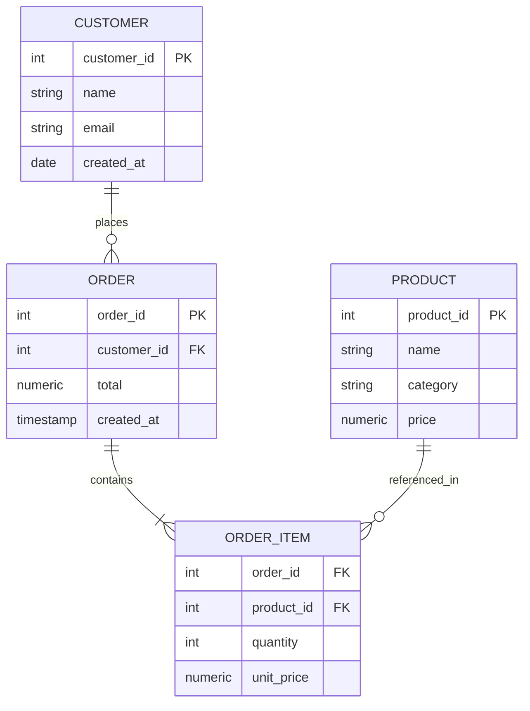

## The Relational Model

E.F. Codd introduced the relational model in his 1970 paper "A Relational Model of Data for Large
Shared Data Banks." The model provides a mathematically rigorous foundation for data management
based on set theory and first-order predicate logic. Every SQL database is an approximation of this
model -- and understanding where SQL deviates from the theory helps you write correct queries.

### Codd's 12 Rules (and Rule 0)

Codd defined 13 rules (numbered 0 through 12) that a system must satisfy to be considered truly
relational. No commercial database fully satisfies all 13, but they serve as the theoretical
benchmark:

| Rule | Name                            | Summary                                                                           |
| ---- | ------------------------------- | --------------------------------------------------------------------------------- |
| 0    | Foundation                      | A relational DBMS must manage databases through its relational capabilities alone |
| 1    | Information                     | All information is represented as values in tables                                |
| 2    | Guaranteed Access               | Every value is accessible by table name, primary key, and column name             |
| 3    | Systematic Treatment of NULL    | NULL values are distinct from default values and represent missing information    |
| 4    | Dynamic Online Catalog          | The database description (catalog) is represented as relational tables            |
| 5    | Comprehensive Sublanguage       | Supports at least one relational language (SQL, QBE, etc.)                        |
| 6    | View Updating                   | All views theoretically updatable must be updatable by the system                 |
| 7    | High-level Insert/Update/Delete | Set-level operations, not row-by-row processing                                   |
| 8    | Physical Data Independence      | Application logic unaffected by physical storage changes                          |
| 9    | Logical Data Independence       | Application logic unaffected by logical schema changes (view changes)             |
| 10   | Integrity Independence          | Integrity constraints are part of the schema, not the application                 |
| 11   | Distribution Independence       | Applications unaffected by data distribution                                      |
| 12   | Nonsubversion                   | Low-level language cannot bypass integrity constraints                            |

:::info

In practice, Rule 6 (view updating) is the most commonly violated. Most SQL databases cannot update
through arbitrary views, especially those involving joins, aggregations, or DISTINCT.

:::

## Relations, Tuples, Attributes, and Domains

The relational model uses precise terminology that SQL conflates:

| Relational Term | SQL Term  | Mathematical Object                   |
| --------------- | --------- | ------------------------------------- |
| Relation        | Table     | A set of tuples (no duplicate tuples) |
| Tuple           | Row       | An ordered list of values             |
| Attribute       | Column    | A named position in a tuple           |
| Domain          | Data type | A set of permissible values           |
| Degree          | Arity     | Number of attributes in a relation    |
| Cardinality     | Row count | Number of tuples in a relation        |

### Key Distinction: Relations Are Sets

A mathematical relation is a **set** of tuples, which means:

1. **No duplicate tuples** -- SQL tables allow duplicates (unless you declare `UNIQUE` or
   `PRIMARY KEY`). To get true relational behavior, you must use `SELECT DISTINCT`.
2. **No ordering of tuples** -- SQL `ORDER BY` operates on the result set, not on the base relation.
   A table has no inherent row order.
3. **Attributes are identified by name, not position** -- SQL allows `SELECT *` which relies on
   column ordering. This is a deviation from the theory.

### Domains

A domain defines the set of valid values for an attribute. SQL data types (`INTEGER`,
`VARCHAR(255)`, `DATE`) are a coarse approximation of domains. A true domain would include
constraints:

```sql
CREATE DOMAIN age_domain AS INTEGER
  CHECK (VALUE >= 0 AND VALUE <= 150);

CREATE DOMAIN email_domain AS VARCHAR(255)
  CHECK (VALUE ~ '^[A-Za-z0-9._%+-]+@[A-Za-z0-9.-]+\.[A-Za-z]{2,}$');
```

:::tip

PostgreSQL supports `CREATE DOMAIN` with `CHECK` constraints. Most other databases require you to
attach `CHECK` constraints directly to columns. Using domains centralises validation logic and
prevents inconsistency across tables.

:::

## Keys

Keys are the mechanism by which tuples are identified and relationships between relations are
established. Understanding the key hierarchy is essential for correct schema design.

### Superkey

A superkey is any set of attributes that uniquely identifies a tuple. A superkey may contain
redundant attributes. For a relation `Employee(emp_id, ssn, name, dept)`:

- `{emp_id}` -- superkey
- `{ssn}` -- superkey
- `{emp_id, name}` -- superkey (redundant: `emp_id` alone suffices)
- `{emp_id, ssn}` -- superkey

### Candidate Key

A candidate key is a **minimal** superkey -- removing any attribute destroys uniqueness. Every
relation has at least one candidate key (if it is a proper set).

- `{emp_id}` -- candidate key
- `{ssn}` -- candidate key
- `{emp_id, name}` -- NOT a candidate key (not minimal)

### Primary Key

The primary key is the candidate key chosen by the database designer as the principal identifier. It
is a design choice, not a mathematical property. Convention:

- Choose a stable, never-changing attribute (not email, not phone number)
- Prefer single-column keys for simplicity
- Use surrogate keys (auto-increment, UUID) when no natural candidate key exists

### Foreign Key

A foreign key is a set of attributes in one relation that references the primary key of another
relation. It enforces referential integrity: every value of the foreign key must exist as a value of
the referenced primary key (or be NULL).

```sql
CREATE TABLE orders (
    order_id   INTEGER PRIMARY KEY,
    customer_id INTEGER NOT NULL,
    total      NUMERIC(10,2) NOT NULL,
    FOREIGN KEY (customer_id) REFERENCES customers(customer_id)
        ON DELETE CASCADE
        ON UPDATE RESTRICT
);
```

Referential actions:

| Action        | Behavior                                                            |
| ------------- | ------------------------------------------------------------------- |
| `CASCADE`     | Propagate the delete/update to child rows                           |
| `RESTRICT`    | Block the delete/update if child rows exist                         |
| `SET NULL`    | Set the foreign key to NULL in child rows                           |
| `SET DEFAULT` | Set the foreign key to its default value in child rows              |
| `NO ACTION`   | Defer check to end of transaction (similar to RESTRICT in practice) |

### Composite Key

A composite key is a primary key consisting of two or more attributes. Common in association tables
and many-to-many relationships:

```sql
CREATE TABLE enrollment (
    student_id  INTEGER NOT NULL,
    course_id   INTEGER NOT NULL,
    enrolled_at TIMESTAMP DEFAULT NOW(),
    PRIMARY KEY (student_id, course_id),
    FOREIGN KEY (student_id) REFERENCES students(student_id),
    FOREIGN KEY (course_id) REFERENCES courses(course_id)
);
```

## Relational Algebra

Relational algebra provides a formal set of operations for manipulating relations. Every SQL query
is an expression in relational algebra (with extensions). Understanding these operations helps you
reason about query correctness and performance.

### Selection (sigma)

Filters tuples based on a predicate. Denoted $\sigma_{\mathrm{predicate}}(R)$.

```sql
-- sigma_{salary > 100000}(Employee)
SELECT * FROM Employee WHERE salary > 100000;
```

### Projection (pi)

Selects a subset of attributes. Denoted $\pi_{\mathrm{attr}_1, \mathrm{attr}_2}(R)$.

```sql
-- pi_{name, salary}(Employee)
SELECT name, salary FROM Employee;
```

### Cartesian Product (cross join)

Combines every tuple from one relation with every tuple from another. Denoted $R \times S$.

```sql
SELECT * FROM Employee CROSS JOIN Department;
```

:::warning

The Cartesian product of relations with $m$ and $n$ tuples produces $m \times n$ tuples. For tables
with millions of rows, an accidental Cartesian product (missing JOIN condition) will produce
trillions of rows and exhaust memory.

:::

### Join

A join combines related tuples from two relations based on a join condition. The most common is the
natural join, which matches on attributes with the same name.

| Join Type   | Description                                                        |
| ----------- | ------------------------------------------------------------------ |
| Inner Join  | Returns tuples from both relations that satisfy the join condition |
| Left Outer  | All tuples from left, matched tuples from right (NULL if no match) |
| Right Outer | All tuples from right, matched tuples from left (NULL if no match) |
| Full Outer  | All tuples from both relations (NULL where no match)               |
| Theta Join  | General join with arbitrary condition $\theta$                     |
| Equi Join   | Theta join where $\theta$ is equality on specific attributes       |

The inner join can be expressed in terms of selection and Cartesian product:

$$R \bowtie_{\theta} S = \sigma_{\theta}(R \times S)$$

### Division

Division answers "which X values are associated with ALL Y values?" Denoted $R \div S$.

Given `Takes(student, course)` and `RequiredCourse(course)`, find students who have taken ALL
required courses:

$$\pi_{\mathrm{student}, \mathrm{course}}(\mathrm{Takes}) \div \pi_{\mathrm{course}}(\mathrm{RequiredCourse})$$

SQL has no direct division operator. You simulate it with a double `NOT EXISTS`:

```sql
SELECT DISTINCT student
FROM Takes T1
WHERE NOT EXISTS (
    SELECT course FROM RequiredCourse R
    WHERE NOT EXISTS (
        SELECT 1 FROM Takes T2
        WHERE T2.student = T1.student
          AND T2.course = R.course
    )
);
```

### Set Operations

Relational algebra includes standard set operations (relations must be **union-compatible**: same
degree and corresponding domains):

- **Union** ($R \cup S$): all tuples from both relations, duplicates removed
- **Intersection** ($R \cap S$): tuples present in both relations
- **Difference** ($R - S$): tuples in $R$ but not in $S$

```sql
SELECT name FROM customers
UNION
SELECT name FROM suppliers;

SELECT name FROM customers
INTERSECT
SELECT name FROM suppliers;

SELECT name FROM customers
EXCEPT
SELECT name FROM suppliers;
```

### Rename (rho)

The rename operation, denoted $\rho_{\mathrm{new\_name}}(R)$, gives a relation or its attributes new
names. In SQL, this is `AS`:

```sql
SELECT E.name AS employee_name, M.name AS manager_name
FROM Employee E
JOIN Employee M ON E.manager_id = M.emp_id;
```

## Functional Dependencies

A functional dependency (FD) is a constraint of the form $X \rightarrow Y$, meaning "for any two
tuples, if they agree on all attributes in $X$, they must also agree on all attributes in $Y$." $X$
is called the determinant.

Formally:

$$X \rightarrow Y \iff \forall t_1, t_2 \in R : t_1[X] = t_2[X] \Rightarrow t_1[Y] = t_2[Y]$$

### Examples

For a relation `Student(student_id, name, email, major, advisor_id, advisor_name)`:

- `student_id → name, email, major, advisor_id` -- student ID determines everything
- `advisor_id → advisor_name` -- advisor ID determines advisor name
- `student_id, course_id → grade` -- in an enrollment relation

### Trivial vs Non-trivial

- **Trivial:** $Y \subseteq X$ (e.g., `{student_id} → {student_id}`) -- always true, provides no
  information
- **Non-trivial:** $Y \not\subseteq X$ -- carries actual semantic meaning
- **Completely non-trivial:** $X \cap Y = \emptyset$

### Armstrong's Axioms

Armstrong's axioms are a sound and complete set of inference rules for deriving all valid functional
dependencies from a given set:

1. **Reflexivity:** If $Y \subseteq X$, then $X \rightarrow Y$
2. **Augmentation:** If $X \rightarrow Y$, then $XZ \rightarrow YZ$ for any $Z$
3. **Transitivity:** If $X \rightarrow Y$ and $Y \rightarrow Z$, then $X \rightarrow Z$

Derived rules (provable from the three axioms above):

4. **Union:** If $X \rightarrow Y$ and $X \rightarrow Z$, then $X \rightarrow YZ$
5. **Decomposition:** If $X \rightarrow YZ$, then $X \rightarrow Y$ and $X \rightarrow Z$
6. **Pseudotransitivity:** If $X \rightarrow Y$ and $YW \rightarrow Z$, then $XW \rightarrow Z$

### Attribute Closure

To determine if $X \rightarrow Y$ holds given a set of FDs $F$, compute the **closure of $X$** under
$F$, denoted $X^+$:

1. Start with $X^+ = X$
2. Repeatedly apply Armstrong's axioms to add attributes to $X^+$
3. Stop when no more attributes can be added
4. $X \rightarrow Y$ holds if and only if $Y \subseteq X^+$

```text
Given R(A, B, C, D) with FDs: {A → B, B → C, C → D}

Closure of {A}:
  A⁺ = {A}
  A → B, so add B: A⁺ = {A, B}
  B → C, so add C: A⁺ = {A, B, C}
  C → D, so add D: A⁺ = {A, B, C, D}

Since A⁺ = {A, B, C, D}, A is a superkey.
```

### Minimal Cover (Canonical Cover)

A minimal cover $F_{\min}$ of a set of FDs $F$ satisfies:

1. Every FD in $F_{\min}$ has a single attribute on the right side (decomposition)
2. Removing any FD from $F_{\min}$ changes the closure
3. Removing any attribute from the left side of any FD in $F_{\min}$ changes the closure

Algorithm:

1. Split right sides: replace $X \rightarrow YZ$ with $X \rightarrow Y$ and $X \rightarrow Z$
2. Remove redundant FDs: for each FD $f \in F$, check if $(F - \{f\})^+ = F^+$. If yes, remove $f$.
3. Remove redundant attributes from left sides: for each FD $X \rightarrow Y$ and each attribute
   $A \in X$, check if $(X - \{A\})^+ \supseteq Y$. If yes, remove $A$ from $X$.

## Normalisation

Normalisation is the systematic process of organising a relation to eliminate redundancy and prevent
anomalies. Each normal form addresses specific types of redundancy.

### Anomalies

Unnormalised data suffers from three types of anomalies:

- **Insertion anomaly:** You cannot insert a fact without inserting unrelated facts (e.g., cannot
  add a new department without an employee)
- **Deletion anomaly:** Deleting a fact unintentionally deletes other facts (e.g., deleting the last
  employee in a department removes the department)
- **Update anomaly:** Updating a fact requires updating multiple rows (e.g., changing a department
  name requires updating every employee in that department)

### First Normal Form (1NF)

A relation is in 1NF if and only if every attribute contains atomic (indivisible) values. No
repeating groups, no arrays, no nested relations.

```text
Violates 1NF:
| student_id | name       | courses                    |
|------------|------------|----------------------------|
| 1          | Alice      | {Math, Physics, Chemistry} |

Satisfies 1NF:
| student_id | course     |
|------------|------------|
| 1          | Math       |
| 1          | Physics    |
| 1          | Chemistry  |
```

:::info

PostgreSQL arrays (`INTEGER[]`) technically violate 1NF but are a pragmatic extension. When you need
to query individual elements or enforce referential integrity on array elements, model them as
separate rows.

:::

### Second Normal Form (2NF)

A relation is in 2NF if it is in 1NF and no non-prime attribute is partially dependent on any
candidate key. "Partially dependent" means dependent on a proper subset of a candidate key.

2NF only matters for relations with **composite** candidate keys. If all candidate keys are single
attributes, the relation is automatically in 2NF if it is in 1NF.

```text
R(order_id, product_id, quantity, product_name)

FDs: {order_id, product_id} → quantity, product_id → product_name

product_name depends on product_id (a subset of the key), not the full key.
This violates 2NF.

Fix: split into:
  OrderItem(order_id, product_id, quantity)
  Product(product_id, product_name)
```

### Third Normal Form (3NF)

A relation is in 3NF if it is in 2NF and no non-prime attribute is transitively dependent on any
candidate key. Equivalently, for every non-trivial FD $X \rightarrow A$ where $A$ is non-prime, $X$
must be a superkey.

```text
R(emp_id, name, dept_id, dept_name, dept_location)

FDs: emp_id → name, dept_id, dept_name, dept_location
     dept_id → dept_name, dept_location

dept_name and dept_location transitively depend on emp_id via dept_id.
This violates 3NF.

Fix: split into:
  Employee(emp_id, name, dept_id)
  Department(dept_id, dept_name, dept_location)
```

### Boyce-Codd Normal Form (BCNF)

A relation is in BCNF if for every non-trivial FD $X \rightarrow Y$, $X$ is a superkey. BCNF is
stricter than 3NF: 3NF allows $X \rightarrow A$ where $X$ is a superkey OR $A$ is a prime attribute.
BCNF removes the "or $A$ is prime" exception.

```text
R(student, course, instructor)

FDs: {student, course} → instructor
     instructor → course

Neither student nor instructor alone is a superkey.
The candidate keys are {student, course} and {student, instructor}.
instructor → course violates BCNF (instructor is not a superkey).

Fix: split into:
  Teaching(instructor, course)
  StudentInstructor(student, instructor)
```

:::warning

Achieving BCNF may sometimes cause lossy decompositions (you cannot reconstruct the original
relation from the decomposed relations without losing information). In such cases, staying in 3NF is
the practical compromise.

:::

### Fourth Normal Form (4NF)

A relation is in 4NF if it is in BCNF and contains no non-trivial multivalued dependencies. A
multivalued dependency $X \twoheadrightarrow Y$ means: for each value of $X$, the set of $Y$ values
is independent of the set of $Z$ values (where $Z = R - X - Y$).

```text
R(emp_id, skill, language)

An employee has multiple skills and speaks multiple languages.
Skills and languages are independent: {emp_id} ⇸ {skill} and {emp_id} ⇸ {language}.

Violates 4NF if both MVDs hold and there are multiple skills AND languages.

Fix: split into:
  EmployeeSkill(emp_id, skill)
  EmployeeLanguage(emp_id, language)
```

### Fifth Normal Form (5NF) / Project-Join Normal Form (PJNF)

A relation is in 5NF if it cannot be decomposed into smaller relations without losing information
(no join dependency that is not implied by candidate keys). This is the "final" normal form in terms
of dependency theory.

In practice, 5NF violations are rare. They arise when a relation encodes a constraint that cannot be
expressed as a functional or multivalued dependency, such as a cyclic ternary relationship.

## Denormalisation

Normalisation eliminates redundancy but can hurt query performance by requiring joins. In read-heavy
workloads, strategic denormalisation trades write complexity for read performance.

### When to Denormalise

- **Read-heavy workloads** where the same join is executed thousands of times per second
- **Reporting/OLAP** where query flexibility matters more than write efficiency
- **Materialised views** where the denormalised data is a derived, refreshable copy

### Patterns

1. **Precomputed aggregates:** store `total_order_value` alongside order rows instead of computing
   it from `order_items` on every read
2. **Embedded documents:** in NoSQL stores, embed frequently accessed related data (e.g., order
   items inside the order document)
3. **Copy fields:** duplicate a frequently-filtered field (e.g., `customer_name` in the `orders`
   table) to avoid joins
4. **Materialised views:** precomputed query results that are refreshed on a schedule or trigger

### Trade-offs

```text
Normalised:
  + No update anomalies
  + Single source of truth
  + Schema is self-documenting
  - More joins (higher read latency)
  - More complex queries

Denormalised:
  + Fewer joins (lower read latency)
  + Simpler queries
  - Update anomalies (must update multiple locations)
  - Data inconsistency risk
  - More storage consumed
```

:::tip

Denormalise from a position of knowledge. Start normalised, measure query performance, and
denormalise specific bottlenecks. Premature denormalisation creates maintenance burden that is far
more expensive than the joins it eliminates.

:::

## ER Diagrams

Entity-Relationship (ER) diagrams are the standard notation for conceptual database design. They
model entities (things), attributes (properties), and relationships (associations between entities).

### Notation



### Cardinality Constraints

| Notation  | Meaning                                  |
| --------- | ---------------------------------------- |
| 1:1       | Each entity relates to exactly one other |
| 1:N       | One entity relates to many others        |
| M:N       | Many entities relate to many others      |
| 0..1:1..N | Optional/mandatory cardinalities         |

### Converting ER Diagrams to Relations

1. **Strong entities** become tables with their attributes as columns
2. **Weak entities** become tables that include the primary key of the identifying (owner) entity
3. **1:1 relationships:** add the foreign key to either table (prefer the table where NULL is less
   common)
4. **1:N relationships:** add the foreign key to the "N" side
5. **M:N relationships:** create an association table with composite primary key

## Common Pitfalls

### Using Natural Keys When Surrogate Keys Are Appropriate

A natural key like email address or national ID number may seem appealing, but it creates problems
when the value changes (requiring cascading updates across all referencing tables) or when the
domain is not truly unique (two people share an email during a migration). Surrogate keys
(`BIGSERIAL`, `UUID`) are stable, never change, and simplify joins.

### Over-Normalising

Splitting tables too aggressively (e.g., creating a separate table for every attribute "just in
case") makes even simple queries require joins. If a group of attributes always appears together and
is always updated together, they likely belong in the same table.

### Ignoring Functional Dependencies in Application Code

If you find yourself writing application logic like "when the department changes, look up the new
department name and update this record," you have a functional dependency that belongs in the
schema. Model it as a foreign key relationship.

### Confusing NULL with Empty String or Zero

NULL means "unknown" or "not applicable." It is not the same as `''` (empty string) or `0`. In SQL,
`NULL = NULL` is `NULL` (not `TRUE`), and `NULL + 1` is `NULL`. This three-valued logic causes
subtle bugs in WHERE clauses, JOIN conditions, and CHECK constraints.

### Not Declaring Foreign Keys

Some teams omit foreign key constraints for "performance reasons." The cost of a foreign key check
on insert/update is negligible compared to the cost of orphaned rows, inconsistent data, and the
debugging time required to find them. Only omit foreign keys if you have a proven, measured reason
and a compensating data integrity mechanism.

### Using SELECT \* in Application Code

`SELECT *` breaks when columns are added, reordered, or renamed. It transfers unnecessary data over
the network. It prevents the query planner from using covering indexes. Always list the columns you
need explicitly.

### Treating Multi-Valued Attributes as Single Columns

Storing comma-separated values, JSON arrays, or space-delimited lists in a single column violates
1NF and makes queries unreliable:

```sql
-- Anti-pattern:
CREATE TABLE articles (
    article_id INTEGER PRIMARY KEY,
    title VARCHAR(200),
    tags VARCHAR(500)  -- "database,performance,sql"
);

-- Querying requires string manipulation (fragile, slow, cannot use indexes):
SELECT * FROM articles WHERE tags LIKE '%database%';
-- Also matches "non-database", "database-admin", etc.

-- Correct: junction table
CREATE TABLE article_tags (
    article_id INTEGER REFERENCES articles(article_id),
    tag        VARCHAR(50) NOT NULL,
    PRIMARY KEY (article_id, tag)
);

CREATE INDEX idx_article_tags_tag ON article_tags(tag);

SELECT a.* FROM articles a
JOIN article_tags at ON a.article_id = at.article_id
WHERE at.tag = 'database';
```

### Ignoring the Closure Algorithm

When designing schemas, developers often guess which functional dependencies exist rather than
computing them systematically. This leads to incorrect normal forms and redundant relationships.
Always compute the attribute closure for candidate keys and verify the minimal cover before
declaring a schema to be in a given normal form.

### Circular Foreign Key References

Two tables with foreign keys referencing each other create a circular dependency that complicates
inserts, deletes, and schema migrations:

```sql
-- Circular dependency:
CREATE TABLE employees (
    emp_id       INTEGER PRIMARY KEY,
    dept_id      INTEGER REFERENCES departments(dept_id)
);
CREATE TABLE departments (
    dept_id      INTEGER PRIMARY KEY,
    manager_id   INTEGER REFERENCES employees(emp_id)
);

-- Inserting requires DEFERRABLE constraints or inserting NULLs first
-- Dropping either table requires CASCADE
```

Break circular dependencies by making one side DEFERRABLE, using a NULL placeholder for the initial
insert, or redesigning the schema to eliminate the cycle.

## Theoretical Foundations

### Relational Calculus

Relational calculus is an alternative to relational algebra for expressing queries. It is
**declarative** (describes what to retrieve, not how) and comes in two forms:

**Tuple relational calculus:** variables range over tuples.

$$\{ t \mid \exists s \in \mathrm{Employee}(s[\mathrm{dept}] = t[\mathrm{dept}] \land s[\mathrm{salary}] \gt 100000) \}$$

**Domain relational calculus:** variables range over attribute values (domains).

$$\{ \lt \mathrm{name}, \mathrm{salary} \gt \mid \exists d, s (\mathrm{Employee}(d, \mathrm{name}, s) \land s \gt 100000) \}$$

Codd's theorem (1972) proves that relational algebra and relational calculus are **equivalent** in
expressive power: every query expressible in one is expressible in the other. SQL is based on
relational algebra with some relational calculus influences.

### The Universal Relation Assumption

The universal relation assumption states that all attributes have globally unique names and that any
attribute can be related to any other. This assumption underlies many visual query tools and some
ORM systems, but it does not hold in practice. Attributes named `id`, `name`, or `type` appear in
many tables with completely different semantics.

Implication: always qualify column names with their table (or alias) in queries, and use descriptive
names that reflect the domain (e.g., `customer_id` instead of `id`).

### Lossless-Join Decomposition

A decomposition of relation $R$ into $R_1$ and $R_2$ is **lossless** if $R_1 \bowtie R_2 = R$ (no
information is lost). A decomposition is lossless if and only if:

$$R_1 \cap R_2 \rightarrow R_1 \mathrm{ or } R_1 \cap R_2 \rightarrow R_2$$

That is, the common attributes form a superkey for at least one of the decomposed relations.

```text
R(A, B, C) with FDs: {A → B, B → C}

Decompose into R1(A, B) and R2(B, C):
  R1 ∩ R2 = {B}
  B → C (from the FDs), so B is a superkey for R2? No, R2 needs {B, C} and B → C, so B is a
  superkey for R2. Lossless decomposition. ✓

Decompose into R1(A, B) and R1(A, C):
  R1 ∩ R2 = {A}
  A → B (from the FDs), so A is a superkey for R1. Lossless decomposition. ✓
```

### Dependency Preservation

A decomposition is **dependency-preserving** if every functional dependency in the original set can
be checked by examining only the decomposed relations (without joining them back together).

Not every lossless decomposition is dependency-preserving, and not every dependency-preserving
decomposition is lossless. The goal is to achieve both.

```text
R(A, B, C) with FDs: {A → B, B → C}

Decompose into R1(A, B) and R1(A, C):
  Lossless? Yes (A → B, so A is a superkey for R1).
  Dependency-preserving?
    A → B: checkable on R1 ✓
    B → C: NOT checkable on either R1 or R2 alone ✗
  This decomposition loses the dependency B → C.
```

When a BCNF decomposition is not dependency-preserving, you have a choice: stay in 3NF (which always
has a dependency-preserving, lossless decomposition) or accept the non-dependency-preserving BCNF
decomposition and enforce the lost dependency through application logic or triggers.

### Join Dependencies and 5NF Revisited

A join dependency (JD) is a generalisation of a multivalued dependency. A relation $R$ satisfies a
join dependency $JD(R_1, R_2, \ldots, R_n)$ if $R$ is equal to the join of its projections on
$R_1, R_2, \ldots, R_n$:

$$R = R_1 \bowtie R_2 \bowtie \ldots \bowtie R_n$$

5NF states that every non-trivial join dependency must be implied by candidate keys. When this
condition is violated, the relation encodes a constraint that is not captured by functional or
multivalued dependencies.

```text
Classic 5NF example: supplier-part-project

R(supplier, part, project)

Business rule: if a supplier supplies a part and works on a project, then that supplier
supplies that part for that project. This is a ternary relationship that cannot be decomposed
into binary relationships without losing the constraint.

Supplier S supplies Part P and works on Project J:
  (S, P, J) must exist if (S, P) and (S, J) both exist.

Decomposing into SP(S, P), SJ(S, J), PJ(P, J) loses the ternary constraint.
The join SP ⋈ SJ ⋈ PJ may contain rows not in the original relation.

5NF violation: the constraint requires all three components together.
```

## Practical Normalisation Workflow

The following workflow applies normalisation systematically to a real-world schema:

```text
1. Identify all attributes and their semantics (what does each column mean?)
2. Identify all candidate keys (compute attribute closures)
3. List all functional dependencies (from business rules and key analysis)
4. Compute the minimal cover (canonical form)
5. Decompose into 1NF: ensure atomic values
6. Decompose into 2NF: eliminate partial dependencies on composite keys
7. Decompose into 3NF: eliminate transitive dependencies
8. Verify BCNF: check that every determinant is a superkey
9. For each decomposition, verify lossless-join and dependency-preservation
10. Evaluate denormalisation for known performance bottlenecks
```

### Worked Example

```text
Schema: R(student_id, course_id, instructor_name, instructor_office, grade)

Step 1: Identify attributes
  student_id       -- identifies a student
  course_id        -- identifies a course
  instructor_name  -- name of the instructor teaching the course
  instructor_office -- office of the instructor
  grade            -- grade the student received in the course

Step 2: Identify candidate keys
  {student_id, course_id} -- a student takes a course once

Step 3: Functional dependencies
  {student_id, course_id} → grade                    -- a student's grade for a course
  course_id → instructor_name, instructor_office     -- a course has one instructor

Step 4: 1NF? Yes, all attributes are atomic.

Step 5: 2NF? No partial dependencies:
  instructor_name and instructor_office depend on course_id (a subset of the key).
  They do NOT depend on student_id at all.

Step 6: Decompose into 2NF:
  R1(student_id, course_id, grade)  -- key: {student_id, course_id}
  R2(course_id, instructor_name, instructor_office)  -- key: {course_id}

Step 7: 3NF? Check transitive dependencies:
  R1: {student_id, course_id} → grade. No transitive dependency. 3NF. ✓
  R2: course_id → instructor_name → instructor_office? Only if one instructor
      has one office. If so, this is a transitive dependency.

  If instructor_name → instructor_office:
    R2a(course_id, instructor_name)
    R2b(instructor_name, instructor_office)

  If instructor_office is not functionally dependent on instructor_name
  (e.g., shared offices), R2 is already in 3NF.

Step 8: BCNF? All determinants are superkeys. ✓
```

This systematic approach prevents the common mistake of over-normalising (splitting tables that have
no redundancy) or under-normalising (leaving transitive dependencies that cause update anomalies).
