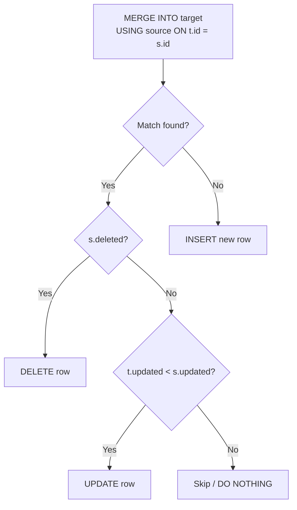

## Window Functions Deep Dive

Window functions compute values across a set of rows related to the current row without collapsing
the result set. This section covers the framing mechanics, exclusion clauses, window groups, and
window chains that give window functions their full power.

### Window Function Anatomy

```sql
function_name([arguments]) OVER (
    [window_name]
    [PARTITION BY partition_expr, ...]
    [ORDER BY sort_expr [ASC|DESC] [NULLS {FIRST|LAST}], ...]
    [frame_clause]
)
```

The three optional components -- partitioning, ordering, and framing -- work together to define the
set of rows visible to the function.

### Framing Clauses

The frame clause defines the subset of rows within the partition that the function sees. It is only
meaningful when `ORDER BY` is present (without `ORDER BY`, the default frame is the entire
partition).

```sql
-- Frame boundaries
ROWS BETWEEN start AND end
RANGE BETWEEN start AND end
GROUPS BETWEEN start AND end

-- Start/end boundary options:
-- UNBOUNDED PRECEDING  -- first row of partition
-- UNBOUNDED FOLLOWING  -- last row of partition
-- n PRECEDING          -- n rows before current row
-- n FOLLOWING          -- n rows after current row
-- CURRENT ROW          -- current row
```

**ROWS** counts physical rows. **RANGE** counts logical peers (rows with the same `ORDER BY` value).
**GROUPS** counts distinct peer groups.

```sql
-- Running total (ROWS: 3-row moving sum)
SELECT order_date, amount,
    SUM(amount) OVER (
        ORDER BY order_date
        ROWS BETWEEN 2 PRECEDING AND CURRENT ROW
    ) AS rolling_3day
FROM daily_sales;

-- Cumulative total (ROWS: all rows from start)
SELECT order_date, amount,
    SUM(amount) OVER (
        ORDER BY order_date
        ROWS BETWEEN UNBOUNDED PRECEDING AND CURRENT ROW
    ) AS cumulative
FROM daily_sales;
```

### ROWS vs RANGE vs GROUPS

The distinction matters when there are ties in the `ORDER BY` column:

```sql
-- Given data with duplicate dates:
-- 2024-01-01 | 100
-- 2024-01-01 | 200
-- 2024-01-02 | 150
-- 2024-01-03 | 300

-- ROWS BETWEEN 1 PRECEDING AND CURRENT ROW
-- For row 2 (2024-01-01, 200): sees rows 1 and 2 → SUM = 300
-- For row 3 (2024-01-02, 150): sees rows 2 and 3 → SUM = 350

-- RANGE BETWEEN 1 PRECEDING AND CURRENT ROW
-- "1 PRECEDING" in RANGE means "ORDER BY value - 1"
-- For row 2 (date=Jan 1): sees all rows where date >= Jan 0 → sees rows 1, 2 → SUM = 300
-- For row 3 (date=Jan 2): sees all rows where date >= Jan 1 → sees rows 1, 2, 3 → SUM = 650

-- GROUPS BETWEEN 1 PRECEDING AND CURRENT ROW
-- For row 2 (date=Jan 1): sees current group (Jan 1) and 1 group before (none) → SUM = 300
-- For row 3 (date=Jan 2): sees current group (Jan 2) and 1 group before (Jan 1) → SUM = 650
```

### EXCLUDE Clause

PostgreSQL 11+ supports `EXCLUDE` within the frame clause to omit specific rows:

```sql
-- Exclude the current row from the frame
SUM(amount) OVER (
    ORDER BY order_date
    ROWS BETWEEN UNBOUNDED PRECEDING AND CURRENT ROW
    EXCLUDE CURRENT ROW
) AS sum_excluding_current

-- Exclude other rows with the same ORDER BY value (peers)
SUM(amount) OVER (
    ORDER BY order_date
    RANGE BETWEEN UNBOUNDED PRECEDING AND CURRENT ROW
    EXCLUDE GROUP
) AS sum_excluding_peers

-- Exclude both current row and its ties
SUM(amount) OVER (
    ORDER BY order_date
    RANGE BETWEEN UNBOUNDED PRECEDING AND CURRENT ROW
    EXCLUDE TIES
) AS sum_excluding_ties_and_current
```

| EXCLUDE Option | What It Removes                                 |
| -------------- | ----------------------------------------------- |
| `CURRENT ROW`  | Only the current row                            |
| `GROUP`        | Current row and all peers (same ORDER BY value) |
| `TIES`         | Only the peers, keeps the current row           |
| `NO OTHERS`    | Nothing (default)                               |

### WINDOW Clause (Window Chains)

The `WINDOW` clause defines named windows that can be reused, avoiding repetition:

```sql
SELECT
    department_id,
    emp_id,
    salary,
    ROW_NUMBER() OVER w AS row_num,
    RANK() OVER w AS rank,
    DENSE_RANK() OVER w AS dense_rank,
    SUM(salary) OVER (w ROWS BETWEEN UNBOUNDED PRECEDING AND CURRENT ROW) AS running_total
FROM employees
WINDOW w AS (PARTITION BY department_id ORDER BY salary DESC);
```

Named windows can be composed by extending a base window:

```sql
SELECT
    department_id,
    emp_id,
    salary,
    AVG(salary) OVER dept_avg AS dept_avg_salary,
    salary - AVG(salary) OVER dept_avg AS delta_from_avg,
    ROW_NUMBER() OVER dept_order AS salary_rank
FROM employees
WINDOW
    dept AS (PARTITION BY department_id),
    dept_avg AS (dept),
    dept_order AS (dept ORDER BY salary DESC);
```

### Advanced Ranking: NTILE, PERCENT_RANK, CUME_DIST

```sql
-- NTILE divides rows into n roughly equal buckets
SELECT emp_id, salary,
    NTILE(4) OVER (ORDER BY salary DESC) AS salary_quartile
FROM employees;

-- PERCENT_RANK: (rank - 1) / (total_rows - 1), range [0, 1]
SELECT emp_id, salary,
    PERCENT_RANK() OVER (ORDER BY salary DESC) AS pct_rank
FROM employees;

-- CUME_DIST: proportion of rows with value <= current row, range (0, 1]
SELECT emp_id, salary,
    CUME_DIST() OVER (ORDER BY salary DESC) AS cumulative_dist
FROM employees;
```

| Function       | Ties at 150k, 150k, 140k, 130k | Range      |
| -------------- | ------------------------------ | ---------- |
| `ROW_NUMBER`   | 1, 2, 3, 4                     | N/A        |
| `RANK`         | 1, 1, 3, 4                     | 1 to N     |
| `DENSE_RANK`   | 1, 1, 2, 3                     | 1 to N     |
| `NTILE(2)`     | 1, 1, 2, 2                     | 1 to n     |
| `PERCENT_RANK` | 0.0, 0.0, 0.667, 1.0           | 0.0 to 1.0 |
| `CUME_DIST`    | 0.5, 0.5, 0.75, 1.0            | 0.0 to 1.0 |

## Advanced Common Table Expressions

### Multiple CTEs with Data Modification

PostgreSQL allows mixing reads and writes in a single CTE chain:

```sql
WITH new_orders AS (
    INSERT INTO orders (customer_id, total, status)
    VALUES (42, 250.00, 'pending')
    RETURNING order_id, customer_id, total
),
inventory_update AS (
    UPDATE inventory i
    SET quantity = i.quantity - 1
    FROM new_orders o
    JOIN order_items oi ON oi.order_id = o.order_id
    WHERE i.product_id = oi.product_id
    RETURNING i.product_id, i.quantity
),
audit_entry AS (
    INSERT INTO audit_log (action, details)
    SELECT 'order_created', json_build_object(
        'order_id', o.order_id,
        'customer_id', o.customer_id,
        'total', o.total
    )
    FROM new_orders o
    RETURNING log_id
)
SELECT o.order_id, o.total, a.log_id AS audit_id
FROM new_orders o
JOIN audit_entry a ON TRUE;
```

Execution order within a CTE chain is **not** guaranteed to follow the textual order. The optimizer
may reorder data-modifying CTEs. If you need ordering, use triggers or application-level
orchestration.

### CTE Materialization (PostgreSQL 12+)

Before PostgreSQL 12, every CTE was materialized (executed once, stored as a temporary result).
PostgreSQL 12+ allows the optimizer to inline CTEs (fold them into the outer query like subqueries)
when the CTE is referenced once and is non-recursive.

```sql
-- Inlined (faster for single-reference CTEs):
WITH active_users AS (
    SELECT user_id, email FROM users WHERE is_active = TRUE
)
SELECT * FROM active_users WHERE email LIKE '%@company.com';

-- Force materialization (useful when referenced multiple times):
WITH active_users AS MATERIALIZED (
    SELECT user_id, email FROM users WHERE is_active = TRUE
)
SELECT
    (SELECT COUNT(*) FROM active_users) AS total_active,
    (SELECT COUNT(*) FROM active_users WHERE email LIKE '%@company.com') AS company_users;
```

| Strategy               | When to Use                        | Trade-off                                  |
| ---------------------- | ---------------------------------- | ------------------------------------------ |
| Inlined                | CTE referenced once, simple filter | Planner can push predicates, use indexes   |
| Materialized           | CTE referenced multiple times      | Computed once but cannot use outer indexes |
| `MATERIALIZED` keyword | Explicit control over inlining     | Overrides the planner's decision           |

### Recursive CTEs for Tree Traversal

```sql
-- Org chart with full path
WITH RECURSIVE org_tree AS (
    SELECT
        emp_id,
        first_name,
        manager_id,
        1 AS depth,
        ARRAY[first_name] AS path_names
    FROM employees
    WHERE manager_id IS NULL

    UNION ALL

    SELECT
        e.emp_id,
        e.first_name,
        e.manager_id,
        t.depth + 1,
        t.path_names || e.first_name
    FROM employees e
    JOIN org_tree t ON e.manager_id = t.emp_id
)
SELECT
    emp_id,
    first_name,
    depth,
    array_to_string(path_names, ' -> ') AS reporting_chain
FROM org_tree
ORDER BY path_names;
```

### Recursive CTEs for Graph Traversal (BFS)

```sql
-- Find all reachable nodes from a starting node
WITH RECURSIVE bfs AS (
    SELECT
        from_node,
        to_node,
        0 AS hops,
        ARRAY[from_node] AS visited
    FROM edges
    WHERE from_node = 'A'

    UNION ALL

    SELECT
        e.from_node,
        e.to_node,
        b.hops + 1,
        b.visited || e.to_node
    FROM edges e
    JOIN bfs b ON e.from_node = b.to_node
    WHERE NOT (e.to_node = ANY(b.visited))
      AND b.hops &lt; 10
)
SELECT DISTINCT to_node, MIN(hops) AS shortest_path
FROM bfs
GROUP BY to_node
ORDER BY shortest_path;
```

:::warning

Recursive CTEs can produce exponential result sets on dense graphs. Always include a depth limit
(`hops &lt; N`) and a visited set to prevent infinite loops. For very large graphs, consider
dedicated graph databases like Neo4j.

:::

## LATERAL Joins

`LATERAL` allows a subquery in a `FROM` or `JOIN` clause to reference columns from tables that
appear earlier in the `FROM` list. This enables correlated subqueries that return multiple rows and
columns.

### Basic LATERAL

```sql
-- Get the top 3 orders per customer
SELECT c.customer_id, c.name, t.order_id, t.total
FROM customers c
CROSS JOIN LATERAL (
    SELECT order_id, total
    FROM orders
    WHERE customer_id = c.customer_id
    ORDER BY total DESC
    LIMIT 3
) t;
```

Without `LATERAL`, the subquery cannot reference `c.customer_id`. A correlated subquery in `SELECT`
can only return one column and one row; `LATERAL` lifts both restrictions.

### LATERAL with LEFT JOIN

```sql
-- Customers with their latest order (including customers with no orders)
SELECT c.customer_id, c.name, latest.order_id, latest.total, latest.order_date
FROM customers c
LEFT JOIN LATERAL (
    SELECT order_id, total, order_date
    FROM orders
    WHERE customer_id = c.customer_id
    ORDER BY order_date DESC
    LIMIT 1
) latest ON TRUE;
```

### LATERAL for GIN Index Lookup

```sql
-- Use a GIN index for array containment checks per row
SELECT p.product_id, p.name, m.matched_tag
FROM products p
CROSS JOIN LATERAL unnest(p.tags) AS m(matched_tag)
WHERE m.matched_tag IN ('electronics', 'sale', 'new');
```

### LATERAL for JSONB Expansion

```sql
SELECT
    e.emp_id,
    e.first_name,
    kv.key AS attribute_name,
    kv.value AS attribute_value
FROM employees e
CROSS JOIN LATERAL jsonb_each_text(e.attributes) AS kv;
```

:::info

`LATERAL` is implicitly applied for function calls in the `FROM` list (e.g.,
`FROM generate_series(1, 10)`). You only need the explicit keyword when the subquery references
outer columns.

:::

## Full-Text Search

PostgreSQL's built-in full-text search provides ranked text search without external dependencies
like Elasticsearch.

### tsvector and tsquery

```sql
-- Create a tsvector from text
SELECT to_tsvector('english', 'The quick brown fox jumps over the lazy dog');
-- Result: 'brown':3 'dog':9 'fox':4 'jump':5 'lazi':8 'quick':2

-- Create a tsquery from a search string
SELECT to_tsquery('english', 'quick &amp; fox');
-- Result: 'quick' &amp; 'fox'

-- Match rows
SELECT title, body
FROM documents
WHERE to_tsvector('english', body) @@ to_tsquery('english', 'database &amp; performance');
```

### Indexed Full-Text Search

```sql
-- Add a pre-computed tsvector column
ALTER TABLE documents ADD COLUMN search_vector tsvector
    GENERATED ALWAYS AS (to_tsvector('english', coalesce(title, '') || ' ' || coalesce(body, ''))) STORED;

-- Create a GIN index on the tsvector
CREATE INDEX idx_documents_search ON documents USING GIN(search_vector);

-- Query using the pre-computed column
SELECT title, ts_rank(search_vector, query) AS rank
FROM documents, to_tsquery('english', 'postgresql &amp; performance') query
WHERE search_vector @@ query
ORDER BY rank DESC;
```

### Ranking Functions

```sql
-- ts_rank: standard ranking based on term frequency and document length
SELECT title, ts_rank(search_vector, query) AS rank
FROM documents, to_tsquery('english', 'database') query
WHERE search_vector @@ query
ORDER BY rank DESC;

-- ts_rank_cd: cover density ranking (considers proximity of terms)
SELECT title, ts_rank_cd(search_vector, query) AS rank
FROM documents, to_tsquery('english', 'database performance') query
WHERE search_vector @@ query
ORDER BY rank DESC;

-- rank with normalization by document length
SELECT title, ts_rank(search_vector, query, 2) AS normalized_rank
FROM documents, to_tsquery('english', 'database') query
WHERE search_vector @@ query
ORDER BY normalized_rank DESC;
```

The normalization flags for `ts_rank` and `ts_rank_cd`:

| Flag | Meaning                                     |
| ---- | ------------------------------------------- |
| 0    | No normalization                            |
| 1    | Normalize by document length                |
| 2    | Normalize by unique terms                   |
| 4    | Normalize by both length and unique terms   |
| 8    | Normalize by document length + unique terms |
| 16   | Normalize by log of document length         |

### Highlighting Results

```sql
SELECT
    title,
    ts_headline('english', body, query, 'MaxWords=50, MinWords=25, ShortWord=3') AS snippet
FROM documents, to_tsquery('english', 'performance &amp; tuning') query
WHERE search_vector @@ query;
```

### Trigram Search (pg_trgm)

For substring and fuzzy matching, trigram indexes are often more practical than full-word search:

```sql
CREATE EXTENSION IF NOT EXISTS pg_trgm;

-- GIN trigram index for LIKE/ILIKE
CREATE INDEX idx_documents_body_trgm ON documents USING GIN(body gin_trgm_ops);

-- Fast LIKE queries
SELECT title FROM documents WHERE body ILIKE '%performance tun%';

-- Fast similarity search
SELECT title, similarity(body, 'database performance tuning') AS sim
FROM documents
WHERE body % 'database performance tuning'
ORDER BY sim DESC;
```

| Method           | Best For                  | Index Type  |
| ---------------- | ------------------------- | ----------- |
| tsvector/tsquery | Full-word search, ranking | GIN         |
| pg_trgm          | Substring, fuzzy, ILIKE   | GIN or GiST |

## Materialized Views

A materialized view caches the result of a query physically on disk, allowing fast reads at the cost
of stale data that must be refreshed.

### Creating and Refreshing

```sql
-- Create a materialized view
CREATE MATERIALIZED VIEW mv_daily_sales_summary AS
SELECT
    order_date,
    COUNT(DISTINCT order_id) AS order_count,
    SUM(total) AS revenue,
    AVG(total) AS avg_order_value
FROM orders
GROUP BY order_date
WITH DATA;

-- Refresh the entire materialized view
REFRESH MATERIALIZED VIEW mv_daily_sales_summary;

-- Refresh concurrently (does not lock the view for reads)
REFRESH MATERIALIZED VIEW CONCURRENTLY mv_daily_sales_summary;
```

:::warning

`REFRESH MATERIALIZED VIEW CONCURRENTLY` requires the materialized view to have at least one
`UNIQUE` index. Without a unique index, only non-concurrent refresh is available, which acquires an
`ACCESS EXCLUSIVE` lock for the duration of the refresh.

:::

### Refresh Strategies

```sql
-- Unique index required for concurrent refresh
CREATE UNIQUE INDEX idx_mv_daily_sales_date ON mv_daily_sales_summary(order_date);

-- Incremental refresh pattern (manual, application-driven)
INSERT INTO mv_daily_sales_summary
SELECT
    order_date,
    COUNT(DISTINCT order_id),
    SUM(total),
    AVG(total)
FROM orders
WHERE order_date >= (SELECT MAX(order_date) FROM mv_daily_sales_summary)
GROUP BY order_date
ON CONFLICT (order_date) DO UPDATE SET
    order_count = EXCLUDED.order_count,
    revenue = EXCLUDED.revenue,
    avg_order_value = EXCLUDED.avg_order_value;
```

### When to Use Materialized Views

| Scenario                              | Recommendation                         |
| ------------------------------------- | -------------------------------------- |
| Dashboard aggregates (updated hourly) | Materialized view, scheduled refresh   |
| Real-time analytics                   | Regular view or live aggregate         |
| Pre-join denormalized read model      | Materialized view, concurrent refresh  |
| ETL staging                           | Temporary table, not materialized view |

## UPSERT Patterns

### INSERT ON CONFLICT (PostgreSQL)

```sql
-- Basic upsert
INSERT INTO inventory (product_id, quantity, last_updated)
VALUES (42, 100, NOW())
ON CONFLICT (product_id)
DO UPDATE SET
    quantity = inventory.quantity + EXCLUDED.quantity,
    last_updated = EXCLUDED.last_updated;

-- Upsert with conditional update
INSERT INTO products (sku, name, price, updated_at)
VALUES ('ABC-123', 'Widget', 29.99, NOW())
ON CONFLICT (sku)
DO UPDATE SET
    name = EXCLUDED.name,
    price = EXCLUDED.price,
    updated_at = EXCLUDED.updated_at
WHERE products.price != EXCLUDED.price OR products.updated_at &lt; EXCLUDED.updated_at;

-- Upsert with "do nothing" on conflict
INSERT INTO users (email, name)
VALUES ('existing@example.com', 'Alice')
ON CONFLICT (email) DO NOTHING;
```

### MERGE (SQL:2003, PostgreSQL 15+)

```sql
MERGE INTO target_table t
USING source_table s
ON t.id = s.id
WHEN MATCHED AND t.updated_at &lt; s.updated_at THEN
    UPDATE SET name = s.name, value = s.value
WHEN NOT MATCHED THEN
    INSERT (id, name, value) VALUES (s.id, s.name, s.value)
WHEN MATCHED AND s.deleted = TRUE THEN
    DELETE;
```



### ON CONFLICT vs MERGE

| Feature                    | ON CONFLICT             | MERGE                           |
| -------------------------- | ----------------------- | ------------------------------- |
| Unique constraint required | Yes                     | No                              |
| Match condition            | Only on unique columns  | Arbitrary join condition        |
| Multiple actions           | One (UPDATE or NOTHING) | Multiple (INSERT/UPDATE/DELETE) |
| Source                     | VALUES or subquery      | Table, subquery, or CTE         |
| Standard                   | PostgreSQL extension    | SQL:2003 standard               |

## Advanced Aggregation

### GROUPING SETS

```sql
-- Multiple independent groupings in one query
SELECT
    COALESCE(region, 'ALL') AS region,
    COALESCE(product_line, 'ALL') AS product_line,
    SUM(revenue) AS total_revenue,
    COUNT(*) AS order_count
FROM sales
GROUP BY GROUPING SETS (
    (region, product_line),
    (region),
    (product_line),
    ()
)
ORDER BY region, product_line;
```

### CUBE and ROLLUP

```sql
-- ROLLUP: hierarchical subtotals (region → country → city)
SELECT
    COALESCE(region, 'TOTAL') AS region,
    COALESCE(country, 'TOTAL') AS country,
    COALESCE(city, 'TOTAL') AS city,
    SUM(revenue) AS revenue
FROM sales
GROUP BY ROLLUP (region, country, city);

-- CUBE: all possible combinations of n columns (2^n groupings)
SELECT
    COALESCE(region, 'ALL') AS region,
    COALESCE(channel, 'ALL') AS channel,
    COALESCE(product_line, 'ALL') AS product_line,
    SUM(revenue) AS revenue
FROM sales
GROUP BY CUBE (region, channel, product_line);
```

### FILTER Clause

```sql
-- Conditional aggregation without CASE
SELECT
    department_id,
    COUNT(*) AS total_employees,
    COUNT(*) FILTER (WHERE gender = 'F') AS female_count,
    COUNT(*) FILTER (WHERE gender = 'M') AS male_count,
    AVG(salary) FILTER (WHERE hire_date >= '2023-01-01') AS avg_new_hire_salary,
    SUM(bonus) FILTER (WHERE performance_rating = 'exceeds') AS total_top_bonus
FROM employees
GROUP BY department_id;
```

The `FILTER` clause is cleaner than `CASE` inside aggregates:

```sql
-- Equivalent using CASE (more verbose):
SELECT
    department_id,
    COUNT(CASE WHEN gender = 'F' THEN 1 END) AS female_count
FROM employees
GROUP BY department_id;

-- Using FILTER (preferred):
SELECT
    department_id,
    COUNT(*) FILTER (WHERE gender = 'F') AS female_count
FROM employees
GROUP BY department_id;
```

### GROUPING Function

```sql
-- Identify which columns are aggregated (NULL due to grouping vs NULL data)
SELECT
    GROUPING(region) AS region_is_subtotal,
    GROUPING(product_line) AS product_is_subtotal,
    COALESCE(region, 'ALL') AS region,
    COALESCE(product_line, 'ALL') AS product_line,
    SUM(revenue) AS revenue
FROM sales
GROUP BY CUBE (region, product_line)
ORDER BY GROUPING(region), GROUPING(product_line);
```

## Temporal Queries

### Time Ranges and Overlapping Periods

```sql
-- Find all active subscriptions on a given date
SELECT subscription_id, customer_id
FROM subscriptions
WHERE start_date <= '2024-06-15'
  AND (end_date IS NULL OR end_date >= '2024-06-15');

-- Find overlapping periods (two intervals overlap if neither ends before the other starts)
SELECT a.booking_id AS booking_a, b.booking_id AS booking_b
FROM bookings a
JOIN bookings b ON a.resource_id = b.resource_id
    AND a.booking_id &lt; b.booking_id
    AND a.start_date &lt; b.end_date
    AND b.start_date &lt; a.end_date;

-- Gap analysis: find available time slots between bookings
SELECT
    resource_id,
    end_date AS gap_start,
    LEAD(start_date) OVER (PARTITION BY resource_id ORDER BY start_date) AS gap_end
FROM bookings
WHERE resource_id = 42;
```

### Interval Arithmetic

```sql
-- Duration between timestamps
SELECT
    end_time - start_time AS duration_interval,
    EXTRACT(EPOCH FROM (end_time - start_time)) AS duration_seconds,
    EXTRACT(EPOCH FROM (end_time - start_time)) / 3600 AS duration_hours;

-- Add/subtract intervals
SELECT
    CURRENT_TIMESTAMP + INTERVAL '30 days' AS renewal_date,
    CURRENT_TIMESTAMP - INTERVAL '1 year' AS one_year_ago,
    CURRENT_TIMESTAMP + (NOW() - created_at) * 2 AS double_age
FROM users
WHERE user_id = 1;

-- Generate a series of timestamps
SELECT generate_series(
    '2024-01-01'::TIMESTAMPTZ,
    '2024-12-31'::TIMESTAMPTZ,
    INTERVAL '1 month'
) AS month_start;
```

### Time-Weighted Averages

```sql
-- Calculate time-weighted average price
-- (weighted by the duration each price was active)
SELECT
    product_id,
    SUM(price * EXTRACT(EPOCH FROM (LEAD(valid_from) OVER w - valid_from))) /
    SUM(EXTRACT(EPOCH FROM (LEAD(valid_from) OVER w - valid_from))) AS twap
FROM price_history
WINDOW w AS (PARTITION BY product_id ORDER BY valid_from);
```

## Hierarchical Queries

### Adjacency List with Recursive CTE

```sql
-- Full org chart with depth and path
WITH RECURSIVE org AS (
    SELECT
        emp_id,
        first_name,
        manager_id,
        0 AS depth,
        ARRAY[emp_id] AS path_ids,
        ARRAY[first_name] AS path_names
    FROM employees
    WHERE manager_id IS NULL

    UNION ALL

    SELECT
        e.emp_id,
        e.first_name,
        e.manager_id,
        o.depth + 1,
        o.path_ids || e.emp_id,
        o.path_names || e.first_name
    FROM employees e
    JOIN org o ON e.manager_id = o.emp_id
    WHERE NOT (e.emp_id = ANY(o.path_ids))
)
SELECT
    emp_id,
    first_name,
    depth,
    array_length(path_ids, 1) AS level,
    array_to_string(path_names, ' / ') AS hierarchy_path
FROM org
ORDER BY path_names;
```

### Closure Table Pattern

The closure table stores all ancestor-descendant relationships explicitly:

```sql
CREATE TABLE tree_nodes (
    node_id INTEGER PRIMARY KEY,
    name TEXT NOT NULL
);

CREATE TABLE tree_closure (
    ancestor_id INTEGER NOT NULL REFERENCES tree_nodes(node_id),
    descendant_id INTEGER NOT NULL REFERENCES tree_nodes(node_id),
    depth INTEGER NOT NULL,
    PRIMARY KEY (ancestor_id, descendant_id)
);

-- Get all descendants of node 5
SELECT d.node_id, d.name, c.depth
FROM tree_closure c
JOIN tree_nodes d ON d.node_id = c.descendant_id
WHERE c.ancestor_id = 5
ORDER BY c.depth;

-- Get all ancestors of node 20
SELECT a.node_id, a.name, c.depth
FROM tree_closure c
JOIN tree_nodes a ON a.node_id = c.ancestor_id
WHERE c.descendant_id = 20
ORDER BY c.depth;

-- Move a subtree (update closure table)
-- Delete all paths that go through node 5's descendants
DELETE FROM tree_closure
WHERE descendant_id IN (SELECT descendant_id FROM tree_closure WHERE ancestor_id = 5)
  AND ancestor_id NOT IN (SELECT descendant_id FROM tree_closure WHERE ancestor_id = 5);

-- Insert new paths: every ancestor of the new parent to every descendant of the moved node
INSERT INTO tree_closure (ancestor_id, descendant_id, depth)
SELECT a.ancestor_id, d.descendant_id, a.depth + d.depth + 1
FROM tree_closure a
CROSS JOIN tree_closure d
WHERE a.descendant_id = 10  -- new parent
  AND d.ancestor_id = 5;    -- moved node
```

| Approach          | Read Performance | Write Performance | Storage  | Best For                   |
| ----------------- | ---------------- | ----------------- | -------- | -------------------------- |
| Adjacency List    | O(depth)         | O(1)              | Minimal  | Write-heavy, shallow trees |
| Nested Sets       | O(1)             | O(n)              | Minimal  | Read-heavy, no updates     |
| Materialized Path | O(1) for prefix  | O(1)              | Path col | Deep trees, sortable       |
| Closure Table     | O(depth)         | O(n\*depth)       | O(n^2)   | Frequent subtree queries   |

## Query Optimization

### Statistics and the Planner

```sql
-- View column statistics
SELECT attname, null_frac, n_distinct, correlation, most_common_vals, most_common_freqs
FROM pg_stats
WHERE tablename = 'orders' AND attname = 'customer_id';

-- Key statistics columns:
-- n_distinct: if &lt; 0, it's the fraction of rows that are distinct (e.g., -0.5 = 50% distinct)
-- correlation: how closely the physical row order matches the column order (1.0 = perfect)
-- null_frac: fraction of NULL values

-- Manually update statistics
ANALYZE orders;
ANALYZE VERBOSE orders (customer_id, order_date);
```

### EXPLAIN ANALYZE Deep-Dive

```sql
EXPLAIN (ANALYZE, BUFFERS, FORMAT TEXT)
SELECT o.order_id, c.name, SUM(oi.quantity * p.price) AS total
FROM orders o
JOIN customers c ON o.customer_id = c.customer_id
JOIN order_items oi ON oi.order_id = o.order_id
JOIN products p ON p.product_id = oi.product_id
WHERE o.order_date >= '2024-01-01'
GROUP BY o.order_id, c.name
HAVING SUM(oi.quantity * p.price) > 1000
ORDER BY total DESC
LIMIT 50;
```

Key fields in `EXPLAIN ANALYZE` output:

| Field              | Meaning                                          |
| ------------------ | ------------------------------------------------ |
| `Seq Scan`         | Full table scan                                  |
| `Index Scan`       | B-tree index scan, fetches heap tuples           |
| `Index Only Scan`  | B-tree index scan, does NOT fetch heap tuples    |
| `Bitmap Heap Scan` | Two-phase: bitmap from index, then heap fetch    |
| `Hash Join`        | Build hash table on inner, probe with outer      |
| `Merge Join`       | Both sides sorted, merge (good for large sorted) |
| `Nested Loop`      | For each outer row, scan inner (good for small)  |
| `actual time`      | Actual execution time in ms                      |
| `rows`             | Actual number of rows produced                   |
| `loops`            | Number of times the node was executed            |
| `Shared Hit/Read`  | Buffer cache hits vs disk reads (BUFFERS option) |

### Planner Hints (pg_hint_plan)

PostgreSQL does not have native planner hints. The `pg_hint_plan` extension provides this:

```sql
CREATE EXTENSION pg_hint_plan;

-- Force a hash join
/*+ HashJoin(a b) */
SELECT * FROM orders a JOIN customers b ON a.customer_id = b.customer_id;

-- Force index usage
/*+ IndexScan(orders idx_orders_date) */
SELECT * FROM orders WHERE order_date >= '2024-01-01';

-- Set work_mem for a specific query
/*+ Set(work_mem 256MB) */
SELECT * FROM large_table GROUP BY category;
```

:::warning

Planner hints are a last resort. Fix the root cause first: update statistics (`ANALYZE`), create
appropriate indexes, or rewrite the query. Hints become stale when data distributions change and can
degrade performance over time.

:::

## Declarative Partitioning

### Range Partitioning

```sql
CREATE TABLE measurements (
    sensor_id INTEGER NOT NULL,
    recorded_at TIMESTAMPTZ NOT NULL,
    value DOUBLE PRECISION NOT NULL
) PARTITION BY RANGE (recorded_at);

-- Create partitions
CREATE TABLE measurements_2024_q1
    PARTITION OF measurements
    FOR VALUES FROM ('2024-01-01') TO ('2024-04-01');

CREATE TABLE measurements_2024_q2
    PARTITION OF measurements
    FOR VALUES FROM ('2024-04-01') TO ('2024-07-01');

CREATE TABLE measurements_2024_q3
    PARTITION OF measurements
    FOR VALUES FROM ('2024-07-01') TO ('2024-10-01');

CREATE TABLE measurements_2024_q4
    PARTITION OF measurements
    FOR VALUES FROM ('2024-10-01') TO ('2025-01-01');

-- Default partition for rows that don't match any range
CREATE TABLE measurements_default
    PARTITION OF measurements DEFAULT;
```

### List Partitioning

```sql
CREATE TABLE orders (
    order_id BIGSERIAL,
    customer_id INTEGER NOT NULL,
    region TEXT NOT NULL,
    total NUMERIC(10,2),
    order_date TIMESTAMPTZ DEFAULT NOW()
) PARTITION BY LIST (region);

CREATE TABLE orders_na
    PARTITION OF orders
    FOR VALUES IN ('US', 'CA', 'MX');

CREATE TABLE orders_eu
    PARTITION OF orders
    FOR VALUES IN ('GB', 'DE', 'FR', 'IT', 'ES');

CREATE TABLE orders_apac
    PARTITION OF orders
    FOR VALUES IN ('JP', 'AU', 'IN', 'KR');
```

### Hash Partitioning

```sql
CREATE TABLE events (
    event_id BIGSERIAL,
    event_type TEXT NOT NULL,
    payload JSONB,
    created_at TIMESTAMPTZ DEFAULT NOW()
) PARTITION BY HASH (event_id);

CREATE TABLE events_p0 PARTITION OF events FOR VALUES WITH (MODULUS 4, REMAINDER 0);
CREATE TABLE events_p1 PARTITION OF events FOR VALUES WITH (MODULUS 4, REMAINDER 1);
CREATE TABLE events_p2 PARTITION OF events FOR VALUES WITH (MODULUS 4, REMAINDER 2);
CREATE TABLE events_p3 PARTITION OF events FOR VALUES WITH (MODULUS 4, REMAINDER 3);
```

### Partition Management

```sql
-- Attach a table as a new partition (zero-downtime)
CREATE TABLE measurements_2025_q1 (LIKE measurements INCLUDING ALL);
ALTER TABLE measurements ATTACH PARTITION measurements_2025_q1
    FOR VALUES FROM ('2025-01-01') TO ('2025-04-01');

-- Detach a partition
ALTER TABLE measurements DETACH PARTITION measurements_2024_q1;

-- Create an index on the parent (automatically propagates to all partitions)
CREATE INDEX idx_measurements_sensor ON measurements (sensor_id, recorded_at);
```

| Partition Type | Best For                   | Data Distribution |
| -------------- | -------------------------- | ----------------- |
| Range          | Time-series, date ranges   | Uneven (natural)  |
| List           | Categorical (region, type) | Defined by you    |
| Hash           | Even distribution needed   | Uniform           |

## Generated Columns

### Stored vs Virtual Generated Columns

```sql
CREATE TABLE products (
    product_id SERIAL PRIMARY KEY,
    name TEXT NOT NULL,
    price NUMERIC(10,2) NOT NULL,
    tax_rate NUMERIC(5,4) NOT NULL DEFAULT 0.20,
    price_with_tax NUMERIC(10,2) GENERATED ALWAYS AS (price * (1 + tax_rate)) STORED,
    description TEXT,
    description_lower TEXT GENERATED ALWAYS AS (LOWER(description)) STORED,
    search_text TEXT GENERATED ALWAYS AS (
        to_tsvector('english', coalesce(name, '') || ' ' || coalesce(description, ''))
    ) STORED
);

-- Insert: generated columns are computed automatically
INSERT INTO products (name, price, tax_rate, description)
VALUES ('Widget', 29.99, 0.20, 'A high-quality widget for industrial use');

-- Cannot explicitly write to generated columns
-- INSERT INTO products (name, price, price_with_tax) VALUES (...)  -- ERROR
```

| Type    | Storage  | Read Cost | Write Cost | Indexable |
| ------- | -------- | --------- | ---------- | --------- |
| Stored  | On disk  | Low       | Higher     | Yes       |
| Virtual | Computed | Higher    | Low        | No        |

:::info

PostgreSQL currently only supports `STORED` generated columns. `VIRTUAL` (computed on read) is in
the SQL standard but not yet implemented. Other databases like MySQL and SQL Server support both.

:::

## Domains and Custom Types

### Domains

Domains add constraints to existing types:

```sql
CREATE DOMAIN email_address AS TEXT
    CHECK (VALUE ~ '^[A-Za-z0-9._%+-]+@[A-Za-z0-9.-]+\.[A-Za-z]{2,}$');

CREATE DOMAIN positive_amount AS NUMERIC(12,2)
    CHECK (VALUE > 0)
    DEFAULT 0;

CREATE DOMAIN iso_country_code AS CHAR(2)
    CHECK (VALUE ~ '^[A-Z]{2}$');

CREATE TABLE customers (
    customer_id SERIAL PRIMARY KEY,
    email email_address NOT NULL,
    credit_limit positive_amount DEFAULT 1000.00,
    country iso_country_code
);
```

### ENUM Types

```sql
CREATE TYPE order_status AS ENUM (
    'pending',
    'confirmed',
    'processing',
    'shipped',
    'delivered',
    'cancelled'
);

CREATE TABLE orders (
    order_id SERIAL PRIMARY KEY,
    status order_status NOT NULL DEFAULT 'pending',
    created_at TIMESTAMPTZ DEFAULT NOW()
);

-- ENUM types support comparison and ordering
SELECT * FROM orders WHERE status >= 'shipped';
```

:::warning

ENUM types in PostgreSQL are difficult to modify. Adding a value requires
`ALTER TYPE ... ADD VALUE`, which cannot run inside a transaction in PostgreSQL 12+. Renaming or
removing values is not straightforward. For rapidly changing sets of states, use a lookup table with
a foreign key constraint instead.

:::

### Composite Types

```sql
CREATE TYPE address AS (
    street TEXT,
    city TEXT,
    state CHAR(2),
    postal_code TEXT,
    country CHAR(2)
);

CREATE TABLE customers (
    customer_id SERIAL PRIMARY KEY,
    name TEXT NOT NULL,
    shipping_address address NOT NULL
);

-- Access composite type fields
SELECT name, (shipping_address).city, (shipping_address).state
FROM customers;

-- Query on composite fields
SELECT name FROM customers
WHERE (shipping_address).state = 'CA';
```

## Common Pitfalls

### Using Window Functions in WHERE

Window functions cannot be used in the `WHERE` clause because they are evaluated after `WHERE`. Wrap
the query in a subquery or CTE:

```sql
-- WRONG: window function in WHERE
SELECT * FROM (
    SELECT emp_id, salary, ROW_NUMBER() OVER (ORDER BY salary DESC) AS rn
    FROM employees
) ranked
WHERE rn <= 10;
```

### Forgetting the Default Frame Clause

`SUM(amount) OVER (ORDER BY date)` uses `RANGE BETWEEN UNBOUNDED PRECEDING AND CURRENT ROW` by
default, not the entire partition. If you want the grand total, omit `ORDER BY`:

```sql
-- Cumulative (default frame with ORDER BY)
SUM(amount) OVER (ORDER BY date)

-- Grand total (no ORDER BY → entire partition)
SUM(amount) OVER ()
```

### Assuming CTEs Are Always Inlined

PostgreSQL 12+ may inline CTEs, but this is not guaranteed. If a CTE is referenced multiple times or
is recursive, it is materialized. Use `EXPLAIN` to verify, and use `MATERIALIZED` /
`NOT MATERIALIZED` keywords for explicit control.

### Concurrent Refresh Requires a Unique Index

`REFRESH MATERIALIZED VIEW CONCURRENTLY` fails without a unique index on the materialized view.
Always create a unique index when creating the materialized view if you plan to refresh
concurrently.

### Partition Pruning Requires Literal Values

Partition pruning only works when the partition key is compared against a literal or a stable
expression. If the partition key is compared against a parameter from a prepared statement, the
planner may not be able to prune at plan time. Use `PREPARE` with parameters that allow generic
plans, or use `EXECUTE` with literal values.

### OVER() Without PARTITION BY or ORDER BY

`ROW_NUMBER() OVER ()` assigns a random, non-deterministic row number. The order depends on the
physical scan order, which is not guaranteed. Always specify `ORDER BY` for deterministic results.
