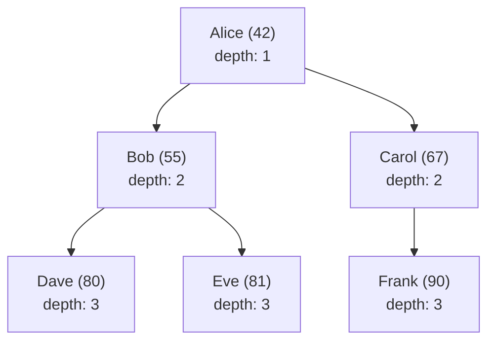

## SQL Standards and Dialects

SQL is defined by ANSI/ISO standards (SQL-86, SQL-89, SQL-92, SQL:1999, SQL:2003, SQL:2006,
SQL:2008, SQL:2011, SQL:2016, SQL:2019, SQL:2023). No database implements the full standard.
PostgreSQL has the broadest standards compliance among open-source databases. MySQL diverges
significantly. SQLite implements a large subset but omits many features (e.g., RIGHT JOIN, FULL
OUTER JOIN were added in 3.39.0, 2022).

When this document specifies behaviour, it defaults to PostgreSQL syntax unless otherwise noted.

## Data Definition Language (DDL)

DDL defines and modifies the database schema. These statements are transactional in PostgreSQL and
SQLite but often auto-commit in MySQL.

### CREATE TABLE

```sql
CREATE TABLE employees (
    emp_id       SERIAL        PRIMARY KEY,
    first_name   VARCHAR(100)  NOT NULL,
    last_name    VARCHAR(100)  NOT NULL,
    email        VARCHAR(255)  NOT NULL,
    hire_date    DATE          NOT NULL DEFAULT CURRENT_DATE,
    salary       NUMERIC(10,2) NOT NULL CHECK (salary > 0),
    department_id INTEGER      REFERENCES departments(dept_id) ON DELETE SET NULL,
    CONSTRAINT uq_email UNIQUE (email),
    CONSTRAINT chk_salary_range CHECK (salary >= 30000 AND salary <= 1000000)
);
```

Key elements:

- `SERIAL` (PostgreSQL) / `AUTO_INCREMENT` (MySQL) / `INTEGER PRIMARY KEY` (SQLite) for
  auto-generating keys
- `NOT NULL` -- the column must have a value
- `UNIQUE` -- no two rows can have the same value in this column
- `CHECK` -- an arbitrary boolean expression evaluated on insert/update
- `DEFAULT` -- value used when no explicit value is provided
- `REFERENCES` -- foreign key constraint with referential action

### Column Data Types

| Type Category   | PostgreSQL Types                           | Notes                                                                           |
| --------------- | ------------------------------------------ | ------------------------------------------------------------------------------- |
| Integers        | `SMALLINT`, `INTEGER`, `BIGINT`            | `INTEGER` is 4 bytes, `BIGINT` is 8 bytes                                       |
| Fixed precision | `NUMERIC(p,s)`, `DECIMAL(p,s)`             | Exact arithmetic; `NUMERIC(10,2)` holds up to 99,999,999.99                     |
| Floating point  | `REAL`, `DOUBLE PRECISION`                 | Inexact; avoid for financial data                                               |
| Variable string | `VARCHAR(n)`, `TEXT`                       | `VARCHAR` with length is a constraint, not a storage optimisation in PostgreSQL |
| Fixed string    | `CHAR(n)`                                  | Padded with spaces; rarely useful                                               |
| Boolean         | `BOOLEAN`                                  | `TRUE`, `FALSE`, `NULL`                                                         |
| Date/Time       | `DATE`, `TIME`, `TIMESTAMP`, `TIMESTAMPTZ` | `TIMESTAMPTZ` stores UTC; always prefer it over `TIMESTAMP`                     |
| Binary          | `BYTEA`                                    | Variable-length binary data                                                     |
| JSON            | `JSON`, `JSONB`                            | `JSONB` is stored in decomposed binary form; faster to query                    |
| UUID            | `UUID`                                     | Requires the `uuid-ossp` or `pgcrypto` extension                                |
| Array           | `INTEGER[]`, `TEXT[]`                      | PostgreSQL-specific extension                                                   |
| Network         | `INET`, `CIDR`, `MACADDR`                  | PostgreSQL-specific; enforces valid IP/MAC formats                              |

:::tip

Always use `TIMESTAMPTZ` instead of `TIMESTAMP`. `TIMESTAMP` does not store timezone information, so
you lose the context of when the event actually occurred. `TIMESTAMPTZ` converts to UTC on storage
and back to the session timezone on retrieval.

:::

### ALTER TABLE

```sql
ADD COLUMN:
ALTER TABLE employees ADD COLUMN middle_name VARCHAR(100);

DROP COLUMN:
ALTER TABLE employees DROP COLUMN middle_name;

RENAME COLUMN:
ALTER TABLE employees RENAME COLUMN first_name TO given_name;

ALTER COLUMN TYPE:
ALTER TABLE employees ALTER COLUMN salary TYPE NUMERIC(12,2);

ADD CONSTRAINT:
ALTER TABLE employees ADD CONSTRAINT chk_hire_date CHECK (hire_date >= '2000-01-01');

DROP CONSTRAINT:
ALTER TABLE employees DROP CONSTRAINT chk_salary_range;
```

:::warning

`ALTER TABLE` acquires an `ACCESS EXCLUSIVE` lock in PostgreSQL, which blocks all reads and writes
to the table for the duration of the operation. On large tables, adding a column with a default
value or changing a column type can take hours. Use `ALTER TABLE ... ADD COLUMN ... DEFAULT NULL`
(which is metadata-only in PostgreSQL 11+) or pg_partman for zero-downtime migrations.

:::

### DROP TABLE

```sql
DROP TABLE IF EXISTS employees;

DROP TABLE IF EXISTS employees CASCADE;
-- CASCADE drops all objects that depend on this table (views, foreign keys)
```

### CREATE INDEX

```sql
B-tree (default):
CREATE INDEX idx_employees_email ON employees(email);

Unique index:
CREATE UNIQUE INDEX idx_employees_email ON employees(email);

Composite index:
CREATE INDEX idx_employees_dept_hire ON employees(department_id, hire_date);

Concurrent index (no lock on reads/writes):
CREATE INDEX CONCURRENTLY idx_employees_email ON employees(email);
```

### CREATE TABLE AS / LIKE

```sql
CREATE TABLE employees_backup AS SELECT * FROM employees WHERE 1 = 0;
-- Creates an empty copy with the same columns and data types

CREATE TABLE employees_archive (LIKE employees INCLUDING ALL);
-- Copies columns, constraints, defaults, indexes, and storage settings
```

## Data Manipulation Language (DML)

### INSERT

```sql
INSERT INTO employees (first_name, last_name, email, hire_date, salary, department_id)
VALUES ('Ada', 'Lovelace', 'ada@example.com', '2024-01-15', 150000, 1);

INSERT INTO employees (first_name, last_name, email, hire_date, salary)
VALUES
    ('Grace', 'Hopper', 'grace@example.com', '2024-02-01', 140000),
    ('Margaret', 'Hamilton', 'margaret@example.com', '2024-03-01', 145000);

INSERT INTO employees (first_name, last_name, email, hire_date, salary)
SELECT first_name, last_name, email, hire_date, salary
FROM contractors
WHERE conversion_date IS NOT NULL;
```

### UPDATE

```sql
UPDATE employees
SET salary = salary * 1.10
WHERE department_id = 3 AND hire_date &lt; '2023-01-01';

UPDATE employees e
SET salary = (
    SELECT AVG(salary) * 1.05
    FROM employees
    WHERE department_id = e.department_id
)
WHERE e.emp_id = 42;
```

:::warning

An `UPDATE` without a `WHERE` clause modifies every row in the table. Always run a `SELECT` with the
same `WHERE` clause first to verify which rows will be affected. Consider wrapping destructive
updates in a transaction with a `SAVEPOINT` so you can roll back if the results are wrong.

:::

### DELETE

```sql
DELETE FROM employees
WHERE hire_date &lt; '2020-01-01' AND department_id IS NULL;

DELETE FROM employees e
USING departures d
WHERE e.emp_id = d.emp_id AND d.departure_date &lt; CURRENT_DATE - INTERVAL '90 days';
```

### TRUNCATE

```sql
TRUNCATE TABLE audit_log;
-- Faster than DELETE FROM audit_log for full-table clears
-- Not transactional in all databases (PostgreSQL: transactional; MySQL: DDL, auto-commits)
-- Resets identity columns (SERIAL)
-- Cannot be used on tables referenced by foreign keys (unless CASCADE)
```

### UPSERT (INSERT ... ON CONFLICT)

```sql
INSERT INTO employees (emp_id, first_name, last_name, email, salary)
VALUES (42, 'Ada', 'Lovelace', 'ada@example.com', 160000)
ON CONFLICT (emp_id)
DO UPDATE SET
    salary = EXCLUDED.salary,
    email = EXCLUDED.email
WHERE employees.salary &lt; EXCLUDED.salary;
```

`EXCLUDED` is a special table reference that holds the row that was proposed for insertion.

## SELECT: Query Fundamentals

### Basic Query Structure

```sql
SELECT [DISTINCT] select_list
FROM table_name [alias]
[JOIN join_clause]
[WHERE filter_condition]
[GROUP BY grouping_columns]
[HAVING group_filter]
[ORDER BY sort_columns]
[LIMIT row_count]
[OFFSET row_offset];
```

The logical order of execution (not the written order):

```text
1. FROM       -- identify the source relation(s)
2. WHERE      -- filter rows before grouping
3. GROUP BY   -- group rows by expression
4. HAVING     -- filter groups
5. SELECT     -- evaluate expressions, compute aliases
6. DISTINCT   -- remove duplicate rows
7. ORDER BY   -- sort the result set
8. LIMIT/OFFSET -- paginate
```

### WHERE Clause Predicates

```sql
Comparison operators:
WHERE salary > 100000
WHERE department_id = 5
WHERE name != 'Unknown'

Pattern matching:
WHERE email LIKE '%@example.com'
WHERE name ILIKE 'ada%'              -- case-insensitive (PostgreSQL)
WHERE code ~ '^[A-Z]{3}[0-9]{4}$'   -- POSIX regex (PostgreSQL)

Range:
WHERE hire_date BETWEEN '2023-01-01' AND '2023-12-31'

Set membership:
WHERE department_id IN (1, 3, 5, 7)
WHERE department_id IN (SELECT dept_id FROM departments WHERE location = 'NYC')

NULL handling:
WHERE manager_id IS NULL
WHERE email IS NOT NULL

Logical operators:
WHERE (salary > 100000 OR department_id = 1) AND hire_date >= '2022-01-01'
```

:::warning

`NULL` comparisons behave unexpectedly. `NULL = NULL` evaluates to `NULL` (not `TRUE`), so
`WHERE column = NULL` never matches any rows. Use `IS NULL` and `IS NOT NULL`. Similarly,
`NULL AND TRUE` is `NULL`, `NULL OR FALSE` is `NULL`, and `NOT NULL` is `NULL`. This three-valued
logic is the single greatest source of SQL bugs.

:::

### ORDER BY

```sql
ORDER BY salary DESC, hire_date ASC;

ORDER BY department_id NULLS LAST, salary DESC;  -- PostgreSQL extension
ORDER BY department_id NULLS FIRST;               -- PostgreSQL extension
```

### LIMIT and OFFSET

```sql
LIMIT 20 OFFSET 40;   -- rows 41-60

-- PostgreSQL 13+ for simple pagination:
FETCH FIRST 20 ROWS ONLY;

-- Keyset pagination (avoids OFFSET performance issues):
SELECT *
FROM orders
WHERE order_id > 1000   -- last seen ID from previous page
ORDER BY order_id
LIMIT 20;
```

:::tip

`OFFSET` requires the database to scan and discard `OFFSET` rows before returning results. For large
offsets (e.g., `OFFSET 100000`), this is slow because the database still processes 100,000 rows. Use
keyset pagination (also called seek pagination) instead:
`WHERE id &gt; last_seen_id ORDER BY id LIMIT 20`.

:::

## Joins

### INNER JOIN

Returns only rows where the join condition is satisfied in both tables.

```sql
SELECT e.first_name, d.department_name
FROM employees e
INNER JOIN departments d ON e.department_id = d.dept_id;
```

### LEFT OUTER JOIN

Returns all rows from the left table, with NULL for unmatched right-table columns.

```sql
SELECT e.first_name, d.department_name
FROM employees e
LEFT JOIN departments d ON e.department_id = d.dept_id;
-- Employees without a department appear with department_name = NULL
```

### RIGHT OUTER JOIN

Returns all rows from the right table, with NULL for unmatched left-table columns.

```sql
SELECT e.first_name, d.department_name
FROM employees e
RIGHT JOIN departments d ON e.department_id = d.dept_id;
-- Departments with no employees appear with first_name = NULL
```

### FULL OUTER JOIN

Returns all rows from both tables, with NULL where no match exists.

```sql
SELECT e.first_name, d.department_name
FROM employees e
FULL OUTER JOIN departments d ON e.department_id = d.dept_id;
-- Unmatched employees AND unmatched departments both appear
```

### CROSS JOIN

Returns the Cartesian product: every row from the left combined with every row from the right.

```sql
SELECT e.first_name, s.skill_name
FROM employees e
CROSS JOIN skills s;
-- If employees has 100 rows and skills has 50 rows, result has 5000 rows
```

### SELF JOIN

A table joined to itself, typically for hierarchical data (employee-manager, bill-of-materials).

```sql
SELECT e.first_name AS employee, m.first_name AS manager
FROM employees e
JOIN employees m ON e.manager_id = m.emp_id;
```

### Multiple Joins and Join Order

```sql
SELECT c.name AS customer, o.order_id, p.product_name, oi.quantity
FROM customers c
JOIN orders o ON c.customer_id = o.customer_id
JOIN order_items oi ON o.order_id = oi.order_id
JOIN products p ON oi.product_id = p.product_id
WHERE o.order_date >= '2024-01-01'
ORDER BY o.order_date DESC, c.name;
```

The query planner determines the physical join order, which may differ from the written order. Use
`EXPLAIN` to verify.

## Subqueries

### Scalar Subquery

Returns exactly one row and one column. Can appear anywhere an expression is valid.

```sql
SELECT first_name, salary,
    (SELECT AVG(salary) FROM employees) AS company_avg,
    salary - (SELECT AVG(salary) FROM employees) AS delta
FROM employees
WHERE department_id = 3;
```

### Correlated Subquery

References columns from the outer query. Executed once per outer row (often slow).

```sql
SELECT e.first_name, e.salary
FROM employees e
WHERE e.salary > (
    SELECT AVG(e2.salary)
    FROM employees e2
    WHERE e2.department_id = e.department_id
);
```

:::warning

Correlated subqueries execute the inner query once for each row in the outer query. For large
tables, this is $O(n)$ subquery executions. Rewrite as a join or a window function when possible:

```sql
-- Equivalent join (usually faster):
SELECT e.first_name, e.salary, d.avg_salary
FROM employees e
JOIN (
    SELECT department_id, AVG(salary) AS avg_salary
    FROM employees
    GROUP BY department_id
) d ON e.department_id = d.department_id
WHERE e.salary > d.avg_salary;
```

:::

### EXISTS and NOT EXISTS

Tests whether a subquery returns any rows. Typically the most efficient form of subquery.

```sql
-- Customers who have placed at least one order:
SELECT c.customer_id, c.name
FROM customers c
WHERE EXISTS (
    SELECT 1 FROM orders o
    WHERE o.customer_id = c.customer_id
);

-- Departments with no employees:
SELECT d.dept_id, d.department_name
FROM departments d
WHERE NOT EXISTS (
    SELECT 1 FROM employees e
    WHERE e.department_id = d.dept_id
);
```

### IN and NOT IN

```sql
-- Employees in specific departments:
SELECT first_name FROM employees
WHERE department_id IN (1, 2, 3);

-- Employees not in any department (works with NULLs):
SELECT first_name FROM employees
WHERE department_id NOT IN (SELECT dept_id FROM departments);
-- WARNING: if any dept_id is NULL, NOT IN returns no rows at all!
-- Use NOT EXISTS instead when NULLs are possible.
```

:::warning

`NOT IN` with a subquery that can return NULL yields zero rows, because `x NOT IN (1, 2, NULL)`
evaluates to `x != 1 AND x != 2 AND x != NULL`, and `x != NULL` is `NULL` (not `TRUE`). Always use
`NOT EXISTS` instead of `NOT IN` when the subquery might return NULL values.

:::

### ANY and ALL

```sql
-- Employees earning more than ANY employee in department 5:
SELECT first_name FROM employees
WHERE salary > ANY (SELECT salary FROM employees WHERE department_id = 5);

-- Employees earning more than ALL employees in department 5:
SELECT first_name FROM employees
WHERE salary > ALL (SELECT salary FROM employees WHERE department_id = 5);
```

## Set Operations

Combine the results of two or more queries. All queries must have the same number of columns and
compatible data types.

```sql
UNION (removes duplicates):
SELECT city FROM customers
UNION
SELECT city FROM suppliers;

UNION ALL (keeps duplicates; faster):
SELECT event_type FROM audit_log_2023
UNION ALL
SELECT event_type FROM audit_log_2024;

INTERSECT:
SELECT customer_id FROM orders_2023
INTERSECT
SELECT customer_id FROM orders_2024;

EXCEPT:
SELECT customer_id FROM customers
EXCEPT
SELECT customer_id FROM churned_accounts;
```

## Aggregate Functions and Grouping

### Aggregate Functions

```sql
COUNT(*)          -- count all rows, including NULLs
COUNT(column)     -- count non-NULL values in column
COUNT(DISTINCT column) -- count unique non-NULL values
SUM(column)       -- sum of non-NULL numeric values
AVG(column)       -- arithmetic mean of non-NULL numeric values
MIN(column)       -- minimum non-NULL value
MAX(column)       -- maximum non-NULL value
```

:::info

`AVG(salary)` excludes rows where `salary IS NULL` from both the sum and the count. If you need to
treat NULL as zero, use `AVG(COALESCE(salary, 0))`, but understand that this changes the semantics:
NULL means "unknown," not "zero."

:::

### GROUP BY

```sql
SELECT department_id, COUNT(*) AS headcount, AVG(salary) AS avg_salary
FROM employees
GROUP BY department_id
ORDER BY avg_salary DESC;
```

Every column in the `SELECT` list must either appear in the `GROUP BY` clause or be wrapped in an
aggregate function. PostgreSQL is strict about this; MySQL (with `ONLY_FULL_GROUP_BY` disabled)
allows ambiguous queries.

### HAVING

Filters groups after aggregation. `WHERE` filters rows before aggregation.

```sql
SELECT department_id, AVG(salary) AS avg_salary
FROM employees
WHERE hire_date >= '2022-01-01'    -- filter individual rows first
GROUP BY department_id
HAVING AVG(salary) > 100000         -- then filter aggregated groups
ORDER BY avg_salary DESC;
```

### GROUPING SETS, CUBE, ROLLUP

PostgreSQL extensions for multi-level grouping:

```sql
-- GROUPING SETS: specify multiple groupings in one query
SELECT department_id, job_title, COUNT(*), AVG(salary)
FROM employees
GROUP BY GROUPING SETS (
    (department_id, job_title),
    (department_id),
    ()
);

-- ROLLUP: hierarchical subtotals
SELECT region, country, SUM(revenue)
FROM sales
GROUP BY ROLLUP (region, country);
-- Produces: (region, country), (region), ()

-- CUBE: all possible combinations
SELECT region, channel, product_line, SUM(revenue)
FROM sales
GROUP BY CUBE (region, channel, product_line);
-- Produces: all 8 combinations of 3 columns
```

## Window Functions

Window functions perform a calculation across a set of table rows related to the current row. Unlike
aggregate functions with `GROUP BY`, they do not collapse rows -- every input row produces an output
row.

### Syntax

```sql
function_name(args) OVER (
    [PARTITION BY partition_expression]
    [ORDER BY sort_expression [ASC|DESC] [NULLS {FIRST|LAST}]]
    [frame_clause: ROWS|RANGE BETWEEN start AND end]
)
```

### ROW_NUMBER, RANK, DENSE_RANK

```sql
SELECT emp_id, department_id, salary,
    ROW_NUMBER() OVER (PARTITION BY department_id ORDER BY salary DESC) AS row_num,
    RANK()       OVER (PARTITION BY department_id ORDER BY salary DESC) AS rank,
    DENSE_RANK() OVER (PARTITION BY department_id ORDER BY salary DESC) AS dense_rank
FROM employees;
```

| salary | ROW_NUMBER | RANK | DENSE_RANK |
| ------ | ---------- | ---- | ---------- |
| 150000 | 1          | 1    | 1          |
| 150000 | 2          | 1    | 1          |
| 140000 | 3          | 3    | 2          |
| 140000 | 4          | 3    | 2          |
| 130000 | 5          | 5    | 3          |

- `ROW_NUMBER`: assigns a unique sequential integer to each row within the partition
- `RANK`: ties get the same rank; next rank skips (1, 1, 3, 3, 5)
- `DENSE_RANK`: ties get the same rank; next rank does not skip (1, 1, 2, 2, 3)

### LAG and LEAD

Access values from preceding or following rows:

```sql
SELECT order_date, revenue,
    LAG(revenue, 1) OVER (ORDER BY order_date) AS prev_day_revenue,
    LEAD(revenue, 1) OVER (ORDER BY order_date) AS next_day_revenue,
    revenue - LAG(revenue, 1) OVER (ORDER BY order_date) AS day_over_day_change
FROM daily_sales;
```

### Aggregate Window Functions

```sql
-- Running total:
SELECT order_date, amount,
    SUM(amount) OVER (ORDER BY order_date
        ROWS BETWEEN UNBOUNDED PRECEDING AND CURRENT ROW) AS running_total;

-- Moving average (7-day):
SELECT order_date, amount,
    AVG(amount) OVER (ORDER BY order_date
        ROWS BETWEEN 6 PRECEDING AND CURRENT ROW) AS ma_7day;

-- Percentage of total:
SELECT department_id, salary,
    salary / SUM(salary) OVER (PARTITION BY department_id) AS pct_of_dept_salary
FROM employees;

-- First and last value in partition:
SELECT emp_id, department_id, hire_date,
    FIRST_VALUE(hire_date) OVER (PARTITION BY department_id ORDER BY hire_date) AS earliest_hire,
    LAST_VALUE(hire_date) OVER (
        PARTITION BY department_id ORDER BY hire_date
        ROWS BETWEEN UNBOUNDED PRECEDING AND UNBOUNDED FOLLOWING
    ) AS latest_hire
FROM employees;
```

:::warning

The default frame clause for aggregate window functions with `ORDER BY` is
`RANGE BETWEEN UNBOUNDED PRECEDING AND CURRENT ROW`, which includes all peers (rows with the same
ORDER BY value). This means `SUM(amount) OVER (ORDER BY date)` gives a running total that includes
all rows with the same date. Use `ROWS` instead of `RANGE` if you want strict positional framing.

:::

## Common Table Expressions (CTEs)

CTEs (the `WITH` clause) create named temporary result sets that exist for the duration of a single
query. They improve readability and enable recursive queries.

### Non-Recursive CTEs

```sql
WITH dept_stats AS (
    SELECT department_id,
           COUNT(*) AS headcount,
           AVG(salary) AS avg_salary,
           MAX(salary) AS max_salary
    FROM employees
    GROUP BY department_id
),
top_earners AS (
    SELECT e.first_name, e.last_name, e.salary, d.department_id, d.avg_salary
    FROM employees e
    JOIN dept_stats d ON e.department_id = d.department_id
    WHERE e.salary = d.max_salary
)
SELECT * FROM top_earners ORDER BY salary DESC;
```

### Data-Modifying CTEs

PostgreSQL allows INSERT, UPDATE, DELETE inside CTEs:

```sql
WITH archived AS (
    DELETE FROM orders
    WHERE order_date &lt; '2023-01-01'
    RETURNING *
)
INSERT INTO order_archive
SELECT * FROM archived;
```

### Recursive CTEs

Recursive CTEs solve problems involving hierarchical or graph-like data: org charts,
bill-of-materials, thread/comment trees, path finding.

```sql
-- Find all employees in the hierarchy under employee 42 (direct and indirect reports):
WITH RECURSIVE hierarchy AS (
    -- Base case: the manager
    SELECT emp_id, first_name, manager_id, 1 AS depth
    FROM employees
    WHERE emp_id = 42

    UNION ALL

    -- Recursive case: direct reports of each row in the hierarchy
    SELECT e.emp_id, e.first_name, e.manager_id, h.depth + 1
    FROM employees e
    JOIN hierarchy h ON e.manager_id = h.emp_id
)
SELECT * FROM hierarchy ORDER BY depth, first_name;
```



:::warning

Recursive CTEs without a termination condition loop infinitely (until the database kills the query
or the process runs out of memory). Always include a depth counter or a visited set. MySQL limits
recursion depth to 100 by default (`cte_max_recursion_depth`). PostgreSQL has no recursion depth
limit, so an unbounded recursive CTE will run until it OOMs.

:::

## CASE Expressions

```sql
-- Simple CASE:
SELECT salary,
    CASE salary
        WHEN &lt; 50000 THEN 'Entry'
        WHEN &lt; 100000 THEN 'Mid'
        WHEN &lt; 150000 THEN 'Senior'
        ELSE 'Executive'
    END AS salary_band
FROM employees;

-- Searched CASE:
SELECT first_name, salary,
    CASE
        WHEN salary >= 150000 AND department_id = 1 THEN 'Senior IC'
        WHEN salary >= 150000 THEN 'Senior'
        WHEN department_id IS NULL THEN 'Unassigned'
        ELSE 'Standard'
    END AS classification
FROM employees;
```

CASE is an expression, not a statement. It returns a value and can be used anywhere an expression is
valid: in SELECT, WHERE, ORDER BY, and even inside other CASE expressions.

```sql
-- CASE in ORDER BY for custom sorting:
SELECT * FROM tasks
ORDER BY
    CASE priority
        WHEN 'critical' THEN 1
        WHEN 'high' THEN 2
        WHEN 'medium' THEN 3
        WHEN 'low' THEN 4
        ELSE 5
    END,
    created_at;
```

## NULL Handling

```sql
COALESCE(a, b, c)       -- returns first non-NULL argument
NULLIF(a, b)            -- returns NULL if a = b, otherwise returns a
COALESCE(NULLIF(phone, ''), '(no phone)')

-- Conditional aggregation (count only non-NULL):
SELECT
    COUNT(*) AS total_employees,
    COUNT(manager_id) AS has_manager,
    COUNT(*) - COUNT(manager_id) AS no_manager
FROM employees;

-- NULL-safe comparison:
-- a IS DISTINCT FROM b (PostgreSQL standard)
-- a &lt;=&gt; b (MySQL, also supported by PostgreSQL)
SELECT * FROM employees
WHERE commission_rate IS DISTINCT FROM 0;
-- Returns rows where commission_rate is NULL or different from 0
```

:::tip

Use `COALESCE` to provide defaults for NULL values in application queries. Use `NULLIF` to prevent
division-by-zero errors: `ratio = a / NULLIF(b, 0)` returns NULL instead of raising an error when
`b` is zero.

:::

## Common Pitfalls

### Off-by-One Errors with BETWEEN

`BETWEEN` is inclusive on both ends: `WHERE date BETWEEN '2024-01-01' AND '2024-01-31'` includes
both endpoints. If `date` is a `TIMESTAMPTZ`, `BETWEEN '2024-01-01' AND '2024-01-31'` actually means
up to `2024-01-31 00:00:00`, excluding all timestamps on January 31st after midnight. Use
`WHERE date >= '2024-01-01' AND date &lt; '2024-02-01'` for date-range comparisons with timestamps.

### Assuming ORDER BY Without Explicit ORDER BY

SQL tables and result sets have no guaranteed ordering unless you specify `ORDER BY`. A query
without `ORDER BY` may return rows in any order, and that order may change between executions, after
an `ANALYZE`, or after a version upgrade.

### Using DISTINCT as a Substitute for Proper Joins

`SELECT DISTINCT` to remove duplicates caused by an incorrect join is a performance anti-pattern. If
your join produces duplicates, the join condition or the schema is wrong. Fix the root cause.

### Forgetting That COUNT(column) Skips NULLs

`COUNT(*)` counts rows. `COUNT(column)` counts non-NULL values. `COUNT(DISTINCT column)` counts
unique non-NULL values. Confusing these produces incorrect results, especially in reports and
dashboards.

### Implicit Type Coercion

PostgreSQL is strict about types: `WHERE id = '42'` works (string is cast to integer) but
`WHERE name = 42` raises an error. MySQL silently coerces: `WHERE 'abc' = 0` evaluates to `TRUE`
because the string is cast to zero. Always match types explicitly.

### Not Using Parameterised Queries

String-concatenating values into SQL queries creates SQL injection vulnerabilities and prevents
query plan caching. Always use parameterised queries (prepared statements) in application code:

```text
-- WRONG:
"SELECT * FROM users WHERE email = '" + user_input + "'"

-- CORRECT:
"SELECT * FROM users WHERE email = $1", [user_input]
```
