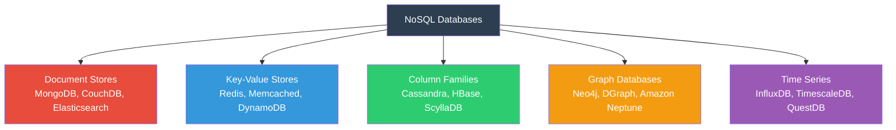
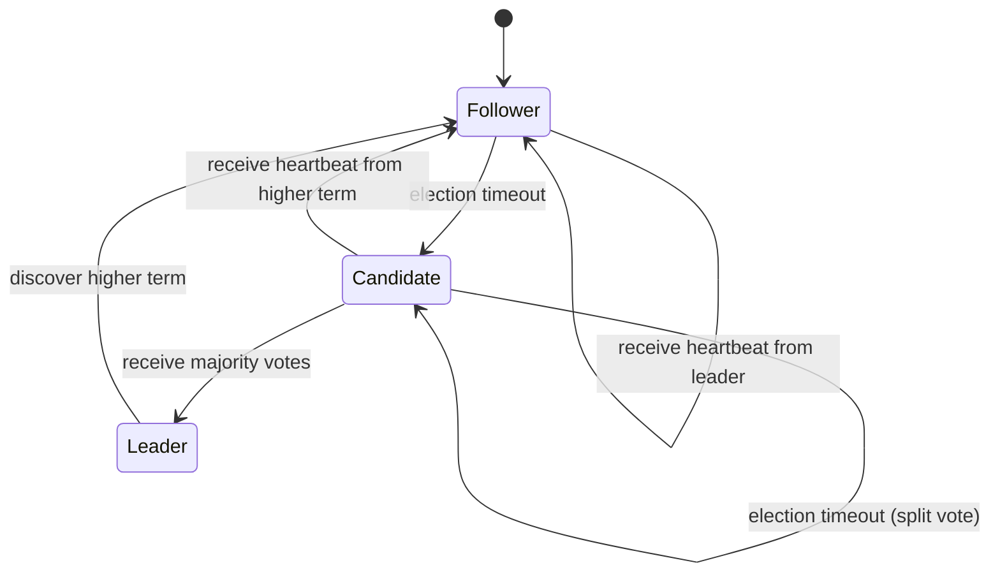

## The CAP Theorem

The CAP theorem, formalised by Gilbert and Lynch in 2002 based on Brewer's 2000 conjecture, states
that a distributed data store can provide at most two of three guarantees:

- **Consistency (C):** every read receives the most recent write or an error
- **Availability (A):** every request receives a non-error response (without guarantee about which
  data version)
- **Partition Tolerance (P):** the system continues to operate despite arbitrary message loss or
  delay between nodes

### Why P Is Non-Negotiable

Network partitions are not theoretical -- they happen regularly in production. A switch fails, a DNS
update propagates slowly, a garbage collector pause causes a timeout, a cross-datacenter link
degrades. Any distributed system must tolerate partitions, which means the real choice is between
**CP** and **AP**:

| Category | Strategy                                                       | Example Systems                                             |
| -------- | -------------------------------------------------------------- | ----------------------------------------------------------- |
| CP       | Preserve consistency, sacrifice availability during partitions | PostgreSQL (sync replicas), HBase, Redis (with replication) |
| AP       | Preserve availability, sacrifice consistency during partitions | MongoDB (default, w:1), Cassandra, DynamoDB, CouchDB, Riak  |

### The PACELC Theorem

The PACELC theorem (Abadi, 2012) extends CAP: when there is **no** partition (the EL part), the
system must choose between **L**atency and **C**onsistency:

$$\mathrm{PA} \to \mathrm{EL} : \mathrm{when no partition, prefer availability and latency over consistency}$$

$$\mathrm{PC} \to \mathrm{EC} : \mathrm{when no partition, prefer consistency, accepting higher latency}$$

This captures a nuance that CAP misses: even during normal operation (no partition), systems make
consistency-latency trade-offs. DynamoDB defaults to eventual consistency for low latency but can be
configured for strong consistency (higher latency). Cassandra defaults to eventual consistency but
supports tunable consistency per operation.

### Consistency Models: A Spectrum

Consistency is not binary. There is a spectrum of consistency models, from strongest to weakest:

| Model              | Guarantee                                                         | Examples                               |
| ------------------ | ----------------------------------------------------------------- | -------------------------------------- |
| Linearizable       | Operations appear to execute atomically and in real-time order    | Single-node databases, ZooKeeper       |
| Sequential         | Operations appear in some total order consistent with real time   | Google Spanner (external consistency)  |
| Serializable       | Equivalent to some serial execution of transactions               | PostgreSQL SERIALIZABLE                |
| Snapshot Isolation | Each transaction reads from a consistent snapshot                 | PostgreSQL REPEATABLE READ             |
| Causal             | Causally related operations are seen by all nodes in order        | DynamoDB (with consistent reads)       |
| Read-your-writes   | A reader always sees its own writes                               | Most systems with sticky sessions      |
| Session            | Consistency within a single client session                        | MongoDB (read preference)              |
| Eventual           | If no new writes, all reads eventually converge to the same value | Cassandra, CouchDB, DynamoDB (default) |

:::warning

"Eventual consistency" does not mean "will eventually be consistent in a bounded time." It means
that if you stop writing, the system will converge. In practice, convergence time depends on the
system, the network, and the write volume. In a partition, convergence may be indefinite.

:::

## NoSQL Categories

NoSQL is not a single technology -- it is a category of databases that provide alternatives to the
relational model. The four primary categories are document stores, key-value stores, column-family
stores, and graph databases.



## Document Stores

Document stores model data as JSON/BSON documents. Each document is a self-contained unit with a
flexible schema -- documents within the same collection can have different fields.

### MongoDB

MongoDB is the most widely deployed document store. It provides a query language, secondary indexes,
aggregation pipelines, and multi-document ACID transactions (since version 4.0).

```javascript
// Insert a document
db.orders.insertOne({
  order_id: 'ORD-001',
  customer: {
    name: 'Ada Lovelace',
    email: 'ada@example.com',
  },
  items: [
    { product_id: 'P1', quantity: 2, price: 29.99 },
    { product_id: 'P2', quantity: 1, price: 149.99 },
  ],
  shipping_address: {
    street: '123 Analysis Lane',
    city: 'London',
    country: 'UK',
  },
  total: 209.97,
  status: 'shipped',
  created_at: new Date('2024-03-15T10:30:00Z'),
});

// Query with secondary index
db.orders.find({ 'customer.email': 'ada@example.com', status: 'shipped' });

// Aggregation pipeline
db.orders.aggregate([
  { $match: { status: 'completed' } },
  { $unwind: '$items' },
  {
    $group: {
      _id: '$items.product_id',
      total_quantity: { $sum: '$items.quantity' },
      total_revenue: { $sum: { $multiply: ['$items.quantity', '$items.price'] } },
    },
  },
  { $sort: { total_revenue: -1 } },
  { $limit: 10 },
]);
```

### Data Modeling in Document Stores

Document stores encourage **denormalization**: embed related data within a document rather than
joining separate collections. The decision between embedding and referencing mirrors the
normalization vs denormalization trade-off:

**Embed when:**

- The related data is always read with the parent (e.g., order items within an order)
- The embedded data is bounded in size (MongoDB documents have a 16MB limit)
- The embedded data changes rarely or changes atomically with the parent

**Reference when:**

- The related data is shared across multiple documents
- The related data changes frequently and independently
- The related data is unbounded (e.g., a product's order history)

```javascript
// Embedded (order items within order):
{
    order_id: "ORD-001",
    customer_id: "CUST-042",
    items: [
        { product_id: "P1", quantity: 2, price: 29.99 },
        { product_id: "P2", quantity: 1, price: 149.99 }
    ]
}

// Referenced (customer as separate document):
// orders collection:
{ order_id: "ORD-001", customer_id: "CUST-042", items: [...] }
// customers collection:
{ customer_id: "CUST-042", name: "Ada Lovelace", email: "ada@example.com" }
```

### CouchDB

CouchDB is an AP system designed for offline-first applications. Every node can accept writes
independently, and conflicts are resolved using deterministic merge functions (revision trees).

Key characteristics:

- MVCC with multi-master replication
- Built-in conflict detection and resolution
- Map-reduce views for querying
- REST API (everything is HTTP)
- Designed for high availability in unreliable network conditions

Use cases: mobile applications with offline support, configuration management, content management
systems where conflicts are rare and resolution is straightforward.

## Key-Value Stores

Key-value stores are the simplest NoSQL category: store a value under a key, retrieve it by key. No
queries, no secondary indexes (in the basic form), no joins. The value is opaque to the database --
it can be a string, a serialized object, a JSON document, or binary data.

### Redis

Redis is an in-memory key-value store with optional persistence. It is not just a simple key-value
store -- it supports a rich set of data structures and operations.

#### Redis Data Structures

| Structure   | Commands                                   | Use Cases                                   |
| ----------- | ------------------------------------------ | ------------------------------------------- |
| Strings     | `GET`, `SET`, `INCR`, `SETEX`, `GETSET`    | Caching, counters, rate limiting            |
| Lists       | `LPUSH`, `RPUSH`, `LPOP`, `RPOP`, `LRANGE` | Queues, stacks, recent items                |
| Sets        | `SADD`, `SREM`, `SMEMBERS`, `SISMEMBER`    | Unique collections, tagging, membership     |
| Sorted Sets | `ZADD`, `ZRANGE`, `ZRANK`, `ZSCORE`        | Leaderboards, ranges, priority queues       |
| Hashes      | `HSET`, `HGET`, `HMSET`, `HGETALL`         | Object storage, session data                |
| Bitmaps     | `SETBIT`, `GETBIT`, `BITCOUNT`, `BITOP`    | Feature flags, analytics                    |
| HyperLogLog | `PFADD`, `PFCOUNT`, `PFMERGE`              | Cardinality estimation (unique visitors)    |
| Streams     | `XADD`, `XREAD`, `XREADGROUP`, `XACK`      | Event sourcing, message queues, time series |
| Geospatial  | `GEOADD`, `GEORADIUS`, `GEOSEARCH`         | Location-based features                     |

#### Redis Persistence

```bash
# RDB (point-in-time snapshots):
save 900 1       # save after 900 seconds if at least 1 key changed
save 300 10      # save after 300 seconds if at least 10 keys changed
save 60 10000    # save after 60 seconds if at least 10000 keys changed

# AOF (Append-Only File): every write operation is logged
appendonly yes
appendfsync everysec   # fsync once per second (good balance)
# appendfsync always    # fsync on every write (safest, slowest)
# appendfsync no        # let OS decide (fastest, least safe)
```

| Mode      | Pros                                                     | Cons                                  |
| --------- | -------------------------------------------------------- | ------------------------------------- |
| RDB       | Compact files, fast restart, low overhead                | Data loss between snapshots (minutes) |
| AOF       | Minimal data loss (1 second at most)                     | Larger files, slower restart          |
| RDB + AOF | Best of both (AOF for durability, RDB for restart speed) | More disk usage, more complexity      |

#### Redis Clustering

Redis Cluster provides horizontal partitioning (sharding) across multiple nodes:

- **Hash slots:** 16,384 hash slots distributed across nodes
- **Key hash:** `CRC16(key) % 16384` determines the slot
- **Hash tags:** `{user:123}:profile` and `{user:123}:settings` map to the same slot
- **Replication:** each master has one or more replicas; automatic failover
- **Minimum:** 6 nodes (3 masters + 3 replicas)

```bash
# Create a 6-node cluster:
redis-cli --cluster create \
    10.0.0.1:7000 10.0.0.2:7000 10.0.0.3:7000 \
    10.0.0.4:7000 10.0.0.5:7000 10.0.0.6:7000 \
    --cluster-replicas 1
```

:::warning

Redis Cluster does **not** support multi-key operations across different hash slots. If you need to
atomically update `user:123:profile` and `user:123:settings`, they must have the same hash tag
prefix (`{user:123}`). Operations like `MGET` on keys with different hash tags will fail with a
`CROSSSLOT` error.

:::

### Memcached

Memcached is a simpler, multi-threaded, in-memory key-value cache with no persistence and no
built-in clustering. It uses consistent hashing for distribution and is designed specifically for
caching:

- LRU eviction when memory is full
- No authentication
- No replication
- No persistence (purely volatile cache)
- Multi-threaded (better CPU utilisation than Redis for simple get/set)

Use Memcached when you need a simple, high-throughput cache and do not need Redis's data structures,
persistence, or clustering.

## Column-Family Stores

Column-family stores (also called wide-column stores) are designed for massive write throughput and
efficient access to columns within rows. They are optimised for workloads where rows can have
millions of columns and queries access a subset of columns.

### Architecture

Data is stored in column families, where each column family contains related columns. On disk, data
is stored by column family (not by row), which makes reading all values of a specific column across
many rows very efficient.

```text
Traditional row-oriented storage:
| row_key | col1 | col2 | col3 | col4 |
|---------|------|------|------|------|
| user1   | Ada  | 30   | UK   | eng  |
| user2   | Bob  | 25   | US   | math |

Column-family storage (on disk):
Column Family "info":    Column Family "location":
| row_key | col1 | col2 |  | row_key | col3 | col4 |
|---------|------|------|  |---------|------|------|
| user1   | Ada  | 30   |  | user1   | UK   | eng  |
| user2   | Bob  | 25   |  | user2   | US   | math |
```

### Cassandra

Cassandra is a distributed, AP column-family store designed for linear scalability and high
availability across multiple data centers.

#### Architecture

- **Ring topology:** nodes communicate via gossip protocol
- **No master:** every node is equal; any node can accept reads and writes
- **Tunable consistency:** per-operation consistency level
- **Automatic sharding:** consistent hashing with virtual nodes (vnodes)
- **Built-in replication:** configurable replication factor per keyspace
- **Repair process:** anti-entropy repair synchronises data between replicas

#### Consistency Levels

| Level          | Description                                                         |
| -------------- | ------------------------------------------------------------------- |
| `ONE`          | Coordinator returns after one replica responds (fastest)            |
| `QUORUM`       | Coordinator returns after a majority of replicas respond            |
| `ALL`          | Coordinator returns after all replicas respond (slowest, strongest) |
| `LOCAL_QUORUM` | Quorum within the local data center only                            |
| `EACH_QUORUM`  | Quorum in each data center (for multi-DC writes)                    |
| `SERIAL`       | Linearizable consistency for lightweight transactions               |

For reads and writes to be consistent (read-your-writes), the sum of read and write consistency
levels must exceed the replication factor:

$$W + R \gt RF$$

For example, with replication factor 3: `QUORUM` writes + `QUORUM` reads ($2 + 2 = 4 \gt 3$)
guarantees that the read sees the latest write.

#### Data Model

```sql
CREATE KEYSPACE analytics
    WITH replication = {'class': 'NetworkTopologyStrategy', 'dc1': 3, 'dc2': 2};

CREATE TABLE events (
    tenant_id    TEXT,
    event_id     TIMEUUID,
    event_type   TEXT,
    payload      TEXT,
    created_at   TIMESTAMP,
    PRIMARY KEY ((tenant_id), event_id)
) WITH CLUSTERING ORDER BY (event_id DESC)
  AND compaction = {'class': 'TimeWindowCompactionStrategy'};

-- Partition key: (tenant_id) -- determines which nodes store the data
-- Clustering key: event_id -- determines sort order within the partition
-- This means: all events for a tenant are stored together on the same nodes,
-- sorted by event_id (which includes a timestamp component)
```

:::warning

Cassandra's data model requires you to design around queries, not entities. Unlike relational
databases where you model entities and then write queries to access them, in Cassandra you model the
queries and denormalise data to support each query pattern. A common rule: one table per query
pattern.

:::

### ScyllaDB

ScyllaDB is a C++ rewrite of Cassandra that is compatible with the Cassandra protocol and CQL. It
uses a shard-per-core architecture (separate CPU core handles its own subset of data) and avoids JVM
garbage collection pauses that can affect Cassandra's latency.

Key advantages over Cassandra:

- Latency: typically 5-10x lower P99 latency
- Throughput: higher per-node throughput
- No GC pauses: C++ with seastar framework, no garbage collector
- Cassandra-compatible: same CQL drivers and query language

### HBase

HBase is a CP column-family store built on top of HDFS, designed for massive tables (billions of
rows, millions of columns) with strict consistency.

Key characteristics:

- Uses ZooKeeper for coordination and master election
- Strong consistency within a region (single master per region)
- Integrates with Hadoop MapReduce and Spark
- Optimised for sequential writes (write-ahead log + memstore + HFiles)
- Not designed for random reads; best for scan-heavy workloads

## Graph Databases

Graph databases model data as nodes (entities) and edges (relationships), optimising for queries
that traverse relationships. They are the natural choice for data with complex, interconnected
relationships: social networks, fraud detection, recommendation engines, knowledge graphs.

### Neo4j

Neo4j is the most widely deployed graph database. It provides the Cypher query language for
expressing graph patterns.

```cypher
-- Create nodes and relationships
CREATE (alice:Person {name: 'Alice', age: 30})
CREATE (bob:Person {name: 'Bob', age: 25})
CREATE (carol:Person {name: 'Carol', age: 35})
CREATE (alice)-[:KNOWS {since: 2020}]->(bob)
CREATE (bob)-[:KNOWS {since: 2021}]->(carol)
CREATE (alice)-[:WORKS_AT {role: 'Engineer'}]->(:Company {name: 'Acme Corp'})

-- Find friends of friends (2-hop traversal)
MATCH (p1:Person {name: 'Alice'})-[:KNOWS]->(friend:Person)-[:KNOWS]->(fof:Person)
WHERE fof <> p1
RETURN DISTINCT fof.name, fof.age

-- Find the shortest path between two people
MATCH p = shortestPath(
    (start:Person {name: 'Alice'})-[:KNOWS*]-(end:Person {name: 'Carol'})
)
RETURN p
```

### When to Use Graph Databases

**Use a graph database when:**

- Your queries involve multi-hop traversals (friends of friends of friends)
- Relationships between entities are as important as the entities themselves
- You need to compute graph algorithms (shortest path, centrality, community detection)
- The join-heavy queries in a relational database become prohibitively slow

**Do NOT use a graph database when:**

- Your data is primarily tabular with simple relationships
- You need strong ACID guarantees across the entire graph
- Your workload is mostly simple CRUD operations
- Your team has no graph database expertise

:::tip

A graph database is not a replacement for a relational database. Many production systems use a
relational database for transactional data and a graph database for relationship-heavy queries. This
is the **polyglot persistence** pattern: use the right tool for each part of the problem.

:::

## Time Series Databases

Time series databases are optimised for storing and querying data points indexed by time. They are
the standard for monitoring, IoT sensor data, financial tick data, and application metrics.

### InfluxDB

InfluxDB is purpose-built for time series data:

```sql
-- Write data points
INSERT cpu_usage,host=server1,region=us-east value=75.2 1710500000000000000

-- Query with time range and aggregation
SELECT mean(value) FROM cpu_usage
WHERE host = 'server1' AND time >= now() - 1h
GROUP BY time(5m), host
FILL(previous)
```

Key features:

- Retention policies: automatically drop old data
- Continuous queries: precompute aggregations
- Downsampling: reduce granularity of old data
- Native HTTP API

### TimescaleDB

TimescaleDB extends PostgreSQL with time series functionality:

```sql
-- Create a hypertable (automatically partitioned by time)
CREATE TABLE sensor_readings (
    time        TIMESTAMPTZ   NOT NULL,
    sensor_id   INTEGER       NOT NULL,
    temperature DOUBLE PRECISION,
    humidity    DOUBLE PRECISION
);

SELECT create_hypertable('sensor_readings', 'time');

-- Create a continuous aggregate (materialised view refreshed automatically)
CREATE MATERIALIZED VIEW sensor_hourly
WITH (timescaledb.continuous) AS
SELECT
    time_bucket('1 hour', time) AS bucket,
    sensor_id,
    AVG(temperature) AS avg_temp,
    MAX(humidity) AS max_humidity
FROM sensor_readings
GROUP BY bucket, sensor_id;

-- Compression (reduces storage by 90%+ for historical data)
ALTER TABLE sensor_readings SET (
    timescaledb.compress,
    timescaledb.compress_segmentby = 'sensor_id'
);

SELECT add_compression_policy('sensor_readings', INTERVAL '7 days');
```

## When to Choose NoSQL vs Relational

### Choose Relational When

- Your data has strong, well-defined relationships requiring complex joins
- ACID transactions are non-negotiable (financial, inventory, order management)
- Your schema is stable and evolves slowly
- Your team is experienced with SQL
- You need complex queries, aggregations, and ad-hoc reporting
- Regulatory requirements demand strong consistency and audit trails

### Choose NoSQL When

- Your access patterns are simple and well-known
- You need horizontal scalability beyond what read replicas provide
- Your data schema is flexible or evolving rapidly
- Your workload is extremely write-heavy
- You need to store semi-structured or unstructured data (JSON, logs, events)
- Latency requirements are strict and predictable

### Polyglot Persistence

Modern systems often use multiple database technologies, each optimised for a specific workload:

```text
Service Architecture with Polyglot Persistence:

  Web App --> Relational DB (PostgreSQL)
               User accounts, orders, transactions, financial data

  Web App --> Document Store (MongoDB)
               Product catalog, user profiles, content management

  Web App --> Key-Value Cache (Redis)
               Session data, rate limiting, feature flags, real-time leaderboards

  Web App --> Time Series DB (TimescaleDB)
               Metrics, sensor data, application performance monitoring

  Web App --> Search Engine (Elasticsearch)
               Full-text search, log aggregation, analytics
```

:::warning

Polyglot persistence increases operational complexity. Each database has its own backup strategy,
replication configuration, monitoring, upgrade path, and failure modes. Before introducing a new
database technology, ensure your team has the expertise to operate it in production. The cost of
operating 5 different databases often exceeds the cost of operating one database that handles 80% of
your use cases adequately.

:::

## Common Pitfalls

### Using NoSQL to Avoid Learning SQL

Choosing MongoDB or Cassandra because "SQL is hard" leads to data integrity problems that are far
harder to debug than SQL queries. If your data has relationships, normalisation requirements, and
transactional needs, a relational database is the right tool regardless of how you feel about SQL.

### Ignoring Consistency Tuning

Many NoSQL databases default to eventual consistency. If your application assumes strong consistency
(e.g., reading a value immediately after writing it), you will see stale data. Always configure
consistency levels explicitly based on your application's requirements.

### Modelling Relational Patterns in NoSQL

Designing a Cassandra table with many small partitions, or a MongoDB collection with frequent
inter-document references that require application-level joins, defeats the purpose of using NoSQL.
Model around your access patterns, not your entity relationships.

### Underestimating Operational Complexity

Running a Redis cluster, a Cassandra ring, or a MongoDB replica set in production requires expertise
in the specific database's failure modes, backup procedures, monitoring, and upgrade paths. Budget
for this expertise before adopting a new technology.

### Not Setting TTL on Cache Data

In Redis and Memcached, data without a TTL accumulates until memory is full, at which point eviction
policies kick in and may evict data you wanted to keep. Always set TTL on cached data:

```bash
SET session:abc123 "user_data" EX 3600   # expire in 1 hour
HSET cache:product:P1 name "Widget" price 29.99
EXPIRE cache:product:P1 86400            # expire in 24 hours
```

### Using Cassandra for Small Datasets

Cassandra's strengths (linear scalability, multi-DC replication, high write throughput) only
materialise at scale. For datasets that fit on a single PostgreSQL instance, the operational
overhead of Cassandra is not justified. The same applies to most other NoSQL databases: they solve
problems that relational databases cannot solve at scale, but they introduce complexity that is not
warranted for small-scale systems.

## Advanced NoSQL Topics

### Consensus Algorithms

Distributed databases that require strong consistency use consensus algorithms to agree on the
current state across replicas.

**Raft** (Ongaro and Ousterhout, 2014):

- Used by: etcd, CockroachDB, TiKV, Consul
- Roles: Leader, Follower, Candidate
- Leader election: heartbeat timeout triggers election
- Log replication: leader appends entries, followers replicate
- Safety: committed entries are never lost



**Paxos** (Lamport, 1989):

- Used by: Google Chubby, Spanner (as part of Multi-Paxos)
- More complex than Raft but equally correct
- Forms the theoretical foundation for most modern consensus protocols

### CRDTs (Conflict-Free Replicated Data Types)

CRDTs are data structures designed to be replicated across multiple nodes with automatic conflict
resolution. They guarantee eventual consistency without requiring coordination.

| CRDT Type    | Example Operations          | Conflict Resolution                 |
| ------------ | --------------------------- | ----------------------------------- |
| G-Counter    | Increment                   | Take maximum                        |
| PN-Counter   | Increment, Decrement        | Separate positive/negative counters |
| G-Set        | Add                         | Union (set merge)                   |
| OR-Set       | Add, Remove                 | Observed-remove (tombstone-based)   |
| LWW-Register | Assign value with timestamp | Last-writer-wins                    |

CRDTs are used in Riak, Redis CRDT module, and some edge computing frameworks. The trade-off: they
only support a limited set of operations (no arbitrary transactions), and some types accumulate
garbage (tombstones in OR-Set).

### LSM Trees (Log-Structured Merge Trees)

Most NoSQL databases that are write-optimised (Cassandra, RocksDB, LevelDB, HBase) use LSM trees
instead of B-trees. LSM trees batch writes in memory and flush to disk in sorted runs, which
dramatically reduces write amplification.

**Write path:**

```text
1. Write appended to in-memory MemTable (sorted data structure, typically a skip list or red-black tree)
2. When MemTable is full, it becomes an immutable SSTable (Sorted String Table) on disk
3. Background compaction merges SSTables to maintain read performance

MemTable (memory)
    ↓ flush
SSTable Level 0 (disk)  ← newest, unsorted relative to each other
    ↓ compaction
SSTable Level 1 (disk)  ← sorted, non-overlapping
    ↓ compaction
SSTable Level 2 (disk)
    ...
SSTable Level N (disk)  ← oldest, largest
```

**Read path:**

```text
1. Check MemTable
2. Check Bloom filter for each SSTable level
3. If Bloom filter indicates possible match, search SSTable
4. Return the most recent value found
```

**LSM Tree vs B-Tree:**

| Aspect              | LSM Tree                             | B-Tree                               |
| ------------------- | ------------------------------------ | ------------------------------------ |
| Write throughput    | Very high (sequential writes only)   | Moderate (random writes for updates) |
| Read throughput     | Moderate (may check multiple levels) | High (single tree traversal)         |
| Write amplification | Low (sequential)                     | High (in-place update, page rewrite) |
| Read amplification  | High (multiple levels)               | Low (single traversal)               |
| Space amplification | Moderate (compaction overhead)       | Low to moderate (page fragmentation) |
| Compaction          | Required (background merge)          | Not required (in-place updates)      |

:::info

RocksDB (used by MongoDB's WiredTiger for caching, TiKV, and many other systems) is a popular LSM
tree implementation. It is configurable: you can tune compaction strategy, bloom filter size,
compression, block cache, and write buffer size to optimise for specific workloads.

:::

### DynamoDB Deep Dive

Amazon DynamoDB is a fully managed, serverless key-value and document store that implements a
Dynamo-style architecture.

**Data model:**

```json
{
  "TableName": "Orders",
  "KeySchema": [
    { "AttributeName": "customer_id", "KeyType": "HASH" },
    { "AttributeName": "order_id", "KeyType": "RANGE" }
  ],
  "AttributeDefinitions": [
    { "AttributeName": "customer_id", "AttributeType": "S" },
    { "AttributeName": "order_id", "AttributeType": "S" }
  ],
  "BillingMode": "PAY_PER_REQUEST"
}
```

**Capacity modes:**

| Mode        | Characteristics                                                      |
| ----------- | -------------------------------------------------------------------- |
| Provisioned | Specify read/write capacity units; cheaper for predictable workloads |
| On-Demand   | Auto-scales; pay per request; more expensive for steady workloads    |

**Global Secondary Indexes (GSI):**

- Allows querying on non-key attributes
- Eventually consistent by default (can be configured for strong consistency)
- Consumes additional capacity units
- Limited to 20 per table

**DynamoDB Streams:**

- Time-ordered sequence of item-level changes (insert, modify, delete)
- Enables event-driven architectures (trigger Lambda on change)
- 24-hour retention by default

### Elasticsearch as a NoSQL Database

Elasticsearch is often used alongside a primary database for full-text search. It is a distributed,
RESTful search engine built on Apache Lucene.

```json
PUT /products/_doc/1
{
  "name": "Precision Wrench Set",
  "category": "Tools",
  "price": 49.99,
  "description": "A set of 12 precision wrenches for mechanical work",
  "tags": ["automotive", "mechanical", "hand-tools"],
  "in_stock": true
}

GET /products/_search
{
  "query": {
    "bool": {
      "must": [
        { "match": { "description": "precision wrench" } },
        { "term": { "in_stock": true } }
      ],
      "filter": [
        { "range": { "price": { "lte": 100 } } }
      ]
    },
    "aggs": {
      "by_category": {
        "terms": { "field": "category" }
      }
    }
  }
}
```

:::warning

Elasticsearch is not ACID-compliant. Document updates are eventually consistent across shards. It is
a search engine, not a primary data store. Use it as a secondary index alongside a relational
database, not as a replacement for one.

:::

## Benchmarking NoSQL Systems

When evaluating NoSQL databases, benchmark with your actual workload, not synthetic benchmarks:

1. **Define your access patterns:** read/write ratio, query complexity, data size, concurrency
2. **Test with realistic data:** use production data (anonymised) or generate data that matches your
   production distribution
3. **Measure what matters:** P50, P95, P99 latency; throughput at target concurrency; operational
   complexity
4. **Test failure modes:** what happens when a node fails? When the network partitions? When you add
   a node?
5. **Measure operational overhead:** backup/restore time, compaction impact, monitoring, upgrade
   complexity

```bash
# Example: Cassandra benchmark with cassandra-stress
cassandra-stress read n=1000000 -rate threads=50 \
    -pop dist=uniform(1..1000000) \
    -col 'size=FIXED(100) n=FIXED(5)'

# Example: Redis benchmark with redis-benchmark
redis-benchmark -t set,get -n 100000 -c 50 -q

# Example: MongoDB benchmark with mongoperf
mongoperf -f test.json
```

:::tip

Published benchmarks (especially vendor-provided ones) are often optimised for the specific system
being benchmarked. Always run your own benchmarks with your own data and access patterns. The
performance difference between systems is often smaller than the difference between a well-tuned and
poorly-tuned deployment of the same system.

:::
