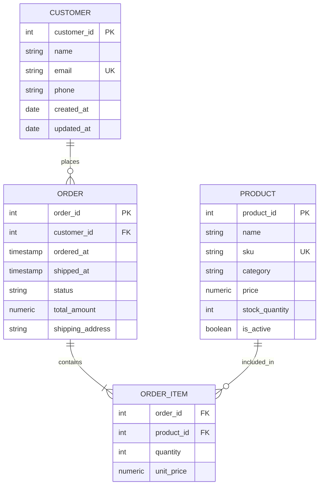
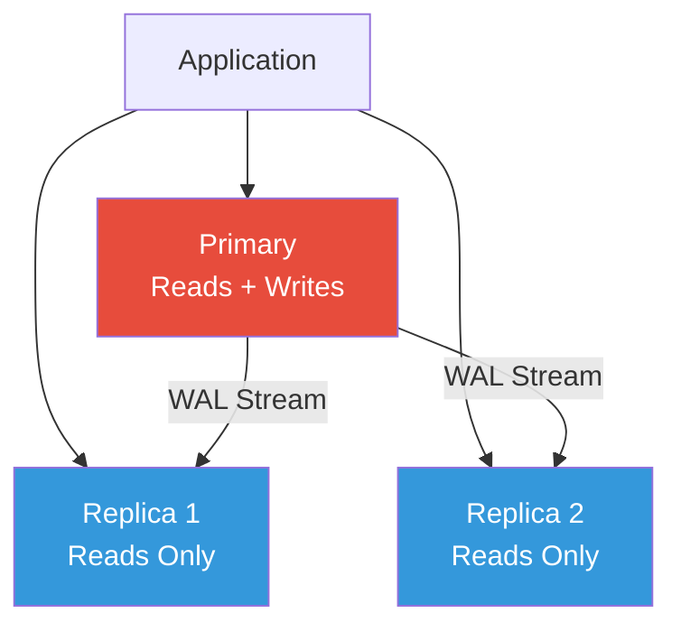

## The Design Process

Database design is not a one-step activity. It is a disciplined process that moves from abstract
requirements to concrete physical implementation. Skipping steps leads to schemas that cannot
evolve, queries that cannot perform, and data that cannot be trusted.

### Phase 1: Requirements Analysis

Before writing a single CREATE TABLE, you must understand:

1. **Data requirements:** what data will be stored, what are the entities and their attributes, what
   are the relationships, what are the constraints
2. **Functional requirements:** what queries will the application execute, how frequently, what is
   the expected latency, what is the tolerance for stale data
3. **Non-functional requirements:** expected data volume, growth rate, read/write ratio, RTO/RPO
   (recovery time/recovery point objectives), compliance requirements
4. **Access patterns:** who reads what, when, and how often. The most important question in database
   design is: "what are the top 10 queries this system will execute?"

### Phase 2: Conceptual Design

Translate requirements into an Entity-Relationship model. This phase is independent of any specific
database technology. The output is an ER diagram that captures entities, attributes, relationships,
and cardinality constraints.

### Phase 3: Logical Design

Convert the ER model into relational schema (tables, columns, keys, constraints). Apply
normalisation to eliminate redundancy. Define views for common access patterns. This phase is still
largely independent of the specific RDBMS, though you may start considering data types.

### Phase 4: Physical Design

Map the logical schema to the specific database system. Choose data types, define indexes, decide on
partitioning strategy, configure storage parameters, and set up replication. This is where you
optimise for the specific workload based on measured query performance.


## ER Modeling

### Entities

An entity represents a distinct object or concept in the domain. Entities have:

- A unique name (singular noun)
- Attributes (properties)
- An identifier (primary key)



### Relationships

| Cardinality | ER Notation            | SQL Implementation                                 |
| ----------- | ---------------------- | -------------------------------------------------- |
| 1:1         | One line, one mark     | Foreign key in either table with UNIQUE constraint |
| 1:N         | One line, many marks   | Foreign key in the "many" table                    |
| M:N         | Many lines, many marks | Association table with composite PK                |

### Attributes

- **Simple vs composite:** `birth_date` (simple) vs `full_name` (composite: first, middle, last)
- **Single-valued vs multi-valued:** `email` (single) vs `phone_numbers` (multi-valued -- model as
  separate table)
- **Stored vs derived:** `unit_price` (stored) vs `order_total` (derived from
  `SUM(quantity * unit_price)`)
- **Null vs not-null:** `middle_name` (nullable) vs `email` (not null)

## Schema Design Patterns

### Single Table Inheritance

Store all subclasses in one table with a discriminator column:

```sql
CREATE TABLE people (
    person_id    INTEGER PRIMARY KEY,
    person_type  VARCHAR(20) NOT NULL,  -- 'employee', 'contractor', 'customer'
    name         VARCHAR(200) NOT NULL,
    email        VARCHAR(255),
    -- Employee-specific (NULL for non-employees):
    employee_id  VARCHAR(20),
    salary       NUMERIC(10,2),
    -- Contractor-specific (NULL for non-contractors):
    company_name VARCHAR(200),
    hourly_rate  NUMERIC(10,2),
    -- Customer-specific (NULL for non-customers):
    loyalty_points INTEGER,
    CHECK (
        (person_type = 'employee' AND employee_id IS NOT NULL AND salary IS NOT NULL) OR
        (person_type = 'contractor' AND company_name IS NOT NULL AND hourly_rate IS NOT NULL) OR
        (person_type = 'customer' AND loyalty_points IS NOT NULL)
    )
);
```

**Pros:** simple queries, no joins, single source of truth **Cons:** many NULL columns, CHECK
constraints become complex as types proliferate

### Class Table Inheritance

One table per class in the hierarchy, with shared columns in the parent table:

```sql
CREATE TABLE people (
    person_id INTEGER PRIMARY KEY,
    name      VARCHAR(200) NOT NULL,
    email     VARCHAR(255)
);

CREATE TABLE employees (
    person_id INTEGER PRIMARY KEY REFERENCES people(person_id),
    employee_id VARCHAR(20) NOT NULL,
    salary     NUMERIC(10,2) NOT NULL
);

CREATE TABLE contractors (
    person_id   INTEGER PRIMARY KEY REFERENCES people(person_id),
    company_name VARCHAR(200) NOT NULL,
    hourly_rate  NUMERIC(10,2) NOT NULL
);

CREATE TABLE customers (
    person_id     INTEGER PRIMARY KEY REFERENCES people(person_id),
    loyalty_points INTEGER NOT NULL DEFAULT 0
);
```

**Pros:** no NULL columns for unrelated attributes, clean normalisation **Cons:** every query
requires a JOIN to the parent table, inserting requires multiple INSERT statements

### Shared Table (Concrete Table Inheritance)

One table per concrete class, with shared columns duplicated:

```sql
CREATE TABLE employees (
    person_id   INTEGER PRIMARY KEY,
    name        VARCHAR(200) NOT NULL,
    email       VARCHAR(255),
    employee_id VARCHAR(20) NOT NULL,
    salary      NUMERIC(10,2) NOT NULL
);

CREATE TABLE customers (
    person_id     INTEGER PRIMARY KEY,
    name          VARCHAR(200) NOT NULL,
    email         VARCHAR(255),
    loyalty_points INTEGER NOT NULL DEFAULT 0
);
```

**Pros:** each table is self-contained, no joins for single-type queries **Cons:** shared columns
are duplicated, cross-type queries require UNION ALL, schema changes to shared columns must be
applied to every table

## Indexing Strategy

### Index Selection Methodology

1. **Identify top queries:** what are the most frequently executed queries? What queries have the
   strictest latency requirements?
2. **EXPLAIN ANALYZE each query:** find full table scans, nested loop joins without indexes, and
   sequential scans on large tables
3. **Add indexes for the top queries:** start with single-column indexes on WHERE clause columns
4. **Evaluate composite indexes:** for multi-column WHERE clauses, test the leftmost prefix rule
5. **Evaluate covering indexes:** if a query accesses a small number of columns, a covering index
   can eliminate heap access entirely
6. **Monitor index usage:** after deployment, check which indexes are actually used

```sql
-- Find unused indexes (candidates for removal):
SELECT schemaname, relname AS table_name, indexrelname AS index_name,
       idx_scan AS times_used, pg_size_pretty(pg_relation_size(indexrelid)) AS index_size
FROM pg_stat_user_indexes
WHERE idx_scan &lt; 50
ORDER BY pg_relation_size(indexrelid) DESC;
```

### Index for Common Patterns

```sql
-- Primary key lookups: already indexed by PRIMARY KEY
SELECT * FROM users WHERE id = 42;

-- Foreign key lookups: index the foreign key column
CREATE INDEX idx_orders_customer_id ON orders(customer_id);

-- Unique constraints: UNIQUE already creates an index
-- But verify it is being used by your queries

-- Status filtering with range: composite index with equality first
CREATE INDEX idx_orders_status_date ON orders(status, created_at);

-- Sorting: include ORDER BY columns in the index
CREATE INDEX idx_orders_customer_date ON orders(customer_id, created_at DESC);

-- Partial index for common filter: only index what you query
CREATE INDEX idx_orders_pending ON orders(customer_id, created_at) WHERE status = 'pending';
```

## Partitioning

Partitioning divides a large table into smaller, more manageable pieces while presenting a single
table interface to queries. PostgreSQL supports declarative partitioning.

### Range Partitioning

Divides data based on a range of values (typically time):

```sql
CREATE TABLE orders (
    order_id    BIGSERIAL,
    customer_id INTEGER NOT NULL,
    total       NUMERIC(10,2) NOT NULL,
    status      VARCHAR(20) NOT NULL,
    created_at  TIMESTAMPTZ NOT NULL DEFAULT NOW(),
    PRIMARY KEY (order_id, created_at)
) PARTITION BY RANGE (created_at);

CREATE TABLE orders_2024_q1 PARTITION OF orders
    FOR VALUES FROM ('2024-01-01') TO ('2024-04-01');

CREATE TABLE orders_2024_q2 PARTITION OF orders
    FOR VALUES FROM ('2024-04-01') TO ('2024-07-01');

CREATE TABLE orders_2024_q3 PARTITION OF orders
    FOR VALUES FROM ('2024-07-01') TO ('2024-10-01');

CREATE TABLE orders_2024_q4 PARTITION OF orders
    FOR VALUES FROM ('2024-10-01') TO ('2025-01-01');

-- Default partition catches all rows not matching any range
CREATE TABLE orders_default PARTITION OF orders DEFAULT;
```

### List Partitioning

Divides data based on discrete values:

```sql
CREATE TABLE customers (
    customer_id BIGSERIAL,
    name        VARCHAR(200) NOT NULL,
    region      VARCHAR(50) NOT NULL,
    PRIMARY KEY (customer_id, region)
) PARTITION BY LIST (region);

CREATE TABLE customers_europe PARTITION OF customers
    FOR VALUES IN ('UK', 'DE', 'FR', 'ES', 'IT', 'NL');

CREATE TABLE customers_americas PARTITION OF customers
    FOR VALUES IN ('US', 'CA', 'BR', 'MX');

CREATE TABLE customers_apac PARTITION OF customers
    FOR VALUES IN ('JP', 'AU', 'IN', 'SG', 'KR');

CREATE TABLE customers_other PARTITION OF customers DEFAULT;
```

### Hash Partitioning

Divides data evenly across a fixed number of partitions:

```sql
CREATE TABLE events (
    event_id    BIGSERIAL,
    event_type  VARCHAR(50) NOT NULL,
    payload     JSONB,
    created_at  TIMESTAMPTZ NOT NULL DEFAULT NOW(),
    PRIMARY KEY (event_id, created_at)
) PARTITION BY HASH (event_id);

CREATE TABLE events_p0 PARTITION OF events FOR VALUES WITH (MODULUS 4, REMAINDER 0);
CREATE TABLE events_p1 PARTITION OF events FOR VALUES WITH (MODULUS 4, REMAINDER 1);
CREATE TABLE events_p2 PARTITION OF events FOR VALUES WITH (MODULUS 4, REMAINDER 2);
CREATE TABLE events_p3 PARTITION OF events FOR VALUES WITH (MODULUS 4, REMAINDER 3);
```

### When to Partition

| Factor        | Partition                                        | Do Not Partition                  |
| ------------- | ------------------------------------------------ | --------------------------------- |
| Table size    | &gt; 10-50 GB                                    | &lt; 5 GB                         |
| Query pattern | Frequently queries a subset (date range, region) | Always queries all rows           |
| Maintenance   | Need to drop/archive old data quickly            | Data lifecycle is uniform         |
| Write pattern | Inserts target specific partitions               | Inserts are spread uniformly      |
| Index size    | Index maintenance is becoming expensive          | Indexes fit comfortably in memory |

:::warning

The partition key must be part of the primary key (or all unique indexes). You cannot have a PRIMARY
KEY on `order_id` alone if the table is partitioned by `created_at` -- the primary key must include
both `(order_id, created_at)`. This is a common gotcha when migrating an existing table to
partitioning.

:::

## Sharding

Sharding distributes data across multiple independent database instances (shards). Unlike
partitioning, which is a single logical database, sharding involves multiple database servers, each
responsible for a subset of the data.

### Sharding Strategies

**Hash-based sharding:**

$$\mathrm{shard} = \mathrm{hash}(\mathrm{key}) \pmod{\mathrm{num\_shards}}$$

- Even data distribution
- Requires application-level routing or a proxy (e.g., Vitess, Citus)
- Resharding (changing the number of shards) is expensive

**Range-based sharding:**

- Each shard holds a range of keys (e.g., users A-M on shard 1, N-Z on shard 2)
- Uneven distribution if the key distribution is skewed
- Range queries are efficient within a shard

**Directory-based sharding:**

- A lookup service maps keys to shards
- Most flexible: can rebalance by updating the directory
- Adds latency for every lookup (directory becomes a bottleneck)

### Challenges

- **Cross-shard queries:** queries that span multiple shards require scatter-gather, which is slow
- **Cross-shard transactions:** ACID guarantees across shards require distributed consensus (2PC)
- **Resharding:** adding or removing shards requires moving data, which is expensive and complex
- **Operational complexity:** each shard is a separate database instance with its own backups,
  monitoring, and failover

:::tip

Do not shard prematurely. A single PostgreSQL instance with partitioning, read replicas, and
connection pooling can handle millions of queries per hour. Only shard when you have exhausted
vertical scaling and single-node optimisations.

:::

## Connection Pooling

Connection pooling reduces the overhead of establishing and tearing down database connections. Each
connection consumes memory on both the client and the server, and TCP handshake + TLS negotiation +
authentication adds latency to every new connection.

### PgBouncer Configuration

```ini
; /etc/pgbouncer/pgbouncer.ini
[databases]
mydb = host=db-primary.internal port=5432 dbname=mydb
mydb_replica = host=db-replica.internal port=5432 dbname=mydb

[pgbouncer]
listen_addr = 0.0.0.0
listen_port = 6432
auth_type = scram-sha-256
auth_file = /etc/pgbouncer/userlist.txt

; Pool settings
pool_mode = transaction
max_client_conn = 2000
default_pool_size = 50
min_pool_size = 10
reserve_pool_size = 10
reserve_pool_timeout = 3

; Timeouts
server_idle_timeout = 600
server_lifetime = 3600
server_connect_timeout = 15
server_reset_query = DISCARD ALL
```

### Pool Mode Comparison

| Mode        | Connection Lifetime | Prepared Statements | Use Case                         |
| ----------- | ------------------- | ------------------- | -------------------------------- |
| session     | Client session      | Supported           | Legacy applications, batch jobs  |
| transaction | Single transaction  | Not supported       | Web applications (most common)   |
| statement   | Single statement    | Not supported       | Rarely used; breaks transactions |

## Schema Migrations

### Versioned Migrations

Versioned migrations are numbered SQL files applied in order. Each migration transforms the schema
from version N to version N+1.

```
migrations/
  001_create_users.sql
  002_create_orders.sql
  003_add_email_index.sql
  004_add_order_status_column.sql
  005_create_audit_log.sql
```

```sql
-- 001_create_users.sql
CREATE TABLE users (
    user_id    SERIAL PRIMARY KEY,
    email      VARCHAR(255) NOT NULL UNIQUE,
    name       VARCHAR(200) NOT NULL,
    created_at TIMESTAMPTZ NOT NULL DEFAULT NOW()
);

-- 003_add_email_index.sql
CREATE INDEX CONCURRENTLY idx_users_email ON users(email);
```

### Reversible Migrations

Each migration has an `up` and `down` function:

```sql
-- up:
ALTER TABLE orders ADD COLUMN status VARCHAR(20) NOT NULL DEFAULT 'pending';
CREATE INDEX idx_orders_status ON orders(status);

-- down:
DROP INDEX IF EXISTS idx_orders_status;
ALTER TABLE orders DROP COLUMN IF EXISTS status;
```

### Zero-Downtime Migration Strategies

For large tables, `ALTER TABLE` can lock the table for hours. Strategies:

1. **Expand-contract pattern:**
   - Add a new column alongside the old one
   - Deploy application code that writes to both columns
   - Backfill the new column
   - Deploy application code that reads from the new column
   - Remove the old column

2. **PostgreSQL-specific:**
   - `CREATE INDEX CONCURRENTLY` (no lock)
   - `ALTER TABLE ... ADD COLUMN ... DEFAULT NULL` (metadata-only in PG 11+)
   - Use `pg_partman` for partitioning without downtime

:::warning

Never drop a column or table in a migration without verifying that no code references it. In
microservice architectures, check all services, not just the one you are deploying. A column used by
a reporting service or a data pipeline can cause silent failures if dropped.

:::

### Migration Tools

| Tool           | Language | Features                                                        |
| -------------- | -------- | --------------------------------------------------------------- |
| Flyway         | Java/CLI | Versioned migrations, repeatable migrations, Java/SQL callbacks |
| Liquibase      | Java/CLI | XML/YAML/JSON changelogs, diff, rollback, multi-DB support      |
| golang-migrate | Go       | CLI library, up/down migrations, database-agnostic              |
| Alembic        | Python   | Auto-generation from SQLAlchemy models, revision chaining       |
| dbmate         | Go/CLI   | Minimal, framework-agnostic, supports multiple databases        |

## Data Modeling Anti-Patterns

### Entity-Attribute-Value (EAV)

EAV stores each attribute as a row instead of a column:

```sql
-- EAV anti-pattern:
CREATE TABLE entities (entity_id INT PRIMARY KEY);
CREATE TABLE attributes (
    entity_id  INT REFERENCES entities(entity_id),
    attr_name  VARCHAR(50),
    attr_value TEXT,
    PRIMARY KEY (entity_id, attr_name)
);

-- To find entities with name='Alice' and age=30:
SELECT e.entity_id
FROM entities e
JOIN attributes a1 ON e.entity_id = a1.entity_id AND a1.attr_name = 'name' AND a1.attr_value = 'Alice'
JOIN attributes a2 ON e.entity_id = a2.entity_id AND a2.attr_name = 'age' AND a2.attr_value = '30';
```

Problems:

- No data type enforcement (everything is TEXT)
- No referential integrity (cannot have foreign keys on attribute values)
- Queries require multiple self-joins (quadratic complexity)
- No indexing strategy works well for all attributes
- Impossible to enforce NOT NULL or CHECK constraints

**Alternative:** use JSONB for genuinely flexible attributes, or define proper columns with ALTER
TABLE when new attributes are discovered.

### Polymorphic Associations

A foreign key that can reference rows from multiple tables:

```sql
-- Anti-pattern:
CREATE TABLE comments (
    comment_id   SERIAL PRIMARY KEY,
    content      TEXT NOT NULL,
    commentable_id   INT NOT NULL,
    commentable_type VARCHAR(20) NOT NULL,  -- 'post', 'photo', 'video'
    FOREIGN KEY (commentable_id) REFERENCES ???  -- cannot reference multiple tables
);
```

Problems:

- Cannot enforce referential integrity (foreign key cannot point to multiple tables)
- Querying comments for a specific entity type requires filtering on `commentable_type`
- Adding a new entity type requires updating application code but not the schema

**Alternative:** create separate join tables for each entity type, or use a base table with
table-per-type inheritance.

### UUIDs as Primary Keys (When Not Needed)

UUIDs are 128-bit values (36 characters as strings, 16 bytes stored). Compared to sequential
BIGSERIAL (8 bytes):

- 2x storage per row
- 2x size for every index that includes the primary key
- Non-sequential, causing random B-tree page splits on INSERT
- Harder to debug (cannot tell the order of records by looking at IDs)

**Use UUIDs when:** you generate IDs outside the database (client-side, distributed systems), you
need globally unique identifiers across databases, or you need to prevent ID enumeration.

**Use BIGSERIAL when:** all inserts go through the database, you do not need globally unique IDs,
and you care about index insertion performance.

## Backup Strategies

### Full Backup

Copies the entire database. Simple to restore but slow to create and requires the most storage.

```bash
# PostgreSQL: pg_dump (logical backup)
pg_dump -Fc mydb > mydb.dump

# PostgreSQL: pg_basebackup (physical backup, requires WAL archiving)
pg_basebackup -h db-primary -D /var/lib/postgresql/backup -Ft -z -P
```

### Incremental Backup

Only copies data changed since the last backup. Faster to create, requires less storage, but more
complex to restore (must replay from the last full backup through all incrementals).

### WAL Archiving (Point-in-Time Recovery)

PostgreSQL's Write-Ahead Log records every modification. Archiving WAL enables recovery to any point
in time:

```bash
# postgresql.conf
wal_level = replica
archive_mode = on
archive_command = 'cp %p /mnt/wal_archive/%f'

# Restore to a specific point in time:
# 1. Restore the base backup
# 2. Configure recovery_target_time
# 3. Start PostgreSQL in recovery mode

# recovery.conf (or postgresql.conf for PG 12+)
restore_command = 'cp /mnt/wal_archive/%f %p'
recovery_target_time = '2024-03-15 14:30:00'
recovery_target_action = 'promote'
```

### Backup Checklist

- **RPO (Recovery Point Objective):** how much data can you afford to lose? Determines backup
  frequency.
- **RTO (Recovery Time Objective):** how long can the system be down? Determines backup type and
  restore strategy.
- **Test restores regularly:** a backup that cannot be restored is not a backup.
- **Store backups offsite:** a backup on the same server is useless if the server fails.
- **Encrypt backups:** database backups contain sensitive data.

:::warning

Never test your backup strategy for the first time during an outage. Schedule quarterly restore
tests and measure the actual time to recover. The most common backup failure mode is discovering
that the backup is corrupted or incomplete when you need it most.

:::

## Replication

### Single-Leader (Primary-Replica)

One node accepts writes; replicas serve reads. This is the most common replication topology.



**Synchronous replication:** the primary waits for at least one replica to confirm receipt before
acknowledging the commit to the client. Guarantees no data loss on failover but adds latency.

**Asynchronous replication:** the primary does not wait for replicas. Lower latency but data may be
lost on failover (the "replication lag" window).

```sql
-- PostgreSQL: configure synchronous replication
-- On the primary:
synchronous_standby_names = 'FIRST 1 (replica1)'
-- This means: wait for at least 1 of the listed replicas to confirm

-- Per-transaction synchronous commit (override):
SET LOCAL synchronous_commit = on;    -- wait for sync replica
SET LOCAL synchronous_commit = off;   -- do not wait at all
```

### Multi-Leader

Multiple nodes accept writes. Conflicts must be resolved (last-write-wins, custom merge function, or
application-level resolution).

Use cases:

- Multi-datacenter deployments where cross-DC write latency is unacceptable
- Offline-capable clients that sync when reconnected
- Collaborative editing systems

Challenges:

- **Write conflicts:** two leaders accepting writes to the same row simultaneously
- **Conflict resolution:** must be deterministic and acceptable to the application
- **Complexity:** operational complexity is significantly higher than single-leader

### Leaderless (Dynamo-Style)

Every node can accept writes. Consistency is tunable per operation. Used by Cassandra, DynamoDB,
Riak.

- Writes are sent to N replicas (configurable)
- Reads query R replicas and return the most recent value based on timestamps
- Quorum: $W + R \gt N$ ensures consistency (e.g., $N=3$, $W=2$, $R=2$)

### Failover

When the primary fails, a replica must be promoted:

**Automatic failover:**

- PostgreSQL: Patroni, repmgr, or cloud-managed failover
- Uses a consensus system (etcd, Consul) to coordinate
- Promotes the most up-to-date replica
- Reconfigures remaining replicas to follow the new primary

**Manual failover:**

```sql
-- On the replica you want to promote:
SELECT pg_promote();

-- On remaining replicas, update their connection:
ALTER SYSTEM SET primary_conninfo = 'host=new-primary port=5432';
SELECT pg_reload_conf();
```

:::warning

Automatic failover can cause split-brain if the network partition is asymmetric (the primary thinks
it is still the leader, but the replicas have already promoted one of their own). Always use a
consensus-based coordination system (Patroni + etcd) rather than custom scripts.

:::

## Data Warehousing

### OLTP vs OLAP

| Dimension     | OLTP (Online Transaction Processing)       | OLAP (Online Analytical Processing)      |
| ------------- | ------------------------------------------ | ---------------------------------------- |
| Purpose       | Day-to-day operations                      | Analysis, reporting, decision support    |
| Queries       | Simple, point lookups, small result sets   | Complex aggregations, large scans, joins |
| Data volume   | Current state (recent data)                | Historical (years of data)               |
| Write pattern | Frequent small writes (INSERT, UPDATE)     | Bulk loads (ETL), infrequent             |
| Normalisation | Fully normalised (3NF+)                    | Denormalised (star/snowflake schema)     |
| Examples      | Order processing, user management, banking | Sales reports, dashboards, data mining   |

### Star Schema

A star schema has a central fact table surrounded by dimension tables. The fact table contains
measures (numeric values) and foreign keys to dimensions. No relationships between dimension tables.

```mermaid
erDiagram
    fact_sales {
        int sale_id PK
        int date_key FK
        int product_key FK
        int customer_key FK
        int store_key FK
        numeric quantity
        numeric revenue
        numeric cost
    }

    dim_date {
        int date_key PK
        date full_date
        int day_of_week
        int month
        int quarter
        int year
    }

    dim_product {
        int product_key PK
        string product_name
        string category
        string subcategory
        string brand
    }

    dim_customer {
        int customer_key PK
        string name
        string city
        string state
        string segment
    }

    dim_store {
        int store_key PK
        string store_name
        string city
        string region
        int square_footage
    }

    fact_sales }o--|| dim_date
    fact_sales }o--|| dim_product
    fact_sales }o--|| dim_customer
    fact_sales }o--|| dim_store
```

**Advantages:** simple, fast query performance (fewer joins), easy to understand **Disadvantages:**
data redundancy in dimensions (if a category name changes, all rows with that category must be
updated)

### Snowflake Schema

A snowflake schema normalises the dimension tables. Dimensions are split into multiple related
tables. The fact table still has foreign keys to the lowest-level dimension tables.

**Advantages:** less data redundancy, easier to maintain dimension data **Disadvantages:** more
joins (slower queries), more complex to understand

### Slowly Changing Dimensions (SCD)

Dimensions change over time. SCD strategies define how to handle these changes:

| Type  | Strategy                            | Example                                         |
| ----- | ----------------------------------- | ----------------------------------------------- |
| SCD 1 | Overwrite the old value             | Correcting a typo in a product name             |
| SCD 2 | Add a new row with effective dates  | Customer moves to a new address (track history) |
| SCD 3 | Add a column for the previous value | Store the previous and current category         |
| SCD 4 | Add a mini-dimension for history    | Track all historical values in a separate table |

```sql
-- SCD Type 2: add a new row with effective dates
-- Original row:
| customer_key | name | city     | valid_from | valid_to   | is_current |
|-------------|------|----------|------------|------------|------------|
| 1001        | Ada  | London   | 2020-01-01 | 2023-06-30 | FALSE      |
| 1002        | Ada  | Edinburgh| 2023-07-01 | 9999-12-31 | TRUE       |
```

## Common Pitfalls

### Not Designing for Data Lifecycle

Data accumulates. Without a plan for archiving, partitioning, or purging old data, tables grow
indefinitely, queries slow down, backups take longer, and storage costs increase. Define a data
retention policy before going to production.

### Over-Engineering the Schema

Designing for every hypothetical future use case leads to dozens of tables, complex join graphs, and
slow queries. Design for the known access patterns and leave room for evolution. The best schema is
the simplest one that satisfies current requirements and can be extended incrementally.

### Ignoring Write Patterns

Focusing only on read patterns and ignoring write patterns leads to schemas that are expensive to
update. If a write requires updating 5 tables and 10 indexes, the write latency will be high.
Profile both read and write workloads.

### Not Versioning Migrations

Deploying schema changes without version control and reversible migrations means you cannot roll
back a failed deployment. Every schema change must be a versioned migration with an up and down
path, tested in a staging environment.

### Using ENUM When VARCHAR Would Suffice

ENUM types seem like a good idea for status fields, but they require an ALTER TABLE to add new
values. In PostgreSQL, adding an ENUM value requires an exclusive lock. Use a CHECK constraint or a
foreign key to a lookup table instead:

```sql
-- Prefer CHECK constraint over ENUM:
CREATE TABLE orders (
    status VARCHAR(20) NOT NULL,
    CHECK (status IN ('pending', 'processing', 'shipped', 'delivered', 'cancelled'))
);

-- Or a foreign key to a status table:
CREATE TABLE order_statuses (status VARCHAR(20) PRIMARY KEY);
CREATE TABLE orders (
    status VARCHAR(20) NOT NULL REFERENCES order_statuses(status)
);
```

### Not Testing Backup and Recovery

The only reliable backup is one you have successfully restored. Test your backup strategy regularly,
measure actual recovery time, and document the procedure. A backup that has never been tested is a
false sense of security.
