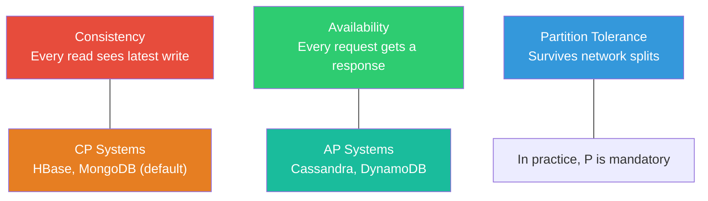

## Why Databases Matter

Every non-trivial system you build, operate, or debug depends on a database. Authentication tokens,
user profiles, financial transactions, inventory counts, sensor readings, audit logs -- all of it
lands in a database. When the database is slow, the entire application is slow. When the database
loses data, the business loses money. When the database schema cannot evolve, the development team
grinds to a halt.

Understanding databases is not optional for a systems engineer. You need to know how queries are
executed, why indexes matter, what transaction isolation levels actually guarantee, and when a NoSQL
store is the right tool versus a premature optimisation that will cause pain in production.

## The CAP Theorem at a Glance

The CAP theorem (Brewer, 2000; proved by Gilbert and Lynch, 2002) states that a distributed data
store can provide at most two of the following three guarantees simultaneously:

- **Consistency (C)** -- every read returns the most recent write or an error
- **Availability (A)** -- every request receives a non-error response (no guarantees about latency)
- **Partition tolerance (P)** -- the system continues to operate despite network partitions

In practice, network partitions are inevitable in distributed systems, so the real choice is between
**CP** (sacrifice availability during a partition) and **AP** (sacrifice consistency during a
partition). The PACELC theorem (Abadi, 2012) extends this: when there is **no** partition, the
system must choose between **L**atency and **C**onsistency.

## Relational vs NoSQL: A Spectrum, Not a Dichotomy

The industry often frames this as "SQL vs NoSQL" but the reality is a spectrum of trade-offs:

| Dimension          | Relational                         | NoSQL                                         |
| ------------------ | ---------------------------------- | --------------------------------------------- |
| Data model         | Rows and columns, fixed schema     | Documents, key-value, graphs, column families |
| Query language     | SQL (declarative, standardised)    | Varies per database, often API-based          |
| Consistency        | Strong by default (ACID)           | Often eventual, tunable                       |
| Scaling            | Vertical first, then read replicas | Horizontal by design                          |
| Schema flexibility | Rigid, migrations required         | Flexible, schemaless or schema-on-read        |
| Joins              | First-class, optimised             | Limited or unsupported                        |

**Choose relational when:** your data has strong relationships, you need complex queries and joins,
ACID transactions are non-negotiable, or your team knows SQL well.

**Choose NoSQL when:** your access patterns are simple and known, you need horizontal scale beyond
what replicas provide, your data is unstructured or semi-structured, or you need extremely high
write throughput.

## What This Subject Covers

| Topic                   | Focus                                                         |
| ----------------------- | ------------------------------------------------------------- |
| Relational Theory       | Codd's model, normalisation, functional dependencies, keys    |
| SQL Fundamentals        | DDL, DML, joins, subqueries, window functions, CTEs           |
| Indexing & Optimisation | B-trees, covering indexes, query plans, EXPLAIN               |
| Transactions            | ACID, isolation levels, locking, MVCC, deadlocks              |
| NoSQL                   | Document stores, key-value, column families, graph, CAP       |
| Database Design         | ER modelling, partitioning, sharding, replication, migrations |

## Core Principles

1. **Data integrity is non-negotiable** -- a fast system that returns wrong answers is worse than a
   slow system that returns correct ones
2. **Index design follows access patterns** -- do not index everything, index what you query
3. **Transactions are your safety net** -- understand their costs and guarantees before disabling or
   working around them
4. **Schema evolution is a feature, not a bug** -- design for change from the start
5. **Measure before optimising** -- `EXPLAIN ANALYZE` before adding indexes, and benchmark after
