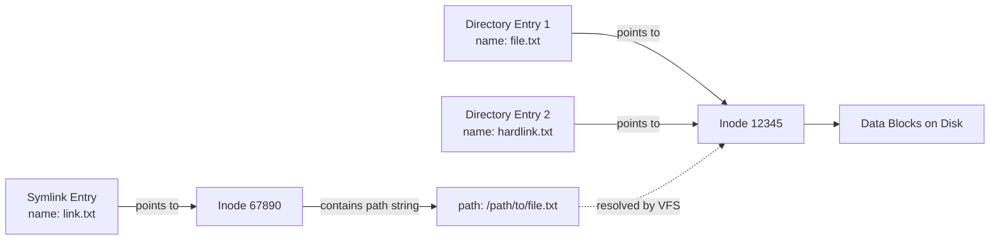

## GNU Coreutils Overview

GNU coreutils is the package that provides the fundamental file, shell, and text manipulation
utilities on virtually every Linux distribution. These utilities implement the POSIX specifications
and extend them with GNU-specific options. The package contains roughly 105 programs, grouped into:

- **File utilities**: `ls`, `cp`, `mv`, `rm`, `ln`, `chmod`, `chown`, `touch`, `mkdir`, `rmdir`,
  `stat`, `du`, `df`, `sync`
- **Text utilities**: `cat`, `head`, `tail`, `sort`, `uniq`, `tr`, `cut`, `paste`, `join`, `wc`,
  `nl`, `fmt`, `fold`, `pr`
- **Shell utilities**: `echo`, `printf`, `date`, `tee`, `basename`, `dirname`, `sleep`, `true`,
  `false`, `test`, `expr`, `yes`, `timeout`

## Text Processing Pipeline Patterns

The Unix philosophy of composing small, single-purpose tools into pipelines is the foundation of
Linux systems administration. Understanding how to chain these tools effectively is a core
competency.

### `grep` — Pattern Matching

`grep` searches input lines for patterns matching a regular expression and prints matching lines.
Three main variants exist:

| Variant   | Regex Flavor | Description                         |
| --------- | ------------ | ----------------------------------- |
| `grep`    | BRE          | Basic Regular Expressions (default) |
| `grep -E` | ERE          | Extended Regular Expressions        |
| `grep -P` | PCRE         | Perl-Compatible Regular Expressions |

```bash
# Basic pattern matching
grep "error" /var/log/syslog

# Case-insensitive
grep -i "warning" /var/log/syslog

# Invert match (lines that do NOT match)
grep -v "debug" /var/log/syslog

# Show line numbers
grep -n "error" /var/log/syslog

# Count matches
grep -c "error" /var/log/syslog

# Show only matching portion
grep -o "error:[0-9]*" /var/log/syslog

# Recursive search through directories
grep -r "TODO" --include="*.py" src/

# Context lines (2 before, 2 after)
grep -C 2 "panic" /var/log/kern.log

# Extended regex (alternation, quantifiers without escaping)
grep -E "error|warning|critical" /var/log/syslog

# PCRE — lookahead, lookbehind, non-greedy quantifiers
grep -P "(?<=status: )\d{3}" response.txt

# Fixed string (no regex interpretation)
grep -F "file.name" search.log

# Color output
grep --color=always "pattern" file
```

#### BRE vs ERE vs PCRE

| Feature             | BRE      | ERE     | PCRE                     |
| ------------------- | -------- | ------- | ------------------------ |
| Literal match       | `abc`    | `abc`   | `abc`                    |
| Any character       | `.`      | `.`     | `.`                      |
| Zero or more        | `*`      | `*`     | `*`                      |
| One or more         | `\{1,\}` | `+`     | `+`                      |
| Zero or one         | `\?`     | `?`     | `?`                      |
| Alternation         | `\|`     | `\|`    | `\|`                     |
| Grouping            | `\(\)`   | `()`    | `()`                     |
| Character class     | `[abc]`  | `[abc]` | `[abc]`                  |
| Lookahead           | No       | No      | `(?=...)`                |
| Lookbehind          | No       | No      | `(?&lt;=...)`            |
| Non-capturing group | No       | No      | `(?:...)`                |
| Named capture       | No       | No      | `(?P&lt;name&gt;...)`    |
| Backreference       | `\1`     | `\1`    | `\1` or `\k&lt;name&gt;` |
| Unicode properties  | No       | No      | `\p{L}`                  |

:::warning

In BRE, `+`, `?`, `{`, `|`, `(`, `)` are literal characters. You must escape them with `\` to get
their special meaning. In ERE, the reverse is true — they are special by default and must be escaped
to be literal. This is a frequent source of confusion.

:::

### `sed` — Stream Editor

`sed` applies editing commands to input text line by line. It operates on a **pattern space** — a
buffer holding the current line — and supports hold space for multi-line operations.

```bash
# Substitute first occurrence per line
sed 's/old/new/' file.txt

# Substitute all occurrences
sed 's/old/new/g' file.txt

# Substitute on lines matching a pattern
sed '/pattern/s/old/new/g' file.txt

# Delete lines matching a pattern
sed '/^$/d' file.txt        # delete blank lines
sed '/^#/d' config.conf     # delete comment lines

# Print specific lines
sed -n '10,20p' file.txt    # lines 10-20
sed -n '/start/,/end/p' file.txt  # between markers

# In-place editing (creates backup)
sed -i.bak 's/old/new/g' file.txt

# In-place editing without backup
sed -i 's/old/new/g' file.txt

# Multiple commands
sed -e 's/foo/bar/g' -e 's/baz/qux/g' file.txt

# Edit using a script file
sed -f commands.sed file.txt
```

#### Advanced `sed` Patterns

```bash
# Add line after match
sed '/pattern/a\new line' file.txt

# Add line before match
sed '/pattern/i\new line' file.txt

# Replace entire line matching pattern
sed '/pattern/c\replacement line' file.txt

# Transform characters (like tr)
sed 'y/abc/xyz/' file.txt

# Print lines 1 to 5, then quit (efficient for large files)
sed '5q' huge_file.txt

# Hold space operations — swap pattern and hold space
sed -n 'H; ${x; s/\n/ /g; p; }' file.txt  # join all lines

# Multi-line pattern matching
sed '/start/,/end/s/foo/bar/g' file.txt

# Reference matched text in replacement
sed 's/\(word1\) \(word2\)/\2 \1/' file.txt  # swap two words

# Extended regex mode (cleaner syntax)
sed -E 's/(https?):\/\/([^/]+)(.*)/\2/' urls.txt
```

### `awk` — Pattern-Directed Scanning and Processing

`awk` is a full programming language designed for text processing. It processes input line by line,
splitting each line into fields. The three main implementations are `awk` (often `mawk` or `gawk`).

```bash
# Print specific fields (default field separator: whitespace)
awk '{print $1, $3}' file.txt

# Specify field separator
awk -F: '{print $1, $7}' /etc/passwd

# Pattern-action pairs
awk '/error/ {count++} END {print count}' /var/log/syslog

# BEGIN block (before processing) and END block (after processing)
awk 'BEGIN {FS=":"; print "Username\tHome"} {print $1, $6} END {print NR " users"}' /etc/passwd

# Conditional logic
awk '$3 > 100 {print $1, "high"} $3 &lt;= 100 {print $1, "normal"}' data.txt

# Built-in variables
awk '{
    print "Line:", NR, "Fields:", NF, "File:", FILENAME
}' file1.txt file2.txt

# String functions
awk '{print toupper($1), length($2), substr($3, 1, 5)}' data.txt

# Arithmetic
awk '{sum += $1} END {print "Sum:", sum, "Average:", sum/NR}' numbers.txt

# Associative arrays
awk '{count[$1]++} END {for (word in count) print word, count[word]}' words.txt

# Output formatting (printf)
awk '{printf "%-15s %8.2f %5d\n", $1, $2, $3}' report.txt
```

#### `awk` Programming Constructs

```awk
#!/usr/bin/awk -f
# Log analyzer — count HTTP status codes

BEGIN {
    FS = " "
    total = 0
}

{
    status = $9
    count[status]++
    total++
}

END {
    for (code in count) {
        pct = (count[code] / total) * 100
        printf "%-6s %8d %6.2f%%\n", code, count[code], pct
    }
    printf "\nTotal requests: %d\n", total
}
```

```bash
# Process CSV-like data
awk -F, 'NR > 1 {total += $3 * $4} END {printf "Revenue: USD %.2f\n", total}' sales.csv

# Filter and transform
awk -F, '$3 > 1000 {printf "%s,%s\n", $1, $2}' sales.csv

# Multi-file processing
awk 'FNR==1 {print "=== " FILENAME " ==="} {print}' *.log

# System calls from within awk
awk '{print | "sort -rn"}' unsorted.txt
```

### `sort`, `uniq`, `wc`, `cut`, `tr`

These utilities form the backbone of text processing pipelines:

```bash
# sort — sort lines
sort file.txt                    # alphabetical
sort -n file.txt                 # numeric
sort -r file.txt                 # reverse
sort -k2,2n file.txt             # sort by 2nd field numerically
sort -t: -k3,3n /etc/passwd      # sort passwd by UID
sort -u file.txt                 # unique lines
sort -h sizes.txt                # human-numeric (1K, 2M, 3G)
sort -R file.txt                 # random shuffle

# uniq — filter adjacent duplicate lines (must be sorted first)
sort file.txt | uniq             # remove duplicates
sort file.txt | uniq -c          # count occurrences
sort file.txt | uniq -d          # show only duplicates
sort file.txt | uniq -u          # show only unique lines
sort file.txt | uniq -f1         # ignore first field

# wc — word/line/character count
wc -l file.txt                   # lines
wc -w file.txt                   # words
wc -c file.txt                   # bytes
wc -m file.txt                   # characters
wc -L file.txt                   # longest line length

# cut — extract fields/columns
cut -d: -f1 /etc/passwd          # first field (colon delimiter)
cut -d, -f1,3 data.csv           # fields 1 and 3
cut -c1-80 file.txt              # characters 1-80
cut -c1- file.txt                # from character 1 to end

# tr — translate or delete characters
echo "hello" | tr 'a-z' 'A-Z'            # uppercase
echo "hello  world" | tr -s ' '           # squeeze spaces
echo "hello123" | tr -d '0-9'             # delete digits
echo "Hello World" | tr '[:lower:]' '[:upper:]'  # POSIX character classes
tr -cd '[:print:]' &lt; binary_file          # keep only printable characters
echo "HELLO" | tr 'A-Z' 'a-z' | tr -d '\n' # chain transformations
```

### Pipeline Combinations

```bash
# Find the 10 most common words in a file
tr -cs '[:alpha:]' '\n' &lt; document.txt | sort | uniq -c | sort -rn | head -10

# Disk usage by file extension
find /var/log -type f -name "*.gz" -exec du -b {} + | awk '{sum[$1]++} END {for (s in sum) print s, sum[s]}' | sort -rn

# Extract IPs from a log file, count occurrences, show top 20
grep -oP '\d{1,3}\.\d{1,3}\.\d{1,3}\.\d{1,3}' access.log | sort | uniq -c | sort -rn | head -20

# Find files larger than 100MB
find / -type f -size +100M -exec ls -lh {} \; 2>/dev/null | awk '{print $5, $9}' | sort -rh

# Analyze HTTP response codes from access log
awk '{print $9}' access.log | sort | uniq -c | sort -rn | head -10

# Replace all occurrences across multiple files
find . -name "*.conf" -exec sed -i 's/oldhost.example.com/newhost.example.com/g' {} +
```

## File Operations

### `find` — File System Traversal

`find` recursively traverses a directory tree and evaluates expressions against each file. It is one
of the most powerful tools available but also one of the most commonly misused.

```bash
# Basic search
find /etc -name "*.conf"                    # by name
find /etc -type f                           # regular files only
find /etc -type d                           # directories only
find /etc -type l                           # symbolic links

# By time
find /var/log -mtime -7                     # modified in last 7 days
find /tmp -atime +30                        # accessed more than 30 days ago
find / -newer /var/log/syslog               # newer than reference file
find / -ctime -1                            # status changed in last 24 hours

# By size
find / -size +1G                            # larger than 1 GiB
find /var -size -10k                        # smaller than 10 KiB
find / -size +100M -size -500M              # between 100 MiB and 500 MiB

# By permissions
find /etc -perm 644                         # exactly mode 644
find /etc -perm -4000                       # setuid bit set
find /usr -perm -02000                      # setgid bit set
find /tmp -perm /o+w                        # world-writable

# By owner/group
find /home -user john                       # owned by john
find /var -group adm                        # owned by group adm
find / -nouser                              # files with no valid user

# Depth control
find / -maxdepth 3 -name "*.log"            # max 3 levels deep
find / -mindepth 2 -type d                  # skip the starting directory

# Combine with -a (AND), -o (OR), ! (NOT)
find /etc -name "*.conf" -a ! -path "*/private/*"
find / \( -name "*.c" -o -name "*.h" \) -type f

# Actions
find . -name "*.bak" -delete                # delete matching files
find . -type f -exec chmod 644 {} \;        # change permissions
find . -type f -exec ls -lh {} +            # batch mode (efficient)
find . -name "*.py" -exec grep -l "TODO" {} +  # find files containing TODO
```

### `find -exec` vs `find -exec ... +` vs `xargs`

```bash
# -exec {} \; — runs command once per file (slow for many files)
find . -name "*.log" -exec gzip {} \;

# -exec {} + — batches files into a single command invocation (fast)
find . -name "*.log" -exec gzip {} +

# xargs — reads from stdin, builds command lines
find . -name "*.log" -print0 | xargs -0 gzip

# xargs with parallel execution
find . -name "*.log" -print0 | xargs -0 -P 4 gzip

# xargs with replacement string
find . -name "*.c" -print0 | xargs -0 -I {} cp {} /backup/
```

| Method            | Invocation Count | Safety             | Use Case                           |
| ----------------- | ---------------- | ------------------ | ---------------------------------- |
| `-exec {} \;`     | Once per file    | Safest             | Few files, complex commands        |
| `-exec {} +`      | Batched          | Safe               | Many files, simple commands        |
| `xargs` (default) | Batched          | Unsafe with spaces | Simple filenames                   |
| `xargs -0`        | Batched          | Safe               | Any filenames (use with `-print0`) |

:::warning

Always use `find ... -print0 | xargs -0` instead of `find ... | xargs` when filenames may contain
spaces, newlines, or special characters. The default `xargs` splits on whitespace and does not
handle these cases correctly.

:::

### `xargs` — Build and Execute Commands

```bash
# Basic usage — reads arguments from stdin
echo "file1 file2 file3" | xargs rm

# Specify delimiter
printf "file1\nfile2\nfile3" | xargs -d '\n' rm

# Dry run (show what would be executed)
find . -name "*.tmp" -print0 | xargs -0 -n 1 echo rm

# Limit arguments per invocation
find . -name "*.log" | xargs -n 1 gzip

# Parallel execution
find . -name "*.jpg" -print0 | xargs -0 -P 8 -I {} convert {} -resize 50% {}.thumb.jpg

# Interactive mode
find . -name "*.bak" | xargs -p rm

# Replace string
find . -name "*.c" | xargs -I @ gcc @ -o @.o
```

### `ln` — Symbolic and Hard Links

```bash
# Hard link (same inode, cannot cross filesystems)
ln target linkname

# Symbolic link (different inode, can cross filesystems)
ln -s target linkname

# Create symlinks in a directory
ln -s /usr/local/bin/tool /usr/local/bin/tool-2.0

# Force overwrite existing symlink
ln -sf /new/target /path/to/symlink

# Create relative symlink (portable)
ln -sr /absolute/path/to/target /path/to/link

# Show what a symlink points to
readlink -f /path/to/symlink    # resolve fully
readlink /path/to/symlink       # show immediate target

# Find broken symlinks
find / -type l ! -exec test -e {} \; -print
```



### `stat` — File Metadata

```bash
# Display all metadata
stat /etc/passwd

# Specific fields
stat -c '%i %U %G %a %s %y' /etc/passwd

# Format specifiers
# %i  inode number
# %U  owner name
# %G  group name
# %a  octal permissions
# %A  human-readable permissions
# %s  size in bytes
# %y  last modification time
# %x  last access time
# %z  last status change time
# %n  filename
# %N  quoted filename with dereference if symlink
# %h  number of hard links
# %w  birth time (creation)

# Compare two files
stat -c '%i' file1 file2   # same inode = hard links
```

## Archiving and Compression

### `tar` — Tape Archiver

```bash
# Create archive
tar -cvf archive.tar /path/to/directory

# Create compressed archive
tar -czvf archive.tar.gz /path/to/directory     # gzip
tar -cjvf archive.tar.bz2 /path/to/directory    # bzip2
tar -cJvf archive.tar.xz /path/to/directory     # xz

# Extract archive
tar -xvf archive.tar
tar -xzvf archive.tar.gz
tar --directory /target -xzvf archive.tar.gz    # extract to specific directory

# List contents
tar -tvf archive.tar.gz

# Append files to existing archive
tar -rvf archive.tar newfile.txt

# Extract specific files
tar -xvf archive.tar file1.txt dir/file2.txt

# Create archive excluding patterns
tar --exclude='*.log' --exclude='*.tmp' -czvf archive.tar.gz /path

# Verify archive
tar -dvf archive.tar

# Preserve permissions, ownership, timestamps
tar --preserve-permissions --same-owner -xvf archive.tar
```

### Compression Formats

| Format | Command           | Compression     | Speed     | Typical Ratio |
| ------ | ----------------- | --------------- | --------- | ------------- |
| gzip   | `gzip`/`gunzip`   | Deflate         | Fast      | 5:1 - 8:1     |
| bzip2  | `bzip2`/`bunzip2` | Burrows-Wheeler | Slow      | 8:1 - 12:1    |
| xz     | `xz`/`unxz`       | LZMA2           | Slower    | 10:1 - 15:1   |
| zstd   | `zstd`/`unzstd`   | Zstandard       | Fastest   | 5:1 - 10:1    |
| lz4    | `lz4`/`unlz4`     | LZ4             | Very fast | 3:1 - 5:1     |

```bash
# gzip
gzip -k file.txt          # compress, keep original (-k)
gzip -9 file.txt          # maximum compression (default: 6)
gzip -d file.txt.gz       # decompress
zcat file.txt.gz          # view without extracting

# xz
xz -k -9 file.txt         # maximum compression
xz -T4 file.txt           # multi-threaded compression
xz -l file.txt.xz         # show compression info

# zstd — recommended for most use cases
zstd -k file.txt          # compress with default level (3)
zstd -19 file.txt         # maximum compression
zstd -T0 file.txt         # use all CPU cores
zstd -d file.txt.zst      # decompress

# Compare compression on a 1 GiB log file
# gzip:  ~90 MiB in 8s
# bzip2: ~60 MiB in 45s
# xz:    ~45 MiB in 60s
# zstd:  ~55 MiB in 3s
```

### `rsync` — Incremental File Transfer

```bash
# Local copy
rsync -av /source/ /destination/

# Over SSH
rsync -avz -e ssh user@host:/remote/path/ /local/path/

# Dry run (show what would be transferred)
rsync -avn /source/ /destination/

# Delete files in destination that don't exist in source
rsync -av --delete /source/ /destination/

# Preserve hardlinks, ACLs, xattrs
rsync -aHAX /source/ /destination/

# Exclude patterns
rsync -av --exclude='*.log' --exclude='node_modules/' /source/ /dest/

# Resume partial transfer
rsync -av --partial --progress /source/large_file /dest/

# Bandwidth limit (KB/s)
rsync -av --bwlimit=1000 /source/ user@host:/dest/
```

:::tip

Always use trailing slashes on source paths in rsync. `/source/` means "contents of source", while
`/source` means "source directory itself". The difference is whether the source directory name is
created in the destination.

:::

## File Permissions

### Permission Model

Linux file permissions are a 12-bit mode stored in the inode:

```text
Type   Owner    Group    Other
----   -----    -----    -----
-       rwx      r-x      r--
```

| Bit Position | Name      | Value | Description                            |
| ------------ | --------- | ----- | -------------------------------------- |
| 0-2          | Other     | 0-7   | Permissions for others                 |
| 3-5          | Group     | 0-7   | Permissions for group members          |
| 6-8          | Owner     | 0-7   | Permissions for file owner             |
| 9-11         | File type | —     | Regular file, directory, symlink, etc. |

Each permission triplet:

| Octal | Binary | Permissions            |
| ----- | ------ | ---------------------- |
| 0     | 000    | No permissions         |
| 1     | 001    | Execute only           |
| 2     | 010    | Write only             |
| 3     | 011    | Write + Execute        |
| 4     | 100    | Read only              |
| 5     | 101    | Read + Execute         |
| 6     | 110    | Read + Write           |
| 7     | 111    | Read + Write + Execute |

```bash
# Symbolic mode
chmod u+x script.sh           # add execute for owner
chmod g-w file.txt            # remove write for group
chmod o=r file.txt            # set other to read-only
chmod a+x script.sh           # add execute for all
chmod u=rwx,g=rx,o=r file.txt # set explicitly

# Octal mode
chmod 755 script.sh           # rwxr-xr-x
chmod 644 file.txt            # rw-r--r--
chmod 700 private_dir/        # rwx------
chmod 600 secrets.json        # rw-------

# Recursive
chmod -R 755 /var/www/html/

# Reference mode
chmod --reference=reference_file target_file
```

### Special Permission Bits

| Bit    | Octal | Name   | Effect on Files       | Effect on Directories       |
| ------ | ----- | ------ | --------------------- | --------------------------- |
| setuid | 4000  | SUID   | Execute as file owner | —                           |
| setgid | 2000  | SGID   | Execute as file group | New files inherit group     |
| sticky | 1000  | Sticky | —                     | Only owner can delete files |

```bash
# Set SUID (execute as owner)
chmod u+s /usr/bin/passwd
# Shows as: -rwsr-xr-x

# Set SGID on directory (new files inherit group)
chmod g+s /shared/project/
# Shows as: drwxrwsr-x

# Set sticky bit (only owner can delete)
chmod +t /tmp
# Shows as: drwxrwxrwt

# Combined octal: 4755 = SUID + rwxr-xr-x
chmod 4755 /usr/local/bin/custom_tool
```

:::warning

SUID executables are a critical attack surface. Any SUID binary that is writable by non-root users
can be used for privilege escalation. Audit SUID files regularly:

```bash
find / -perm -4000 -type f -exec ls -la {} \; 2>/dev/null
```

:::

### `umask`

`umask` controls the default permissions for newly created files and directories. It is a **mask** —
it specifies which permission bits to **remove** from the default mode.

```bash
# View current umask
umask          # symbolic: u=rwx,g=rx,o=rx  →  octal: 0022
umask -S       # human-readable

# Set umask
umask 0022     # files: 644 (666 - 022), directories: 755 (777 - 022)
umask 0027     # files: 640 (666 - 027), directories: 750 (777 - 027)
umask 0077     # files: 600 (666 - 077), directories: 700 (777 - 077)

# Common umask values
# 0022 — world-readable files (default on most systems)
# 0027 — group-readable, not world-readable
# 0077 — private (only owner)
# 0007 — group-writable (for shared directories)
```

The math: `default_permissions & ~umask`. For files: `0666 & ~0022 = 0644`. For directories:
`0777 & ~0022 = 0755`. Note that most programs do not create files with execute bits set by default,
even if the umask would allow it.

### ACLs — Access Control Lists

Standard Unix permissions provide only three permission classes (owner, group, other). ACLs extend
this model with per-user and per-group rules.

```bash
# Check ACL support
tune2fs -l /dev/sda1 | grep "Default mount options"
# or
mount | grep acl

# View ACLs
getfacl /path/to/file

# Add user ACL
setfacl -m u:john:rw /path/to/file

# Add group ACL
setfacl -m g:developers:rx /path/to/file

# Set default ACL (applied to new files in directory)
setfacl -d -m u:john:rw /shared/project/

# Remove ACL
setfacl -b /path/to/file       # remove all ACLs
setfacl -x u:john /path/to/file  # remove specific entry

# Mask — maximum effective permissions for named users and groups
setfacl -m m::rwx /path/to/file

# Backup and restore ACLs
getfacl -R /path > acl_backup
setfacl --restore=acl_backup
```

ACL evaluation order:

1. If the process is the file owner, use owner permissions.
2. If there is a matching named user ACL entry, use it (subject to the mask).
3. If the process is in the owning group or a named group ACL matches, use it (subject to the mask).
4. Otherwise, use other permissions.

### `chown` — Change Ownership

```bash
# Change owner
chown user file.txt

# Change owner and group
chown user:group file.txt

# Change group only
chown :group file.txt
chgrp group file.txt    # equivalent

# Recursive
chown -R user:group /var/www/html/

# Reference
chown --reference=ref_file target_file
```

## Common Pitfalls

### Pitfall: `grep` Returning Non-Zero on No Matches

In scripts, `grep` returns exit code 1 when no lines match. With `set -e`, this terminates the
script:

```bash
# WRONG — exits script if no matches
set -e
grep "pattern" file.txt

# Fix 1: use || true
grep "pattern" file.txt || true

# Fix 2: use if
if grep -q "pattern" file.txt; then
    echo "Found"
fi

# Fix 3: grep --fail-with-zero-context option (GNU grep 2.36+)
```

### Pitfall: `find -exec rm` with Filenames Containing Spaces

```bash
# WRONG — word splitting on spaces
find . -name "*.tmp" -exec rm {} \;

# Actually, -exec {} \; is safe. The real problem is piping to xargs:
# WRONG
find . -name "*.tmp" | xargs rm

# CORRECT
find . -name "*.tmp" -print0 | xargs -0 rm
# or
find . -name "*.tmp" -delete
```

### Pitfall: `sort` Stability

`sort` is **stable** only when using `-s` (`--stable`). Without it, equal-sorting lines may be
reordered:

```bash
# Stable sort — preserves original order of equal elements
sort -s -k2,2n data.txt
```

### Pitfall: `sed -i` on Symlinks

`sed -i` (in-place editing) breaks symlinks by replacing the symlink with a regular file containing
the edited content. Always use `sed --follow-symlinks -i` or avoid `-i` on symlinks.

### Pitfall: `awk` Floating-Point Precision

`awk` uses double-precision floating-point arithmetic. This can cause precision issues with monetary
calculations or exact comparisons:

```bash
# WRONG — floating-point comparison
awk '$3 == 1.1' data.txt    # may miss matches

# CORRECT — use a tolerance
awk '$3 > 1.0999 && $3 < 1.1001' data.txt
```

### Pitfall: `tr` Does Not Read Files

`tr` reads from stdin only. To process a file, redirect input:

```bash
# WRONG
tr 'a-z' 'A-Z' file.txt

# CORRECT
tr 'a-z' 'A-Z' &lt; file.txt
# or
cat file.txt | tr 'a-z' 'A-Z'
```

### Pitfall: `tar` and Absolute Paths

By default, `tar` preserves absolute paths during extraction, which can overwrite system files.
Always inspect archives before extracting:

```bash
# List contents first
tar -tvf archive.tar

# Strip leading path components during extraction
tar --strip-components=1 -xvf archive.tar

# Extract to a specific directory
tar --directory /tmp/extract -xvf archive.tar
```

### Pitfall: `chmod +x` on Files Without Read Permission

A file can be executable but not readable. For scripts, this means the shell cannot read the file to
interpret it, so execution fails with "Permission denied" even though the execute bit is set.
Regular compiled binaries can still be executed without read permission.

```bash
chmod 111 binary     # execute-only — works for compiled binaries
chmod 111 script.sh  # fails — shell needs to read the script
```

### Pitfall: `xargs` with Empty Input

By default, `xargs` runs the command once even with empty input:

```bash
# WRONG — runs "echo" with no arguments
true | xargs echo

# CORRECT — use -r (or --no-run-if-empty)
true | xargs -r echo
```

### Pitfall: `sort -h` Availability

The `-h` flag (human-numeric sort, handling `K`, `M`, `G` suffixes) is a GNU extension. It is not
available on BSD/macOS `sort`. On those systems, convert sizes to bytes first or use `numfmt`.
