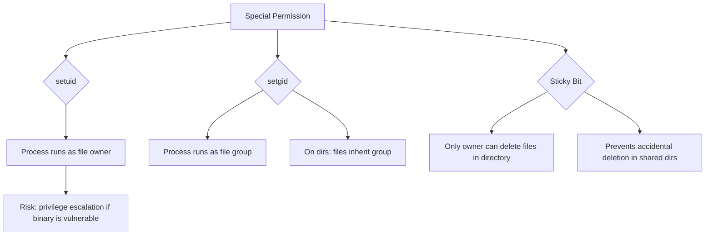
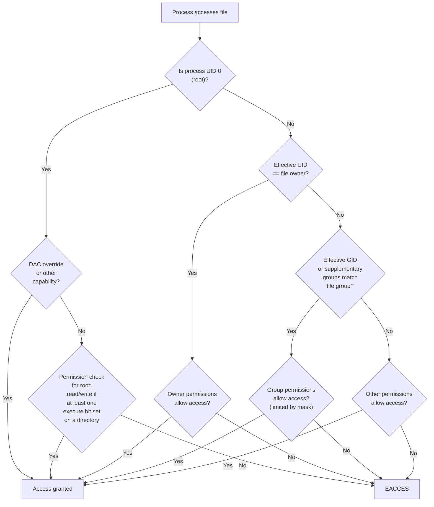

## Unix Permission Model

Every file and directory on a Linux system carries a set of permission bits that control which users
can read, write, or execute it. The kernel enforces these permissions during every file system
operation.

### Permission Bits

Each file has three categories of permissions, each with three bits:

| Category      | Read (r)                                    | Write (w)                                     | Execute (x)                |
| ------------- | ------------------------------------------- | --------------------------------------------- | -------------------------- |
| **Owner (u)** | Read file contents / List directory entries | Modify file / Create/delete directory entries | Run file / Enter directory |
| **Group (g)** | Same as owner for group members             | Same                                          | Same                       |
| **Other (o)** | Same for everyone else                      | Same                                          | Same                       |

### Octal Notation

| Octal | Binary | Permission |
| ----- | ------ | ---------- |
| 0     | 000    | ---        |
| 1     | 001    | --x        |
| 2     | 010    | -w-        |
| 3     | 011    | -wx        |
| 4     | 100    | r--        |
| 5     | 101    | r-x        |
| 6     | 110    | rw-        |
| 7     | 111    | rwx        |

Common permission sets:

| Octal | Meaning   | Use Case                                    |
| ----- | --------- | ------------------------------------------- |
| 755   | rwxr-xr-x | Executables, directories                    |
| 644   | rw-r--r-- | Regular files                               |
| 700   | rwx------ | Private scripts                             |
| 600   | rw------- | SSH keys, config files                      |
| 400   | r-------- | Read-only secrets                           |
| 711   | rwx--x--x | Public directories (listable only by owner) |

### Viewing Permissions

```bash
# Long listing shows permissions, owner, group
ls -la /etc/passwd
# -rw-r--r-- 1 root root 2847 Jan 15 10:30 /etc/passwd

# Numeric view
stat -c '%a %n' /etc/passwd
# 644 /etc/passwd

stat -c '%A %U:%G %n' /etc/passwd
# -rw-r--r-- root:root /etc/passwd

# Full stat output
stat /etc/passwd
```

### Directory Permissions

Directory permissions have different semantics than file permissions:

| Permission | File                 | Directory                                      |
| ---------- | -------------------- | ---------------------------------------------- |
| r          | Read file contents   | List filenames (requires x)                    |
| w          | Modify file contents | Create/delete/rename files (requires x)        |
| x          | Execute as a program | Enter directory (cd), access inode information |

```text
To list directory contents:    r + x
To create/delete files:        w + x
To access a file inside:       x on every parent directory

Without x on a directory:
  - Cannot cd into it
  - Cannot stat files inside it
  - Cannot read files even if they are 644

Without r on a directory:
  - Cannot list files (ls fails)
  - But can access files if you know their names (cat dir/file works)
```

```bash
# Example: a directory where you can access files but not list them
mkdir secret && chmod 711 secret
echo "hidden content" > secret/data.txt
chmod 644 secret/data.txt

# Other users cannot list the directory
ls secret/          # Permission denied

# But can read the file if they know the name
cat secret/data.txt # works!
```

## chmod — Change Permissions

### Symbolic Mode

```bash
# Format: who + action + permission
# who: u (owner), g (group), o (other), a (all)
# action: + (add), - (remove), = (set exactly)
# permission: r, w, x, X, s, t, u, g, o

# Add execute for owner
chmod u+x script.sh

# Remove write for group and other
chmod go-w file.txt

# Set exact permissions
chmod u=rwx,g=rx,o= file.txt

# Recursively set directories to 755, files to 644
chmod -R a=rX,u+w .   # X sets x only if already x for any category, or if directory
find . -type d -exec chmod 755 {} +
find . -type f -exec chmod 644 {} +

# Reference mode (copy permissions from another file)
chmod --reference=reference.txt target.txt
```

### Numeric Mode

```bash
chmod 755 script.sh      # rwxr-xr-x
chmod 600 id_rsa         # rw-------
chmod 644 config.conf    # rw-r--r--
chmod 1777 /tmp          # rwxrwxrwt (sticky bit)
chmod 4755 /usr/bin/sudo # rwsr-xr-x (setuid)
```

## chown and chgrp

```bash
# Change owner
chown user file.txt

# Change group
chgrp group file.txt

# Change both owner and group
chown user:group file.txt

# Change owner, keep group
chown user: file.txt

# Change group only (shortcut)
chown :group file.txt

# Recursive
chown -R user:group /var/www/html/

# Reference
chown --reference=ref.txt target.txt
```

:::info

Only root can change the owner of a file. The owner can change the group to any group they are a
member of. This is enforced by the kernel: the `chown(2)` system call checks `capable(CAP_CHOWN)`.

:::

## umask

The umask (user file creation mask) determines the default permissions for newly created files and
directories. It is a mask that is subtracted from the maximum permissions:

| Creation     | Maximum | Applied as         | umask 0022 result |
| ------------ | ------- | ------------------ | ----------------- |
| Regular file | 0666    | 0666 & ~022 = 0644 | rw-r--r--         |
| Directory    | 0777    | 0777 & ~022 = 0755 | rwxr-xr-x         |

```bash
# View current umask
umask          # outputs octal (e.g., 0022)
umask -S       # symbolic form (u=rwx,g=rx,o=rx)

# Set umask
umask 0027     # owner: rwx, group: rx, other: ---
umask 0077     # owner only (private)

# Common umask values
# 0022 — world-readable (default on most systems)
# 0027 — group-readable, no world access
# 0077 — private (SSH, PGP directories)

# Set in profile
echo 'umask 0027' >> ~/.profile
```

:::warning

`umask` only affects permissions at creation time. It does not modify existing files. If you need to
tighten permissions on existing files, use `chmod` explicitly. Also, `umask` only removes bits — it
never adds execute permission to files, which is why `touch newfile` creates files with 0666 &
~umask (e.g., 0644), never with execute bits set.

:::

## Special Bits

### setuid (SUID) — Octal 4000

When the setuid bit is set on an executable, the process runs with the **effective UID of the file
owner**, not the calling user. This allows non-root users to perform operations that require
elevated privileges.

```bash
# Set setuid
chmod u+s /usr/local/bin/myapp
chmod 4755 /usr/local/bin/myapp

# Identify setuid files
find /usr -perm -4000 -type f

# Example: passwd command
ls -la /usr/bin/passwd
# -rwsr-xr-x 1 root root 68208 ...
#    ^
#    setuid bit (s in owner execute position)
```

```text
How setuid works:
1. User runs /usr/bin/passwd
2. Kernel checks: file has setuid bit, owner is root
3. Process effective UID = root (real UID remains the calling user)
4. Process can write to /etc/shadow (owned by root, mode 0640)
5. Process validates old password, writes new hash
```

### setgid (SGID) — Octal 2000

On executables: the process runs with the **effective GID of the file's group**.

On directories: new files created inside inherit the **directory's group** rather than the creator's
primary group.

```bash
# Set setgid on directory
chmod g+s /var/www/html
chgrp webdev /var/www/html

# New files in /var/www/html now belong to webdev group
touch /var/www/html/newfile.txt
ls -la /var/www/html/newfile.txt
# -rw-r--r-- 1 alice webdev 0 ...

# Identify setgid files and directories
find / -perm -2000 -type f
find / -perm -2000 -type d
```

### Sticky Bit — Octal 1000

When set on a directory, only the file owner (or root) can delete or rename files within it,
regardless of the directory's write permissions.

```bash
# Set sticky bit
chmod +t /shared/tmp
chmod 1777 /shared/tmp

# The classic example
ls -la /tmp
# drwxrwxrwt 18 root root 4096 ...

# Identify directories with sticky bit
find / -perm -1000 -type d
```

### Security Implications



```bash
# Audit setuid/setgid binaries regularly
find / -perm -4000 -type f -exec ls -la {} \; 2>/dev/null
find / -perm -2000 -type f -exec ls -la {} \; 2>/dev/null

# Check for unauthorized setuid binaries
find / -perm -4000 -type f ! -user root -exec ls -la {} \; 2>/dev/null

# Remove setuid if not needed
chmod u-s /path/to/binary
```

:::danger

Never set setuid on shell scripts. Shell scripts are interpreted by `/bin/bash` (or similar), which
itself would need setuid. Instead, use a compiled wrapper or sudo. A setuid shell script is a
privilege escalation vulnerability.

:::

## Access Control Lists (ACLs)

ACLs extend the traditional Unix permission model with fine-grained, per-user and per-group rules.
When ACLs are active, the traditional permission bits become a summary of the ACL.

### ACL Concepts

```text
Standard permissions:
  owner: rwx  group: r-x  other: r-x

ACL adds:
  user:alice:rw-
  user:bob:r-x
  group:devs:rwx
  group:ops:--x
  default:user:alice:rw-
  default:group:devs:rwx
  mask::rwx
```

### Commands

```bash
# Install ACL tools (if not present)
apt-get install acl    # Debian/Ubuntu
dnf install acl        # Fedora/RHEL

# View ACLs
getfacl file.txt
getfacl /var/www/html/

# Add user ACL
setfacl -m u:alice:rw file.txt
setfacl -m u:bob:rx file.txt

# Add group ACL
setfacl -m g:devs:rwx directory/

# Set default ACL (applied to new files in directory)
setfacl -m d:u:alice:rw directory/
setfacl -m d:g:devs:rx directory/
setfacl -m d:o::--- directory/

# Remove ACL entry
setfacl -x u:alice file.txt
setfacl -x g:devs file.txt

# Remove all ACLs (restore to standard permissions)
setfacl -b file.txt
setfacl -R -b directory/

# Copy ACLs from one file to another
getfacl reference.txt | setfacl -M - target.txt

# Recursive ACL
setfacl -R -m g:devs:rx /var/www/html/
```

### ACL Mask

The mask is a special ACL entry that limits the maximum effective permissions for named users, named
groups, and the file group. It does not affect the owner or other permissions.

```bash
# The mask appears as the group permission in ls -l
setfacl -m u:alice:rwx,g:devs:rwx file.txt
ls -la file.txt
# -rw-rwx---+ 1 root root 0 ...
#         ^
#         + indicates ACLs are present
#   rwx = mask (not the group permission)

# Change mask
setfacl -m m::rx file.txt
ls -la file.txt
# -rw-r-x---+ 1 root root 0 ...
#   r-x = new mask
```

### Default ACLs

Default ACLs on directories define the ACLs that new files and subdirectories will inherit:

```bash
# Set default ACL on a directory
setfacl -m d:u:deploy:rw -m d:g:webdev:rx -m d:o::- /var/www/html/

# Verify defaults
getfacl /var/www/html/
# default:user:deploy:rw-
# default:group:webdev:r-x
# default:other::---

# New files created in this directory inherit these ACLs
touch /var/www/html/new.html
getfacl /var/www/html/new.html
# user:deploy:rw-
# group:webdev:r-x
# mask::r-x
```

### Backup and Restore ACLs

```bash
# Backup ACLs
getfacl -R /var/www/html/ > www_acl_backup.txt

# Restore ACLs
setfacl --restore=www_acl_backup.txt

# Backup for migration (ACLs are not stored in standard tar)
getfacl -R /data/ > data_acls.txt
tar cpf data.tar /data/
# On the new system:
tar xpf data.tar
setfacl --restore=data_acls.txt
```

## Capabilities

Linux capabilities break root privileges into discrete units, allowing fine-grained privilege
assignment without full root access.

### Common Capabilities

| Capability             | Description                                      |
| ---------------------- | ------------------------------------------------ |
| `CAP_NET_BIND_SERVICE` | Bind to privileged ports (&lt;1024)              |
| `CAP_NET_RAW`          | Use raw and packet sockets                       |
| `CAP_SYS_ADMIN`        | Mount, swapon, various admin operations          |
| `CAP_SYS_PTRACE`       | Trace processes with ptrace                      |
| `CAP_DAC_OVERRIDE`     | Bypass file read/write/execute permission checks |
| `CAP_DAC_READ_SEARCH`  | Bypass file read permission and directory search |
| `CAP_CHOWN`            | Change file ownership                            |
| `CAP_SETUID`           | Set user ID                                      |
| `CAP_SETGID`           | Set group ID                                     |
| `CAP_KILL`             | Send signals to any process                      |
| `CAP_SYSLOG`           | Use privileged syslog                            |

### setcap and getcap

```bash
# Assign capability to a binary
setcap cap_net_bind_service=+ep /usr/bin/myapp
# =ep means effective + permitted

# View capabilities
getcap /usr/bin/myapp
# /usr/bin/myapp cap_net_bind_service=ep

# Remove all capabilities
setcap -r /usr/bin/myapp

# View all files with capabilities
getcap -r /usr/ 2>/dev/null

# Allow a non-root process to bind to port 80
setcap 'cap_net_bind_service=+ep' /usr/bin/nginx
# nginx can now bind to port 80 without running as root
```

### Capability Bounding Set

```bash
# Drop all capabilities (except those explicitly granted)
# This is a common security hardening practice
systemd-run --property=CapabilityBoundingSet="" -- ./myapp

# View the current bounding set
cat /proc/self/status | grep CapBnd
```

### Inherited vs Ambient Capabilities

```text
Permitted (P):  Capabilities the process can assume
Effective (E):  Capabilities currently active
Inheritable (I): Capabilities preserved across execve()
Ambient (A):    Capabilities preserved across execve() AND
                automatically added to permitted set

To pass capabilities to a non-setuid binary:
1. Set inheritable caps on the binary
2. Run the parent with ambient caps set
```

```bash
# Set ambient capability (in bash script)
capsh --drop="cap_net_raw" -- -c "ping -c 1 localhost"

# Set ambient capability programmatically
# prctl(PR_CAP_AMBIENT, PR_CAP_AMBIENT_RAISE, CAP_NET_RAW, 0, 0)
```

## File Attributes

File attributes (managed by `chattr`/`lsattr`) are separate from permissions. They are enforced by
the ext4 filesystem (and others that support them) and cannot be overridden by root or capabilities.

### Common Attributes

| Attribute | Description                                             |
| --------- | ------------------------------------------------------- |
| `a`       | Append only — file can only be opened for append        |
| `A`       | No atime updates — do not update access time            |
| `i`       | Immutable — cannot be modified, deleted, or renamed     |
| `j`       | Data journalling — write data to journal first          |
| `s`       | Secure deletion — zero blocks on deletion               |
| `S`       | Synchronous updates — write changes to disk immediately |
| `e`       | Extents format — uses extents (ext4 default)            |
| `d`       | No dump — exclude from dump backups                     |

### chattr and lsattr

```bash
# View attributes
lsattr file.txt
# --------------e----- file.txt

# Set immutable
chattr +i /etc/resolv.conf
# Even root cannot modify this file
echo "test" >> /etc/resolv.conf    # Operation not permitted
rm /etc/resolv.conf                # Operation not permitted

# Remove immutable
chattr -i /etc/resolv.conf

# Set append-only
chattr +a /var/log/audit.log
# Can append but not delete or modify existing content
echo "$(date) audit entry" >> /var/log/audit.log
# rm /var/log/audit.log  — Operation not permitted

# Set no atime updates (performance)
chattr +A /data/files/

# Recursive
chattr -R +A /srv/data/

# List attributes recursively
lsattr -R /srv/data/
```

:::warning

`chattr +i` is a powerful security measure but can cause problems during automated configuration
management. Ansible, Puppet, and similar tools may fail silently when trying to modify immutable
files. Always ensure configuration management systems can remove the immutable bit before making
changes.

:::

### Extended Attributes (xattr)

Extended attributes are name-value pairs associated with files, beyond the standard inode metadata.

```bash
# Install tools
apt-get install attr    # Debian/Ubuntu
dnf install attr        # Fedora/RHEL

# Set an extended attribute
setfattr -n user.comment -v "production config" /etc/app/config.yaml

# Get an extended attribute
getfattr -n user.comment /etc/app/config.yaml
# file: /etc/app/config.yaml
# user.comment="production config"

# Get all extended attributes
getfattr -d /etc/app/config.yaml

# List all attributes (including system)
getfattr -d -m '.*' /etc/app/config.yaml

# Remove an attribute
setfattr -x user.comment /etc/app/config.yaml

# Copy extended attributes (requires --xattrs)
cp --preserve=xattr source dest
tar --xattrs -cf archive.tar /data/
rsync -aX /src/ /dest/
```

Common extended attribute namespaces:

| Namespace   | Description                                    |
| ----------- | ---------------------------------------------- |
| `user.`     | User-defined (any user can set on owned files) |
| `system.`   | System-managed (POSIX ACLs stored here)        |
| `security.` | SELinux labels stored here                     |
| `trusted.`  | Kernel-managed, root only                      |

## Permission Checking Algorithm

When a process attempts to access a file, the kernel performs the following checks:



:::info

The kernel checks ACLs if they exist on the file. The check order is: owner, named users (most
specific first), owning group or named groups, mask, other. The first matching entry that grants or
denies the requested access determines the result. The mask limits the maximum effective permissions
for all named users, named groups, and the owning group.

:::

### Permission Check Summary

```text
1. If process is root (UID 0):
   a. If CAP_DAC_OVERRIDE is in effective set: grant
   b. For directories: grant if at least one execute bit is set
   c. For files: grant read/write, deny execute unless at least one execute bit is set

2. If ACLs exist:
   a. Check if effective UID matches file owner -> use owner permissions
   b. Check named user entries -> use matching entry (masked)
   c. Check if effective GID or supplementary groups match file group -> use group (masked)
   d. Check named group entries -> use matching entry (masked)
   e. Use other permissions

3. If no ACLs:
   a. Owner match -> use owner permissions
   b. Group match -> use group permissions
   c. Other -> use other permissions
```

## find with -perm

```bash
# Find files with exactly 644 permissions
find /etc -perm 644

# Find files with at least the specified bits set
find /etc -perm -644    # 644 or higher (744, 755, 777, etc.)

# Find files with any of the specified bits set
find /etc -perm /644    # any file with r for any category

# Find world-writable files
find / -perm -o+w -type f 2>/dev/null

# Find files without any group or other permissions
find /etc -perm /600    # only owner has any permissions

# Find setuid files
find / -perm -4000 -type f 2>/dev/null

# Find setgid files
find / -perm -2000 -type f 2>/dev/null

# Find sticky bit directories
find / -perm -1000 -type d 2>/dev/null

# Find files with specific octal and group ownership
find /var -perm 640 -group www-data

# Find and fix permissions
find /var/www -type f -exec chmod 644 {} +
find /var/www -type d -exec chmod 755 {} +
```

## SUID/SGID Security Risks

```bash
# Find all setuid root binaries
find / -perm -4000 -user root -type f 2>/dev/null

# Check for writable setuid directories
find / -perm -2000 -type d -perm -o+w 2>/dev/null

# Find setuid binaries not owned by root
find / -perm -4000 ! -user root -type f 2>/dev/null

# Audit setuid binaries that are writable by non-root
find / -perm -4000 -type f ! -perm -u+s -writable 2>/dev/null
```

:::danger

A writable setuid binary is a critical vulnerability. An attacker can replace the binary with
malicious code, and it will execute with the file owner's privileges. Regularly audit setuid and
setgid binaries, and remove the setuid/setgid bit from any binary that does not strictly require it.

:::

## Common Pitfalls

### Pitfall: ACL Mask Obscuring Effective Permissions

```bash
setfacl -m u:alice:rwx /shared/file.txt
setfacl -m m::r-x /shared/file.txt   # mask restricts to r-x

# Alice's effective permissions are r-x, NOT rwx
# The ls -l output shows the mask, not the actual group permission
getfacl /shared/file.txt
# user:alice:rwx        #effective:r-x
# mask::r-x
```

### Pitfall: Root Cannot Modify Immutable Files

```bash
chattr +i /etc/resolv.conf

# Even as root, these all fail:
echo "nameserver 8.8.8.8" > /etc/resolv.conf    # Operation not permitted
rm /etc/resolv.conf                               # Operation not permitted
mv /etc/resolv.conf /etc/resolv.conf.bak         # Operation not permitted

# Must remove immutable first
chattr -i /etc/resolv.conf
```

### Pitfall: setuid Scripts Do Not Work

```bash
# This does NOT work:
chmod 4755 myscript.sh

# The shebang line causes the script to run under /bin/bash,
# not as the script file's owner. The kernel does not honor
# setuid on interpreted files for security reasons.
#
# Instead, use:
# 1. sudo for the specific command
# 2. A compiled setuid wrapper in C
# 3. file capabilities on the interpreter (rare, dangerous)
```

### Pitfall: Forgetting to Set Default ACLs

```bash
# Setting ACL on a directory does NOT affect existing files
setfacl -m u:deploy:rw /var/www/html/

# Existing files are unchanged
getfacl /var/www/html/index.html   # no deploy entry

# Use -R for existing files
setfacl -R -m u:deploy:rw /var/www/html/

# Use -d for future files
setfacl -m d:u:deploy:rw /var/www/html/
```

### Pitfall: umask Does Not Affect chmod

```bash
umask 0077

# Creating new files
touch newfile.txt       # mode 0600 (0666 & ~0077)

# But cp preserves source permissions
cp template.txt newfile.txt   # inherits template.txt's permissions, umask ignored
# Use install to respect umask
install -m 0644 template.txt newfile.txt
```

### Pitfall: Capability Loss on Copy

```bash
setcap cap_net_bind_service=+ep /usr/bin/myapp

# Copying the binary strips capabilities
cp /usr/bin/myapp /tmp/myapp
getcap /tmp/myapp    # (empty — no capabilities)

# Use install or tar with xattrs to preserve
getfattr -d -m '.*' /usr/bin/myapp   # check security.capability xattr
```
