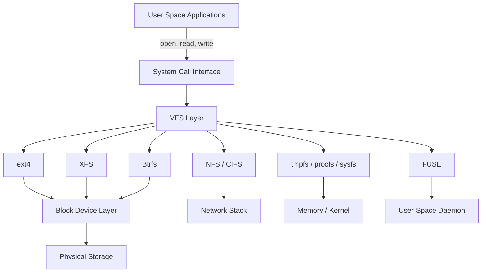
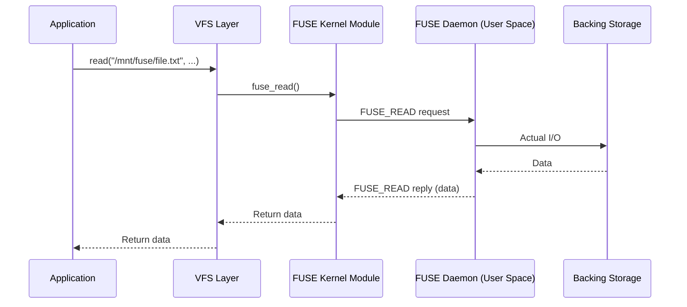

## Virtual File System (VFS) Layer

The Virtual File System layer is the kernel abstraction that allows Linux to support multiple file
system types simultaneously. Application code calls `open(2)`, `read(2)`, `write(2)`, and `stat(2)`
without knowing whether the underlying storage uses ext4, XFS, Btrfs, NFS, or a pseudo-filesystem
like procfs.



### VFS Objects

The VFS maintains four primary object types:

| Object         | Description                                                        | Kernel Type          |
| -------------- | ------------------------------------------------------------------ | -------------------- |
| **superblock** | Describes a mounted file system (type, size, flags)                | `struct super_block` |
| **inode**      | Represents a single file (metadata: permissions, size, timestamps) | `struct inode`       |
| **dentry**     | Directory entry — maps a name to an inode                          | `struct dentry`      |
| **file**       | Represents an open file (current offset, access mode)              | `struct file`        |

The dentry cache (dcache) holds the directory hierarchy in memory, avoiding disk lookups for
frequently accessed paths. The inode cache (icache) keeps recently accessed inodes in memory. Both
caches are critical for performance — a warm dentry cache means `stat(2)` on a file requires no disk
I/O.

### File System Registration

Each file system type registers with the VFS using `register_filesystem()`. The registration
includes a `struct file_system_type` that provides:

- Name (e.g., "ext4", "xfs", "btrfs")
- Mount function pointer
- Kill superblock function pointer
- Module owner (for loadable modules)

When `mount(2)` is called, the VFS invokes the appropriate file system's mount function, which reads
the superblock from disk and populates the VFS superblock object.

## Inode Structure

An inode (index node) is the fundamental data structure representing a file on disk. It contains all
metadata about a file except the filename (which is stored in the directory's data blocks, not in
the inode itself).

### Inode Fields

| Field        | Description                                       |
| ------------ | ------------------------------------------------- |
| `st_mode`    | File type and permissions (16 bits)               |
| `st_ino`     | Inode number (unique within file system)          |
| `st_dev`     | Device number (identifies the file system)        |
| `st_nlink`   | Hard link count                                   |
| `st_uid`     | Owner user ID                                     |
| `st_gid`     | Owner group ID                                    |
| `st_size`    | File size in bytes (for regular files)            |
| `st_blksize` | Preferred block size for I/O                      |
| `st_blocks`  | Number of 512-byte blocks allocated               |
| `st_atim`    | Last access time (can be disabled with `noatime`) |
| `st_mtim`    | Last modification time (data change)              |
| `st_ctim`    | Last status change time (metadata change)         |

### Hard Links and the Inode

A hard link is simply an additional directory entry pointing to the same inode. The inode's link
count (`st_nlink`) tracks how many directory entries reference it. When the link count reaches zero
and no process has the file open, the inode and its data blocks are freed.

```bash
# Demonstrate hard links
echo "content" > file1.txt
ln file1.txt file2.txt        # hard link
ln -s file1.txt file3.txt     # symbolic link

stat file1.txt
# Inode: 123456  Links: 2

stat file2.txt
# Inode: 123456  Links: 2  (same inode)

stat file3.txt
# Inode: 789012  Links: 1  (different inode — symlink)
```

### File Types

The file type is encoded in the upper bits of `st_mode`:

| Octal  | Type              | Description                           |
| ------ | ----------------- | ------------------------------------- |
| 010000 | Regular file      | Normal data file                      |
| 004000 | Directory         | Contains directory entries            |
| 012000 | Symbolic link     | Pointer to another file               |
| 001000 | FIFO (named pipe) | Inter-process communication           |
| 006000 | Block device      | Buffered access (e.g., `/dev/sda`)    |
| 002000 | Character device  | Unbuffered access (e.g., `/dev/null`) |
| 014000 | Socket            | Network communication endpoint        |

```bash
# Test file types
[ -f file ]     # regular file
[ -d dir ]      # directory
[ -L link ]     # symbolic link
[ -p pipe ]     # named pipe
[ -b dev ]      # block device
[ -c dev ]      # character device
[ -S socket ]   # socket

# Using stat
stat -c '%F' /dev/null    # "character special file"
stat -c '%F' /dev/sda     # "block special file"
```

## ext4

ext4 is the default file system on most Linux distributions. It is the evolutionary successor to
ext2 and ext3, adding extents, larger volumes, journal checksumming, and delayed allocation.

### Key Features

| Feature             | ext4 Details                                          |
| ------------------- | ----------------------------------------------------- |
| **Max volume size** | 1 EiB (2^64 bytes theoretical, 64 TiB practical)      |
| **Max file size**   | 16 TiB                                                |
| **Max files**       | ~4 billion                                            |
| **Block sizes**     | 1024, 2048, 4096 bytes                                |
| **Journaling**      | Ordered mode (default), writeback, journal            |
| **Allocation**      | Extents (replaces indirect block mapping)             |
| **Checksums**       | Journal checksums, metadata checksums (metadata_csum) |
| **Timestamps**      | nanosecond granularity                                |

### Extents

Traditional ext2/ext3 used indirect block mapping — the inode pointed to a block of pointers, which
could point to more pointer blocks (up to 3 levels of indirection). This was inefficient for large
files because even a contiguous file required multiple block pointer lookups.

ext4 introduces **extents** — a descriptor that maps a contiguous range of blocks. An extent can
describe up to 128 MiB of contiguous data in a single descriptor. For most files, the extent tree
fits entirely within the inode (no separate extent block needed).

```text
Extent descriptor:
  [logical_block, physical_block, length]
  [0, 1000, 100]  → blocks 0-99 mapped to disk blocks 1000-1099
```

### Journaling

ext4 uses a journal to ensure file system consistency after a crash. The journal records metadata
changes (and optionally data changes) before committing them to the main file system.

| Journal Mode        | What is Journaled                                      | Performance | Safety  |
| ------------------- | ------------------------------------------------------ | ----------- | ------- |
| `ordered` (default) | Metadata only (data written before metadata committed) | Good        | High    |
| `writeback`         | Metadata only (no ordering guarantee)                  | Best        | Medium  |
| `journal`           | Both metadata and data                                 | Slowest     | Highest |

```bash
# View current journal mode
tune2fs -l /dev/sda1 | grep "Default mount options"

# Set journal mode (in /etc/fstab or tune2fs)
mount -o data=journal /dev/sda1 /mnt
```

### Delayed Allocation

ext4 uses **delayed allocation** (delalloc): when a process writes data, the blocks are not
immediately allocated on disk. Instead, the data is held in memory, and allocation is deferred until
the kernel flushes it. This allows the allocator to make better decisions about contiguous block
placement, significantly reducing fragmentation.

The downside: a crash before flush can lose more data than with immediate allocation. For databases
that manage their own I/O (MySQL, PostgreSQL), delayed allocation should be disabled:

```bash
# Disable delayed allocation for database volumes
mount -o nodelalloc /dev/sdb1 /var/lib/mysql
# or in /etc/fstab:
# /dev/sdb1  /var/lib/mysql  ext4  defaults,nodelalloc  0 2
```

### ext4 Tuning

```bash
# Reserve blocks for root (default 5%)
tune2fs -m 1 /dev/sda1    # reduce to 1%

# Enable directory indexing
tune2fs -O dir_index /dev/sda1

# Enable large file support
tune2fs -O large_file /dev/sda1

# Enable 64-bit mode (required for volumes > 16 TiB)
tune2fs -O 64bit /dev/sda1

# Check file system (must be unmounted or read-only)
e2fsck -f /dev/sda1

# View file system parameters
tune2fs -l /dev/sda1
dumpe2fs /dev/sda1

# Resize ext4 (can be done online for grow, offline for shrink)
resize2fs /dev/sda1 500G     # grow to 500 GiB
```

## XFS

XFS is a high-performance journaling file system developed by SGI in 1993, designed for parallel I/O
and large files. It is the default on RHEL/CentOS 7+ and is well-suited for large data volumes,
media workloads, and databases.

### Key Features

| Feature               | XFS Details                                             |
| --------------------- | ------------------------------------------------------- |
| **Max volume size**   | 16 EiB (8 EiB on 32-bit systems)                        |
| **Max file size**     | 8 EiB                                                   |
| **Max files**         | Practically unlimited (based on space)                  |
| **Block sizes**       | 512 to 65536 bytes (must be a power of 2, page-aligned) |
| **Journaling**        | Metadata-only journal (separate log device supported)   |
| **Allocation**        | B+tree-based extent allocation                          |
| **Allocation Groups** | Independent regions for parallel allocation             |

### Allocation Groups

An XFS file system is divided into **Allocation Groups** (AGs), each of which manages its own free
space and inodes independently. This design enables parallel I/O — multiple processes can allocate
blocks in different AGs simultaneously without lock contention.

```bash
# View allocation group information
xfs_info /dev/sdb1
# agcount=4, agsize=...  (4 allocation groups)

# AG count is automatically calculated based on volume size:
# Volume &lt; 1 GiB:   1 AG
# Volume &lt; 4 GiB:   4 AGs
# Volume &lt; 16 GiB:  8 AGs
# Volume &lt; 64 GiB:  16 AGs
# Volume &lt; 256 GiB: 32 AGs
# etc.
```

### B+tree Structures

XFS uses B+trees extensively for its internal data structures:

- **Inode B+tree**: Maps inode numbers to inode locations within AGs
- **Free space B+tree**: Tracks free extents within each AG (by block number and by extent length)
- **Extent B+tree**: Maps file offsets to disk extents (for files with more than 4 extents)

B+trees are preferred over B-trees because all data is stored in leaf nodes, and internal nodes
contain only keys. This means each internal node can hold more keys, reducing tree depth and the
number of disk seeks required for lookups.

### XFS vs ext4

| Aspect                 | ext4                            | XFS                                         |
| ---------------------- | ------------------------------- | ------------------------------------------- |
| **Volume resize**      | Can grow online, shrink offline | Can grow online, cannot shrink              |
| **Metadata repair**    | `e2fsck` (can be slow)          | `xfs_repair` (fast but requires free space) |
| **Delete performance** | Good                            | Excellent (delayed allocation of AGs)       |
| **Large files**        | Good                            | Excellent (designed for large files)        |
| **Small files**        | Better                          | Good (more metadata overhead)               |
| **Fragmentation**      | More susceptible                | Less (extents + AGs)                        |
| **Snapshots**          | No native support               | No native support (use LVM/Btrfs)           |

### XFS Tuning

```bash
# Create XFS with specific options
mkfs.xfs -f -b size=4096 -d agcount=8 -l size=512m /dev/sdb1

# View XFS parameters
xfs_info /mount/point

# Grow XFS (online, no shrink possible)
xfs_growfs /mount/point

# Repair XFS (must be unmounted)
xfs_repair /dev/sdb1

# Freeze/thaw file system (for consistent snapshots)
xfs_freeze -f /mount/point
# ... take snapshot ...
xfs_freeze -u /mount/point

# Defragment a file
xfs_fsr /mount/point/path/to/file
```

:::warning

XFS **cannot be shrunk**. If you need to reduce an XFS volume, you must back up, recreate with a
smaller size, and restore. Plan your volume sizes carefully when choosing XFS.

:::

## Btrfs

Btrfs (B-tree file system, pronounced "butter-fs") is a copy-on-write (COW) file system with
built-in volume management, snapshots, checksumming, and compression. It is the default on Fedora
and is used by Synology NAS systems.

### Key Features

| Feature             | Btrfs Details                                            |
| ------------------- | -------------------------------------------------------- |
| **Copy-on-Write**   | All data and metadata writes are COW                     |
| **Snapshots**       | Instant, space-efficient (read-only or read-write)       |
| **Subvolumes**      | Independent file trees within a single volume            |
| **Built-in RAID**   | RAID 0, 1, 10, 5, 6 (DUP for single-device metadata)     |
| **Checksumming**    | CRC-32c on data and metadata (detects silent corruption) |
| **Compression**     | LZ4 (default), ZSTD, LZO, ZLIB                           |
| **Send/Receive**    | Efficient incremental snapshot transfer                  |
| **Defragmentation** | Online defragmentation with `btrfs filesystem defrag`    |

### Copy-on-Write (COW)

When a file is modified in Btrfs, the old data blocks are not overwritten. Instead, new blocks are
allocated, the modified data is written there, and the metadata is updated to point to the new
blocks. The old blocks are freed only after the write is complete.

This has significant implications:

- **Snapshots are cheap**: A snapshot is simply a metadata reference to the current state. Creating
  a snapshot takes O(1) time and no data copying.
- **Crash consistency**: If the system crashes during a write, either the old or new version is
  intact — never a partially written state.
- **Write amplification**: Small random writes cause block fragmentation. A 1-byte modification to a
  128 KiB block requires writing the entire new block.
- **Fragmentation over time**: Repeated COW writes fragment large files. This is particularly
  problematic for databases and VM images.

```bash
# Create a Btrfs file system
mkfs.btrfs /dev/sdb1

# Create with multiple devices
mkfs.btrfs -d raid1 -m raid1 /dev/sdb1 /dev/sdc1

# Mount with compression
mount -o compress=zstd /dev/sdb1 /mnt/btrfs
```

### Subvolumes and Snapshots

A subvolume is an independently mountable file tree within a Btrfs volume. Snapshots are subvolumes
that share data blocks with their source.

```bash
# Create a subvolume
btrfs subvolume create /mnt/btrfs/@home

# Create a read-only snapshot
btrfs subvolume snapshot -r /mnt/btrfs/@home /mnt/btrfs/@home_snapshot_2024

# Create a read-write snapshot
btrfs subvolume snapshot /mnt/btrfs/@home /mnt/btrfs/@home_copy

# List subvolumes
btrfs subvolume list /mnt/btrfs

# Delete a subvolume (must not be mounted)
btrfs subvolume delete /mnt/btrfs/@home_copy

# Send/Receive — incremental backup
btrfs send /mnt/btrfs/@home_snapshot_2024 | btrfs receive /backup/btrfs/

# Incremental send (only changes since previous snapshot)
btrfs send -p /mnt/btrfs/@home_snapshot_2023 /mnt/btrfs/@home_snapshot_2024 | \
    btrfs receive /backup/btrfs/
```

### Btrfs RAID

Btrfs implements RAID at the file system level (not block level like mdadm). This means RAID is
per-extent, not per-device, and can be configured differently for data and metadata:

```bash
# RAID 1 for data, DUP for metadata (single device)
mkfs.btrfs -d single -m dup /dev/sdb1

# RAID 1 across two devices
mkfs.btrfs -d raid1 -m raid1 /dev/sdb1 /dev/sdc1

# View balance status
btrfs balance status /mnt/btrfs

# Convert RAID level (online)
btrfs balance start -dconvert=raid1 -mconvert=raid1 /mnt/btrfs

# Scrub — verify checksums and repair if redundant copies exist
btrfs scrub start /mnt/btrfs
btrfs scrub status /mnt/btrfs
```

:::warning

Btrfs RAID 5/6 has known write-hole issues that can cause data loss during a power failure. The
Btrfs documentation recommends against using RAID 5/6 in production. Use RAID 1 or RAID 10 instead.

:::

### When to Use Btrfs

Btrfs excels in scenarios where:

- You need frequent snapshots (backup, testing, rollbacks)
- Data integrity verification is critical (checksumming detects bit rot)
- You want built-in compression to save space
- You need flexible volume management without LVM

Btrfs is not ideal for:

- High-performance databases (COW write amplification)
- VM image storage (same reason)
- Workloads with heavy random write patterns

## FUSE

FUSE (Filesystem in Userspace) allows non-root users to implement file systems by running a daemon
process that handles VFS callbacks. The kernel communicates with the FUSE daemon through
`/dev/fuse`.



Common FUSE file systems:

| File System  | Purpose                             |
| ------------ | ----------------------------------- |
| `sshfs`      | Mount remote directories over SSH   |
| `ntfs-3g`    | Read/write NTFS support             |
| `bindfs`     | Remount with altered permissions    |
| `encfs`      | Encrypted file system layer         |
| `rclone`     | Mount cloud storage (S3, GCS, etc.) |
| `fuseiso`    | Mount ISO images                    |
| `exfat-fuse` | Read/write exFAT support            |

```bash
# Mount remote directory via SSH
sshfs user@host:/remote/path /mnt/remote

# Mount with specific options
sshfs -o allow_other,default_permissions,reconnect \
    user@host:/remote/path /mnt/remote

# Unmount
fusermount -u /mnt/remote

# Mount cloud storage
rclone mount remote:bucket /mnt/cloud --allow-other
```

## Mounting

### `mount` and `umount`

```bash
# Mount a file system
mount /dev/sdb1 /mnt/data

# Mount with options
mount -o noatime,nodev,nosuid /dev/sdb1 /mnt/data

# Mount by UUID (preferred — survives disk reordering)
mount UUID=abc123-def456 /mnt/data

# Mount by label
mount LABEL=data_volume /mnt/data

# View all mounts
mount
cat /proc/mounts
findmnt

# Unmount
umount /mnt/data

# Lazy unmount (detaches immediately, cleans up when no longer busy)
umount -l /mnt/data

# Force unmount (dangerous — can corrupt data)
umount -f /mnt/data
```

### `/etc/fstab`

The file system table defines mounts that persist across reboots:

```text
# &lt;device&gt;                                  &lt;mount point&gt;  &lt;type&gt;  &lt;options&gt;              &lt;dump&gt;  &lt;pass&gt;
UUID=abc123-def456                           /boot          ext4    defaults               0       2
UUID=fed789-ghi012                           /              ext4    errors=remount-ro       0       1
UUID=aaa111-bbb222                           /home          ext4    defaults               0       2
UUID=ccc333-ddd444                           /swap          swap    defaults               0       0
tmpfs                                        /tmp           tmpfs   defaults,nosuid,nodev   0       0
```

| Column      | Description                                                 |
| ----------- | ----------------------------------------------------------- |
| Device      | Device path, UUID=, LABEL=, or special (proc, sysfs, tmpfs) |
| Mount point | Directory where the file system is attached                 |
| Type        | File system type (auto detects if "auto")                   |
| Options     | Comma-separated mount options                               |
| Dump        | Whether to include in `dump` backups (0 = no, 1 = yes)      |
| Pass        | `fsck` check order (0 = skip, 1 = root, 2 = others)         |

### Common Mount Options

| Option                | Effect                                                    |
| --------------------- | --------------------------------------------------------- |
| `defaults`            | rw, suid, dev, exec, auto, nouser, async                  |
| `ro`                  | Read-only                                                 |
| `noatime`             | Do not update access time (reduces writes)                |
| `relatime`            | Update atime only if modified since last access (default) |
| `nosuid`              | Ignore SUID/SGID bits                                     |
| `nodev`               | Do not interpret block/character devices                  |
| `noexec`              | Do not allow execution of binaries                        |
| `sync`                | Synchronous I/O (all writes block until complete)         |
| `async`               | Asynchronous I/O (default)                                |
| `auto`                | Mounted at boot (`mount -a`)                              |
| `noauto`              | Not mounted at boot                                       |
| `users`               | Allow any user to mount (implies noexec, nosuid, nodev)   |
| `nofail`              | Do not fail boot if device is missing                     |
| `x-systemd.requires=` | systemd dependency declaration                            |

### systemd Automount

systemd can automount file systems on first access, reducing boot time for rarely-used mounts:

```text
# /etc/fstab entry with automount
# /dev/sdb1  /mnt/archive  ext4  noauto,x-systemd.automount,x-systemd.idle-timeout=300  0  0
```

## Pseudo-File Systems

### tmpfs

tmpfs is a file system stored entirely in virtual memory (RAM + swap). It is very fast and
automatically sized to available memory.

```bash
# Mount a tmpfs
mount -t tmpfs -o size=1G,nodev,nosuid,noexec tmpfs /mnt/ramdisk

# fstab entry
# tmpfs  /dev/shm  tmpfs  defaults,size=1G  0  0

# Resize online
mount -o remount,size=2G /dev/shm
```

Use cases: `/dev/shm` (POSIX shared memory), `/tmp` on some configurations, test directories, build
artifacts.

### procfs

procfs (`/proc`) exposes kernel and process information as files:

```bash
# CPU info
cat /proc/cpuinfo

# Memory info
cat /proc/meminfo

# Kernel version
cat /proc/version

# Loaded modules
cat /proc/modules

# Process-specific info
ls /proc/$PID/fd/          # open file descriptors
ls /proc/$PID/maps         # memory mappings
cat /proc/$PID/status      # process status
cat /proc/$PID/limits      # resource limits
cat /proc/$PID/cmdline     # command line arguments
cat /proc/$PID/environ     # environment variables
cat /proc/$PID/smaps       # detailed memory map
cat /proc/$PID/mountinfo   # mount points visible to this process

# Kernel parameters
cat /proc/sys/kernel/pid_max
cat /proc/sys/net/ipv4/ip_forward
```

### sysfs

sysfs (`/sys`) exposes kernel objects (devices, drivers, modules) as a directory hierarchy:

```bash
# List all block devices
ls /sys/block/

# View device attributes
cat /sys/block/sda/size          # size in sectors
cat /sys/block/sda/queue/scheduler  # I/O scheduler

# Network interface state
cat /sys/class/net/eth0/operstate
cat /sys/class/net/eth0/mtu

# CPU frequency scaling
cat /sys/devices/system/cpu/cpu0/cpufreq/scaling_governor
```

## File System Tuning

### Choosing the Right File System

| Workload                      | Recommended FS | Rationale                                      |
| ----------------------------- | -------------- | ---------------------------------------------- |
| General-purpose server        | ext4           | Mature, well-tested, can shrink                |
| Large data volumes, databases | XFS            | Excellent large file performance, parallel I/O |
| Desktop, NAS, snapshots       | Btrfs          | Snapshots, compression, data integrity         |
| Containers, overlays          | overlayfs      | Layered union mount, designed for containers   |
| Temporary data, builds        | tmpfs          | RAM-backed, no disk I/O                        |
| Removable media               | exFAT          | Cross-platform compatibility                   |

### I/O Scheduler Selection

```bash
# View current scheduler
cat /sys/block/sda/queue/scheduler

# Change scheduler
echo 'mq-deadline' > /sys/block/sda/queue/scheduler
```

| Scheduler     | Use Case                                    |
| ------------- | ------------------------------------------- |
| `mq-deadline` | General-purpose, spinning disks, SATA       |
| `none`        | SSDs and NVMe (hardware manages scheduling) |
| `bfq`         | Desktop interactivity, slow devices         |
| `kyber`       | Fast block devices (NVMe)                   |

### Block Size Selection

Block size affects performance based on workload:

| Block Size | Small Files (lots of &lt; 4 KiB) | Large Files (streaming) |
| ---------- | -------------------------------- | ----------------------- |
| 1 KiB      | Efficient (less wasted space)    | More I/O operations     |
| 4 KiB      | Good balance                     | Good balance            |
| 64 KiB     | Wasted space                     | Fewer I/O operations    |

For databases and VM images, larger block sizes reduce metadata overhead. For mail servers and
source code repositories, smaller block sizes reduce wasted space.

## Common Pitfalls

### Pitfall: Mounting Without `nofail` on Removable Drives

If an `/etc/fstab` entry for a USB drive or network share does not include `nofail`, the system will
drop to emergency shell on boot when the device is absent:

```text
# WRONG — will fail on boot if device missing
/dev/sdb1  /mnt/backup  ext4  defaults  0  2

# CORRECT
/dev/sdb1  /mnt/backup  ext4  defaults,nofail  0  2
```

### Pitfall: Running `fsck` on a Mounted File System

Never run `fsck` (or `e2fsck`, `xfs_repair`) on a mounted file system. This can cause severe
corruption. Always unmount first, or run from a live system.

### Pitfall: ext4 `inode exhaustion`

ext4 creates inodes at format time. If you have millions of small files, you can run out of inodes
before running out of disk space:

```bash
# Check inode usage
df -i

# View inode count
tune2fs -l /dev/sda1 | grep "Inode count"

# Increase inode ratio at format time (more inodes per space)
mkfs.ext4 -I 4096 /dev/sdb1  # smaller inode size = more inodes
```

### Pitfall: Btrfs Fragmentation with Databases

COW file systems cause severe write amplification for database workloads (MySQL, PostgreSQL, SQLite,
VM images). Always disable COW for database directories:

```bash
# Disable COW for a directory (must be empty)
chattr +C /var/lib/mysql
```

### Pitfall: `mount --bind` vs `mount --move`

`mount --bind` creates a new mount point for an existing directory without changing the file system.
`mount --move` moves a mount point to a new location entirely. The difference matters for containers
and chroots:

```bash
# Bind mount — makes /existing visible at /new-location
mount --bind /existing /new-location

# Move mount — moves the mount itself
mount --move /old-mount-point /new-mount-point
```

### Pitfall: `/proc` and `/sys` Are Not Real Files

Reading from `/proc` or `/sys` is not like reading a regular file. The kernel generates the content
on each read. The output of a single `cat` may show inconsistent state if the kernel is modifying
the data concurrently. For atomic reads, prefer sysctl or direct kernel interfaces.

### Pitfall: XFS Cannot Be Shrunk

If you allocate a 1 TiB XFS volume and later need only 500 GiB, you cannot shrink it. You must back
up, recreate with the smaller size, and restore. Always size XFS volumes conservatively or plan to
add space later.
