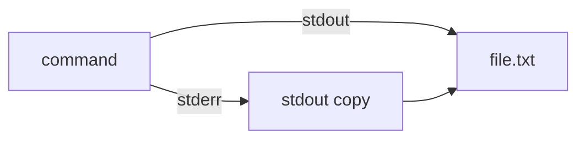

## File Descriptors

Every Linux process starts with three standard file descriptors, and can open additional ones as
needed. File descriptors are non-negative integers maintained by the kernel per-process.

### Standard File Descriptors

| FD  | Name   | Default Destination | Description                          |
| --- | ------ | ------------------- | ------------------------------------ |
| 0   | stdin  | Keyboard (terminal) | Input stream                         |
| 1   | stdout | Terminal            | Normal output                        |
| 2   | stderr | Terminal            | Error and diagnostic output          |
| 3+  | custom | (none)              | Application-defined file descriptors |

```bash
# View file descriptors for a process
ls -la /proc/$$/fd/
# 0 -> /dev/pts/0
# 1 -> /dev/pts/0
# 2 -> /dev/pts/0
# 255 -> /dev/pts/0 (script file)

# View limits
cat /proc/$$/limits | grep "open files"
```

## Redirection Operators

### Output Redirection

```bash
# Truncate and write stdout
command > file.txt
command 1> file.txt

# Append stdout
command >> file.txt
command 1>> file.txt

# Redirect stderr
command 2> error.log

# Append stderr
command 2>> error.log

# Redirect both stdout and stderr (POSIX)
command > output.log 2>&1

# Redirect both (bash shorthand)
command &> output.log
command &>> output.log

# Discard output
command > /dev/null
command 2> /dev/null
command &> /dev/null
```

### Input Redirection

```bash
# Read stdin from file
command < input.txt
command 0< input.txt

# Read from here-document
command << EOF
line 1
line 2
$VARIABLE expanded here
EOF

# Read from here-document with tab stripping
command <<- EOF
	tab-indented content
	(tabs stripped, spaces preserved)
EOF

# Read from here-string
command <<< "single line of input"
grep "error" <<< "this line has an error"

# Open file for reading and writing (<>)
exec 3<> file.txt
read -r line <&3
echo "new line" >&3
exec 3<&-
```

### Redirection Order Matters

```bash
# WRONG: stderr redirect sees the original stdout (terminal)
command 2>&1 > file.txt
# stderr goes to terminal, stdout goes to file.txt

# CORRECT: stdout redirect happens first, then stderr copies it
command > file.txt 2>&1
# Both stdout and stderr go to file.txt
```



### Redirection in Different Contexts

```bash
# Redirect specific command in a pipeline
ls -la /nonexistent 2>&1 | grep -i "no such"

# Redirect a block of code
{
    echo "start"
    ls -la /nonexistent
    echo "end"
} > output.log 2>&1

# Redirect a function
myfunc() {
    echo "stdout from function"
    echo "stderr from function" >&2
}
myfunc > func_out.log 2> func_err.log

# Redirect a loop
for file in *.log; do
    wc -l "$file"
done > line_counts.txt
```

## Pipes

### Anonymous Pipes

```bash
# Basic pipe — stdout of left goes to stdin of right
command1 | command2

# Pipeline return code is the exit status of the last command
false | true
echo $?    # 0 (true's exit code)

# With pipefail, pipeline fails if ANY command fails
set -o pipefail
false | true
echo $?    # 1 (false's exit code)
```

### Pipe Buffer

```bash
# View pipe buffer size
cat /proc/sys/fs/pipe-max-size
# 1048576 (1 MiB on modern Linux)

# The default buffer is 64 KiB (65536 bytes) since kernel 2.6.11
# When the buffer is full, the writer blocks

# Increase pipe buffer size (requires CAP_SYS_RESOURCE)
# This can improve throughput in high-volume pipelines
dd if=/dev/urandom bs=1M count=100 | md5sum
```

### PIPE_BUF and Atomic Writes

```text
PIPE_BUF (typically 4096 bytes on Linux):
- Writes up to PIPE_BUF bytes to a pipe are atomic
- Writes larger than PIPE_BUF may be interleaved with writes from other processes
- Multiple writers to the same pipe: writes <= PIPE_BUF are guaranteed atomic
- Single writer: all writes are effectively atomic (no interleaving)

View PIPE_BUF:
  getconf PIPE_BUF /    # 4096
```

### SIGPIPE

When a process writes to a pipe whose reader has closed, the kernel sends `SIGPIPE` to the writer.
The default action for `SIGPIPE` is to terminate the process.

```bash
# Demonstrate SIGPIPE
yes | head -n 5
# "yes" writes infinitely; "head" reads 5 lines and closes stdin
# "yes" receives SIGPIPE and terminates

# Ignore SIGPIPE (useful in network programming)
trap '' PIPE
# Now write to a closed pipe returns EPIPE instead of killing the process

# Check for broken pipe in scripts
yes | head -n 5; echo "exit: $?"
```

## Named Pipes (FIFOs)

Named pipes appear as files in the filesystem but behave like anonymous pipes. They allow unrelated
processes to communicate.

### Creating and Using Named Pipes

```bash
# Create a named pipe
mkfifo /tmp/my_pipe

# In terminal 1: write to the pipe (blocks until reader connects)
echo "hello from writer" > /tmp/my_pipe

# In terminal 2: read from the pipe
cat < /tmp/my_pipe

# The pipe is unidirectional by default
# For bidirectional communication, use two pipes
mkfifo /tmp/pipe_in /tmp/pipe_out
```

### Named Pipe Use Cases

```bash
# 1. Simple IPC between processes
mkfifo /tmp/cmd_pipe
# Writer:
while true; do
    read -r cmd
    echo "Processing: $cmd"
done < /tmp/cmd_pipe
# Reader (in another terminal):
echo "status" > /tmp/cmd_pipe
echo "restart" > /tmp/cmd_pipe

# 2. Sequential processing
mkfifo /tmp/buffer
sort data.txt > /tmp/buffer &
uniq < /tmp/buffer > /tmp/buffer2 &
awk '{print $2}' < /tmp/buffer2

# 3. Log multiplexing
mkfifo /tmp/log_pipe
tail -f /tmp/log_pipe | while read -r line; do
    echo "$(date) $line" >> /var/log/app.log
    echo "$line" | grep -i "error" >> /var/log/errors.log
done &

# Send logs to the pipe
app1 --log /tmp/log_pipe &
app2 --log /tmp/log_pipe &

# 4. Progress monitoring
mkfifo /tmp/progress
# Long-running process writes progress
for i in $(seq 1 100); do
    echo "$i"
    sleep 0.1
done > /tmp/progress
# Monitor reads progress
tail -f /tmp/progress
```

### Named Pipe Properties

```bash
# Check pipe status
ls -la /tmp/my_pipe
# prw-r--r-- 1 user user 0 ...

# Named pipes have zero size
du /tmp/my_pipe    # 0

# Named pipes persist until deleted
rm /tmp/my_pipe

# Multiple readers: only one gets each message
# Multiple writers: messages may interleave
```

## Process Substitution

Process substitution creates a temporary file descriptor (using `/dev/fd/` or a named pipe) that
connects to the input or output of a process.

### Input Process Substitution

```bash
# Compare output of two commands
diff <(sort file1.txt) <(sort file2.txt)

# Pass command output to a command expecting a file argument
wc -l <(find /etc -name "*.conf")
md5sum <(tar cf - /home/user/docs)

# Multiple inputs
paste <(cut -f1 data.txt) <(cut -f2 data.txt)

# Feed grep patterns from command output
grep -f <(echo -e "error\nwarning\ncritical") /var/log/syslog
```

### Output Process Substitution

```bash
# Split stdout and stderr to different processes
command > >(grep "INFO" >> info.log) 2> >(grep "ERROR" >> error.log)

# Parallel processing
cat largefile.txt | tee >(process1 &>/dev/null) | process2

# Background logging
my_long_command > >(while read -r line; do
    echo "$(date) $line"
done >> /var/log/mycommand.log) 2>&1
```

## tee

`tee` reads from stdin and writes to stdout and one or more files simultaneously.

```bash
# Write to stdout and a file
command | tee output.log

# Append mode
command | tee -a output.log

# Write to multiple files
command | tee file1.log file2.log file3.log

# Discard stdout, write only to files
command | tee output.log > /dev/null

# With sudo (write to root-owned files)
command | sudo tee /etc/config.conf

# tee with pipes
command | tee /dev/tty | grep error

# Interactive monitoring
dmesg | tee /tmp/dmesg.log
```

### tee Use Cases

```bash
# 1. Log and display simultaneously
./deploy.sh 2>&1 | tee /var/log/deploy-$(date +%Y%m%d-%H%M%S).log

# 2. Audit trail
sudo iptables-save | tee /etc/iptables/rules.v4 | iptables-restore

# 3. Multi-stream logging
tail -f /var/log/syslog | tee >(grep error >> errors.log) >(grep warn >> warnings.log) > /dev/null

# 4. Checkpoint processing
cat large_input | tee /tmp/checkpoint | process_data > output
```

## xargs

`xargs` reads items from stdin and executes a command with them as arguments. It handles argument
list limits and provides parallel execution.

### Basic Usage

```bash
# Build arguments from stdin
echo "file1.txt file2.txt file3.txt" | xargs rm
find /tmp -name "*.tmp" -print0 | xargs -0 rm

# Limit arguments per invocation
echo {1..100} | tr ' ' '\n' | xargs -n 5 echo

# Interactive mode (confirm each operation)
find . -name "*.log" | xargs -p rm
```

### Parallel Execution

```bash
# Run 4 processes in parallel
find . -name "*.jpg" | xargs -P 4 -I {} convert {} -resize 50% {}_small.jpg

# Parallel downloads
cat urls.txt | xargs -P 8 -I {} wget -q {}

# Parallel compression
find . -name "*.log" -print0 | xargs -0 -P 4 -I {} gzip {}

# Run with progress
cat files.txt | xargs -P 4 -I {} sh -c 'echo "Processing {}"; process "{}"'
```

### xargs Options

```bash
# -I {} — replace string
echo "a b c" | xargs -I {} echo "item: {}"
# item: a b c

# -n N — max arguments per command
seq 1 10 | xargs -n 3 echo
# 1 2 3
# 4 5 6
# 7 8 9
# 10

# -0 — null-delimited input (safe for filenames with spaces/newlines)
find . -print0 | xargs -0 -n 1 echo

# -d DELIM — custom delimiter
echo "a:b:c" | xargs -d ':' -I {} echo "item: {}"

# --max-procs or -P — parallel execution
seq 1 20 | xargs -P 4 -I {} sleep 1 && echo {}

# -L N — max lines per command
cat addresses.txt | xargs -L 1 curl -s -o /dev/null -w "%{http_code}\n"
```

### xargs vs for Loop

```bash
# xargs — faster, handles argument limits
find . -name "*.log" | xargs gzip

# for loop — safer, easier to add logic
find . -name "*.log" -print0 | while IFS= read -r -d '' file; do
    echo "Compressing $file"
    gzip "$file"
done
```

:::warning

`xargs` without `-0` or `-d` splits on whitespace and newlines, which breaks on filenames with
spaces. Always use `find ... -print0 | xargs -0` when processing filenames.

:::

## Command Substitution

```bash
# Basic command substitution
current_dir=$(pwd)
file_count=$(ls -1 | wc -l)

# Nested substitution
base=$(basename $(dirname $(realpath $0)))

# Process substitution vs command substitution
# Command substitution: captures stdout into a variable
files=$(find . -name "*.conf")
# Process substitution: provides a file descriptor
wc -l <(find . -name "*.conf")

# mapfile — read command output into an array
mapfile -t lines < <(ps aux)
echo "Total processes: ${#lines[@]}"
echo "First line: ${lines[0]}"
```

## Pipeline Return Codes

```bash
# Default: pipeline exit code = last command
false | true
echo $?    # 0

# pipefail: pipeline exit code = rightmost non-zero
set -o pipefail
false | true
echo $?    # 1

# Check each stage explicitly
set -o pipefail
command1 | command2 | command3
rc=$?
if (( rc != 0 )); then
    echo "Pipeline failed with code $rc"
fi

# PIPESTATUS array (bash)
command1 | command2 | command3
echo "${PIPESTATUS[0]}"  # exit code of command1
echo "${PIPESTATUS[1]}"  # exit code of command2
echo "${PIPESTATUS[2]}"  # exit code of command3
```

## File Descriptor Manipulation

```bash
# Open file descriptor 3 for reading
exec 3< /etc/hosts

# Read a line from fd 3
read -r line <&3

# Open fd 4 for writing
exec 4> /tmp/output.txt

# Write to fd 4
echo "data" >&4

# Duplicate fd 1 to fd 5 (save original stdout)
exec 5>&1

# Redirect all stdout to a file
exec > /tmp/all_output.log

# Restore original stdout
exec 1>&5

# Close file descriptors
exec 3<&-    # close fd 3 (read)
exec 4>&-    # close fd 4 (write)
exec 5>&-    # close fd 5
```

### Practical FD Pattern: Logging Wrapper

```bash
#!/usr/bin/env bash
LOGFILE="/var/log/script.log"

# Save original file descriptors
exec 3>&1 4>&2

# Redirect stdout and stderr to log file AND terminal
exec > >(tee -a "$LOGFILE") 2>&1

echo "This goes to both terminal and log file"
echo "Errors too" >&2

# Later: restore original file descriptors
exec 1>&3 2>&4
exec 3>&- 4>&-

echo "This goes only to terminal"
```

## Special Device Files

### /dev/null

```bash
# Discard output
command > /dev/null 2>&1

# Create empty file
cat /dev/null > file.txt

# Zero a file (without changing inode)
cat /dev/null > large_file.log
```

### /dev/zero

```bash
# Create a file filled with zeros (1 MiB)
dd if=/dev/zero of=zeros.bin bs=1M count=1

# Create a swap file
dd if=/dev/zero of=/swapfile bs=1M count=4096
chmod 600 /swapfile
mkswap /swapfile
swapon /swapfile

# Fill a file with zeros for secure deletion
dd if=/dev/zero of=secret_data bs=1M count=1 conv=notrunc
```

### /dev/random and /dev/urandom

```text
/dev/random:
  - Blocks when entropy pool is exhausted
  - Suitable for generating long-term cryptographic keys
  - Do NOT use in scripts (may block indefinitely)

/dev/urandom:
  - Never blocks (uses CSPRNG seeded from entropy pool)
  - Suitable for session keys, nonces, random data
  - Preferred for script use
```

```bash
# Generate random bytes
dd if=/dev/urandom bs=32 count=1 2>/dev/null | base64

# Generate random password (16 alphanumeric characters)
tr -dc 'a-zA-Z0-9' < /dev/urandom | head -c 16

# Generate random number between 1 and 100
echo $(( RANDOM % 100 + 1 ))

# Secure random number
od -An -tu4 -N4 < /dev/urandom | tr -d ' '
```

## Buffering

### Line vs Full Buffering

```text
Buffering modes:
  Fully buffered: Data written when buffer is full (typically 4 KiB or 8 KiB)
                  Used for regular file I/O
  Line buffered:  Data written when a newline is encountered
                  Used for terminal (tty) I/O
  Unbuffered:     Data written immediately
                  Used for stderr (typically)
```

### stdbuf

```bash
# Force line-buffered output (useful for pipelines)
stdbuf -oL command | grep pattern

# Force unbuffered output
stdbuf -o0 command | another_command

# Force specific buffer size
stdbuf -o 1024 command

# Example: tail -f with line-buffered input
tail -f /var/log/syslog | stdbuf -oL grep error

# Example: make python unbuffered
stdbuf -o0 python3 -u script.py | process_output
```

### Buffering in Pipes

```bash
# Problem: some programs buffer output when not writing to a terminal
python3 -c "
import time
for i in range(5):
    print(f'line {i}')
    time.sleep(1)
" | while read -r line; do
    echo "Got: $line"
done
# Output appears all at once after 5 seconds (fully buffered in pipe)

# Fix 1: stdbuf
stdbuf -oL python3 -c "..." | while read -r line; do

# Fix 2: unbuffered flag
python3 -u -c "..." | while read -r line; do

# Fix 3: PYTHONUNBUFFERED
PYTHONUNBUFFERED=1 python3 -c "..." | while read -r line; do

# Fix 4: sys.stdout.flush()
python3 -c "
import sys, time
for i in range(5):
    print(f'line {i}')
    sys.stdout.flush()
    time.sleep(1)
" | while read -r line; do
```

## socat and netcat for Network I/O

### netcat (nc)

```bash
# Listen on a port
nc -l -p 8080

# Connect to a port
nc localhost 8080

# Transfer a file (receiver)
nc -l -p 9000 > received_file.txt

# Transfer a file (sender)
nc localhost 9000 < file_to_send.txt

# Port scanning
nc -zv host.example.com 80 443 8080

# Chat between two machines
# Machine A:
nc -l -p 4444
# Machine B:
nc machine-a.example.com 4444

# HTTP request
printf 'GET / HTTP/1.0\r\nHost: example.com\r\n\r\n' | nc example.com 80
```

### socat

```bash
# Forward port 8080 to localhost:80
socat TCP-LISTEN:8080,fork TCP:localhost:80

# Create a virtual serial port pair
socat -d -d pty,raw,echo=0 pty,raw,echo=0

# Connect a serial port to a TCP socket
socat /dev/ttyUSB0,raw,echo=0 TCP:192.168.1.100:4000

# File transfer over TCP
# Receiver:
socat TCP-LISTEN:9000,reuseaddr OPEN:received.bin,creat
# Sender:
socat OPEN:file.bin TCP:host:9000

# UDP forwarding
socat UDP-LISTEN:514,fork UDP:syslog-server:514

# UNIX domain socket proxy
socat UNIX-LISTEN:/tmp/app.sock,fork UNIX-CONNECT:/var/run/app.sock
```

## Common Pitfalls

### Pitfall: Lost Exit Codes in Pipelines

```bash
# Without pipefail, errors are swallowed
set -e
cat nonexistent_file | sort
echo "This runs even though cat failed!"

# Fix: pipefail
set -o pipefail
cat nonexistent_file | sort
echo "This does NOT run"

# Fix: PIPESTATUS
cat nonexistent_file | sort
if (( PIPESTATUS[0] != 0 )); then
    echo "cat failed"
fi
```

### Pitfall: Here-Documents and Variable Expansion

```bash
var="expanded"

# Variables ARE expanded
cat << EOF
$var
EOF
# Output: expanded

# Variables are NOT expanded (quote the delimiter)
cat << 'EOF'
$var
EOF
# Output: $var

# Partial escaping
cat << EOF
literal \$var
expanded $var
EOF
# Output:
# literal $var
# expanded
```

### Pitfall: xargs with Filenames Containing Spaces

```bash
# WRONG — splits on whitespace
find . -name "*.txt" | xargs rm

# CORRECT — null-delimited
find . -name "*.txt" -print0 | xargs -0 rm

# CORRECT — use -exec (no xargs needed)
find . -name "*.txt" -exec rm {} +

# WRONG — xargs -I with spaces in replacement
echo "/path/with spaces/file.txt" | xargs -I {} cp {} /tmp/

# This works because {} is quoted, but the original input was a single line
# For safety, always use -print0 with xargs
```

### Pitfall: Subshell Variable Scope in Pipes

```bash
count=0
echo -e "a\nb\nc" | while read -r line; do
    ((count++))
done
echo "$count"    # 0 — the pipe creates a subshell!

# Fix: process substitution
count=0
while read -r line; do
    ((count++))
done < <(echo -e "a\nb\nc")
echo "$count"    # 3
```

### Pitfall: Redirecting to a File That Is Being Read

```bash
# WRONG — the file is truncated before the read starts
cat file.txt > file.txt    # results in empty file!

# Fix: use a temp file
cat file.txt > file.tmp && mv file.tmp file.txt

# Fix: use sponge (from moreutils)
cat file.txt | sponge file.txt

# Fix: use in-place editing tools
sed -i 's/old/new/g' file.txt
```

### Pitfall: Named Pipe Deadlocks

```bash
# DEADLOCK: writer waits for reader, reader waits for writer
# Terminal 1:
echo "hello" > /tmp/pipe    # blocks waiting for a reader

# Terminal 2:
cat < /tmp/pipe              # reads "hello", both unblock

# DEADLOCK with background writer:
echo "hello" > /tmp/pipe &
# This blocks because no reader is connected yet
cat < /tmp/pipe             # now both proceed

# AVOID: open the pipe for reading BEFORE writing
```
