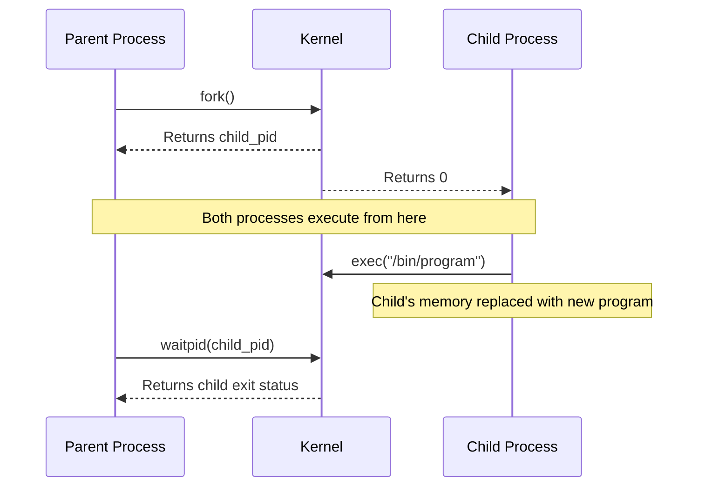
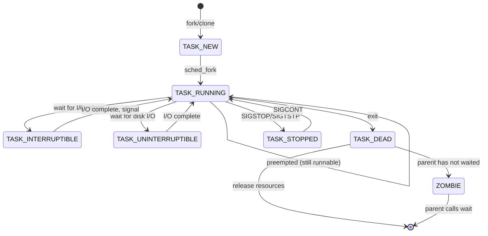

## Process Lifecycle

Every running program in Linux is a **process** — an instance of an executing program with its own
virtual address space, file descriptors, and execution context. The kernel manages processes through
a `task_struct` (in `include/linux/sched.h`), which tracks PID, state, scheduling priority, open
files, signal handlers, and more.

### Creating Processes: `fork`, `exec`, `wait`

The POSIX process creation model consists of three operations:



#### `fork(2)`

`fork` creates a new process by duplicating the calling process. The child is an exact copy — same
code, same data, same open file descriptors, same signal dispositions. The only difference is the
return value (parent gets child PID, child gets 0).

```c
pid_t pid = fork();
if (pid == -1) {
    perror("fork");
    exit(1);
} else if (pid == 0) {
    // Child process
    printf("Child PID: %d\n", getpid());
} else {
    // Parent process
    printf("Parent PID: %d, Child PID: %d\n", getpid(), pid);
}
```

Modern Linux uses **Copy-on-Write (COW)** pages for `fork`: the parent's page tables are duplicated,
but the physical pages are shared and marked read-only. When either process writes to a page, a copy
is made. This means `fork` is O(n) in page table size, not O(n) in memory.

#### `execve(2)`

`execve` replaces the current process's memory image with a new program. The PID remains the same,
but the code, data, heap, and stack are replaced. Open file descriptors with the close-on-exec flag
cleared remain open across `exec`.

```c
// In the child process after fork:
char *argv[] = {"/bin/ls", "-la", "/tmp", NULL};
char *envp[] = {"PATH=/usr/bin:/bin", NULL};
execve("/bin/ls", argv, envp);
// If execve returns, it failed
perror("execve");
exit(1);
```

Variants of `exec`: `execl`, `execlp`, `execle`, `execv`, `execvp`, `execvpe` — they differ in how
arguments and environment are passed.

#### `wait(2)` / `waitpid(2)`

A parent must call `wait` (or `waitpid`) to collect the child's exit status. If a child terminates
and the parent does not wait, the child becomes a **zombie** (state `Z`) — it retains its PID and
exit status in the kernel's process table until the parent waits.

```c
int status;
pid_t pid = waitpid(child_pid, &status, 0);

if (WIFEXITED(status)) {
    printf("Child exited with code %d\n", WEXITSTATUS(status));
} else if (WIFSIGNALED(status)) {
    printf("Child killed by signal %d\n", WTERMSIG(status));
} else if (WIFSTOPPED(status)) {
    printf("Child stopped by signal %d\n", WSTOPSIG(status));
}
```

### Process Identification

| Identifier   | Field in `task_struct` | Description                               |
| ------------ | ---------------------- | ----------------------------------------- |
| **PID**      | `pid`                  | Process identifier (unique system-wide)   |
| **TID**      | `pid`                  | Thread identifier (same namespace as PID) |
| **PPID**     | `real_parent->pid`     | Parent process ID                         |
| **PGID**     | `group_leader->pid`    | Process group ID (for signal delivery)    |
| **SID**      | `signal->leader->pid`  | Session ID (for job control)              |
| **UID/EUID** | `real_cred/cred`       | Real and effective user ID                |
| **GID/EGID** | `real_cred/cred`       | Real and effective group ID               |

In Linux, threads are implemented as processes that share certain resources (address space, file
descriptors, signal handlers). Each thread has its own TID, but all threads in a process share the
same PID (the thread group leader's TID). The `clone(2)` system call controls exactly what is
shared:

```c
// Create a thread (shares address space, FDs, signal handlers)
clone(thread_fn, stack, CLONE_VM | CLONE_FS | CLONE_FILES | CLONE_SIGHAND, arg);

// fork is equivalent to:
clone(NULL, 0, SIGCHLD, 0);
```

```bash
# View process/thread IDs
ps -eLf              # LWP (Lightweight Process) = TID
ps -T -p $PID        # Show threads of a specific process
ls /proc/$PID/task/  # Each directory is a TID

# Process relationships
ps -eo pid,ppid,pgid,sid,comm
pstree               # Tree view of process hierarchy
```

## Process States

A Linux process can be in one of several states, tracked by the `state` field in `task_struct`:



| State                    | Code | Description                                                    |
| ------------------------ | ---- | -------------------------------------------------------------- |
| **TASK_RUNNING**         | R    | Runnable (either executing or on a run queue)                  |
| **TASK_INTERRUPTIBLE**   | S    | Sleeping, waiting for an event (can be interrupted by signals) |
| **TASK_UNINTERRUPTIBLE** | D    | Sleeping, waiting for disk I/O (cannot be interrupted)         |
| **TASK_STOPPED**         | T    | Stopped by `SIGSTOP`, `SIGTSTP`, or ptrace                     |
| **TASK_TRACED**          | t    | Stopped by debugger (ptrace)                                   |
| **EXIT_ZOMBIE**          | Z    | Terminated, parent has not called `wait`                       |
| **EXIT_DEAD**            | X    | Completely dead, waiting to be reaped                          |

```bash
# View process states
ps -eo pid,stat,comm

# State codes in ps output:
# R  running or runnable
# S  interruptible sleep
# D  uninterruptible sleep
# T  stopped
# Z  zombie
# I  idle kernel thread
# +  foreground process group
# s  session leader
# l  multi-threaded
```

:::warning

A process in the **D state** (uninterruptible sleep) cannot be killed with `SIGKILL`. This typically
means it is waiting for disk I/O that will never complete (e.g., NFS server down, failed disk). The
only way to clear it is to fix the underlying I/O or reboot.

:::

## Signals

Signals are asynchronous notifications delivered to processes. They are the kernel's primary
mechanism for communicating exceptional conditions (segfault, termination request, I/O available) to
user-space processes.

### Standard Signals

| Signal    | Number | Default Action | Description                                    |
| --------- | ------ | -------------- | ---------------------------------------------- |
| `SIGHUP`  | 1      | Terminate      | Terminal hangup (daemon reload convention)     |
| `SIGINT`  | 2      | Terminate      | Terminal interrupt (Ctrl+C)                    |
| `SIGQUIT` | 3      | Core dump      | Terminal quit (Ctrl+\)                         |
| `SIGILL`  | 4      | Core dump      | Illegal instruction                            |
| `SIGABRT` | 6      | Core dump      | Abort (from `abort()`)                         |
| `SIGFPE`  | 8      | Core dump      | Floating-point exception                       |
| `SIGKILL` | 9      | Terminate      | Kill (cannot be caught or ignored)             |
| `SIGSEGV` | 11     | Core dump      | Segmentation fault                             |
| `SIGPIPE` | 13     | Terminate      | Broken pipe (write to closed pipe)             |
| `SIGALRM` | 14     | Terminate      | Alarm clock (from `alarm()`)                   |
| `SIGTERM` | 15     | Terminate      | Termination (polite kill — default for `kill`) |
| `SIGUSR1` | 10     | Terminate      | User-defined signal 1                          |
| `SIGUSR2` | 12     | Terminate      | User-defined signal 2                          |
| `SIGCHLD` | 17     | Ignore         | Child process status changed                   |
| `SIGCONT` | 18     | Continue       | Continue if stopped                            |
| `SIGSTOP` | 19     | Stop           | Stop (cannot be caught or ignored)             |
| `SIGTSTP` | 20     | Stop           | Terminal stop (Ctrl+Z)                         |
| `SIGTTIN` | 21     | Stop           | Background read from terminal                  |
| `SIGTTOU` | 22     | Stop           | Background write to terminal                   |

### Real-Time Signals

Linux supports real-time signals (signals 32-64, or `SIGRTMIN` to `SIGRTMAX`). Unlike standard
signals, real-time signals:

- Are **queued** — multiple instances of the same signal are delivered (standard signals collapse
  into one)
- Have a **defined delivery order** — lower-numbered signals are delivered first
- Can carry **additional data** (`sigqueue(2)` sends a `union sigval` with the signal)
- Are guaranteed to be delivered in FIFO order within the same signal number

```c
#include &lt;signal.h&gt;
#include &lt;stdio.h&gt;

void handler(int sig, siginfo_t *info, void *context) {
    printf("Received signal %d\n", sig);
    printf("Value: %d\n", info-&gt;si_value.sival_int);
    printf("From PID: %d\n", info-&gt;si_pid);
}

int main() {
    struct sigaction sa;
    sa.sa_sigaction = handler;
    sa.sa_flags = SA_SIGINFO;
    sigemptyset(&amp;sa.sa_mask);
    sigaction(SIGRTMIN, &amp;sa, NULL);

    // Send real-time signal with data
    union sigval value;
    value.sival_int = 42;
    sigqueue(getpid(), SIGRTMIN, value);

    return 0;
}
```

### Signal Handling

```c
// Method 1: signal() — simple but has issues across implementations
signal(SIGTERM, handler);

// Method 2: sigaction() — POSIX, recommended
struct sigaction sa;
sa.sa_handler = handler;        // or sa.sa_sigaction for SA_SIGINFO
sigemptyset(&amp;sa.sa_mask);
sa.sa_flags = 0;                // or SA_RESTART, SA_SIGINFO, etc.
sigaction(SIGTERM, &amp;sa, NULL);
```

**Signal-safe functions**: Only async-signal-safe functions may be called from within a signal
handler. Calling non-signal-safe functions (like `printf`, `malloc`, `free`) from a handler is
undefined behavior if the handler interrupts one of those functions in the main program.

Signal-safe functions include: `write`, `read`, `_exit`, `kill`, `sigaction`, `sigprocmask`,
`sigaddset`, `sigemptyset`, `sigfillset`.

```c
// CORRECT signal handler
void sigterm_handler(int sig) {
    const char msg[] = "Caught SIGTERM, exiting\n";
    write(STDOUT_FILENO, msg, sizeof(msg) - 1);
    _exit(0);
}

// WRONG — printf is not async-signal-safe
void bad_handler(int sig) {
    printf("Caught signal %d\n", sig);  // undefined behavior!
}
```

### Sending Signals

```bash
# Send SIGTERM (default)
kill 1234

# Send specific signal
kill -SIGTERM 1234
kill -15 1234
kill -9 1234      # SIGKILL — cannot be caught

# Send signal to all processes in a process group
kill -- -1234     # negative PID = process group

# Send signal to all processes with a given name
pkill -f "nginx"
killall nginx

# List signals
kill -l
trap -l           # in bash

# Signal a process group
kill -TERM -$(ps -o pgid= -p 1234 | tr -d ' ')
```

### `SIGPIPE` and Broken Pipes

When a process writes to a pipe whose reader has closed its end, the kernel sends `SIGPIPE` to the
writer. The default action is to terminate the writer process. This is a common source of unexpected
process death in pipelines:

```c
// Ignore SIGPIPE — write() will return EPIPE instead
signal(SIGPIPE, SIG_IGN);

// Or in shell:
trap '' PIPE
```

## Process Monitoring

### `ps` — Process Status

```bash
# Common usage patterns
ps aux                    # BSD style — all processes, user-oriented
ps -ef                    # System V style — all processes
ps -eo pid,ppid,user,%cpu,%mem,stat,start,time,comm  # custom columns

# Filter by user
ps -u www-data

# Filter by process group
ps -g 1234

# Tree view
ps -ejH                  # forest view
ps auxf                  # full forest

# Thread view
ps -eLf                  # show all threads
ps -T -p $PID            # threads of a specific process
```

### `top` / `htop`

```bash
# top — basic process monitor
top                       # default (sort by CPU)
top -o %MEM               # sort by memory
top -d 2                  # refresh every 2 seconds
top -p 1234               # monitor specific PID
top -u www-data           # specific user

# htop — interactive process monitor (better UX)
htop                      # interactive mode
htop -p 1234,5678         # specific PIDs
htop -s PERCENT_MEM       # sort by memory

# Inside top:
# M — sort by memory
# P — sort by CPU
# k — kill process
# r — renice process
# f — add/remove columns
# 1 — toggle per-CPU view
```

### `/proc/PID` — Process Filesystem

```bash
# Essential /proc/PID entries
cat /proc/$PID/cmdline | tr '\0' ' '    # command line (null-separated)
cat /proc/$PID/status                    # human-readable status
cat /proc/$PID/stat                      # one-line status (parse carefully)
cat /proc/$PID/statm                     # memory usage in pages
cat /proc/$PID/maps                      # memory mappings
cat /proc/$PID/smaps                     # detailed memory map with sizes
cat /proc/$PID/fd                        # list of open file descriptors
cat /proc/$PID/limits                    # resource limits
cat /proc/$PID/cgroup                    # cgroup membership
cat /proc/$PID/oom_score                 # OOM killer score (0-1000)
cat /proc/$PID/wchan                     # kernel function process is waiting in

# File descriptor info
ls -la /proc/$PID/fd/                    # show symlink targets
readlink /proc/$PID/fd/0                 # stdin target
cat /proc/$PID/fdinfo/3                  # flags and position for fd 3

# Process tree
cat /proc/$PID/children                  # direct children
cat /proc/$PID/task/                     # threads
```

### `pgrep` and `pkill`

```bash
# Find processes by name
pgrep nginx
pgrep -f "python.*manage.py"    # match against full command line

# Find with details
pgrep -a nginx                   # show full command line
pgrep -l nginx                   # show process name

# Kill by pattern
pkill -f "node server.js"

# Send specific signal
pkill -TERM -f "nginx: worker"
```

## Scheduling and Priorities

### CFS — Completely Fair Scheduler

The Linux kernel's default scheduler for normal (non-real-time) processes is the **Completely Fair
Scheduler** (CFS). CFS uses a red-black tree to track the "virtual runtime" (`vruntime`) of each
process and always selects the task with the lowest `vruntime` to run next.

### Nice Values

The nice value ranges from -20 (highest priority) to 19 (lowest priority). Only root can set
negative nice values. Each unit of nice changes the process's weight and thus its share of CPU time.

```bash
# View nice values
ps -eo pid,ni,comm

# Set nice value at startup
nice -n 10 command

# Change nice value of running process
renice -n 5 -p 1234
renice -n -10 -u www-data      # change for all processes of a user

# ionice — I/O priority (affects block I/O scheduling)
ionice -c 2 -n 7 command        # best-effort, lowest priority
ionice -c 3 command             # idle (only uses I/O when no one else is)

# I/O class:
# 0 (none)     — no priority
# 1 (realtime) — highest priority (root only)
# 2 (best-effort) — default, priority 0-7
# 3 (idle)     — only uses I/O when system is idle
```

### Real-Time Scheduling Policies

| Policy           | `sched_setscheduler` | Description                                          |
| ---------------- | -------------------- | ---------------------------------------------------- |
| `SCHED_FIFO`     | 1                    | First-in, first-out, runs until blocked or preempted |
| `SCHED_RR`       | 2                    | Round-robin with configurable time quantum           |
| `SCHED_DEADLINE` | 6                    | Earliest Deadline First (EDF) scheduling             |
| `SCHED_OTHER`    | 0                    | Default CFS policy                                   |

```bash
# View scheduling policy
chrt -p $PID

# Set real-time policy
chrt -f 80 command             # SCHED_FIFO, priority 80
chrt -r 80 command             # SCHED_RR, priority 80

# Set deadline policy
chrt -d 1000000 5000000 200000 command  # runtime, deadline, period (ns)
```

:::warning

Real-time scheduling policies can starve the system. A `SCHED_FIFO` process that never blocks will
consume 100% CPU and lock out all other processes, including the kernel's management threads. Use
only for well-understood, bounded workloads (audio processing, industrial control).

:::

## cgroups

Control groups (cgroups) are a kernel mechanism for grouping processes and applying resource limits,
accounting, and isolation to those groups. They are the foundation for container runtimes (Docker,
Kubernetes, systemd).

### cgroups v1 vs v2

| Aspect      | cgroups v1                     | cgroups v2                         |
| ----------- | ------------------------------ | ---------------------------------- |
| Hierarchy   | Multiple (one per controller)  | Single unified hierarchy           |
| Mount point | `/sys/fs/cgroup/memory/`, etc. | `/sys/fs/cgroup/`                  |
| Controllers | Independent, per-subsystem     | Unified, coordinated               |
| Delegation  | Complex                        | Simplified                         |
| Default     | Legacy systems                 | Modern distributions (since ~2020) |

```bash
# Check cgroups version
stat -f -c %T /sys/fs/cgroup/
# output: cgroup2fs = v2, tmpfs = v1

# Or
cat /proc/filesystems | grep cgroup
```

### cgroups v2 Operations

```bash
# Create a cgroup
mkdir /sys/fs/cgroup/mygroup

# Set memory limit
echo "500M" > /sys/fs/cgroup/mygroup/memory.max

# Set CPU limit (allow 50% of one CPU)
echo "50000 100000" > /sys/fs/cgroup/mygroup/cpu.max

# Set PID limit
echo "100" > /sys/fs/cgroup/mygroup/pids.max

# Move a process to the cgroup
echo $PID > /sys/fs/cgroup/mygroup/cgroup.procs

# Set I/O weight
echo "default 100" > /sys/fs/cgroup/mygroup/io.weight

# Set swap limit (bytes)
echo "1G" > /sys/fs/cgroup/mygroup/memory.swap.max

# View cgroup stats
cat /sys/fs/cgroup/mygroup/memory.current
cat /sys/fs/cgroup/mygroup/memory.events    # shows oom_kill, etc.
cat /sys/fs/cgroup/mygroup/cpu.stat
cat /sys/fs/cgroup/mygroup/io.stat
```

### systemd and cgroups

systemd manages cgroups automatically. Each service gets its own cgroup, which means resource limits
can be configured directly in the unit file:

```ini
# /etc/systemd/system/myapp.service
[Service]
MemoryMax=512M
CPUQuota=50%
TasksMax=100
IOWeight=50
```

```bash
# View cgroup for a service
systemctl show myapp -p MemoryCurrent
systemctl show myapp -p CPUUsageNSec
systemctl status myapp    # shows cgroup memory usage
```

## Resource Limits (`ulimit`)

The `ulimit` mechanism (implemented via `setrlimit(2)`) sets per-process resource limits. These
limits are inherited by child processes.

```bash
# View all limits
ulimit -a

# Common limits
ulimit -n          # open files (nofile) — default usually 1024
ulimit -u          # max user processes (nproc)
ulimit -v          # virtual memory size (as)
ulimit -f          # file size (fsize)
ulimit -t          # CPU time in seconds (cpu)
ulimit -l          # max locked memory (memlock)
ulimit -s          # stack size (stack)

# Set limits
ulimit -n 65536    # increase open file limit for current session
ulimit -u 4096     # increase max processes

# Permanent configuration
# /etc/security/limits.conf:
# www-data  soft  nofile  65536
# www-data  hard  nofile  131072
# *         soft  nproc   4096
# root      hard  nproc   unlimited
```

| Limit Type  | Soft Limit                     | Hard Limit                              |
| ----------- | ------------------------------ | --------------------------------------- |
| Definition  | Enforced for the process       | Maximum the soft limit can be raised to |
| Who can set | Any process (up to hard limit) | Root (can lower from any value)         |
| Per-process | Yes                            | Yes                                     |

:::warning

`ulimit` settings in `/etc/security/limits.conf` apply to PAM sessions (login, `su`, `sudo`). They
do NOT apply to services started by systemd. For systemd services, configure limits in the unit file
or systemd's override mechanism (`systemctl edit`).

:::

## Zombie Processes

A zombie process (state `Z`) has completed execution but its parent has not yet called `wait` to
collect its exit status. The zombie retains its PID and minimal kernel data structures, preventing
PID reuse.

```bash
# Find zombie processes
ps aux | awk '$8 ~ /Z/ {print}'
ps -eo pid,ppid,stat,comm | awk '$3 ~ /Z/'

# Count zombies
ps aux | awk '$8 ~ /Z/' | wc -l
```

### Dealing with Zombies

1. **Find the parent**: `ps -eo pid,ppid,stat,comm | grep Z`
2. **Kill the parent**: `kill -TERM $PPID` — when the parent dies, its children are reparented to
   PID 1 (or a subreaper), which automatically reaps zombies.
3. **Fix the parent**: If the parent is your application, add a `SIGCHLD` handler or call `waitpid`
   in a loop.

Long-lived zombies are always a bug in the parent process. They are not a resource concern (each
zombie uses ~1 KiB of kernel memory), but they consume PIDs, and if PID exhaustion occurs (PID max
default: 32768 on 32-bit, 4194304 on 64-bit), new processes cannot be created.

## Process Tracing

### `strace` — System Call Tracer

```bash
# Trace a command
strace ls -la

# Trace a running process
strace -p 1234

# Trace specific system calls
strace -e open,openat,read,write command

# Trace by category
strace -e trace=network command     # network-related syscalls
strace -e trace=file command        # file-related syscalls
strace -e trace=process command     # process-related syscalls

# Trace with timestamps
strace -tt -T command    # absolute timestamps with time spent in syscall

# Trace with signals
strace -e signal=SIGTERM,SIGKILL command

# Save output to file
strace -o trace.log command

# Summary of syscalls (useful for profiling)
strace -c command
```

### `ltrace` — Library Call Tracer

```bash
# Trace library calls
ltrace ./myprogram

# Trace specific functions
ltrace -e strlen,strcpy ./myprogram
```

## Common Pitfalls

### Pitfall: `SIGKILL` Cannot Be Caught

`SIGKILL` (9) and `SIGSTOP` (19) cannot be caught, blocked, or ignored. If a process does not
respond to `SIGKILL`, it is almost certainly in the **D state** (uninterruptible sleep), waiting for
kernel resources that will never become available.

```bash
# Check process state
ps -eo pid,stat,wchan,comm | grep $PID

# If state is D, check what it is waiting for
cat /proc/$PID/stack    # kernel stack trace (requires CONFIG_STACKTRACE)
```

### Pitfall: `waitpid` and Signal Races

If a child terminates before the parent calls `waitpid`, the child becomes a zombie. If the parent
terminates before the child, the child is reparented to PID 1. In neither case is the exit status
lost, but zombies accumulate if the parent never waits:

```bash
# In bash, wait for background processes
wait $PID
echo "Exit code: $?"

# In scripts, always wait or trap SIGCHLD
trap 'wait' EXIT
```

### Pitfall: Fork Bomb

A fork bomb is a process that creates copies of itself exponentially:

```bash
# DO NOT RUN THIS — it will crash the system
:(){ :|:& };:

# The same, expanded:
bomb() {
    bomb | bomb &
}
bomb
```

Protection: `ulimit -u 4096` or systemd's `TasksMax=4096`.

### Pitfall: PID Recycling and Race Conditions

After a process exits and its parent waits, the PID can be reused. If you store a PID in a file and
later send it a signal, you may target the wrong process. This is particularly dangerous for lock
files and daemon management.

```bash
# Safer: check both PID and command line before sending signal
pid=$(cat /var/run/myapp.pid)
if kill -0 $pid 2>/dev/null; then
    cmdline=$(cat /proc/$pid/cmdline | tr '\0' ' ')
    if [[ "$cmdline" == *"myapp"* ]]; then
        kill -TERM $pid
    fi
fi
```

### Pitfall: Orphan Processes and PID 1

When a parent process dies, its children are reparented to PID 1 (init) or the nearest subreaper
(systemd on modern systems). PID 1 has special responsibilities — it must reap all orphaned zombies.
If you write a custom init or container entrypoint, you must handle this:

```bash
# In a Docker entrypoint, use a proper init
# Option 1: Use tini (designed for containers)
# Option 2: Use dumb-init
# Option 3: Handle SIGCHLD in your script
trap "wait" SIGCHLD
```

### Pitfall: `ulimit` Not Applied to systemd Services

Setting `nofile` in `/etc/security/limits.conf` has no effect on systemd services because systemd
does not use PAM. Instead, configure limits in the service unit:

```ini
# systemctl edit myservice
[Service]
LimitNOFILE=65536
LimitNPROC=4096
```

### Pitfall: Real-Time Priorities and System Stability

Setting a process to `SCHED_FIFO` with priority 99 gives it higher priority than virtually
everything else in the system, including kernel threads that handle disk I/O and memory management.
A CPU-bound FIFO process at priority 99 will lock the system. Always start with lower priorities
(50-80) and test thoroughly.

### Pitfall: Cgroup Memory Limits and OOM

When a cgroup hits its memory limit, the kernel's OOM killer selects a process within that cgroup to
kill. If the application does not handle `SIGKILL` gracefully (by restarting, checkpointing, etc.),
the service will simply stop. Monitor `memory.events` for `oom_kill` events:

```bash
# Check for OOM kills in a cgroup
cat /sys/fs/cgroup/myapp/memory.events
# oom_kill 0    → no kills
# oom_kill 3    → 3 processes were killed
```
