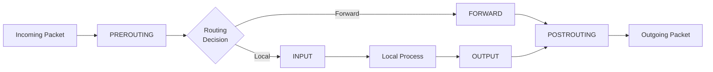

## Netfilter Framework

Netfilter is the Linux kernel subsystem that provides network packet filtering, NAT, and other
packet manipulation. It is the foundation for all Linux firewall tools — iptables, nftables,
firewalld, and ufw are all frontends to Netfilter.

### Hooks

Netfilter defines five hook points in the network stack where packets can be inspected and modified:



| Hook        | Triggers When                          |
| ----------- | -------------------------------------- |
| PREROUTING  | Any incoming packet, before routing    |
| INPUT       | Packet destined for the local process  |
| FORWARD     | Packet being forwarded to another host |
| OUTPUT      | Packet generated by local process      |
| POSTROUTING | Any outgoing packet, after routing     |

### Tables

| Table    | Purpose                                            |
| -------- | -------------------------------------------------- |
| filter   | Packet filtering (accept/drop/reject)              |
| nat      | Network Address Translation (SNAT/DNAT/masquerade) |
| mangle   | Packet modification (TOS, TTL, marks)              |
| raw      | Connection tracking exemptions                     |
| security | LSM security hooks (used by SELinux/AppArmor)      |

### Chains

Each table contains built-in chains that correspond to Netfilter hooks:

```text
filter table:    INPUT, FORWARD, OUTPUT
nat table:       PREROUTING, OUTPUT, POSTROUTING
mangle table:    PREROUTING, INPUT, FORWARD, OUTPUT, POSTROUTING
raw table:       PREROUTING, OUTPUT
security table:  INPUT, FORWARD, OUTPUT
```

### Packet Flow

```text
Packet arrives on interface:
  1. raw:PREROUTING    — connection tracking exemptions
  2. mangle:PREROUTING  — packet marking
  3. nat:PREROUTING     — DNAT (destination NAT)
  4. Routing decision   — local or forward?

If local:
  5. mangle:INPUT       — packet marking
  6. filter:INPUT       — filtering rules
  7. Local process

If forward:
  5. mangle:FORWARD     — packet marking
  6. filter:FORWARD     — filtering rules

Local process generates packet:
  8. raw:OUTPUT         — connection tracking exemptions
  9. mangle:OUTPUT      — packet marking
  10. nat:OUTPUT        — DNAT for locally-generated packets
  11. filter:OUTPUT     — filtering rules
  12. Routing decision

Outgoing packet:
  13. mangle:POSTROUTING — final packet marking
  14. nat:POSTROUTING    — SNAT/MASQUERADE
```

## iptables

### Rule Syntax

```bash
# Basic rule format
iptables -t TABLE -A CHAIN [matches] -j TARGET

# Add rule to INPUT chain
iptables -A INPUT -s 10.0.0.0/24 -p tcp --dport 22 -j ACCEPT

# Insert at position (1 = first rule)
iptables -I INPUT 1 -s 10.0.0.0/24 -p tcp --dport 22 -j ACCEPT

# Append to end
iptables -A INPUT -j DROP

# Delete a rule (exact match)
iptables -D INPUT -s 10.0.0.0/24 -p tcp --dport 22 -j ACCEPT

# Delete by line number
iptables -D INPUT 3

# List rules
iptables -L -n -v
iptables -L INPUT -n -v --line-numbers

# Flush all rules in a chain
iptables -F INPUT
iptables -F                    # flush all chains

# Delete user-defined chains
iptables -X

# Set default policy
iptables -P INPUT DROP
iptables -P FORWARD DROP
iptables -P OUTPUT ACCEPT
```

### Common Matches

```bash
# Source/destination address
-s 10.0.0.0/24                  # source network
-d 10.0.0.1                    # destination IP
! -s 10.0.0.0/24               # NOT from this network

# Protocol
-p tcp                         # TCP protocol
-p udp                         # UDP protocol
-p icmp                        # ICMP protocol
-p all                         # all protocols

# Ports (requires -p tcp or -p udp)
--sport 22                     # source port
--dport 22                     # destination port
--dport 80:1024                # port range
--dport 80,443                 # multiple ports (multiport match)
-m multiport --dports 80,443,8080  # up to 15 ports

# Interface
-i eth0                        # input interface
-o eth1                        # output interface

# State (connection tracking)
-m state --state ESTABLISHED,RELATED
-m conntrack --ctstate ESTABLISHED,RELATED  # newer syntax

# TCP flags
-p tcp --tcp-flags SYN,RST,ACK SYN    # SYN packets only
-p tcp --syn                         # shorthand for above

# ICMP types
-p icmp --icmp-type echo-request
-p icmp --icmp-type echo-reply
-p icmp --icmp-type destination-unreachable

# MAC address
-m mac --mac-source aa:bb:cc:dd:ee:ff

# Comment
-m comment --comment "Allow SSH from office"

# Limit (rate limiting)
-m limit --limit 10/minute --limit-burst 5

# Recent (dynamic block list)
-m recent --set --name SSH
-m recent --update --seconds 60 --hitcount 4 --name SSH

# Owner (OUTPUT chain only)
-m owner --uid-owner 1000
-m owner --gid-owner 1000

# IP range
-m iprange --src-range 10.0.0.1-10.0.0.50
```

### Common Targets

```bash
-j ACCEPT       # allow the packet
-j DROP         # silently discard
-j REJECT       # discard and send error response
-j LOG          # log to syslog (then continue to next rule)
-j RETURN       # return to calling chain
-j DNAT         # destination NAT
-j SNAT         # source NAT
-j MASQUERADE   # source NAT (auto-detect outgoing IP)
-j REDIRECT     # redirect to local port
-j MARK         # set packet mark
-j QUEUE        # send to userspace (NFQUEUE)
```

### Connection Tracking

```bash
# Connection states
NEW            # new connection
ESTABLISHED    # established connection (bidirectional traffic seen)
RELATED        # related to an established connection (FTP data, ICMP errors)
INVALID        # not matching any known connection
UNTRACKED      # exempted from tracking (raw table NOTRACK)

# Allow established and related connections
iptables -A INPUT -m conntrack --ctstate ESTABLISHED,RELATED -j ACCEPT

# Drop invalid packets
iptables -A INPUT -m conntrack --ctstate INVALID -j DROP

# View connection tracking table
conntrack -L
conntrack -L -s 10.0.0.50
conntrack -L -d 10.0.0.1 -p tcp --dport 443

# Adjust conntrack limits
sysctl -w net.netfilter.nf_conntrack_max=262144
sysctl -w net.netfilter.nf_conntrack_tcp_timeout_established=7200

# Connection tracking timeout (seconds)
cat /proc/sys/net/netfilter/nf_conntrack_tcp_timeout_established
# 432000 (5 days default)
```

### NAT Types

```bash
# SNAT — Source NAT (change source IP for outgoing packets)
iptables -t nat -A POSTROUTING -s 10.0.0.0/24 -o eth0 -j SNAT --to-source 203.0.113.1

# MASQUERADE — SNAT with auto-detection of outgoing IP (for dynamic IPs)
iptables -t nat -A POSTROUTING -s 10.0.0.0/24 -o eth0 -j MASQUERADE

# DNAT — Destination NAT (redirect incoming packets to internal host)
iptables -t nat -A PREROUTING -d 203.0.113.1 -p tcp --dport 80 -j DNAT --to-destination 10.0.0.10:80

# REDIRECT — redirect to local port
iptables -t nat -A PREROUTING -i eth0 -p tcp --dport 80 -j REDIRECT --to-port 8080

# Port forwarding (external:80 to internal:8080)
iptables -t nat -A PREROUTING -p tcp --dport 80 -j DNAT --to-destination 10.0.0.10:8080
iptables -t nat -A POSTROUTING -j MASQUERADE

# Enable IP forwarding for NAT
sysctl -w net.ipv4.ip_forward=1
echo 'net.ipv4.ip_forward=1' >> /etc/sysctl.d/99-forward.conf
```

### Logging

```bash
# LOG target (packet continues to next rule after logging)
iptables -A INPUT -p tcp --dport 22 -j LOG --log-prefix "[SSH] " --log-level 4

# NFLOG (more efficient, sends to netlink)
iptables -A INPUT -j NFLOG --nflog-group 1

# ulogd for logging to files/databases
# /etc/ulogd.conf
# log to /var/log/ulogd.log

# View firewall logs
journalctl -k | grep "SSH"
dmesg | grep "SSH"
```

### Rate Limiting

```bash
# Limit new SSH connections to 10 per minute, burst of 5
iptables -A INPUT -p tcp --dport 22 -m conntrack --ctstate NEW \
    -m limit --limit 10/minute --limit-burst 5 -j ACCEPT
iptables -A INPUT -p tcp --dport 22 -j DROP

# Using recent module — block after 4 failed attempts in 60 seconds
iptables -A INPUT -p tcp --dport 22 -m conntrack --ctstate NEW \
    -m recent --set --name SSH
iptables -A INPUT -p tcp --dport 22 -m conntrack --ctstate NEW \
    -m recent --update --seconds 60 --hitcount 4 --rttl --name SSH -j DROP

# Using hashlimit — limit per source IP
iptables -A INPUT -p tcp --dport 80 -m conntrack --ctstate NEW \
    -m hashlimit --hashlimit-above 100/sec --hashlimit-mode srcip \
    --hashlimit-name http_limit --hashlimit-burst 200 -j DROP
```

## nftables

`nftables` is the modern successor to iptables, providing better performance, a cleaner syntax, and
atomic rule replacement.

### Basic Usage

```bash
# List the current ruleset
nft list ruleset

# Create a table
nft add table inet filter

# Create chains
nft add chain inet filter input { type filter hook input priority 0 \; }
nft add chain inet filter forward { type filter hook forward priority 0 \; }
nft add chain inet filter output { type filter hook output priority 0 \; }

# Add rules
nft add rule inet filter input ct state established,related accept
nft add rule inet filter input iif lo accept
nft add rule inet filter input icmp type echo-request limit rate 5/second accept
nft add rule inet filter input tcp dport { 22, 80, 443 } accept
nft add rule inet filter input counter reject

# Set default policy
nft chain inet filter input { type filter hook input priority 0 \; policy drop \; }
```

### Sets and Maps

```bash
# Create a named set
nft add set inet filter allowed_ports { type inet_service \; elements = { 22, 80, 443 } }

# Use the set in a rule
nft add rule inet filter input tcp dport @allowed_ports accept

# Create a set for IP addresses
nft add set inet filter office_ips { type ipv4_addr \; }
nft add element inet filter office_ips { 10.0.0.0/24, 192.168.1.0/24 }

# Use the IP set
nft add rule inet filter input ip saddr @office_ips accept

# Named maps (value mapping)
nft add map inet filter port_forward { type inet_service : ipv4_addr \; }
nft add element inet filter port_forward { 80 : 10.0.0.10, 443 : 10.0.0.11 }

# Verdict maps (map input to action)
nft add map inet filter verdict_map { type ipv4_addr : verdict \; }
nft add element inet filter verdict_map { 10.0.0.50 : accept, 192.168.1.0/24 : drop }
nft add rule inet filter input ip saddr vmap @verdict_map
```

### Concatenations

```bash
# Multi-dimensional sets (match on IP + port)
nft add set inet filter services { type ipv4_addr . inet_service \; }
nft add element inet filter services { 10.0.0.10 . 80, 10.0.0.10 . 443 }

# Rule using concatenation
nft add rule inet filter input ip saddr . tcp dport @services accept
```

### Ruleset File

```bash
# Flush and reload from file
nft flush ruleset
nft -f /etc/nftables.conf
```

```text
# /etc/nftables.conf
#!/usr/sbin/nft -f

table inet filter {
    set allowed_tcp_ports {
        type inet_service
        elements = { 22, 80, 443 }
    }

    set allowed_ips {
        type ipv4_addr
        elements = { 10.0.0.0/24, 127.0.0.0/8 }
    }

    chain input {
        type filter hook input priority 0; policy drop;

        ct state established,related accept
        ct state invalid counter drop
        iif lo accept
        ip saddr @allowed_ips accept
        tcp dport @allowed_tcp_ports accept
        icmp type echo-request limit rate 5/second accept
        counter reject with icmpx type admin-prohibited
    }

    chain forward {
        type filter hook forward priority 0; policy drop;
    }

    chain output {
        type filter hook output priority 0; policy accept;
    }
}
```

### NAT with nftables

```bash
# Masquerading (SNAT with auto IP detection)
nft add table ip nat
nft add chain ip nat postrouting { type nat hook postrouting priority 100 \; }
nft add rule ip nat postrouting masquerade

# DNAT (port forwarding)
nft add chain ip nat prerouting { type nat hook prerouting priority -100 \; }
nft add rule ip nat prerouting iif eth0 tcp dport 80 dnat to 10.0.0.10:8080

# SNAT (static source NAT)
nft add rule ip nat postrouting ip saddr 10.0.0.0/24 snat to 203.0.113.1
```

### nftables vs iptables

| Aspect              | iptables                      | nftables                                 |
| ------------------- | ----------------------------- | ---------------------------------------- |
| Syntax              | Multiple commands             | Single atomic ruleset                    |
| Performance         | Linear rule evaluation        | Better (sets, maps, concatenations)      |
| IPv4/IPv6           | Separate commands             | Unified inet family                      |
| Atomic updates      | No (rules applied one by one) | Yes (entire ruleset replaced atomically) |
| Extensibility       | Kernel modules                | Extensible expressions                   |
| Configuration       | Scattered across commands     | Single file                              |
| Connection tracking | Same backend (nf_conntrack)   | Same backend                             |

```bash
# Convert iptables rules to nftables
iptables-save > /tmp/iptables.rules
# nftables can import iptables rules for compatibility
# But native nftables syntax is recommended for new deployments
```

## firewalld

`firewalld` is a dynamic firewall manager that uses `nftables` (or `iptables`) as a backend and
provides a zone-based configuration model.

### Zones

```text
Zones define trust levels:
  drop      — all incoming packets dropped, only outgoing
  block     — incoming rejected (ICMP error), only established
  public    — don't trust, selected incoming connections
  external  — masquerading enabled, selected incoming
  dmz       — limited access from public
  work      — mostly trusted, selected incoming
  home      — mostly trusted, most incoming
  internal  — fully trusted, all incoming
  trusted   — all connections accepted
```

### Commands

```bash
# View active zones
firewall-cmd --get-active-zones

# View current configuration
firewall-cmd --list-all
firewall-cmd --list-all --zone=public

# Set default zone
firewall-cmd --set-default-zone=public

# Add a service
firewall-cmd --permanent --zone=public --add-service=http
firewall-cmd --reload

# Add a port
firewall-cmd --permanent --zone=public --add-port=8080/tcp
firewall-cmd --reload

# Add a port range
firewall-cmd --permanent --zone=public --add-port=5000-5100/tcp

# Remove a service
firewall-cmd --permanent --zone=public --remove-service=http
firewall-cmd --reload

# Rich rules (advanced)
firewall-cmd --permanent --zone=public \
    --add-rich-rule='rule family="ipv4" source address="10.0.0.0/24" service name="ssh" accept'

firewall-cmd --permanent --zone=public \
    --add-rich-rule='rule family="ipv4" source address="10.0.0.50" forward-port port="80" protocol="tcp" to-port="8080"'

# Port forwarding
firewall-cmd --permanent --zone=public \
    --add-forward-port=port=80:proto=tcp:toport=8080:toaddr=10.0.0.10

# Masquerading
firewall-cmd --permanent --zone=external --add-masquerade

# Direct rules (pass-through to nftables/iptables)
firewall-cmd --direct --add-rule ipv4 filter INPUT 0 -p tcp --dport 9090 -j ACCEPT

# Panic mode (drop all traffic)
firewall-cmd --panic-on
firewall-cmd --panic-off

# Runtime-only changes (lost on reload)
firewall-cmd --add-port=9999/tcp

# List all services
firewall-cmd --get-services

# Lockdown (restrict firewall changes to authorized users)
firewall-cmd --lockdown-on
```

### firewalld Configuration Files

```ini
# /etc/firewalld/zones/public.xml
<?xml version="1.0" encoding="utf-8"?>
<zone>
  <short>Public</short>
  <description>For use in public areas.</description>
  <service name="ssh"/>
  <service name="http"/>
  <service name="https"/>
  <port protocol="tcp" port="8080"/>
  <rule family="ipv4">
    <source address="10.0.0.0/24"/>
    <service name="mysql"/>
    <accept/>
  </rule>
</zone>
```

## ufw

`ufw` (Uncomplicated Firewall) is a user-friendly frontend for iptables/nftables.

### Commands

```bash
# Enable/disable
ufw enable
ufw disable

# Set default policy
ufw default deny incoming
ufw default allow outgoing

# Allow/deny services
ufw allow ssh
ufw allow http
ufw allow https
ufw deny 22/tcp

# Allow specific ports
ufw allow 8080/tcp
ufw allow 53/udp
ufw allow 60000:61000/tcp

# Allow from specific source
ufw allow from 10.0.0.0/24 to any port 22
ufw allow from 10.0.0.50 to any port 3306

# Delete rules
ufw delete allow http
ufw delete allow from 10.0.0.0/24 to any port 22

# Limit (rate limiting — useful for SSH)
ufw limit ssh
# Blocks if more than 6 connections in 30 seconds

# Route (forwarding)
ufw route allow in on eth0 out on eth1 to 10.0.0.0/24 port 80

# NAT/masquerading
# /etc/ufw/sysctl.conf: net.ipv4.ip_forward=1
# /etc/ufw/before.rules: add NAT rules
ufw reload

# Application profiles
ufw app list
ufw allow 'Nginx Full'
ufw allow 'OpenSSH'

# Status
ufw status
ufw status verbose
ufw status numbered

# Reset
ufw reset    # removes all rules and resets to defaults

# Logging
ufw logging on
ufw logging low
ufw logging medium
ufw logging high
ufw logging full
```

### Custom Application Profiles

```ini
# /etc/ufw/applications.d/custom-app
[MyApp]
title=My Application
description=Custom application firewall rules
ports=8080/tcp|9090/tcp
```

## Common Firewall Patterns

### Web Server

```bash
# iptables
iptables -A INPUT -i lo -j ACCEPT
iptables -A INPUT -m conntrack --ctstate ESTABLISHED,RELATED -j ACCEPT
iptables -A INPUT -p tcp --dport 22 -m conntrack --ctstate NEW -j ACCEPT
iptables -A INPUT -p tcp --dport 80 -m conntrack --ctstate NEW -j ACCEPT
iptables -A INPUT -p tcp --dport 443 -m conntrack --ctstate NEW -j ACCEPT
iptables -A INPUT -p icmp --icmp-type echo-request -m limit --limit 1/s -j ACCEPT
iptables -A INPUT -j DROP
iptables -P INPUT DROP
iptables -P FORWARD DROP
iptables -P OUTPUT ACCEPT
```

### SSH Hardening

```bash
# iptables — limit SSH to specific network and rate-limit
iptables -A INPUT -p tcp --dport 22 -s 10.0.0.0/24 -j ACCEPT
iptables -A INPUT -p tcp --dport 22 -m conntrack --ctstate NEW \
    -m recent --set --name ssh
iptables -A INPUT -p tcp --dport 22 -m conntrack --ctstate NEW \
    -m recent --update --seconds 60 --hitcount 4 --name ssh -j DROP
iptables -A INPUT -p tcp --dport 22 -j DROP
```

### NAT Gateway

```bash
# Enable forwarding
echo 1 > /proc/sys/net/ipv4/ip_forward

# NAT for internal network
iptables -t nat -A POSTROUTING -s 10.0.0.0/24 -o eth0 -j MASQUERADE
iptables -A FORWARD -i eth1 -o eth0 -m conntrack --ctstate RELATED,ESTABLISHED -j ACCEPT
iptables -A FORWARD -i eth0 -o eth1 -j ACCEPT
```

## Firewall Troubleshooting

```bash
# List all rules with packet counters
iptables -L -n -v --line-numbers
nft list ruleset

# Check connection tracking
conntrack -L
conntrack -L -s 10.0.0.50
conntrack -E    # watch events in real-time

# Count dropped packets
iptables -L INPUT -n -v | grep DROP
nft list chain inet filter input | grep counter

# Trace packet path
iptables -t raw -A PREROUTING -p tcp --dport 80 -j TRACE
# Check dmesg for trace output
dmesg | grep TRACE

# Packet capture on specific interface
tcpdump -i eth0 -nn port 80

# Check if a specific rule matches
iptables -A INPUT -s 10.0.0.50 -j LOG --log-prefix "[TEST] "
# Then check: dmesg | grep TEST

# Verify the kernel module is loaded
lsmod | grep nf_
modprobe nf_conntrack
modprobe nf_nat

# Reset all rules (emergency)
iptables -F
iptables -X
iptables -t nat -F
iptables -t nat -X
iptables -P INPUT ACCEPT
iptables -P FORWARD ACCEPT
iptables -P OUTPUT ACCEPT
```

## Common Pitfalls

### Pitfall: Rule Order Matters

```bash
# WRONG — DROP comes before ACCEPT, so SSH is blocked
iptables -A INPUT -p tcp --dport 22 -j DROP
iptables -A INPUT -s 10.0.0.0/24 -p tcp --dport 22 -j ACCEPT

# CORRECT — ACCEPT comes before DROP
iptables -A INPUT -s 10.0.0.0/24 -p tcp --dport 22 -j ACCEPT
iptables -A INPUT -p tcp --dport 22 -j DROP

# Use -I to insert at the top
iptables -I INPUT 1 -s 10.0.0.0/24 -p tcp --dport 22 -j ACCEPT
```

### Pitfall: Forgetting to Save Rules

```bash
# iptables rules are lost on reboot unless saved

# Debian/Ubuntu
iptables-save > /etc/iptables/rules.v4
# Or install iptables-persistent
apt-get install iptables-persistent

# RHEL/CentOS
iptables-save > /etc/sysconfig/iptables
# Or use firewalld/nftables which persist automatically

# nftables — save ruleset
nft list ruleset > /etc/nftables.conf
```

### Pitfall: conntrack Table Full

```bash
# If the conntrack table fills up, new connections are dropped
dmesg | grep "nf_conntrack: table full"
cat /proc/sys/net/netfilter/nf_conntrack_max

# Increase the limit
sysctl -w net.netfilter.nf_conntrack_max=262144
echo 'net.netfilter.nf_conntrack_max=262144' >> /etc/sysctl.d/99-conntrack.conf

# Reduce timeouts for faster cleanup
sysctl -w net.netfilter.nf_conntrack_tcp_timeout_established=3600
```

### Pitfall: Loopback Interface

```bash
# Always allow loopback traffic
iptables -A INPUT -i lo -j ACCEPT
iptables -A OUTPUT -o lo -j ACCEPT

# Without this, many local services break:
# - Database connections to localhost
# - Application health checks
# - systemd socket activation
```

### Pitfall: REJECT vs DROP

```bash
# DROP — silently discard (no response)
#   Pro: harder to scan/discover services
#   Con: clients hang until timeout

# REJECT — send ICMP port unreachable
#   Pro: clients get immediate feedback
#   Con: reveals that a host exists and has a firewall

# Best practice: use DROP for INPUT, REJECT for specific cases
iptables -A INPUT -j DROP
iptables -A INPUT -p tcp --dport 113 -j REJECT --reject-with tcp-reset
```

### Pitfall: Mixing iptables and nftables

```bash
# iptables and nftables use the same Netfilter backend
# Rules from both are applied, which can cause unexpected behavior

# Check which backend is active
iptables --version
nft --version

# On modern systems, iptables may be a compatibility layer over nftables
iptables-legacy --version    # original iptables
iptables-nft --version      # iptables using nftables backend

# Recommendation: choose one and stick with it
# New deployments: nftables
# Legacy systems: iptables (plan migration to nftables)
```

## Advanced Firewall Patterns

### IPv6 Firewalling

```bash
# iptables IPv6 uses ip6tables
ip6tables -A INPUT -p ipv6-icmp -j ACCEPT
ip6tables -A INPUT -i lo -j ACCEPT
ip6tables -A INPUT -m conntrack --ctstate ESTABLISHED,RELATED -j ACCEPT
ip6tables -A INPUT -p tcp --dport 22 -j ACCEPT
ip6tables -A INPUT -j DROP

# nftables handles both IPv4 and IPv6 with the inet family
nft add rule inet filter input ip6 nexthdr icmpv6 accept
nft add rule inet filter input ip6 nexthdr icmpv6 icmpv6 type echo-request accept
```

### Bridge Filtering (ebtables/nftables)

```bash
# Filter traffic between VMs on the same bridge
# Using nftables bridge family
nft add table bridge filter
nft add chain bridge filter forward { type filter hook forward priority 0 \; }
nft add rule bridge filter forward ether type ip ip daddr 10.0.0.1 drop

# Isolate guest VMs from each other
nft add rule bridge filter forward iifname != vnet0 drop
```

### IP Sets for Large Block Lists

```bash
# Create an IP set for blocking known bad IPs
ipset create blacklist hash:ip hashsize 4096 maxelem 100000

# Add IPs
ipset add blacklist 192.0.2.1
ipset add blacklist 198.51.100.0/24

# Use in iptables
iptables -A INPUT -m set --match-set blacklist src -j DROP

# Save and restore
ipset save > /etc/ipset.conf
ipset restore < /etc/ipset.conf

# Automatically update from a threat feed
#!/usr/bin/env bash
ipset create blacklist hash:ip hashsize 4096 maxelem 100000
curl -s https://feeds.example.com/threat-list.txt | \
    while read -r ip; do ipset add blacklist "$ip"; done
```

### Fail2ban Integration with nftables

```ini
# /etc/fail2ban/jail.local
[DEFAULT]
banaction = nftables-multiport
banaction_allports = nftables-allports

[sshd]
enabled = true
port = ssh
maxretry = 3
findtime = 600
bantime = 3600
```

### Network Segmentation with Zones

```bash
# Example: three-zone firewall (DMZ, internal, management)
# Using nftables

nft add table inet firewall

# Define sets
nft add set inet firewall dmz_hosts { type ipv4_addr \; }
nft add set inet firewall internal_hosts { type ipv4_addr \; }
nft add set inet firewall mgmt_hosts { type ipv4_addr \; }
nft add set inet firewall dmz_ports { type inet_service \; elements = { 80, 443 } }
nft add set inet firewall internal_ports { type inet_service \; elements = { 22, 3306, 6379 } }

# Input chain
nft add chain inet firewall input { type filter hook input priority 0 \; policy drop \; }
nft add rule inet firewall input iif lo accept
nft add rule inet firewall input ct state established,related accept
nft add rule inet firewall input ct state invalid drop

# DMZ zone — allow web traffic from anywhere
nft add rule inet firewall input ip saddr @dmz_hosts tcp dport @dmz_ports accept

# Internal zone — allow from internal hosts only
nft add rule inet firewall input ip saddr @internal_hosts tcp dport @internal_ports accept

# Management zone — allow SSH from management hosts only
nft add rule inet firewall input ip saddr @mgmt_hosts tcp dport 22 accept

# Forward chain — zone isolation
nft add chain inet firewall forward { type filter hook forward priority 0 \; policy drop \; }
nft add rule inet firewall forward ct state established,related accept

# DMZ can talk to internal on specific ports
nft add rule inet firewall forward ip saddr @dmz_hosts ip daddr @internal_hosts tcp dport 3306 accept

# Internal can talk to DMZ on web ports
nft add rule inet firewall forward ip saddr @internal_hosts ip daddr @dmz_hosts tcp dport @dmz_ports accept
```

### Logging and Alerting

```bash
# Log dropped packets with rate limiting (prevent log flooding)
iptables -A INPUT -j LOG -m limit --limit 10/minute --limit-burst 5 \
    --log-prefix "[FW DROP] " --log-level 4

# Log specific suspicious patterns
iptables -A INPUT -p tcp --tcp-flags ALL FIN,URG,PSH -j LOG \
    --log-prefix "[FW SCAN] "

# nftables logging
nft add rule inet filter input counter log prefix "DROP: " level warn

# Send logs to a dedicated file
# /etc/rsyslog.d/30-firewall.conf
:msg, contains, "[FW DROP]" -/var/log/firewall.log
& stop
```

### DDoS Mitigation

```bash
# SYN flood protection
iptables -A INPUT -p tcp --syn -m connlimit --connlimit-above 20 -j DROP
iptables -A INPUT -p tcp --syn -m connlimit --connlimit-above 20 --connlimit-mask 24 -j DROP

# Limit new connections per source IP
iptables -A INPUT -p tcp --syn -m hashlimit \
    --hashlimit-above 10/sec --hashlimit-burst 20 \
    --hashlimit-mode srcip --hashlimit-name syn_flood -j DROP

# Limit ICMP (prevent ping floods)
iptables -A INPUT -p icmp --icmp-type echo-request -m limit \
    --limit 1/s --limit-burst 5 -j ACCEPT
iptables -A INPUT -p icmp --icmp-type echo-request -j DROP

# nftables SYN flood protection
nft add rule inet filter input tcp flags syn tcp dport != 0 \
    meter synflood { ip saddr timeout 10s limit rate 10/second } accept
nft add rule inet filter input tcp flags syn tcp dport != 0 drop
```
