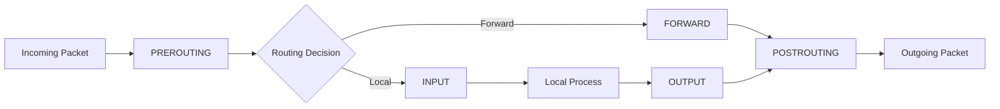
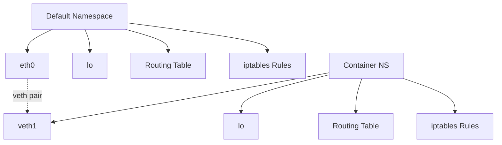

## Network Interface Management (iproute2)

The `iproute2` suite has replaced the legacy `net-tools` (`ifconfig`, `route`, `netstat`) as the
standard Linux network management toolset. It provides a consistent interface for managing
interfaces, addresses, routes, tunnels, and policies.

```mermaid
graph TD
    A[iproute2 Suite] --> B[ip — interfaces, addresses, routes]
    A --> C[ss — socket statistics]
    A --> D[bridge — layer 2 bridging]
    A --> E[vlan — VLAN configuration]
    A --> F[tuntap — TUN/TAP devices]
    A --> G[rtmon — route monitoring]
    A --> H[tc — traffic control / qdiscs]
    A --> I[nstat — network statistics]
    A --> J[rdisc — router discovery (legacy)]
```

### Interface Configuration

```bash
# List all network interfaces
ip link show
ip -br link show           # brief output

# Bring interface up/down
ip link set eth0 up
ip link set eth0 down

# Set interface properties
ip link set eth0 mtu 9000          # jumbo frames
ip link set eth0 promisc on        # promiscuous mode
ip link set eth0 txqueuelen 1000   # TX queue length
ip link set eth0 address 00:11:22:33:44:55  # change MAC

# Add IP addresses
ip addr add 192.168.1.10/24 dev eth0
ip addr add 10.0.0.1/24 dev eth0

# Remove IP address
ip addr del 192.168.1.10/24 dev eth0

# View IP addresses
ip addr show
ip -br addr show         # brief output

# Show only specific interface
ip addr show eth0
```

### Alternative Names for Interfaces

Modern Linux uses **predictable network interface names** instead of `eth0`:

| Naming Scheme | Format                             | Example           |
| ------------- | ---------------------------------- | ----------------- |
| `biosdevname` | BIOS-provided names                | `em1`, `p1p1`     |
| `systemd`     | Based on bus/slot/location         | `enp3s0`, `ens3`  |
| `slot`        | Physical slot number               | `enp3s0`          |
| `path`        | Physical topology path             | `enx78e7d1ea46da` |
| `mac`         | MAC address (for USB/dock devices) | `enx78e7d1ea46da` |

To revert to classic names, add `net.ifnames=0 biosdevname=0` to the kernel command line.

### Link Types

```bash
# Dummy interface (always up, drops packets)
ip link add dummy0 type dummy

# VLAN interface
ip link add link eth0 name eth0.100 type vlan id 100

# Bond interface (link aggregation)
ip link add bond0 type bond mode 802.3ad miimon 100
ip link set eth0 master bond0
ip link set eth1 master bond0

# Bridge (layer 2 switch)
ip link add name br0 type bridge
ip link set eth0 master br0
ip link set br0 up

# VETH pair (virtual ethernet — used by containers)
ip link add veth0 type veth peer name veth1

# TUN/TAP (layer 3 / layer 2 tunnel)
ip tuntap add dev tun0 mode tun
ip tuntap add dev tap0 mode tap
```

## Routing

### Routing Tables

```bash
# View routing table
ip route show
ip route show table main
ip route show table all       # all routing tables

# Default route
ip route add default via 192.168.1.1 dev eth0

# Static route
ip route add 10.0.0.0/24 via 192.168.1.254 dev eth0

# Blackhole route (silently drop)
ip route add blackhole 10.10.10.0/24

# Prohibit route (reject with ICMP prohibited)
ip route add prohibit 10.10.10.0/24

# Throw route (delegate to another table)
ip route add throw 10.10.10.0/24 table 100

# Delete route
ip route del 10.0.0.0/24 via 192.168.1.254

# Flush routes
ip route flush table cache    # flush routing cache
```

### Policy Routing

Linux supports multiple routing tables and policy-based routing (PBR). The `ip rule` command selects
which routing table to use based on source address, destination address, TOS, firewall mark, etc.

```bash
# List routing rules
ip rule show

# Add rule: traffic from 10.0.0.0/24 uses table 100
ip rule add from 10.0.0.0/24 table 100

# Add rule: traffic marked with fwmark 0x1 uses table 200
ip rule add fwmark 0x1 table 200

# Add to custom table
ip route add 10.10.10.0/24 via 192.168.2.1 dev eth1 table 100
ip route add default via 192.168.2.1 dev eth1 table 100

# Priority (lower = evaluated first)
ip rule add priority 100 from 10.0.0.0/24 table 100
ip rule add priority 200 from 172.16.0.0/16 table 200
```

### ARP

```bash
# View ARP table
ip neigh show
arp -an

# Add static ARP entry
ip neigh add 192.168.1.100 lladdr 00:11:22:33:44:55 dev eth0 nud permanent

# Delete ARP entry
ip neigh del 192.168.1.100 dev eth0

# Flush ARP cache
ip neigh flush all
```

## DNS Resolution

### `/etc/resolv.conf`

```bash
# Traditional DNS configuration
cat /etc/resolv.conf
# nameserver 8.8.8.8
# nameserver 8.8.4.4
# search example.com internal.example.com
# options timeout:2 attempts:3 rotate single-request-reopen
```

### `systemd-resolved`

Modern distributions use `systemd-resolved` as a local DNS resolver and cache:

```bash
# Check if systemd-resolved is active
systemctl status systemd-resolved

# Status
resolvectl status

# Query specific server
resolvectl query example.com

# DNS-over-TLS
resolvectl dns eth0 1.1.1.1#cloudflare-dns.com

# Per-link DNS configuration
resolvectl dns eth0 8.8.8.8 8.8.4.4
resolvectl domain eth0 ~example.com
```

### `/etc/nsswitch.conf`

Name Service Switch determines the order of lookup methods:

```text
hosts: files dns mdns4_minimal [NOTFOUND=return] dns
```

The lookup order: local files (`/etc/hosts`) first, then DNS. The `mdns4_minimal` entry handles
multicast DNS (`.local` domain) and returns NOTFOUND for non-`.local` names, which then falls
through to regular DNS.

### `dig` and `nslookup`

```bash
# Query A record
dig example.com

# Query specific record type
dig MX example.com
dig TXT example.com
dig CNAME www.example.com

# Query from specific server
dig @8.8.8.8 example.com

# Reverse DNS lookup
dig -x 8.8.8.8

# Short output
dig +short example.com

# Trace DNS resolution path
dig +trace example.com

# DNSSEC validation
dig +dnssec example.com
```

## Netfilter Framework

Netfilter is the kernel-level packet filtering framework that provides hooks at five points in the
networking stack. It is the foundation for `iptables`, `nftables`, and connection tracking.

### Netfilter Hooks



| Hook                     | Chains (iptables) | Description                                 |
| ------------------------ | ----------------- | ------------------------------------------- |
| **NF_INET_PRE_ROUTING**  | `PREROUTING`      | Before routing decision — DNAT, mangling    |
| **NF_INET_LOCAL_IN**     | `INPUT`           | Packets destined for local processes        |
| **NF_INET_FORWARD**      | `FORWARD`         | Packets being forwarded (router)            |
| **NF_INET_LOCAL_OUT**    | `OUTPUT`          | Packets originating from local processes    |
| **NF_INET_POST_ROUTING** | `POSTROUTING`     | After routing decision — SNAT, masquerading |

### Connection Tracking (conntrack)

The `nf_conntrack` module tracks the state of network connections. It classifies packets into
connection states:

| State         | Description                                                           |
| ------------- | --------------------------------------------------------------------- |
| `NEW`         | First packet of a connection (no matching entry yet)                  |
| `ESTABLISHED` | Connection is established (both directions seen)                      |
| `RELATED`     | Packet related to an existing connection (e.g., FTP data, ICMP error) |
| `UNREPLIED`   | Connection entry exists but no response packet seen                   |
| `INVALID`     | Packet does not match any known connection                            |

```bash
# View connection tracking table
conntrack -L
conntrack -L -s 192.168.1.0/24    # source filter
conntrack -L -d 10.0.0.1          # destination filter

# Count tracked connections
conntrack -C

# Delete all tracked connections
conntrack -F

# View connection tracking statistics
cat /proc/net/nf_conntrack
cat /proc/sys/net/netfilter/nf_conntrack_count
cat /proc/sys/net/netfilter/nf_conntrack_max

# Increase conntrack table size
sysctl -w net.netfilter.nf_conntrack_max=262144
```

:::warning

The conntrack table has a fixed size (default varies, often 65536-262144). When the table is full,
new connections are dropped with no error logged. This is a common cause of "mysterious" connection
failures under high load. Monitor `net.netfilter.nf_conntrack_count` vs
`net.netfilter.nf_conntrack_max`.

:::

## iptables

iptables is the legacy user-space interface to netfilter. It organizes rules into tables, chains,
and rules with matches and targets.

### Tables and Chains

| Table      | Chains Available                                | Purpose                                          |
| ---------- | ----------------------------------------------- | ------------------------------------------------ |
| `filter`   | INPUT, FORWARD, OUTPUT                          | Packet filtering (accept/drop/reject)            |
| `nat`      | PREROUTING, POSTROUTING, OUTPUT                 | Network address translation                      |
| `mangle`   | PREROUTING, INPUT, FORWARD, OUTPUT, POSTROUTING | Packet modification (TOS, TTL, marks)            |
| `raw`      | PREROUTING, OUTPUT                              | Disable connection tracking for specific packets |
| `security` | INPUT, FORWARD, OUTPUT                          | SELinux security context filtering               |

### Common iptables Operations

```bash
# List rules
iptables -L -n -v              # -n = numeric, -v = verbose
iptables -L -n -v --line-numbers  # show rule numbers
iptables -t nat -L -n -v       # NAT table

# Flush all rules (CAUTION)
iptables -F                     # flush filter table
iptables -t nat -F             # flush NAT table
iptables -X                     # delete all custom chains

# Default policies
iptables -P INPUT DROP          # default: drop incoming
iptables -P FORWARD DROP
iptables -P OUTPUT ACCEPT

# Append rule
iptables -A INPUT -p tcp --dport 22 -j ACCEPT    # allow SSH
iptables -A INPUT -p tcp --dport 80 -j ACCEPT    # allow HTTP
iptables -A INPUT -p tcp --dport 443 -j ACCEPT   # allow HTTPS

# Insert rule at position
iptables -I INPUT 1 -p tcp --dport 22 -j ACCEPT

# Delete rule by number
iptables -D INPUT 3

# Stateful filtering
iptables -A INPUT -m conntrack --ctstate ESTABLISHED,RELATED -j ACCEPT
iptables -A INPUT -m conntrack --ctstate INVALID -j DROP

# Allow loopback
iptables -A INPUT -i lo -j ACCEPT

# Log packets (for debugging)
iptables -A INPUT -j LOG --log-prefix "INPUT-DROP: " --log-level 4

# NAT — masquerade (source NAT)
iptables -t nat -A POSTROUTING -o eth0 -j MASQUERADE

# NAT — destination NAT (port forwarding)
iptables -t nat -A PREROUTING -p tcp --dport 80 -j DNAT --to-destination 10.0.0.5:8080

# Rate limiting
iptables -A INPUT -p tcp --dport 22 -m conntrack --ctstate NEW \
    -m limit --limit 3/min --limit-burst 5 -j ACCEPT
iptables -A INPUT -p tcp --dport 22 -m conntrack --ctstate NEW -j DROP

# Save and restore rules
iptables-save > /etc/iptables/rules.v4
iptables-restore < /etc/iptables/rules.v4
```

### iptables Rule Structure

```text
iptables -t table -A chain [matches] -j target
```

| Component   | Examples                                                    |
| ----------- | ----------------------------------------------------------- |
| `-p proto`  | `tcp`, `udp`, `icmp`, `all`                                 |
| `-s src`    | IP address or CIDR                                          |
| `-d dst`    | IP address or CIDR                                          |
| `-i in-if`  | Input interface                                             |
| `-o out-if` | Output interface                                            |
| `--dport`   | Destination port (requires `-p tcp/udp`)                    |
| `--sport`   | Source port                                                 |
| `-m match`  | Module: `conntrack`, `limit`, `multiport`, `state`, `mac`   |
| `-j target` | `ACCEPT`, `DROP`, `REJECT`, `LOG`, `RETURN`, `DNAT`, `SNAT` |

## nftables

nftables is the successor to iptables, designed from the ground up for better performance, more
consistent syntax, and atomic rule replacement.

### Key Differences from iptables

| Aspect             | iptables                              | nftables                          |
| ------------------ | ------------------------------------- | --------------------------------- |
| **Rule storage**   | Linear list per chain                 | Sets and maps (lookup tables)     |
| **Atomic replace** | No (requires iptables-restore)        | Yes (atomic rule set replacement) |
| **Performance**    | O(n) rule matching per chain          | O(1) lookups with sets and maps   |
| **Syntax**         | Multiple commands, inconsistent flags | Single consistent syntax          |
| **Kernel module**  | Multiple (xt\_)                       | Single `nf_tables`                |
| **IPv4/IPv6**      | Separate (`iptables`/`ip6tables`)     | Unified (`nft`)                   |

### nftables Configuration

```bash
# List rulesets
nft list ruleset

# Create a table
nft add table inet filter

# Create chains
nft add chain inet filter input { type filter hook input priority 0 \; }
nft add chain inet filter forward { type filter hook forward priority 0 \; }
nft add chain inet filter output { type filter hook output priority 0 \; }

# Add rules
nft add rule inet filter input iif lo accept
nft add rule inet filter input ct state established,related accept
nft add rule inet filter input ct state invalid drop
nft add rule inet filter input tcp dport { 22, 80, 443 } accept
nft add rule inet filter input iifname "eth0" icmp type echo-request limit rate 5/second accept
nft add rule inet filter input counter drop

# Sets — efficient lookup tables
nft add set inet filter allowed_ports { type inet_service \; flags interval \; }
nft add element inet filter allowed_ports { 22, 80, 443, 8080 }
nft add rule inet filter input tcp dport @allowed_ports accept

# Maps — key-value pairs
nft add map inet filter jump_map { type inet_service : verdict \; }
nft add element inet filter jump_map { 22 : accept, 80 : accept, 443 : accept }
nft add rule inet filter input tcp dport vmap @jump_map

# NAT
nft add table ip nat
nft add chain ip nat postrouting { type nat hook postrouting priority 100 \; }
nft add rule ip nat postrouting oifname "eth0" masquerade

# Flush and delete
nft flush table inet filter
nft delete table inet filter
```

### nftables Configuration File

`/etc/nftables.conf`:

```nft
#!/usr/sbin/nft -f

table inet filter {
    chain input {
        type filter hook input priority 0; policy drop;

        iif lo accept
        ct state established,related accept
        ct state invalid counter drop

        icmp type echo-request limit rate 5/second accept
        icmp type { destination-unreachable, time-exceeded } accept

        tcp dport { 22, 80, 443 } accept
        counter drop
    }

    chain forward {
        type filter hook forward priority 0; policy drop;
    }

    chain output {
        type filter hook output priority 0; policy accept;
    }
}
```

```bash
# Apply configuration
nft -f /etc/nftables.conf

# Check syntax without applying
nft -c -f /etc/nftables.conf

# Enable nftables service
systemctl enable --now nftables
```

## Network Namespaces

Network namespaces provide complete network stack isolation — each namespace has its own interfaces,
routing tables, ARP tables, firewall rules, and `/proc/net` view. This is the foundation of
container networking.



```bash
# Create network namespace
ip netns add ns1

# List namespaces
ip netns list

# Execute command in namespace
ip netns exec ns1 ip addr show
ip netns exec ns1 ip link set lo up

# Create veth pair and connect namespaces
ip link add veth0 type veth peer name veth1
ip link set veth1 netns ns1
ip link set veth0 up
ip addr add 10.0.0.1/24 dev veth0

ip netns exec ns1 ip link set veth1 up
ip netns exec ns1 ip addr add 10.0.0.2/24 dev veth1

# Test connectivity
ip netns exec ns1 ping 10.0.0.1

# Add NAT for namespace to reach external network
iptables -t nat -A POSTROUTING -s 10.0.0.0/24 -o eth0 -j MASQUERADE
ip netns exec ns1 ip route add default via 10.0.0.1

# Delete namespace
ip netns delete ns1
```

## Bridge and VLAN

### Layer 2 Bridging

```bash
# Create bridge
ip link add name br0 type bridge stp_state 1
ip link set br0 up

# Add interfaces to bridge
ip link set eth0 master br0
ip link set eth1 master br0

# Assign IP to bridge
ip addr add 192.168.1.1/24 dev br0

# View bridge FDB (forwarding database — MAC table)
bridge fdb show

# View bridge VLANs
bridge vlan show

# Set bridge properties
ip link set br0 type bridge max_age 2000 hello_time 200 forward_delay 1500
```

### VLAN

```bash
# Create VLAN interface on physical interface
ip link add link eth0 name eth0.100 type vlan id 100
ip link set eth0.100 up
ip addr add 192.168.100.1/24 dev eth0.100

# VLAN-aware bridge (single bridge, multiple VLANs)
ip link add name br0 type bridge vlan_filtering 1
ip link set eth0 master br0
bridge vlan add dev eth0 vid 100
bridge vlan add dev eth0 vid 200
```

## Socket Statistics and Troubleshooting

### `ss` — Socket Statistics

`ss` replaces `netstat` and provides more detailed information:

```bash
# All TCP sockets
ss -t -a

# All listening TCP sockets
ss -tln

# UDP sockets
ss -uln

# Socket statistics with process info
ss -tlnp

# Show timer information
ss -tnpi

# Filter by state
ss -tn state established
ss -tn state syn-sent
ss -tn state time-wait

# Filter by address/port
ss -tn dst 192.168.1.0/24
ss -tn dport = :443
ss -tn sport = :22

# Show socket memory usage
ss -tnm

# Summary statistics
ss -s
```

### `tcpdump` — Packet Capture

```bash
# Capture on specific interface
tcpdump -i eth0

# Capture specific port
tcpdump -i eth0 port 80

# Capture specific host
tcpdump -i eth0 host 192.168.1.10

# Capture with BPF filter (complex)
tcpdump -i eth0 'tcp port 80 and (((ip[2:2] - ((ip[0]&0xf)&lt;&lt;2)) - ((tcp[12]&0xf0)&gt;&gt;2)) != 0)'

# Save capture to file
tcpdump -i eth0 -w /tmp/capture.pcap

# Read capture file
tcpdump -r /tmp/capture.pcap

# Verbose output
tcpdump -i eth0 -vv -nn    # -nn = no DNS resolution

# Capture specific number of packets
tcpdump -i eth0 -c 100

# Capture with display filter
tcpdump -i eth0 'tcp[tcpflags] & (tcp-syn|tcp-fin) != 0'  # SYN and FIN packets

# Hex dump
tcpdump -i eth0 -XX -c 10

# Capture VLAN traffic
tcpdump -i eth0 -e vlan
```

### Network Troubleshooting Checklist

```bash
# 1. Check interface status
ip -br link show
ip -br addr show

# 2. Check connectivity
ping -c 3 192.168.1.1        # gateway
ping -c 3 8.8.8.8            # internet
ping -c 3 example.com        # DNS resolution

# 3. Check routing
ip route show
ip route get 8.8.8.8         # trace route lookup for specific destination

# 4. Check DNS
resolvectl status
dig example.com @8.8.8.8
dig +trace example.com

# 5. Check firewall
nft list ruleset
iptables -L -n -v

# 6. Check conntrack
conntrack -C
conntrack -L -d 10.0.0.1

# 7. Check for packet drops
ip -s link show eth0         # interface statistics (RX/TX errors, drops)
cat /proc/net/snmp           # protocol statistics

# 8. Check MTU issues
ping -c 3 -M do -s 1472 8.8.8.8    # test MTU without fragmentation

# 9. Trace path
traceroute 8.8.8.8
mtr 8.8.8.8                 # my traceroute (continuous)

# 10. Check for ARP issues
ip neigh show
arp -an
```

## NAT

### Source NAT (SNAT / Masquerade)

```bash
# iptables — masquerade (dynamic SNAT — uses interface IP)
iptables -t nat -A POSTROUTING -s 10.0.0.0/24 -o eth0 -j MASQUERADE

# iptables — static SNAT
iptables -t nat -A POSTROUTING -s 10.0.0.0/24 -o eth0 -j SNAT --to-source 203.0.113.5

# nftables
nft add rule ip nat postrouting ip saddr 10.0.0.0/24 oifname "eth0" masquerade
```

### Destination NAT (DNAT)

```bash
# iptables — port forwarding
iptables -t nat -A PREROUTING -p tcp --dport 443 -j DNAT --to-destination 10.0.0.5:8443
iptables -t nat -A PREROUTING -p tcp --dport 80 -j DNAT --to-destination 10.0.0.5:8080

# nftables
nft add rule ip nat prerouting tcp dport 443 dnat to 10.0.0.5:8443
```

### Port Forwarding with Routing

For DNAT to work, the system must be configured as a router (IP forwarding enabled):

```bash
# Enable IP forwarding (temporary)
sysctl -w net.ipv4.ip_forward=1

# Enable IP forwarding (permanent)
echo "net.ipv4.ip_forward = 1" > /etc/sysctl.d/99-forwarding.conf
sysctl --system
```

## Common Pitfalls

### Pitfall: iptables Rules Not Persisted

iptables rules are not automatically saved. After a reboot, rules revert to the default. Always save
rules:

```bash
# Debian/Ubuntu
apt install iptables-persistent
netfilter-persistent save

# RHEL/CentOS
iptables-save > /etc/sysconfig/iptables

# Or use the nftables service
nft list ruleset > /etc/nftables.conf
```

### Pitfall: Conntrack Table Exhaustion

Under high connection rates (web servers, proxies), the conntrack table can fill up, causing new
connections to be silently dropped:

```bash
# Check current usage
cat /proc/sys/net/netfilter/nf_conntrack_count
cat /proc/sys/net/netfilter/nf_conntrack_max

# Increase limit
echo 262144 > /proc/sys/net/netfilter/nf_conntrack_max
# Permanent:
echo "net.netfilter.nf_conntrack_max = 262144" >> /etc/sysctl.d/99-conntrack.conf

# Reduce conntrack timeout for TIME_WAIT
echo "net.netfilter.nf_conntrack_tcp_timeout_time_wait = 30" >> /etc/sysctl.d/99-conntrack.conf
```

### Pitfall: MTU Mismatch and Path MTU Discovery

If Path MTU Discovery (PMTUD) fails (e.g., ICMP blocked by firewall), large packets are silently
dropped. Symptoms include: small requests work, large requests hang or fail.

```bash
# Check for MTU issues
ping -c 3 -M do -s 1472 8.8.8.8    # should succeed on 1500-byte MTU
ping -c 3 -M do -s 1473 8.8.8.8    # should fail (Fragmentation Needed)

# If ICMP is blocked, fix the firewall:
iptables -A INPUT -p icmp --icmp-type fragmentation-needed -j ACCEPT
iptables -A FORWARD -p icmp --icmp-type fragmentation-needed -j ACCEPT

# Or enable TCP MSS clamping:
iptables -t mangle -A POSTROUTING -p tcp --tcp-flags SYN,RST SYN -j TCPMSS --clamp-mss-to-pmtu
```

### Pitfall: Default Policy DROP Without Allowing Established

A common firewall mistake is setting `INPUT` policy to `DROP` without first adding a rule to accept
established connections:

```bash
# WRONG — drops responses to outgoing requests
iptables -P INPUT DROP
iptables -A INPUT -p tcp --dport 22 -j ACCEPT

# CORRECT — accept established before dropping
iptables -A INPUT -m conntrack --ctstate ESTABLISHED,RELATED -j ACCEPT
iptables -P INPUT DROP
iptables -A INPUT -p tcp --dport 22 -j ACCEPT
```

### Pitfall: Loopback Not Allowed

If `INPUT` policy is `DROP`, you must explicitly allow loopback traffic. Many local services (MySQL,
PostgreSQL, web servers) communicate over the loopback interface:

```bash
iptables -A INPUT -i lo -j ACCEPT
```

### Pitfall: Mixing iptables and nftables

On modern systems, the `iptables` command may be translated to nftables via the `iptables-nft`
compatibility layer. This means `iptables-save` output may not reflect the actual ruleset. Use
`nft list ruleset` to see the authoritative state:

```bash
# Check which backend iptables uses
iptables --version
# iptables v1.8.7 (nf_tables)     ← translates to nftables
# iptables v1.8.7 (legacy)        ← uses legacy netfilter
```

### Pitfall: DNS Resolution After Changing Network Configuration

After changing interface configuration with `ip` commands, DNS resolution may break because
`systemd-resolved` may still reference the old interface. Restart the resolver or reconfigure:

```bash
resolvectl flush-caches
systemctl restart systemd-resolved
```
