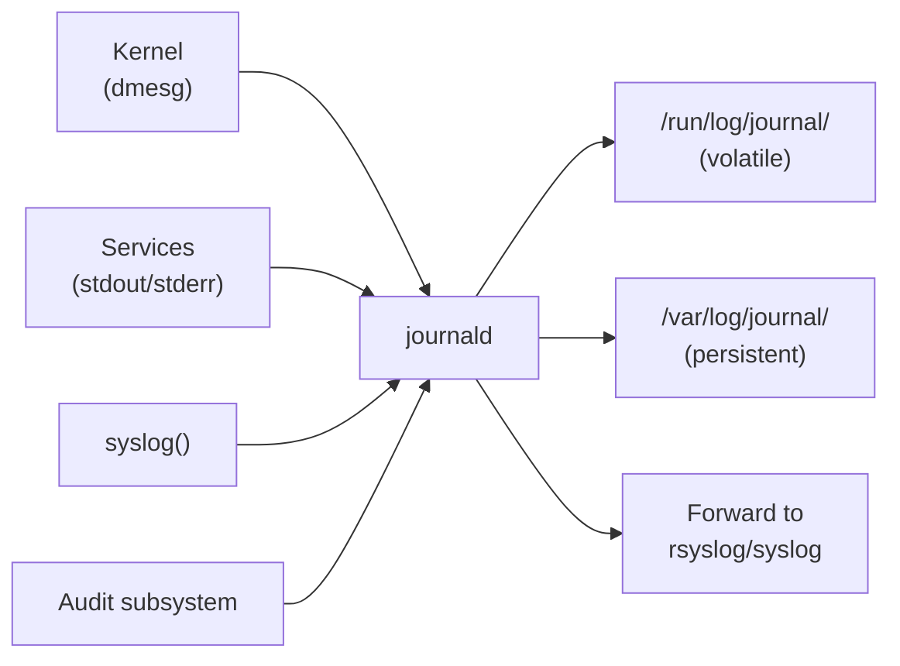
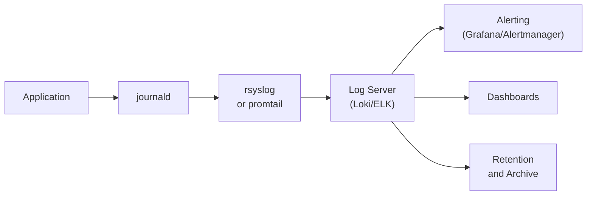

## systemd-journald Architecture

`systemd-journald` is the central logging daemon in systemd-based systems. It collects log messages
from multiple sources and stores them in a structured, indexed binary format.



### Log Sources

| Source           | Description                                 |
| ---------------- | ------------------------------------------- |
| stdout/stderr    | All service output captured by systemd      |
| Kernel messages  | `printk()` messages (equivalent to `dmesg`) |
| syslog()         | Traditional syslog calls                    |
| Audit events     | Kernel audit subsystem                      |
| /dev/kmsg        | Kernel log device                           |
| Internal journal | Journal's own diagnostic messages           |

### Storage Modes

```text
Volatile (/run/log/journal/):
  - Stored in tmpfs (RAM)
  - Lost on reboot
  - Default when /var/log/journal/ does not exist
  - Size limited by RuntimeMaxUse (default: 10% of RAM)

Persistent (/var/log/journal/):
  - Stored on disk
  - Survives reboots
  - Created with: mkdir -p /var/log/journal && systemd-tmpfiles --create --prefix /var/log/journal
  - Size limited by SystemMaxUse (default: 10% of filesystem)
```

```bash
# Check current storage mode
journalctl --header | grep "Storage"

# Enable persistent storage
sudo mkdir -p /var/log/journal
sudo systemd-tmpfiles --create --prefix /var/log/journal
sudo systemctl restart systemd-journald

# Verify
ls -la /var/log/journal/
# drwxr-xr-x 2 root systemd-journal 4096 ...
```

## journalctl

### Basic Usage

```bash
# Show all journal entries (newest first)
journalctl

# Show boot log (current boot)
journalctl -b

# Show previous boot
journalctl -b -1

# Show specific boot by boot ID
journalctl --list-boots
journalctl -b <boot-id>

# Follow live output
journalctl -f

# Show kernel messages
journalctl -k
journalctl -k -f

# Show since a specific time
journalctl --since "2026-04-01"
journalctl --since "2026-04-01 09:00:00"
journalctl --since "2 hours ago"
journalctl --since yesterday
journalctl --since today

# Show until a specific time
journalctl --until "2026-04-01 10:00:00"
journalctl --since "1 hour ago" --until "now"
```

### Filtering

```bash
# By unit (service)
journalctl -u nginx
journalctl -u nginx -u postgresql    # multiple units

# By PID
journalctl _PID=12345

# By executable
journalctl _COMM=sshd

# By systemd unit
journalctl _SYSTEMD_UNIT=nginx.service

# By priority (0=emerg, 1=alert, 2=crit, 3=err, 4=warning, 5=notice, 6=info, 7=debug)
journalctl -p err
journalctl -p warning..err        # range
journalctl -p 3                   # error

# By facility (syslog facility codes)
journalctl -f FACILITY=daemon

# By message content
journalctl --grep="connection refused"
journalctl --grep="OutOfMemory"

# By boot
journalctl -b 0    # current boot
journalctl -b -1   # previous boot

# By user session
journalctl _UID=1000

# Combine filters
journalctl -u nginx --since "1 hour ago" -p err
journalctl -u sshd _COMM=sshd --grep="Failed"
```

### Output Formats

```bash
# Default (human-readable)
journalctl

# Short (default, but without legend)
journalctl -o short

# Verbose (show all fields)
journalctl -o verbose

# JSON (one entry per line)
journalctl -o json

# JSON pretty-printed
journalctl -o json-pretty

# Export format (for journalctl --import)
journalctl -o export

# Cat (show message only, no metadata)
journalctl -o cat

# With field values
journalctl -o with-unit
```

### Useful Fields

```bash
# Common journal fields
_SYSTEMD_UNIT     # systemd unit name
_COMM             # executable name
_PID              # process ID
_UID              # user ID
_GID              # group ID
_HOSTNAME         # hostname
_TRANSPORT        # source: journal, syslog, kernel, etc.
_PRIORITY         # syslog priority (0-7)
_MESSAGE          # log message
_MESSAGE_ID       # structured message ID
_EXE              # executable path
_CMDLINE          # command line
_SOURCE_REALTIME  # timestamp (microseconds since epoch)
_BOOT_ID          # unique boot identifier
_MACHINE_ID       # unique machine identifier

# Show all fields for recent entries
journalctl -o verbose -n 5

# Filter by specific field
journalctl _HOSTNAME=server01
journalctl _TRANSPORT=syslog
```

### Practical Examples

```bash
# Find all failed service starts in the last 24 hours
journalctl --since yesterday -p err --grep="Failed"

# Track all SSH login attempts
journalctl -u sshd -o cat | grep -E "Accepted|Failed"

# Show nginx access logs with timestamps
journalctl -u nginx --since "1 hour ago" -o cat

# Find OOM killer events
journalctl -k --grep="Out of memory"
journalctl --grep="invoked oom-killer"

# Show the last 100 lines of a service's log
journalctl -u myapp -n 100

# Export logs for analysis
journalctl -u nginx --since "2026-04-01" -o json-pretty > nginx_april.json

# Pipe to jq for analysis
journalctl -u nginx --since "1 hour ago" -o json | \
    jq -r 'select(.PRIORITY >= 4) | .__REALTIME_TIMESTAMP + " " + .MESSAGE'
```

## journald Configuration

```ini
# /etc/systemd/journald.conf
[Journal]

# Storage mode: auto, volatile, persistent, none
Storage=auto

# Maximum disk space for persistent storage
SystemMaxUse=500M
# Minimum disk space to keep (before vacuuming)
SystemKeepFree=1G
# Maximum size of individual journal file
SystemMaxFileSize=50M
# Maximum time to keep journal files
MaxFileSec=1month

# Maximum disk space for volatile storage (in RAM)
RuntimeMaxUse=100M
RuntimeKeepFree=50M
RuntimeMaxFileSize=10M

# Compress journal files (default: yes)
Compress=yes

# Split journal files by UID (one per user)
SplitMode=uid

# Forward to traditional syslog daemon
ForwardToSyslog=yes

# Forward to wall (broadcast to logged-in users)
ForwardToWall=no

# Maximum rate of messages from a single service
RateLimitIntervalSec=30s
RateLimitBurst=10000

# Line rate limit (per-service)
LineRateLimitIntervalSec=30s
LineRateLimitBurst=1000

# File sealing (prevent tampering)
Seal=yes

# ReadKMsg (kernel messages)
ReadKMsg=yes

# TTYPath (console output)
TTYPath=/dev/console
```

```bash
# After changing configuration
systemctl restart systemd-journald

# Verify configuration
journalctl --header
```

## Log Rotation

### systemd-tmpfiles

`systemd-tmpfiles` manages temporary files and directories, including journal file rotation.

```bash
# Systemd's built-in journal cleanup
# /usr/lib/tmpfiles.d/systemd.conf
# Automatically cleans up journal files based on SystemMaxUse/SystemKeepFree

# Manual vacuum
journalctl --vacuum-size=500M      # keep at most 500M
journalctl --vacuum-time=7d        # keep at most 7 days
journalctl --vacuum-files=10       # keep at most 10 journal files

# Check disk usage
journalctl --disk-usage
```

### logrotate

`logrotate` is the traditional log rotation tool, still widely used for application-specific logs.

```ini
# /etc/logrotate.d/nginx
/var/log/nginx/*.log {
    daily
    missingok
    rotate 14
    compress
    delaycompress
    notifempty
    create 0640 nginx adm
    sharedscripts
    postrotate
        [ -f /run/nginx.pid ] && kill -USR1 $(cat /run/nginx.pid)
    endscript
}
```

```ini
# /etc/logrotate.d/myapp
/var/log/myapp/*.log {
    daily
    rotate 30
    compress
    delaycompress
    missingok
    notifempty
    create 0644 myapp myapp
    size 100M
    maxsize 200M
    dateext
    dateformat -%Y%m%d
}
```

```bash
# Test configuration
logrotate -d /etc/logrotate.conf    # debug mode (dry run)

# Force rotation
logrotate -f /etc/logrotate.conf

# Verify a specific config
logrotate -d /etc/logrotate.d/nginx
```

:::info

systemd-managed services log to the journal by default. `logrotate` is typically used for:

1. Applications that write directly to files (not through the journal)
2. Legacy applications without systemd support
3. Situations requiring specific rotation policies per application

:::

## rsyslog

`rsyslog` is the traditional syslog daemon that can receive messages from journald and process them
with rules-based routing.

### Configuration

```ini
# /etc/rsyslog.conf

# Modules
module(load="imuxsock")       # Unix socket input
module(load="imjournal")      # journald input
module(load="imudp")          # UDP input (port 514)
module(load="imtcp")          # TCP input (port 514)
input(type="imudp" port="514")
input(type="imtcp" port="514")

# Global directives
$WorkDirectory /var/lib/rsyslog
$ActionFileDefaultTemplate RSYSLOG_TraditionalFileFormat

# Rules
# facility.severity          target
*.info;mail.none;authpriv.none;cron.none    /var/log/messages
authpriv.*                                  /var/log/secure
mail.*                                      -/var/log/maillog
cron.*                                      /var/log/cron
*.emerg                                     :omusrmsg:*

# Application-specific rules
local0.*                                    /var/log/app.log
local1.*                                    /var/log/audit.log

# Forward to remote syslog
*.* @@remote-syslog.example.com:514         # TCP
*.* @remote-syslog.example.com:514          # UDP
```

```ini
# /etc/rsyslog.d/50-default.conf

# Traditional log files
auth,authpriv.*                 /var/log/auth.log
*.*;auth,authpriv.none          -/var/log/syslog
cron.*                          /var/log/cron.log
daemon.*                        -/var/log/daemon.log
kern.*                          -/var/log/kern.log
lpr.*                           -/var/log/lpr.log
mail.*                          -/var/log/mail.log
user.*                          -/var/log/user.log

# Emergency messages to all users
*.emerg                         :omusrmsg:*
```

### rsyslog Filters

```ini
# Property-based filters
:programname, isequal, "nginx" /var/log/nginx.log
:hostname, startswith, "web"   /var/log/web-servers.log

# Complex filters
if $programname == 'sshd' and $msg contains 'Failed' then /var/log/sshd-failed.log
if $syslogseverity <= 3 then /var/log/critical.log
if $fromhost-ip == '10.0.0.50' then /var/log/server50.log

# Stop processing (discard)
if $programname == 'noisy-app' then stop
```

### rsyslog Actions

```ini
# Write to file
*.* /var/log/all.log

# Write to remote syslog
*.* @@central-log.example.com:514

# Execute program
*.* | /usr/bin/log-analyzer

# Forward to another queue
*.info :omprog:/usr/bin/mylogprocessor

# Discard
:programname, isequal, "debug-app" ~
```

```bash
# Restart rsyslog
systemctl restart rsyslog

# Check syntax
rsyslogd -N1    # config check mode

# Verify it is running
systemctl status rsyslog
ss -ulnp | grep 514
```

## Structured Logging

### Journal Fields as Structured Data

```bash
# Applications can log structured data via the journal
# Using sd_journal_send() in C:
# sd_journal_send("MESSAGE=Service started",
#                 "SERVICE_NAME=%s", "myapp",
#                 "VERSION=%s", "2.0.0",
#                 "PRIORITY=%i", LOG_INFO,
#                 NULL);

# Using systemd-cat with fields
systemd-cat -t myapp --identifier=myapp -p info echo "Service started"

# Using python-systemd
# from systemd import journal
# journal.send('MESSAGE=Hello', 'PRIORITY=6', 'MY_FIELD=my_value')
```

### Querying Structured Data

```bash
# Show specific fields
journalctl -u nginx -o json-pretty | \
    jq '{time: .__REALTIME_TIMESTAMP, message: .MESSAGE, priority: .PRIORITY}'

# Count errors by service
journalctl -p err --since yesterday -o json | \
    jq -r '._SYSTEMD_UNIT' | sort | uniq -c | sort -rn

# Find all messages with a specific field
journalctl _COMM=sshd -o verbose | grep "OBJECT_SYSTEMD_UNIT"

# Export specific fields as CSV
journalctl -u nginx --since today -o json | \
    jq -r '[.__REALTIME_TIMESTAMP, ._PID, .MESSAGE] | @csv'
```

## Log Forwarding

### Forward Journal to Remote Syslog

```ini
# /etc/systemd/journald.conf
# Forward to local rsyslog, which forwards to remote
ForwardToSyslog=yes
```

```ini
# /etc/rsyslog.d/60-remote.conf
# Forward all logs to remote server via TCP
*.* @@logserver.example.com:514

# Forward specific facility/severity
*.crit @@logserver.example.com:514
authpriv.* @@logserver.example.com:514

# Use TLS for encrypted forwarding
$DefaultNetstreamDriver gtls
$ActionSendStreamDriverMode gtls
$ActionSendStreamDriverAuthMode x509/name
$ActionSendStreamDriverPermittedPeer logserver.example.com
$ActionSendStreamDriverTrustedFile /etc/ssl/certs/ca-cert.pem

*.* @@logserver.example.com:6514
```

### Forward Journal Directly (No rsyslog)

```ini
# /etc/systemd/journald.conf
# Forward to remote via systemd-journal-remote
ForwardToConsole=no
ForwardToSyslog=no
```

```bash
# Install and configure systemd-journal-remote
apt-get install systemd-journal-remote
# /etc/systemd/journal-upload.conf
[Upload]
URL=https://logserver.example.com:19532
ServerKeyFile=/etc/ssl/private/server-key.pem
ServerCertificateFile=/etc/ssl/certs/server-cert.pem
TrustedCertificateFile=/etc/ssl/certs/ca-cert.pem

systemctl enable --now systemd-journal-upload
```

## Disk Space Management

```bash
# Check journal disk usage
journalctl --disk-usage

# Vacuum by size
journalctl --vacuum-size=500M

# Vacuum by time
journalctl --vacuum-time=30d

# Vacuum by number of files
journalctl --vacuum-files=20

# Show journal file sizes
ls -lhS /var/log/journal/*/system.journal

# Monitor disk usage
watch -n 60 'journalctl --disk-usage'
```

## Boot Log Analysis

```bash
# Show the current boot's logs
journalctl -b

# Show boot timing (systemd-analyze)
systemd-analyze
# Startup finished in 2.341s (kernel) + 4.123s (userspace) = 6.464s

# Show the slowest services
systemd-analyze blame | head -20

# Critical chain (dependency chain that took longest)
systemd-analyze critical-chain

# Boot timeline
systemd-analyze plot > boot-timeline.svg

# Verify boot messages
journalctl -b -p err
journalctl -b --grep="error|failed|fatal"
```

## Common Pitfalls

### Pitfall: Missing /var/log/journal/ Causes Volatile Logging

```bash
# If /var/log/journal/ does not exist, logs are stored in RAM only
ls -la /var/log/journal/    # if this directory is missing, storage is volatile

# Fix: create the directory and restart journald
sudo mkdir -p /var/log/journal
sudo systemd-tmpfiles --create --prefix /var/log/journal
sudo systemctl restart systemd-journald

# Verify
journalctl --header | grep Storage
# Storage: persistent
```

### Pitfall: Rate Limiting Drops Log Messages

```bash
# If a service produces too many messages, journald rate-limits it
journalctl -u noisy-service --since "1 hour ago" | wc -l
# Might show fewer messages than expected

# Check for rate-limiting messages
journalctl -u systemd-journald --grep="rate-limiting"

# Increase rate limits in journald.conf
# RateLimitIntervalSec=30s
# RateLimitBurst=100000
```

### Pitfall: journald and rsyslog Both Storing Logs

```bash
# By default, ForwardToSyslog=yes in journald.conf
# This means logs are stored in both the journal AND rsyslog files
# Double the disk usage

# Fix: disable forwarding if you only use the journal
# /etc/systemd/journald.conf
ForwardToSyslog=no

# Or: disable journal persistence if you only use rsyslog files
# /etc/systemd/journald.conf
Storage=volatile
```

### Pitfall: journalctl Shows No Logs for a Service

```bash
# If a service runs in a container or is not managed by systemd,
# its logs may not appear in the journal

# Check if the service is systemd-managed
systemctl status myapp

# For non-systemd processes, logs go to:
# - Their own log files
# - /var/log/syslog (if rsyslog captures syslog() calls)
# - stdout/stderr is NOT captured if not started by systemd

# For scripts run by cron:
journalctl -u cron    # cron's own logs
# But the script's output is NOT in the journal unless it uses syslog()
# Fix: redirect cron job output
0 * * * * /usr/local/bin/myscript.sh 2>&1 | systemd-cat -t myscript
```

### Pitfall: Large Journal Files from Noisy Services

```bash
# Identify the largest journal files
journalctl --disk-usage
ls -lhS /var/log/journal/

# Find which units generate the most log data
journalctl --since "7 days ago" -o json | \
    jq -r '._SYSTEMD_UNIT // "kernel"' | \
    sort | uniq -c | sort -rn | head -20

# Fix: adjust the service's log level
# For systemd services, add:
# [Service]
# LogRateLimitIntervalSec=30s
# LogRateLimitBurst=10000

# For journald rate limiting, see journald.conf above
```

### Pitfall: Timezone Issues in Log Timestamps

```bash
# journalctl uses the system timezone by default
timedatectl

# Show timestamps in UTC
journalctl --since today -o short-precise

# Show timestamps in a specific timezone
TZ=UTC journalctl --since today

# The journal stores timestamps in UTC internally
# Display format does not affect storage
```

## Log Analysis Patterns

### Finding Errors Across All Services

```bash
# All error-level messages in the last 24 hours
journalctl --since yesterday -p err

# Errors grouped by service
journalctl --since yesterday -p err -o json | \
    jq -r '._SYSTEMD_UNIT // "kernel"' | \
    sort | uniq -c | sort -rn

# Errors with context (5 lines before and after)
journalctl --since yesterday -p err -B 5 -A 5

# Find recurring error patterns
journalctl --since "7 days ago" -p err -o cat | \
    sort | uniq -c | sort -rn | head -20
```

### Service-Specific Analysis

```bash
# Nginx: find all 5xx responses (if logging to journal)
journalctl -u nginx --since today -o cat | \
    awk '{print $NF}' | grep '^5' | wc -l

# SSH: find failed login attempts
journalctl -u sshd --since today -o cat | grep "Failed password"

# System: OOM killer events
journalctl -k --grep="Out of memory" --since "7 days ago"

# System: hardware errors
journalctl -k -p err --since "7 days ago"
```

### Timeline Analysis

```bash
# Create a timeline of significant events
journalctl --since "2026-04-06 08:00" --until "2026-04-06 10:00" \
    -p warning -o short-precise | \
    awk '{print $1, $2, $3}' | uniq -c

# Find what happened around a specific time
journalctl --since "2026-04-06 09:14:00" --until "2026-04-06 09:16:00" \
    -o verbose
```

### Boot Time Analysis

```bash
# Systemd boot analysis
systemd-analyze
systemd-analyze blame | head -20
systemd-analyze critical-chain
systemd-analyze critical-chain --blur 0.1s

# Compare boot times between boots
systemd-analyze dump | grep 'FinishTimestamp'

# Identify services that slow down boot
systemd-analyze blame | awk '$1 > 1000 {print}'

# Generate boot chart (requires pybootchartgui or systemd-bootchart)
systemd-analyze plot > /tmp/boot-analysis.svg
```

## Log Retention Policies

### Defining a Retention Policy

```bash
# Size-based retention
journalctl --vacuum-size=1G

# Time-based retention
journalctl --vacuum-time=30d

# Combined: keep 30 days or 1G, whichever is smaller
journalctl --vacuum-time=30d --vacuum-size=1G

# Configure in journald.conf
# SystemMaxUse=1G
# MaxFileSec=1week
```

### Application Log Retention

```ini
# /etc/logrotate.d/application

# Keep 90 days of logs, compress after 7 days
/var/log/myapp/*.log {
    daily
    rotate 90
    compress
    delaycompress
    missingok
    notifempty
    create 0640 myapp adm
    dateext
    dateformat -%Y%m%d
    postrotate
        systemctl reload myapp > /dev/null 2>&1 || true
    endscript
}

# Heavy log generator: more aggressive
/var/log/noisy-app/*.log {
    hourly
    rotate 168          # 7 days of hourly logs
    compress
    delaycompress
    missingok
    notifempty
    size 500M          # rotate if file exceeds 500M
    maxsize 1G
    create 0640 noisy-app adm
}
```

## Integrating with Monitoring

### Exporting to Prometheus

```bash
# journalctl can output JSON for parsing by exporters
# Common pattern: use promtail (Loki) or journald-exporter

# promtail config snippet
# /etc/promtail/config.yml
# scrape_configs:
#   - job_name: journal
#     journal:
#       max_age: 12h
#       labels:
#         job: systemd-journal
#     relabel_configs:
#       - source_labels: ['__journal__systemd_unit']
#         target_label: 'unit'
```

### Email Alerts from Logs

```bash
#!/usr/bin/env bash
# /usr/local/bin/log-alert.sh
# Send email alert for critical log entries

ALERT_EMAIL="oncall@example.com"
SINCE="1 hour ago"

errors=$(journalctl --since "$SINCE" -p crit -o cat)

if [[ -n "$errors" ]]; then
    {
        echo "Subject: [CRITICAL] $(hostname) - $(echo "$errors" | wc -l) critical log entries"
        echo "From: alerts@example.com"
        echo "To: $ALERT_EMAIL"
        echo ""
        echo "Host: $(hostname)"
        echo "Time: $(date)"
        echo "Since: $SINCE"
        echo ""
        echo "$errors"
    } | sendmail "$ALERT_EMAIL"
fi
```

```cron
# Run every hour
0 * * * * /usr/local/bin/log-alert.sh
```

## Structured Logging Best Practices

### Log Levels

```text
Use syslog priority levels consistently:

0 - emerg   : System is unusable (kernel panic, complete failure)
1 - alert   : Action must be taken immediately (data loss, security breach)
2 - crit    : Critical conditions (database down, filesystem full)
3 - err     : Error conditions (failed request, exception)
4 - warning : Warning conditions (high latency, retry needed)
5 - notice  : Normal but significant (service started, config changed)
6 - info    : Informational (request completed, user logged in)
7 - debug   : Debug messages (detailed flow, variable values)
```

### Log Message Format

```bash
# Good log messages include:
# - Timestamp
# - Log level
# - Service/component name
# - Correlation ID (for distributed tracing)
# - Structured key-value pairs

# Example using systemd-cat with structured fields
systemd-cat -t myapp -p info << 'EOF'
message=Request completed
request_id=abc-123
duration_ms=42
status=200
EOF

# Python example (using systemd.journal)
# journal.send(
#     MESSAGE='Request completed',
#     SYSLOG_IDENTIFIER='myapp',
#     PRIORITY=6,  # info
#     REQUEST_ID='abc-123',
#     DURATION_MS='42',
#     STATUS='200'
# )
```

### Correlation IDs

```bash
# Generate a correlation ID and propagate it through the log pipeline
CORRELATION_ID=$(uuidgen)

journalctl -u myapp -o json | \
    jq --arg cid "$CORRELATION_ID" 'select(.CORRELATION_ID == $cid)'
```

### Log Aggregation Architecture


