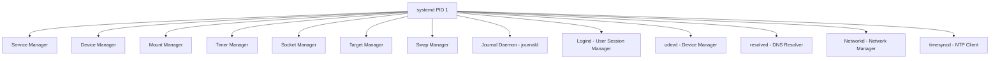

## Systemd Architecture

systemd is a system and service manager for Linux, serving as the init system (PID 1) and providing
a suite of tools for managing services, devices, mounts, timers, and more. It replaced the
traditional SysV init system and is used by default on virtually every major Linux distribution.



### Design Principles

- **Socket activation**: Services are started on-demand when a connection arrives on their socket,
  reducing boot time and resource usage.
- **Parallel startup**: Dependencies are resolved, and services without dependencies start in
  parallel.
- **Unit-based configuration**: Everything managed by systemd is represented as a "unit" with a
  declarative configuration file.
- **Cgroup tracking**: Each service runs in its own cgroup, making resource management and cleanup
  reliable.
- **Journal**: Structured logging with indexed, searchable log data.

## Unit Types

A **unit** is the fundamental object that systemd manages. Each unit has a configuration file and a
type that determines its behavior.

| Unit Type     | File Extension | Description                                |
| ------------- | -------------- | ------------------------------------------ |
| **Service**   | `.service`     | A system service (daemon or one-shot)      |
| **Target**    | `.target`      | A synchronization point for grouping units |
| **Timer**     | `.timer`       | A timer for activating other units         |
| **Socket**    | `.socket`      | A socket for socket activation             |
| **Mount**     | `.mount`       | A file system mount point                  |
| **Automount** | `.automount`   | An automount point (mount on access)       |
| **Path**      | `.path`        | A path for path-based activation           |
| **Slice**     | `.slice`       | A cgroup slice for resource management     |
| **Scope**     | `.scope`       | An externally created process group        |
| **Swap**      | `.swap`        | A swap device                              |
| **Device**    | `.device`      | A kernel device                            |

### Finding Unit Files

systemd searches for unit files in several directories, with later directories overriding earlier
ones:

```bash
# Show the search path
systemctl show -p UnitPath

# Typical search order:
# 1. /etc/systemd/system/          (administrator overrides)
# 2. /run/systemd/system/          (runtime configuration)
# 3. /usr/lib/systemd/system/      (package-installed units)
```

### Viewing Units

```bash
# List all installed unit files
systemctl list-unit-files

# List all active units
systemctl list-units

# List all active services
systemctl list-units --type=service

# List failed units
systemctl --failed

# List timers
systemctl list-timers --all

# Show unit configuration
systemctl cat nginx.service

# Show unit properties
systemctl show nginx.service

# Show specific property
systemctl show nginx.service -p ExecStart
systemctl show nginx.service -p CPUUsageNSec
systemctl show nginx.service -p MemoryCurrent

# Check unit dependencies
systemctl list-dependencies nginx.service
systemctl list-dependencies nginx.service --reverse

# Check what requires a target
systemctl list-dependencies multi-user.target --reverse
```

## Service Unit Files

A `.service` file defines how a service is started, stopped, and managed. The file consists of
sections in INI-style format.

### Complete Service Unit File Example

```ini
[Unit]
Description=My Application Service
Documentation=https://example.com/docs
After=network-online.target
Wants=network-online.target
Requires=redis.service

[Service]
Type=simple
User=myapp
Group=myapp
WorkingDirectory=/opt/myapp
ExecStart=/usr/bin/python3 /opt/myapp/app.py
ExecStartPost=/bin/sleep 1
ExecReload=/bin/kill -HUP $MAINPID
Restart=on-failure
RestartSec=5
TimeoutStartSec=30
TimeoutStopSec=30
StandardOutput=journal
StandardError=inherit

# Hardening
ProtectSystem=strict
PrivateTmp=yes
NoNewPrivileges=yes
ProtectHome=yes
ReadWritePaths=/var/lib/myapp

[Install]
WantedBy=multi-user.target
```

### `[Unit]` Section

| Directive       | Description                                                 |
| --------------- | ----------------------------------------------------------- |
| `Description`   | Human-readable description                                  |
| `Documentation` | URL to documentation                                        |
| `After=`        | Start after the listed units (ordering, not dependency)     |
| `Before=`       | Start before the listed units                               |
| `Requires=`     | Hard dependency — if the listed unit fails, this unit fails |
| `Wants=`        | Soft dependency — start if available, continue if not       |
| `Requisite=`    | Hard dependency — fail immediately if not already running   |
| `Conflicts=`    | If the listed unit is running, this unit cannot start       |
| `PartOf=`       | When the listed unit is stopped/restarted, this unit is too |

### `[Service]` Section — Service Type

| Type               | Behavior                                                                              | Use Case                      |
| ------------------ | ------------------------------------------------------------------------------------- | ----------------------------- |
| `simple` (default) | `ExecStart` is the main process. systemd considers it started immediately.            | Most daemons                  |
| `exec`             | `ExecStart` is the main process. systemd waits for it to fork and exit.               | Daemons that double-fork      |
| `forking`          | `ExecStart` forks a child and the parent exits. systemd waits for the parent to exit. | Traditional daemons           |
| `oneshot`          | `ExecStart` runs and exits. systemd waits for it to finish.                           | Scripts, initialization tasks |
| `dbus`             | Service acquires a name on D-Bus. systemd considers it started when the name appears. | D-Bus services                |
| `notify`           | Service sends `sd_notify()` when ready. systemd waits for the notification.           | Modern daemons with sd_notify |
| `notify-reload`    | Like `notify`, but supports `sd_notify(RELOADING=1)` for reload.                      | Daemons with reload support   |
| `idle`             | Like `simple`, but started after all active jobs are dispatched.                      | Avoids blocking boot output   |

### `[Service]` Section — Lifecycle Directives

```ini
[Service]
# Main process
ExecStart=/usr/bin/myapp --config /etc/myapp/config.yaml

# Pre-start check
ExecStartPre=/usr/bin/myapp --validate-config

# Post-start (runs after ExecStart)
ExecStartPost=/usr/bin/touch /var/run/myapp/initialized

# Reload (sent on systemctl reload)
ExecReload=/bin/kill -HUP $MAINPID

# Stop (default: SIGTERM)
ExecStop=/usr/bin/myapp --shutdown

# Stop post-cleanup
ExecStopPost=/bin/rm -f /var/run/myapp/initialized

# Environment
Environment="NODE_ENV=production"
Environment="LOG_LEVEL=info"
EnvironmentFile=/etc/myapp/environment

# Pass environment file (allows variable expansion)
EnvironmentFile=-/etc/myapp/env.local    # - means file is optional
```

### `[Service]` Section — Restart Policy

| Directive             | Behavior                                             |
| --------------------- | ---------------------------------------------------- |
| `Restart=no`          | Never restart (default)                              |
| `Restart=on-success`  | Restart if the process exits cleanly (exit code 0)   |
| `Restart=on-failure`  | Restart if the process exits with non-zero or signal |
| `Restart=on-abnormal` | Restart on signal, timeout, or watchdog              |
| `Restart=on-abort`    | Restart on signal (not clean exit)                   |
| `Restart=on-watchdog` | Restart on watchdog timeout                          |
| `Restart=always`      | Always restart, regardless of exit status            |

```ini
Restart=on-failure
RestartSec=5              # wait 5 seconds between restarts
StartLimitBurst=5         # allow 5 restarts within...
StartLimitIntervalSec=60  # ...60 seconds before giving up
```

### `systemctl` — Service Management

```bash
# Start/stop/restart
systemctl start nginx
systemctl stop nginx
systemctl restart nginx

# Reload configuration (sends SIGHUP or uses ExecReload)
systemctl reload nginx

# Reload daemon configuration (after editing unit files)
systemctl daemon-reload

# Enable/disable (start on boot)
systemctl enable nginx
systemctl disable nginx

# Enable and start in one command
systemctl enable --now nginx

# Check status
systemctl status nginx

# Check if a service is active
systemctl is-active nginx        # outputs: active / inactive / failed

# Check if enabled at boot
systemctl is-enabled nginx       # outputs: enabled / disabled

# Edit unit file (opens override file)
systemctl edit nginx             # creates /etc/systemd/system/nginx.service.d/override.conf

# Edit the full unit file
systemctl edit --full nginx      # copies to /etc/systemd/system/nginx.service

# Show service logs
journalctl -u nginx
journalctl -u nginx -f           # follow (like tail -f)
journalctl -u nginx --since "1 hour ago"
journalctl -u nginx --since "2024-01-01" --until "2024-01-02"

# Show service cgroup resource usage
systemctl status nginx
systemctl show nginx -p MemoryCurrent
systemctl show nginx -p CPUUsageNSec
systemctl show nginx -p TasksCurrent

# Reset failed state
systemctl reset-failed nginx

# Mask/unmask (prevent a service from starting, even manually)
systemctl mask nginx
systemctl unmask nginx
```

## Targets

Targets are synchronization points that group units. They replace the SysV runlevel concept.

### Target Equivalents to Runlevels

| SysV Runlevel | systemd Target      | Description                   |
| ------------- | ------------------- | ----------------------------- |
| 0             | `poweroff.target`   | Halt/shutdown                 |
| 1             | `rescue.target`     | Single-user mode              |
| 2, 4          | `multi-user.target` | Multi-user, no GUI            |
| 3             | `multi-user.target` | Multi-user, no GUI            |
| 5             | `graphical.target`  | Multi-user with GUI           |
| 6             | `reboot.target`     | Reboot                        |
| —             | `emergency.target`  | Emergency shell               |
| —             | `default.target`    | Symlink to the default target |

```bash
# View current target
systemctl get-default

# Set default target
systemctl set-default multi-user.target

# Change target (switch runlevel)
systemctl isolate multi-user.target

# List active targets
systemctl list-units --type=target
```

### Custom Targets

```bash
# Create a custom target
systemctl add-wants multi-user.target myapp.target

# Create a unit file for the target
# /etc/systemd/system/myapp.target
[Unit]
Description=My Application Stack
Requires=myapp.service redis.service postgresql.service
After=myapp.service redis.service postgresql.service
```

## Journal (journald)

`systemd-journald` is the logging daemon that collects and stores log messages from the kernel,
systemd units, and standard output/error of services.

### Journalctl Usage

```bash
# Show all logs (newest first)
journalctl

# Show boot logs
journalctl -b              # current boot
journalctl -b -1           # previous boot
journalctl -b -5           # five boots ago
journalctl --list-boots    # list all boots with timestamps

# Filter by unit
journalctl -u nginx
journalctl -u nginx -u php-fpm    # multiple units

# Filter by time
journalctl --since "2024-01-15 10:00:00"
journalctl --since "2 hours ago"
journalctl --since yesterday
journalctl --until "2024-01-15 12:00:00"

# Filter by priority
journalctl -p err          # error and above
journalctl -p warning      # warning and above
journalctl -p debug        # all messages

# Priority levels: emerg(0), alert(1), crit(2), err(3), warning(4), notice(5), info(6), debug(7)

# Filter by process
journalctl _PID=1234
journalctl _COMM=nginx
journalctl _UID=33

# Output format
journalctl -o json         # JSON
journalctl -o json-pretty  # pretty JSON
journalctl -o verbose      # full metadata
journalctl -o cat          # just the message (no metadata)

# Follow live logs
journalctl -f
journalctl -u nginx -f

# Show disk usage
journalctl --disk-usage

# Vacuum logs (free space)
journalctl --vacuum-size=500M
journalctl --vacuum-time=30d
journalctl --vacuum-files=10

# Export to syslog format
journalctl -o syslog

# Kernel messages
journalctl -k
```

### Journal Configuration

```ini
# /etc/systemd/journald.conf
[Journal]
Storage=auto              # auto, persistent, volatile, none
Compress=yes              # compress log entries
Seal=yes                  # forward-secure sealing (FSSEC)
SystemMaxUse=500M         # max disk space for system journal
SystemKeepFree=1G         # keep at least 1G free
SystemMaxFileSize=50M     # max size per journal file
MaxRetentionSec=30day     # keep logs for 30 days
MaxFileSec=1week          # rotate weekly
ForwardToSyslog=yes       # also forward to traditional syslog
```

:::warning

By default, `systemd-journald` stores logs in `/var/log/journal/` (persistent). If the directory
does not exist, logs are stored in `/run/log/journal/` (volatile — lost on reboot). Ensure
`/var/log/journal/` exists and has correct permissions (`systemd-tmpfiles --create`).

:::

## Timers

systemd timers replace cron for scheduled tasks. They support one-shot and recurring timers with
more precise scheduling than cron.

### Timer Unit File

```ini
# /etc/systemd/system/backup.timer
[Unit]
Description=Daily Backup Timer

[Timer]
OnCalendar=*-*-* 03:00:00
Persistent=yes          # if the timer was missed (system off), run at next boot
RandomizedDelaySec=300  # random delay up to 5 minutes (avoid thundering herd)
Unit=backup.service

[Install]
WantedBy=timers.target
```

```ini
# /etc/systemd/system/backup.service
[Unit]
Description=Daily Backup

[Service]
Type=oneshot
ExecStart=/opt/scripts/backup.sh
User=backup
```

### Timer Schedule Formats

```bash
# Timer calendar format
# OnCalendar=day-of-week year-month-day hour:minute:second

OnCalendar=*-*-* 03:00:00          # daily at 3 AM
OnCalendar=Mon *-*-* 03:00:00      # weekly on Monday
OnCalendar=*-*-* 03:00:00          # daily at 3 AM
OnCalendar=Mon,Fri *-*-* 17:30:00  # Monday and Friday at 5:30 PM
OnCalendar=*-*-01 03:00:00         # 1st of every month
OnCalendar=*-*~03 03:00:00         # every day except the 3rd
OnCalendar=hourly                  # every hour
OnCalendar=weekly                  # every Monday at 00:00
OnCalendar=monthly                 # 1st of every month at 00:00
OnCalendar=Sat,Sun *-*-* 02,14:00:00  # Sat/Sun at 2 AM and 2 PM

# Validate a timer expression
systemd-analyze calendar '*-*-* 03:00:00'
systemd-analyze calendar 'Mon *-*-* 03:00:00'
```

### Managing Timers

```bash
# List all timers
systemctl list-timers --all

# List timers with unit files
systemctl list-timers --all --no-pager

# Start/stop/enable timers
systemctl start backup.timer
systemctl enable --now backup.timer

# Check next run time
systemctl show backup.timer -p NextElapseUSecMonotonic

# Timer vs cron comparison
# - Timers support monotonic time (boot-relative)
# - Timers support missed job catchup (Persistent=yes)
# - Timers have built-in logging
# - Timers support dependencies
# - Timers can be triggered by events (path, socket)
```

### Monotonic Timers

Monotonic timers are relative to a system event (boot, service start, etc.) rather than wall-clock
time:

```ini
# Run 5 minutes after boot
OnBootSec=5min

# Run 30 seconds after the timer unit is activated
OnActiveSec=30s

# Run 1 hour after the service was last started
OnUnitActiveSec=1h
```

## Socket Activation

Socket activation allows systemd to defer starting a service until a client connects to its socket.
This reduces boot time and resource usage.

### Socket Unit File

```ini
# /etc/systemd/system/myapp.socket
[Unit]
Description=My Application Socket

[Socket]
ListenStream=/run/myapp.sock
ListenStream=8080
Accept=no              # systemd accepts connections and passes to service

# Or with Accept=yes (each connection spawns a new service instance):
# Accept=yes

[Install]
WantedBy=sockets.target
```

```ini
# /etc/systemd/system/myapp.service
[Unit]
Description=My Application
Requires=myapp.socket

[Service]
ExecStart=/usr/bin/myapp
StandardInput=socket
StandardOutput=socket
```

```bash
# List active sockets
systemctl list-sockets

# Enable socket activation
systemctl enable --now myapp.socket

# Check which socket a service uses
systemctl list-sockets | grep myapp
```

## Service Hardening

systemd provides a comprehensive set of directives for restricting what a service can do. These are
the primary mechanism for securing systemd-managed services.

### Filesystem Restrictions

| Directive              | Effect                                           |
| ---------------------- | ------------------------------------------------ |
| `ProtectSystem=strict` | Read-only filesystem (except specific paths)     |
| `ProtectSystem=full`   | Read-only /usr and /boot                         |
| `ProtectHome=yes`      | No access to /home, /root, /run/user             |
| `ProtectHome=tmpfs`    | Empty tmpfs mounted over /home, /root, /run/user |
| `PrivateTmp=yes`       | Isolated /tmp and /var/tmp                       |
| `PrivateDevices=yes`   | Isolated /dev (no physical devices)              |
| `PrivateIPC=yes`       | Isolated System V IPC, POSIX message queues      |
| `PrivateUsers=yes`     | No access to other users' processes              |
| `ReadWritePaths=`      | Paths writable despite ProtectSystem             |
| `ReadOnlyPaths=`       | Explicitly read-only paths                       |
| `InaccessiblePaths=`   | Explicitly inaccessible paths                    |
| `BindReadOnlyPaths=`   | Mount paths read-only into service namespace     |
| `BindPaths=`           | Mount paths read-write into service namespace    |

### Process and Capability Restrictions

| Directive                    | Effect                                               |
| ---------------------------- | ---------------------------------------------------- |
| `NoNewPrivileges=yes`        | Prevent `setuid`, `setgid`, and capability elevation |
| `CapabilityBoundingSet=`     | Limit Linux capabilities to this set                 |
| `AmbientCapabilities=`       | Grant specific capabilities to the process           |
| `ProtectKernelTunables=yes`  | Deny access to /sys and kernel tuning                |
| `ProtectKernelModules=yes`   | Deny loading/unloading kernel modules                |
| `ProtectControlGroups=yes`   | Deny cgroup modifications                            |
| `SystemCallFilter=`          | Allow only specific system calls                     |
| `SystemCallArchitectures=`   | Restrict to specific architectures                   |
| `RestrictAddressFamilies=`   | Restrict socket address families                     |
| `RestrictNamespaces=`        | Restrict namespace creation                          |
| `RestrictRealtime=yes`       | Deny real-time scheduling                            |
| `MemoryDenyWriteExecute=yes` | Deny creating writable+executable memory             |
| `LockPersonality=yes`        | Lock the execution domain (personality)              |

### Hardening Example

```ini
[Unit]
Description=Hardened Web Application

[Service]
Type=simple
User=webapp
Group=webapp
ExecStart=/usr/bin/webapp-server --config /etc/webapp/config.yaml

# Filesystem isolation
ProtectSystem=strict
ProtectHome=yes
PrivateTmp=yes
PrivateDevices=yes
PrivateIPC=yes
ReadWritePaths=/var/lib/webapp /var/log/webapp
ReadOnlyPaths=/etc/webapp

# Process isolation
NoNewPrivileges=yes
ProtectKernelTunables=yes
ProtectKernelModules=yes
ProtectControlGroups=yes

# Capability restrictions
CapabilityBoundingSet=CAP_NET_BIND_SERVICE
AmbientCapabilities=CAP_NET_BIND_SERVICE

# System call filtering (whitelist approach)
SystemCallFilter=@system-service
SystemCallFilter=~@mount
SystemCallFilter=~@debug
SystemCallFilter=~@privileged

# Memory restrictions
MemoryDenyWriteExecute=yes

# Resource limits
MemoryMax=512M
TasksMax=100
CPUQuota=200%
LimitNOFILE=65536
LimitNPROC=256

# Network restrictions
RestrictAddressFamilies=AF_INET AF_INET6 AF_UNIX

# Logging
StandardOutput=journal
StandardError=journal
SyslogIdentifier=webapp
```

### Security Analysis

```bash
# Analyze service security
systemd-analyze security nginx.service

# Output includes a security score (0-10, lower is better)
# and specific recommendations for improvement

# Analyze all running services
systemd-analyze security --no-pager

# Verify service configuration
systemd-analyze verify myapp.service
```

## System vs User Services

systemd manages two categories of services:

| Aspect            | System Services                    | User Services                        |
| ----------------- | ---------------------------------- | ------------------------------------ |
| **PID 1 scope**   | Managed by system systemd (PID 1)  | Managed by per-user systemd instance |
| **File location** | `/etc/systemd/system/`             | `~/.config/systemd/user/`            |
| **Manages**       | System daemons, hardware           | User applications, session services  |
| **Run as**        | Any user (typically root)          | The user who started them            |
| **Lifespan**      | System-wide, from boot to shutdown | From login to logout (or linger)     |

```bash
# User service management (note --user flag)
systemctl --user start myapp.service
systemctl --user enable myapp.service
systemctl --user status myapp.service

# Enable lingering (user services run without active login)
loginctl enable-linger username

# Check user services
systemctl --user list-units
systemctl --user list-timers
```

## Boot Analysis

```bash
# Analyze boot time
systemd-analyze

# Analyze boot time with blame (time per service)
systemd-analyze blame

# Critical chain (dependency chain that took longest)
systemd-analyze critical-chain

# Critical chain for a specific target
systemd-analyze critical-chain multi-user.target

# Generate SVG boot chart
systemd-analyze plot > /tmp/boot.svg

# Verify unit files (check for errors)
systemd-analyze verify
systemd-analyze verify myapp.service
```

## Common Pitfalls

### Pitfall: Forgetting `daemon-reload` After Editing Unit Files

After editing a `.service` file, you must reload the systemd daemon before changes take effect:

```bash
systemctl edit nginx
systemctl daemon-reload
systemctl restart nginx
```

### Pitfall: `Type=forking` Without `PIDFile`

If a service is declared as `Type=forking` but does not specify a `PIDFile=`, systemd cannot
reliably track the main process. It may think the service started successfully when the parent
exited, but the actual daemon failed to start:

```ini
# Always specify PIDFile for forking services
Type=forking
PIDFile=/var/run/myapp/myapp.pid
```

### Pitfall: Service Cannot Write to Protected Paths

When `ProtectSystem=strict` is set, the service cannot write to most of the filesystem. Use
`ReadWritePaths=` to explicitly allow write access:

```ini
ProtectSystem=strict
ReadWritePaths=/var/lib/myapp /var/log/myapp
```

### Pitfall: Timer Not Firing

Common reasons timers do not fire:

1. The timer unit is not enabled: `systemctl enable --now myapp.timer`
2. The `Persistent=yes` option is missing (missed runs during downtime are lost)
3. The system clock is wrong (timers use wall-clock time by default)
4. The timer is in a failed state: `systemctl reset-failed myapp.timer`

```bash
# Debug a timer
systemctl status myapp.timer
systemctl list-timers --all | grep myapp
journalctl -u myapp.timer --since "1 day ago"
```

### Pitfall: `Restart=always` Causing Boot Loops

If a service fails immediately on start and `Restart=always` is set with a very short `RestartSec`,
the service will enter a rapid restart loop. Use `StartLimitBurst` and `StartLimitIntervalSec` to
prevent this:

```ini
Restart=on-failure
RestartSec=5
StartLimitBurst=5
StartLimitIntervalSec=300
```

### Pitfall: Logging to Files Instead of Journal

Services that log to files directly (via `fopen` or redirecting stdout to a file) bypass the
journal. This means:

- Logs are not indexed or searchable with `journalctl`
- Log rotation must be managed separately
- Log metadata (PID, unit, timestamps) is not captured

**Fix**: Let services log to stdout/stderr (the default) and let journald handle storage. Use
`StandardOutput=journal`.

### Pitfall: `EnvironmentFile` and Variable Expansion

`EnvironmentFile` reads a file of `KEY=VALUE` pairs. It does **not** perform shell variable
expansion. If you need expansion, use `ExecStart` with a shell wrapper or use `${VARIABLE}` in
`ExecStart` (systemd performs its own expansion for `%i`, `%n`, etc.):

```ini
# This works — systemd expands %n, %i, %f, etc.
ExecStart=/usr/bin/app --config /etc/%i/config.yaml

# This does NOT work — EnvironmentFile does not expand variables
EnvironmentFile=/etc/myapp/${HOSTNAME}.env

# Use ExecStartPre to set up dynamic environment
ExecStartPre=/bin/sh -c 'echo "HOSTNAME=$(hostname)" > /run/myapp/env'
EnvironmentFile=/run/myapp/env
```

### Pitfall: Order vs Dependency

`After=` and `Before=` control **ordering** (when to start relative to other units), not
**dependency** (whether to start at all). If you need the dependency, use `Requires=` or `Wants=` in
addition:

```ini
# WRONG — only ordering, no dependency
After=postgresql.service

# CORRECT — both ordering and dependency
After=postgresql.service
Wants=postgresql.service
```
