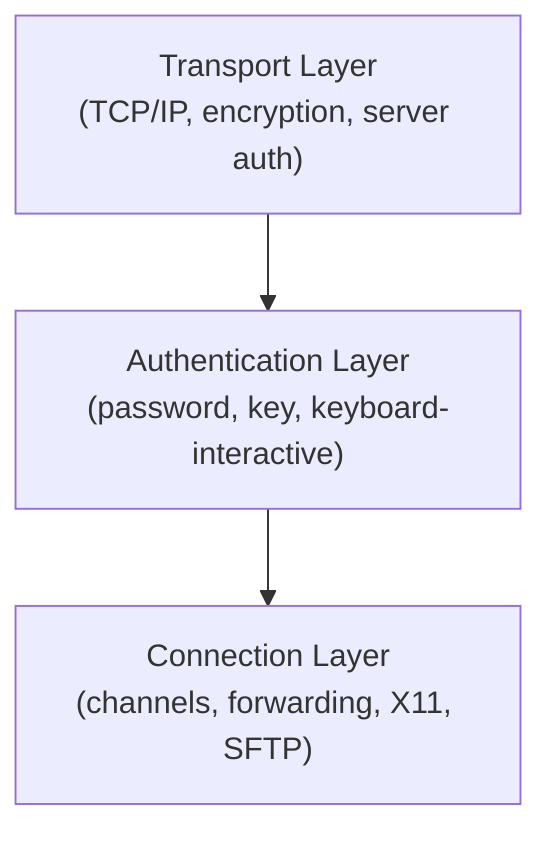

## SSH Protocol Overview

SSH (Secure Shell) protocol version 2 provides encrypted remote login and command execution. The
protocol operates in three layers:



### Transport Layer

- TCP connection (default port 22)
- Server presents host key for verification
- Key exchange (curve25519-sha256, ecdh-sha2-nistp256, diffie-hellman-group14-sha256)
- Symmetric encryption (chacha20-poly1305, aes256-gcm)
- MAC / AEAD for integrity
- Session keys derived from shared secret

### Authentication Layer

- Password authentication
- Public key authentication (default preferred method)
- Keyboard-interactive (PAM, 2FA, OTP)
- GSSAPI (Kerberos)
- Host-based authentication

### Connection Layer

- Multiplexed channels over a single TCP connection
- Session channels (shell, exec, subsystem)
- Port forwarding channels
- X11 forwarding
- Agent forwarding
- SFTP subsystem

## Client Configuration

### ~/.ssh/config

The SSH client configuration file supports per-host settings, pattern matching, and conditional
blocks.

```text
# ~/.ssh/config

# Global defaults
Host *
    ServerAliveInterval 60
    ServerAliveCountMax 3
    AddKeysToAgent yes
    IdentityFile ~/.ssh/id_ed25519
    IdentitiesOnly yes
    StrictHostKeyChecking accept-new
    UserKnownHostsFile ~/.ssh/known_hosts

# Jump host (bastion)
Host bastion
    HostName bastion.example.com
    User deploy
    Port 2222
    IdentityFile ~/.ssh/id_bastion

# Internal servers via jump host
Host 10.0.0.*
    ProxyJump bastion
    User admin
    IdentityFile ~/.ssh/id_internal

# Specific server
Host web-prod
    HostName 10.0.0.10
    User www
    ProxyJump bastion
    ForwardAgent yes

# GitHub
Host github.com
    HostName github.com
    User git
    IdentityFile ~/.ssh/id_github
    IdentitiesOnly yes
```

### Match Blocks (Conditional Configuration)

```text
# ~/.ssh/config

Host *
    User admin

# Override for specific hosts
Match host 10.0.0.* exec "ping -c 1 -W 1 %h"
    ProxyJump bastion

# Match on original host (useful with ProxyJump)
Match host bastion.example.com
    ForwardAgent yes

# Match on local user
Match host * user root
    PermitTTY no
    ForwardAgent no

# Match on destination port
Match host * port 2222
    User jumpuser
```

### Common Client Options

```text
HostName              # actual hostname (not the alias)
User                  # login username
Port                  # SSH port (default 22)
IdentityFile          # path to private key file
IdentitiesOnly        # only use explicitly specified keys (default no)
ProxyJump             # jump host (simpler than ProxyCommand)
ProxyCommand          # custom command for connection (more flexible)
ForwardAgent          # forward SSH agent (yes/no/ask)
ForwardX11            # forward X11 (yes/no/ask)
LocalForward          # local port forwarding (-L)
RemoteForward         # remote port forwarding (-R)
DynamicForward        # SOCKS proxy (-D)
ServerAliveInterval   # send keepalive every N seconds
ServerAliveCountMax   # max missed keepalives before disconnect
TCPKeepAlive          # enable TCP keepalive (default yes)
Compression           # enable compression (yes/no)
ControlMaster         # connection multiplexing (yes/no/ask/auto)
ControlPath           # socket path for multiplexed connections
ControlPersist        # how long to keep master connection open
StrictHostKeyChecking # (yes/no/accept-new/ask)
UserKnownHostsFile    # path to known_hosts file
LogLevel              # (QUIET/FATAL/ERROR/INFO/VERBOSE/DEBUG)
NumberOfPasswordPrompts # max password prompts (default 3)
```

### Connection Multiplexing

```text
# Enable connection sharing in ~/.ssh/config
Host *
    ControlMaster auto
    ControlPath ~/.ssh/sockets/%r@%h-%p
    ControlPersist 600

# Create socket directory
mkdir -p ~/.ssh/sockets

# First connection opens a master socket
ssh server.example.com

# Subsequent connections reuse the existing socket (instant!)
ssh server.example.com    # reuses existing connection
scp file server.example.com:/tmp/   # also reuses
```

## Key Management

### ssh-keygen

```bash
# Generate Ed25519 key (recommended — small, fast, secure)
ssh-keygen -t ed25519 -C "user@workstation"
ssh-keygen -t ed25519 -a 100 -C "user@workstation"   # 100 KDF rounds

# Generate RSA key (4096 bits, for legacy compatibility)
ssh-keygen -t rsa -b 4096 -C "user@workstation"

# Generate ECDSA key
ssh-keygen -t ecdsa -b 521 -C "user@workstation"

# Specify output file
ssh-keygen -t ed25519 -f ~/.ssh/id_github -C "github-key"

# Generate key with no passphrase (for automation — use with caution)
ssh-keygen -t ed25519 -f ~/.ssh/id_deploy -N ""

# Change passphrase on existing key
ssh-keygen -p -f ~/.ssh/id_ed25519

# Generate public key from private key
ssh-keygen -y -f ~/.ssh/id_ed25519 > ~/.ssh/id_ed25519.pub

# Generate fingerprint
ssh-keygen -l -f ~/.ssh/id_ed25519.pub

# Generate visual fingerprint (randomart)
ssh-keygen -lv -f ~/.ssh/id_ed25519.pub
```

### Key Formats

```text
OpenSSH (default):
  id_ed25519        — private key (OpenSSH format)
  id_ed25519.pub    — public key (single line)

PEM (legacy):
  id_rsa            — "BEGIN RSA PRIVATE KEY" (PEM format)
  id_rsa.pub        — public key

PKCS8:
  Convert with: ssh-keygen -p -f id_rsa -m PEM   # to PEM
  Convert with: ssh-keygen -p -f id_rsa -m RFC4716  # to RFC4716

Ed25519 keys:
  - Best security per bit
  - Fastest key operations (sign/verify)
  - Smallest key size (64 bytes)
  - Recommended for all new keys

RSA keys:
  - Minimum 2048 bits (2048 is weak, 3072 is acceptable, 4096 is standard)
  - Slower than Ed25519
  - Widely compatible with legacy systems
```

### authorized_keys

```text
# ~/.ssh/authorized_keys — one public key per line
# Format: [options] key-type base64-key [comment]

# Restrict key to specific command
command="/usr/bin/backup.sh",no-port-forwarding,no-X11-forwarding,no-pty ssh-ed25519 AAAA... backup@server

# Restrict by source IP
from="10.0.0.0/24" ssh-ed25519 AAAA... admin@office

# Disable specific forwarding
no-port-forwarding,no-X11-forwarding,no-agent-forwarding ssh-ed25519 AAAA... restricted

# Combined restrictions
command="/usr/local/bin/monitor",from="10.0.0.50",no-pty,no-port-forwarding ssh-ed25519 AAAA... monitor

# Restrict to specific environment variables
environment="PATH=/usr/bin:/bin" ssh-ed25519 AAAA... env-user
```

```bash
# Deploy public key to remote server
ssh-copy-id user@server.example.com

# Manual deployment
cat ~/.ssh/id_ed25519.pub | ssh user@server "mkdir -p ~/.ssh && chmod 700 ~/.ssh && cat >> ~/.ssh/authorized_keys && chmod 600 ~/.ssh/authorized_keys"

# View authorized_keys with restrictions
cat ~/.ssh/authorized_keys
```

### Key Rotation

```bash
# Generate new key
ssh-keygen -t ed25519 -f ~/.ssh/id_ed25519_new -C "user@workstation"

# Deploy new key
ssh-copy-id -i ~/.ssh/id_ed25519_new.pub user@server

# Test new key
ssh -i ~/.ssh/id_ed25519_new user@server

# Remove old key from authorized_keys on server
ssh user@server "sed -i '/OLD_KEY_COMMENT/d' ~/.ssh/authorized_keys"

# Update local config
sed -i 's/id_ed25519/id_ed25519_new/' ~/.ssh/config

# Remove old key
rm ~/.ssh/id_ed25519 ~/.ssh/id_ed25519.pub
```

## Server Configuration

### sshd_config

```ini
# /etc/ssh/sshd_config

# Network
Port 22
AddressFamily inet           # inet (IPv4 only), inet6, any
ListenAddress 0.0.0.0
ListenAddress ::

# Host keys
HostKey /etc/ssh/ssh_host_ed25519_key
HostKey /etc/ssh/ssh_host_rsa_key

# Key exchange algorithms (drop weak ones)
KexAlgorithms curve25519-sha256,curve25519-sha256@libssh.org,ecdh-sha2-nistp521,ecdh-sha2-nistp384,ecdh-sha2-nistp256,diffie-hellman-group14-sha256

# Ciphers
Ciphers chacha20-poly1305@openssh.com,aes256-gcm@openssh.com,aes128-gcm@openssh.com

# MACs
MACs hmac-sha2-512-etm@openssh.com,hmac-sha2-256-etm@openssh.com

# Authentication
PermitRootLogin prohibit-password    # yes/no/prohibit-password/forced-commands-only
PubkeyAuthentication yes
PasswordAuthentication no
PermitEmptyPasswords no
ChallengeResponseAuthentication no
KbdInteractiveAuthentication no
UsePAM no

# Authorized keys location
AuthorizedKeysFile .ssh/authorized_keys
AuthorizedPrincipalsFile none

# Access control
AllowUsers deploy admin@10.0.0.0/24
# AllowGroups ssh-users
# DenyUsers baduser
# DenyGroups nogroup

# Session
MaxAuthTries 3
MaxSessions 10
LoginGraceTime 30
ClientAliveInterval 300
ClientAliveCountMax 2
X11Forwarding no
AllowTcpForwarding yes
PermitTunnel no
PermitTTY yes

# Security
StrictModes yes                 # check file permissions on key files
PermitRootLogin prohibit-password
AllowAgentForwarding no
AllowTcpForwarding no          # disable if not needed

# Logging
SyslogFacility AUTH
LogLevel VERBOSE

# Banner
Banner /etc/ssh/banner

# Subsystems
Subsystem sftp /usr/lib/openssh/sftp-server
# or for chrooted SFTP:
# Subsystem sftp internal-sftp
```

### Host Key Management

```bash
# Generate host keys
ssh-keygen -t ed25519 -f /etc/ssh/ssh_host_ed25519_key
ssh-keygen -t rsa -b 4096 -f /etc/ssh/ssh_host_rsa_key

# Show host key fingerprints
ssh-keygen -lf /etc/ssh/ssh_host_ed25519_key.pub

# Verify server fingerprint from client
ssh-keyscan server.example.com | ssh-keygen -lf -
```

### Restart and Test

```bash
# Validate configuration before restarting
sshd -t
sshd -T    # show effective configuration

# Restart
systemctl restart sshd

# Check status
systemctl status sshd
systemctl is-active sshd
```

## SSH Agent

### ssh-agent

```bash
# Start the agent
eval $(ssh-agent)
ssh-agent bash    # start a shell with agent

# Add keys to the agent
ssh-add                     # add default keys
ssh-add ~/.ssh/id_ed25519   # add specific key
ssh-add -l                  # list keys in agent
ssh-add -L                  # list public keys
ssh-add -d ~/.ssh/id_ed25519  # remove specific key
ssh-add -D                  # remove all keys

# Add key with limited lifetime
ssh-add -t 3600 ~/.ssh/id_ed25519   # 1 hour
ssh-add -t 8h ~/.ssh/id_ed25519     # 8 hours

# Lock agent
ssh-add -x     # lock with password prompt
```

### Agent Forwarding

```bash
# Enable forwarding per-host in ~/.ssh/config
Host server
    ForwardAgent yes

# Or via command line
ssh -A user@server

# Or via ProxyJump (forward agent through jump host)
Host internal
    ProxyJump bastion
    ForwardAgent yes
```

:::danger

Agent forwarding allows the remote server to use your local SSH agent to authenticate to other
servers. If the remote server is compromised, an attacker can use your forwarded agent to
authenticate to any server your keys have access to. Only enable ForwardAgent when necessary, and
prefer SSH certificates or ProxyJump for multi-hop access.

:::

## Tunneling

### Local Port Forwarding (-L)

```bash
# Forward local port to remote host:port
ssh -L 8080:localhost:80 user@server.example.com
# Access server's port 80 via localhost:8080

# Forward local port to a third host (via the SSH server)
ssh -L 5432:db.internal:5432 user@bastion.example.com
# Access db.internal:5432 via localhost:5432

# Forward local port to a third host (from the server's perspective)
ssh -L 3306:10.0.0.50:3306 user@server
# Access 10.0.0.50:3306 (as seen from server) via localhost:3306

# Bind to specific local address
ssh -L 127.0.0.1:8080:localhost:80 user@server

# Dynamic allocation of local port
ssh -L :80:localhost:80 user@server   # system picks local port
```

### Remote Port Forwarding (-R)

```bash
# Forward remote port to local host:port
ssh -R 8080:localhost:3000 user@server.example.com
# Access your local port 3000 via server:8080

# Bind to specific remote address (requires GatewayPorts)
ssh -R 0.0.0.0:8080:localhost:3000 user@server
# GatewayPorts must be enabled in sshd_config:
# GatewayPorts yes   or   GatewayPorts clientspecified

# Remote port forwarding from ~/.ssh/config
Host tunnel
    HostName server.example.com
    User deploy
    RemoteForward 8080 localhost:3000
```

### Dynamic Port Forwarding (SOCKS Proxy) (-D)

```bash
# Create SOCKS5 proxy
ssh -D 1080 user@server.example.com
# Configure applications to use SOCKS5 proxy at localhost:1080

# Use with curl
curl --socks5 localhost:1080 http://internal.example.com

# Use with specific applications
export http_proxy=socks5://localhost:1080
export https_proxy=socks5://localhost:1080

# Bind to specific address
ssh -D 127.0.0.1:1080 user@server
```

## Jump Hosts

### ProxyJump (recommended)

```bash
# Single jump host
ssh -J bastion user@internal-server

# Multiple jump hosts
ssh -J bastion1,bastion2 user@internal-server

# In ~/.ssh/config
Host internal-server
    HostName 10.0.0.10
    ProxyJump bastion

Host bastion
    HostName bastion.example.com
    User jump
```

### ProxyCommand

```bash
# Using netcat
ssh -o ProxyCommand="nc -X 5 -x bastion:1080 %h %p" user@internal

# Using ssh directly (nested)
ssh -o ProxyCommand="ssh -W %h:%p bastion" user@internal

# Using socat
ssh -o ProxyCommand="socat - PROXY:bastion:%h:%p,proxyport=3128" user@internal
```

## SCP and SFTP

### scp

```bash
# Copy file to remote
scp file.txt user@server:/remote/path/

# Copy file from remote
scp user@server:/remote/path/file.txt ./

# Copy directory
scp -r ./local_dir user@server:/remote/path/

# Preserve attributes
scp -rp ./local_dir user@server:/remote/path/

# Through jump host
scp -o ProxyJump=bastion file.txt user@internal:/path/

# Specify port
scp -P 2222 file.txt user@server:/path/
```

### sftp

```bash
# Interactive SFTP session
sftp user@server

# Batch mode
sftp -b batch_commands.txt user@server

# Download file
sftp user@server:/remote/file.txt /local/path/

# Upload file
sftp /local/file.txt user@server:/remote/path/
```

### Chrooted SFTP

```ini
# /etc/ssh/sshd_config
Match Group sftpusers
    ChrootDirectory /var/sftp/%u
    ForceCommand internal-sftp
    AllowTcpForwarding no
    X11Forwarding no
    PermitTunnel no
```

```bash
# Setup
sudo groupadd sftpusers
sudo useradd -m -G sftpusers -s /usr/sbin/nologin uploaduser
sudo passwd uploaduser
sudo mkdir -p /var/sftp/uploaduser/files
sudo chown root:root /var/sftp/uploaduser
sudo chmod 755 /var/sftp/uploaduser
sudo chown uploaduser:sftpusers /var/sftp/uploaduser/files
sudo chmod 755 /var/sftp/uploaduser/files
```

## SSH Certificates

SSH certificates provide scalable key management without deploying individual public keys.

### Certificate Authority Setup

```bash
# Generate CA key
ssh-keygen -t ed25519 -f /etc/ssh/ca_key -C "SSH CA"

# Configure server to trust the CA
# /etc/ssh/sshd_config
TrustedUserCAKeys /etc/ssh/ca_key.pub

# Sign a user key
ssh-keygen -s /etc/ssh/ca_key \
    -I "user@workstation" \
    -n admin,deploy \
    -V +52w \
    ~/.ssh/id_ed25519.pub

# -I  — certificate identity (logged)
# -n  — valid principals (usernames this cert can authenticate as)
# -V  — validity period (+52w = 52 weeks)

# Deploy the certificate (id_ed25519-cert.pub) alongside the private key
scp id_ed25519-cert.pub user@server:~/.ssh/
```

### Host Certificates

```bash
# Sign a host key
ssh-keygen -s /etc/ssh/ca_key \
    -I "server.example.com" \
    -h \
    -n server.example.com \
    -V +52w \
    /etc/ssh/ssh_host_ed25519_key.pub

# Configure clients to trust the CA
# ~/.ssh/config
Host *.example.com
    @cert-authority *.example.com ssh-ed25519 AAAA...CA_PUBLIC_KEY
# Or in ~/.ssh/known_hosts:
# @cert-authority *.example.com ssh-ed25519 AAAA...
```

## Security Hardening Checklist

```ini
# /etc/ssh/sshd_config — hardened configuration

# Disable password authentication
PasswordAuthentication no
PubkeyAuthentication yes
KbdInteractiveAuthentication no
ChallengeResponseAuthentication no

# Disable root login
PermitRootLogin no

# Restrict users/groups
AllowUsers deploy admin
AllowGroups ssh-users

# Limit authentication attempts
MaxAuthTries 3
MaxSessions 5
LoginGraceTime 15

# Disable unnecessary features
X11Forwarding no
AllowAgentForwarding no
AllowTcpForwarding no
PermitTunnel no
PermitUserEnvironment no
PermitUserRC no

# Harden crypto
KexAlgorithms curve25519-sha256,curve25519-sha256@libssh.org,ecdh-sha2-nistp521,ecdh-sha2-nistp384,ecdh-sha2-nistp256
Ciphers chacha20-poly1305@openssh.com,aes256-gcm@openssh.com
MACs hmac-sha2-512-etm@openssh.com,hmac-sha2-256-etm@openssh.com

# Timeouts
ClientAliveInterval 300
ClientAliveCountMax 2

# Logging
LogLevel VERBOSE
SyslogFacility AUTH

# Banner
Banner /etc/ssh/banner

# SFTP only (no shell access)
# Match Group sftp-only
#     ForceCommand internal-sftp
#     ChrootDirectory /var/sftp/%u
```

### fail2ban Integration

```ini
# /etc/fail2ban/jail.local
[sshd]
enabled = true
port = ssh
filter = sshd
logpath = /var/log/auth.log
# or for systemd:
# backend = systemd
# journalmatch = _SYSTEMD_UNIT=sshd.service
maxretry = 3
findtime = 600
bantime = 3600
banaction = iptables-multiport
```

```bash
# Start fail2ban
systemctl enable --now fail2ban

# Check banned IPs
fail2ban-client status sshd

# Unban an IP
fail2ban-client set sshd unbanip 10.0.0.50
```

## Troubleshooting

```bash
# Verbose connection (client-side)
ssh -vvv user@server.example.com

# Specific debug categories
ssh -vvv -o "LogLevel=DEBUG3" user@server.example.com

# Check server-side logs
journalctl -u sshd -f
grep sshd /var/log/auth.log

# Test connectivity
nc -zv server.example.com 22
telnet server.example.com 22

# Check if key is accepted
ssh -v user@server 2>&1 | grep "Offering public key"
ssh -v user@server 2>&1 | grep "Authentication succeeded"

# Verify known_hosts
ssh-keygen -l -f ~/.ssh/known_hosts
ssh-keygen -R server.example.com    # remove old entry

# Check server configuration
sshd -T    # effective configuration
sshd -t    # validate config

# Debug mode (run sshd in foreground)
/usr/sbin/sshd -d -p 2222
# Then connect: ssh -p 2222 user@localhost
```

## Common Pitfalls

### Pitfall: Wrong Permissions on SSH Files

```bash
# SSH is very strict about file permissions
# If permissions are too open, keys are silently ignored

chmod 700 ~/.ssh
chmod 600 ~/.ssh/id_ed25519
chmod 644 ~/.ssh/id_ed25519.pub
chmod 600 ~/.ssh/authorized_keys
chmod 644 ~/.ssh/known_hosts
chmod 600 ~/.ssh/config

# Common permission errors (check with -v)
ssh -v user@server 2>&1 | grep "Permissions"
# "Authentication refused: bad ownership or modes for file"
```

### Pitfall: Agent Forwarding Security

```bash
# NEVER use ForwardAgent yes with untrusted servers
# An attacker with root on the forwarded server can:
# 1. Use your agent to authenticate to other servers
# 2. Extract your private keys (if the agent allows it)

# Instead, use ProxyJump for multi-hop
Host internal
    ProxyJump bastion    # no ForwardAgent needed

# Or use SSH certificates for delegation
# Instead of forwarding the agent, issue a short-lived cert
```

### Pitfall: Stale Known_Hosts Entries

```bash
# After reinstalling a server, the host key changes
# SSH refuses to connect with: WARNING: REMOTE HOST IDENTIFICATION HAS CHANGED!

# Fix: remove the old entry
ssh-keygen -R server.example.com

# Fix: verify the new fingerprint and add it manually
ssh-keyscan server.example.com >> ~/.ssh/known_hosts

# Prevent this by using SSH certificates (host certs don't have this problem)
```

### Pitfall: SSH Config Match Order

```bash
# The FIRST matching Host or Match block wins
# More specific patterns should come FIRST

# WRONG — broad pattern matches first
Host *
    IdentityFile ~/.ssh/id_default

Host github.com
    IdentityFile ~/.ssh/id_github   # NEVER reached because * matched first

# CORRECT — specific patterns first
Host github.com
    IdentityFile ~/.ssh/id_github

Host *
    IdentityFile ~/.ssh/id_default
```

### Pitfall: Connection Drops Over Idle

```bash
# SSH connections drop when idle due to NAT timeout or firewall rules

# Fix: enable keepalive on the client
Host *
    ServerAliveInterval 60
    ServerAliveCountMax 3

# Fix: enable TCP keepalive
Host *
    TCPKeepAlive yes

# Fix: enable on the server
# /etc/ssh/sshd_config
ClientAliveInterval 300
ClientAliveCountMax 2
```

### Pitfall: MaxStartups Throttling

```bash
# If many SSH connections are attempted simultaneously,
# sshd throttles new connections (default: 10:30:100)
# This can cause legitimate connections to be dropped

# Check server logs
journalctl -u sshd | grep "refused connect"

# Adjust in sshd_config
MaxStartups 20:30:60
# Start refusing at 20 unauthenticated connections,
# Drop 30% probability at 20-60, refuse all above 60
```
