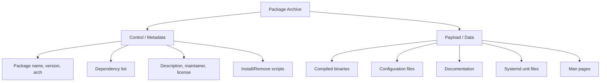
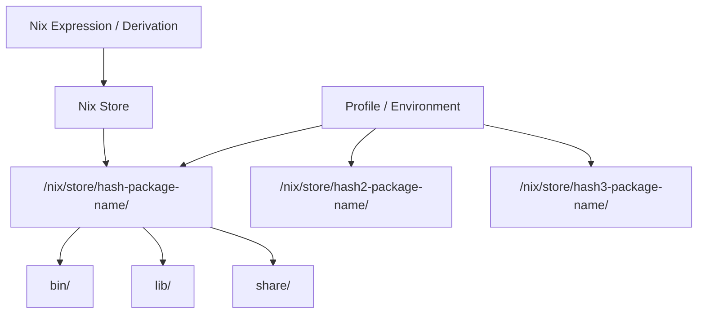
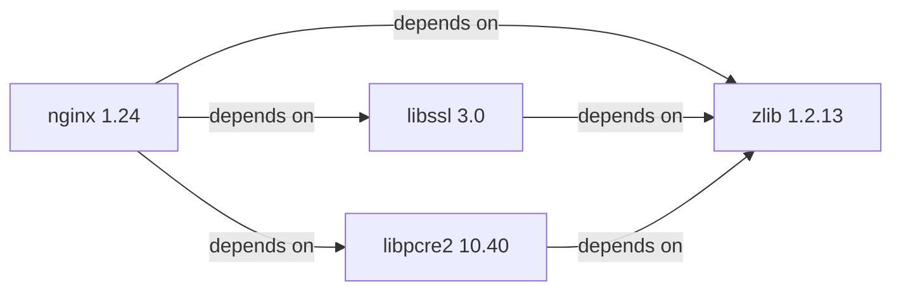

## Package Formats

A Linux package is an archive containing compiled software, configuration files, metadata (version,
description, dependencies), and install/uninstall scripts. Two dominant package formats exist:

| Format  | Specification     | Distributions                            | Extension |
| ------- | ----------------- | ---------------------------------------- | --------- |
| **DEB** | Debian Policy     | Debian, Ubuntu, Mint, Proxmox            | `.deb`    |
| **RPM** | RPM Specification | RHEL, Fedora, CentOS, SUSE, OpenMandriva | `.rpm`    |

### Package Anatomy

Both formats share similar internal structure:



```bash
# Inspect a DEB package without installing
dpkg-deb -I package.deb          # control info
dpkg-deb -c package.deb          # list files

# Inspect an RPM package without installing
rpm -qip package.rpm             # info
rpm -qlp package.rpm             # list files
rpm -q --scripts package.rpm     # install/remove scripts
```

## APT (Debian/Ubuntu)

APT (Advanced Package Tool) is the high-level package manager for `.deb` distributions. It handles
dependency resolution, repository management, and package installation.

### APT Commands

```bash
# Update package index (always run before installing)
apt update

# Upgrade all packages
apt upgrade                    # upgrade installed packages
apt full-upgrade               # handle dependency changes (recommended)
apt dist-upgrade               # alias for full-upgrade

# Install packages
apt install nginx
apt install nginx=1.24.0-1     # specific version
apt install --no-install-recommends nginx  # skip recommended packages

# Remove packages
apt remove nginx               # remove package, keep config
apt purge nginx                # remove package and config files
apt autoremove                 # remove orphaned dependencies

# Search
apt search webserver
apt list --installed           # list installed packages
apt list --upgradable          # list upgradable packages

# Show package information
apt show nginx

# Download without installing
apt download nginx
apt source nginx               # download source package

# Fix broken dependencies
apt --fix-broken install

# Hold/unhold packages (prevent upgrades)
apt-mark hold package_name
apt-mark unhold package_name
apt-mark showhold

# Check why a package is installed
apt rdepends package_name      # reverse dependencies
aptitude why package_name     # reason for installation (aptitude)
```

### APT Sources Configuration

```bash
# /etc/apt/sources.list (traditional format)
deb http://deb.debian.org/debian bookworm main contrib non-free non-free-firmware
deb http://deb.debian.org/debian bookworm-updates main contrib non-free non-free-firmware
deb http://security.debian.org/debian-security bookworm-security main contrib non-free non-free-firmware

# /etc/apt/sources.list.d/ (modern one-per-file format)
# /etc/apt/sources.list.d/docker.list
deb [arch=amd64 signed-by=/etc/apt/keyrings/docker.asc] https://download.docker.com/linux/debian bookworm stable
```

### APT Pinning

APT pinning allows you to control which version of a package is installed when multiple sources
provide different versions. Pins have a priority (0-1001):

| Priority Range | Effect                                            |
| -------------- | ------------------------------------------------- |
| 0              | Never install (used for blocking)                 |
| 1-99           | Install only if no higher-priority version exists |
| 100-499        | Install only if no installed version exists       |
| 500            | Default priority (any version from this source)   |
| 990            | Prefer over default priority                      |
| 1001           | Install even if downgrading                       |

```bash
# /etc/apt/preferences.d/docker
Package: *
Pin: origin download.docker.com
Pin-Priority: 900

# Pin specific package to specific version
Package: nginx
Pin: version 1.24.*
Pin-Priority: 1001

# Pin a package to prevent installation
Package: systemd-resolved
Pin: release *
Pin-Priority: -1
```

### dpkg — Low-Level Package Manager

```bash
# Install a .deb file
dpkg -i package.deb

# Remove a package
dpkg -r package_name

# List installed packages
dpkg -l
dpkg -l | grep nginx

# List files installed by a package
dpkg -L package_name

# Find which package owns a file
dpkg -S /usr/bin/nginx

# Configure unpacked packages
dpkg --configure -a     # configure all pending packages

# Package status
dpkg -s package_name    # show status and details
dpkg-query -W -f='${Package} ${Version}\n'    # custom format
```

## DNF (RHEL/Fedora)

DNF (Dandified YUM) is the package manager for RPM-based distributions, succeeding YUM with better
dependency resolution, faster performance, and a plugin architecture.

### DNF Commands

```bash
# Update package index
dnf check-update

# Upgrade all packages
dnf upgrade

# Install packages
dnf install nginx
dnf install nginx-1.24.0    # specific version

# Remove packages
dnf remove nginx
dnf autoremove              # remove orphaned dependencies

# Search
dnf search webserver
dnf list installed
dnf list available
dnf list updates

# Package information
dnf info nginx

# Download
dnf download nginx

# History (track transactions)
dnf history list
dnf history undo 15          # undo transaction 15
dnf history redo 15          # redo transaction 15

# Group management
dnf group list
dnf group install "Development Tools"
dnf group info "Development Tools"

# Module streams (RHEL 8+/Fedora)
dnf module list
dnf module enable nodejs:18
dnf module install nodejs:18/default

# Lock packages (prevent upgrades)
dnf versionlock add nginx
dnf versionlock list
dnf versionlock delete nginx

# Clean cache
dnf clean all

# Repository management
dnf repolist
dnf repolist enabled
dnf repolist all
```

### DNF Repository Configuration

```ini
# /etc/yum.repos.d/nginx.repo
[nginx-stable]
name=nginx stable repo
baseurl=http://nginx.org/packages/rhel/9/x86_64/
enabled=1
gpgcheck=1
gpgkey=https://nginx.org/keys/nginx_signing.key
module_hotfixes=true
```

### rpm — Low-Level Package Manager

```bash
# Install an RPM
rpm -ivh package.rpm

# Upgrade
rpm -Uvh package.rpm

# Query installed packages
rpm -qa
rpm -qa | grep nginx

# Query package info
rpm -qi nginx

# List files in installed package
rpm -ql nginx

# List files in RPM file
rpm -qlp package.rpm

# Find which package owns a file
rpm -qf /usr/bin/nginx

# Verify package (check file checksums, permissions)
rpm -V nginx
rpm -Va               # verify all packages

# Check package dependencies
rpm -qR nginx          # requires (dependencies)
rpm -q --whatprovides libssl.so.3
```

### RPM Verification

```bash
# Verify a specific package
rpm -V nginx

# Output format: each character indicates a test result
# S = file size differs
# 5 = MD5 checksum differs
# T = mtime differs
# D = device major/minor differs
# L = symlink path differs
# U = user ownership differs
# G = group ownership differs
# M = mode (permissions) differs
# ? = unreadable file
# . = test passed

# Verify all installed packages
rpm -Va | grep '^..5'   # find all files with changed checksums
```

## pacman (Arch Linux)

pacman is the package manager for Arch Linux and its derivatives. It is simple, fast, and follows a
rolling release model.

### pacman Commands

```bash
# Update package database and upgrade all packages
pacman -Syu              # sync database, then upgrade
pacman -Sy               # sync database only
pacman -Su               # upgrade only (use after -Sy)

# Install packages
pacman -S nginx
pacman -S --noconfirm nginx    # skip confirmation

# Remove packages
pacman -R nginx           # remove, keep dependencies
pacman -Rs nginx          # remove and dependencies not needed by others
pacman -Rns nginx         # remove, dependencies, and config files

# Search
pacman -Ss nginx          # search remote repositories
pacman -Qs nginx          # search installed packages
pacman -Qi nginx          # package info (installed)
pacman -Si nginx          # package info (remote)

# List files
pacman -Ql nginx          # files from installed package
pacman -Qo /usr/bin/nginx  # which package owns this file

# Download
pacman -Sw nginx          # download without installing

# Clear cache
pacman -Sc                # keep latest version
pacman -Scc               # remove all cached packages

# Dependency tree
pactree nginx             # dependency tree
pactree -r nginx          # reverse dependency tree

# Database
pacman -Q                 # list installed packages
pacman -Qm                # list foreign/AUR packages
pacman -Qe                # list explicitly installed
pacman -Qdt               # list orphaned packages

# Remove orphans
pacman -Rns $(pacman -Qdtq)
```

### AUR — Arch User Repository

The AUR is a community-maintained repository of PKGBUILD scripts. It is not a binary repository —
packages are built from source on the local machine.

```bash
# Using an AUR helper (e.g., paru)
paru -S package_name      # install from AUR
paru -Syu                 # update including AUR packages
paru -Ss search_term      # search AUR

# Manual AUR installation
git clone https://aur.archlinux.org/packages/example
cd package
makepkg -si               # build and install
```

:::warning

AUR packages are not vetted by Arch developers. Always review PKGBUILD scripts before installing,
especially packages that modify system files or run install hooks. Use a helper that supports
PKGBUILD inspection.

:::

## Nix — Functional Package Management

Nix is a fundamentally different approach to package management. Instead of a global package
database, Nix stores each package version in a unique path in the Nix store (`/nix/store/`),
identified by a content hash. This means multiple versions of the same package can coexist without
conflict, and package installations are reproducible.

### Core Concepts



| Concept        | Description                                                  |
| -------------- | ------------------------------------------------------------ |
| **Derivation** | A build recipe (input sources, build commands, dependencies) |
| **Store Path** | `/nix/store/hash-name/` — content-addressable storage        |
| **Profile**    | A set of packages linked together in a user environment      |
| **Channel**    | A named set of Nix expressions (like a repository)           |
| **Shell**      | An isolated environment with specific packages               |

### Nix Commands

```bash
# Search packages
nix search nginx

# Install a package (imperative)
nix profile install nixpkgs#nginx

# Run a package without installing
nix run nixpkgs#nginx

# Shell with specific packages
nix shell nixpkgs#python3 nixpkgs#nodejs

# Development environment
nix develop github:user/repo    # enter dev shell from flake

# Build a derivation
nix-build default.nix

# Garbage collection
nix store gc --optimize         # remove unreferenced store paths
nix-collect-garbage -d          # delete old generations

# Reproduce a shell
nix-shell -p python3 nodejs    # enter shell with packages

# Query
nix-store -q --requisites /nix/store/hash-package    # dependencies
nix-store -q --tree /nix/store/hash-package          # dependency tree
```

### Nix Flakes

Flakes are the modern Nix packaging standard, providing reproducible builds with lock files:

```nix
# flake.nix
{
  description = "My application";

  inputs = {
    nixpkgs.url = "github:NixOS/nixpkgs/nixos-24.05";
    flake-utils.url = "github:numtide/flake-utils";
  };

  outputs = { self, nixpkgs, flake-utils }:
    flake-utils.lib.eachDefaultSystem (system:
      let
        pkgs = nixpkgs.legacyPackages.${system};
      in
      {
        devShells.default = pkgs.mkShell {
          buildInputs = with pkgs; [
            python3
            nodejs
            gcc
            cmake
          ];
        };
        packages.default = pkgs.stdenv.mkDerivation {
          pname = "myapp";
          version = "1.0.0";
          src = ./.;
          buildInputs = with pkgs; [ python3 ];
          buildPhase = "python3 setup.py build";
          installPhase = "python3 setup.py install --prefix=$out";
        };
      }
    );
}
```

### Nix Advantages

- **Reproducibility**: Same inputs always produce the same output (content-addressed store)
- **Rollback**: Every profile generation is kept; roll back to any previous state
- **No conflicts**: Multiple versions of the same package coexist in separate store paths
- **Declarative**: System configuration can be fully declared in Nix expressions
- **No root required**: Users can install packages without root privileges

### Nix Disadvantages

- **Disk usage**: Each package version is stored separately (mitigated by `nix store gc`)
- **Learning curve**: Nix language is a custom functional language
- **Store paths**: `/nix/store/hash-name` paths are not human-friendly
- **Binary cache**: First-time builds compile from source unless prebuilt binaries are cached
- **Ecosystem maturity**: Some packages are less maintained than in APT/DNF

## Sandboxed Packages (Flatpak/Snap)

### Flatpak

```bash
# Install Flatpak and add Flathub
apt install flatpak
flatpak remote-add --if-not-exists flathub https://flathub.org/repo/flathub.flatpakrepo

# Install an application
flatpak install flathub org.mozilla.Firefox

# Run
flatpak run org.mozilla.Firefox

# List installed
flatpak list

# Update
flatpak update

# Sandbox info
flatpak info --show-permissions org.mozilla.Firefox

# Override permissions (grant access to filesystem)
flatpak override --user --filesystem=/path org.mozilla.Firefox
```

### Snap

```bash
# Install snapd
apt install snapd

# Install a snap
snap install firefox

# Classic confinement (full system access — less secure)
snap install code --classic

# List installed
snap list

# Update
snap refresh

# Remove
snap remove firefox

# Snap info
snap info firefox
```

### Flatpak vs Snap

| Aspect                   | Flatpak                            | Snap                           |
| ------------------------ | ---------------------------------- | ------------------------------ |
| **Backend**              | OSTree (content-addressable)       | SquashFS (custom mount)        |
| **Default store**        | Flathub (community)                | Snap Store (Canonical)         |
| **Sandbox**              | Bubblewrap (portals for access)    | AppArmor, seccomp (interfaces) |
| **Updates**              | User-controlled, no forced updates | Automatic, vendor-controlled   |
| **Distribution support** | Most distributions                 | Primarily Ubuntu/Debian        |
| **Disk usage**           | Shares runtimes between apps       | Each snap includes its runtime |
| **Boot impact**          | None                               | Snap daemon starts at boot     |

## Dependency Resolution

### How Dependency Resolution Works

Package managers must solve a **dependency graph** — finding a set of package versions that satisfy
all dependency constraints simultaneously. This is a SAT problem (Boolean satisfiability), which is
NP-complete in the worst case.



### Resolution Algorithms

| Manager     | Algorithm                       | Characteristics                                   |
| ----------- | ------------------------------- | ------------------------------------------------- |
| **APT**     | C++ resolver                    | Greedy, deterministic, handles conflicts          |
| **DNF**     | libsolv (SAT solver)            | More robust than YUM, handles complex constraints |
| **pacman**  | Simple dependency following     | No SAT solver, less robust for complex conflicts  |
| **Nix**     | Built-in (functional)           | No global conflicts by design                     |
| **Portage** | C++ resolver with slot handling | Gentoo's package manager, handles slots           |

### Common Dependency Issues

```bash
# APT: broken dependencies
apt --fix-broken install

# DNF: broken dependencies
dnf distro-sync

# pacman: key issues
pacman-key --init
pacman-key --populate archlinux

# Find dependency conflicts
apt-cache depends package_name
apt-cache rdepends package_name

# DNF: check what provides a capability
dnf provides libssl.so.3
```

## Building Packages

### Building a Debian Package

```bash
# Install build dependencies
apt build-dep package_name
apt install devscripts debhelper

# Create source package
apt source package_name

# Build from source
dpkg-buildpackage -us -uc -b    # unsigned binary build

# Or using pbuilder for clean builds
sudo pbuilder build package.dsc

# Result: ../package_version_arch.deb
```

### Building an RPM Package

```bash
# Install build tools
dnf install rpm-build rpmlint

# Create RPM build directory structure
mkdir -p ~/rpmbuild/{BUILD,RPMS,SOURCES,SPECS,SRPMS}
echo '%_topdir %(echo $HOME)/rpmbuild' > ~/.rpmmacros

# Create spec file
# ~/rpmbuild/SPECS/myapp.spec
Name:           myapp
Version:        1.0.0
Release:        1%{?dist}
Summary:        My Application

License:        MIT
Source0:        %{name}-%{version}.tar.gz
BuildRequires:  gcc make
Requires:       libssl3

%description
My application description.

%prep
%setup -q

%build
make %{?_smp_mflags}

%install
make install DESTDIR=%{buildroot}

%files
/usr/bin/myapp
/etc/myapp/config.yaml

%changelog
* Mon Apr 06 2026 Author &lt;email@example.com&gt; - 1.0.0-1
- Initial package
```

```bash
# Build the RPM
rpmbuild -ba ~/rpmbuild/SPECS/myapp.spec

# Result: ~/rpmbuild/RPMS/x86_64/myapp-1.0.0-1.el9.x86_64.rpm
```

## Repository Management

### APT Repository Server

```bash
# Create a local APT repository
apt install dpkg-dev
mkdir -p /var/repo/pool
mkdir -p /var/repo/dists/stable/main/binary-amd64

# Copy .deb files to pool
cp *.deb /var/repo/pool/

# Generate Packages index
cd /var/repo
dpkg-scanpackages pool /dev/null | gzip > dists/stable/main/binary-amd64/Packages.gz

# Serve via HTTP
# nginx config or python:
cd /var/repo && python3 -m http.server 8080

# Client configuration:
# echo "deb [trusted=yes] http://repo-server:8080 stable main" > /etc/apt/sources.list.d/local.list
```

### RPM Repository Server

```bash
# Create a local RPM repository
dnf install createrepo_c
mkdir -p /var/repo
cp *.rpm /var/repo/
createrepo_c /var/repo/

# Serve via HTTP (nginx, httpd, or python)
cd /var/repo && python3 -m http.server 8080

# Client configuration:
# /etc/yum.repos.d/local.repo
# [local]
# name=Local Repository
# baseurl=http://repo-server:8080
# enabled=1
# gpgcheck=0
```

## Common Pitfalls

### Pitfall: Running `apt upgrade` Without `apt update`

Installing or upgrading packages without first updating the package index can lead to installing
outdated packages or missing security updates:

```bash
# WRONG — may install stale cached packages
apt upgrade

# CORRECT — always update first
apt update && apt upgrade
```

### Pitfall: `dpkg -i` Without Resolving Dependencies

`dpkg -i` installs a package but does not resolve dependencies. If dependencies are missing, the
package is in a "half-configured" state:

```bash
# WRONG — dpkg does not resolve dependencies
dpkg -i package.deb

# CORRECT — use apt to resolve and install
apt install ./package.deb

# Or fix after dpkg:
apt --fix-broken install
```

### Pitfall: Holding Packages Indefinitely

Holding a package prevents upgrades, including security patches. Over time, the held version becomes
increasingly vulnerable:

```bash
# Check what is held
apt-mark showhold

# Only hold temporarily (e.g., during testing)
apt-mark hold package_name
# ... test ...
apt-mark unhold package_name
apt upgrade
```

### Pitfall: Partial Upgrades with pacman

pacman does not support partial upgrades. If you update only some packages, you can end up with
incompatible library versions:

```bash
# WRONG — partial upgrade
pacman -S nginx

# CORRECT — always do full system update
pacman -Syu
```

### Pitfall: Nix Disk Usage

The Nix store grows continuously as new package versions are added. Without garbage collection, it
can consume tens or hundreds of gigabytes:

```bash
# Check Nix store size
du -sh /nix/store

# Garbage collect unreachable paths
nix store gc

# Aggressive GC — delete all old generations
nix-collect-garbage -d

# Optimize store (deduplicate identical files)
nix store gc --optimize
```

### Pitfall: Mixing Repository Types

On RPM-based systems, mixing EPEL, RPM Fusion, and third-party repositories can cause dependency
conflicts. Use priorities or `includepkgs`/`excludepkgs` to control which packages come from which
repository:

```ini
# /etc/yum.repos.d/third-party.repo
[third-party]
name=Third Party Repo
baseurl=https://third-party.example.com/rpm/
enabled=1
gpgcheck=1
includepkgs=specific-package  # only install this package from here
```

### Pitfall: Snap Store Without Network

Snap packages require network access to the Snap Store for initial installation and updates. In
air-gapped environments, snaps cannot be used without setting up a local snap store proxy:

```bash
# Check snap store connectivity
snap changes          # show recent snap operations
snap info package     # check if cached locally
```

### Pitfall: APT Pinning Complexity

Incorrect APT pinning can cause unexpected package versions or prevent security updates. Always
verify pinning effects before applying:

```bash
# Simulate the effect of pinning
apt policy package_name        # shows which version would be installed and from which source
apt-cache policy package_name  # same command, different output format
```

### Pitfall: Flatpak Runtime Conflicts

Multiple Flatpaks may require different versions of the same runtime (e.g., GNOME 44 vs GNOME 45).
Each runtime version is stored separately, consuming disk space:

```bash
# List installed runtimes
flatpak list --runtime

# Remove unused runtimes
flatpak uninstall --unused
```
