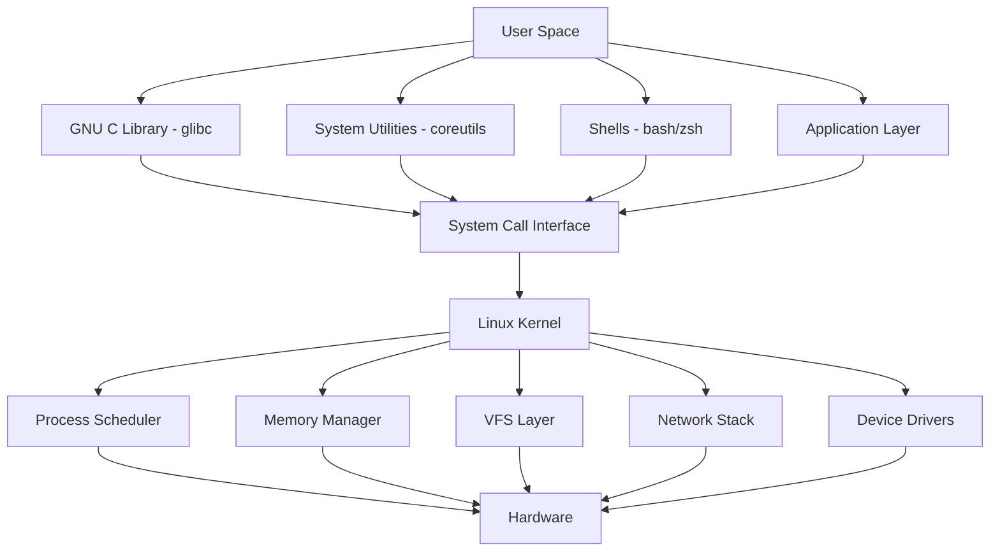
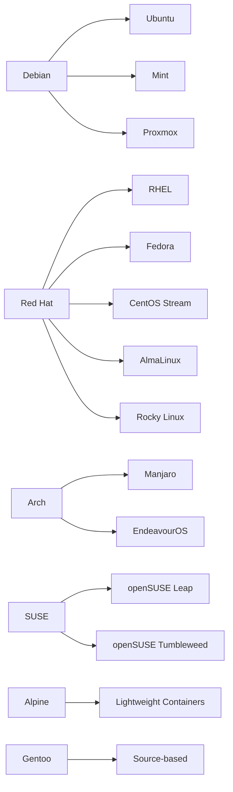

## What is Linux

Linux is a **Unix-like operating system kernel** first released by Linus Torvalds in 1991. When
people say "Linux" in practice, they almost always mean a **Linux distribution** — the kernel
bundled with GNU userland, init systems, package managers, and thousands of user-space utilities.
The kernel itself is just one component; the rest of the system is what makes it usable.

The Linux kernel is licensed under **GPLv2**, which guarantees the right to use, study, modify, and
redistribute the source code. This licensing model is the primary reason Linux dominates every
sector from embedded devices and smartphones (Android) to supercomputers and cloud infrastructure.

## Kernel Architecture

The Linux kernel is a **monolithic kernel** with loadable modules. Unlike microkernels (Mach, MINIX)
which move most services into user space, Linux runs device drivers, file system implementations,
and network protocols in kernel mode. This design trades fault isolation for performance — a buggy
driver can crash the kernel, but system call overhead is minimal because there is no user-kernel
context switch for kernel-internal operations.

Key subsystems:

| Subsystem             | Responsibility                                         |
| --------------------- | ------------------------------------------------------ |
| **Process Scheduler** | CFS (Completely Fair Scheduler), real-time scheduling  |
| **Memory Management** | Virtual memory, page tables, SLUB/SLAB allocators, OOM |
| **VFS**               | Virtual File System — abstracts file system operations |
| **Network Stack**     | TCP/IP, netfilter, routing, socket layer               |
| **Device Model**      | `sysfs`, `udev`, driver model, `kobject` hierarchy     |
| **IPC**               | Pipes, shared memory, signals, `epoll`, `eventfd`      |
| **Security**          | SELinux, AppArmor, capabilities, seccomp, audit        |

## Distribution Families

Linux distributions differ primarily in package management, release model, and default configuration
choices. The kernel is largely the same across all of them (with distribution-specific patches).

| Family  | Package Format | Package Manager | Init System | Typical Use Case              |
| ------- | -------------- | --------------- | ----------- | ----------------------------- |
| Debian  | `.deb`         | APT             | systemd     | Servers, desktops, containers |
| Red Hat | `.rpm`         | DNF             | systemd     | Enterprise servers            |
| Arch    | `.pkg.tar.zst` | pacman          | systemd     | Power users, rolling release  |
| Alpine  | `.apk`         | apk             | OpenRC      | Docker containers             |
| SUSE    | `.rpm`         | zypper          | systemd     | Enterprise, SAP workloads     |

## Why This Matters for Systems Engineers

Linux is the dominant operating system in every infrastructure domain you will encounter:

- **Cloud infrastructure**: AWS, GCP, and Azure run on custom Linux kernels (Xen, KVM, Firecracker).
- **Container orchestration**: Docker, containerd, and Kubernetes are Linux-native technologies
  built on cgroups, namespaces, and overlayfs.
- **Networking**: Linux routing, netfilter, and BPF power the majority of the world's routers and
  firewalls.
- **Embedded and IoT**: Android, OpenWrt, Yocto — all Linux underneath.
- **High-performance computing**: 100% of the TOP500 supercomputers run Linux.

Understanding Linux at the systems level — how processes are scheduled, how memory is managed, how
the network stack processes packets, how file systems journal writes — is not academic. It is the
difference between "restarting the service fixed it" and understanding _why_ it failed and
preventing recurrence.

## Scope of This Section

This section covers the core Linux competencies expected of a systems engineer:

1. **CLI Fundamentals** — Shell basics and core utilities
   ([shell-basics](./01-cli-fundamentals/shell-basics.md),
   [core-utilities](./01-cli-fundamentals/core-utilities.md))
2. **File Systems** — VFS, ext4, XFS, Btrfs, mounting
   ([filesystems-and-mounting](./02-file-systems/filesystems-and-mounting.md))
3. **Process Management** — Process model, signals, cgroups, resource limits
   ([processes-and-signals](./03-process-management/processes-and-signals.md))
4. **Networking** — Netfilter, namespaces, routing, troubleshooting
   ([linux-networking](./04-networking/linux-networking.md))
5. **Systemd** — Service management, timers, socket activation, hardening
   ([systemd](./05-systemd/systemd.md))
6. **Security** — PAM, SELinux, capabilities, seccomp, audit
   ([linux-security](./06-security/linux-security.md))
7. **Package Management** — APT, DNF, Nix, dependency resolution
   ([package-management](./07-package-management/package-management.md))

:::tip

These notes assume familiarity with basic Linux usage (navigating directories, running commands,
editing files). The focus is on depth — understanding _how_ things work, not just _what_ commands to
run.

:::
