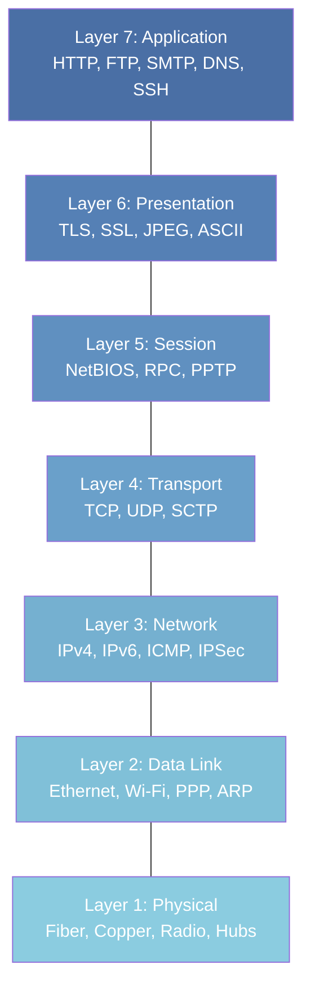
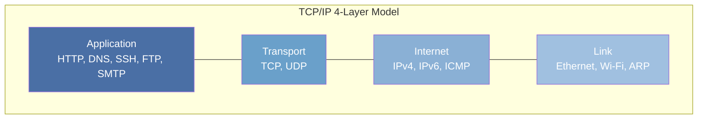
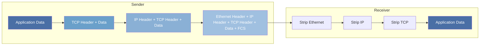

## Overview

Network reference models provide a structured vocabulary for discussing protocol behavior. They are
not implementations -- they are abstractions that help engineers reason about where a particular
function belongs in the stack and which protocols interact with which others.

Two models dominate: the **OSI 7-layer model** and the **TCP/IP 4-layer model**. The OSI model is
the one taught in classrooms and used in documentation. The TCP/IP model is the one that actually
describes how the Internet works. Understanding both, and the gaps between them, is essential.

### Why Reference Models Matter for Systems Engineers

Reference models are not academic exercises. They provide:

1. **A common vocabulary.** When you say "this is a layer-3 problem," every engineer understands
   that you are talking about IP routing, not application logic. This precision accelerates
   troubleshooting.
2. **A troubleshooting framework.** The layered approach provides a systematic methodology: verify
   physical connectivity first, then link-layer, then network-layer, and so on. This prevents wasted
   time investigating application code when the cable is unplugged.
3. **An abstraction boundary.** The transport layer abstracts away the details of IP routing and
   Ethernet framing. Application developers write to the socket API without knowing whether the
   underlying link is Ethernet, Wi-Fi, or fiber. This is what allows the Internet to work over
   vastly different physical media.
4. **A mental model for protocol design.** When designing a new protocol, the layered model helps
   you decide where each function belongs. Should error recovery go in the transport layer (TCP) or
   the application layer (HTTP retries)? The model provides a framework for that decision.

### The End-to-End Principle

The end-to-end principle (RFC 8890, originally articulated by Saltzer, Reed, and Clark in 1984) is
arguably the most important design principle of the Internet. It states that functions placed at the
lower levels of a system may be redundant or of little value when compared to the cost of providing
them at the higher levels.

In practical terms: reliability, security, and ordering should be implemented at the endpoints (the
application), not in the network. The network's job is to deliver packets as quickly and efficiently
as possible. This is why IP is "best effort" -- it does not guarantee delivery, ordering, or
duplicate suppression. Those are the responsibility of TCP (transport layer) or the application
itself.

This principle explains many design decisions:

- Why IP does not retransmit lost packets (TCP does that)
- Why IP does not encrypt data (TLS does that)
- Why IP does not reorder packets (TCP does that)
- Why middleboxes (NAT, firewalls, proxies) that modify traffic in transit are controversial -- they
  violate the end-to-end principle

The end-to-end principle is not absolute. Some functions are more efficiently implemented in the
network than at the endpoints:

- **Congestion control** benefits from network-level signals (ECN, packet loss) even though the
  endpoints make the decisions.
- **Multicast** is impossible without network support -- the endpoints cannot duplicate packets to
  multiple recipients.
- **QoS (Quality of Service)** requires network devices to prioritize traffic based on DSCP markings
  or other criteria.

The tension between the end-to-end principle and the desire for network-level intelligence is one of
the central debates in networking. NAT, firewalls, CDNs, and SD-WAN all represent varying degrees of
departure from the pure end-to-end model.

## The OSI 7-Layer Model

The Open Systems Interconnection (OSI) model was developed by the International Organization for
Standardization (ISO) starting in 1977, with the reference model published as ISO 7498 in 1984. It
defines seven layers, each with a specific responsibility:



### Layer 1: Physical

The physical layer defines the electrical, mechanical, and procedural characteristics of the
transmission medium. It is concerned with **bits on the wire** (or fiber, or air).

**Responsibilities:**

- Voltage levels, signal timing, and clock recovery
- Physical connector specifications (RJ-45, SC/LC fiber, USB)
- Bit encoding schemes (NRZ, Manchester, 4B/5B, 8B/10B, 64B/66B)
- Modulation techniques for wireless (QAM, OFDM)
- Maximum cable lengths and signal attenuation limits

**Key specifications:**

- **Ethernet (IEEE 802.3):** 100BASE-TX uses 4B/5B encoding over Cat5 at 125 MHz signaling rate to
  deliver 100 Mbps. 1000BASE-T uses all four pairs with PAM-5 encoding. 10GBASE-T uses PAM-16 with
  DSQ128 encoding over Cat6a at 800 MHz.
- **Fiber optics:** Single-mode fiber (SMF) supports distances up to 80+ km at 10 Gbps using 1310 nm
  or 1550 nm lasers. Multi-mode fiber (MMF) is limited to ~550 m at 10 Gbps due to modal dispersion.
  VCSELs (Vertical-Cavity Surface-Emitting Lasers) are used for MMF; Fabry-Perot and DFB lasers are
  used for SMF.
- **RS-232:** Legacy serial standard using +/- 12V levels, limited to ~20 kbps over ~15 m. Now
  largely replaced by USB and RS-485 in industrial applications.
- **DSL:** Uses OFDM (Orthogonal Frequency-Division Multiplexing) to transmit data over copper
  telephone lines. VDSL2 can achieve 100 Mbps symmetric over short distances (~300 m).

**PDU:** Bits

**Devices:** Hubs (layer-1 repeaters), media converters, signal amplifiers, transceivers (SFP, QSFP)

### Layer 2: Data Link

The data link layer provides node-to-node data transfer on the same physical network segment. It is
responsible for **framing**, MAC addressing, and error detection on the local link.

**Responsibilities:**

- Framing: delineating the beginning and end of a frame on the physical medium
- MAC addressing: unique hardware addresses for devices on the same link
- Error detection: CRC/FCS (Frame Check Sequence) to detect corrupted frames
- Flow control between directly connected devices (optional)
- Media Access Control: how devices share the medium (CSMA/CD, TDMA, polling)

**Sublayers (IEEE 802):**

- **LLC (Logical Link Control):** 802.2 -- provides an interface to the network layer, handles
  multiplexing of protocols (EtherType). The LLC header is 3 bytes: 1 byte DSAP (Destination Service
  Access Point), 1 byte SSAP (Source Service Access Point), 1 byte Control field.
- **MAC (Media Access Control):** specific to the physical medium (802.3 for Ethernet, 802.11 for
  Wi-Fi). Defines how devices access the shared medium and how frames are formatted.

**Key protocols:**

- **Ethernet (IEEE 802.3):** Dominant wired LAN protocol. Frame format includes 8-byte preamble (7
  bytes sync + 1 byte SFD), 6-byte destination MAC, 6-byte source MAC, 2-byte EtherType (or length
  in 802.3 frames), payload (46-1500 bytes), 4-byte FCS (CRC-32). Maximum frame size is 1518 bytes
  (1522 with 802.1Q VLAN tag, 1522 with QinQ double tagging).

  Ethernet addressing uses 48-bit MAC addresses, typically written as six pairs of hex digits (e.g.,
  `00:11:22:33:44:55`). The first three octets are the Organizationally Unique Identifier (OUI)
  assigned by IEEE to the manufacturer. The first bit of the first octet is the Unicast/Multicast
  bit (0 = unicast, 1 = multicast). The second bit is the Locally Administered bit (0 = universally
  administered, 1 = locally assigned).

- **Wi-Fi (IEEE 802.11):** Uses CSMA/CA (Collision Avoidance) rather than CSMA/CD because wireless
  stations cannot detect collisions while transmitting (the "hidden node" problem). RTCTS/CTS
  handshake mitigates hidden nodes. 802.11ax (Wi-Fi 6) adds OFDMA, MU-MIMO, and BSS Coloring for
  improved efficiency in dense environments.

- **PPP (Point-to-Point Protocol):** Used on serial links, DSL, and some VPNs. LCP (Link Control
  Protocol) establishes the link; NCP (Network Control Protocol) negotiates network-layer protocols.
  PPP over Ethernet (PPPoE) is used by many DSL ISPs to encapsulate PPP frames in Ethernet frames.

- **ARP (Address Resolution Protocol):** Maps IP addresses to MAC addresses on the local link. ARP
  operates at layer 2 but carries layer-3 information, making it a classic layer violation.

**PDU:** Frames

**Devices:** Switches, bridges, network interface cards (NICs), wireless access points

### Layer 3: Network

The network layer provides **logical addressing** and **routing** between different networks. It is
the layer that makes internetworking possible.

**Responsibilities:**

- Logical addressing: IP addresses that identify hosts across network boundaries
- Routing: determining the best path from source to destination through multiple networks
- Fragmentation and reassembly: breaking packets that exceed the MTU of a downstream link
- Error handling and diagnostics: ICMP for reporting problems
- TTL (Time to Live): preventing packets from circulating indefinitely

**Key protocols:**

- **IPv4 (RFC 791):** 32-bit addresses, connectionless, best-effort delivery. Header is 20-60 bytes
  (20 bytes fixed + up to 40 bytes of options). The Identification, Flags, and Fragment Offset
  fields handle fragmentation. The Protocol field identifies the upper-layer protocol (6=TCP,
  17=UDP, 1=ICMP). The Header Checksum covers only the header (not the data), and is recomputed at
  each hop because the TTL changes.

- **IPv6 (RFC 8200):** 128-bit addresses, simplified 40-byte fixed header, built-in support for
  extension headers (routing, fragmentation, AH, ESP, destination options). The Flow Label field
  enables routers to identify packets belonging to the same flow for QoS treatment. IPv6 requires
  the source to perform Path MTU Discovery -- routers do not fragment.

- **ICMP (RFC 792):** Used for diagnostics (ping, traceroute) and error reporting (destination
  unreachable, time exceeded, redirect, parameter problem). ICMP messages are carried in IP packets
  with Protocol=1 (IPv4) or Next Header=58 (IPv6). Not a transport protocol -- it is a companion to
  IP that provides feedback about the network layer.

- **IPSec:** Provides authentication (AH) and encryption (ESP) at the network layer. Used in VPN
  tunnels (site-to-site, remote access) to secure all traffic between endpoints. IKE (Internet Key
  Exchange) negotiates the security association (SA) parameters.

**PDU:** Packets

**Devices:** Routers, layer-3 switches

### Layer 4: Transport

The transport layer provides **end-to-end communication services** between applications running on
different hosts. It is the first layer where the concept of a "connection" exists (for TCP).

**Responsibilities:**

- Multiplexing/demultiplexing: port numbers allow multiple applications to share a single IP
  address. The kernel uses the 4-tuple (source IP, source port, destination IP, destination port) to
  demultiplex incoming packets to the correct socket.
- Connection-oriented reliable delivery (TCP): sequencing, acknowledgment, retransmission, duplicate
  suppression, and ordered delivery.
- Connectionless datagram delivery (UDP): minimal overhead, no guarantees. Used when the application
  implements its own reliability or when reliability is not needed.
- Flow control: preventing a fast sender from overwhelming a slow receiver. TCP uses a sliding
  window mechanism where the receiver advertises the number of bytes it is willing to accept.
- Congestion control: preventing the sender from overwhelming the network. TCP uses slow start,
  congestion avoidance, fast retransmit, and fast recovery (or BBR) to adapt to network conditions.

**Key protocols:**

- **TCP (RFC 793):** Connection-oriented, reliable, ordered, byte-stream protocol. 20-byte minimum
  header (up to 60 bytes with options). Provides flow control (sliding window), congestion control
  (cwnd/ssthresh), and reliable delivery (sequence numbers, ACKs, retransmission). Discussed in
  detail in the TCP and UDP section.
- **UDP (RFC 768):** Connectionless, unreliable, datagram protocol. 8-byte header (source port,
  destination port, length, checksum). No flow control, no congestion control, no ordering. Used by
  DNS, NTP, SNMP, QUIC, WebRTC, and streaming protocols.
- **SCTP (RFC 4960):** Message-oriented, supports multi-homing (multiple IP addresses per endpoint)
  and multi-streaming (independent streams within a single association, avoiding head-of-line
  blocking). Used in telecommunications (SS7 signaling over IP) and WebRTC data channels.

**PDU:** Segments (TCP) or datagrams (UDP)

### Layer 5: Session

The session layer establishes, manages, and terminates sessions between applications. In practice,
this layer is the thinnest in the OSI model and is almost never implemented as a distinct protocol
layer.

**Responsibilities:**

- Session establishment, maintenance, and teardown
- Synchronization: checkpoints in the data stream to allow recovery from failures. If a transfer is
  interrupted, the session layer can resume from the last checkpoint rather than starting over.
- Dialog control: determining which side transmits (simplex, half-duplex, full-duplex)
- Token management: controlling which side is allowed to transmit in half-duplex sessions

**Key protocols:**

- **NetBIOS:** Used in Windows networking for name resolution and session management. NetBIOS over
  TCP/IP (NBT) encapsulates NetBIOS in TCP and UDP frames. Largely superseded by DNS for name
  resolution and SMB/CIFS for file sharing.
- **RPC (Remote Procedure Call):** Allows a program on one machine to call a procedure on another.
  Implemented at the application layer in practice (e.g., gRPC over HTTP/2, XML-RPC over HTTP). ONC
  RPC (RFC 5531) is used by NFS.
- **PPTP (Point-to-Point Tunneling Protocol):** VPN protocol that encapsulates PPP frames in GRE
  packets. Now considered insecure due to known cryptographic weaknesses.
- **PPT (Presentation Protocol for Teleconferencing):** Historically associated with this layer.

**Reality check:** Most "session layer" functionality is implemented within application protocols or
within TCP itself. TLS session resumption, HTTP cookies, WebSocket handshakes, and database
connection pools all perform session management without a distinct session-layer protocol.

### Layer 6: Presentation

The presentation layer translates data between the application layer and the network format. It is
responsible for data representation, encoding, and encryption.

**Responsibilities:**

- Data format translation (e.g., EBCDIC to ASCII, big-endian to little-endian)
- Data serialization and deserialization
- Encryption and decryption
- Data compression and decompression
- Character encoding (ASCII, UTF-8, UTF-16, ISO-8859-1)
- Abstract syntax notation (ASN.1, XDR)

**Historical protocols:**

- **TLS/SSL:** Historically mapped to the presentation layer. In the TCP/IP model, TLS sits between
  the transport and application layers (some call this "layer 6.5"). TLS provides encryption,
  authentication, and integrity -- all presentation-layer functions.
- **MIME (Multipurpose Internet Mail Extensions):** Defines encoding for email attachments (Base64,
  quoted-printable) and content types (text/plain, application/json). Used beyond email in HTTP
  (Content-Type header) and other protocols.
- **XDR (External Data Representation):** Used in NFS and RPC for platform-independent data
  encoding. Defines a canonical representation that is the same regardless of the sender's or
  receiver's architecture (endianness, integer size, float format).
- **ASN.1 (Abstract Syntax Notation One):** Used in SNMP, LDAP, and X.509 certificates for defining
  data structures. BER (Basic Encoding Rules) and DER (Distinguished Encoding Rules) define how
  ASN.1 structures are serialized to bytes.
- **JPEG, MPEG, GIF:** Data compression standards that the presentation layer would handle. In
  practice, these are implemented in application libraries.

**Reality check:** Like the session layer, presentation-layer functions are absorbed into
application protocols. JSON, Protocol Buffers, MessagePack, and CBOR handle data serialization. TLS
handles encryption. Character encoding is handled by application libraries (iconv, ICU). Compression
is handled by application-layer mechanisms (HTTP Content-Encoding, gzip).

### Layer 7: Application

The application layer is the interface between the network and the end-user application. It provides
the services that applications use to communicate over the network.

**Responsibilities:**

- Defining the interface that applications use to access network services (socket API, Winsock)
- Defining the format and semantics of data exchanged between applications
- Implementing application-specific logic (e.g., HTTP request/response format, SMTP mail delivery)
- Resource identification (URIs, URLs)
- Content negotiation (accept types, languages, encodings)

**Key protocols:**

- **HTTP/HTTPS:** Web communication. Discussed in detail in the HTTP section.
- **DNS:** Name resolution. Discussed in detail in the DNS section.
- **SMTP/POP3/IMAP:** Email delivery and retrieval. SMTP (RFC 5321) sends mail between servers. POP3
  (RFC 1939) and IMAP (RFC 3501) retrieve mail from servers.
- **SSH (RFC 4251):** Secure remote shell access and tunneling. Provides encrypted terminal
  sessions, file transfer (SCP/SFTP), and port forwarding (local, remote, dynamic/SOCKS proxy).
- **FTP (RFC 959):** File transfer (legacy; largely replaced by SFTP and HTTP). Uses separate
  control (port 21) and data connections, which complicates NAT traversal.
- **SNMP (RFC 3416):** Network device monitoring and management. Uses UDP port 161 for queries and
  traps, UDP port 162 for trap notifications. SNMPv3 adds authentication and encryption.
- **NTP (RFC 5905):** Network time synchronization. Uses UDP port 123. Stratum levels indicate
  distance from the reference clock (Stratum 1 = directly connected to a reference clock like GPS or
  atomic clock). Precision is typically 1-10 ms over the Internet, sub-millisecond on LANs.
- **LDAP (RFC 4511):** Directory service protocol used for authentication, authorization, and
  directory lookups. Microsoft Active Directory is based on LDAP.
- **SIP (RFC 3261):** Session Initiation Protocol for VoIP and video conferencing. Establishes,
  modifies, and terminates multimedia sessions. Used with SDP (Session Description Protocol) to
  negotiate media parameters.
- **Syslog (RFC 5424):** Event logging protocol. Uses UDP port 514 by default. TLS-encrypted syslog
  (RFC 8446) uses TCP port 6514.

**PDU:** Data (application-specific)

## The TCP/IP 4-Layer Model

The TCP/IP model (also called the DoD model or the Internet model) was developed by DARPA as part of
the ARPANET project. It predates the OSI model and is the model that the Internet actually
implements.



### Application Layer

Combines OSI layers 5, 6, and 7. Application protocols in the TCP/IP model handle session
management, data representation, and application logic directly. There is no formal separation
between presentation and session concerns.

This is why TLS is awkward to place in the OSI model -- it provides encryption (presentation) and
session management (session) but runs over TCP (transport) and under HTTP (application). In the
TCP/IP model, TLS is simply part of the application layer, or more precisely, an application-layer
library that applications use.

The TCP/IP application layer also includes the socket API, which is the de facto standard interface
for network programming. The socket API was developed at UC Berkeley in the early 1980s as part of
BSD Unix. It provides a uniform interface for both TCP and UDP (and other protocols) regardless of
the underlying network.

### Transport Layer

Maps directly to OSI layer 4. Provides end-to-end delivery services. The key difference from the OSI
model is that the TCP/IP transport layer explicitly supports both connection-oriented (TCP) and
connectionless (UDP) paradigms, whereas the OSI transport layer was primarily designed around
connection-oriented protocols (TP0-TP4, where TP4 was the most reliable and closest to TCP).

### Internet Layer

Maps directly to OSI layer 3. Handles addressing and routing. The Internet layer is defined by IP
(RFC 791 for IPv4, RFC 8200 for IPv6). Unlike the OSI network layer, which was designed to support
multiple network-layer protocols (CLNP, IPX, etc.), the TCP/IP Internet layer is inseparable from
IP. The "Internet" in "Internet layer" refers specifically to IP.

### Link Layer

Combines OSI layers 1 and 2. The TCP/IP model treats the physical medium and data link protocol as a
single concern: getting a frame from one node to the next directly connected node. The link layer is
intentionally unspecified -- the Internet works over Ethernet, Wi-Fi, PPP, fiber, satellite, and
virtually any link-layer technology.

This deliberate abstraction is why the Internet could evolve from running over 56 kbps serial lines
to 400 Gbps fiber without changing the upper layers. The link layer is a black box to the Internet
layer -- IP does not care whether the underlying link is Ethernet or Wi-Fi, only that it can deliver
frames to the next hop.

## OSI vs TCP/IP Comparison

| OSI Layer | OSI Name     | TCP/IP Layer | Protocols                      |
| --------- | ------------ | ------------ | ------------------------------ |
| 7         | Application  | Application  | HTTP, DNS, SSH, FTP, SMTP      |
| 6         | Presentation | Application  | TLS (mapped here in practice)  |
| 5         | Session      | Application  | NetBIOS, RPC (mostly absorbed) |
| 4         | Transport    | Transport    | TCP, UDP, SCTP                 |
| 3         | Network      | Internet     | IPv4, IPv6, ICMP               |
| 2         | Data Link    | Link         | Ethernet, Wi-Fi, PPP           |
| 1         | Physical     | Link         | Fiber, copper, radio           |

### Why TCP/IP Won

The OSI model was designed by committee. The protocols implementing it (OSI protocols like CLNP,
TP4, FTAM) were complex, slow to standardize, and arrived too late. By the time OSI protocols were
mature enough for deployment, TCP/IP had already been running on the ARPANET for over a decade.

Several concrete reasons:

1. **Working code over academic design.** TCP/IP was implemented and tested on real networks
   starting in the 1970s. OSI protocols existed primarily on paper until the late 1980s and early
   1990s. By then, TCP/IP had been battle-tested by thousands of users and refined over years of
   operational experience.
2. **Simplicity.** The TCP/IP model has 4 layers. The IP header is 20 bytes minimum. The OSI network
   layer protocol (CLNP) had variable-length addresses (up to 20 bytes) and a more complex header
   (up to 254 bytes). Simpler protocols are easier to implement, debug, and optimize.
3. **Free and open.** TCP/IP implementations were freely available (especially the BSD
   implementation released with 4.2BSD in 1983). OSI protocols required commercial implementations
   that were expensive and varied between vendors, creating interoperability problems.
4. **Layer 3 addressing.** IPv4 used 32-bit addresses that could be hierarchically allocated to
   support routing at scale. OSI used variable-length NSAP addresses (up to 20 bytes) that were more
   flexible but harder to route at scale due to the variable-length prefix matching requirement.
5. **Market momentum.** By the time the OSI protocols were ready, the University of California,
   Berkeley had embedded TCP/IP in BSD Unix, which was widely distributed and became the basis for
   most commercial Unix implementations. Sun Microsystems, DEC, and other vendors adopted TCP/IP,
   creating a large installed base that made switching to OSI impractical.

RFC 874 ("A Critique of X.25") and RFC 895 ("A Standard for the Transmission of IP Datagrams over
Ethernet Networks") capture the engineering pragmatism that drove TCP/IP adoption.

### The Hybrid Model

Many textbooks and engineers use a hybrid 5-layer model that combines the best of both:

| Layer | Name        | Description          |
| ----- | ----------- | -------------------- |
| 5     | Application | HTTP, DNS, SSH, TLS  |
| 4     | Transport   | TCP, UDP             |
| 3     | Network     | IPv4, IPv6, ICMP     |
| 2     | Data Link   | Ethernet, Wi-Fi, ARP |
| 1     | Physical    | Fiber, copper, radio |

This model is a practical compromise: it keeps the physical and data link layers separate (which is
useful for network engineering) while collapsing the upper layers (which is how real protocols
work). This is the model used in most networking textbooks (Kurose &amp; Ross, Tanenbaum) and in
practice.

## Encapsulation and De-encapsulation

As data moves down the protocol stack, each layer adds its own header (and sometimes trailer). This
process is called **encapsulation**. At the receiving end, each layer strips its header in reverse
order -- **de-encapsulation**.



### PDU Naming

Each layer names its data unit differently:

| Layer       | PDU Name                       | Size                           |
| ----------- | ------------------------------ | ------------------------------ |
| Physical    | Bits                           | Individual signal transitions  |
| Data Link   | Frame                          | Up to 1518 bytes (Ethernet)    |
| Network     | Packet                         | Varies; limited by MTU         |
| Transport   | Segment (TCP) / Datagram (UDP) | Up to 65,535 bytes (UDP limit) |
| Application | Data / Message                 | Application-defined            |

### Concrete Example: HTTP GET over Ethernet

When a browser sends an HTTP GET request, the encapsulation looks like this:

```
+-------------------+
| Ethernet Header   | 14 bytes (6 dst MAC + 6 src MAC + 2 EtherType)
+-------------------+
| IP Header         | 20 bytes (minimum)
+-------------------+
| TCP Header        | 20 bytes (minimum)
+-------------------+
| HTTP Request      | "GET / HTTP/1.1\r\nHost: example.com\r\n..."
+-------------------+
| Ethernet FCS      | 4 bytes (CRC-32)
+-------------------+
```

Total overhead per frame: 58 bytes minimum (14 + 20 + 20 + 4). The Ethernet payload (MTU) is 1500
bytes, so the maximum HTTP data in a single frame is 1500 - 20 (IP) - 20 (TCP) = 1460 bytes. This is
the **MSS** (Maximum Segment Size) for a standard Ethernet link with no options.

### Overhead Analysis

Understanding protocol overhead is critical for capacity planning and performance analysis. The
following table shows the overhead for common encapsulations:

| Encapsulation                            | Header Overhead | Efficiency (1460-byte payload) |
| ---------------------------------------- | --------------- | ------------------------------ |
| Ethernet + IPv4 + TCP                    | 54 bytes        | 96.4%                          |
| Ethernet + 802.1Q + IPv4 + TCP           | 58 bytes        | 96.2%                          |
| Ethernet + IPv4 + TCP + TLS              | 89 bytes        | 94.3%                          |
| Ethernet + GRE + IPv4 + TCP              | 78 bytes        | 94.9%                          |
| Ethernet + VXLAN + Ethernet + IPv4 + TCP | 90 bytes        | 94.2%                          |

For small packets (e.g., VoIP with 20-byte payload), the overhead is proportionally much higher. A
20-byte VoIP payload in an Ethernet + IPv4 + UDP frame uses 20 + 20 + 8 + 14 + 4 = 66 bytes of
overhead, for an efficiency of only 23.3%. This is why header compression (ROHC, ROHCv2) is used on
bandwidth-constrained links (cellular, satellite).

## Layer Violations in Real Protocols

Strict layer separation is a useful teaching model, but real protocols routinely violate layer
boundaries. Understanding these violations is critical because they affect how networks behave in
practice.

### Common Violations

**NAT (Network Address Translation):** NAT operates at layer 3 (modifying IP addresses) and layer 4
(modifying port numbers). It breaks the end-to-end principle by rewriting addresses in transit.
Peer-to-peer protocols like SIP and FTP active mode have to work around NAT with techniques like
STUN, TURN, and PASV mode. NAT also breaks IPsec AH (which covers the IP header in its integrity
check) because the IP header is modified after the packet leaves the source.

**ICMP:** ICMP is a layer-3 protocol used for layer-4 and layer-7 functions. `ping` uses ICMP Echo
to test reachability (layer 7 concept). `traceroute` uses ICMP Time Exceeded to discover the path
(layer 3 concept). Path MTU Discovery (RFC 1191) uses ICMP Fragmentation Needed messages to
negotiate packet size. ICMP Redirect messages (type 5, code 0) instruct a host to use a different
gateway -- this is a layer-3 routing function performed by an ICMP message.

**ARP:** ARP maps layer-3 addresses (IP) to layer-2 addresses (MAC). It is a layer-2 protocol that
carries layer-3 information. ARP uses Ethernet broadcast (ff:ff:ff:ff:ff:ff) to reach all hosts on
the segment, but the payload contains an IP address. In IPv6, NDP (Neighbor Discovery Protocol) uses
ICMPv6 for the same purpose, further blurring the boundary.

**TLS:** TLS provides encryption (presentation) and session management (session) but runs over TCP
(transport). It is neither purely layer 6 nor purely layer 5. In the TCP/IP model, it is part of the
application layer. In the hybrid model, it is sometimes called "layer 5.5" or "layer 6."

**HTTP/2 and HTTP/3:** HTTP/2 implements flow control at the application layer, duplicating
transport-layer functionality. HTTP/3 moves transport functionality into the application layer by
using QUIC (which implements congestion control, reliability, and encryption in user space over
UDP). QUIC is essentially a transport protocol implemented in the application layer.

**MPLS (Multiprotocol Label Switching, RFC 3031):** MPLS inserts a 4-byte shim header between the
layer-2 and layer-3 headers. It is neither layer 2 nor layer 3 -- it is sometimes called "layer
2.5." MPLS uses labels (20-bit values) to make forwarding decisions without examining the IP header,
which improves performance in carrier networks. MPLS labels can be stacked (up to 7 deep in
practice), enabling LSPs (Label Switched Paths) that traverse multiple networks.

**BGP (Border Gateway Protocol, RFC 4271):** BGP is an application-layer protocol (it runs over TCP
port 179) that makes layer-3 routing decisions. The routing information it carries (NLRI, Network
Layer Reachability Information) determines how packets are forwarded at layer 3. BGP is the protocol
that makes the Internet work as a network of networks.

**DNS:** DNS uses both UDP and TCP (layer 4) but carries application-layer naming information. Large
DNS responses (&gt; 512 bytes traditionally, &gt; 1232 bytes with EDNS0) fall back to TCP, violating
the simplistic "DNS is UDP" assumption. DNS-over-HTTPS (DoH) further complicates the layer mapping
by carrying DNS queries inside HTTP/2 inside TLS inside TCP.

**Wi-Fi WPA2/WPA3:** Wi-Fi security operates at layer 2 (data link) but uses protocols derived from
layer 5/6 (802.1X/EAP for authentication, AES-CCMP for encryption). The encryption happens at a
lower layer than TLS but serves a similar purpose. 802.1X uses EAP (Extensible Authentication
Protocol) to authenticate devices before they are allowed on the network.

### Why Layer Violations Happen

Layer violations are not mistakes. They occur because:

1. **Performance:** Processing at a lower layer can be faster (e.g., MPLS label switching vs full IP
   routing table lookup). Hardware implementations at lower layers are faster than software
   implementations at higher layers.
2. **Firewall traversal:** Protocols embed their signaling inside other protocols to bypass
   middleboxes (e.g., SIP over UDP, FTP data connections, HTTP CONNECT tunneling). This is a
   consequence of middleboxes violating the end-to-end principle.
3. **Deployment reality:** NAT, firewalls, and load balancers all operate between layers and modify
   traffic in transit. Protocols must work in a world where middleboxes exist, which means adapting
   to their behavior.
4. **Historical evolution:** The Internet was not designed top-down from a model. Protocols evolved
   to solve real problems, sometimes spanning multiple layers. DNS predates HTTP. TLS was designed
   as an add-on to TCP, not as a native layer.

## Data Flow Through the Stack

When a user clicks a link in their browser, data flows through the stack as follows:

**Sending side:**

1. **Application layer:** Browser constructs an HTTP GET request (application-level data)
2. **Transport layer:** TCP segments the request, adds sequence numbers, and establishes a
   connection via the three-way handshake (SYN, SYN-ACK, ACK)
3. **Internet layer:** IP encapsulates the TCP segment in a packet, adds source and destination IP
   addresses, decrements TTL, and routes the packet based on the routing table
4. **Link layer:** Ethernet adds source and destination MAC addresses (resolved via ARP), adds
   EtherType (0x0800 for IPv4), calculates FCS, and transmits the frame

**Network transit:**

5. Routers at each hop strip the Ethernet header, examine the IP destination, consult their routing
   table, and re-encapsulate with new Ethernet headers for the next hop
6. The IP source and destination addresses remain unchanged throughout transit; only the link-layer
   addresses change at each hop
7. The TTL is decremented by 1 at each router. If TTL reaches 0, the router sends an ICMP Time
   Exceeded message back to the source

**Receiving side:**

8. **Link layer:** NIC receives the frame, verifies the FCS, strips the Ethernet header, and passes
   the IP packet to the network layer
9. **Internet layer:** IP verifies the header checksum, checks the destination address matches a
   local address, strips the IP header, and passes the TCP segment to the transport layer
10. **Transport layer:** TCP reassembles segments in order, acknowledges receipt, delivers data to
    the application socket identified by the destination port
11. **Application layer:** Web server receives the HTTP request on the listening socket and
    constructs a response (200 OK with HTML content)

## Practical Implications

Understanding the protocol stack matters for troubleshooting because symptoms at one layer often
have root causes at another:

| Symptom                        | Likely Layer  | Diagnostic Tool             |
| ------------------------------ | ------------- | --------------------------- |
| No link light                  | Physical      | `ethtool`, cable tester     |
| Wrong VLAN tag                 | Data Link     | `tcpdump -e`, switch CLI    |
| Packet loss on specific routes | Network       | `traceroute`, `mtr`         |
| Connection refused             | Transport     | `ss -tlnp`, `nc -zv`        |
| 502 Bad Gateway                | Application   | `curl -v`, application logs |
| High latency on first request  | Transport     | TCP slow start, keep-alive  |
| Intermittent connectivity      | Physical/Link | Cable, duplex mismatch      |
| ARP flux / MAC flapping        | Data Link     | `arp -a`, switch logs       |
| MTU black hole                 | Network       | `ping -M do -s 1472`, ICMP  |
| TLS handshake failure          | Application   | `openssl s_client`, cipher  |

:::tip

When troubleshooting, start at the lowest layer and work up. Verify physical connectivity before
checking IP configuration. Verify IP connectivity before checking TCP ports. Verify TCP connectivity
before debugging application-level issues. This systematic approach saves time and prevents
misdiagnosis.

:::

## Common Pitfalls

1. **Treating the OSI model as prescriptive.** The OSI model describes, it does not prescribe. No
   protocol stack in production implements all seven layers distinctly. Arguments about "which layer
   is X" are usually unproductive. The model is a tool for understanding, not a standard for
   implementation.

2. **Confusing logical and physical topology.** A layer-3 IP network can span multiple layer-2
   broadcast domains connected by routers. A layer-2 VLAN can span multiple physical switches. The
   topology at each layer is independent. Understanding this distinction is essential for designing
   and troubleshooting networks.

3. **Assuming MTU is always 1500 bytes.** Jumbo frames use 9000 bytes. VPN overhead (IPSec, GRE)
   reduces effective MTU. Path MTU Discovery can fail silently if ICMP is filtered, causing "black
   hole" connections where TCP connections hang after the initial handshake. Cloud environments
   often use 1450-byte MTU for overlay networks (VXLAN adds 50 bytes).

4. **Ignoring the link layer when debugging network problems.** ARP failures, MAC address flapping,
   and spanning-tree issues cause symptoms that look like IP routing problems. Always check `arp -a`
   and switch MAC tables when troubleshooting connectivity. A common mistake is to assume that
   because `ip addr show` displays the correct IP address, the network is configured correctly --
   the link layer may be down or misconfigured.

5. **Believing all traffic follows the protocol stack.** Tunnels (GRE, VXLAN, IPsec), overlays
   (SD-WAN), and middleboxes (proxies, load balancers) all encapsulate traffic in ways that break
   simple layer models. A single Ethernet frame may contain: Ethernet + IP + GRE + IP + TCP + HTTP.
   Use `tcpdump -e` to see encapsulation depth.

6. **Over-reliance on the OSI model for firewall rules.** "Layer 3 firewalls" and "layer 7
   firewalls" are marketing terms. A stateful firewall that tracks TCP connections is not strictly a
   layer-4 device -- it understands layer-4 state to make layer-3 forwarding decisions.
   Application-layer firewalls (WAFs) inspect layer-7 content but still operate on layer-3/4
   traffic. Classifying firewalls by "layer" is imprecise and can lead to incorrect assumptions
   about what traffic is filtered.

7. **Forgetting that each layer has its own addressing.** Physical layer: no addressing (shared
   medium). Data link: MAC addresses (48-bit, flat). Network: IP addresses (32-bit IPv4, 128-bit
   IPv6, hierarchical). Transport: port numbers (16-bit, local scope). Application: URIs, email
   addresses, etc. Understanding which addressing scheme is relevant at each layer is fundamental to
   troubleshooting.

## Network Topologies and the OSI Model

Understanding how different topologies interact at each layer helps with design and troubleshooting.

### Broadcast Domains vs Collision Domains

A **collision domain** is a network segment where packets can collide with each other. At layer 1
(hubs), all ports share a single collision domain. At layer 2 (switches), each port is its own
collision domain because switches buffer and forward frames.

A **broadcast domain** is a network segment where broadcast packets (ff:ff:ff:ff:ff:ff) reach all
ports. By default, all ports on a switch are in the same broadcast domain. VLANs divide a switch
into multiple broadcast domains. Routers separate broadcast domains entirely.

| Device | Collision Domains | Broadcast Domains |
| ------ | ----------------- | ----------------- |
| Hub    | 1 (shared)        | 1 (shared)        |
| Switch | 1 per port        | 1 per VLAN        |
| Router | 1 per port        | 1 per port        |

### VLANs and Layer 2 Segmentation

VLANs (Virtual LANs, IEEE 802.1Q) divide a physical switch into multiple logical switches, each with
its own broadcast domain. VLANs add a 4-byte tag to the Ethernet frame:

```
+-------------------+---------+-------------------+
| Ethernet Header   | 802.1Q  | Ethernet Header   |
| (12 bytes)        | Tag     | (12 bytes)        |
|                   | (4 bytes)|                  |
+-------------------+---------+-------------------+
```

The 802.1Q tag contains:

- **TPID (Tag Protocol Identifier):** 0x8100 (identifies the frame as tagged)
- **PCP (Priority Code Point):** 3 bits for QoS (802.1p)
- **DEI (Drop Eligible Indicator):** 1 bit for congestion marking
- **VID (VLAN Identifier):** 12 bits, supporting 4,094 VLANs (0 and 4095 are reserved)

VLANs are a layer-2 concept that has layer-3 implications: each VLAN typically corresponds to a
different IP subnet, and inter-VLAN routing requires a layer-3 device (router or layer-3 switch).

### Spanning Tree Protocol (STP)

STP (IEEE 802.1D) prevents loops in layer-2 networks by blocking redundant paths. STP elects a root
bridge and calculates the shortest path from each bridge to the root, blocking all other paths. If
the active path fails, STP unblocks a redundant path.

STP convergence can take 30-50 seconds (by default), during which traffic is disrupted. Rapid
Spanning Tree Protocol (RSTP, 802.1w) reduces convergence to a few seconds. Multiple Spanning Tree
Protocol (MSTP, 802.1s) allows different VLANs to use different spanning trees, improving link
utilization.

STP is a layer-2 protocol that affects layer-3 connectivity. If STP blocks a port, all layer-3
traffic through that port is dropped. STP issues cause some of the most puzzling network problems
because the symptoms (intermittent connectivity, unreachable hosts) look like layer-3 routing
issues.

```bash
# Check STP status on a Linux bridge
bridge mdb show
bridge link show

# Check STP status on a switch (example)
# show spanning-tree
# show spanning-tree vlan 10
```

### SDN and Network Virtualization

Software-Defined Networking (SDN) decouples the control plane (routing decisions) from the data
plane (forwarding). In traditional networking, each switch makes independent forwarding decisions
based on its local configuration. In SDN, a centralized controller programs all switches with
consistent forwarding rules.

Network virtualization (VXLAN, NVGRE, GENEVE) overlays virtual networks on top of physical networks.
VXLAN (RFC 7348) encapsulates layer-2 frames in UDP packets, allowing layer-2 connectivity across
layer-3 boundaries. This is how cloud providers create isolated virtual networks for each tenant.

VXLAN uses a 50-byte overhead:

```
Outer Ethernet (14) + Outer IP (20) + Outer UDP (8) + VXLAN Header (8) + Inner Ethernet (14) = 64 bytes
```

This reduces the effective MTU from 1500 to 1450 bytes for the inner frame, which is why cloud VMs
often use 1450-byte MTU by default.
