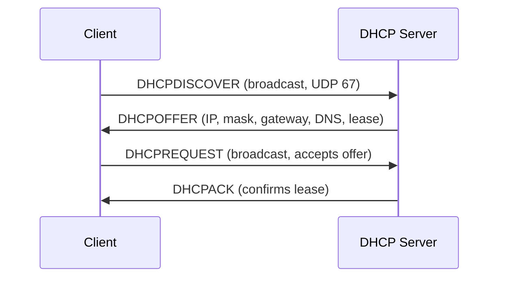
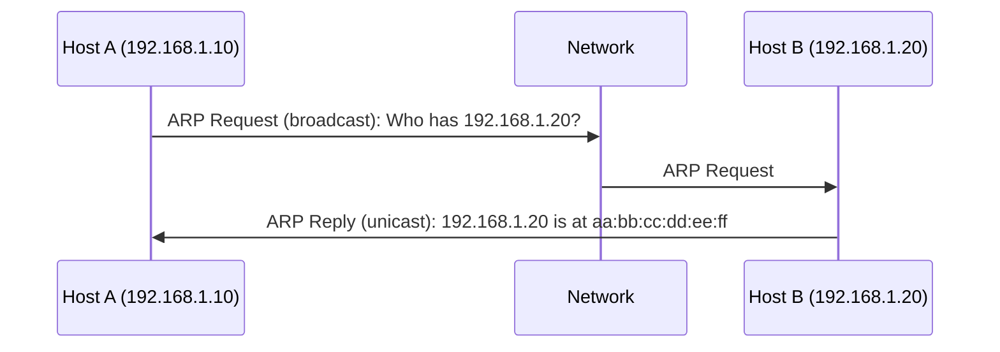

## Overview

IP addressing is the mechanism by which hosts are identified and located on an IP network. Every
networked device must have an IP address to participate in IP communication. This section covers
IPv4 and IPv6 addressing, subnetting, NAT, DHCP, and ARP -- the foundational addressing
infrastructure of the Internet.

## IPv4 Address Structure

An IPv4 address is a **32-bit** number, typically represented in **dotted decimal notation** as four
octets separated by periods. Each octet represents 8 bits and ranges from 0 to 255.

```
192.168.1.100

Binary:  11000000.10101000.00000001.01100100
Octets:  [  192  ].[  168  ].[   1  ].[ 100  ]
Bits:    [31    24][23    16][15     8][7      0]
```

The total IPv4 address space is $2^{32} = 4,294,967,296$ addresses. This was considered sufficient
in the 1970s but is grossly inadequate for today's Internet, where every smartphone, server, VM, and
container needs an address.

### Binary Representation

Working with IP addresses in binary is essential for understanding subnetting. Convert each octet:

```
192 = 128 + 64       = 11000000
168 = 128 + 32 + 8   = 10101000
1   = 1              = 00000001
100 = 64 + 32 + 4    = 01100100
```

Quick reference for binary-to-decimal conversion:

| Bit | Value | Bit | Value | Bit | Value | Bit | Value |
| --- | ----- | --- | ----- | --- | ----- | --- | ----- |
| 7   | 128   | 6   | 64    | 5   | 32    | 4   | 16    |
| 3   | 8     | 2   | 4     | 1   | 2     | 0   | 1     |

### Special IPv4 Addresses

| Address         | Purpose                                                   |
| --------------- | --------------------------------------------------------- |
| 0.0.0.0         | Unspecified source (used in DHCP requests, default route) |
| 127.0.0.1       | Loopback (localhost) -- packets never leave the host      |
| 255.255.255.255 | Limited broadcast (all hosts on the local segment)        |
| 169.254.0.0/16  | Link-local (APIPA -- automatic when DHCP fails)           |
| 224.0.0.0/4     | Multicast (224.0.0.0-239.255.255.255)                     |
| 240.0.0.0/4     | Reserved (formerly Class E, 240.0.0.0-255.255.255.255)    |
| 192.0.0.0/24    | IETF Protocol Assignments                                 |
| 192.0.2.0/24    | Documentation (RFC 5737, TEST-NET-1)                      |
| 198.51.100.0/24 | Documentation (RFC 5737, TEST-NET-2)                      |
| 203.0.113.0/24  | Documentation (RFC 5737, TEST-NET-3)                      |

### Address Classes (Historical)

Before CIDR (Classless Inter-Domain Routing), IPv4 addresses were divided into five classes:

| Class | First Octet Range | Network Bits | Host Bits | Default Subnet Mask | Usable Hosts |
| ----- | ----------------- | ------------ | --------- | ------------------- | ------------ |
| A     | 0-127             | 8            | 24        | 255.0.0.0 (/8)      | 16,777,214   |
| B     | 128-191           | 16           | 16        | 255.255.0.0 (/16)   | 65,534       |
| C     | 192-223           | 24           | 8         | 255.255.255.0 (/24) | 254          |
| D     | 224-239           | N/A          | N/A       | N/A (multicast)     | N/A          |
| E     | 240-255           | N/A          | N/A       | N/A (reserved)      | N/A          |

The class was determined by the first few bits of the first octet:

```
Class A:  0xxxxxxx  (0-127)
Class B:  10xxxxxx  (128-191)
Class C:  110xxxxx  (192-223)
Class D:  1110xxxx  (224-239)
Class E:  1111xxxx  (240-255)
```

Classful addressing was wasteful. A company needing 300 hosts would receive a Class B (65,534
hosts), wasting 65,234 addresses. A company needing 5 hosts would receive a Class C (254 hosts),
wasting 249 addresses. This inefficiency drove the adoption of CIDR in 1993 (RFC 1519).

:::info

Classful addressing is obsolete. Modern networks use CIDR notation exclusively. However, classful
boundaries are still referenced in documentation and some legacy systems, so understanding them is
necessary.

:::

## CIDR Notation

CIDR (Classless Inter-Domain Routing) expresses a network as an IP address followed by a slash and
the number of network bits (the prefix length):

```
192.168.1.0/24    -- 24 network bits, 8 host bits
10.0.0.0/8        -- 8 network bits, 24 host bits
172.16.0.0/12     -- 12 network bits, 20 host bits
```

The prefix length defines the boundary between the network portion and the host portion of the
address. The subnet mask is the binary representation of this boundary.

### Converting CIDR to Subnet Mask

A /24 prefix means the first 24 bits are network bits. In binary:
`11111111.11111111.11111111.00000000` = `255.255.255.0`.

| CIDR | Subnet Mask     | Binary                              |
| ---- | --------------- | ----------------------------------- |
| /8   | 255.0.0.0       | 11111111.00000000.00000000.00000000 |
| /12  | 255.240.0.0     | 11111111.11110000.00000000.00000000 |
| /16  | 255.255.0.0     | 11111111.11111111.00000000.00000000 |
| /20  | 255.255.240.0   | 11111111.11111111.11110000.00000000 |
| /24  | 255.255.255.0   | 11111111.11111111.11111111.00000000 |
| /25  | 255.255.255.128 | 11111111.11111111.11111111.10000000 |
| /28  | 255.255.255.240 | 11111111.11111111.11111111.11110000 |
| /30  | 255.255.255.252 | 11111111.11111111.11111111.11111100 |
| /32  | 255.255.255.255 | 11111111.11111111.11111111.11111111 |

### Number of Hosts Formula

The number of addresses in a CIDR block is $2^{32 - \mathrm{prefix length}}$. The number of usable
host addresses is $2^{32 - \mathrm{prefix length}} - 2$ (subtract the network address and broadcast
address). The exception is /31 (point-to-point links per RFC 3021) where both addresses are usable,
and /32 which represents a single host.

## Subnetting

Subnetting divides a network into smaller sub-networks (subnets). This improves network efficiency,
reduces broadcast domains, and provides better security boundaries.

### The Binary Method

To subnet a network, borrow bits from the host portion to create additional network bits.

**Example: Subnet 192.168.1.0/24 into 4 subnets**

1. Determine how many bits to borrow: $2^n \ge 4$, so $n = 2$ bits
2. New prefix length: /24 + 2 = /26
3. New subnet mask: 255.255.255.192
4. Subnet size: $2^{32-26} = 2^6 = 64$ addresses per subnet (62 usable, minus network and broadcast)

```
Subnet 0: 192.168.1.0/26    (192.168.1.0    - 192.168.1.63)
Subnet 1: 192.168.1.64/26   (192.168.1.64   - 192.168.1.127)
Subnet 2: 192.168.1.128/26  (192.168.1.128  - 192.168.1.191)
Subnet 3: 192.168.1.192/26  (192.168.1.192  - 192.168.1.255)
```

For each subnet:

- **Network address:** all host bits are 0 (first address)
- **Broadcast address:** all host bits are 1 (last address)
- **First usable host:** network address + 1
- **Last usable host:** broadcast address - 1
- **Usable hosts:** all addresses between network and broadcast

### Subnetting a /16 into Variable Sizes

```
10.0.0.0/16 available

Needs:
  - 1 subnet with 4000 hosts  -> /20 (4094 usable)
  - 4 subnets with 500 hosts  -> /22 (1022 usable each)
  - 8 subnets with 200 hosts  -> /24 (254 usable each)

Allocation:
  10.0.0.0/20      (10.0.0.0   - 10.0.15.255)    -- 4000 hosts
  10.0.16.0/22     (10.0.16.0  - 10.0.19.255)    -- 500 hosts
  10.0.20.0/22     (10.0.20.0  - 10.0.23.255)    -- 500 hosts
  10.0.24.0/22     (10.0.24.0  - 10.0.27.255)    -- 500 hosts
  10.0.28.0/22     (10.0.28.0  - 10.0.31.255)    -- 500 hosts
  10.0.32.0/24     (10.0.32.0  - 10.0.32.255)    -- 200 hosts
  10.0.33.0/24     (10.0.33.0  - 10.0.33.255)    -- 200 hosts
  10.0.34.0/24     (10.0.34.0  - 10.0.34.255)    -- 200 hosts
  10.0.35.0/24     (10.0.35.0  - 10.0.35.255)    -- 200 hosts
  10.0.36.0/24     (10.0.36.0  - 10.0.36.255)    -- 200 hosts
  10.0.37.0/24     (10.0.37.0  - 10.0.37.255)    -- 200 hosts
  10.0.38.0/24     (10.0.38.0  - 10.0.38.255)    -- 200 hosts
  10.0.39.0/24     (10.0.39.0  - 10.0.39.255)    -- 200 hosts
```

:::warning

Always allocate from the largest subnet first. Allocating small subnets first can fragment the
address space and make it impossible to fit larger subnets later. This is the same principle as
memory allocation -- first-fit with largest-first ordering.

:::

### Quick Subnetting Reference

The "magic number" method for /24 and larger subnets:

| Prefix | Block Size | Usable Hosts | Subnets from /24 |
| ------ | ---------- | ------------ | ---------------- |
| /25    | 128        | 126          | 2                |
| /26    | 64         | 62           | 4                |
| /27    | 32         | 30           | 8                |
| /28    | 16         | 14           | 16               |
| /29    | 8          | 6            | 32               |
| /30    | 4          | 2            | 64               |
| /31    | 2          | 2\*          | 128              |
| /32    | 1          | 1            | 256              |

\*A /31 (RFC 3021) is used for point-to-point links where the network and broadcast addresses are
not needed. Both addresses are usable as host addresses.

### Subnetting Practice: Finding the Subnet of an Address

Given `192.168.5.130/26`, find the subnet:

1. Subnet mask: /26 = 255.255.255.192 = 11111111.11111111.11111111.11000000
2. Block size: 256 - 192 = 64
3. Subnets: 0, 64, 128, 192
4. 130 falls in the 128-191 range
5. Network address: 192.168.5.128/26
6. Broadcast: 192.168.5.191
7. Usable range: 192.168.5.129 - 192.168.5.190

## VLSM (Variable Length Subnet Masking)

VLSM allows different subnets of the same parent network to have different prefix lengths. This is
the standard practice in modern networks and is a direct consequence of CIDR.

Without VLSM, every subnet within a network must have the same size. With VLSM, you can allocate /30
subnets for point-to-point links, /24 subnets for user LANs, and /26 subnets for server VLANs -- all
from the same address space.

VLSM is how every real network operates. The subnetting example above is a VLSM allocation.

### VLSM Design Principles

1. **Start with the largest requirement.** Allocate subnets from the largest to the smallest to
   avoid fragmentation.
2. **Use the smallest subnet that fits.** A point-to-point link needs 2 addresses, so use /30 (4
   addresses) or /31 (2 addresses). A server VLAN with 50 servers needs /26 (62 usable).
3. **Leave room for growth.** Allocate slightly more than the current requirement to accommodate
   future expansion without renumbering.
4. **Document allocations.** Maintain an IP address management (IPAM) system to track allocations
   and prevent conflicts.

## Supernetting (Route Aggregation)

Supernetting is the reverse of subnetting -- combining multiple contiguous networks into a single
summary route. This reduces the size of routing tables and improves routing efficiency.

**Example: Summarize 192.168.0.0/24 through 192.168.3.0/24**

```
192.168.0.0/24   = 11000000.10101000.00000000.00000000
192.168.1.0/24   = 11000000.10101000.00000001.00000000
192.168.2.0/24   = 11000000.10101000.00000010.00000000
192.168.3.0/24   = 11000000.10101000.00000011.00000000

Common bits: 22
Summary: 192.168.0.0/22
```

The summarized route covers all four /24 networks. Traffic destined for any address in
192.168.0.0/22 (192.168.0.0 - 192.168.3.255) matches this single route entry.

:::warning

Supernetting only works when the networks are contiguous and aligned on the summary boundary.
192.168.0.0/24 and 192.168.1.0/24 can be summarized as 192.168.0.0/23, but 192.168.1.0/24 and
192.168.2.0/24 cannot be cleanly summarized (they would require 192.168.0.0/22, which also includes
192.168.0.0/24 and 192.168.3.0/24).

:::

## Private Address Ranges (RFC 1918)

RFC 1918 defines three ranges of private IPv4 addresses that are not routable on the public
Internet:

| Range                         | CIDR           | Block Size           | Class |
| ----------------------------- | -------------- | -------------------- | ----- |
| 10.0.0.0 - 10.255.255.255     | 10.0.0.0/8     | 16,777,216 addresses | A     |
| 172.16.0.0 - 172.31.255.255   | 172.16.0.0/12  | 1,048,576 addresses  | B     |
| 192.168.0.0 - 192.168.255.255 | 192.168.0.0/16 | 65,536 addresses     | C     |

These addresses are used for internal networks. Traffic from private addresses must pass through a
NAT device (or a proxy) to reach the public Internet. Multiple organizations can use the same
private address ranges simultaneously because the addresses are not globally unique.

### Choosing a Private Address Range

- **10.0.0.0/8:** Use for large organizations or when you need many subnets. Provides 16 million
  addresses, more than enough for most internal networks.
- **172.16.0.0/12:** Rarely used because it is awkward to work with (the boundary falls in the
  middle of the second octet).
- **192.168.0.0/16:** The most commonly used range for home and small office networks. Limited to
  256 /24 subnets.

### Carrier-Grade NAT (CGNAT / NAT444)

ISPs with more customers than public IPv4 addresses use Carrier-Grade NAT (CGNAT) to share a pool of
public IPs among many customers. This is called "NAT444" because NAT occurs three times: customer
NAT (private to ISP private), ISP CGNAT (ISP private to public), and destination NAT (public to
destination private).

CGNAT introduces problems for customers who need inbound connections (peer-to-peer, hosting, IoT
devices). These customers must request a public IP address from their ISP.

## NAT (Network Address Translation)

NAT allows multiple hosts with private IP addresses to share one or more public IP addresses. NAT
operates by rewriting the source IP address (and usually the source port) of outgoing packets and
maintaining a translation table to map return traffic.

### Types of NAT

**SNAT (Source NAT):** Rewrites the source IP address of outgoing packets. This is the most common
form of NAT, used by home routers and corporate firewalls. The internal host 192.168.1.100 sends a
packet to 203.0.113.50; the NAT device rewrites the source to its public IP 203.0.113.1 and records
the mapping.

**DNAT (Destination NAT):** Rewrites the destination IP address of incoming packets. Used for port
forwarding. External traffic to 203.0.113.1:80 is forwarded to 192.168.1.10:80.

**PAT (Port Address Translation):** Also called "NAT overload." Multiple internal hosts share a
single public IP by using different source ports. The NAT device maintains a table mapping (internal
IP, internal port) to (public IP, public port).

**Static NAT:** A fixed, one-to-one mapping between a private IP and a public IP. Used for servers
that need a consistent public IP address.

**Double NAT:** NAT applied twice (e.g., ISP CGNAT + customer router NAT). Causes issues with
inbound connections, peer-to-peer protocols, and some games.

### NAT Translation Table Example

```
Internal            NAT External        Destination
192.168.1.100:54321 -> 203.0.113.1:40001 -> 93.184.216.34:80
192.168.1.101:54322 -> 203.0.113.1:40002 -> 93.184.216.34:80
192.168.1.102:54323 -> 203.0.113.1:40003 -> 93.184.216.34:443
```

### NAT on Linux

```bash
# Enable NAT (masquerade) for outbound traffic on eth0
iptables -t nat -A POSTROUTING -o eth0 -j MASQUERADE

# DNAT: Forward port 80 to internal server
iptables -t nat -A PREROUTING -i eth0 -p tcp --dport 80 -j DNAT --to 192.168.1.10:80

# SNAT with specific source address
iptables -t nat -A POSTROUTING -o eth0 -j SNAT --to-source 203.0.113.1

# View NAT table
iptables -t nat -L -n -v

# nftables equivalent
nft add rule nat postrouting oif eth0 masquerade
nft add rule nat prerouting iif eth0 tcp dport 80 dnat to 192.168.1.10:80
```

### NAT Drawbacks

1. **Breaks end-to-end connectivity.** Incoming connections cannot reach internal hosts unless
   explicitly forwarded. This breaks peer-to-peer protocols (BitTorrent, WebRTC, SIP).
2. **Breaks protocols that embed IP addresses in the payload.** FTP active mode, SIP, and IPsec
   (without NAT traversal) fail through NAT because the payload contains IP addresses that are not
   rewritten. ALGs (Application Layer Gateways) attempt to fix this but are often buggy.
3. **Stateful.** NAT devices maintain per-connection state. High connection rates exhaust NAT
   tables, causing new connections to fail. The NAT table size is a hard limit on concurrent
   connections.
4. **Port exhaustion.** A single public IP has approximately 65,536 ports. With many internal hosts
   making many connections, ports can be exhausted. The practical limit is around 50,000-60,000
   concurrent connections per public IP.
5. **Hides the real source.** Logs show the NAT device's IP, not the actual internal host. This
   complicates auditing and security analysis.
6. **ALGs (Application Layer Gateways).** Some NAT devices implement protocol-specific helpers (FTP
   ALG, SIP ALG) that modify application-layer data to work around NAT. These ALGs are often buggy
   and cause subtle interoperability issues. Many experienced network engineers disable ALGs and use
   application-level workarounds instead.

## DHCP (Dynamic Host Configuration Protocol)

DHCP automates IP address assignment on networks. Without DHCP, every host would need manual IP
configuration. RFC 2131 defines DHCP. DHCP operates over UDP ports 67 (server) and 68 (client).

### The DORA Process

DHCP uses four messages to assign an address:

1. **Discover (client to server, broadcast):** Client broadcasts DHCPDISCOVER to 255.255.255.255 on
   UDP port 67, seeking available DHCP servers. The source IP is 0.0.0.0 (unconfigured).
2. **Offer (server to server, broadcast/unicast):** DHCP server responds with DHCPOFFER containing
   an offered IP address, subnet mask, lease duration, and other options (gateway, DNS servers). The
   server may broadcast or unicast depending on the client's capabilities.
3. **Request (client to server, broadcast):** Client broadcasts DHCPREQUEST to accept the offer. If
   multiple servers offered addresses, this implicitly declines the others.
4. **Acknowledge (server to client, broadcast/unicast):** Server sends DHCPACK confirming the lease.
   The client is now configured.



### DHCP Lease Lifecycle

- **Lease time:** Configurable by the server, typically 8-24 hours. Shorter leases are better for
  dynamic environments (e.g., coffee shop Wi-Fi). Longer leases reduce DHCP traffic but delay
  address reclamation.
- **T1 timer (50% of lease):** Client attempts to renew the lease with the original server via
  DHCPREQUEST (unicast). If the server agrees, the lease is renewed with the original or new lease
  duration.
- **T2 timer (87.5% of lease):** If renewal fails, client broadcasts DHCPREQUEST to any DHCP server.
  Any server that can honor the request responds with DHCPACK.
- **Lease expiration (100%):** Client must stop using the address and begin the DORA process from
  scratch. The client should also send a DHCPRELEASE when it shuts down cleanly, but this is not
  guaranteed.

### DHCP Relay

DHCP clients broadcast DHCPDISCOVER, which does not cross router boundaries. On networks with
multiple subnets, a **DHCP relay agent** (RFC 1542) forwards DHCP broadcasts to a DHCP server on
another subnet. The relay agent adds the `giaddr` (gateway IP address) field to identify the subnet
from which the request originated, allowing the DHCP server to offer an address from the correct
pool.

```bash
# Linux dhcpd relay agent
dhcrelay -i eth0 192.168.1.1

# isc-dhcp-relay (Debian/Ubuntu)
apt install isc-dhcp-relay
# Configure in /etc/default/isc-dhcp-relay
```

### DHCP Options

DHCP options carry configuration parameters beyond the IP address:

| Option Code | Name                     | Example                           |
| ----------- | ------------------------ | --------------------------------- |
| 1           | Subnet Mask              | 255.255.255.0                     |
| 3           | Router (Default Gateway) | 192.168.1.1                       |
| 6           | DNS Server               | 8.8.8.8, 8.8.4.4                  |
| 12          | Hostname                 | client-01                         |
| 15          | Domain Name              | example.com                       |
| 42          | NTP Server               | time.google.com                   |
| 51          | Lease Time               | 86400 (seconds)                   |
| 53          | DHCP Message Type        | 1 (Discover), 2 (Offer), etc.     |
| 60          | Vendor Class Identifier  | PXEClient for network boot        |
| 67          | TFTP Server Name         | 192.168.1.50                      |
| 81          | Client FQDN              | client01.example.com              |
| 119         | Domain Search List       | example.com, corp.example.com     |
| 252         | WPAD URL                 | http://proxy.example.com/wpad.dat |

### DHCP Servers

```bash
# ISC DHCP Server (traditional)
apt install isc-dhcp-server
# Configuration: /etc/dhcp/dhcpd.conf

# Example configuration
subnet 192.168.1.0 netmask 255.255.255.0 {
    range 192.168.1.100 192.168.1.200;
    option routers 192.168.1.1;
    option domain-name-servers 8.8.8.8, 8.8.4.4;
    option domain-name "example.com";
    default-lease-time 86400;
    max-lease-time 172800;
}

# Kea DHCP Server (modern, by ISC)
apt install kea-dhcp4-server
# Configuration: /etc/kea/kea-dhcp4.conf (JSON format)
# Kea supports MySQL/PostgreSQL backend for HA
```

## ARP (Address Resolution Protocol)

ARP resolves IP addresses to MAC addresses on the local network segment. A host must know the
destination MAC address to construct an Ethernet frame. ARP is defined in RFC 826.

### ARP Operation

**ARP Request:** When host A (192.168.1.10) needs to send to host B (192.168.1.20):

1. Host A checks its ARP cache for 192.168.1.20
2. If not found, host A broadcasts an ARP request: "Who has 192.168.1.20? Tell 192.168.1.10"
3. The ARP request is sent to MAC address ff:ff:ff:ff:ff:ff (broadcast)
4. Host B responds with an ARP reply (unicast): "192.168.1.20 is at aa:bb:cc:dd:ee:ff"
5. Host A caches this mapping and sends the IP packet in an Ethernet frame addressed to
   aa:bb:cc:dd:ee:ff



### ARP Packet Format

```
 0                   1                   2                   3
 0 1 2 3 4 5 6 7 8 9 0 1 2 3 4 5 6 7 8 9 0 1 2 3 4 5 6 7 8 9 0 1
+-+-+-+-+-+-+-+-+-+-+-+-+-+-+-+-+-+-+-+-+-+-+-+-+-+-+-+-+-+-+-+-+
|        Hardware Type          |         Protocol Type        |
+-+-+-+-+-+-+-+-+-+-+-+-+-+-+-+-+-+-+-+-+-+-+-+-+-+-+-+-+-+-+-+-+
| HW Addr Len  | Proto Addr Len |           Operation          |
+-+-+-+-+-+-+-+-+-+-+-+-+-+-+-+-+-+-+-+-+-+-+-+-+-+-+-+-+-+-+-+-+
|                 Sender Hardware Address (6 bytes)            ...
+-+-+-+-+-+-+-+-+-+-+-+-+-+-+-+-+-+-+-+-+-+-+-+-+-+-+-+-+-+-+-+-+
|                 Sender Protocol Address (4 bytes)             ...
+-+-+-+-+-+-+-+-+-+-+-+-+-+-+-+-+-+-+-+-+-+-+-+-+-+-+-+-+-+-+-+-+
|                 Target Hardware Address (6 bytes)            ...
+-+-+-+-+-+-+-+-+-+-+-+-+-+-+-+-+-+-+-+-+-+-+-+-+-+-+-+-+-+-+-+-+
|                 Target Protocol Address (4 bytes)             ...
+-+-+-+-+-+-+-+-+-+-+-+-+-+-+-+-+-+-+-+-+-+-+-+-+-+-+-+-+-+-+-+-+
```

- Hardware Type: 1 (Ethernet)
- Protocol Type: 0x0800 (IPv4)
- Operation: 1 (Request), 2 (Reply)

### ARP Cache

ARP entries are cached to avoid repeated broadcasts. Cache behavior:

```bash
# View ARP cache
ip neigh show
arp -a

# Output example
192.168.1.1 dev eth0 lladdr 00:11:22:33:44:55 REACHABLE
192.168.1.20 dev eth0 lladdr aa:bb:cc:dd:ee:ff STALE
192.168.1.30 dev eth0 <incomplete> DELAY

# Delete an ARP entry
ip neigh del 192.168.1.20 dev eth0

# Add a static ARP entry
ip neigh add 192.168.1.20 lladdr aa:bb:cc:dd:ee:ff dev eth0 nud permanent
```

Cache states (Linux `ip neigh`):

| State      | Meaning                                                     |
| ---------- | ----------------------------------------------------------- |
| REACHABLE  | Entry is valid and reachable                                |
| STALE      | Entry is valid but unverified; will be confirmed before use |
| DELAY      | Waiting before probing (after STALE entry used)             |
| PROBE      | Currently probing (ARP request sent)                        |
| INCOMPLETE | ARP request sent, no reply received yet                     |
| FAILED     | ARP resolution failed                                       |
| PERMANENT  | Static entry, never expires                                 |

Cache timers vary by OS:

- **Linux:** Reachable entries: 30 seconds. Stale entries: retained but re-verified (NUD -- Neighbor
  Unreachability Detection) before use.
- **Windows:** 2-10 minutes for positive entries. 2 minutes for negative entries.
- **macOS:** 20 minutes for positive entries.

### Gratuitous ARP

A host sends a gratuitous ARP (GARP) to announce its own IP-to-MAC mapping. This is used for:

1. **Duplicate address detection:** If another host responds, there is an IP conflict.
2. **Address change notification:** After a failover event (e.g., VRRP, CARP), the new owner of a
   virtual IP broadcasts a GARP to update switches' MAC tables.
3. **VM migration:** When a VM moves between physical hosts, a GARP updates the network's forwarding
   tables.

A gratuitous ARP is an ARP request where the source and target IP are the same, or an ARP reply sent
without a corresponding request. Some implementations ignore gratuitous ARPs as a security measure
(to prevent ARP spoofing), but this breaks failover mechanisms.

### ARP Spoofing

ARP has no authentication. Any host on the local segment can send a forged ARP reply claiming to be
another IP address. This is called **ARP spoofing** or **ARP poisoning** and enables:

- **Man-in-the-middle attacks:** The attacker claims to be the default gateway, intercepting all
  outbound traffic.
- **Denial of service:** The attacker claims to be a legitimate host, redirecting traffic to a
  non-existent MAC address.

Mitigations include:

- **Dynamic ARP Inspection (DAI):** Switches validate ARP packets against a trusted database
  (typically populated by DHCP snooping).
- **Static ARP entries:** Manual ARP mappings that cannot be overwritten (impractical at scale).
- **Network segmentation:** VLANs limit the broadcast domain, reducing the attack surface.
- **Arpwatch:** A tool that monitors ARP traffic and alerts on changes to IP-MAC mappings.

## IPv6 Addressing

IPv6 addresses are **128 bits**, represented as eight groups of four hexadecimal digits separated by
colons:

```
2001:0db8:85a3:0000:0000:8a2e:0370:7334
```

### IPv6 Notation Rules

- Leading zeros in each group can be omitted: `2001:db8:85a3:0:0:8a2e:370:7334`
- Consecutive groups of zeros can be replaced with `::` (once per address):
  `2001:db8:85a3::8a2e:370:7334`
- The loopback address is `::1`
- The unspecified address is `::` (used as source during address autoconfiguration)
- Prefix notation: `2001:db8:85a3::/48` (48-bit prefix)
- The IPv6 prefix for documentation is `2001:db8::/32` (RFC 3849)

### IPv6 Address Space

The total IPv6 address space is $2^{128} = 340,282,366,920,938,463,463,374,607,431,768,211,456$
addresses. This is approximately $3.4 \times 10^{38}$, or roughly $5 \times 10^{28}$ addresses per
person on Earth.

To put this in perspective: if every atom on Earth's surface were assigned an IPv6 address, there
would still be approximately $1.5 \times 10^{17}$ addresses per atom remaining.

### IPv6 Address Types

**Unicast:** Identifies a single interface. Packets sent to a unicast address are delivered to that
specific interface.

| Prefix      | Scope            | Purpose                                                   |
| ----------- | ---------------- | --------------------------------------------------------- |
| `::1/128`   | Link-local       | Loopback                                                  |
| `fe80::/10` | Link-local       | Automatic address for local communication                 |
| `fc00::/7`  | Site-local (ULA) | Unique Local Addresses (RFC 4193), equivalent to RFC 1918 |
| `2000::/3`  | Global           | Globally routable addresses                               |

**Multicast:** Identifies a group of interfaces. Packets sent to a multicast address are delivered
to all members of the group. IPv6 has no broadcast -- multicast replaces it.

| Prefix     | Purpose                       |
| ---------- | ----------------------------- |
| `ff00::/8` | All multicast                 |
| `ff02::1`  | All nodes on the local link   |
| `ff02::2`  | All routers on the local link |
| `ff05::1`  | All nodes in the site         |

**Anycast:** Assigned to multiple interfaces. Packets are routed to the "nearest" interface (by
routing protocol metric). Used for DNS anycast (e.g., `8.8.8.8` and `8.8.4.4` are anycast addresses
deployed globally). The routing protocol determines "nearest" based on metrics, not physical
distance.

### IPv6 Interface Identifier

The lower 64 bits of a unicast IPv6 address are the interface identifier (IID). There are two
methods for generating the IID:

**EUI-64 (Modified):** Derived from the 48-bit MAC address:

1. Split the MAC address into two 24-bit halves
2. Insert `ff:fe` in the middle
3. Flip the Universal/Local (U/L) bit (bit 6 of the first byte)

```
MAC: 00:11:22:33:44:55
Split: 0011:22 33:44:55
Insert: 0011:22ff:fe33:4455
Flip U/L: 0211:22ff:fe33:4455
```

**Privacy Extensions (RFC 7217):** Generate random interface identifiers. The identifier is derived
from a hash of the prefix, a random secret, and the interface index. This prevents tracking across
networks. Modern operating systems enable privacy extensions by default.

### SLAAC (Stateless Address Autoconfiguration)

SLAAC allows hosts to generate their own IPv6 address without a DHCP server:

1. The router advertises the network prefix via **Router Advertisement (RA)** messages (ICMPv6).
2. The host generates the interface identifier using EUI-64 or privacy extensions.
3. The host combines the prefix and interface identifier to form a full address.
4. The host performs Duplicate Address Detection (DAD) by sending a Neighbor Solicitation for its
   own address. If no response, the address is unique.

### DHCPv6

DHCPv6 operates similarly to DHCPv4 but uses different message types and multicast addresses:

- **Stateless (SLAAC + DHCPv6):** Host autoconfigures its address via SLAAC but uses DHCPv6 for
  additional options (DNS, NTP, domain search list). This is the most common deployment.
- **Stateful:** DHCPv6 assigns the full address (no SLAAC). Used in environments requiring strict
  address control.
- **Rapid Commit:** Two-message exchange (Solicit/Reply) instead of four-message
  (Solicit/Advertise/Request/Reply) for faster assignment.

DHCPv6 uses UDP port 546 (client) and 547 (server). Multicast addresses: `ff02::1:2` (All DHCP Relay
Agents and Servers).

### IPv6 Transition Mechanisms

The IPv4-to-IPv6 transition has been ongoing since the 1990s. Several mechanisms allow IPv6 and IPv4
to coexist:

**Dual-Stack:** Hosts run both IPv4 and IPv6 simultaneously. The OS prefers IPv6 when both are
available (Happy Eyeballs algorithm, RFC 8305). This is the most common transition mechanism.

**Tunneling:** IPv6 traffic is encapsulated inside IPv4 packets:

- **6to4 (RFC 3056):** Uses `2002::/16` prefix. Largely deprecated due to security concerns.
- **Teredo (RFC 4380):** Tunnels IPv6 over UDP through NAT. Deprecated.
- **ISATAP (RFC 5214):** Intra-site tunneling for enterprise networks.
- **DS-Lite (RFC 6333):** Carrier-grade tunneling.

**NAT64 and DNS64:** NAT64 translates IPv6 addresses to IPv4 addresses at the network boundary.
DNS64 synthesizes AAAA records for IPv4-only hosts by embedding the IPv4 address in the
`64:ff9b::/96` prefix.

## Common Pitfalls

1. **Off-by-one errors in usable host calculation.** A /24 has 256 addresses. Subtract the network
   address (first) and broadcast address (last) to get 254 usable hosts. A /30 has 4 addresses and 2
   usable hosts. A /31 has 2 addresses and 2 usable hosts (point-to-point links per RFC 3021).

2. **Confusing network address with first usable host.** The network address (e.g., 192.168.1.0/24)
   is not assignable to a host. The first usable host is 192.168.1.1.

3. **NAT is not a security feature.** NAT provides accidental address obscurity but does not provide
   security. A stateful firewall provides security. NAT without a firewall provides no meaningful
   protection against determined attackers. NAT was invented to address IPv4 address scarcity, not
   for security.

4. **Forgetting about ARP when troubleshooting connectivity.** If you can ping by IP but not by
   name, that is a DNS problem. If you cannot ping a host on the same subnet, check ARP. If ARP
   shows an incomplete entry, the host may be down or a firewall is blocking ARP.

5. **IPv6 is not optional anymore.** Major cloud providers (AWS, GCP, Azure) default to dual-stack
   or IPv6-only networking. Disabling IPv6 on Linux hosts (`ipv6.disable=1` kernel parameter) causes
   issues with applications that expect IPv6 loopback to be available. SSH, PostgreSQL, and MySQL
   may fail to start with IPv6 disabled.

6. **DHCP failover without shared state.** If you run multiple DHCP servers, they must not offer the
   same address to different clients. Solutions include split scopes (each server serves a different
   range), DHCP failover protocol (RFC 3074), or a shared lease database (e.g., Kea with
   MySQL/PostgreSQL backend).

7. **Ignoring link-local addressing.** Link-local addresses (`169.254.0.0/16` in IPv4, `fe80::/10`
   in IPv6) are used for critical protocols (ARP in IPv4, NDP in IPv6, mDNS, LLMNR). If link-local
   communication is blocked by a firewall or switch configuration, these protocols fail silently.

8. **Subnet overlap in multi-NIC hosts.** If a host has interfaces on overlapping subnets (e.g.,
   eth0: 192.168.1.0/24 and eth1: 192.168.1.0/24), the routing table may route traffic out the wrong
   interface. Always use non-overlapping subnets or configure policy routing.

9. **CIDR boundary confusion.** The prefix length must divide cleanly at a power-of-two boundary.
   You cannot have a "10.0.0.0/23" that starts at 10.0.1.0 -- it must start at 10.0.0.0. The start
   address must have the host bits set to zero. `10.0.0.0/23` covers 10.0.0.0-10.0.1.255.
   `10.0.2.0/23` covers 10.0.2.0-10.0.3.255.

## IP Addressing on Linux

### Interface Configuration

```bash
# View all interfaces
ip addr show

# Add an IP address to an interface
ip addr add 192.168.1.100/24 dev eth0

# Remove an IP address
ip addr del 192.168.1.100/24 dev eth0

# Add a secondary IP address
ip addr add 10.0.0.1/24 dev eth0

# Bring an interface up/down
ip link set eth0 up
ip link set eth0 down

# View interface statistics
ip -s link show eth0
```

### Routing

```bash
# View routing table
ip route show

# Add a default route
ip route add default via 192.168.1.1

# Add a static route
ip route add 10.0.0.0/24 via 192.168.1.2

# Add a route with a specific source address
ip route add 10.0.0.0/24 via 192.168.1.2 src 192.168.1.100

# Delete a route
ip route del 10.0.0.0/24 via 192.168.1.2

# View routing cache (deprecated, use 'ip route get' instead)
ip route get 8.8.8.8

# Policy routing (advanced)
ip rule add from 192.168.1.100 table 100
ip route add default via 10.0.0.1 table 100
```

### Neighbor Cache (ARP and NDP)

```bash
# View neighbor cache (IPv4 ARP and IPv6 NDP)
ip neigh show

# View only reachable neighbors
ip neigh show nud reachable

# Flush the neighbor cache
ip neigh flush all

# Add a permanent ARP entry
ip neigh add 192.168.1.100 lladdr aa:bb:cc:dd:ee:ff dev eth0 nud permanent

# Add a permanent NDP entry
ip -6 neigh add 2001:db8::1 lladdr aa:bb:cc:dd:ee:ff dev eth0 nud permanent
```

### IPv6 on Linux

```bash
# Enable IPv6 forwarding (for routers)
sysctl -w net.ipv6.conf.all.forwarding=1

# Disable IPv6 (not recommended, but sometimes necessary)
sysctl -w net.ipv6.conf.all.disable_ipv6=1
sysctl -w net.ipv6.conf.default.disable_ipv6=1

# View IPv6 addresses
ip -6 addr show

# Add an IPv6 address
ip -6 addr add 2001:db8::1/64 dev eth0

# View IPv6 routing table
ip -6 route show

# View IPv6 neighbors
ip -6 neigh show

# Test IPv6 connectivity
ping6 -c 3 2001:4860:4860::8888

# Test with traceroute6
traceroute6 2001:4860:4860::8888
```

## IP Address Management (IPAM)

In large networks, manual IP address management becomes error-prone. IPAM tools track address
allocations, prevent conflicts, and automate provisioning.

### IPAM Tools

- **NetBox:** Open-source DCIM/IPAM tool by DigitalOcean. Tracks IP addresses, VLANs, racks,
  devices, and cables. REST API for automation.
- **phpIPAM:** Open-source PHP-based IPAM. Supports IPv4/IPv6, VLANs, VRFs, and subnet scanning.
- **Infoblox:** Commercial DDI (DNS, DHCP, IPAM) platform. Widely used in enterprise environments.
- **AWS VPC IPAM:** Managed IPAM service for AWS VPCs. Integrates with AWS resource tagging.

### Automation with NetBox

```bash
# Query available IPs in a prefix
curl -s -H "Authorization: Token $NETBOX_TOKEN" \
  "https://netbox.example.com/api/ipam/prefixes/?prefix=10.0.0.0/24" | jq

# Allocate an IP address
curl -s -X POST -H "Authorization: Token $NETBOX_TOKEN" \
  -H "Content-Type: application/json" \
  -d '{"address": "10.0.0.100/24", "status": "active", "description": "web-server-01"}' \
  "https://netbox.example.com/api/ipam/ip-addresses/" | jq
```
